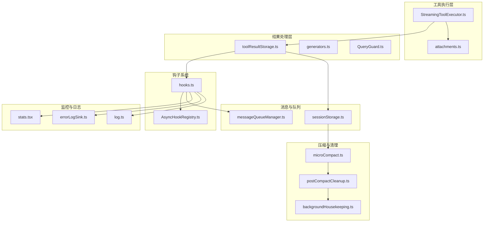
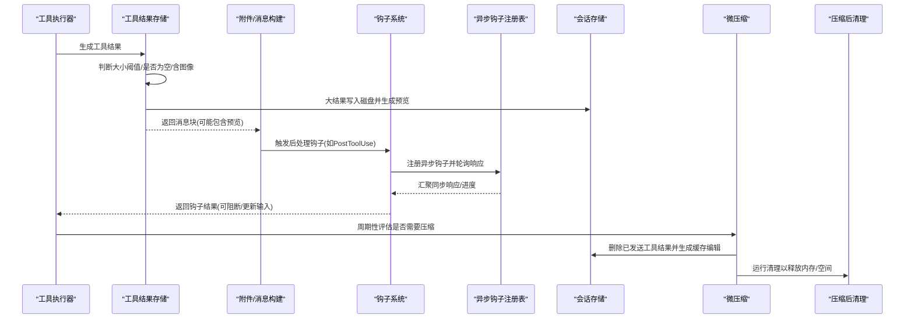
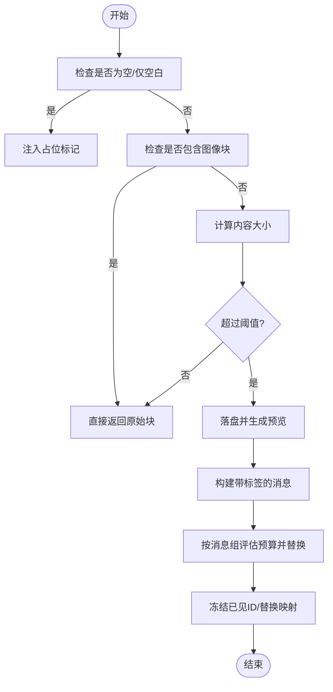
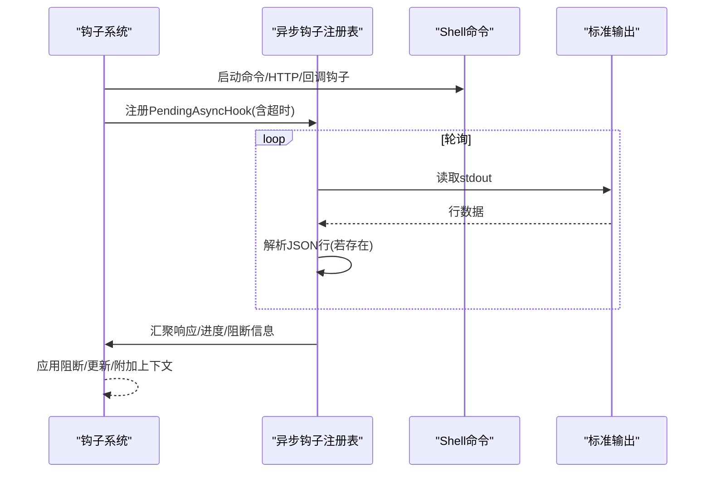
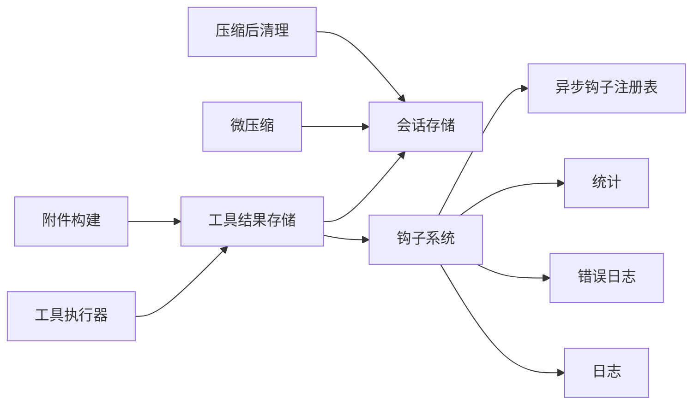

# 结果处理机制

<cite>
**本文档引用的文件**
- [toolResultStorage.ts](file://src/utils/toolResultStorage.ts)
- [hooks.ts](file://src/utils/hooks.ts)
- [AsyncHookRegistry.ts](file://src/utils/hooks/AsyncHookRegistry.ts)
- [attachments.ts](file://src/utils/attachments.ts)
- [StreamingToolExecutor.ts](file://src/services/tools/StreamingToolExecutor.ts)
- [generators.ts](file://src/utils/generators.ts)
- [QueryGuard.ts](file://src/utils/QueryGuard.ts)
- [messageQueueManager.ts](file://src/utils/messageQueueManager.ts)
- [sessionStorage.ts](file://src/utils/sessionStorage.ts)
- [microCompact.ts](file://src/services/compact/microCompact.ts)
- [postCompactCleanup.ts](file://src/services/compact/postCompactCleanup.ts)
- [backgroundHousekeeping.ts](file://src/utils/backgroundHousekeeping.ts)
- [stats.tsx](file://src/context/stats.tsx)
- [errorLogSink.ts](file://src/utils/errorLogSink.ts)
- [log.ts](file://src/utils/log.ts)
</cite>

## 目录
1. [简介](#简介)
2. [项目结构](#项目结构)
3. [核心组件](#核心组件)
4. [架构总览](#架构总览)
5. [详细组件分析](#详细组件分析)
6. [依赖关系分析](#依赖关系分析)
7. [性能考虑](#性能考虑)
8. [故障排除指南](#故障排除指南)
9. [结论](#结论)

## 简介
本文件系统性阐述该代码库中“工具结果处理机制”的完整流程与实现细节，覆盖以下关键主题：
- 工具结果的收集、存储、过滤与格式化
- 结果预算控制与内存管理策略
- 结果钩子系统的触发机制与数据转换管道（预处理、后处理、聚合）
- 结果的序列化、缓存与持久化（临时存储、长期保存、清理策略）
- 性能优化技术（批量处理、异步处理、资源回收）
- 错误恢复策略、调试方法与性能监控指标

## 项目结构
围绕“结果处理”，相关模块主要分布在以下路径：
- 工具结果存储与预算：src/utils/toolResultStorage.ts
- 钩子系统与异步钩子注册：src/utils/hooks.ts、src/utils/hooks/AsyncHookRegistry.ts
- 附件与消息构建：src/utils/attachments.ts
- 工具执行与并发控制：src/services/tools/StreamingToolExecutor.ts
- 并发与生成器工具：src/utils/generators.ts、src/utils/QueryGuard.ts
- 消息队列与命令调度：src/utils/messageQueueManager.ts
- 会话存储与压缩：src/utils/sessionStorage.ts、src/services/compact/microCompact.ts、src/services/compact/postCompactCleanup.ts
- 背景清理与资源回收：src/utils/backgroundHousekeeping.ts
- 统计与日志：src/context/stats.tsx、src/utils/errorLogSink.ts、src/utils/log.ts

**图表来源**
- [toolResultStorage.ts:1-1041](file://src/utils/toolResultStorage.ts#L1-L1041)
- [hooks.ts:1-5023](file://src/utils/hooks.ts#L1-L5023)
- [AsyncHookRegistry.ts:1-310](file://src/utils/hooks/AsyncHookRegistry.ts#L1-L310)
- [attachments.ts:2388-2439](file://src/utils/attachments.ts#L2388-L2439)
- [StreamingToolExecutor.ts:123-151](file://src/services/tools/StreamingToolExecutor.ts#L123-L151)
- [generators.ts:1-89](file://src/utils/generators.ts#L1-L89)
- [QueryGuard.ts:45-80](file://src/utils/QueryGuard.ts#L45-L80)
- [messageQueueManager.ts:189-238](file://src/utils/messageQueueManager.ts#L189-L238)
- [sessionStorage.ts:1983-2061](file://src/utils/sessionStorage.ts#L1983-L2061)
- [microCompact.ts:332-367](file://src/services/compact/microCompact.ts#L332-L367)
- [postCompactCleanup.ts:31-39](file://src/services/compact/postCompactCleanup.ts#L31-L39)
- [backgroundHousekeeping.ts:74-94](file://src/utils/backgroundHousekeeping.ts#L74-L94)
- [stats.tsx:38-88](file://src/context/stats.tsx#L38-L88)
- [errorLogSink.ts:212-235](file://src/utils/errorLogSink.ts#L212-L235)
- [log.ts:201-223](file://src/utils/log.ts#L201-L223)

**章节来源**
- [toolResultStorage.ts:1-1041](file://src/utils/toolResultStorage.ts#L1-L1041)
- [hooks.ts:1-5023](file://src/utils/hooks.ts#L1-L5023)
- [AsyncHookRegistry.ts:1-310](file://src/utils/hooks/AsyncHookRegistry.ts#L1-L310)

## 核心组件
- 工具结果存储与预算控制：负责大结果落盘、预览生成、按消息粒度预算强制替换、提示词缓存稳定性保障。
- 钩子系统：统一的事件驱动扩展点，支持命令、HTTP、回调、函数等类型，具备同步/异步执行、超时、阻断能力。
- 异步钩子注册表：维护后台钩子生命周期、进度上报、响应收集与清理。
- 附件与消息构建：将工具结果包装为消息块，处理空结果占位、图像块跳过、预览模板等。
- 工具执行与并发控制：串行/并发工具执行、顺序约束、并发安全判断。
- 消息队列与命令调度：优先级队列、批量出队、去重与移除。
- 会话存储与压缩：微压缩、缓存编辑、历史裁剪、持久化记录重建。
- 背景清理与资源回收：定时清理旧会话、版本、日志、缓存等。

**章节来源**
- [toolResultStorage.ts:1-1041](file://src/utils/toolResultStorage.ts#L1-L1041)
- [hooks.ts:1-5023](file://src/utils/hooks.ts#L1-L5023)
- [AsyncHookRegistry.ts:1-310](file://src/utils/hooks/AsyncHookRegistry.ts#L1-L310)
- [attachments.ts:2388-2439](file://src/utils/attachments.ts#L2388-L2439)
- [StreamingToolExecutor.ts:123-151](file://src/services/tools/StreamingToolExecutor.ts#L123-L151)
- [messageQueueManager.ts:189-238](file://src/utils/messageQueueManager.ts#L189-L238)
- [sessionStorage.ts:1983-2061](file://src/utils/sessionStorage.ts#L1983-L2061)
- [microCompact.ts:332-367](file://src/services/compact/microCompact.ts#L332-L367)
- [postCompactCleanup.ts:31-39](file://src/services/compact/postCompactCleanup.ts#L31-L39)
- [backgroundHousekeeping.ts:74-94](file://src/utils/backgroundHousekeeping.ts#L74-L94)

## 架构总览
下图展示从工具执行到结果落盘、预算控制、钩子触发与清理回收的整体流程：

**图表来源**
- [toolResultStorage.ts:205-334](file://src/utils/toolResultStorage.ts#L205-L334)
- [attachments.ts:2426-2439](file://src/utils/attachments.ts#L2426-L2439)
- [hooks.ts:2906-2934](file://src/utils/hooks.ts#L2906-L2934)
- [AsyncHookRegistry.ts:113-267](file://src/utils/hooks/AsyncHookRegistry.ts#L113-L267)
- [microCompact.ts:332-367](file://src/services/compact/microCompact.ts#L332-L367)
- [postCompactCleanup.ts:31-39](file://src/services/compact/postCompactCleanup.ts#L31-L39)

## 详细组件分析

### 工具结果存储与预算控制
- 处理流程
  - 将工具结果映射为API块参数，计算内容大小。
  - 若为空或仅空白文本，注入占位标记以避免模型停顿。
  - 若包含图像块，直接透传不落盘。
  - 超过阈值则落盘并生成预览；否则原样返回。
  - 按消息组独立评估预算，选择最大结果替换，确保提示词缓存前缀稳定。
- 关键特性
  - per-tool阈值与per-message预算双层控制。
  - 替换决策跨回合冻结，保证prompt cache一致性。
  - 记录替换记录用于转录恢复与审计。
- 存储与清理
  - 会话目录内按tool-use-id命名文件，避免重复写入。
  - 微压缩阶段删除已发送结果文件，减少磁盘占用。

**图表来源**
- [toolResultStorage.ts:272-334](file://src/utils/toolResultStorage.ts#L272-L334)
- [toolResultStorage.ts:769-909](file://src/utils/toolResultStorage.ts#L769-L909)

**章节来源**
- [toolResultStorage.ts:1-1041](file://src/utils/toolResultStorage.ts#L1-L1041)

### 钩子系统与异步钩子注册
- 触发机制
  - 支持多种事件：SessionStart/SessionEnd、Setup、PreToolUse、PostToolUse、PermissionRequest、Elicitation、文件变更等。
  - 同步钩子直接解析JSON输出，异步钩子通过注册表轮询stdout中的JSON行。
- 数据转换管道
  - 输入标准化：统一注入会话ID、转录路径、工作目录等上下文。
  - 输出解析：校验JSON结构，提取决策、系统消息、权限行为、额外上下文等。
  - 阻断与更新：根据决策阻断后续流程或更新工具输入/输出。
- 异步钩子生命周期
  - 注册：记录进程ID、命令、超时、Shell命令句柄。
  - 轮询：扫描stdout中的JSON行，解析为同步响应。
  - 清理：完成或取消后停止进度间隔、清理任务输出、移除注册项。

**图表来源**
- [hooks.ts:382-451](file://src/utils/hooks.ts#L382-L451)
- [AsyncHookRegistry.ts:113-267](file://src/utils/hooks/AsyncHookRegistry.ts#L113-L267)

**章节来源**
- [hooks.ts:1-5023](file://src/utils/hooks.ts#L1-L5023)
- [AsyncHookRegistry.ts:1-310](file://src/utils/hooks/AsyncHookRegistry.ts#L1-L310)

### 附件与消息构建
- 工具结果块类型识别与验证，确保只对纯文本块进行预览与替换。
- 对空结果注入占位字符串，避免模型在尾部停顿。
- 构建“过大结果”消息模板，包含原始大小、文件路径与预览片段。

**章节来源**
- [attachments.ts:2426-2439](file://src/utils/attachments.ts#L2426-L2439)
- [toolResultStorage.ts:280-334](file://src/utils/toolResultStorage.ts#L280-L334)

### 工具执行与并发控制
- 串行/并发执行策略：非并发工具需等待当前执行队列清空；并发安全工具允许同批并发。
- 执行队列推进：按顺序尝试启动可执行工具，遇到阻塞即停止推进以维持顺序。
- 与生成器并发：通过并发生成器运行多个异步任务，限制并发度并及时产出结果。

**章节来源**
- [StreamingToolExecutor.ts:123-151](file://src/services/tools/StreamingToolExecutor.ts#L123-L151)
- [generators.ts:32-72](file://src/utils/generators.ts#L32-L72)

### 消息队列与命令调度
- 优先级队列：按优先级排序，支持peek、dequeue、dequeueAll、remove等操作。
- 去重与批量处理：支持按谓词匹配批量出队，保持原有优先级顺序。
- 与钩子集成：通知钩子执行状态，支持任务通知与队列处理器唤醒。

**章节来源**
- [messageQueueManager.ts:189-238](file://src/utils/messageQueueManager.ts#L189-L238)
- [messageQueueManager.ts:240-292](file://src/utils/messageQueueManager.ts#L240-L292)

### 会话存储与压缩
- 会话目录结构：每个会话拥有独立tool-results子目录，按tool-use-id命名文件。
- 微压缩：周期性删除已发送工具结果，生成缓存编辑，降低内存与磁盘压力。
- 压缩后清理：释放无效跟踪状态，避免跨线程共享模块状态被污染。

**章节来源**
- [sessionStorage.ts:1983-2061](file://src/utils/sessionStorage.ts#L1983-L2061)
- [microCompact.ts:332-367](file://src/services/compact/microCompact.ts#L332-L367)
- [postCompactCleanup.ts:31-39](file://src/services/compact/postCompactCleanup.ts#L31-L39)

### 背景清理与资源回收
- 定时清理：清理旧版本、日志、会话文件、计划文件、文件历史备份、会话环境目录、图片缓存、粘贴板等。
- 长期运行会话：每24小时循环清理，使用标记文件与锁避免重复执行。
- Ant用户专属：清理npm缓存与版本，提升磁盘利用率。

**章节来源**
- [backgroundHousekeeping.ts:74-94](file://src/utils/backgroundHousekeeping.ts#L74-L94)
- [backgroundHousekeeping.ts:575-602](file://src/utils/backgroundHousekeeping.ts#L575-L602)

## 依赖关系分析
- 工具结果存储依赖会话存储与阈值配置，受预算控制影响。
- 钩子系统依赖异步钩子注册表进行后台钩子生命周期管理。
- 工具执行器与附件构建共同决定消息块的最终形态。
- 微压缩与压缩后清理依赖会话存储与消息历史，确保删除与重建的一致性。
- 统计与日志模块贯穿整个流程，提供可观测性与问题定位能力。

**图表来源**
- [toolResultStorage.ts:1-1041](file://src/utils/toolResultStorage.ts#L1-L1041)
- [hooks.ts:1-5023](file://src/utils/hooks.ts#L1-L5023)
- [AsyncHookRegistry.ts:1-310](file://src/utils/hooks/AsyncHookRegistry.ts#L1-L310)
- [StreamingToolExecutor.ts:123-151](file://src/services/tools/StreamingToolExecutor.ts#L123-L151)
- [attachments.ts:2426-2439](file://src/utils/attachments.ts#L2426-L2439)
- [sessionStorage.ts:1983-2061](file://src/utils/sessionStorage.ts#L1983-L2061)
- [microCompact.ts:332-367](file://src/services/compact/microCompact.ts#L332-L367)
- [postCompactCleanup.ts:31-39](file://src/services/compact/postCompactCleanup.ts#L31-L39)
- [stats.tsx:38-88](file://src/context/stats.tsx#L38-L88)
- [errorLogSink.ts:212-235](file://src/utils/errorLogSink.ts#L212-L235)
- [log.ts:201-223](file://src/utils/log.ts#L201-L223)

**章节来源**
- [toolResultStorage.ts:1-1041](file://src/utils/toolResultStorage.ts#L1-L1041)
- [hooks.ts:1-5023](file://src/utils/hooks.ts#L1-L5023)
- [AsyncHookRegistry.ts:1-310](file://src/utils/hooks/AsyncHookRegistry.ts#L1-L310)

## 性能考虑
- 批量处理与并发控制
  - 使用并发生成器运行多个异步任务，限制并发度并及时产出结果。
  - 工具执行器按顺序推进，避免非并发工具的竞态冲突。
- 异步处理与资源回收
  - 异步钩子通过注册表轮询stdout，避免阻塞主线程。
  - 压缩后清理释放无效跟踪状态，防止内存泄漏。
- 内存管理策略
  - 预算控制与落盘策略减少内存峰值。
  - 微压缩定期删除已发送结果文件，降低磁盘与内存压力。
- 资源回收
  - 定时清理旧会话、版本、日志、缓存，释放磁盘空间。
  - 会话环境缓存失效与重建，避免陈旧配置影响性能。

**章节来源**
- [generators.ts:32-72](file://src/utils/generators.ts#L32-L72)
- [StreamingToolExecutor.ts:123-151](file://src/services/tools/StreamingToolExecutor.ts#L123-L151)
- [AsyncHookRegistry.ts:113-267](file://src/utils/hooks/AsyncHookRegistry.ts#L113-L267)
- [postCompactCleanup.ts:31-39](file://src/services/compact/postCompactCleanup.ts#L31-L39)
- [backgroundHousekeeping.ts:74-94](file://src/utils/backgroundHousekeeping.ts#L74-L94)

## 故障排除指南
- 钩子执行失败
  - 检查钩子JSON输出是否符合schema，关注阻断错误与权限决策。
  - 对于异步钩子，确认stdout中是否存在有效JSON行，核对超时设置。
- 工具结果未落盘
  - 确认内容是否包含图像块（图像块不落盘）。
  - 检查阈值配置与文件系统权限，查看错误日志定位具体原因。
- 预算替换异常
  - 核对消息组边界与工具名称映射，确保替换决策一致。
  - 查看替换记录是否正确写入转录，以便恢复时重建状态。
- 性能问题
  - 监控钩子耗时直方图与平均值，定位慢钩子。
  - 检查并发度设置与队列积压情况，必要时调整并发策略。

**章节来源**
- [hooks.ts:382-451](file://src/utils/hooks.ts#L382-L451)
- [AsyncHookRegistry.ts:113-267](file://src/utils/hooks/AsyncHookRegistry.ts#L113-L267)
- [toolResultStorage.ts:853-909](file://src/utils/toolResultStorage.ts#L853-L909)
- [stats.tsx:38-88](file://src/context/stats.tsx#L38-L88)
- [errorLogSink.ts:212-235](file://src/utils/errorLogSink.ts#L212-L235)
- [log.ts:201-223](file://src/utils/log.ts#L201-L223)

## 结论
该结果处理机制通过“工具结果存储与预算控制 + 钩子系统 + 异步钩子注册表 + 附件构建 + 并发执行与队列调度 + 会话存储与压缩 + 背景清理”的协同，实现了高吞吐、低内存、可恢复且可观测的结果处理闭环。其核心优势在于：
- 双层预算控制保障提示词缓存稳定性与内存安全
- 统一的钩子框架支持灵活扩展与阻断控制
- 异步钩子与并发执行提升整体吞吐
- 微压缩与背景清理降低长期运行成本
- 全链路统计与日志为性能优化与故障排查提供支撑