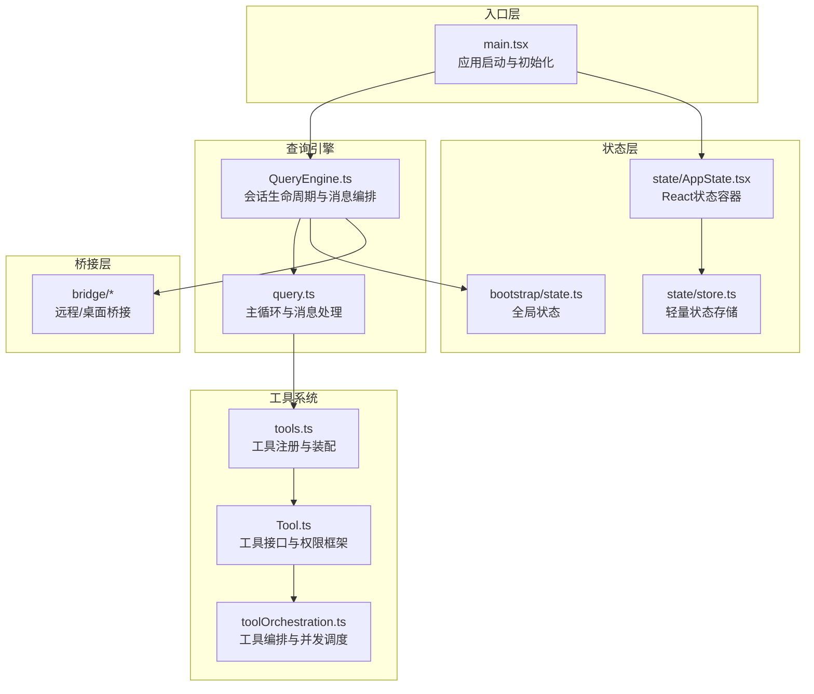
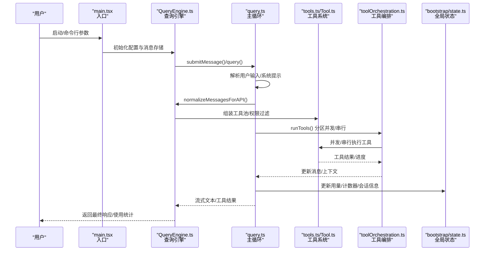
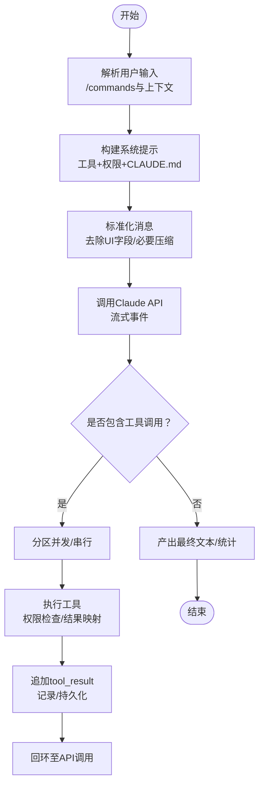
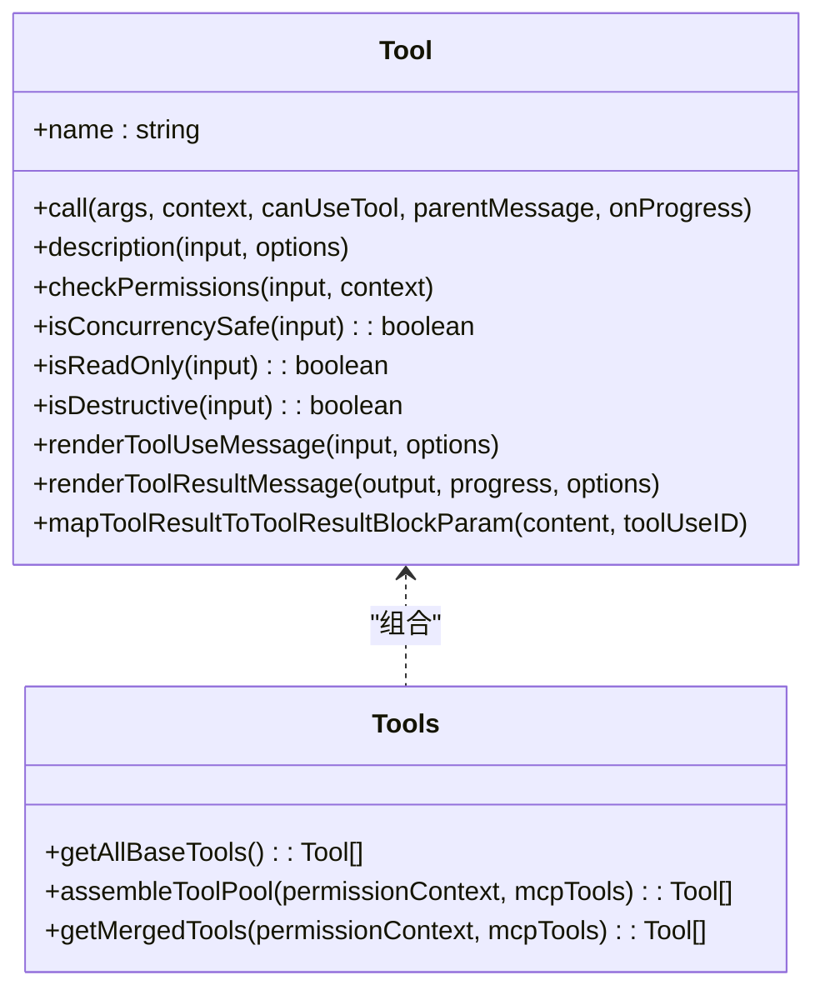
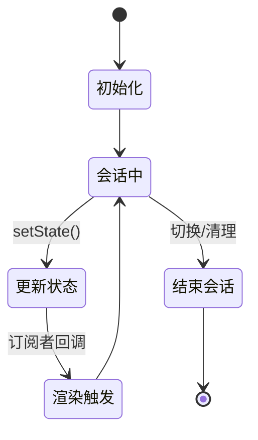
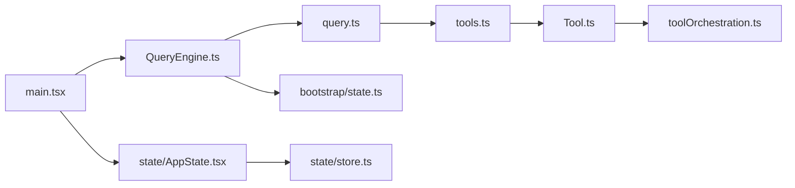

# 数据流设计

<cite>
**本文引用的文件**
- [README.md](file://README.md)
- [main.tsx](file://src/main.tsx)
- [state.ts](file://src/bootstrap/state.ts)
- [AppState.tsx](file://src/state/AppState.tsx)
- [store.ts](file://src/state/store.ts)
- [QueryEngine.ts](file://src/QueryEngine.ts)
- [query.ts](file://src/query.ts)
- [tools.ts](file://src/tools.ts)
- [Tool.ts](file://src/Tool.ts)
- [toolOrchestration.ts](file://src/services/tools/toolOrchestration.ts)
</cite>

## 目录
1. [引言](#引言)
2. [项目结构](#项目结构)
3. [核心组件](#核心组件)
4. [架构总览](#架构总览)
5. [详细组件分析](#详细组件分析)
6. [依赖关系分析](#依赖关系分析)
7. [性能考虑](#性能考虑)
8. [故障排查指南](#故障排查指南)
9. [结论](#结论)

## 引言
本文件面向Claude Code的“数据流设计”，聚焦从用户输入到最终响应的完整数据流转路径，涵盖输入解析、上下文构建、工具调用、结果处理、状态管理、缓存与性能优化、以及错误处理与异常恢复。文档以代码为依据，通过分层讲解与可视化图示帮助读者快速理解系统如何在多线程、并发与异步场景下保持一致性与可扩展性。

## 项目结构
Claude Code采用“入口层 → 查询引擎 → 工具系统/服务层 → 状态层 → 桥接层”的分层架构。入口层负责初始化与命令解析；查询引擎负责会话生命周期与消息编排；工具系统负责能力扩展与权限控制；状态层提供全局与局部状态；桥接层支持远程/桌面集成。

**图表来源**
- [main.tsx:585-800](file://src/main.tsx#L585-L800)
- [QueryEngine.ts:184-200](file://src/QueryEngine.ts#L184-L200)
- [query.ts:1-200](file://src/query.ts#L1-L200)
- [tools.ts:190-390](file://src/tools.ts#L190-L390)
- [Tool.ts:362-793](file://src/Tool.ts#L362-L793)
- [toolOrchestration.ts:19-189](file://src/services/tools/toolOrchestration.ts#L19-L189)
- [state.ts:45-257](file://src/bootstrap/state.ts#L45-L257)
- [AppState.tsx:1-200](file://src/state/AppState.tsx#L1-L200)
- [store.ts:1-35](file://src/state/store.ts#L1-L35)

**章节来源**
- [README.md:383-446](file://README.md#L383-L446)
- [main.tsx:585-800](file://src/main.tsx#L585-L800)

## 核心组件
- 入口与启动：负责环境准备、信任建立、延迟预取、设置加载与渲染引导。
- 查询引擎：封装会话生命周期，协调消息、系统提示、工具池与执行器。
- 主查询循环：解析用户输入、组装系统提示、调用Claude API、处理流式事件、编排工具调用与上下文压缩。
- 工具系统：统一的工具接口、权限检查、并发安全判定、结果映射与UI渲染。
- 状态层：全局状态（会话、用量、计数器）与React状态容器（订阅/更新）。

**章节来源**
- [README.md:226-246](file://README.md#L226-L246)
- [QueryEngine.ts:184-200](file://src/QueryEngine.ts#L184-L200)
- [query.ts:181-200](file://src/query.ts#L181-L200)
- [Tool.ts:362-793](file://src/Tool.ts#L362-L793)
- [state.ts:45-257](file://src/bootstrap/state.ts#L45-L257)
- [AppState.tsx:1-200](file://src/state/AppState.tsx#L1-L200)

## 架构总览
下图展示一次完整查询从入口到响应的关键数据流与组件交互：

**图表来源**
- [main.tsx:585-800](file://src/main.tsx#L585-L800)
- [QueryEngine.ts:184-200](file://src/QueryEngine.ts#L184-L200)
- [query.ts:181-200](file://src/query.ts#L181-L200)
- [tools.ts:345-390](file://src/tools.ts#L345-L390)
- [Tool.ts:362-793](file://src/Tool.ts#L362-L793)
- [toolOrchestration.ts:19-189](file://src/services/tools/toolOrchestration.ts#L19-L189)
- [state.ts:543-621](file://src/bootstrap/state.ts#L543-L621)

## 详细组件分析

### 入口与启动（main.tsx）
- 负责延迟预取（用户、系统上下文、提示、认证凭据）、设置加载、特性门控（feature gates）、插件与技能加载、遥测初始化。
- 控制是否进入非交互模式、是否启用调试、是否跳过信任对话框等。
- 为后续REPL/SDK提供稳定的运行时环境。

**章节来源**
- [main.tsx:307-321](file://src/main.tsx#L307-L321)
- [main.tsx:388-431](file://src/main.tsx#L388-L431)
- [main.tsx:517-540](file://src/main.tsx#L517-L540)
- [main.tsx:585-800](file://src/main.tsx#L585-L800)

### 查询引擎（QueryEngine.ts）
- 封装单次会话的生命周期，维护消息列表、用量、权限拒绝记录、文件缓存等。
- 提供submitMessage()等对外接口，协调系统提示构建、用户输入处理、工具池装配与执行器调用。
- 支持历史截断（snip）、上下文折叠（collapse）、任务预算等高级能力。

**章节来源**
- [QueryEngine.ts:184-200](file://src/QueryEngine.ts#L184-L200)
- [QueryEngine.ts:130-173](file://src/QueryEngine.ts#L130-L173)

### 主查询循环（query.ts）
- 输入解析：识别/commands、转义/宏替换、上下文注入。
- 上下文构建：系统提示片段拼装、CLAUDE.md嵌入、内存附件预取。
- API调用：标准化消息格式、流式事件处理、最大输出令牌恢复保护。
- 工具编排：根据并发安全属性分区执行、串行/并行混合调度。
- 压缩与持久化：自动压缩、边界标记、会话日志写入。

**图表来源**
- [query.ts:181-200](file://src/query.ts#L181-L200)
- [query.ts:123-149](file://src/query.ts#L123-L149)
- [toolOrchestration.ts:84-116](file://src/services/tools/toolOrchestration.ts#L84-L116)

**章节来源**
- [query.ts:123-149](file://src/query.ts#L123-L149)
- [query.ts:175-179](file://src/query.ts#L175-L179)
- [toolOrchestration.ts:84-116](file://src/services/tools/toolOrchestration.ts#L84-L116)

### 工具系统（tools.ts / Tool.ts）
- 工具注册：按环境/特性门控动态装配内置工具与MCP工具，去重与排序保证提示缓存稳定。
- 权限框架：统一的权限检查点，支持“允许/拒绝/询问”三态与规则匹配。
- 接口契约：call/description/isConcurrencySafe/isReadOnly/isDestructive等方法定义。
- 结果映射：将工具输出映射为API块参数，支持UI渲染与搜索索引。

**图表来源**
- [Tool.ts:362-793](file://src/Tool.ts#L362-L793)
- [tools.ts:190-390](file://src/tools.ts#L190-L390)

**章节来源**
- [tools.ts:190-390](file://src/tools.ts#L190-L390)
- [Tool.ts:362-793](file://src/Tool.ts#L362-L793)

### 工具编排（toolOrchestration.ts）
- 分区策略：将连续只读工具合并为并发批次，非只读工具串行执行，确保资源一致性。
- 并发限制：通过环境变量控制最大并发度，避免资源争用。
- 上下文修改：支持工具在执行过程中对上下文进行增量修改，并在批次结束后应用。

**章节来源**
- [toolOrchestration.ts:19-189](file://src/services/tools/toolOrchestration.ts#L19-L189)

### 状态管理（bootstrap/state.ts / state/AppState.tsx / state/store.ts）
- 全局状态（bootstrap/state.ts）：会话ID、用量统计、计时器、模型使用、提示缓存开关、错误日志、计划/任务跟踪等。
- React状态容器（AppState.tsx）：提供useAppState/useSetAppState钩子，基于订阅-发布实现细粒度更新。
- 轻量存储（store.ts）：最小化实现，支持getState/setState/subscribe，onChange回调用于副作用。

**图表来源**
- [state.ts:45-257](file://src/bootstrap/state.ts#L45-L257)
- [AppState.tsx:117-179](file://src/state/AppState.tsx#L117-L179)
- [store.ts:1-35](file://src/state/store.ts#L1-L35)

**章节来源**
- [state.ts:45-257](file://src/bootstrap/state.ts#L45-L257)
- [AppState.tsx:117-179](file://src/state/AppState.tsx#L117-L179)
- [store.ts:1-35](file://src/state/store.ts#L1-L35)

## 依赖关系分析
- 入口层依赖状态层与服务层（遥测、设置、插件），为查询引擎提供稳定上下文。
- 查询引擎依赖工具系统与状态层，负责消息编排与用量统计。
- 工具系统依赖权限框架与UI渲染，提供一致的工具行为与可观测性。
- 状态层内部通过订阅机制解耦，避免循环依赖。

**图表来源**
- [main.tsx:585-800](file://src/main.tsx#L585-L800)
- [QueryEngine.ts:184-200](file://src/QueryEngine.ts#L184-L200)
- [query.ts:1-200](file://src/query.ts#L1-L200)
- [tools.ts:190-390](file://src/tools.ts#L190-L390)
- [Tool.ts:362-793](file://src/Tool.ts#L362-L793)
- [toolOrchestration.ts:19-189](file://src/services/tools/toolOrchestration.ts#L19-L189)
- [state.ts:45-257](file://src/bootstrap/state.ts#L45-L257)
- [AppState.tsx:1-200](file://src/state/AppState.tsx#L1-L200)
- [store.ts:1-35](file://src/state/store.ts#L1-L35)

**章节来源**
- [README.md:383-446](file://README.md#L383-L446)

## 性能考虑
- 延迟预取：在首次渲染后异步拉起用户上下文、系统状态、提示、认证凭据与模型能力，减少首查询等待。
- 并发工具执行：对只读工具进行批量并发，受环境变量限制，避免过度竞争。
- 上下文压缩：自动压缩旧消息、边界标记、可选的历史截断与上下文折叠，降低token占用。
- 缓存与提示缓存：系统提示片段缓存、提示缓存1小时白名单与资格缓存，结合头部Latch避免频繁失效。
- 用量与预算：每轮次快照输出token、预算续投计数，配合任务预算参数控制输出规模。

**章节来源**
- [main.tsx:388-431](file://src/main.tsx#L388-L431)
- [toolOrchestration.ts:8-12](file://src/services/tools/toolOrchestration.ts#L8-L12)
- [state.ts:724-743](file://src/bootstrap/state.ts#L724-L743)
- [query.ts:107-111](file://src/query.ts#L107-L111)

## 故障排查指南
- 最大输出令牌错误：在恢复循环完成前隐藏该错误，避免SDK消费者提前终止会话。
- 工具缺失结果块：在严格配对模式下，为缺失的tool_result生成中断消息，加速失败检测。
- 权限拒绝：记录拒绝详情并在UI中呈现，支持“始终允许/拒绝/询问”策略。
- 错误日志：内存内错误日志便于诊断，结合最近一次API请求与消息集合定位问题。
- 会话持久化：用户消息阻塞写入、助手消息异步队列、进度内联写入，flush策略保障一致性。

**章节来源**
- [query.ts:123-149](file://src/query.ts#L123-L149)
- [query.ts:175-179](file://src/query.ts#L175-L179)
- [state.ts:124-125](file://src/bootstrap/state.ts#L124-L125)
- [QueryEngine.ts:184-200](file://src/QueryEngine.ts#L184-L200)

## 结论
Claude Code的数据流设计围绕“入口层初始化 → 查询引擎编排 → 工具系统执行 → 状态层更新”的主线展开，辅以严格的权限控制、并发调度与上下文压缩策略，确保在复杂多Agent、多工具、多平台场景下的稳定性与性能。通过模块化的状态容器与订阅机制，系统实现了低耦合、高可扩展的数据更新与传播路径，同时保留了丰富的可观测性与可诊断能力。