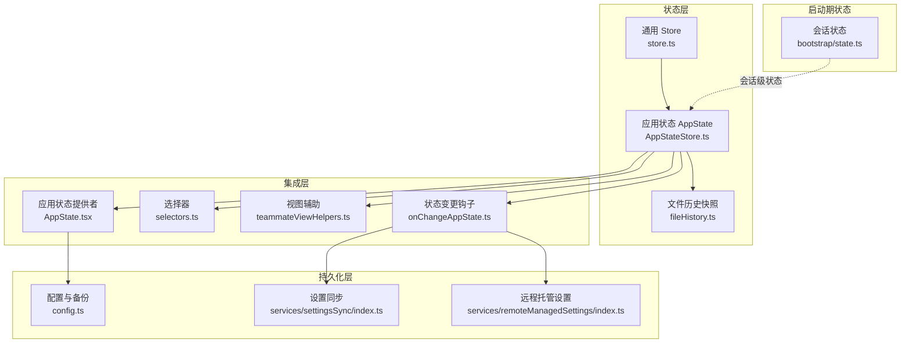
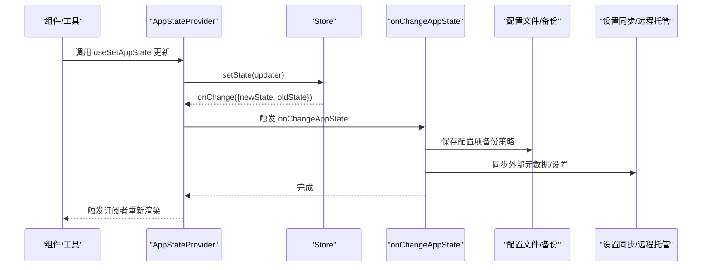
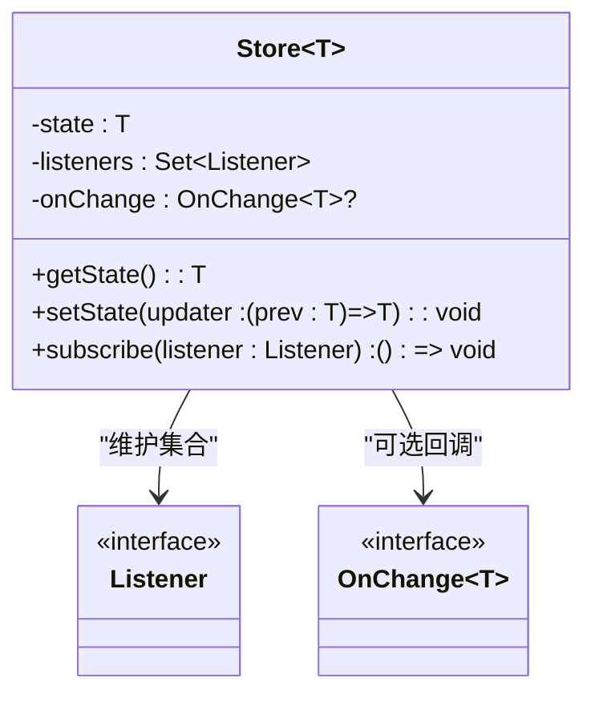
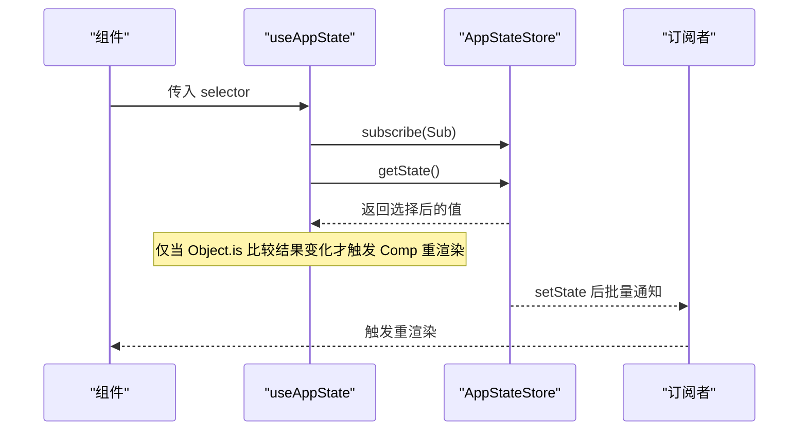
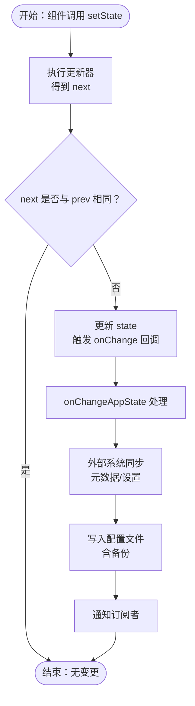
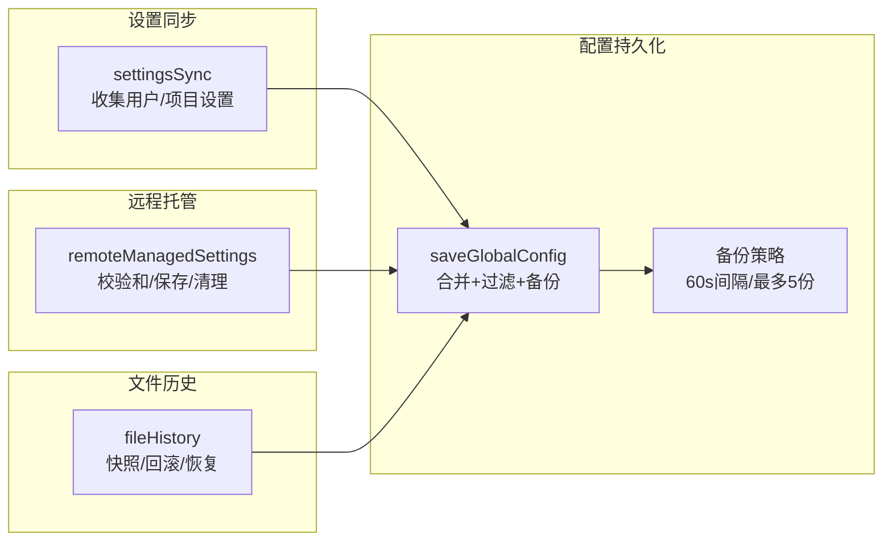
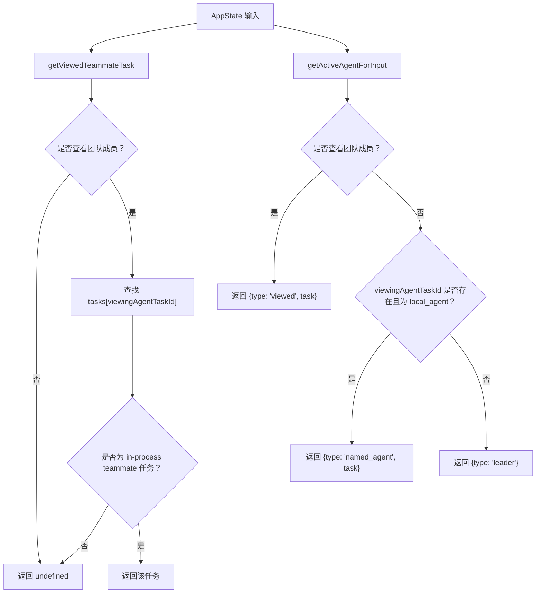
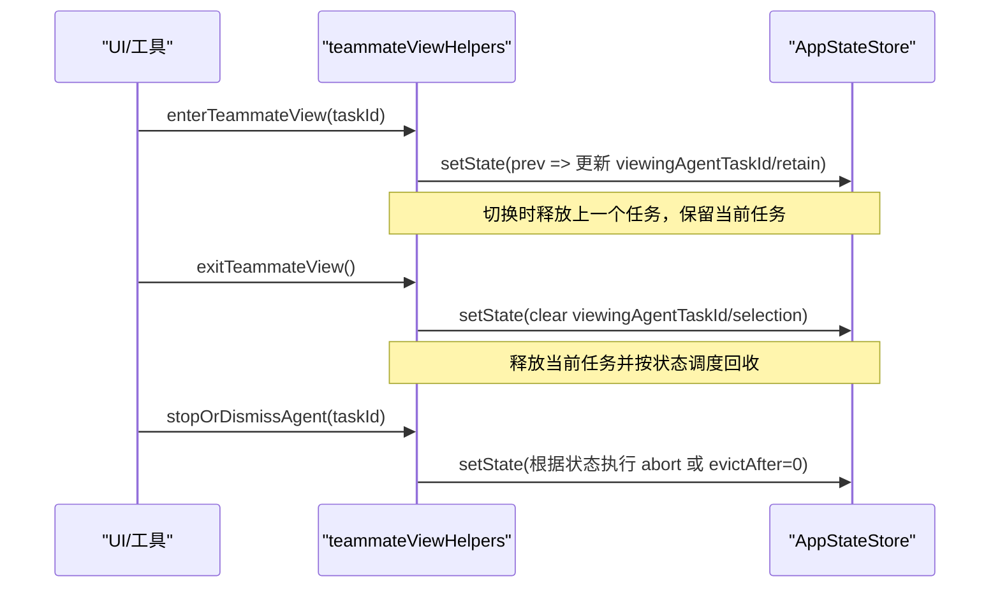
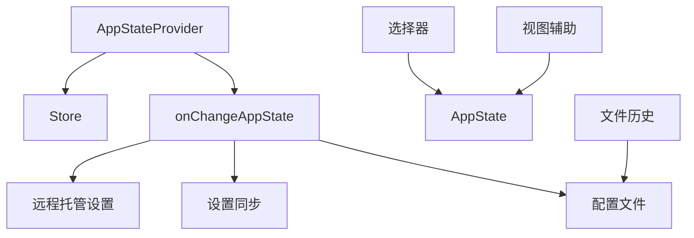

# 状态管理机制

<cite>
**本文档引用的文件**
- [store.ts](file://src/state/store.ts)
- [AppState.tsx](file://src/state/AppState.tsx)
- [AppStateStore.ts](file://src/state/AppStateStore.ts)
- [onChangeAppState.ts](file://src/state/onChangeAppState.ts)
- [selectors.ts](file://src/state/selectors.ts)
- [teammateViewHelpers.ts](file://src/state/teammateViewHelpers.ts)
- [state.ts](file://src/bootstrap/state.ts)
- [config.ts](file://src/utils/config.ts)
- [fileHistory.ts](file://src/utils/fileHistory.ts)
- [settingsSync/index.ts](file://src/services/settingsSync/index.ts)
- [remoteManagedSettings/index.ts](file://src/services/remoteManagedSettings/index.ts)
- [useFileHistorySnapshotInit.ts](file://src/hooks/useFileHistorySnapshotInit.ts)
- [README.md](file://README.md)
</cite>

## 目录
1. [简介](#简介)
2. [项目结构](#项目结构)
3. [核心组件](#核心组件)
4. [架构总览](#架构总览)
5. [详细组件分析](#详细组件分析)
6. [依赖关系分析](#依赖关系分析)
7. [性能考量](#性能考量)
8. [故障排查指南](#故障排查指南)
9. [结论](#结论)
10. [附录](#附录)

## 简介
本文件系统性梳理 Claude Code 的状态管理机制，覆盖全局状态架构、状态更新流程、状态传播路径、持久化策略（本地存储与内存缓存）、订阅与响应式更新、快照/回滚/恢复能力，以及最佳实践与性能优化建议。目标是帮助开发者在不深入源码的前提下理解并正确使用状态系统。

## 项目结构
状态管理相关代码主要集中在以下模块：
- 轻量通用 Store：提供最小可用的状态容器与订阅机制
- 全局应用状态 AppState：集中管理 UI、权限、任务、插件、桥接等全局状态
- 状态变更钩子：onChangeAppState 将关键状态变化同步到外部系统
- 选择器与视图辅助：从 AppState 派生派生状态，简化订阅粒度
- 持久化与同步：配置文件备份、设置同步、远程托管设置、文件历史快照
- 启动期会话状态：与 AppState 并行的进程级状态（非 React）

**图表来源**
- [store.ts:1-35](file://src/state/store.ts#L1-L35)
- [AppStateStore.ts:89-452](file://src/state/AppStateStore.ts#L89-L452)
- [AppState.tsx:37-110](file://src/state/AppState.tsx#L37-L110)
- [onChangeAppState.ts:43-171](file://src/state/onChangeAppState.ts#L43-L171)
- [selectors.ts:1-77](file://src/state/selectors.ts#L1-L77)
- [teammateViewHelpers.ts:46-109](file://src/state/teammateViewHelpers.ts#L46-L109)
- [config.ts:1200-1329](file://src/utils/config.ts#L1200-L1329)
- [settingsSync/index.ts:423-469](file://src/services/settingsSync/index.ts#L423-L469)
- [remoteManagedSettings/index.ts:367-386](file://src/services/remoteManagedSettings/index.ts#L367-L386)
- [state.ts:45-257](file://src/bootstrap/state.ts#L45-L257)

**章节来源**
- [store.ts:1-35](file://src/state/store.ts#L1-L35)
- [AppStateStore.ts:89-452](file://src/state/AppStateStore.ts#L89-L452)
- [AppState.tsx:37-110](file://src/state/AppState.tsx#L37-L110)
- [README.md:819-847](file://README.md#L819-L847)

## 核心组件
- 通用 Store
  - 提供 getState、setState、subscribe 三件套，内部以 Set 维护监听器集合，支持 onChange 回调与批量通知
  - 使用 Object.is 去重相邻相等状态，避免重复渲染
- 应用状态 AppState
  - 覆盖权限、任务、插件、桥接、提示词建议、推测状态、文件历史、通知、MCP 等全栈状态
  - 默认值由 getDefaultAppState 构建，确保首次渲染安全
- 应用状态提供者 AppStateProvider
  - 基于 React Context 暴露 Store，封装订阅与设置更新逻辑
  - 集成设置变更监听、语音/邮箱等上下文包装
- 状态变更钩子 onChangeAppState
  - 在状态变更时触发外部元数据同步（如权限模式、超计划模式）
  - 同步配置项（如 verbose、面板可见性）到全局配置文件，并进行备份
- 选择器与视图辅助
  - 从 AppState 中提取派生状态，降低订阅复杂度
  - 视图辅助处理团队成员视图切换、任务保留/回收等 UI 状态
- 文件历史快照
  - 支持按消息 ID 快照与回滚，记录跟踪文件与备份映射，异步应用到磁盘
- 启动期会话状态
  - 进程级状态（如会话 ID、目录、统计指标），与 AppState 并行存在

**章节来源**
- [store.ts:10-34](file://src/state/store.ts#L10-L34)
- [AppStateStore.ts:456-569](file://src/state/AppStateStore.ts#L456-L569)
- [AppState.tsx:37-110](file://src/state/AppState.tsx#L37-L110)
- [onChangeAppState.ts:43-171](file://src/state/onChangeAppState.ts#L43-L171)
- [selectors.ts:18-76](file://src/state/selectors.ts#L18-L76)
- [teammateViewHelpers.ts:46-141](file://src/state/teammateViewHelpers.ts#L46-L141)
- [fileHistory.ts:347-397](file://src/utils/fileHistory.ts#L347-L397)
- [state.ts:45-257](file://src/bootstrap/state.ts#L45-L257)

## 架构总览
整体采用“轻 Store + React 订阅 + 变更钩子 + 外部同步”的分层设计：
- Store 层：最小化通用状态容器
- AppState 层：集中式全局状态，通过 Provider 注入 React
- 钩子层：onChangeAppState 将关键状态变化广播到外部系统（如 CCR/SDK 元数据、配置文件）
- 持久化层：配置文件备份、设置同步、远程托管设置、文件历史快照

**图表来源**
- [AppState.tsx:142-162](file://src/state/AppState.tsx#L142-L162)
- [store.ts:20-27](file://src/state/store.ts#L20-L27)
- [onChangeAppState.ts:43-171](file://src/state/onChangeAppState.ts#L43-L171)
- [config.ts:1200-1329](file://src/utils/config.ts#L1200-L1329)
- [settingsSync/index.ts:423-469](file://src/services/settingsSync/index.ts#L423-L469)
- [remoteManagedSettings/index.ts:367-386](file://src/services/remoteManagedSettings/index.ts#L367-L386)

## 详细组件分析

### 通用 Store 设计
- 数据结构
  - state：当前状态快照
  - listeners：监听器集合（Set）
  - onChange：可选的变更回调
- 关键方法
  - getState：返回当前状态
  - setState：执行更新器，去重后触发 onChange 与批量通知
  - subscribe：注册监听器，返回取消函数
- 复杂度
  - setState：O(n)（遍历监听器）
  - 订阅：O(1) 插入/删除
- 优化点
  - 使用 Object.is 去重相邻相等状态，避免无效渲染
  - 监听器集合使用 Set，保证唯一性与高效删除

**图表来源**
- [store.ts:4-34](file://src/state/store.ts#L4-L34)

**章节来源**
- [store.ts:10-34](file://src/state/store.ts#L10-L34)

### AppStateProvider 与订阅机制
- 提供 AppStateStore 到 React 上下文
- useAppState(selector) 基于 useSyncExternalStore 实现订阅，仅在 selector 返回值变化时重渲染
- useSetAppState 返回稳定引用的 setState 函数，避免因闭包导致的无意义重渲染
- useAppStateMaybeOutsideOfProvider 提供安全兜底，不在 Provider 内部时返回 undefined

**图表来源**
- [AppState.tsx:142-162](file://src/state/AppState.tsx#L142-L162)
- [store.ts:29-32](file://src/state/store.ts#L29-L32)

**章节来源**
- [AppState.tsx:37-110](file://src/state/AppState.tsx#L37-L110)
- [AppState.tsx:142-179](file://src/state/AppState.tsx#L142-L179)

### 状态更新与传播
- 更新入口
  - React 组件通过 useSetAppState 获取 setState
  - 工具函数通过直接注入的 setState 执行更新
- 传播路径
  - Store.setState 触发 onChange({newState, oldState})
  - AppStateProvider 内部 onChangeAppState 接收变更
  - onChangeAppState 将关键字段同步到外部系统（如 CCR/SDK 元数据）
  - 同步配置项到全局配置文件（带备份策略）

**图表来源**
- [store.ts:20-27](file://src/state/store.ts#L20-L27)
- [onChangeAppState.ts:43-171](file://src/state/onChangeAppState.ts#L43-L171)
- [config.ts:1200-1329](file://src/utils/config.ts#L1200-L1329)

**章节来源**
- [onChangeAppState.ts:43-171](file://src/state/onChangeAppState.ts#L43-L171)

### 状态持久化策略
- 配置文件持久化与备份
  - saveGlobalConfig 采用锁文件合并策略，避免并发写入冲突
  - 自动创建时间戳备份，最多保留最近 5 份，最小间隔 60 秒
  - 写入前过滤默认值，减少冗余
- 设置同步
  - settingsSync 收集用户/项目设置与记忆体内容，生成条目并写入目标路径
- 远程托管设置
  - remoteManagedSettings 支持校验和计算、等待加载完成、保存到文件、清理缓存
- 文件历史快照
  - fileHistory 支持按消息 ID 快照与回滚，记录跟踪文件与备份映射，异步应用到磁盘
  - 支持从日志恢复快照状态，兼容路径缩短

**图表来源**
- [config.ts:1200-1329](file://src/utils/config.ts#L1200-L1329)
- [settingsSync/index.ts:423-469](file://src/services/settingsSync/index.ts#L423-L469)
- [remoteManagedSettings/index.ts:367-386](file://src/services/remoteManagedSettings/index.ts#L367-L386)
- [fileHistory.ts:347-397](file://src/utils/fileHistory.ts#L347-L397)

**章节来源**
- [config.ts:1200-1329](file://src/utils/config.ts#L1200-L1329)
- [settingsSync/index.ts:423-469](file://src/services/settingsSync/index.ts#L423-L469)
- [remoteManagedSettings/index.ts:367-386](file://src/services/remoteManagedSettings/index.ts#L367-L386)
- [fileHistory.ts:347-397](file://src/utils/fileHistory.ts#L347-L397)

### 选择器与派生状态
- 选择器保持纯函数特性，仅做数据提取，不产生副作用
- getViewedTeammateTask：根据 viewingAgentTaskId 与 tasks 映射获取当前查看的团队成员任务
- getActiveAgentForInput：根据视图状态与任务类型判断输入路由目标（leader/viewed/named_agent）

**图表来源**
- [selectors.ts:18-76](file://src/state/selectors.ts#L18-L76)

**章节来源**
- [selectors.ts:1-77](file://src/state/selectors.ts#L1-L77)

### 视图辅助与状态快照/回滚
- enterTeammateView：进入团队成员视图，必要时释放上一个任务，设置 retain 与清除 evictAfter
- exitTeammateView：退出视图，释放当前任务并按终端状态调度回收
- stopOrDismissAgent：运行中任务调用 abort；终端任务标记 evictAfter=0 立即隐藏
- 文件历史快照/回滚
  - fileHistoryRewind：按消息 ID 回滚到目标快照，异步应用磁盘变更
  - fileHistoryGetDiffStats：预估回滚影响范围（变更文件数量）
  - useFileHistorySnapshotInit：从日志恢复快照状态

**图表来源**
- [teammateViewHelpers.ts:46-141](file://src/state/teammateViewHelpers.ts#L46-L141)

**章节来源**
- [teammateViewHelpers.ts:46-141](file://src/state/teammateViewHelpers.ts#L46-L141)
- [fileHistory.ts:347-397](file://src/utils/fileHistory.ts#L347-L397)
- [useFileHistorySnapshotInit.ts:9-25](file://src/hooks/useFileHistorySnapshotInit.ts#L9-L25)

### 启动期会话状态
- bootstrap/state.ts 定义了进程级会话状态（如会话 ID、目录、统计指标、频道允许列表等）
- 与 AppState 并行存在，用于跨模块共享启动期信息（如会话切换信号）

**章节来源**
- [state.ts:45-257](file://src/bootstrap/state.ts#L45-L257)

## 依赖关系分析
- 组件耦合
  - AppStateProvider 依赖 Store 与 getDefaultAppState
  - onChangeAppState 依赖配置与外部元数据推送
  - 选择器与视图辅助依赖 AppState 类型定义
- 外部依赖
  - 配置文件读写、备份、锁文件
  - 设置同步服务与远程托管设置服务
  - 文件历史快照与磁盘 IO

**图表来源**
- [AppState.tsx:37-110](file://src/state/AppState.tsx#L37-L110)
- [onChangeAppState.ts:43-171](file://src/state/onChangeAppState.ts#L43-L171)
- [config.ts:1200-1329](file://src/utils/config.ts#L1200-L1329)
- [settingsSync/index.ts:423-469](file://src/services/settingsSync/index.ts#L423-L469)
- [remoteManagedSettings/index.ts:367-386](file://src/services/remoteManagedSettings/index.ts#L367-L386)
- [fileHistory.ts:347-397](file://src/utils/fileHistory.ts#L347-L397)

**章节来源**
- [AppState.tsx:37-110](file://src/state/AppState.tsx#L37-L110)
- [onChangeAppState.ts:43-171](file://src/state/onChangeAppState.ts#L43-L171)

## 性能考量
- 渲染优化
  - 使用 useAppState 的 selector 与 Object.is 比较，避免不必要的重渲染
  - useSetAppState 返回稳定引用，减少闭包导致的订阅抖动
- 订阅粒度
  - 将大对象拆分为多个小 selector，降低比较成本
  - 避免在 selector 中返回新对象，应返回现有子引用
- IO 与备份
  - saveGlobalConfig 限制备份频率（60 秒），避免频繁磁盘 IO
  - 过滤默认值，减少写入体积
- 并发与一致性
  - 配置写入采用锁文件合并策略，避免竞态
  - onChangeAppState 对外部系统同步采用“外部模式”去重，避免噪声

[本节为通用指导，无需特定文件引用]

## 故障排查指南
- 状态未更新或未触发重渲染
  - 检查 selector 是否返回新对象（应返回现有子引用）
  - 确认使用 useAppState 而非直接读取 store.getState()
- 权限模式不同步
  - 确认 onChangeAppState 是否被触发
  - 检查外部模式转换逻辑（toExternalPermissionMode）是否生效
- 配置丢失或被覆盖
  - 查看备份文件（~/.claude/backups/）是否存在
  - 检查 saveGlobalConfig 是否因并发写入而拒绝写入（避免 auth 信息丢失）
- 文件历史回滚失败
  - 确认目标快照是否存在（按 messageId）
  - 检查备份文件解析是否成功
  - 关注日志事件（rewind_failed/rewind_success）

**章节来源**
- [AppState.tsx:126-141](file://src/state/AppState.tsx#L126-L141)
- [onChangeAppState.ts:67-92](file://src/state/onChangeAppState.ts#L67-L92)
- [config.ts:1217-1224](file://src/utils/config.ts#L1217-L1224)
- [fileHistory.ts:366-396](file://src/utils/fileHistory.ts#L366-L396)

## 结论
Claude Code 的状态管理以轻量 Store 为核心，结合 React 订阅与 onChangeAppState 钩子，实现了从 UI 到外部系统的高效传播。持久化层通过配置备份、设置同步与远程托管设置保障可靠性，文件历史快照提供了强大的回滚与恢复能力。遵循选择器与订阅最佳实践，可在保证性能的同时获得良好的开发体验。

[本节为总结性内容，无需特定文件引用]

## 附录
- 最佳实践
  - 使用 selector 提升订阅精度，避免返回新对象
  - 将昂贵计算放入选择器，保持组件纯函数
  - 通过 useSetAppState 获取稳定引用，避免闭包陷阱
  - 在 onChangeAppState 中仅处理关键字段同步，避免过度广播
- 常见问题
  - 无订阅但状态变化：检查是否使用 useSetAppState
  - 外部系统不同步：确认 onChangeAppState 的外部模式转换
  - 配置写入失败：检查锁文件与备份策略

[本节为通用指导，无需特定文件引用]