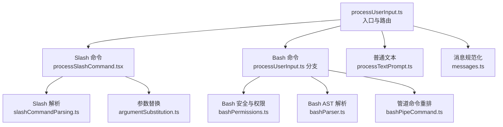
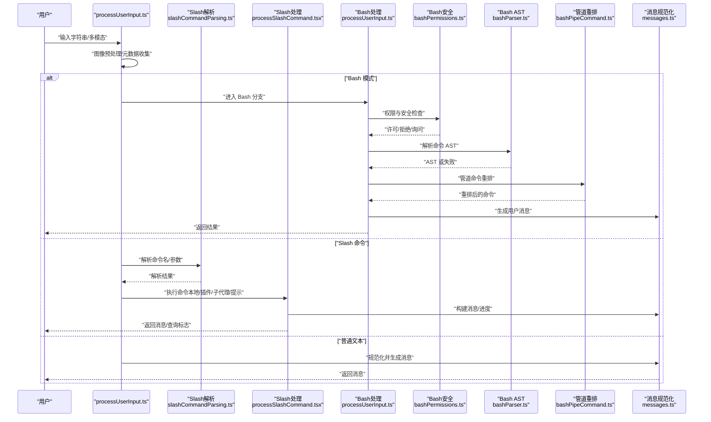
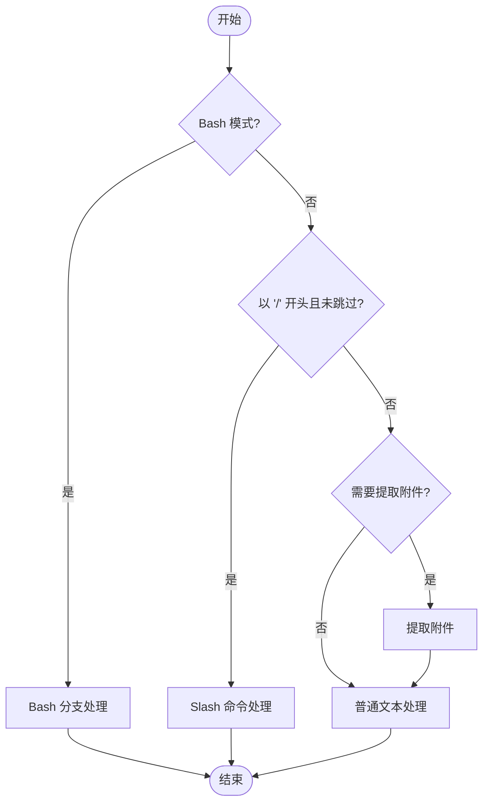
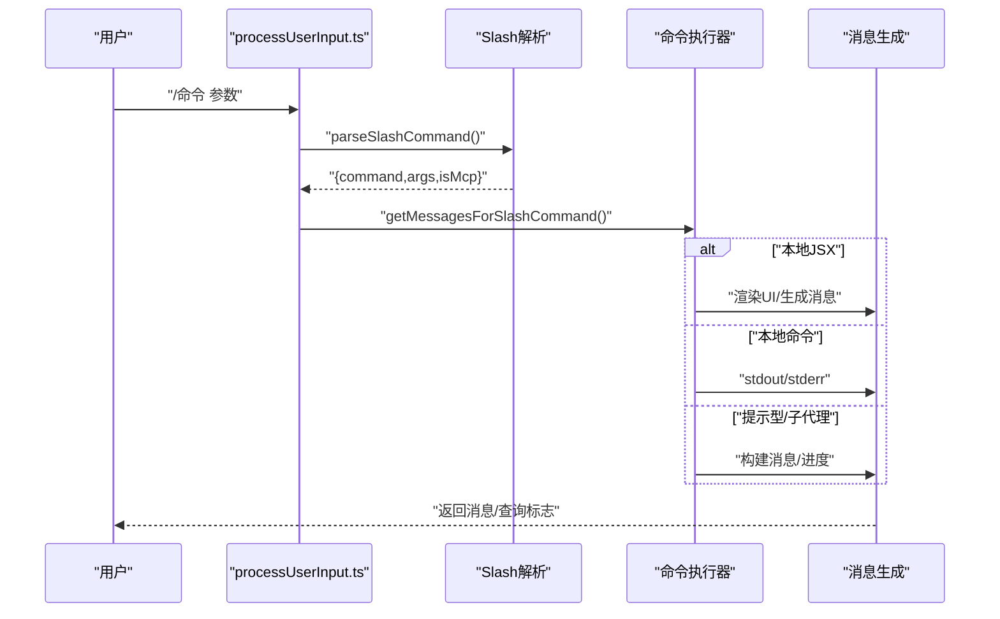
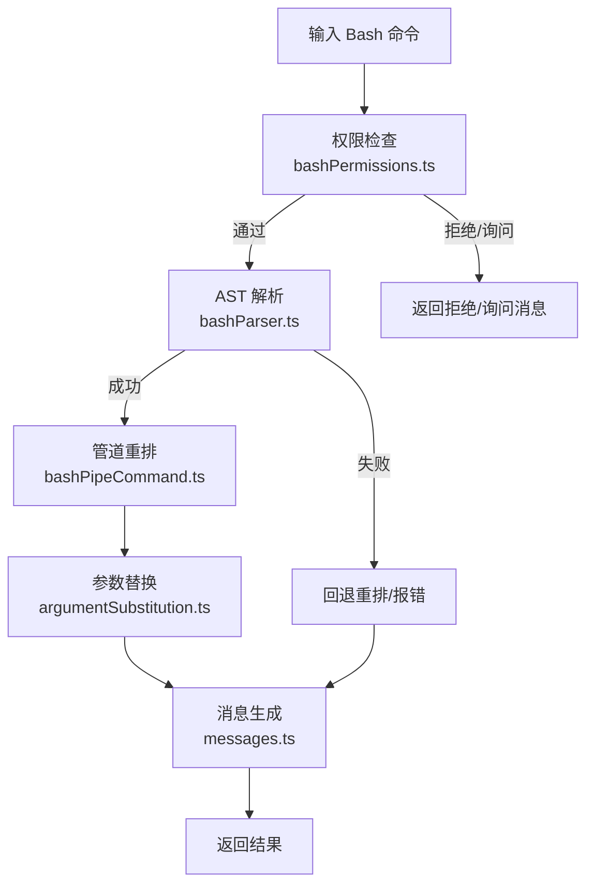
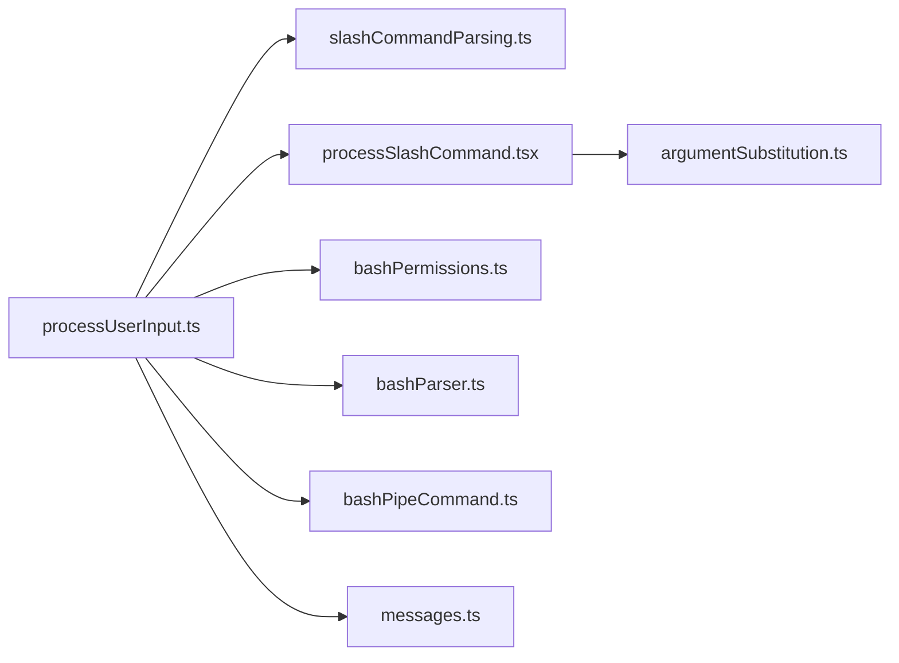

# 输入处理流程

<cite>
**本文引用的文件**
- [processUserInput.ts](file://src/utils/processUserInput/processUserInput.ts)
- [processSlashCommand.tsx](file://src/utils/processUserInput/processSlashCommand.tsx)
- [slashCommandParsing.ts](file://src/utils/slashCommandParsing.ts)
- [bashParser.ts](file://src/utils/bash/bashParser.ts)
- [bashPipeCommand.ts](file://src/utils/bash/bashPipeCommand.ts)
- [bashPermissions.ts](file://src/tools/BashTool/bashPermissions.ts)
- [argumentSubstitution.ts](file://src/utils/argumentSubstitution.ts)
- [useTypeahead.tsx](file://src/hooks/useTypeahead.tsx)
- [messages.ts](file://src/utils/messages.ts)
</cite>

## 目录
1. [简介](#简介)
2. [项目结构](#项目结构)
3. [核心组件](#核心组件)
4. [架构总览](#架构总览)
5. [详细组件分析](#详细组件分析)
6. [依赖关系分析](#依赖关系分析)
7. [性能考量](#性能考量)
8. [故障排查指南](#故障排查指南)
9. [结论](#结论)

## 简介
本文件系统性梳理 Claude Code 的输入处理流程，覆盖从用户输入到系统可识别消息的完整链路。重点包括：
- 文本提示处理（普通对话）
- Slash 命令解析与执行（含本地命令、插件命令、子代理派生命令）
- Bash 命令处理（安全校验、AST 解析、管道重排、参数替换）
- 输入验证、预处理、格式转换与错误处理
- 不同类型输入的优先级与路由机制
- 性能优化策略与内存管理建议

## 项目结构
输入处理模块位于 src/utils/processUserInput 下，围绕 processUserInput.ts 作为入口，按输入类型分发至对应处理器：
- Slash 命令：processSlashCommand.tsx
- Bash 命令：processUserInput.ts 中的 bash 分支与工具侧 bash 权限/安全模块
- 普通文本：processTextPrompt.ts（由 processUserInput.ts 调用）

图表来源
- [processUserInput.ts:281-589](file://src/utils/processUserInput/processUserInput.ts#L281-L589)
- [processSlashCommand.tsx:1-922](file://src/utils/processUserInput/processSlashCommand.tsx#L1-L922)
- [slashCommandParsing.ts:1-61](file://src/utils/slashCommandParsing.ts#L1-L61)
- [bashPermissions.ts:1180-1221](file://src/tools/BashTool/bashPermissions.ts#L1180-L1221)
- [bashParser.ts:1-800](file://src/utils/bash/bashParser.ts#L1-L800)
- [bashPipeCommand.ts:1-295](file://src/utils/bash/bashPipeCommand.ts#L1-L295)
- [argumentSubstitution.ts:1-40](file://src/utils/argumentSubstitution.ts#L1-L40)
- [messages.ts:2345-2714](file://src/utils/messages.ts#L2345-L2714)

章节来源
- [processUserInput.ts:85-589](file://src/utils/processUserInput/processUserInput.ts#L85-L589)

## 核心组件
- 输入路由与预处理：processUserInput.ts
  - 支持字符串与多模态内容块（图像）输入，进行尺寸调整、元数据提取与前置附件提取
  - 处理桥接安全命令覆盖、关键词路由（如 Ultraplan）、Bash 模式分支
- Slash 命令处理：processSlashCommand.tsx
  - 解析命令名、参数、MCP 标记；判定内置/自定义/插件命令；执行本地命令、本地 JSX、派生子代理或提示型命令
  - 支持进度 UI、异步后台运行、结果回填队列
- Slash 命令解析：slashCommandParsing.ts
  - 统一解析以 “/” 开头的命令，支持 MCP 标记与参数切分
- Bash 命令处理：processUserInput.ts + 工具侧 bash 模块
  - 安全检查（前缀匹配、注入检测、AST 验证）、权限决策、管道命令重排、参数替换
- 参数替换：argumentSubstitution.ts
  - 使用 shell-quote 解析参数，支持 $ARGUMENTS、$0/$1 等占位符与命名参数
- 类型提示辅助：useTypeahead.tsx
  - 提供命令补全与参数提示的前端逻辑（与后端解析配合）
- 消息规范化：messages.ts
  - 图像尺寸校验、消息合并与标签注入、工具输入规范化

章节来源
- [processUserInput.ts:64-140](file://src/utils/processUserInput/processUserInput.ts#L64-L140)
- [processSlashCommand.tsx:297-330](file://src/utils/processUserInput/processSlashCommand.tsx#L297-L330)
- [slashCommandParsing.ts:25-60](file://src/utils/slashCommandParsing.ts#L25-L60)
- [argumentSubstitution.ts:24-40](file://src/utils/argumentSubstitution.ts#L24-L40)
- [useTypeahead.tsx:736-744](file://src/hooks/useTypeahead.tsx#L736-L744)
- [messages.ts:2345-2714](file://src/utils/messages.ts#L2345-L2714)

## 架构总览
下图展示从用户输入到最终消息生成的关键路径与决策点。

图表来源
- [processUserInput.ts:281-589](file://src/utils/processUserInput/processUserInput.ts#L281-L589)
- [slashCommandParsing.ts:25-60](file://src/utils/slashCommandParsing.ts#L25-L60)
- [processSlashCommand.tsx:309-524](file://src/utils/processUserInput/processSlashCommand.tsx#L309-L524)
- [bashPermissions.ts:1180-1221](file://src/tools/BashTool/bashPermissions.ts#L1180-L1221)
- [bashParser.ts:609-631](file://src/utils/bash/bashParser.ts#L609-L631)
- [bashPipeCommand.ts:14-100](file://src/utils/bash/bashPipeCommand.ts#L14-L100)
- [messages.ts:2345-2714](file://src/utils/messages.ts#L2345-L2714)

## 详细组件分析

### 输入路由与优先级
- 路由顺序（在 processUserInput.ts 中）：
  1) Bash 模式（mode === 'bash'）优先处理
  2) Slash 命令（以 “/” 开头且未被 skip）次之
  3) 普通文本提示最后处理
- 关键分支与条件：
  - bridgeOrigin 与 skipSlashCommands：远程桥接场景下仅允许“桥接安全命令”
  - Ultraplan 关键词：非交互模式下将包含关键词的输入重写为 /ultraplan 路由
  - 附件提取：根据是否跳过附件、是否为提示模式、是否为 Slash 命令决定时机

图表来源
- [processUserInput.ts:422-589](file://src/utils/processUserInput/processUserInput.ts#L422-L589)

章节来源
- [processUserInput.ts:422-589](file://src/utils/processUserInput/processUserInput.ts#L422-L589)

### Slash 命令解析与执行
- 解析阶段（slashCommandParsing.ts）
  - 去除首尾空白、移除 “/”，按空格拆分单词
  - 识别第二词为 “(MCP)” 时标记 isMcp，并拼接命令名为 “command (MCP)”
  - 提取剩余部分为参数字符串
- 执行阶段（processSlashCommand.tsx）
  - 判定命令是否存在、是否内置、是否插件命令
  - 根据命令类型执行：
    - 本地 JS：渲染 UI、回调 onDone、支持 meta 消息与 nextInput
    - 本地命令：直接输出 stdout/stderr
    - 提示型命令：可选择同步或派生子代理异步执行
    - 子代理命令：后台运行，完成后回填队列
  - 错误处理：中断、异常、未知命令、参数缺失等
  - 事件记录：统计命令使用、插件信息、调用来源

图表来源
- [processSlashCommand.tsx:309-524](file://src/utils/processUserInput/processSlashCommand.tsx#L309-L524)
- [slashCommandParsing.ts:25-60](file://src/utils/slashCommandParsing.ts#L25-L60)

章节来源
- [processSlashCommand.tsx:309-524](file://src/utils/processUserInput/processSlashCommand.tsx#L309-L524)
- [slashCommandParsing.ts:25-60](file://src/utils/slashCommandParsing.ts#L25-L60)

### Bash 命令处理与安全
- 权限与安全检查（bashPermissions.ts）
  - 精确匹配、前缀匹配、注入检测（AST 成功解析则跳过传统正则检测）
  - 命令注入检测与建议
- AST 解析（bashParser.ts）
  - 纯 TypeScript 实现的 Bash 解析器，带超时与节点数预算保护
  - 返回树形 AST，供后续安全与重排使用
- 管道命令重排（bashPipeCommand.ts）
  - 在满足条件时将 stdin 重定向移动到第一个命令之后，避免 eval 将整个管道视为单一单元
  - 对包含变量、反引号、控制结构、换行等复杂情况采用回退方案
- 参数替换（argumentSubstitution.ts）
  - 使用 shell-quote 解析参数，支持 $ARGUMENTS、$0/$1、命名参数等占位符
- 全链路消息生成（messages.ts）
  - 规范化图像尺寸、注入标签、工具输入规范化

图表来源
- [bashPermissions.ts:1180-1221](file://src/tools/BashTool/bashPermissions.ts#L1180-L1221)
- [bashParser.ts:609-631](file://src/utils/bash/bashParser.ts#L609-L631)
- [bashPipeCommand.ts:14-100](file://src/utils/bash/bashPipeCommand.ts#L14-L100)
- [argumentSubstitution.ts:24-40](file://src/utils/argumentSubstitution.ts#L24-L40)
- [messages.ts:2345-2714](file://src/utils/messages.ts#L2345-L2714)

章节来源
- [bashPermissions.ts:1180-1221](file://src/tools/BashTool/bashPermissions.ts#L1180-L1221)
- [bashParser.ts:609-631](file://src/utils/bash/bashParser.ts#L609-L631)
- [bashPipeCommand.ts:14-100](file://src/utils/bash/bashPipeCommand.ts#L14-L100)
- [argumentSubstitution.ts:24-40](file://src/utils/argumentSubstitution.ts#L24-L40)
- [messages.ts:2345-2714](file://src/utils/messages.ts#L2345-L2714)

### 参数解析与替换
- 功能要点
  - 使用 shell-quote 解析参数，保留引号内空格与转义
  - 支持 $ARGUMENTS、$ARGUMENTS[索引]、$0/$1 等简写
  - 支持命名参数（frontmatter 定义），在提示中进行占位符替换
- 复杂度与边界
  - 解析失败时回退为空白分割，保证健壮性
  - 对变量展开采用保守策略（保留 $KEY 形式）

章节来源
- [argumentSubstitution.ts:13-40](file://src/utils/argumentSubstitution.ts#L13-L40)

### 类型提示与补全
- 前端类型提示（useTypeahead.tsx）
  - 从当前输入提取命令名、判断是否有真实参数、是否处于“等待参数”的单空格状态
  - 与后端解析配合，提供更准确的补全体验

章节来源
- [useTypeahead.tsx:736-744](file://src/hooks/useTypeahead.tsx#L736-L744)

## 依赖关系分析
- processUserInput.ts 作为中枢，依赖：
  - slashCommandParsing.ts：统一解析 Slash 命令
  - processSlashCommand.tsx：命令执行与消息生成
  - bash 权限与安全模块：bashPermissions.ts、bashParser.ts、bashPipeCommand.ts
  - argumentSubstitution.ts：参数解析与替换
  - messages.ts：消息规范化与校验
- 组件耦合与内聚
  - 路由清晰、职责分离：Bash、Slash、文本分别由独立模块处理
  - 安全前置：Bash 在执行前完成权限与注入检测
  - 可扩展：Slash 命令类型新增不影响其他路径

图表来源
- [processUserInput.ts:56-61](file://src/utils/processUserInput/processUserInput.ts#L56-L61)
- [processSlashCommand.tsx:40-48](file://src/utils/processUserInput/processSlashCommand.tsx#L40-L48)
- [bashPermissions.ts:1180-1221](file://src/tools/BashTool/bashPermissions.ts#L1180-L1221)
- [bashParser.ts:1-800](file://src/utils/bash/bashParser.ts#L1-L800)
- [bashPipeCommand.ts:1-295](file://src/utils/bash/bashPipeCommand.ts#L1-L295)
- [argumentSubstitution.ts:13-40](file://src/utils/argumentSubstitution.ts#L13-L40)
- [messages.ts:2345-2714](file://src/utils/messages.ts#L2345-L2714)

章节来源
- [processUserInput.ts:56-61](file://src/utils/processUserInput/processUserInput.ts#L56-L61)
- [processSlashCommand.tsx:40-48](file://src/utils/processUserInput/processSlashCommand.tsx#L40-L48)

## 性能考量
- 解析与安全检查
  - Bash AST 解析设置超时与节点数上限，防止恶意输入导致资源耗尽
  - AST 成功解析后跳过传统正则注入检测，减少重复计算
- 并行处理
  - 图像预处理与粘贴图像处理并行执行，缩短整体延迟
- 内存管理
  - 仅在必要时保留中间结果（例如解析失败回退、临时消息数组）
  - 附件与图像元数据在完成后及时清理
- UI 与队列
  - 子代理命令后台运行，避免阻塞主线程与输入队列
  - 进度消息增量更新，降低渲染压力

章节来源
- [bashParser.ts:29-32](file://src/utils/bash/bashParser.ts#L29-L32)
- [processUserInput.ts:366-388](file://src/utils/processUserInput/processUserInput.ts#L366-L388)
- [processSlashCommand.tsx:102-183](file://src/utils/processUserInput/processSlashCommand.tsx#L102-L183)

## 故障排查指南
- Slash 命令无效
  - 检查命令名是否存在于已加载命令集中
  - 若命令不存在但看起来像文件路径，系统会将其当作普通文本处理
  - 查看日志事件 tengu_input_slash_missing/tengu_input_slash_invalid
- Bash 命令被拒绝
  - 检查权限模式与前缀规则
  - 若命令包含变量、反引号、控制结构或换行，可能触发回退方案
  - 关注注入检测与 AST 解析结果
- 参数解析异常
  - 确认参数字符串是否符合 shell 语法
  - 检查命名参数与 $ARGUMENTS 占位符是否正确
- 图像消息异常
  - 确保图像尺寸与元数据在规范化阶段通过校验
  - 检查消息标签注入与工具输入规范化是否生效

章节来源
- [processSlashCommand.tsx:310-381](file://src/utils/processUserInput/processSlashCommand.tsx#L310-L381)
- [bashPermissions.ts:1180-1221](file://src/tools/BashTool/bashPermissions.ts#L1180-L1221)
- [argumentSubstitution.ts:24-40](file://src/utils/argumentSubstitution.ts#L24-L40)
- [messages.ts:2345-2714](file://src/utils/messages.ts#L2345-L2714)

## 结论
Claude Code 的输入处理流程以 processUserInput.ts 为核心，结合 Slash 命令与 Bash 命令的专用处理器，实现了高鲁棒性的多模态输入到系统消息的转换。通过严格的权限与安全前置、参数解析与替换、以及消息规范化，系统在保证安全性的同时提供了灵活的扩展能力。性能方面通过超时与预算限制、并行处理与增量 UI 更新，有效降低了资源占用与延迟风险。