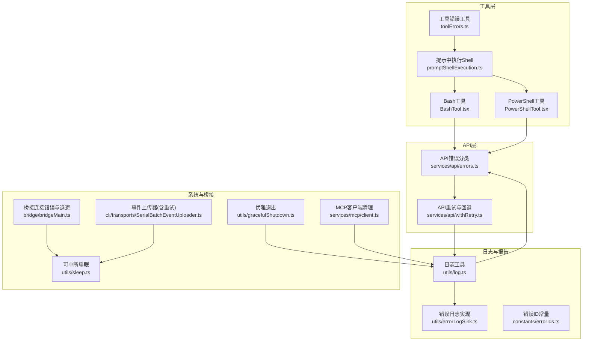
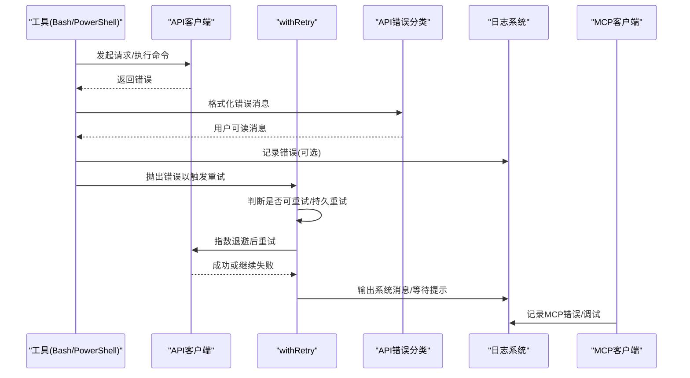
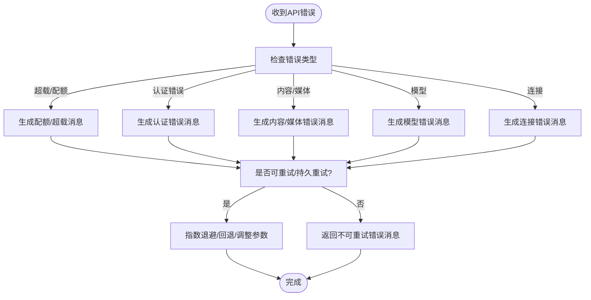
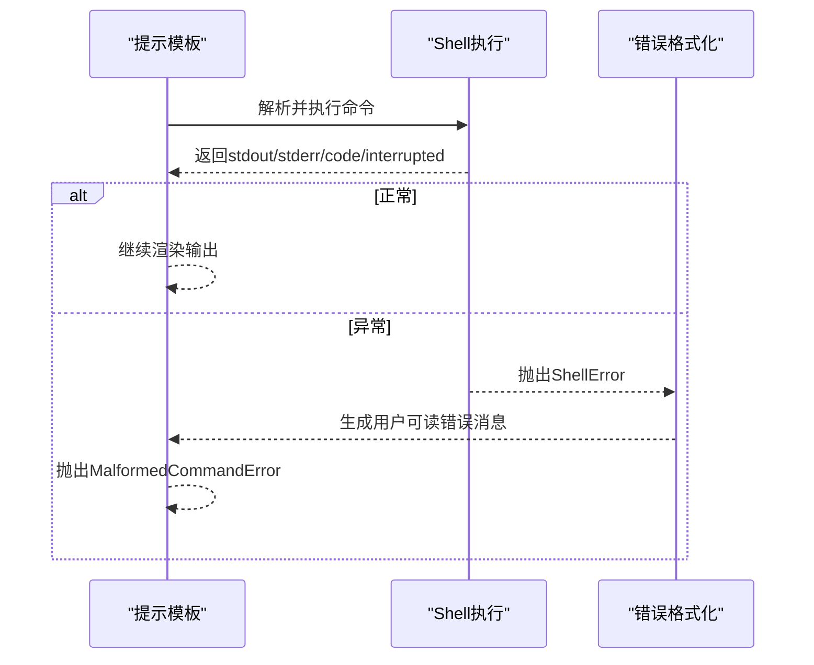
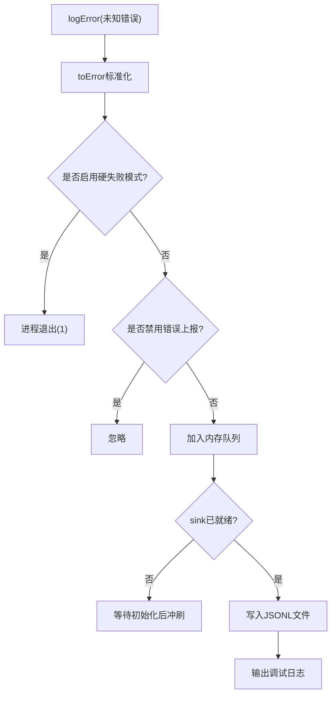
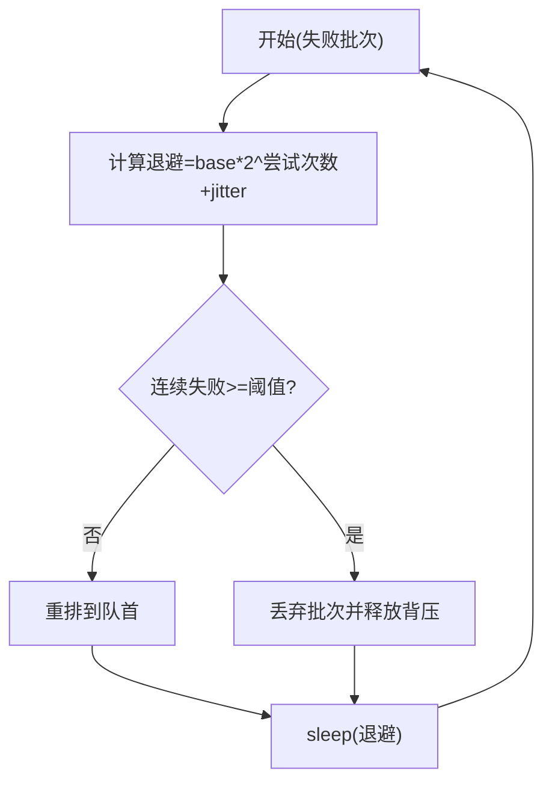
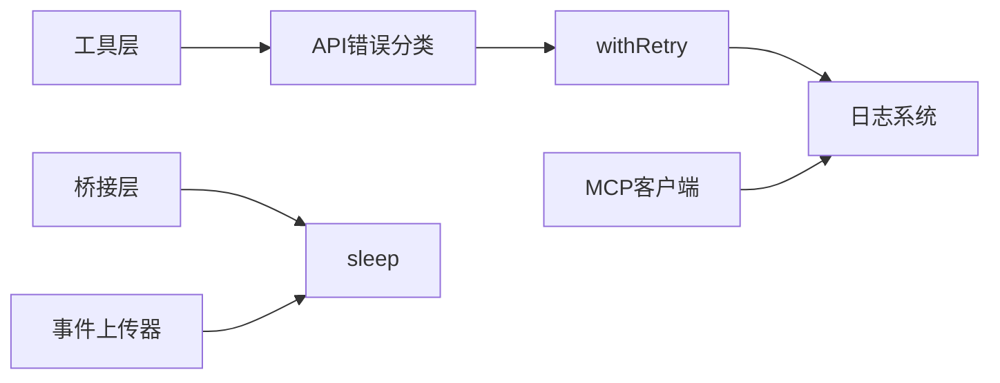

# 错误处理机制

<cite>
**本文档引用的文件**
- [src/utils/errors.ts](file://src/utils/errors.ts)
- [src/utils/log.ts](file://src/utils/log.ts)
- [src/utils/errorLogSink.ts](file://src/utils/errorLogSink.ts)
- [src/services/api/errors.ts](file://src/services/api/errors.ts)
- [src/services/api/withRetry.ts](file://src/services/api/withRetry.ts)
- [src/utils/toolErrors.ts](file://src/utils/toolErrors.ts)
- [src/utils/promptShellExecution.ts](file://src/utils/promptShellExecution.ts)
- [src/tools/BashTool/BashTool.tsx](file://src/tools/BashTool/BashTool.tsx)
- [src/tools/PowerShellTool/PowerShellTool.tsx](file://src/tools/PowerShellTool/PowerShellTool.tsx)
- [src/utils/gracefulShutdown.ts](file://src/utils/gracefulShutdown.ts)
- [src/constants/errorIds.ts](file://src/constants/errorIds.ts)
- [src/bridge/bridgeMain.ts](file://src/bridge/bridgeMain.ts)
- [src/utils/sleep.ts](file://src/utils/sleep.ts)
- [src/cli/transports/SerialBatchEventUploader.ts](file://src/cli/transports/SerialBatchEventUploader.ts)
- [src/services/mcp/client.ts](file://src/services/mcp/client.ts)
</cite>

## 目录
1. [简介](#简介)
2. [项目结构](#项目结构)
3. [核心组件](#核心组件)
4. [架构总览](#架构总览)
5. [详细组件分析](#详细组件分析)
6. [依赖关系分析](#依赖关系分析)
7. [性能考量](#性能考量)
8. [故障排查指南](#故障排查指南)
9. [结论](#结论)
10. [附录](#附录)

## 简介
本文件系统性梳理 Claude Code 的错误处理机制，覆盖错误分类体系、错误传播与恢复策略、API 错误处理、工具执行错误、系统级错误与连接错误等多维处理路径；并详述错误日志记录、调试信息收集与错误报告流程，解释错误恢复的条件判断与自动重试逻辑，最后给出可配置项、自定义扩展点与常见场景的最佳实践。

## 项目结构
围绕错误处理的关键模块分布如下：
- 工具层：Shell 执行错误封装与格式化（Bash/PowerShell）
- API 层：API 错误分类、消息生成、重试与回退策略
- 日志与报告：统一错误日志接口、文件落盘、队列与延迟初始化
- 系统与桥接：连接错误、心跳与退避、优雅退出与未捕获异常处理
- 常量与边界：错误 ID、硬失败模式、环境开关

**图表来源**
- [src/utils/toolErrors.ts:1-41](file://src/utils/toolErrors.ts#L1-L41)
- [src/utils/promptShellExecution.ts:115-183](file://src/utils/promptShellExecution.ts#L115-L183)
- [src/tools/BashTool/BashTool.tsx:692-726](file://src/tools/BashTool/BashTool.tsx#L692-L726)
- [src/tools/PowerShellTool/PowerShellTool.tsx:551-562](file://src/tools/PowerShellTool/PowerShellTool.tsx#L551-L562)
- [src/services/api/errors.ts:1-200](file://src/services/api/errors.ts#L1-L200)
- [src/services/api/withRetry.ts:170-517](file://src/services/api/withRetry.ts#L170-L517)
- [src/utils/log.ts:158-223](file://src/utils/log.ts#L158-L223)
- [src/utils/errorLogSink.ts:225-235](file://src/utils/errorLogSink.ts#L225-L235)
- [src/utils/gracefulShutdown.ts:187-347](file://src/utils/gracefulShutdown.ts#L187-L347)
- [src/bridge/bridgeMain.ts:1314-1339](file://src/bridge/bridgeMain.ts#L1314-L1339)
- [src/utils/sleep.ts:1-38](file://src/utils/sleep.ts#L1-L38)
- [src/cli/transports/SerialBatchEventUploader.ts:152-275](file://src/cli/transports/SerialBatchEventUploader.ts#L152-L275)
- [src/services/mcp/client.ts:1466-1580](file://src/services/mcp/client.ts#L1466-L1580)

**章节来源**
- [src/utils/errors.ts:1-239](file://src/utils/errors.ts#L1-L239)
- [src/utils/log.ts:1-363](file://src/utils/log.ts#L1-L363)
- [src/utils/errorLogSink.ts:1-236](file://src/utils/errorLogSink.ts#L1-L236)
- [src/services/api/errors.ts:1-1208](file://src/services/api/errors.ts#L1-L1208)
- [src/services/api/withRetry.ts:1-823](file://src/services/api/withRetry.ts#L1-L823)
- [src/utils/toolErrors.ts:1-41](file://src/utils/toolErrors.ts#L1-L41)
- [src/utils/promptShellExecution.ts:115-183](file://src/utils/promptShellExecution.ts#L115-L183)
- [src/tools/BashTool/BashTool.tsx:692-726](file://src/tools/BashTool/BashTool.tsx#L692-L726)
- [src/tools/PowerShellTool/PowerShellTool.tsx:551-562](file://src/tools/PowerShellTool/PowerShellTool.tsx#L551-L562)
- [src/utils/gracefulShutdown.ts:187-347](file://src/utils/gracefulShutdown.ts#L187-L347)
- [src/constants/errorIds.ts:1-16](file://src/constants/errorIds.ts#L1-L16)
- [src/bridge/bridgeMain.ts:1314-1339](file://src/bridge/bridgeMain.ts#L1314-L1339)
- [src/utils/sleep.ts:1-38](file://src/utils/sleep.ts#L1-L38)
- [src/cli/transports/SerialBatchEventUploader.ts:152-275](file://src/cli/transports/SerialBatchEventUploader.ts#L152-L275)
- [src/services/mcp/client.ts:1466-1580](file://src/services/mcp/client.ts#L1466-L1580)

## 核心组件
- 错误类型与工具
  - 统一错误类与断言：包含通用错误基类、中止错误、配置解析错误、Shell 错误、遥测安全错误等，提供 toError、errorMessage、shortErrorStack、isAbortError、isENOENT、classifyAxiosError 等工具函数，便于在各层统一处理。
  - 工具错误格式化：将 Shell 执行结果与中断状态转换为用户可读的错误消息，限制输出长度并进行截断提示。
- API 错误分类与消息生成
  - 针对不同状态码与错误内容（如超载、配额、认证、无效模型、媒体过大、工具使用不匹配等）生成用户友好消息，并保留原始错误细节用于分析。
  - 提供错误类型分类函数，便于埋点与监控。
- API 自动重试与回退
  - 基于指数退避、抖动、Retry-After 头与持久重试策略，结合快模降级、模型回退、上下文溢出调整等智能回退路径。
  - 对 529/429、认证错误、网络连接错误、特定云厂商鉴权错误等进行差异化处理。
- 日志与错误报告
  - 统一日志接口：支持内存缓存、延迟初始化、队列缓冲、文件落盘（JSONL），并区分普通错误与 MCP 错误。
  - 错误 ID：为生产追踪提供稳定标识，配合错误消息与时间戳。
- 系统与桥接错误
  - 连接错误退避与心跳保活：在桥接层对连接错误进行指数退避与心跳维持，避免租约过期。
  - 优雅退出：处理终端丢失、未捕获异常、进程退出码设置与清理。
  - 事件上传器：批量事件上传失败时进行带抖动的指数退避与丢弃策略。

**章节来源**
- [src/utils/errors.ts:1-239](file://src/utils/errors.ts#L1-L239)
- [src/services/api/errors.ts:425-934](file://src/services/api/errors.ts#L425-L934)
- [src/services/api/withRetry.ts:170-517](file://src/services/api/withRetry.ts#L170-L517)
- [src/utils/log.ts:158-223](file://src/utils/log.ts#L158-L223)
- [src/utils/errorLogSink.ts:225-235](file://src/utils/errorLogSink.ts#L225-L235)
- [src/bridge/bridgeMain.ts:1314-1339](file://src/bridge/bridgeMain.ts#L1314-L1339)
- [src/utils/gracefulShutdown.ts:187-347](file://src/utils/gracefulShutdown.ts#L187-L347)
- [src/cli/transports/SerialBatchEventUploader.ts:152-275](file://src/cli/transports/SerialBatchEventUploader.ts#L152-L275)

## 架构总览
下图展示从“工具执行/API 调用”到“错误分类、重试与回退、日志记录”的端到端流程。

**图表来源**
- [src/tools/BashTool/BashTool.tsx:692-726](file://src/tools/BashTool/BashTool.tsx#L692-L726)
- [src/tools/PowerShellTool/PowerShellTool.tsx:551-562](file://src/tools/PowerShellTool/PowerShellTool.tsx#L551-L562)
- [src/services/api/errors.ts:425-934](file://src/services/api/errors.ts#L425-L934)
- [src/services/api/withRetry.ts:170-517](file://src/services/api/withRetry.ts#L170-L517)
- [src/utils/log.ts:158-223](file://src/utils/log.ts#L158-L223)
- [src/services/mcp/client.ts:1466-1580](file://src/services/mcp/client.ts#L1466-L1580)

## 详细组件分析

### 错误分类与消息生成（API）
- 分类维度
  - 超载/配额：429/529、统一配额头、窗口型限额重置时间
  - 认证：401/403、OAuth 刷新、第三方平台鉴权
  - 内容/媒体：提示过长、PDF/图片大小、工具使用不匹配
  - 模型：无效模型名、订阅计划限制
  - 连接：超时、网络拒绝、SSL 证书问题
- 消息策略
  - 面向用户的提示语与恢复建议
  - 保留 errorDetails 以便后续重试策略（如上下文压缩）
  - 针对特定错误（如工具使用不匹配）记录统计指标
- 回退与切换
  - 快速模式降级与冷却
  - 主模型过载时的回退模型触发
  - 上下文溢出时动态调整 max_tokens

**图表来源**
- [src/services/api/errors.ts:425-934](file://src/services/api/errors.ts#L425-L934)
- [src/services/api/errors.ts:965-1161](file://src/services/api/errors.ts#L965-L1161)
- [src/services/api/withRetry.ts:170-517](file://src/services/api/withRetry.ts#L170-L517)

**章节来源**
- [src/services/api/errors.ts:425-934](file://src/services/api/errors.ts#L425-L934)
- [src/services/api/errors.ts:965-1161](file://src/services/api/errors.ts#L965-L1161)
- [src/services/api/withRetry.ts:170-517](file://src/services/api/withRetry.ts#L170-L517)

### 工具执行错误（Bash/PowerShell）
- Shell 错误封装
  - 使用 ShellError 封装退出码、标准输出/错误输出、中断标记
  - 工具错误格式化：按优先级拼接“退出码/中断/stderr/stdout”，限制长度并进行截断
- 执行与替换
  - 在提示模板中执行命令，遇到 MalformedCommandError 时抛出并提示具体失败原因
  - 输出合并与沙箱违规标注，确保错误信息完整且可诊断
- 平台差异
  - PowerShell 与 Bash 的解释规则与输出格式略有差异，但均通过统一格式化函数处理

**图表来源**
- [src/utils/promptShellExecution.ts:115-183](file://src/utils/promptShellExecution.ts#L115-L183)
- [src/utils/toolErrors.ts:1-41](file://src/utils/toolErrors.ts#L1-L41)
- [src/tools/BashTool/BashTool.tsx:692-726](file://src/tools/BashTool/BashTool.tsx#L692-L726)
- [src/tools/PowerShellTool/PowerShellTool.tsx:551-562](file://src/tools/PowerShellTool/PowerShellTool.tsx#L551-L562)

**章节来源**
- [src/utils/toolErrors.ts:1-41](file://src/utils/toolErrors.ts#L1-L41)
- [src/utils/promptShellExecution.ts:115-183](file://src/utils/promptShellExecution.ts#L115-L183)
- [src/tools/BashTool/BashTool.tsx:692-726](file://src/tools/BashTool/BashTool.tsx#L692-L726)
- [src/tools/PowerShellTool/PowerShellTool.tsx:551-562](file://src/tools/PowerShellTool/PowerShellTool.tsx#L551-L562)

### 日志记录与错误报告
- 统一接口
  - logError：标准化错误对象，注入时间戳，写入内存队列或直接落盘
  - attachErrorLogSink：延迟初始化，启动时附加后立即冲刷队列
  - logMCPError/logMCPDebug：MCP 服务器专用日志，独立目录与文件
- 文件落盘
  - JSONL 格式，自动创建目录，缓冲写入，附带会话ID、工作目录、版本等上下文
- 错误 ID
  - 为生产追踪提供稳定标识，便于定位调用点

**图表来源**
- [src/utils/log.ts:158-223](file://src/utils/log.ts#L158-L223)
- [src/utils/errorLogSink.ts:152-174](file://src/utils/errorLogSink.ts#L152-L174)

**章节来源**
- [src/utils/log.ts:158-223](file://src/utils/log.ts#L158-L223)
- [src/utils/errorLogSink.ts:152-174](file://src/utils/errorLogSink.ts#L152-L174)
- [src/constants/errorIds.ts:1-16](file://src/constants/errorIds.ts#L1-L16)

### 连接错误与持久重试（桥接/事件上传）
- 桥接层退避
  - 连接错误采用指数退避与抖动，结合心跳保活，避免租约过期
- 事件上传器
  - 失败批处理回压释放、丢弃阈值、带抖动的指数退避
  - 支持服务端 Retry-After 指令，防止“惊群效应”

**图表来源**
- [src/bridge/bridgeMain.ts:1314-1339](file://src/bridge/bridgeMain.ts#L1314-L1339)
- [src/cli/transports/SerialBatchEventUploader.ts:152-275](file://src/cli/transports/SerialBatchEventUploader.ts#L152-L275)

**章节来源**
- [src/bridge/bridgeMain.ts:1314-1339](file://src/bridge/bridgeMain.ts#L1314-L1339)
- [src/utils/sleep.ts:1-38](file://src/utils/sleep.ts#L1-L38)
- [src/cli/transports/SerialBatchEventUploader.ts:152-275](file://src/cli/transports/SerialBatchEventUploader.ts#L152-L275)

### 系统级错误与优雅退出
- 未捕获异常
  - 记录 unhandledRejection 的名称、消息与栈，用于可观测性与分析
- 优雅退出
  - 处理终端丢失导致的 EIO，必要时使用 SIGKILL
  - 清理资源、Drain 输入流、设置退出码

**章节来源**
- [src/utils/gracefulShutdown.ts:187-347](file://src/utils/gracefulShutdown.ts#L187-L347)

## 依赖关系分析
- 松耦合设计
  - 错误工具与日志工具无重型依赖，避免循环导入
  - API 错误分类与重试策略解耦，便于扩展新错误类型
- 关键依赖链
  - 工具层 -> API 错误分类 -> withRetry -> 日志系统
  - MCP 客户端 -> 日志系统
  - 桥接层/事件上传器 -> 可中断睡眠

**图表来源**
- [src/utils/toolErrors.ts:1-41](file://src/utils/toolErrors.ts#L1-L41)
- [src/services/api/errors.ts:425-934](file://src/services/api/errors.ts#L425-L934)
- [src/services/api/withRetry.ts:170-517](file://src/services/api/withRetry.ts#L170-L517)
- [src/utils/log.ts:158-223](file://src/utils/log.ts#L158-L223)
- [src/services/mcp/client.ts:1466-1580](file://src/services/mcp/client.ts#L1466-L1580)
- [src/bridge/bridgeMain.ts:1314-1339](file://src/bridge/bridgeMain.ts#L1314-L1339)
- [src/utils/sleep.ts:1-38](file://src/utils/sleep.ts#L1-L38)
- [src/cli/transports/SerialBatchEventUploader.ts:152-275](file://src/cli/transports/SerialBatchEventUploader.ts#L152-L275)

**章节来源**
- [src/utils/errors.ts:1-239](file://src/utils/errors.ts#L1-L239)
- [src/utils/log.ts:158-223](file://src/utils/log.ts#L158-L223)
- [src/services/api/errors.ts:425-934](file://src/services/api/errors.ts#L425-L934)
- [src/services/api/withRetry.ts:170-517](file://src/services/api/withRetry.ts#L170-L517)

## 性能考量
- 指数退避与抖动：平衡重试频率与服务器压力，避免放大效应
- 持久重试与分块休眠：长时间等待时分片输出系统消息，保持宿主感知活跃
- 缓冲写入与延迟初始化：减少磁盘 IO 开销，避免阻塞启动
- 输出长度限制：工具错误消息截断，避免超大文本占用上下文

[本节为通用指导，无需特定文件引用]

## 故障排查指南
- 如何查看错误日志
  - 启用调试：运行带调试标志的命令，或查看调试日志文件
  - 获取最近错误：调用内存错误列表接口
  - 查看错误文件：错误日志文件位于用户缓存目录下的错误子目录
- 常见错误定位
  - API 超载/配额：关注配额头与重置时间，必要时切换模型或降低并发
  - 认证失败：检查密钥/令牌状态，确认鉴权缓存是否被清除
  - 工具执行失败：查看 Shell 错误输出与中断标记，确认权限与路径
  - 连接错误：检查网络与证书，观察心跳与退避行为
- 临时禁用错误上报
  - 设置禁用错误上报环境变量或关键流量模式，仅用于诊断

**章节来源**
- [src/utils/log.ts:209-223](file://src/utils/log.ts#L209-L223)
- [src/utils/errorLogSink.ts:29-38](file://src/utils/errorLogSink.ts#L29-L38)
- [src/utils/log.ts:158-223](file://src/utils/log.ts#L158-L223)

## 结论
Claude Code 的错误处理机制以“统一错误抽象 + 分层消息生成 + 智能重试与回退 + 可观测性日志”为核心，既保证用户体验（清晰提示与恢复建议），又兼顾系统稳定性（退避、持久重试、优雅退出）。通过可配置的环境变量与特性开关，可在不同部署形态（本地/云/企业）下灵活调整行为。

[本节为总结，无需特定文件引用]

## 附录

### 错误处理配置选项与自定义方法
- 环境变量
  - 禁用错误上报：禁用错误上报的环境变量
  - 硬失败模式：启动参数触发硬失败，直接退出进程
  - 最大重试次数：覆盖默认最大重试次数
  - 未值守重试：启用持久重试与长退避
  - 第三方提供商：Bedrock/Vertex/Foundry 等禁用错误上报
- 特性开关
  - 硬失败特性：在启动阶段启用
  - 未值守重试特性：控制持久重试行为
- 自定义扩展
  - 新增 API 错误类型：在错误分类函数中添加分支与消息
  - 新增工具错误格式化：在工具错误格式化模块中扩展输出规则
  - 新增日志目标：通过日志接口扩展新的 sink 实现

**章节来源**
- [src/utils/log.ts:158-177](file://src/utils/log.ts#L158-L177)
- [src/services/api/withRetry.ts:789-797](file://src/services/api/withRetry.ts#L789-L797)
- [src/services/api/errors.ts:965-1161](file://src/services/api/errors.ts#L965-L1161)
- [src/utils/errorLogSink.ts:225-235](file://src/utils/errorLogSink.ts#L225-L235)

### 常见错误场景最佳实践
- API 超载/配额
  - 优先使用持久重试与分块休眠，避免用户感知卡顿
  - 在非前台来源（如摘要/建议）上快速放弃，减少级联放大
- 认证错误
  - 自动刷新令牌或清除缓存，必要时引导用户重新登录
- 工具执行失败
  - 严格区分“无匹配/成功但非零退出码”与“真正失败”，避免误导
  - 提供最小可复现示例与命令行参数
- 连接错误
  - 使用心跳与退避，避免租约过期
  - 记录连接细节（SSL/Cert），辅助诊断网络问题
- 未捕获异常
  - 记录异常详情与上下文，触发优雅退出并清理资源

**章节来源**
- [src/services/api/withRetry.ts:170-517](file://src/services/api/withRetry.ts#L170-L517)
- [src/utils/toolErrors.ts:1-41](file://src/utils/toolErrors.ts#L1-L41)
- [src/utils/gracefulShutdown.ts:187-347](file://src/utils/gracefulShutdown.ts#L187-L347)
- [src/bridge/bridgeMain.ts:1314-1339](file://src/bridge/bridgeMain.ts#L1314-L1339)