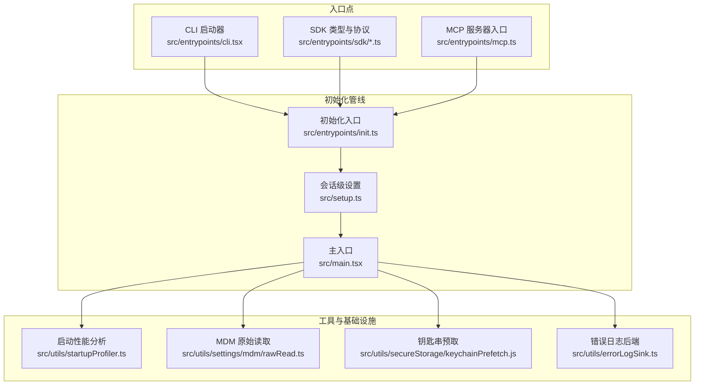
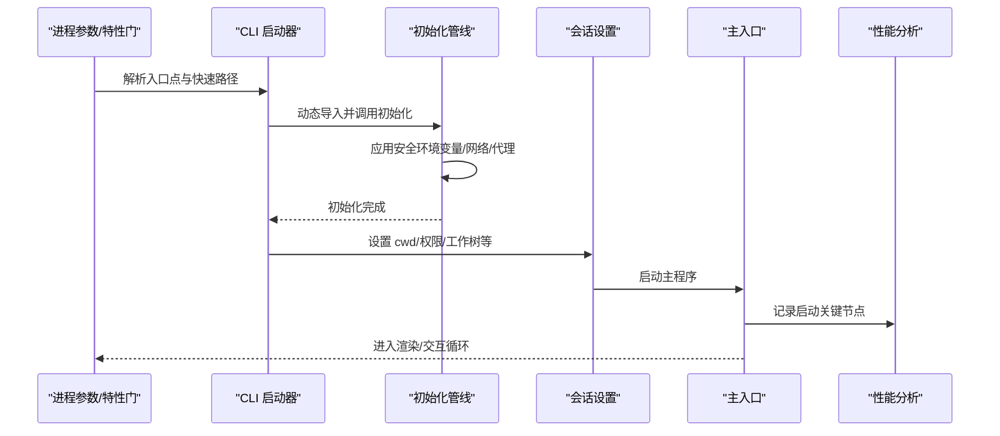
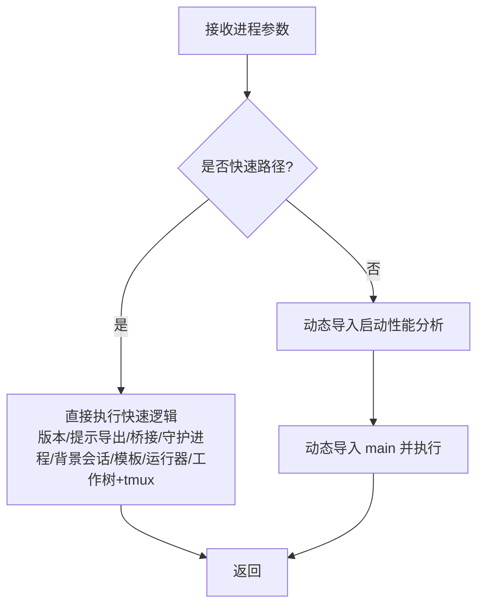
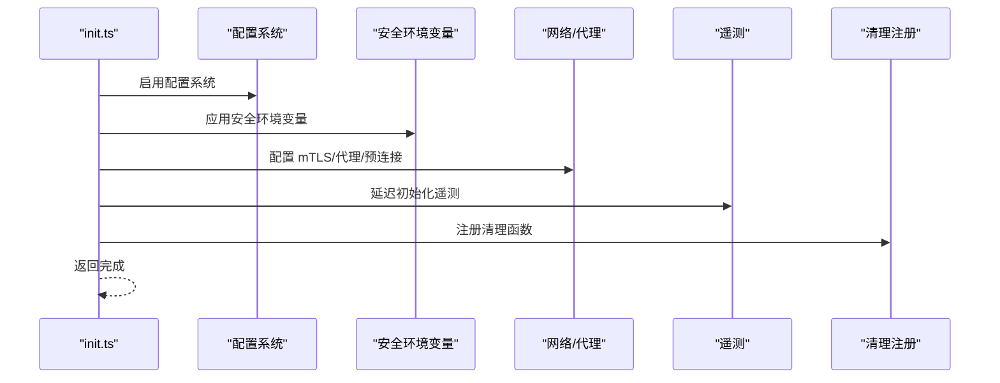
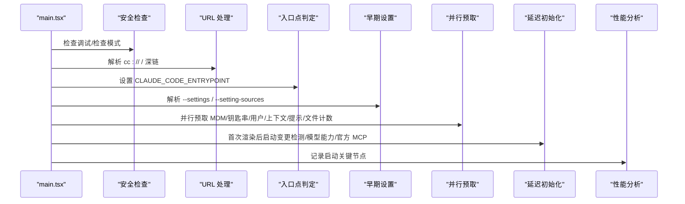
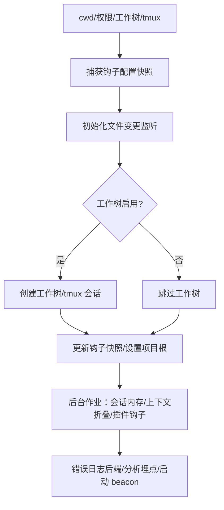
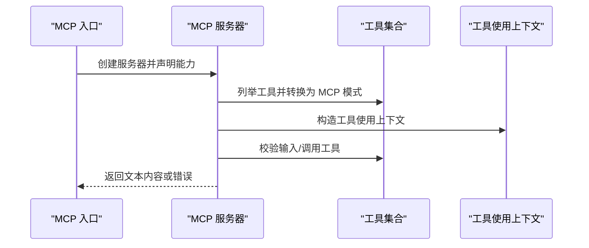
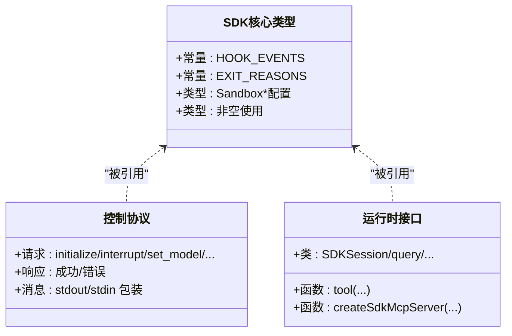
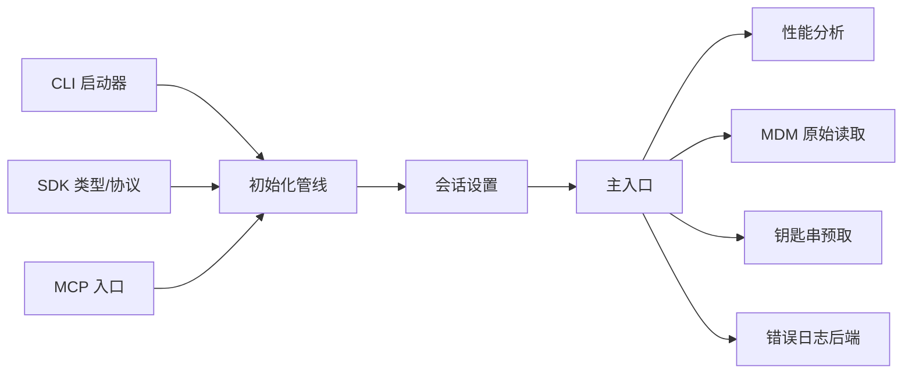

# 入口层

<cite>
**本文引用的文件**
- [src/main.tsx](file://src/main.tsx)
- [src/entrypoints/init.ts](file://src/entrypoints/init.ts)
- [src/entrypoints/cli.tsx](file://src/entrypoints/cli.tsx)
- [src/entrypoints/mcp.ts](file://src/entrypoints/mcp.ts)
- [src/setup.ts](file://src/setup.ts)
- [src/utils/startupProfiler.ts](file://src/utils/startupProfiler.ts)
- [src/utils/settings/mdm/rawRead.ts](file://src/utils/settings/mdm/rawRead.ts)
- [src/utils/secureStorage/keychainPrefetch.js](file://src/utils/secureStorage/keychainPrefetch.js)
- [src/entrypoints/sdk/coreTypes.ts](file://src/entrypoints/sdk/coreTypes.ts)
- [src/entrypoints/sdk/controlSchemas.ts](file://src/entrypoints/sdk/controlSchemas.ts)
- [src/entrypoints/agentSdkTypes.ts](file://src/entrypoints/agentSdkTypes.ts)
- [src/utils/errorLogSink.ts](file://src/utils/errorLogSink.ts)
- [src/utils/log.ts](file://src/utils/log.ts)
</cite>

## 目录
1. [引言](#引言)
2. [项目结构](#项目结构)
3. [核心组件](#核心组件)
4. [架构总览](#架构总览)
5. [详细组件分析](#详细组件分析)
6. [依赖分析](#依赖分析)
7. [性能考虑](#性能考虑)
8. [故障排查指南](#故障排查指南)
9. [结论](#结论)

## 引言
本文件系统性梳理 Claude Code 的入口层设计与实现，聚焦以下目标：
- 明确入口层职责：应用启动、环境初始化、配置加载与入口点路由
- 深入解析 main.tsx 主入口的启动流程：性能分析、安全检查、设置预取与延迟初始化
- 阐述不同入口点类型（CLI、SDK、MCP、本地代理）的区分逻辑与初始化差异
- 总结启动阶段的关键优化策略：并行预取、懒加载与条件导入
- 绘制入口层与其它层的交互关系图，说明数据流向与依赖关系
- 提供启动失败的错误处理机制与调试方法

## 项目结构
入口层由“入口点”和“初始化管线”两部分组成：
- 入口点：CLI 启动器、SDK 类型定义、MCP 服务器入口等
- 初始化管线：配置启用、安全环境变量应用、网络与代理、遥测、钩子与插件预热等

图表来源
- [src/entrypoints/cli.tsx:1-303](file://src/entrypoints/cli.tsx#L1-L303)
- [src/entrypoints/init.ts:1-341](file://src/entrypoints/init.ts#L1-L341)
- [src/entrypoints/mcp.ts:1-197](file://src/entrypoints/mcp.ts#L1-L197)
- [src/setup.ts:1-478](file://src/setup.ts#L1-L478)
- [src/main.tsx:1-800](file://src/main.tsx#L1-L800)
- [src/utils/startupProfiler.ts:68-128](file://src/utils/startupProfiler.ts#L68-L128)
- [src/utils/settings/mdm/rawRead.ts:120-130](file://src/utils/settings/mdm/rawRead.ts#L120-L130)
- [src/utils/secureStorage/keychainPrefetch.js](file://src/utils/secureStorage/keychainPrefetch.js)
- [src/utils/errorLogSink.ts:215-235](file://src/utils/errorLogSink.ts#L215-L235)

章节来源
- [src/entrypoints/cli.tsx:1-303](file://src/entrypoints/cli.tsx#L1-L303)
- [src/entrypoints/init.ts:1-341](file://src/entrypoints/init.ts#L1-L341)
- [src/entrypoints/mcp.ts:1-197](file://src/entrypoints/mcp.ts#L1-L197)
- [src/setup.ts:1-478](file://src/setup.ts#L1-L478)
- [src/main.tsx:1-800](file://src/main.tsx#L1-L800)

## 核心组件
- CLI 启动器：负责快速路径、特性门控与动态导入，最终引导到主入口 main.tsx
- 初始化管线 init.ts：在信任建立前仅应用安全环境变量，随后异步完成网络、代理、遥测、钩子等准备
- 主入口 main.tsx：执行安全检查、URL 协议处理、入口点判定、早期设置加载、并行预取、延迟初始化与启动性能分析
- 会话设置 setup.ts：在 cwd、权限模式、工作树、tmux 等上下文就绪后，进行命令、钩子、插件、指标等后台作业
- MCP 入口：面向 MCP 客户端的工具清单与调用处理
- SDK 类型与协议：定义 SDK 控制协议与运行时类型，支撑外部集成

章节来源
- [src/entrypoints/cli.tsx:1-303](file://src/entrypoints/cli.tsx#L1-L303)
- [src/entrypoints/init.ts:1-341](file://src/entrypoints/init.ts#L1-L341)
- [src/main.tsx:517-540](file://src/main.tsx#L517-L540)
- [src/setup.ts:56-478](file://src/setup.ts#L56-L478)
- [src/entrypoints/mcp.ts:35-197](file://src/entrypoints/mcp.ts#L35-L197)
- [src/entrypoints/sdk/coreTypes.ts:1-63](file://src/entrypoints/sdk/coreTypes.ts#L1-L63)
- [src/entrypoints/sdk/controlSchemas.ts:1-664](file://src/entrypoints/sdk/controlSchemas.ts#L1-L664)
- [src/entrypoints/agentSdkTypes.ts:1-444](file://src/entrypoints/agentSdkTypes.ts#L1-L444)

## 架构总览
入口层自上而下分为三层：
- 入口点层：根据进程参数与特性门决定执行路径（CLI、SDK、MCP、本地代理）
- 初始化层：尽早启用配置、应用安全环境变量、预连接网络、注册清理与遥测
- 主程序层：执行安全检查、URL 协议处理、入口点判定、早期设置加载、并行预取、延迟初始化与性能分析

图表来源
- [src/entrypoints/cli.tsx:33-299](file://src/entrypoints/cli.tsx#L33-L299)
- [src/entrypoints/init.ts:57-238](file://src/entrypoints/init.ts#L57-L238)
- [src/setup.ts:56-478](file://src/setup.ts#L56-L478)
- [src/main.tsx:585-800](file://src/main.tsx#L585-L800)
- [src/utils/startupProfiler.ts:68-128](file://src/utils/startupProfiler.ts#L68-L128)

## 详细组件分析

### CLI 启动器（src/entrypoints/cli.tsx）
- 快速路径：版本查询、系统提示导出、桥接模式、守护进程、背景会话管理、模板任务、环境运行器、自托管运行器、工作树+tmux 等
- 特性门控：通过 feature() 在构建期裁剪外部构建不包含的功能
- 动态导入：除快速路径外，其余路径均采用动态导入以最小化模块评估
- 入口点分流：将通用 CLI 流程委托给 main.tsx

图表来源
- [src/entrypoints/cli.tsx:33-299](file://src/entrypoints/cli.tsx#L33-L299)

章节来源
- [src/entrypoints/cli.tsx:1-303](file://src/entrypoints/cli.tsx#L1-L303)

### 初始化管线（src/entrypoints/init.ts）
- 配置启用与安全环境变量：在信任对话框前仅应用安全变量，避免泄露敏感信息
- 网络与代理：配置全局 mTLS、HTTP 代理；预连接 Anthropic API
- 遥测与特性：延迟加载遥测 SDK；按需初始化 1P 事件日志；支持远程托管设置与策略限制
- 上游代理：在 CCR 场景下启动本地 CONNECT 中继
- 清理注册：注册 LSP 管理器与团队资源清理等

图表来源
- [src/entrypoints/init.ts:57-238](file://src/entrypoints/init.ts#L57-L238)

章节来源
- [src/entrypoints/init.ts:1-341](file://src/entrypoints/init.ts#L1-L341)

### 主入口（src/main.tsx）
- 安全检查：检测调试/检查模式，必要时直接退出
- URL 协议处理：解析 cc:// 或 cc+unix://，以及深链协议处理
- 入口点判定：根据非交互标志与命令行参数设置 CLAUDE_CODE_ENTRYPOINT
- 早期设置加载：解析 --settings 与 --setting-sources，提前应用设置
- 并行预取：MDM 原始读取、钥匙串预取、用户与上下文预取、提示与文件计数等
- 延迟初始化：首次渲染后再启动变更检测、模型能力、官方 MCP 列表等
- 启动性能分析：使用 profileCheckpoint 记录关键节点，支持详细报告

图表来源
- [src/main.tsx:231-271](file://src/main.tsx#L231-L271)
- [src/main.tsx:517-540](file://src/main.tsx#L517-L540)
- [src/main.tsx:502-516](file://src/main.tsx#L502-L516)
- [src/main.tsx:388-431](file://src/main.tsx#L388-L431)
- [src/utils/startupProfiler.ts:68-128](file://src/utils/startupProfiler.ts#L68-L128)
- [src/utils/settings/mdm/rawRead.ts:120-130](file://src/utils/settings/mdm/rawRead.ts#L120-L130)
- [src/utils/secureStorage/keychainPrefetch.js](file://src/utils/secureStorage/keychainPrefetch.js)

章节来源
- [src/main.tsx:1-800](file://src/main.tsx#L1-L800)

### 会话设置（src/setup.ts）
- 节点版本校验、会话切换、消息队列服务（可选）、队友快照（SIMPLE 门控）
- 终端备份恢复（iTerm2/Terminal.app），仅交互模式
- 工作树与 tmux：在 git 或钩子模式下创建工作树并可选创建 tmux 会话
- 背景作业：会话内存、上下文折叠、插件钩子预热、提交归因钩子、会话文件访问钩子、团队记忆观察者
- 错误日志与分析：初始化错误日志后端与分析埋点，记录启动 beacon

图表来源
- [src/setup.ts:56-478](file://src/setup.ts#L56-L478)

章节来源
- [src/setup.ts:1-478](file://src/setup.ts#L1-L478)

### MCP 入口（src/entrypoints/mcp.ts）
- 基于 MCP SDK 创建服务器，声明工具能力
- 工具列表：从工具集合中生成 MCP 友好的描述与输入/输出模式
- 工具调用：验证输入、执行工具、构造文本内容响应或错误响应

图表来源
- [src/entrypoints/mcp.ts:35-197](file://src/entrypoints/mcp.ts#L35-L197)

章节来源
- [src/entrypoints/mcp.ts:1-197](file://src/entrypoints/mcp.ts#L1-L197)

### SDK 类型与协议（src/entrypoints/sdk/* 与 src/entrypoints/agentSdkTypes.ts）
- 核心类型：公共可序列化类型、钩子事件常量、退出原因等
- 控制协议：SDK 控制请求/响应、权限请求、MCP 状态、上下文使用统计、重放文件、取消异步消息、种子读状态、MCP 服务器管理、重载插件、停止任务、应用标志设置、获取设置、请求/响应包装等
- 运行时接口：SDK 会话、查询、会话管理等（当前抛出未实现异常，用于类型导出）

图表来源
- [src/entrypoints/sdk/coreTypes.ts:1-63](file://src/entrypoints/sdk/coreTypes.ts#L1-L63)
- [src/entrypoints/sdk/controlSchemas.ts:1-664](file://src/entrypoints/sdk/controlSchemas.ts#L1-L664)
- [src/entrypoints/agentSdkTypes.ts:1-444](file://src/entrypoints/agentSdkTypes.ts#L1-L444)

章节来源
- [src/entrypoints/sdk/coreTypes.ts:1-63](file://src/entrypoints/sdk/coreTypes.ts#L1-L63)
- [src/entrypoints/sdk/controlSchemas.ts:1-664](file://src/entrypoints/sdk/controlSchemas.ts#L1-L664)
- [src/entrypoints/agentSdkTypes.ts:1-444](file://src/entrypoints/agentSdkTypes.ts#L1-L444)

## 依赖分析
- 入口点到初始化：CLI/SDK/MCP 均通过 init.ts 进行统一的环境与网络准备
- 初始化到会话设置：init.ts 完成后，setup.ts 承担会话上下文与后台作业
- 主入口到工具：main.tsx 依赖性能分析、MDM 原始读取、钥匙串预取与错误日志后端
- SDK 与 MCP：SDK 类型与协议为外部集成提供契约，MCP 入口基于 SDK 类型实现工具服务

图表来源
- [src/entrypoints/cli.tsx:33-299](file://src/entrypoints/cli.tsx#L33-L299)
- [src/entrypoints/init.ts:57-238](file://src/entrypoints/init.ts#L57-L238)
- [src/setup.ts:56-478](file://src/setup.ts#L56-L478)
- [src/main.tsx:1-800](file://src/main.tsx#L1-L800)
- [src/utils/startupProfiler.ts:68-128](file://src/utils/startupProfiler.ts#L68-L128)
- [src/utils/settings/mdm/rawRead.ts:120-130](file://src/utils/settings/mdm/rawRead.ts#L120-L130)
- [src/utils/secureStorage/keychainPrefetch.js](file://src/utils/secureStorage/keychainPrefetch.js)
- [src/utils/errorLogSink.ts:215-235](file://src/utils/errorLogSink.ts#L215-L235)

章节来源
- [src/entrypoints/cli.tsx:1-303](file://src/entrypoints/cli.tsx#L1-L303)
- [src/entrypoints/init.ts:1-341](file://src/entrypoints/init.ts#L1-L341)
- [src/setup.ts:1-478](file://src/setup.ts#L1-L478)
- [src/main.tsx:1-800](file://src/main.tsx#L1-L800)

## 性能考虑
- 启动性能分析：通过 profileCheckpoint 记录关键节点，支持详细报告输出
- 并行预取：MDM 原始读取、钥匙串预取与系统上下文预取在信任建立前后分层执行
- 懒加载与条件导入：大量模块采用动态导入，减少首屏模块评估时间
- 延迟初始化：首次渲染后再启动变更检测、模型能力、官方 MCP 列表等后台任务
- 环境变量与网络：在 init.ts 中尽早配置 mTLS/代理与预连接，降低后续请求延迟

章节来源
- [src/utils/startupProfiler.ts:68-128](file://src/utils/startupProfiler.ts#L68-L128)
- [src/main.tsx:11-21](file://src/main.tsx#L11-L21)
- [src/main.tsx:388-431](file://src/main.tsx#L388-L431)
- [src/entrypoints/init.ts:134-159](file://src/entrypoints/init.ts#L134-L159)

## 故障排查指南
- 启动失败定位
  - 错误日志后端：在启动早期初始化错误日志后端，任何错误在后端就绪前会被排队，就绪后统一写出
  - 分析埋点：在关键阶段记录 tengu_started 等 beacon，便于健康监控
  - 内存错误队列：保留最近若干条内存错误，辅助诊断
- 调试方法
  - 启动性能报告：开启详细性能分析后，输出启动各阶段耗时与内存快照
  - 安全检查：若处于调试/检查模式，主入口会直接退出，避免潜在风险
  - 权限模式校验：在 bypass 权限模式下进行沙箱与网络访问校验，不符合条件直接退出

章节来源
- [src/utils/errorLogSink.ts:215-235](file://src/utils/errorLogSink.ts#L215-L235)
- [src/utils/log.ts:64-99](file://src/utils/log.ts#L64-L99)
- [src/main.tsx:231-271](file://src/main.tsx#L231-L271)
- [src/setup.ts:395-442](file://src/setup.ts#L395-L442)

## 结论
入口层通过“入口点 + 初始化 + 主程序”的分层设计，实现了：
- 快速路径与特性门控，显著缩短常见场景启动时间
- 安全优先的初始化策略，确保敏感信息在信任建立前不被泄露
- 并行预取与延迟初始化，兼顾首屏速度与后续体验
- 与 SDK/MCP 的清晰契约，支撑多入口与外部集成
- 完备的错误处理与性能分析，便于问题定位与持续优化