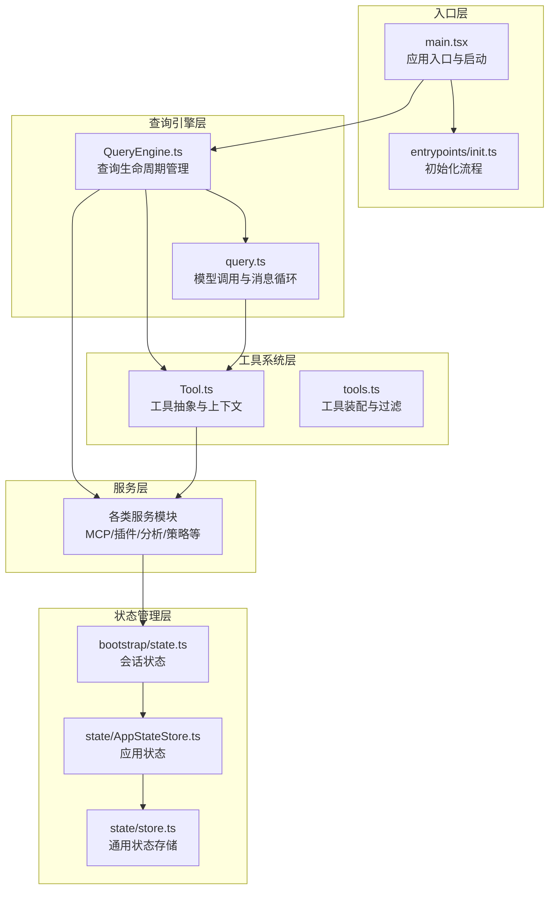
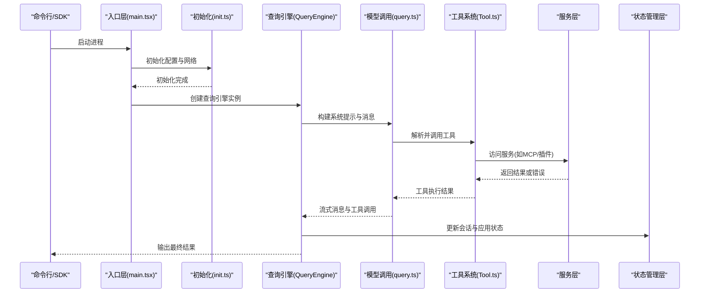
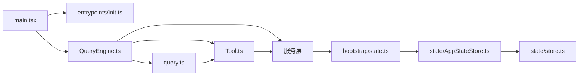

# 分层架构设计

<cite>
**本文档引用的文件**
- [src/main.tsx](file://src/main.tsx)
- [src/bootstrap/state.ts](file://src/bootstrap/state.ts)
- [src/QueryEngine.ts](file://src/QueryEngine.ts)
- [src/Tool.ts](file://src/Tool.ts)
- [src/Task.ts](file://src/Task.ts)
- [src/state/AppStateStore.ts](file://src/state/AppStateStore.ts)
- [src/state/store.ts](file://src/state/store.ts)
- [src/entrypoints/init.ts](file://src/entrypoints/init.ts)
- [src/query.ts](file://src/query.ts)
- [src/tools.ts](file://src/tools.ts)
</cite>

## 目录
1. [引言](#引言)
2. [项目结构](#项目结构)
3. [核心组件](#核心组件)
4. [架构总览](#架构总览)
5. [详细组件分析](#详细组件分析)
6. [依赖分析](#依赖分析)
7. [性能考虑](#性能考虑)
8. [故障排除指南](#故障排除指南)
9. [结论](#结论)

## 引言

本文件为 Claude Code 的分层架构设计文档，围绕其五层架构（入口层、查询引擎层、工具系统层、服务层、状态管理层）进行深入解析。该架构通过清晰的职责边界、模块化设计与解耦策略，实现了高可测试性、可维护性与可扩展性。文档不仅阐述各层的职责与交互机制，还提供了数据流图与依赖关系图，并解释了采用该分层设计的原因及优势。

## 项目结构

Claude Code 的代码库采用以功能域为中心的组织方式，结合 TypeScript 类型系统与模块化导入，形成清晰的层次化结构。顶层入口负责初始化与启动流程，随后进入查询引擎层处理用户输入与工具调用，工具系统层提供统一的工具抽象与权限控制，服务层承载业务能力（如 MCP、插件、分析等），状态管理层则提供全局状态管理与持久化支持。

**图表来源**
- [src/main.tsx](file://src/main.tsx)
- [src/entrypoints/init.ts](file://src/entrypoints/init.ts)
- [src/QueryEngine.ts](file://src/QueryEngine.ts)
- [src/query.ts](file://src/query.ts)
- [src/Tool.ts](file://src/Tool.ts)
- [src/tools.ts](file://src/tools.ts)
- [src/bootstrap/state.ts](file://src/bootstrap/state.ts)
- [src/state/AppStateStore.ts](file://src/state/AppStateStore.ts)
- [src/state/store.ts](file://src/state/store.ts)

**章节来源**
- [src/main.tsx](file://src/main.tsx)
- [src/entrypoints/init.ts](file://src/entrypoints/init.ts)
- [src/bootstrap/state.ts](file://src/bootstrap/state.ts)
- [src/state/AppStateStore.ts](file://src/state/AppStateStore.ts)
- [src/state/store.ts](file://src/state/store.ts)

## 核心组件

- 入口层
  - 应用入口与启动：负责环境准备、配置加载、信任建立后的遥测初始化、网络代理与 mTLS 配置、预连接等。
  - 初始化流程：延迟加载遥测、OAuth 账户信息、JetBrains 检测、仓库检测、远程设置与策略限制的异步加载等。

- 查询引擎层
  - 查询生命周期管理：封装一次对话的完整生命周期，包括系统提示构建、用户上下文注入、工具选择与执行、消息记录与回放、权限拒绝追踪等。
  - 模型调用与消息循环：负责与模型交互、工具执行、自动压缩与上下文折叠、令牌预算控制、错误恢复与重试等。

- 工具系统层
  - 工具抽象：定义工具的统一接口、输入输出模式、权限检查、并发安全、渲染与进度展示等。
  - 工具装配与过滤：根据权限上下文与运行模式装配内置工具与 MCP 工具，去重与排序以保证提示缓存稳定性。

- 服务层
  - 提供跨领域的业务能力，包括 MCP 客户端与资源管理、插件系统、分析与遥测、策略限制、远程托管设置等。

- 状态管理层
  - 会话状态：包含会话标识、计费统计、时延统计、文件历史快照、提示缓存状态等。
  - 应用状态：包含设置、任务、通知、MCP/插件状态、权限上下文、推测状态等。
  - 通用状态存储：提供订阅式状态更新与变更监听。

**章节来源**
- [src/QueryEngine.ts](file://src/QueryEngine.ts)
- [src/query.ts](file://src/query.ts)
- [src/Tool.ts](file://src/Tool.ts)
- [src/tools.ts](file://src/tools.ts)
- [src/bootstrap/state.ts](file://src/bootstrap/state.ts)
- [src/state/AppStateStore.ts](file://src/state/AppStateStore.ts)
- [src/state/store.ts](file://src/state/store.ts)
- [src/entrypoints/init.ts](file://src/entrypoints/init.ts)

## 架构总览

下图展示了五层架构在运行时的数据流与交互关系：

**图表来源**
- [src/main.tsx](file://src/main.tsx)
- [src/entrypoints/init.ts](file://src/entrypoints/init.ts)
- [src/QueryEngine.ts](file://src/QueryEngine.ts)
- [src/query.ts](file://src/query.ts)
- [src/Tool.ts](file://src/Tool.ts)

## 详细组件分析

### 入口层（Entrypoint Layer）

- 职责边界
  - 进程启动与环境准备：设置安全标志、初始化警告处理器、注册优雅退出、解析早期参数与深链处理。
  - 初始化与配置：启用配置系统、应用安全环境变量、配置代理与 mTLS、预连接 API、初始化遥测与清理注册。
  - 信任建立后的遥测初始化：等待远程托管设置加载后重新应用环境变量再初始化遥测。

- 关键交互
  - 与状态管理层：通过引导状态设置会话标识、目录路径、权限模式等。
  - 与查询引擎层：在入口完成后创建查询引擎实例并传递工具、命令、MCP 客户端等上下文。
  - 与服务层：初始化网络代理、上游代理、LSP 管理器等。

- 设计优势
  - 关注点分离：启动流程与业务逻辑分离，便于测试与维护。
  - 可测试性：初始化过程可被 memoized，避免重复初始化；错误路径提供非交互式降级。
  - 可扩展性：延迟加载遥测与第三方模块，减少冷启动时间。

**章节来源**
- [src/main.tsx](file://src/main.tsx)
- [src/entrypoints/init.ts](file://src/entrypoints/init.ts)
- [src/bootstrap/state.ts](file://src/bootstrap/state.ts)

### 查询引擎层（Query Engine Layer）

- 职责边界
  - 会话生命周期管理：保存消息、文件缓存、使用量统计等跨轮次状态。
  - 系统提示构建：整合默认系统提示、用户上下文、系统上下文与记忆机制提示。
  - 用户输入处理：解析斜杠命令、权限检查包装、工具选择与执行、消息记录与回放。
  - 结果生成与回传：标准化消息格式、权限拒绝报告、成本与时延统计、快模式状态等。

- 关键交互
  - 与工具系统层：通过工具上下文调用工具，处理权限拒绝与工具结果。
  - 与服务层：访问 MCP 工具与资源、插件状态、分析与遥测。
  - 与状态管理层：更新会话状态、应用状态、文件历史快照等。

- 设计优势
  - 模块化：将查询逻辑从 REPL 中抽离，支持 SDK 与无头模式。
  - 可维护性：状态集中管理，消息与工具调用流程清晰，便于调试与扩展。
  - 可扩展性：支持特性门控（如历史截断、紧凑化、上下文折叠）与条件导入。

**章节来源**
- [src/QueryEngine.ts](file://src/QueryEngine.ts)
- [src/query.ts](file://src/query.ts)
- [src/tools.ts](file://src/tools.ts)

### 工具系统层（Tool System Layer）

- 职责边界
  - 工具抽象：定义工具的统一接口（名称、描述、输入输出模式、权限检查、并发安全、渲染与进度展示等）。
  - 工具上下文：封装工具执行所需的选项、读取文件缓存、应用状态、中止控制器、MCP 客户端与资源等。
  - 工具装配：根据权限上下文与运行模式装配内置工具与 MCP 工具，去重与排序以保持提示缓存稳定。

- 关键交互
  - 与查询引擎层：作为查询引擎的执行单元，接收工具调用请求并返回结果。
  - 与服务层：访问 MCP 服务器、插件系统、分析与遥测等。
  - 与状态管理层：读取与更新应用状态（如任务、通知、权限上下文）。

- 设计优势
  - 统一抽象：所有工具遵循一致的接口与生命周期，便于权限控制与 UI 渲染。
  - 可测试性：工具默认行为可配置，便于单元测试与集成测试。
  - 可扩展性：支持特性门控与动态工具池，满足不同运行场景需求。

**章节来源**
- [src/Tool.ts](file://src/Tool.ts)
- [src/tools.ts](file://src/tools.ts)

### 服务层（Service Layer）

- 职责边界
  - MCP 管理：客户端连接、资源发现、工具与命令合并、权限回调等。
  - 插件系统：插件安装、启用/禁用、错误收集、刷新与状态同步。
  - 分析与遥测：遥测初始化、指标计数器、事件日志、Beta 会话跟踪等。
  - 策略限制与远程托管设置：策略限制加载、远程设置加载与刷新、环境变量应用等。

- 关键交互
  - 与工具系统层：提供 MCP 工具与资源，参与工具装配与过滤。
  - 与状态管理层：维护应用状态中的插件与 MCP 子状态，触发刷新与重连。

- 设计优势
  - 松耦合：服务模块通过接口与状态共享，避免直接依赖。
  - 延迟加载：遥测与第三方模块按需加载，降低启动开销。
  - 可观测性：统一的分析与遥测接口，便于监控与诊断。

**章节来源**
- [src/entrypoints/init.ts](file://src/entrypoints/init.ts)

### 状态管理层（State Management Layer）

- 职责边界
  - 会话状态：包含会话标识、计费统计、时延统计、文件历史快照、提示缓存状态等。
  - 应用状态：包含设置、任务、通知、MCP/插件状态、权限上下文、推测状态等。
  - 通用状态存储：提供订阅式状态更新与变更监听，支持深度不可变状态结构。

- 关键交互
  - 与入口层：在启动阶段初始化引导状态。
  - 与查询引擎层：在查询过程中更新会话与应用状态。
  - 与服务层：维护服务相关的状态（如 MCP 客户端、插件列表等）。

- 设计优势
  - 单向数据流：通过 setState 与订阅机制，确保状态变更可追踪。
  - 深度不可变：减少副作用，提升调试与测试体验。
  - 可持久化：状态结构设计便于会话恢复与转储。

**章节来源**
- [src/bootstrap/state.ts](file://src/bootstrap/state.ts)
- [src/state/AppStateStore.ts](file://src/state/AppStateStore.ts)
- [src/state/store.ts](file://src/state/store.ts)

## 依赖分析

**图表来源**
- [src/main.tsx](file://src/main.tsx)
- [src/entrypoints/init.ts](file://src/entrypoints/init.ts)
- [src/QueryEngine.ts](file://src/QueryEngine.ts)
- [src/query.ts](file://src/query.ts)
- [src/Tool.ts](file://src/Tool.ts)
- [src/bootstrap/state.ts](file://src/bootstrap/state.ts)
- [src/state/AppStateStore.ts](file://src/state/AppStateStore.ts)
- [src/state/store.ts](file://src/state/store.ts)

**章节来源**
- [src/main.tsx](file://src/main.tsx)
- [src/QueryEngine.ts](file://src/QueryEngine.ts)
- [src/query.ts](file://src/query.ts)
- [src/Tool.ts](file://src/Tool.ts)
- [src/bootstrap/state.ts](file://src/bootstrap/state.ts)
- [src/state/AppStateStore.ts](file://src/state/AppStateStore.ts)
- [src/state/store.ts](file://src/state/store.ts)

## 性能考虑

- 启动性能
  - 延迟加载：遥测、分析、上游代理等模块按需加载，减少冷启动时间。
  - 并行初始化：配置启用、安全环境变量应用、网络代理与 mTLS 配置等并行执行。
  - 预连接：对 Anthropic API 进行预连接，缩短首次请求延迟。

- 查询性能
  - 自动压缩与上下文折叠：在查询前进行自动压缩与上下文折叠，降低令牌占用。
  - 令牌预算控制：在查询过程中跟踪令牌使用，避免超限导致的失败。
  - 工具结果预算：对工具结果大小进行预算控制，防止内存膨胀。

- 状态管理性能
  - 深度不可变状态：减少不必要的状态复制，提升更新效率。
  - 订阅式更新：仅在状态变化时触发渲染，降低 UI 重绘成本。

## 故障排除指南

- 初始化失败
  - 配置解析错误：在非交互模式下直接退出并在标准错误输出错误信息；在交互模式下弹出无效配置对话框。
  - 遥测初始化失败：记录错误日志并重试，避免阻塞主流程。

- 查询异常
  - 提示过长：当达到阻断阈值时，直接返回“提示过长”错误，避免无意义的 API 调用。
  - 最大输出令牌：在可恢复场景下延迟抛出错误，直到确认无法继续，避免提前终止。
  - 工具执行错误：通过权限拒绝追踪与错误消息标准化，便于定位问题。

- 状态不一致
  - 使用深度不可变状态与订阅机制，确保状态变更可追踪且可恢复。
  - 在会话恢复时，优先使用持久化的状态文件，避免内存状态丢失。

**章节来源**
- [src/entrypoints/init.ts](file://src/entrypoints/init.ts)
- [src/query.ts](file://src/query.ts)
- [src/QueryEngine.ts](file://src/QueryEngine.ts)
- [src/bootstrap/state.ts](file://src/bootstrap/state.ts)

## 结论

Claude Code 的五层架构通过清晰的职责划分与模块化设计，实现了高度的关注点分离、可测试性、可维护性与可扩展性。入口层负责启动与初始化，查询引擎层管理对话生命周期，工具系统层提供统一抽象，服务层承载业务能力，状态管理层提供全局状态支持。该设计不仅提升了系统的稳定性与性能，也为未来的功能扩展与演进奠定了坚实基础。