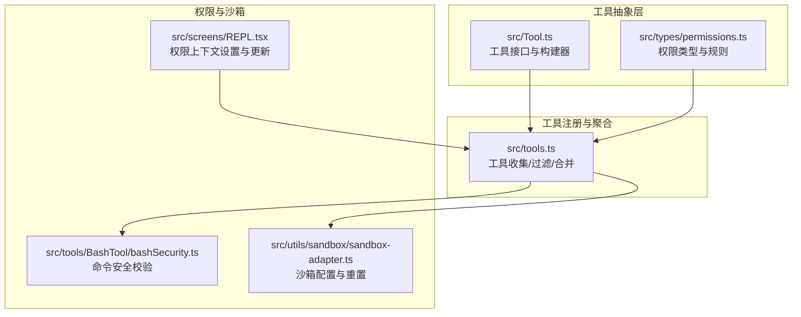
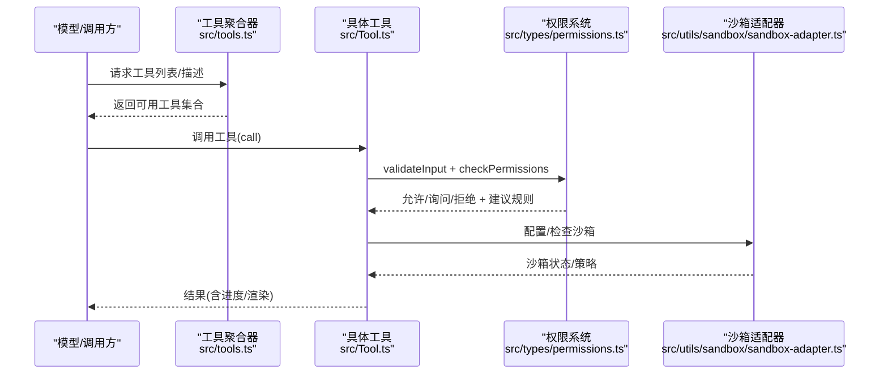
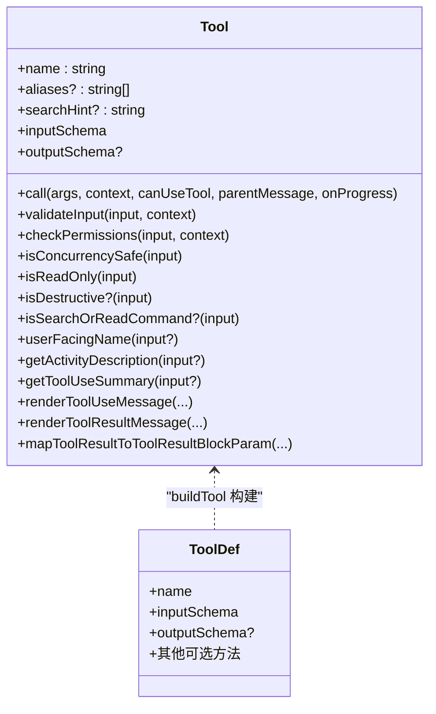
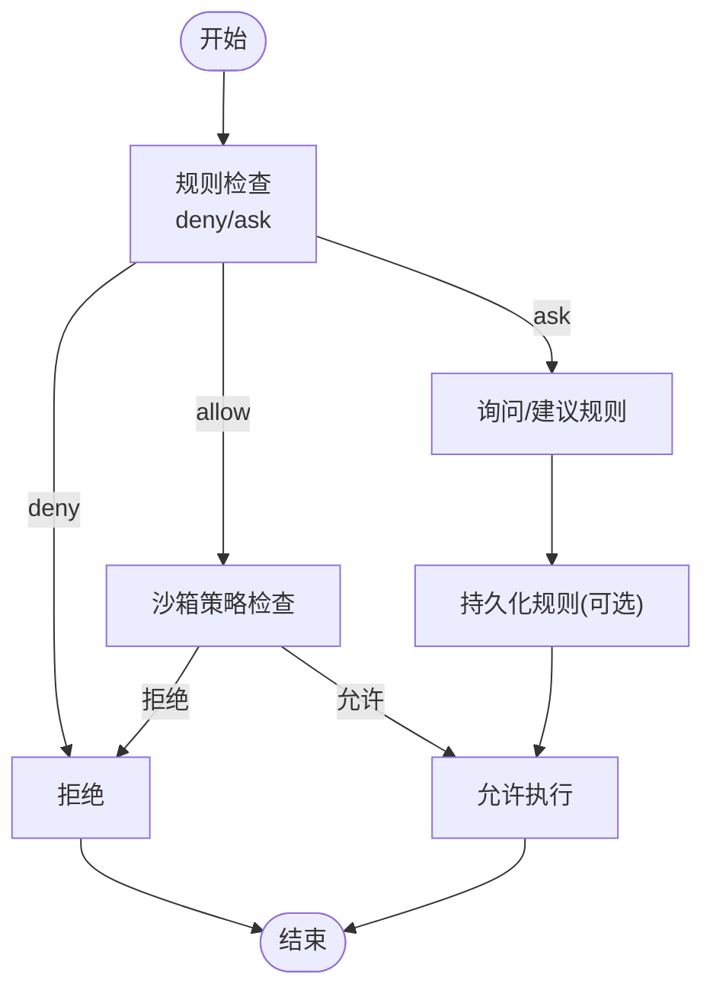
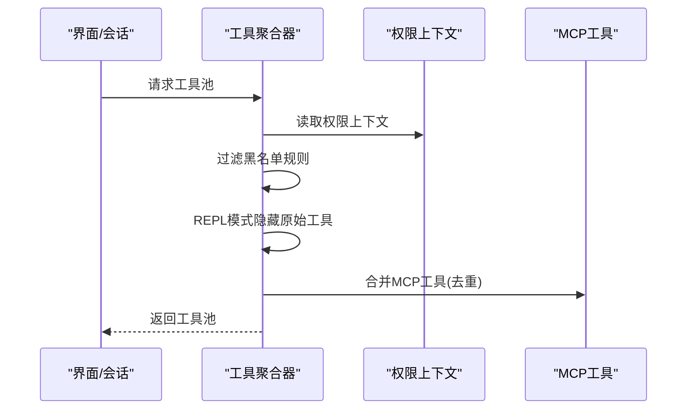
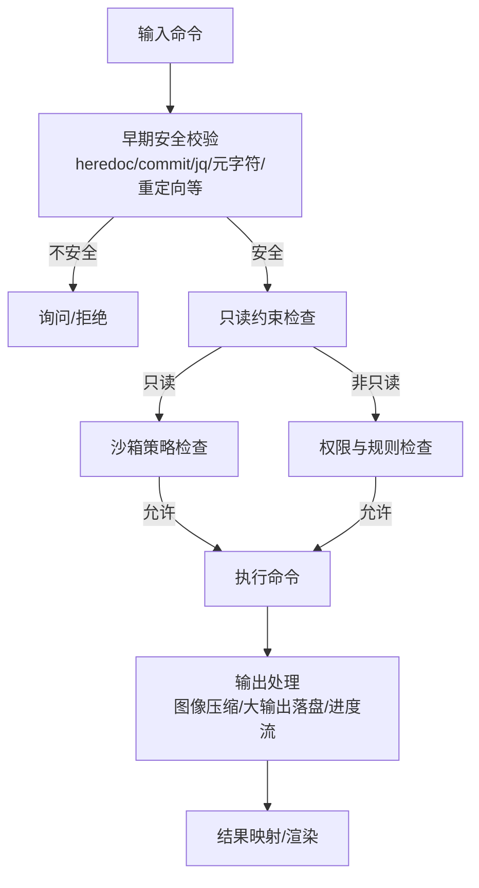
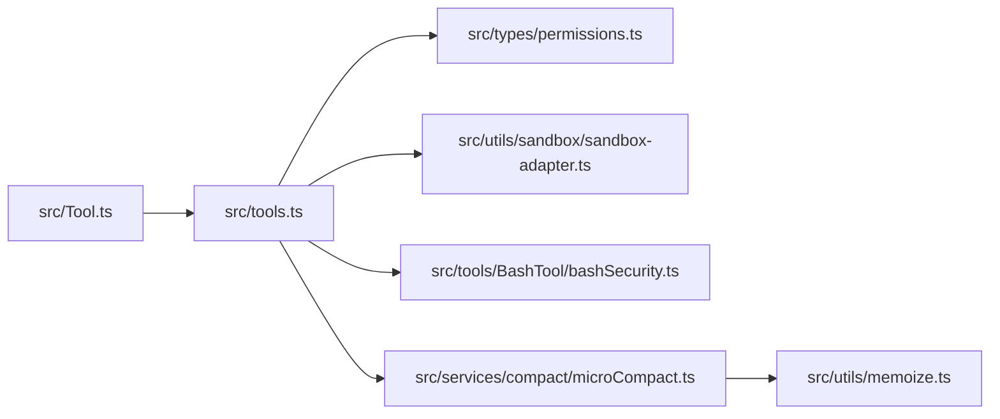

# 工具系统层

<cite>
**本文引用的文件**
- [Tool.ts](file://src/Tool.ts)
- [tools.ts](file://src/tools.ts)
- [permissions.ts](file://src/types/permissions.ts)
- [bashSecurity.ts](file://src/tools/BashTool/bashSecurity.ts)
- [BashTool.tsx](file://src/tools/BashTool/BashTool.tsx)
- [FileReadTool.ts](file://src/tools/FileReadTool/FileReadTool.ts)
- [WebFetchTool.ts](file://src/tools/WebFetchTool/WebFetchTool.ts)
- [sandbox-adapter.ts](file://src/utils/sandbox/sandbox-adapter.ts)
- [REPL.tsx](file://src/screens/REPL.tsx)
- [memoize.ts](file://src/utils/memoize.ts)
- [microCompact.ts](file://src/services/compact/microCompact.ts)
</cite>

## 目录
1. [简介](#简介)
2. [项目结构](#项目结构)
3. [核心组件](#核心组件)
4. [架构总览](#架构总览)
5. [详细组件分析](#详细组件分析)
6. [依赖关系分析](#依赖关系分析)
7. [性能考量](#性能考量)
8. [故障排查指南](#故障排查指南)
9. [结论](#结论)
10. [附录](#附录)

## 简介
本文件面向Claude Code的“工具系统层”，系统化阐述其架构设计与实现细节，覆盖以下主题：
- 工具抽象与接口规范：Tool基类、工具定义构建器、输入输出模式、进度与渲染接口
- 权限控制与沙箱隔离：权限模式、规则来源、决策流程、沙箱配置与重置
- 生命周期管理与扩展机制：工具注册、预设集合、动态合并、去重与排序
- 内置工具分类与实现：文件操作、系统命令、网络请求、AI集成（MCP）等
- 自定义工具开发指南：注册、参数定义、错误处理、权限匹配
- 性能监控、缓存策略与并发控制最佳实践

## 项目结构
工具系统位于src目录下，核心由三部分构成：
- 工具抽象与类型：src/Tool.ts定义工具接口、上下文、权限上下文与工具构建器
- 工具注册与聚合：src/tools.ts负责内置工具的收集、过滤、去重与合并
- 权限与沙箱：src/types/permissions.ts定义权限类型；src/utils/sandbox/sandbox-adapter.ts提供沙箱配置转换与重置；src/tools/BashTool/bashSecurity.ts提供命令安全校验

**图表来源**
- [Tool.ts](file://src/Tool.ts)
- [tools.ts](file://src/tools.ts)
- [permissions.ts](file://src/types/permissions.ts)
- [bashSecurity.ts](file://src/tools/BashTool/bashSecurity.ts)
- [sandbox-adapter.ts](file://src/utils/sandbox/sandbox-adapter.ts)
- [REPL.tsx](file://src/screens/REPL.tsx)

**章节来源**
- [Tool.ts](file://src/Tool.ts)
- [tools.ts](file://src/tools.ts)
- [permissions.ts](file://src/types/permissions.ts)

## 核心组件
- Tool基类与工具构建器
  - 工具接口：统一的call、description、validateInput、checkPermissions、render等方法签名，支持可选的输入/输出schema、并发安全判定、只读/破坏性标记、搜索/读取命令识别、用户界面渲染与摘要生成
  - 工具构建器buildTool：提供默认实现（如默认启用、并发安全、只读、破坏性、权限检查、自动分类输入、用户名称），避免每个工具重复实现
- 工具上下文ToolUseContext：承载运行时环境（命令集、调试、思考配置、MCP客户端与资源、会话状态、文件读写缓存、通知、消息列表、查询追踪、提示请求回调等）
- 权限上下文ToolPermissionContext：包含权限模式、额外工作目录、允许/拒绝/询问规则集合、是否可用绕过模式、是否避免弹窗、自动化检查前置、计划模式前态等
- 工具注册与聚合：getAllBaseTools、getTools、assembleToolPool、getMergedTools等函数，按权限规则过滤、REPL模式隐藏、内置优先、去重与稳定排序

**章节来源**
- [Tool.ts](file://src/Tool.ts)
- [tools.ts](file://src/tools.ts)

## 架构总览
工具系统采用“抽象接口 + 可插拔实现 + 权限与沙箱控制”的分层架构。调用链路从工具选择与描述开始，经过参数校验与权限决策，进入沙箱或直接执行，产出结果并通过UI层渲染。

**图表来源**
- [tools.ts](file://src/tools.ts)
- [Tool.ts](file://src/Tool.ts)
- [permissions.ts](file://src/types/permissions.ts)
- [sandbox-adapter.ts](file://src/utils/sandbox/sandbox-adapter.ts)

## 详细组件分析

### 工具抽象与接口规范
- 接口要点
  - 输入/输出schema：通过Zod或JSON Schema声明，支持严格模式
  - 参数校验与权限：validateInput返回校验结果；checkPermissions返回允许/询问/拒绝决策
  - 并发与只读：isConcurrencySafe、isReadOnly、isDestructive用于安全与UI提示
  - 搜索/读取识别：isSearchOrReadCommand用于UI折叠显示
  - 渲染与摘要：renderToolUseMessage/renderToolResultMessage等提供UI渲染入口
  - 进度与结果映射：mapToolResultToToolResultBlockParam将内部结果映射为模型块
- 构建器
  - buildTool统一注入默认行为，确保一致性与安全性

**图表来源**
- [Tool.ts](file://src/Tool.ts)

**章节来源**
- [Tool.ts](file://src/Tool.ts)

### 权限控制与沙箱隔离
- 权限模式与规则
  - 模式：acceptEdits、bypassPermissions、default、dontAsk、plan、auto（可选）、bubble
  - 规则来源：用户设置、项目设置、本地设置、策略设置、CLI参数、会话等
  - 决策：allow/ask/deny/passthrough，支持异步分类器、挂起分类器检查、工作目录约束
- 规则匹配与应用
  - 支持基于工具名与内容的规则匹配（如WebFetch按域名生成规则内容）
  - applyPermissionUpdate按目标持久化（用户设置/项目设置/本地设置/会话/CLI）
- 沙箱配置与重置
  - convertToSandboxRuntimeConfig：将设置转换为沙箱运行时配置
  - shouldAllowManagedSandboxDomainsOnly/shouldAllowManagedReadPathsOnly：受策略限制的托管域/路径白名单
  - reset：清理订阅、工作树主仓库路径、裸仓库清理路径、缓存并重置基础沙箱管理器

**图表来源**
- [permissions.ts](file://src/types/permissions.ts)
- [sandbox-adapter.ts](file://src/utils/sandbox/sandbox-adapter.ts)

**章节来源**
- [permissions.ts](file://src/types/permissions.ts)
- [sandbox-adapter.ts](file://src/utils/sandbox/sandbox-adapter.ts)
- [REPL.tsx](file://src/screens/REPL.tsx)

### 生命周期管理与扩展机制
- 工具收集与过滤
  - getAllBaseTools：汇总所有内置工具（根据特性标志与环境变量条件加载）
  - getTools：按权限上下文过滤（黑名单规则、REPL模式隐藏、isEnabled检查）
  - assembleToolPool：合并内置与MCP工具，去重并保持内置工具前缀连续以稳定prompt缓存
  - getMergedTools：返回完整工具池（包含MCP工具）
- 预设与简单模式
  - parseToolPreset/getToolsForDefaultPreset：默认预设工具名列表
  - CLAUDE_CODE_SIMPLE：简化模式仅暴露Bash/Read/Edit等基础工具，并在REPL模式下隐藏原始工具

**图表来源**
- [tools.ts](file://src/tools.ts)

**章节来源**
- [tools.ts](file://src/tools.ts)

### 内置工具分类与实现

#### 文件操作工具
- FileReadTool
  - 功能：读取文本、图片、PDF、笔记本等；支持偏移/限制范围读取；设备文件阻断；macOS截图路径兼容；二进制扩展检测；读取去重；令牌数估算与上限控制；Cyber风险提醒
  - 安全：expandPath规范化；路径deny规则；UNC路径延迟I/O；设备文件阻断；二进制扩展白名单
  - 权限：checkReadPermissionForTool；preparePermissionMatcher基于文件路径通配匹配
  - 输出：多类型输出（text/image/notebook/pdf/parts/file_unchanged）；mapToolResultToToolResultBlockParam映射为模型块

**章节来源**
- [FileReadTool.ts](file://src/tools/FileReadTool/FileReadTool.ts)

#### 系统命令工具
- BashTool
  - 功能：执行shell命令；支持后台运行、超时、描述、模拟sed编辑；自动背景化策略；sleep阻断检测；图像输出压缩；大输出落盘与预览；Git操作跟踪；代码索引工具检测
  - 安全：bashSecurity.ts提供大量早期校验（heredoc安全替换、git commit安全、jq危险函数、元字符、重定向、IFS注入、Zsh危险命令等）；shouldUseSandbox决定沙箱使用
  - 权限：bashToolHasPermission综合路径约束、只读约束、安全检查与沙箱策略
  - UI：进度流、排队消息、结果消息、错误消息、摘要与活动描述

**图表来源**
- [bashSecurity.ts](file://src/tools/BashTool/bashSecurity.ts)
- [BashTool.tsx](file://src/tools/BashTool/BashTool.tsx)

**章节来源**
- [bashSecurity.ts](file://src/tools/BashTool/bashSecurity.ts)
- [BashTool.tsx](file://src/tools/BashTool/BashTool.tsx)

#### 网络请求工具
- WebFetchTool
  - 功能：抓取URL内容并应用提示进行提取；支持预批准主机；重定向检测；二进制内容落盘；大小与长度限制
  - 权限：按域名生成规则内容；deny/ask/allow规则匹配；建议添加允许规则
  - 输出：字节、HTTP状态码、处理结果、耗时、URL

**章节来源**
- [WebFetchTool.ts](file://src/tools/WebFetchTool/WebFetchTool.ts)

#### AI集成工具（MCP）
- 列表与读取：ListMcpResourcesTool、ReadMcpResourceTool
- 认证：McpAuthTool
- 扩展点：MCP工具通过assembleToolPool与内置工具合并，保持内置工具前缀稳定

**章节来源**
- [tools.ts](file://src/tools.ts)

### 自定义工具开发指南
- 注册与定义
  - 使用buildTool定义工具：提供name、inputSchema、可选outputSchema、call、checkPermissions、render系列方法
  - 可选：validateInput、isConcurrencySafe、isReadOnly、isDestructive、isSearchOrReadCommand、userFacingName、getActivityDescription、getToolUseSummary、mapToolResultToToolResultBlockParam
- 参数定义
  - 使用Zod或inputJSONSchema声明输入；必要时提供searchHint提升ToolSearch命中率
- 错误处理
  - validateInput返回{ result: false, message, errorCode }；在UI层通过renderToolUseErrorMessage展示
- 权限匹配
  - 若需要基于输入内容的规则匹配，实现preparePermissionMatcher(pattern)返回匹配闭包
- 渲染与摘要
  - 提供renderToolUseMessage/renderToolResultMessage/renderToolUseProgressMessage等；getToolUseSummary用于紧凑视图摘要

**章节来源**
- [Tool.ts](file://src/Tool.ts)

## 依赖关系分析
- 组件耦合
  - 工具实现依赖Tool接口与上下文；权限系统通过ToolPermissionContext参与决策；沙箱适配器提供运行时配置
  - 工具聚合器对权限上下文敏感，同时对MCP工具进行合并与去重
- 外部依赖
  - LRU缓存用于memoizeWithTTL；微紧凑服务对工具结果进行缓存编辑以维持prompt缓存

**图表来源**
- [Tool.ts](file://src/Tool.ts)
- [tools.ts](file://src/tools.ts)
- [permissions.ts](file://src/types/permissions.ts)
- [sandbox-adapter.ts](file://src/utils/sandbox/sandbox-adapter.ts)
- [bashSecurity.ts](file://src/tools/BashTool/bashSecurity.ts)
- [microCompact.ts](file://src/services/compact/microCompact.ts)
- [memoize.ts](file://src/utils/memoize.ts)

**章节来源**
- [tools.ts](file://src/tools.ts)
- [permissions.ts](file://src/types/permissions.ts)
- [sandbox-adapter.ts](file://src/utils/sandbox/sandbox-adapter.ts)
- [microCompact.ts](file://src/services/compact/microCompact.ts)
- [memoize.ts](file://src/utils/memoize.ts)

## 性能考量
- 缓存策略
  - memoizeWithTTL：带TTL的写入穿透缓存，命中返回即时值，同时在后台刷新；适合频繁调用但结果相对稳定的场景
  - 微紧凑（Cached MicroCompact）：通过cache_edits在不破坏prompt缓存的前提下删除工具结果，降低token开销
- 并发控制
  - 工具并发安全：isConcurrencySafe用于UI与调度提示；BashTool对只读命令采用并发安全策略
  - 后台任务：BashTool支持run_in_background与自动后台化，避免阻塞主线程
- I/O与输出
  - 大输出落盘与预览：超过阈值时将结果保存到工具结果目录，UI显示预览，模型通过FileRead读取
  - 图像输出压缩：BashTool对图像输出进行尺寸与质量压缩，减少传输与渲染成本

**章节来源**
- [memoize.ts](file://src/utils/memoize.ts)
- [microCompact.ts](file://src/services/compact/microCompact.ts)
- [BashTool.tsx](file://src/tools/BashTool/BashTool.tsx)

## 故障排查指南
- 权限相关
  - 检查权限模式与规则来源（用户/项目/本地/策略/CLI/会话）；确认deny/ask/allow规则是否匹配
  - REPL模式下原始工具被隐藏，需通过REPL包装工具访问
  - SandboxManager.refreshConfig在权限变更后应被调用以刷新配置
- 沙箱问题
  - 检查shouldAllowManagedSandboxDomainsOnly/shouldAllowManagedReadPathsOnly策略；必要时重置沙箱状态
  - addToExcludedCommands可用于将特定命令加入沙箱排除列表
- 命令安全
  - BashTool早期安全校验失败时会触发询问；关注heredoc安全替换、git commit安全、jq危险函数、元字符与重定向等告警
- 文件读取
  - FileReadTool对设备文件阻断、二进制扩展检测、路径deny规则；若报错，检查UNC路径、设备文件、二进制扩展与权限规则

**章节来源**
- [permissions.ts](file://src/types/permissions.ts)
- [sandbox-adapter.ts](file://src/utils/sandbox/sandbox-adapter.ts)
- [bashSecurity.ts](file://src/tools/BashTool/bashSecurity.ts)
- [FileReadTool.ts](file://src/tools/FileReadTool/FileReadTool.ts)
- [REPL.tsx](file://src/screens/REPL.tsx)

## 结论
Claude Code的工具系统通过清晰的抽象接口、严格的权限与沙箱控制、灵活的注册与聚合机制，以及完善的性能与安全策略，实现了可扩展、可观测且安全的工具生态。开发者可基于buildTool快速实现新工具，结合权限与沙箱策略保障执行安全，利用缓存与微紧凑技术优化性能与用户体验。

## 附录
- 关键常量与提示
  - BashTool：搜索/读取命令集合、静默命令集合、自动后台化禁止命令集合、命令类型日志
  - FileReadTool：设备文件阻断集合、最大页数限制、行格式指令、令牌估算与上限控制
  - WebFetchTool：预批准主机与URL、最大Markdown长度、重定向检测与处理

**章节来源**
- [BashTool.tsx](file://src/tools/BashTool/BashTool.tsx)
- [FileReadTool.ts](file://src/tools/FileReadTool/FileReadTool.ts)
- [WebFetchTool.ts](file://src/tools/WebFetchTool/WebFetchTool.ts)