# API服务

<cite>
**本文档引用的文件**
- [src/services/api/client.ts](file://src/services/api/client.ts)
- [src/services/api/claude.ts](file://src/services/api/claude.ts)
- [src/services/api/filesApi.ts](file://src/services/api/filesApi.ts)
- [src/services/api/bootstrap.ts](file://src/services/api/bootstrap.ts)
- [src/services/api/sessionIngress.ts](file://src/services/api/sessionIngress.ts)
- [src/services/api/withRetry.ts](file://src/services/api/withRetry.ts)
- [src/services/api/logging.ts](file://src/services/api/logging.ts)
- [src/services/api/errors.ts](file://src/services/api/errors.ts)
- [src/services/api/errorUtils.ts](file://src/services/api/errorUtils.ts)
- [src/services/api/emptyUsage.ts](file://src/services/api/emptyUsage.ts)
- [src/services/api/promptCacheBreakDetection.ts](file://src/services/api/promptCacheBreakDetection.ts)
- [src/services/api/grove.ts](file://src/services/api/grove.ts)
</cite>

## 目录
1. [简介](#简介)
2. [项目结构](#项目结构)
3. [核心组件](#核心组件)
4. [架构总览](#架构总览)
5. [详细组件分析](#详细组件分析)
6. [依赖关系分析](#依赖关系分析)
7. [性能考虑](#性能考虑)
8. [故障排除指南](#故障排除指南)
9. [结论](#结论)
10. [附录](#附录)

## 简介
本文件系统性梳理 Claude Code 的 API 服务模块，涵盖 HTTP 客户端封装、请求/响应处理与错误管理、核心 API 服务（模型调用与流式响应、文件 API、会话 API、引导 API）、认证机制、重试策略与超时处理、调用生命周期管理、缓存策略与性能优化，并提供扩展指南与最佳实践。

## 项目结构
API 服务模块位于 `src/services/api/` 目录，按职责划分为：
- HTTP 客户端与认证：client.ts
- 核心模型调用与流式处理：claude.ts
- 文件 API：filesApi.ts
- 引导 API：bootstrap.ts
- 会话 API（会话日志持久化与获取）：sessionIngress.ts
- 重试与退避：withRetry.ts
- 日志与指标：logging.ts
- 错误分类与消息生成：errors.ts、errorUtils.ts
- 提示词缓存检测：promptCacheBreakDetection.ts
- 配置与隐私设置：grove.ts
- 空用量对象：emptyUsage.ts

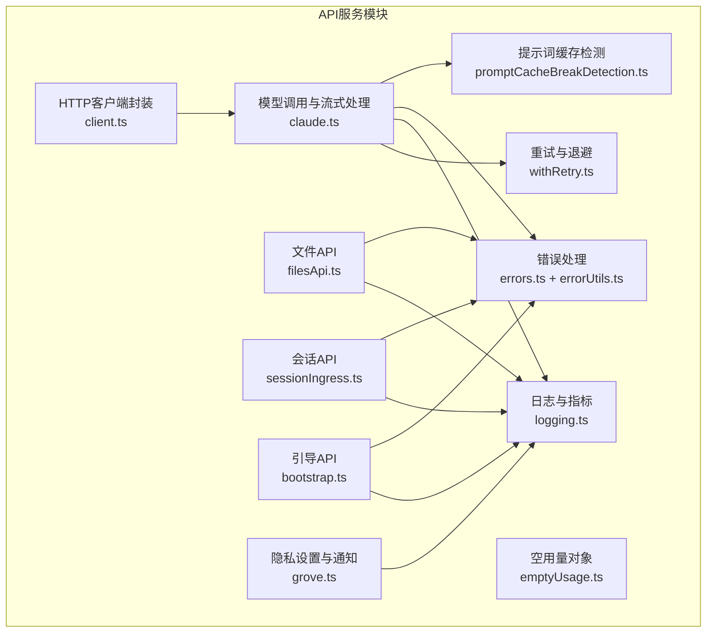

**图表来源**
- [src/services/api/client.ts:1-390](file://src/services/api/client.ts#L1-L390)
- [src/services/api/claude.ts:1-800](file://src/services/api/claude.ts#L1-L800)
- [src/services/api/filesApi.ts:1-749](file://src/services/api/filesApi.ts#L1-L749)
- [src/services/api/bootstrap.ts:1-142](file://src/services/api/bootstrap.ts#L1-L142)
- [src/services/api/sessionIngress.ts:1-515](file://src/services/api/sessionIngress.ts#L1-L515)
- [src/services/api/withRetry.ts:1-823](file://src/services/api/withRetry.ts#L1-L823)
- [src/services/api/logging.ts:1-789](file://src/services/api/logging.ts#L1-L789)
- [src/services/api/errors.ts:1-1208](file://src/services/api/errors.ts#L1-L1208)
- [src/services/api/errorUtils.ts:1-261](file://src/services/api/errorUtils.ts#L1-L261)
- [src/services/api/promptCacheBreakDetection.ts:1-728](file://src/services/api/promptCacheBreakDetection.ts#L1-L728)
- [src/services/api/grove.ts:1-358](file://src/services/api/grove.ts#L1-L358)
- [src/services/api/emptyUsage.ts:1-23](file://src/services/api/emptyUsage.ts#L1-L23)

**章节来源**
- [src/services/api/client.ts:1-390](file://src/services/api/client.ts#L1-L390)
- [src/services/api/claude.ts:1-800](file://src/services/api/claude.ts#L1-L800)
- [src/services/api/filesApi.ts:1-749](file://src/services/api/filesApi.ts#L1-L749)
- [src/services/api/bootstrap.ts:1-142](file://src/services/api/bootstrap.ts#L1-L142)
- [src/services/api/sessionIngress.ts:1-515](file://src/services/api/sessionIngress.ts#L1-L515)
- [src/services/api/withRetry.ts:1-823](file://src/services/api/withRetry.ts#L1-L823)
- [src/services/api/logging.ts:1-789](file://src/services/api/logging.ts#L1-L789)
- [src/services/api/errors.ts:1-1208](file://src/services/api/errors.ts#L1-L1208)
- [src/services/api/errorUtils.ts:1-261](file://src/services/api/errorUtils.ts#L1-L261)
- [src/services/api/promptCacheBreakDetection.ts:1-728](file://src/services/api/promptCacheBreakDetection.ts#L1-L728)
- [src/services/api/grove.ts:1-358](file://src/services/api/grove.ts#L1-L358)
- [src/services/api/emptyUsage.ts:1-23](file://src/services/api/emptyUsage.ts#L1-L23)

## 核心组件
- HTTP 客户端封装与认证：统一注入默认头、会话标识、用户代理、可选自定义头；支持多提供商（Anthropic、Bedrock、Vertex、Foundry），并集成 OAuth/令牌刷新与调试日志。
- 模型调用与流式处理：封装消息序列、工具、思考配置、输出格式等，提供非流式与流式两种调用路径，内置流式空闲检测与超时保护。
- 文件 API：支持下载/上传/列出文件，带指数退避、并发限制、路径安全校验与错误分类。
- 会话 API：基于 JWT 的会话日志追加与获取，乐观并发控制（Last-Uuid），序列化同一会话写入，支持回退到 OAuth 获取。
- 引导 API：从后端拉取客户端数据与模型选项，带响应校验与磁盘缓存更新。
- 重试与退避：统一的 withRetry 机制，支持 529/429/连接错误等的指数退避、持久重试模式、快速模式降级与上下文调整。
- 日志与指标：结构化事件上报、OTLP 记录、网关识别、TTFT/耗时统计、用量归一化。
- 错误处理：错误分类、消息生成、连接细节提取、速率限制与配额信息展示。
- 提示词缓存检测：跨调用对比系统提示、工具、模型、快慢模式、Beta 头等变化，定位缓存未命中原因并记录差异。
- 隐私设置与通知：Grove 配置获取与缓存、用户选择记录、非交互模式下的合规检查。

**章节来源**
- [src/services/api/client.ts:88-316](file://src/services/api/client.ts#L88-L316)
- [src/services/api/claude.ts:709-780](file://src/services/api/claude.ts#L709-L780)
- [src/services/api/filesApi.ts:132-180](file://src/services/api/filesApi.ts#L132-L180)
- [src/services/api/sessionIngress.ts:63-186](file://src/services/api/sessionIngress.ts#L63-L186)
- [src/services/api/bootstrap.ts:42-109](file://src/services/api/bootstrap.ts#L42-L109)
- [src/services/api/withRetry.ts:170-517](file://src/services/api/withRetry.ts#L170-L517)
- [src/services/api/logging.ts:171-789](file://src/services/api/logging.ts#L171-L789)
- [src/services/api/errors.ts:425-800](file://src/services/api/errors.ts#L425-L800)
- [src/services/api/errorUtils.ts:42-261](file://src/services/api/errorUtils.ts#L42-L261)
- [src/services/api/promptCacheBreakDetection.ts:247-666](file://src/services/api/promptCacheBreakDetection.ts#L247-L666)
- [src/services/api/grove.ts:52-358](file://src/services/api/grove.ts#L52-L358)
- [src/services/api/emptyUsage.ts:8-22](file://src/services/api/emptyUsage.ts#L8-L22)

## 架构总览
API 服务采用分层设计：
- 传输层：client.ts 统一封装 fetch、默认头、认证与提供商切换。
- 业务层：claude.ts 聚合消息、工具、思考与输出配置，调用 withRetry 实现重试与退避。
- 响应层：logging.ts 记录成功/失败事件、用量、耗时与 TTFT；errors.ts 生成用户可读错误消息。
- 并发与一致性：sessionIngress.ts 使用 Last-Uuid 与序列化包装保证幂等写入。
- 缓存与可观测性：promptCacheBreakDetection.ts 检测缓存未命中原因；grove.ts 管理隐私设置与通知。

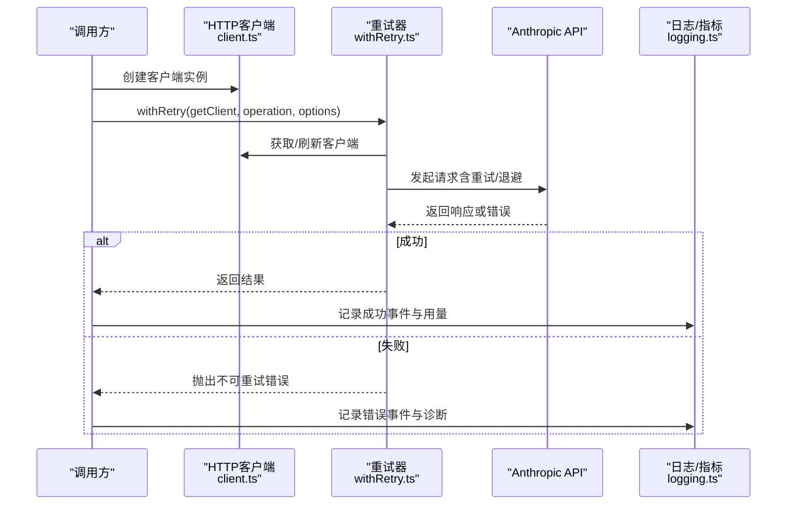

**图表来源**
- [src/services/api/client.ts:88-153](file://src/services/api/client.ts#L88-L153)
- [src/services/api/withRetry.ts:170-254](file://src/services/api/withRetry.ts#L170-L254)
- [src/services/api/logging.ts:581-789](file://src/services/api/logging.ts#L581-L789)

**章节来源**
- [src/services/api/client.ts:88-316](file://src/services/api/client.ts#L88-L316)
- [src/services/api/withRetry.ts:170-517](file://src/services/api/withRetry.ts#L170-L517)
- [src/services/api/logging.ts:581-789](file://src/services/api/logging.ts#L581-L789)

## 详细组件分析

### HTTP 客户端封装与认证
- 默认头注入：应用名、用户代理、会话 ID、容器/远程会话标识、可选自定义头。
- 认证策略：OAuth 令牌刷新与注入；非订阅用户回退到 API Key 或外部密钥助手；支持 Bedrock/Vertex/Foundry 的特定认证方式。
- 提供商适配：根据环境变量自动切换 Anthropic/Bedrock/Vertex/Foundry；支持代理与调试日志。
- 请求关联：在第一方 API 上注入 x-client-request-id，便于服务器侧日志关联。

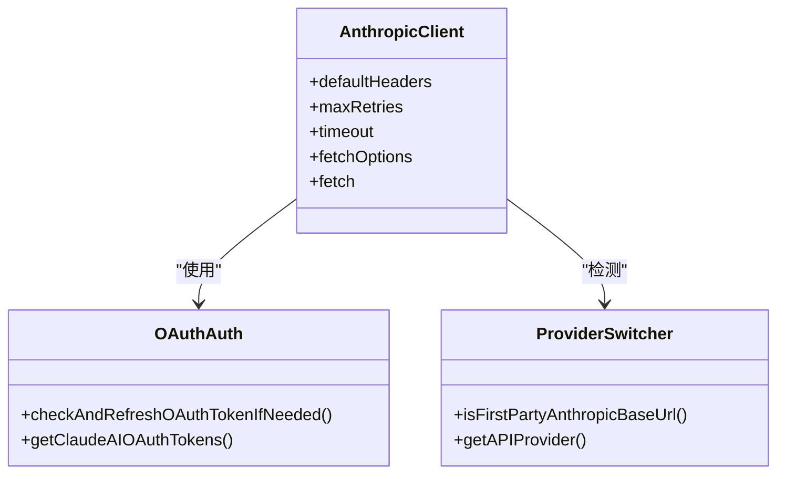

**图表来源**
- [src/services/api/client.ts:88-316](file://src/services/api/client.ts#L88-L316)
- [src/services/api/client.ts:318-354](file://src/services/api/client.ts#L318-L354)

**章节来源**
- [src/services/api/client.ts:88-316](file://src/services/api/client.ts#L88-L316)
- [src/services/api/client.ts:318-390](file://src/services/api/client.ts#L318-L390)

### 模型调用与流式处理
- 输入规范化：将用户/助手消息转换为 API 参数，支持缓存控制与内容克隆避免污染。
- 非流式与流式：queryModelWithoutStreaming 与 queryModelWithStreaming 分别返回完整消息与增量事件流。
- 流式空闲保护：定时器检测长时间无数据，记录警告/错误并终止流。
- 快速模式与配额：结合 withRetry 的快速模式降级与配额状态处理。

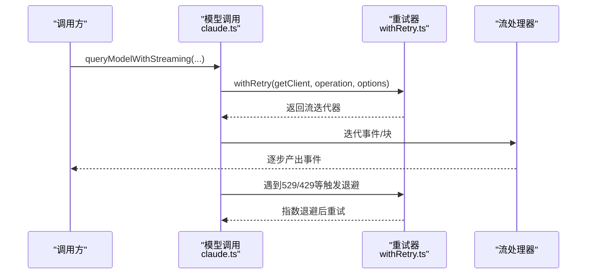

**图表来源**
- [src/services/api/claude.ts:752-780](file://src/services/api/claude.ts#L752-L780)
- [src/services/api/withRetry.ts:170-517](file://src/services/api/withRetry.ts#L170-L517)

**章节来源**
- [src/services/api/claude.ts:588-674](file://src/services/api/claude.ts#L588-L674)
- [src/services/api/claude.ts:709-780](file://src/services/api/claude.ts#L709-L780)
- [src/services/api/claude.ts:1892-1930](file://src/services/api/claude.ts#L1892-L1930)

### 文件 API（上传/下载/版本控制）
- 下载：指数退避、超时、路径安全校验（防目录穿越）、并发下载。
- 上传：大小校验、multipart 构造、边界随机化、错误分类（认证/配额/网络）。
- 列表：分页游标、鉴权与错误处理。
- 结果类型：统一的 UploadResult/DownloadResult，便于上层聚合与展示。

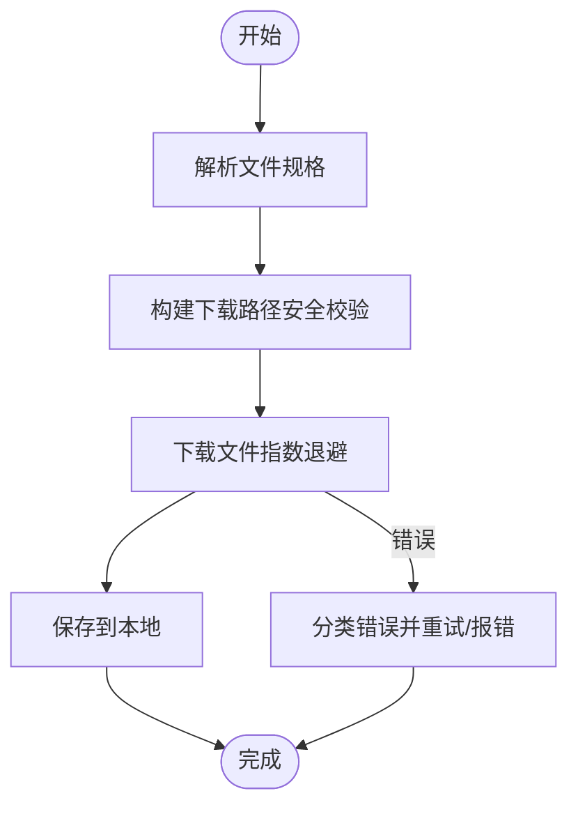

**图表来源**
- [src/services/api/filesApi.ts:132-180](file://src/services/api/filesApi.ts#L132-L180)
- [src/services/api/filesApi.ts:219-267](file://src/services/api/filesApi.ts#L219-L267)
- [src/services/api/filesApi.ts:378-552](file://src/services/api/filesApi.ts#L378-L552)

**章节来源**
- [src/services/api/filesApi.ts:132-180](file://src/services/api/filesApi.ts#L132-L180)
- [src/services/api/filesApi.ts:219-267](file://src/services/api/filesApi.ts#L219-L267)
- [src/services/api/filesApi.ts:378-552](file://src/services/api/filesApi.ts#L378-L552)
- [src/services/api/filesApi.ts:617-709](file://src/services/api/filesApi.ts#L617-L709)

### 会话 API（会话创建、状态同步）
- JWT 令牌：通过 getSessionIngressAuthToken 获取会话令牌。
- 写入：PUT 追加日志，Last-Uuid 乐观并发控制；409 冲突时采用服务器最新 UUID 并重试。
- 读取：支持直接获取与通过 OAuth 获取（迁移阶段）。
- 序列化：按会话 ID 串行化写入，避免竞态。

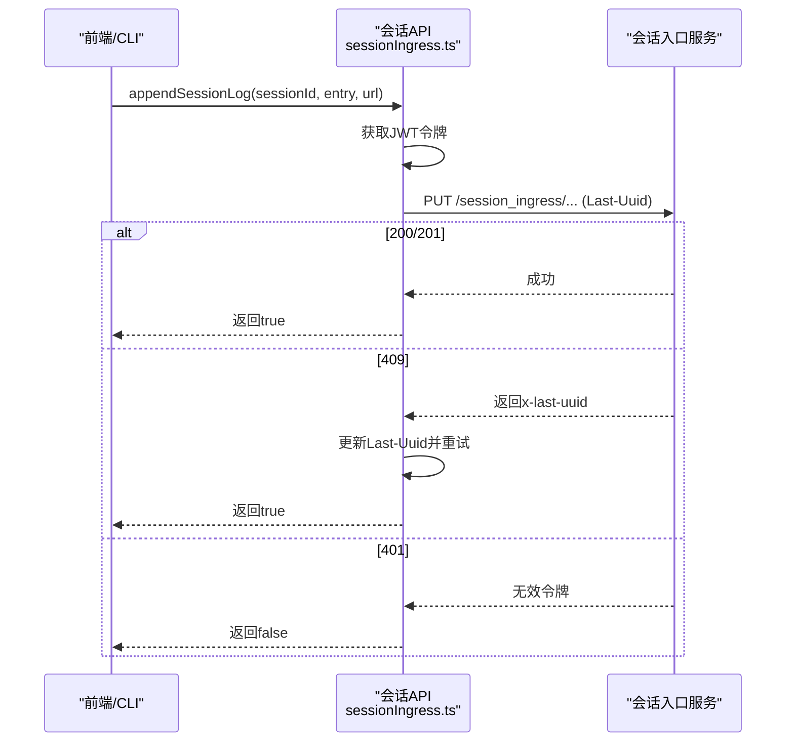

**图表来源**
- [src/services/api/sessionIngress.ts:63-186](file://src/services/api/sessionIngress.ts#L63-L186)
- [src/services/api/sessionIngress.ts:193-212](file://src/services/api/sessionIngress.ts#L193-L212)

**章节来源**
- [src/services/api/sessionIngress.ts:63-186](file://src/services/api/sessionIngress.ts#L63-L186)
- [src/services/api/sessionIngress.ts:193-240](file://src/services/api/sessionIngress.ts#L193-L240)
- [src/services/api/sessionIngress.ts:246-415](file://src/services/api/sessionIngress.ts#L246-L415)

### 引导 API（配置加载、用户认证）
- 仅在首方且允许非必要流量时启用；优先 OAuth（需 user:profile 权限），否则回退到 API Key。
- 响应校验与磁盘缓存：仅在数据变更时写入，避免频繁磁盘写操作。
- 与隐私级别联动：在“仅必要流量”模式下跳过。

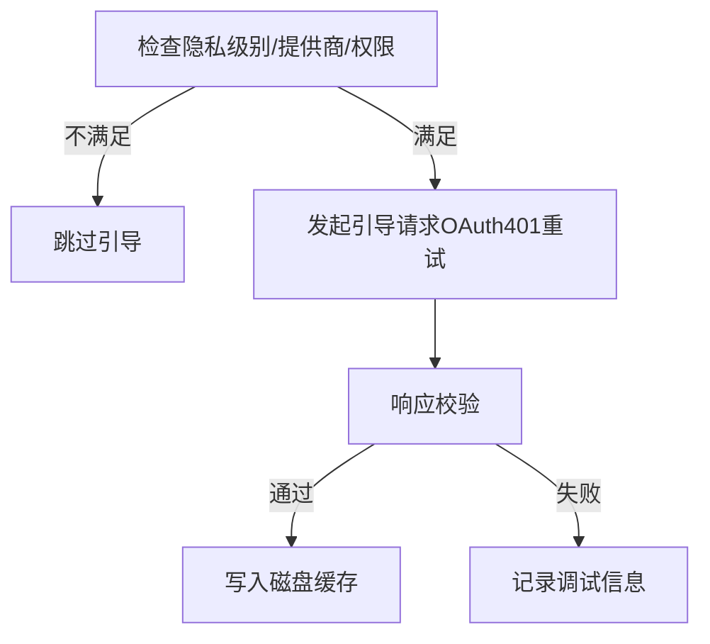

**图表来源**
- [src/services/api/bootstrap.ts:42-109](file://src/services/api/bootstrap.ts#L42-L109)
- [src/services/api/bootstrap.ts:114-142](file://src/services/api/bootstrap.ts#L114-L142)

**章节来源**
- [src/services/api/bootstrap.ts:42-109](file://src/services/api/bootstrap.ts#L42-L109)
- [src/services/api/bootstrap.ts:114-142](file://src/services/api/bootstrap.ts#L114-L142)

### 重试策略与超时处理
- 通用规则：408/409/429/5xx、连接错误、特定 529/429 场景可重试；可通过 x-should-retry 与速率限制头决定。
- 指数退避：基础延迟与抖动，最大退避上限；持久重试模式下延长等待并周期性心跳。
- 快速模式降级：在 429/529 时短延迟保持快速模式以保留缓存，长延迟则切换标准速度并冷却。
- 上下文调整：当出现“上下文溢出”错误时，动态调整 max_tokens 以避免重复失败。

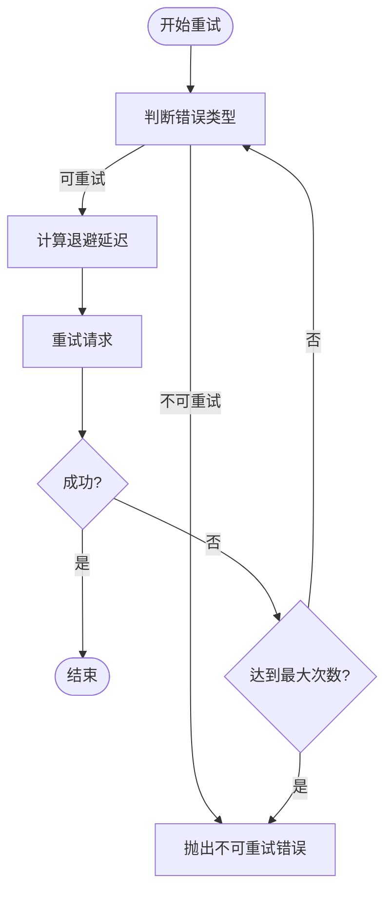

**图表来源**
- [src/services/api/withRetry.ts:696-787](file://src/services/api/withRetry.ts#L696-L787)
- [src/services/api/withRetry.ts:530-548](file://src/services/api/withRetry.ts#L530-L548)

**章节来源**
- [src/services/api/withRetry.ts:170-517](file://src/services/api/withRetry.ts#L170-L517)
- [src/services/api/withRetry.ts:597-621](file://src/services/api/withRetry.ts#L597-L621)

### 日志记录与监控
- 成功事件：记录模型、用量、耗时、TTFT、停止原因、成本、查询源、权限模式、全局缓存策略等。
- 失败事件：记录错误类型、状态码、尝试次数、客户端请求 ID、是否回退到非流式、提示类别、网关类型等。
- OTLP：结构化事件上报，便于链路追踪与性能分析。
- 会话追踪：与 beta tracing 协作，记录模型输出、思考输出与工具调用标记。

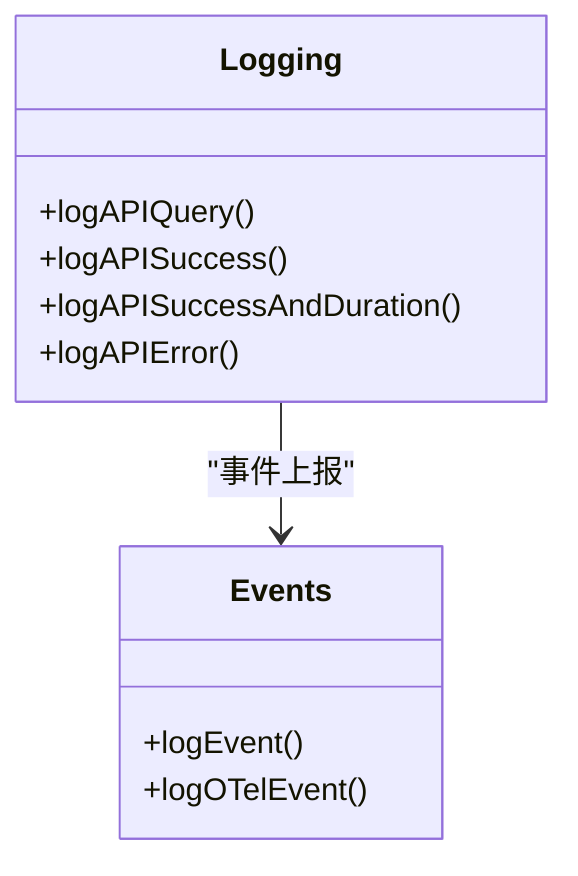

**图表来源**
- [src/services/api/logging.ts:171-233](file://src/services/api/logging.ts#L171-L233)
- [src/services/api/logging.ts:398-579](file://src/services/api/logging.ts#L398-L579)
- [src/services/api/logging.ts:581-789](file://src/services/api/logging.ts#L581-L789)

**章节来源**
- [src/services/api/logging.ts:171-233](file://src/services/api/logging.ts#L171-L233)
- [src/services/api/logging.ts:398-579](file://src/services/api/logging.ts#L398-L579)
- [src/services/api/logging.ts:581-789](file://src/services/api/logging.ts#L581-L789)

### 错误处理与消息生成
- 错误分类：速率限制、提示过长、媒体过大、工具并发问题、无效模型名、信用不足、组织禁用等。
- 用户消息：针对不同错误生成可读提示，包含恢复建议与上下文信息。
- 连接细节：提取 SSL/TLS 与底层错误码，提供可操作的修复建议。

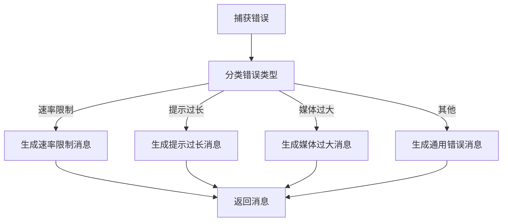

**图表来源**
- [src/services/api/errors.ts:425-558](file://src/services/api/errors.ts#L425-L558)
- [src/services/api/errors.ts:559-780](file://src/services/api/errors.ts#L559-L780)
- [src/services/api/errorUtils.ts:200-261](file://src/services/api/errorUtils.ts#L200-L261)

**章节来源**
- [src/services/api/errors.ts:425-558](file://src/services/api/errors.ts#L425-L558)
- [src/services/api/errors.ts:559-780](file://src/services/api/errors.ts#L559-L780)
- [src/services/api/errorUtils.ts:200-261](file://src/services/api/errorUtils.ts#L200-L261)

### 提示词缓存检测
- 跟踪维度：系统提示、工具 Schema、模型、快慢模式、全局缓存策略、Beta 头、自动模式、超量使用状态、缓存编辑开关、努力值、额外请求体。
- 缓存未命中判定：比较前后缓存读取令牌，结合时间间隔与变更原因进行分析。
- 差异记录：生成 diff 文件辅助调试。

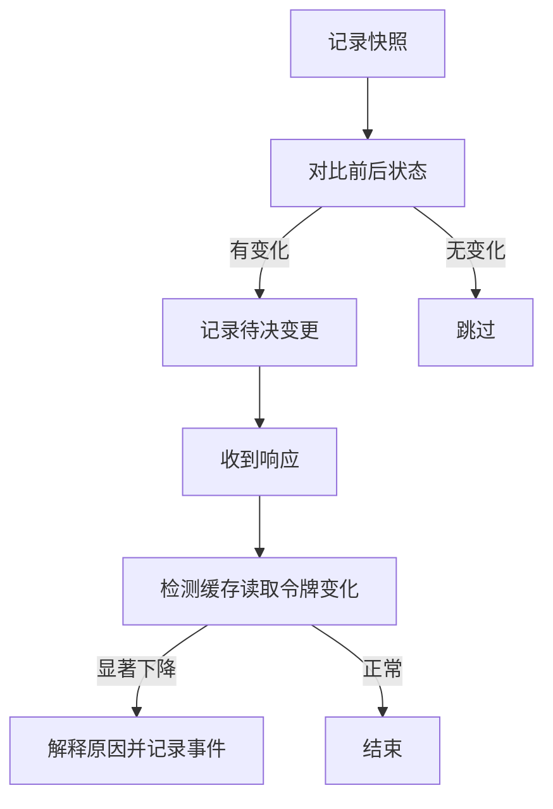

**图表来源**
- [src/services/api/promptCacheBreakDetection.ts:247-430](file://src/services/api/promptCacheBreakDetection.ts#L247-L430)
- [src/services/api/promptCacheBreakDetection.ts:437-666](file://src/services/api/promptCacheBreakDetection.ts#L437-L666)

**章节来源**
- [src/services/api/promptCacheBreakDetection.ts:247-430](file://src/services/api/promptCacheBreakDetection.ts#L247-L430)
- [src/services/api/promptCacheBreakDetection.ts:437-666](file://src/services/api/promptCacheBreakDetection.ts#L437-L666)

### 隐私设置与通知（Grove）
- 配置获取：memoized 缓存，短超时与失败不缓存策略。
- 用户选择：记录用户对隐私政策通知的选择与查看状态。
- 非交互模式：在必要时打印提示并优雅退出。

**章节来源**
- [src/services/api/grove.ts:52-85](file://src/services/api/grove.ts#L52-L85)
- [src/services/api/grove.ts:157-193](file://src/services/api/grove.ts#L157-L193)
- [src/services/api/grove.ts:323-358](file://src/services/api/grove.ts#L323-L358)

## 依赖关系分析
- 组件耦合：claude.ts 依赖 client.ts、withRetry.ts、logging.ts、errors.ts；filesApi.ts 依赖 axios 与错误工具；sessionIngress.ts 依赖 OAuth 与会话令牌；bootstrap.ts 依赖 OAuth 配置与磁盘缓存。
- 外部依赖：@anthropic-ai/sdk、axios、lodash-es、diff 等。
- 循环依赖：当前文件间未见循环导入；如需扩展，应避免在 API 层引入 UI/组件树依赖。

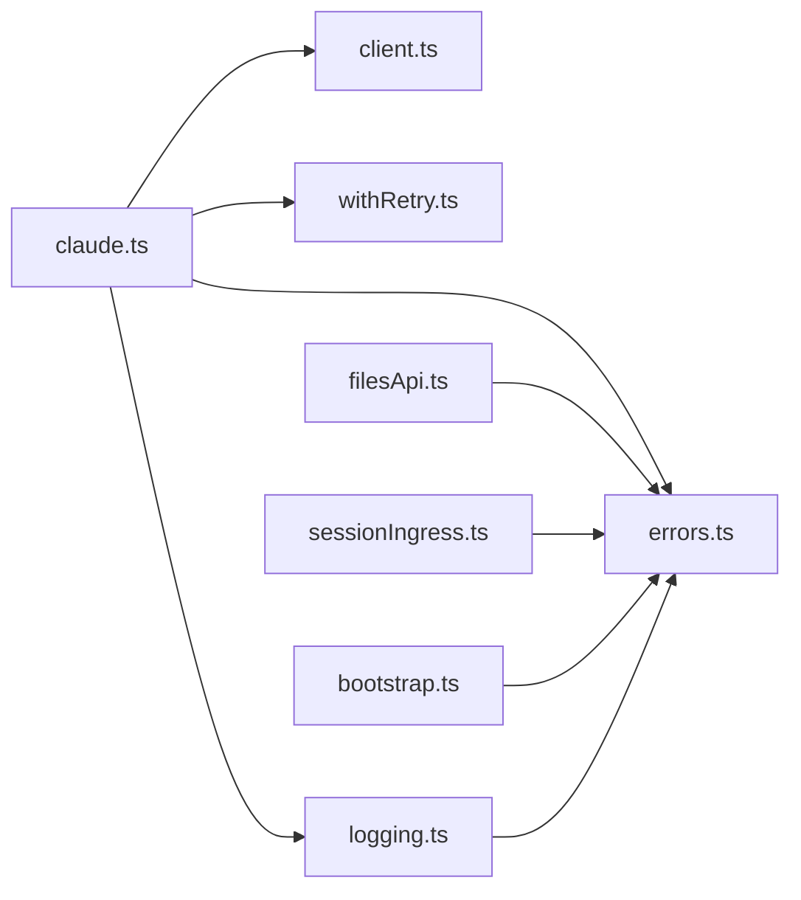

**图表来源**
- [src/services/api/claude.ts:231-257](file://src/services/api/claude.ts#L231-L257)
- [src/services/api/filesApi.ts:1-25](file://src/services/api/filesApi.ts#L1-L25)
- [src/services/api/sessionIngress.ts:1-15](file://src/services/api/sessionIngress.ts#L1-L15)
- [src/services/api/bootstrap.ts:1-18](file://src/services/api/bootstrap.ts#L1-L18)

**章节来源**
- [src/services/api/claude.ts:231-257](file://src/services/api/claude.ts#L231-L257)
- [src/services/api/filesApi.ts:1-25](file://src/services/api/filesApi.ts#L1-L25)
- [src/services/api/sessionIngress.ts:1-15](file://src/services/api/sessionIngress.ts#L1-L15)
- [src/services/api/bootstrap.ts:1-18](file://src/services/api/bootstrap.ts#L1-L18)

## 性能考虑
- 并发与限流：文件下载/上传默认并发 5；会话写入按会话串行化，避免竞争。
- 退避策略：指数退避+抖动，避免放大效应；持久重试模式下限制最长等待时间。
- 缓存策略：提示词缓存 TTL 与作用域（1h/5m/全局）按用户资格与来源动态决定；缓存编辑与压缩减少无效读取。
- 超时与保活：API 超时可配置；在特定连接错误时禁用 keep-alive 并重建连接。
- 观测性：TTFT、总耗时、用量、网关识别、工具调用长度统计，便于性能分析与优化。

[本节为通用指导，无需具体文件分析]

## 故障排除指南
- SSL/TLS 错误：根据错误码提供代理/证书/主机名校验建议。
- 401/403：OAuth 刷新或令牌撤销；检查令牌有效性与权限范围。
- 429/529：速率限制或容量过载；利用持久重试与快速模式降级策略；关注配额状态与超量使用禁用原因。
- 提示过长/媒体过大：根据错误详情与 gap 计算，提示缩减或转换格式。
- 会话写入冲突：Last-Uuid 不一致导致 409，自动采用服务器最新 UUID 并重试。
- 文件上传失败：区分认证/配额/网络错误，记录详细错误类型并重试。

**章节来源**
- [src/services/api/errorUtils.ts:94-100](file://src/services/api/errorUtils.ts#L94-L100)
- [src/services/api/errors.ts:465-558](file://src/services/api/errors.ts#L465-L558)
- [src/services/api/sessionIngress.ts:90-142](file://src/services/api/sessionIngress.ts#L90-L142)
- [src/services/api/filesApi.ts:491-532](file://src/services/api/filesApi.ts#L491-L532)

## 结论
该 API 服务模块通过统一的 HTTP 客户端封装、完善的重试与退避策略、严谨的错误分类与可观测性，实现了高可靠、高性能的模型调用与周边能力（文件、会话、引导）。提示词缓存检测与隐私设置进一步提升了用户体验与合规性。建议在扩展新端点时遵循现有模式：统一认证、标准化重试、结构化日志与错误消息、严格的输入校验与并发控制。

[本节为总结，无需具体文件分析]

## 附录

### API 扩展指南
- 新增端点
  - 在对应模块中新增函数，复用现有认证与重试机制。
  - 使用 withOAuth401Retry 包裹需要 OAuth 的请求。
  - 对于幂等写入，采用 Last-Uuid 乐观并发控制。
- 参数验证
  - 使用 zod 或自定义校验函数，确保请求体字段完整与合法。
  - 对媒体/文件大小、路径等进行前置校验。
- 响应格式化
  - 统一返回结构化结果类型（如 UploadResult/DownloadResult），并在失败时提供明确错误类型。
  - 将错误映射为用户可读消息，必要时提供恢复建议。
- 监控与日志
  - 使用 logEvent 记录关键事件，logOTelEvent 输出 OTLP 数据。
  - 对于异常场景，记录客户端请求 ID 以便服务端日志关联。

[本节为通用指导，无需具体文件分析]