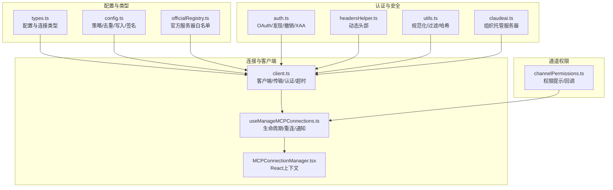
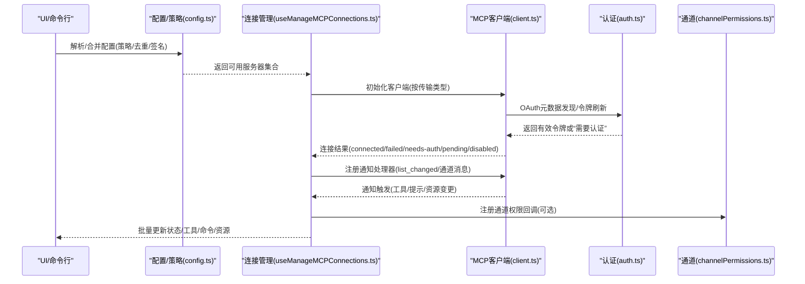
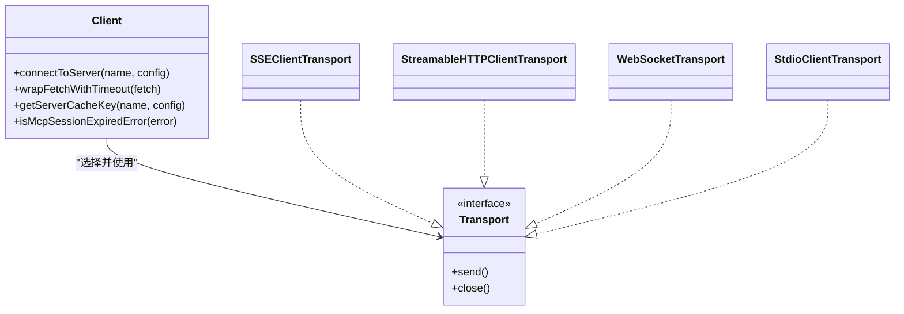
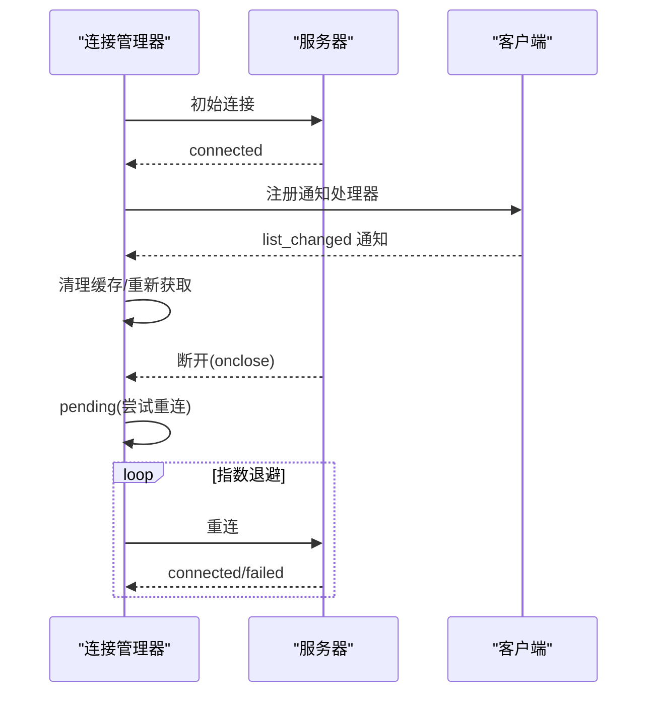
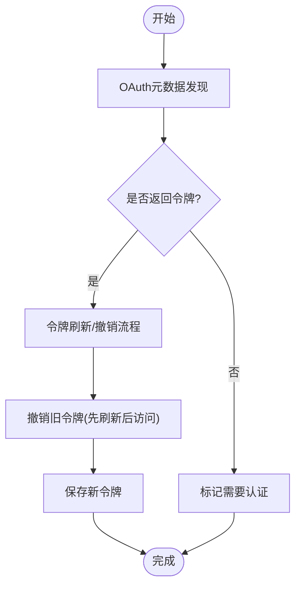
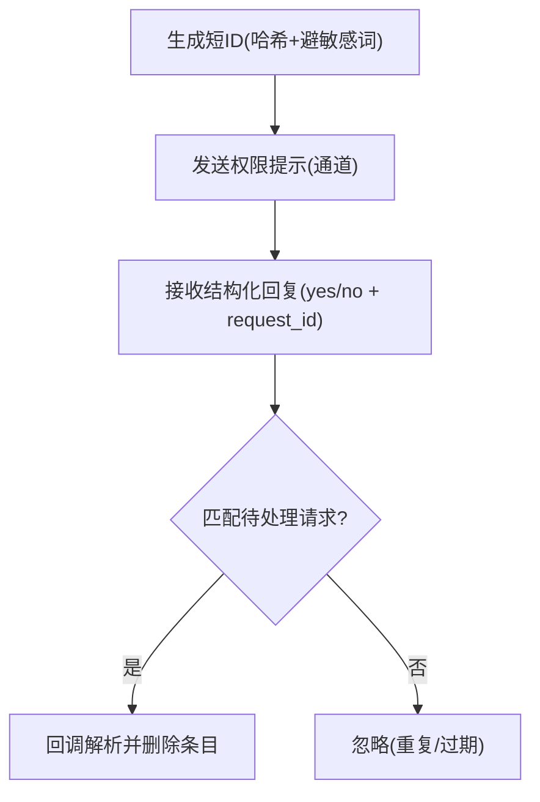
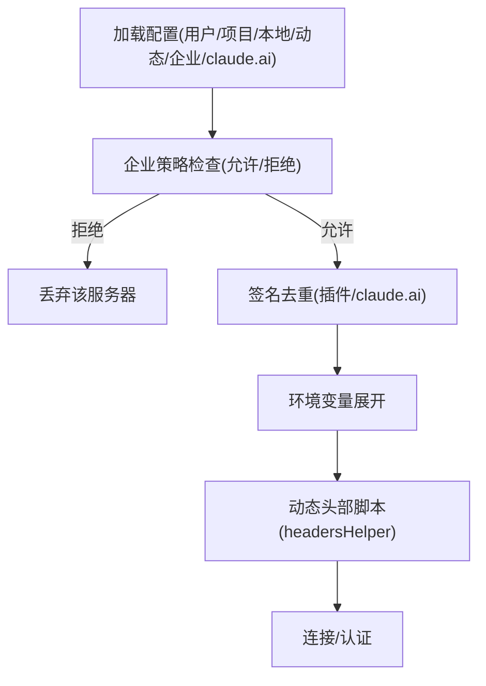
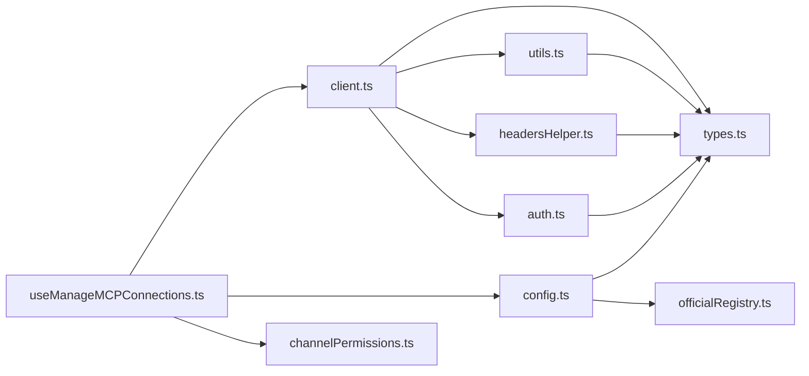

# MCP服务

<cite>
**本文引用的文件**
- [src/services/mcp/client.ts](file://src/services/mcp/client.ts)
- [src/services/mcp/MCPConnectionManager.tsx](file://src/services/mcp/MCPConnectionManager.tsx)
- [src/services/mcp/auth.ts](file://src/services/mcp/auth.ts)
- [src/services/mcp/channelPermissions.ts](file://src/services/mcp/channelPermissions.ts)
- [src/services/mcp/types.ts](file://src/services/mcp/types.ts)
- [src/services/mcp/config.ts](file://src/services/mcp/config.ts)
- [src/services/mcp/useManageMCPConnections.ts](file://src/services/mcp/useManageMCPConnections.ts)
- [src/services/mcp/officialRegistry.ts](file://src/services/mcp/officialRegistry.ts)
- [src/services/mcp/headersHelper.ts](file://src/services/mcp/headersHelper.ts)
- [src/services/mcp/normalization.ts](file://src/services/mcp/normalization.ts)
- [src/services/mcp/utils.ts](file://src/services/mcp/utils.ts)
- [src/services/mcp/claudeai.ts](file://src/services/mcp/claudeai.ts)
</cite>

## 目录
1. [简介](#简介)
2. [项目结构](#项目结构)
3. [核心组件](#核心组件)
4. [架构总览](#架构总览)
5. [详细组件分析](#详细组件分析)
6. [依赖关系分析](#依赖关系分析)
7. [性能考虑](#性能考虑)
8. [故障排查指南](#故障排查指南)
9. [结论](#结论)
10. [附录](#附录)

## 简介
本文件系统性梳理 Claude Code 的 MCP（模型上下文协议）服务模块，覆盖协议适配、连接管理、资源调度、认证与授权、通道权限与安全策略等关键能力。文档面向不同技术背景读者，既提供高层架构视图，也给出代码级细节与可视化图示，帮助开发者快速理解并扩展 MCP 能力。

## 项目结构
MCP 服务位于 src/services/mcp 目录，围绕“配置—连接—认证—通知—资源—UI”闭环组织，核心文件职责如下：
- 配置与类型：types.ts 定义服务器配置、连接状态与资源类型；config.ts 提供企业策略、去重、环境变量展开与写入；officialRegistry.ts 提供官方服务器白名单预取。
- 连接与客户端：client.ts 封装 MCP 客户端初始化、传输层选择（SSE/HTTP/WebSocket/stdio/sdk）、超时与头部合并、认证错误处理与会话过期检测；useManageMCPConnections.ts 管理连接生命周期、自动重连与通知监听；MCPConnectionManager.tsx 提供 React 上下文以暴露重连/启停接口。
- 认证与安全：auth.ts 实现 OAuth 发现、令牌刷新、跨应用访问（XAA）与撤销；headersHelper.ts 支持动态头部脚本；utils.ts 提供名称规范化、过滤与哈希校验；claudeai.ts 提供 claude.ai 组织托管服务器拉取。
- 通道权限：channelPermissions.ts 定义通道权限提示格式与回调工厂，配合 useManageMCPConnections.ts 注册通道消息与权限事件处理器。

图表来源
- [src/services/mcp/types.ts:1-259](file://src/services/mcp/types.ts#L1-L259)
- [src/services/mcp/config.ts:1-800](file://src/services/mcp/config.ts#L1-L800)
- [src/services/mcp/officialRegistry.ts:1-73](file://src/services/mcp/officialRegistry.ts#L1-L73)
- [src/services/mcp/client.ts:1-800](file://src/services/mcp/client.ts#L1-L800)
- [src/services/mcp/useManageMCPConnections.ts:1-800](file://src/services/mcp/useManageMCPConnections.ts#L1-L800)
- [src/services/mcp/MCPConnectionManager.tsx:1-73](file://src/services/mcp/MCPConnectionManager.tsx#L1-L73)
- [src/services/mcp/auth.ts:1-800](file://src/services/mcp/auth.ts#L1-L800)
- [src/services/mcp/headersHelper.ts:1-139](file://src/services/mcp/headersHelper.ts#L1-L139)
- [src/services/mcp/utils.ts:1-576](file://src/services/mcp/utils.ts#L1-L576)
- [src/services/mcp/claudeai.ts:1-165](file://src/services/mcp/claudeai.ts#L1-L165)
- [src/services/mcp/channelPermissions.ts:1-241](file://src/services/mcp/channelPermissions.ts#L1-L241)

章节来源
- [src/services/mcp/types.ts:1-259](file://src/services/mcp/types.ts#L1-L259)
- [src/services/mcp/config.ts:1-800](file://src/services/mcp/config.ts#L1-L800)
- [src/services/mcp/officialRegistry.ts:1-73](file://src/services/mcp/officialRegistry.ts#L1-L73)
- [src/services/mcp/client.ts:1-800](file://src/services/mcp/client.ts#L1-L800)
- [src/services/mcp/useManageMCPConnections.ts:1-800](file://src/services/mcp/useManageMCPConnections.ts#L1-L800)
- [src/services/mcp/MCPConnectionManager.tsx:1-73](file://src/services/mcp/MCPConnectionManager.tsx#L1-L73)
- [src/services/mcp/auth.ts:1-800](file://src/services/mcp/auth.ts#L1-L800)
- [src/services/mcp/headersHelper.ts:1-139](file://src/services/mcp/headersHelper.ts#L1-L139)
- [src/services/mcp/utils.ts:1-576](file://src/services/mcp/utils.ts#L1-L576)
- [src/services/mcp/claudeai.ts:1-165](file://src/services/mcp/claudeai.ts#L1-L165)
- [src/services/mcp/channelPermissions.ts:1-241](file://src/services/mcp/channelPermissions.ts#L1-L241)

## 核心组件
- MCP 客户端与传输层：支持 SSE、HTTP（含流式）、WebSocket、stdio、sdk 等多种传输；统一超时与 Accept 头处理；按需注入用户代理、代理与 TLS；支持会话入口 JWT 透传。
- 连接管理器：集中管理连接生命周期、批量状态更新、自动重连（指数退避）、通知监听（工具/提示/资源变更）、通道消息与权限事件。
- 认证服务：OAuth 元数据发现、令牌刷新与撤销、跨应用访问（XAA）；支持静默重试与缓存；提供“需要认证”状态与 UI 通知。
- 通道权限：标准化权限提示格式与短请求 ID；通道服务器声明式启用；回调工厂确保幂等与去重。
- 配置与策略：企业策略（允许/拒绝）、去重（插件/claude.ai）、动态头部脚本、URL 规范化与日志安全基址提取。

章节来源
- [src/services/mcp/client.ts:1-800](file://src/services/mcp/client.ts#L1-L800)
- [src/services/mcp/useManageMCPConnections.ts:1-800](file://src/services/mcp/useManageMCPConnections.ts#L1-L800)
- [src/services/mcp/auth.ts:1-800](file://src/services/mcp/auth.ts#L1-L800)
- [src/services/mcp/channelPermissions.ts:1-241](file://src/services/mcp/channelPermissions.ts#L1-L241)
- [src/services/mcp/config.ts:1-800](file://src/services/mcp/config.ts#L1-L800)
- [src/services/mcp/headersHelper.ts:1-139](file://src/services/mcp/headersHelper.ts#L1-L139)
- [src/services/mcp/utils.ts:1-576](file://src/services/mcp/utils.ts#L1-L576)

## 架构总览
MCP 服务采用“配置驱动 + 生命周期编排 + 传输抽象 + 安全与权限”的分层设计。配置层负责来源与策略；连接层负责建立与维护；安全层负责认证与授权；通知层负责资源变更与通道交互；UI 层通过 React 上下文暴露操作接口。

图表来源
- [src/services/mcp/config.ts:1-800](file://src/services/mcp/config.ts#L1-L800)
- [src/services/mcp/useManageMCPConnections.ts:1-800](file://src/services/mcp/useManageMCPConnections.ts#L1-L800)
- [src/services/mcp/client.ts:1-800](file://src/services/mcp/client.ts#L1-L800)
- [src/services/mcp/auth.ts:1-800](file://src/services/mcp/auth.ts#L1-L800)
- [src/services/mcp/channelPermissions.ts:1-241](file://src/services/mcp/channelPermissions.ts#L1-L241)

## 详细组件分析

### 组件A：MCP 客户端与传输层
- 传输适配：根据配置选择 SSEClientTransport、StreamableHTTPClientTransport、WebSocketTransport 或 StdioClientTransport；对 SSE/WS/HTTP 分别注入超时、Accept、代理、TLS、用户代理与动态头部。
- 请求超时：独立的 60 秒超时封装，避免单次 AbortSignal.timeout 在长连接上失效；GET 请求除外（保持 SSE 流）。
- 会话入口：若存在会话入口 JWT，则在 WS/HTTP 传输中透传，优先走代理路径。
- 错误处理：识别“会话未找到”（HTTP 404 + JSON-RPC -32001）；捕获认证失败并写入“需要认证”缓存；统一 McpAuthError/McpSessionExpiredError。
- 工具调用：限制描述长度、内容截断与持久化；统一工具调用超时；支持批量连接与并发控制。

图表来源
- [src/services/mcp/client.ts:1-800](file://src/services/mcp/client.ts#L1-L800)

章节来源
- [src/services/mcp/client.ts:1-800](file://src/services/mcp/client.ts#L1-L800)

### 组件B：连接管理器（生命周期与自动重连）
- 生命周期：onConnectionAttempt 注册连接成功后的副作用（注册通知处理器、清理缓存、自动重连）。
- 自动重连：对非本地传输（非 stdio/sdk）进行指数退避重连（最多5次，上限30秒），期间更新 pending 状态。
- 通知监听：监听工具/提示/资源列表变更通知，触发缓存失效与重新获取。
- 通道集成：根据通道网关策略注册通道消息与权限事件处理器，支持一次性警告提示与幂等回调。

图表来源
- [src/services/mcp/useManageMCPConnections.ts:1-800](file://src/services/mcp/useManageMCPConnections.ts#L1-L800)

章节来源
- [src/services/mcp/useManageMCPConnections.ts:1-800](file://src/services/mcp/useManageMCPConnections.ts#L1-L800)

### 组件C：认证服务（OAuth 与 XAA）
- OAuth 发现与刷新：支持配置元数据 URL 与 RFC 9728/8414 双路径发现；POST 响应体标准化以兼容非标准错误码；独立 30 秒超时信号。
- 令牌撤销：先撤销刷新令牌再撤销访问令牌；支持 RFC 7009 与回退 Bearer 方案；可保留步进式授权状态。
- 跨应用访问（XAA）：一次 IdP 登录复用到所有 XAA 服务器；保存与普通 OAuth 同一存储槽位；严格错误归类与缓存清理。
- 会话入口代理：为 claude.ai 代理连接注入 Authorization 头并支持一次重试刷新。

图表来源
- [src/services/mcp/auth.ts:1-800](file://src/services/mcp/auth.ts#L1-L800)

章节来源
- [src/services/mcp/auth.ts:1-800](file://src/services/mcp/auth.ts#L1-L800)

### 组件D：通道权限与安全策略
- 权限提示格式：严格正则匹配“y/n + 5字母短ID”，避免误匹配；短 ID 基于哈希并规避敏感词。
- 回调工厂：创建响应映射，支持去重与幂等解析；与通知处理器解耦。
- 通道网关：基于服务器能力与来源（插件/市场）决定是否注册通道消息与权限处理器；支持一次性警告提示。

图表来源
- [src/services/mcp/channelPermissions.ts:1-241](file://src/services/mcp/channelPermissions.ts#L1-L241)

章节来源
- [src/services/mcp/channelPermissions.ts:1-241](file://src/services/mcp/channelPermissions.ts#L1-L241)

### 组件E：配置与策略（企业策略、动态头部、签名）
- 企业策略：允许/拒绝列表支持名称、命令、URL 三种维度；URL 支持通配符；策略合并与去重。
- 动态头部：支持 headersHelper 脚本执行，动态注入请求头；项目/本地设置需信任确认；值必须为字符串对象。
- 签名与去重：基于命令/URL 的签名去重插件与 claude.ai 连接器；支持 SDK 类型服务器豁免。
- 日志安全：剥离查询参数与尾随斜杠，避免泄露令牌；提供官方服务器白名单预取。

图表来源
- [src/services/mcp/config.ts:1-800](file://src/services/mcp/config.ts#L1-L800)
- [src/services/mcp/headersHelper.ts:1-139](file://src/services/mcp/headersHelper.ts#L1-L139)
- [src/services/mcp/officialRegistry.ts:1-73](file://src/services/mcp/officialRegistry.ts#L1-L73)

章节来源
- [src/services/mcp/config.ts:1-800](file://src/services/mcp/config.ts#L1-L800)
- [src/services/mcp/headersHelper.ts:1-139](file://src/services/mcp/headersHelper.ts#L1-L139)
- [src/services/mcp/officialRegistry.ts:1-73](file://src/services/mcp/officialRegistry.ts#L1-L73)

## 依赖关系分析
- 组件耦合：useManageMCPConnections.ts 作为中枢协调 client.ts、config.ts、auth.ts、channelPermissions.ts；client.ts 依赖 transport 与 utils；auth.ts 依赖 secure storage 与 discovery；headersHelper.ts 依赖执行环境与 JSON 解析。
- 外部依赖：@modelcontextprotocol/sdk（客户端/传输/类型）、axios（OAuth/注册表）、lodash-es（memoize/mapValues/zipObject/p-map）、ws（WebSocket 客户端）、zod（配置校验）。
- 循环依赖：通过纯函数与无依赖的 normalization.ts 避免循环；工具函数如 hashMcpConfig 仅依赖稳定 JSON 序列化。

图表来源
- [src/services/mcp/useManageMCPConnections.ts:1-800](file://src/services/mcp/useManageMCPConnections.ts#L1-L800)
- [src/services/mcp/client.ts:1-800](file://src/services/mcp/client.ts#L1-L800)
- [src/services/mcp/config.ts:1-800](file://src/services/mcp/config.ts#L1-L800)
- [src/services/mcp/channelPermissions.ts:1-241](file://src/services/mcp/channelPermissions.ts#L1-L241)
- [src/services/mcp/types.ts:1-259](file://src/services/mcp/types.ts#L1-L259)
- [src/services/mcp/utils.ts:1-576](file://src/services/mcp/utils.ts#L1-L576)
- [src/services/mcp/headersHelper.ts:1-139](file://src/services/mcp/headersHelper.ts#L1-L139)
- [src/services/mcp/auth.ts:1-800](file://src/services/mcp/auth.ts#L1-L800)
- [src/services/mcp/officialRegistry.ts:1-73](file://src/services/mcp/officialRegistry.ts#L1-L73)

章节来源
- [src/services/mcp/useManageMCPConnections.ts:1-800](file://src/services/mcp/useManageMCPConnections.ts#L1-L800)
- [src/services/mcp/client.ts:1-800](file://src/services/mcp/client.ts#L1-L800)
- [src/services/mcp/config.ts:1-800](file://src/services/mcp/config.ts#L1-L800)
- [src/services/mcp/channelPermissions.ts:1-241](file://src/services/mcp/channelPermissions.ts#L1-L241)
- [src/services/mcp/types.ts:1-259](file://src/services/mcp/types.ts#L1-L259)
- [src/services/mcp/utils.ts:1-576](file://src/services/mcp/utils.ts#L1-L576)
- [src/services/mcp/headersHelper.ts:1-139](file://src/services/mcp/headersHelper.ts#L1-L139)
- [src/services/mcp/auth.ts:1-800](file://src/services/mcp/auth.ts#L1-L800)
- [src/services/mcp/officialRegistry.ts:1-73](file://src/services/mcp/officialRegistry.ts#L1-L73)

## 性能考虑
- 连接批处理：useManageMCPConnections.ts 使用 16ms 时间窗口批量更新状态，降低频繁 setState 导致的渲染抖动。
- 缓存与去重：client.ts 对连接结果与工具/提示/资源缓存进行 LRU 化；config.ts 基于签名去重避免重复连接。
- 传输优化：SSE/HTTP 流式传输强制 Accept 头；WebSocket/HTTP 传输注入代理与 TLS；超时独立封装避免长连接超时泄漏。
- 重连退避：指数退避上限 30 秒，避免风暴式重试；失败后进入 failed 状态，等待用户干预。

## 故障排查指南
- “需要认证”状态
  - 现象：服务器返回 401/403 或 OAuth 发现但无令牌。
  - 排查：检查 auth.ts 中的 discovery 与 tokens 流程；确认 headersHelper 是否返回有效头；查看 handleRemoteAuthFailure 的缓存写入。
  - 处理：触发 /mcp 重新认证或清除本地令牌后重试。
- 会话过期
  - 现象：HTTP 404 + JSON-RPC -32001。
  - 排查：isMcpSessionExpiredError 用于识别；client.ts 中的 clearServerCache 与 reconnectMcpServerImpl。
  - 处理：清理缓存后重连；必要时重建会话入口。
- 通道权限无效
  - 现象：权限提示未生效或重复。
  - 排查：channelPermissions.ts 的短 ID 生成与回调工厂；通道网关策略 gateChannelServer。
  - 处理：确认服务器声明了相应实验能力；检查请求 ID 是否匹配且未过期。
- 企业策略阻断
  - 现象：服务器被拒绝或未显示。
  - 排查：config.ts 的 allow/deny 列表与通配符匹配；签名去重逻辑。
  - 处理：调整策略或移除冲突配置。

章节来源
- [src/services/mcp/client.ts:1-800](file://src/services/mcp/client.ts#L1-L800)
- [src/services/mcp/auth.ts:1-800](file://src/services/mcp/auth.ts#L1-L800)
- [src/services/mcp/channelPermissions.ts:1-241](file://src/services/mcp/channelPermissions.ts#L1-L241)
- [src/services/mcp/config.ts:1-800](file://src/services/mcp/config.ts#L1-L800)

## 结论
MCP 服务模块通过清晰的分层与严格的契约，实现了从配置到连接、从认证到通知、从策略到 UI 的全链路能力。其传输抽象、自动重连与通知监听机制保证了稳定性；企业策略与通道权限增强了可控性与安全性；动态头部与官方注册表提升了可扩展性与可信度。建议在扩展新服务器或工具时遵循现有模式，确保一致的错误处理、日志与可观测性。

## 附录

### 协议规范与消息序列化
- 传输规范：SSE/HTTP/WebSocket/stdio/sdk；SSE/HTTP 需要符合流式传输 Accept 头；WebSocket 需要 mcp 协议。
- 消息处理：客户端监听 list_changed 通知以增量更新工具/提示/资源；通道消息与权限事件通过通知处理器分发。
- 序列化：统一使用 JSON；工具输入输出进行大小估算与截断；二进制内容持久化与安全存储。

章节来源
- [src/services/mcp/client.ts:1-800](file://src/services/mcp/client.ts#L1-L800)
- [src/services/mcp/useManageMCPConnections.ts:1-800](file://src/services/mcp/useManageMCPConnections.ts#L1-L800)

### MCP 服务器发现、自动重连与故障转移
- 发现：config.ts 合并用户/项目/本地/动态/企业/claude.ai 配置；officialRegistry.ts 提供官方服务器白名单预取。
- 自动重连：useManageMCPConnections.ts 指数退避（1s~30s），最多5次；断线后清理缓存并重连。
- 故障转移：企业策略与去重避免重复连接；动态头部脚本失败不影响主流程；XAA 失败清理 IdP 缓存。

章节来源
- [src/services/mcp/config.ts:1-800](file://src/services/mcp/config.ts#L1-L800)
- [src/services/mcp/officialRegistry.ts:1-73](file://src/services/mcp/officialRegistry.ts#L1-L73)
- [src/services/mcp/useManageMCPConnections.ts:1-800](file://src/services/mcp/useManageMCPConnections.ts#L1-L800)
- [src/services/mcp/auth.ts:1-800](file://src/services/mcp/auth.ts#L1-L800)

### MCP 扩展指南
- 新服务器集成
  - 在 .mcp.json 或用户/项目/本地配置中添加服务器定义；遵循 types.ts 中的配置模式。
  - 若为远程服务器，可配置 headersHelper 以动态注入头；注意项目/本地设置需信任确认。
  - 企业策略：通过 allow/deny 列表控制；URL 支持通配符。
- 自定义工具包装
  - 使用 client.ts 的工具调用封装；注意描述长度限制与内容截断。
  - 工具名称规范化：使用 normalization.ts 的 normalizeNameForMCP。
- 资源管理
  - 监听 ResourceListChangedNotification；使用 utils.ts 的过滤与哈希校验避免陈旧资源。
- 通道权限
  - 服务器声明实验能力；客户端注册权限处理器；使用 channelPermissions.ts 的回调工厂。

章节来源
- [src/services/mcp/types.ts:1-259](file://src/services/mcp/types.ts#L1-L259)
- [src/services/mcp/config.ts:1-800](file://src/services/mcp/config.ts#L1-L800)
- [src/services/mcp/headersHelper.ts:1-139](file://src/services/mcp/headersHelper.ts#L1-L139)
- [src/services/mcp/normalization.ts:1-24](file://src/services/mcp/normalization.ts#L1-L24)
- [src/services/mcp/utils.ts:1-576](file://src/services/mcp/utils.ts#L1-L576)
- [src/services/mcp/channelPermissions.ts:1-241](file://src/services/mcp/channelPermissions.ts#L1-L241)

### MCP 调试工具、性能监控与安全审计
- 调试工具
  - 通过 logMCPDebug/logMCPError 输出连接与错误信息；使用 getLoggingSafeMcpBaseUrl 输出日志安全基址。
  - 通道消息与权限事件通过通知处理器记录；权限提示格式与短 ID 生成可审计。
- 性能监控
  - 连接批处理（16ms）与缓存失效策略；重连退避与最大尝试次数；超时独立封装避免泄漏。
- 安全审计
  - OAuth 元数据发现与 POST 响应体标准化；令牌撤销与步进式授权状态保留；动态头部脚本执行前的信任检查；官方服务器白名单预取。

章节来源
- [src/services/mcp/client.ts:1-800](file://src/services/mcp/client.ts#L1-L800)
- [src/services/mcp/useManageMCPConnections.ts:1-800](file://src/services/mcp/useManageMCPConnections.ts#L1-L800)
- [src/services/mcp/auth.ts:1-800](file://src/services/mcp/auth.ts#L1-L800)
- [src/services/mcp/headersHelper.ts:1-139](file://src/services/mcp/headersHelper.ts#L1-L139)
- [src/services/mcp/officialRegistry.ts:1-73](file://src/services/mcp/officialRegistry.ts#L1-L73)
- [src/services/mcp/utils.ts:1-576](file://src/services/mcp/utils.ts#L1-L576)