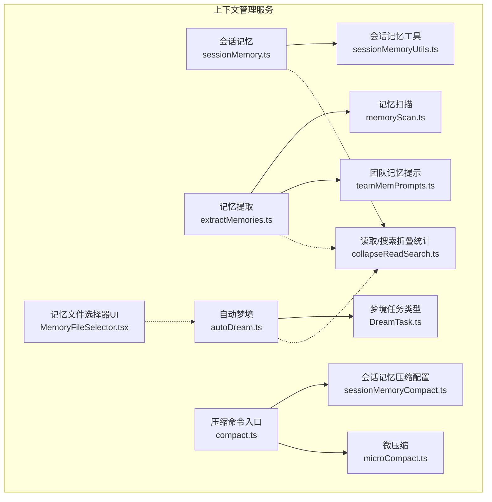
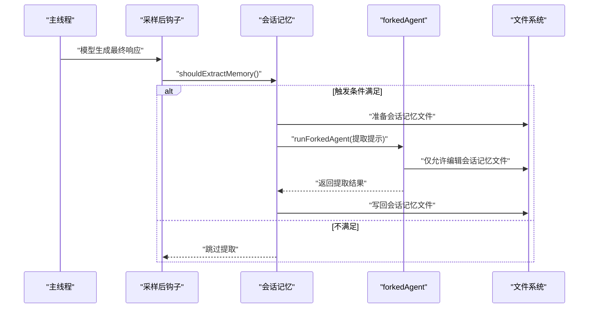
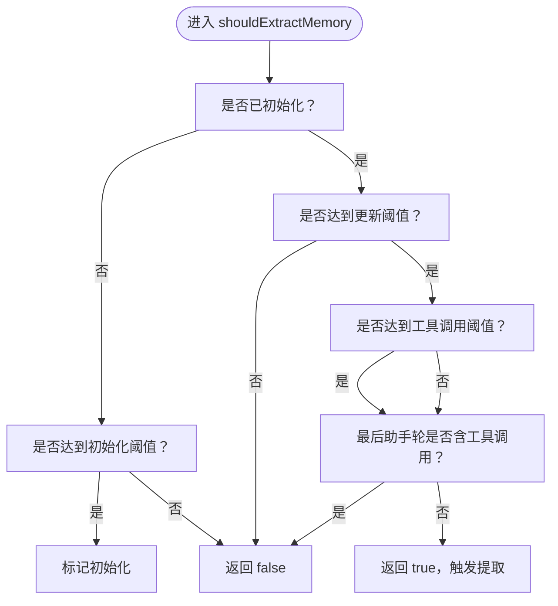
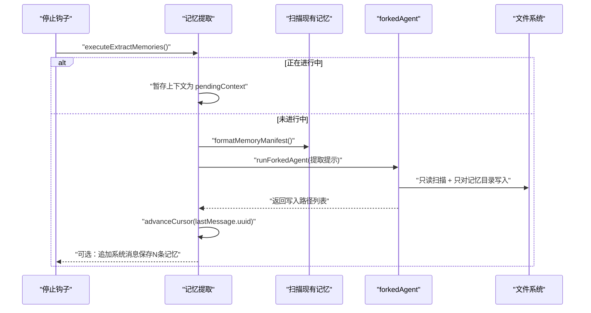
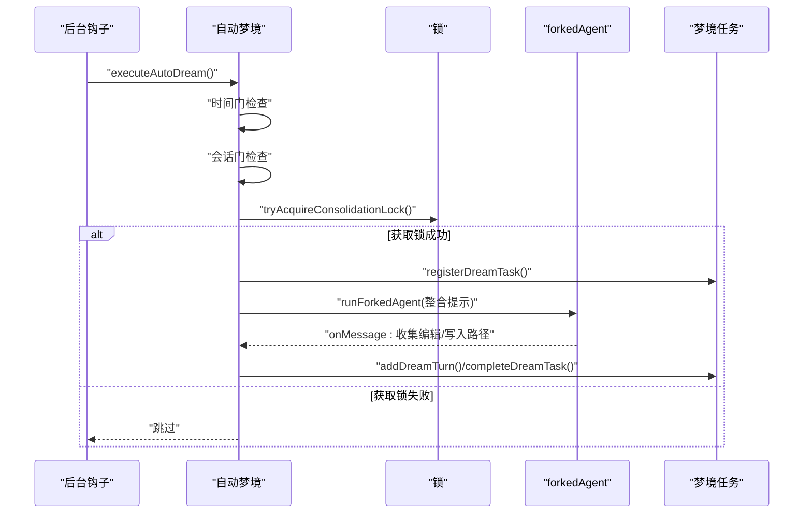
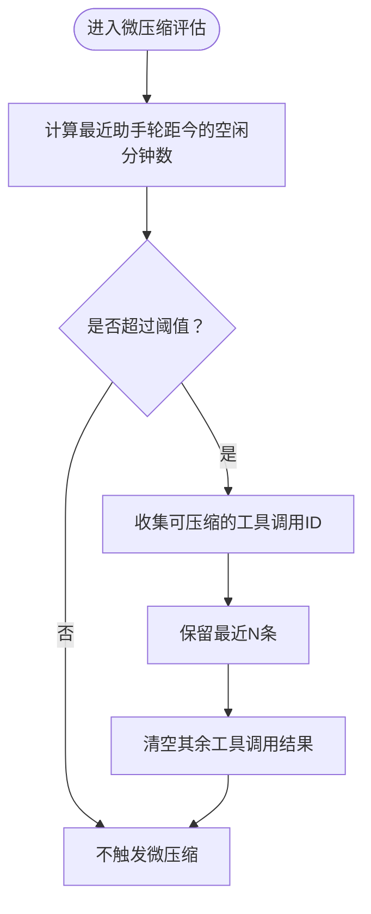
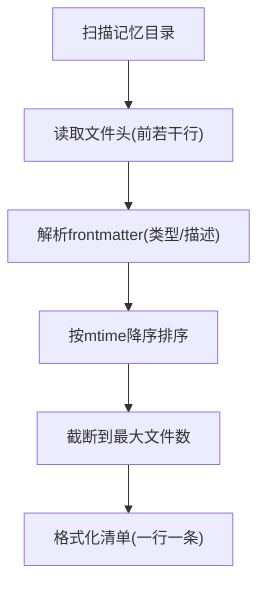
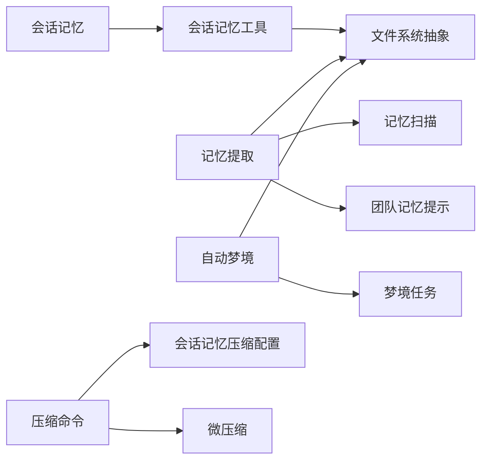

# 上下文管理服务

<cite>
**本文引用的文件**
- [src/services/SessionMemory/sessionMemory.ts](file://src/services/SessionMemory/sessionMemory.ts)
- [src/services/SessionMemory/sessionMemoryUtils.ts](file://src/services/SessionMemory/sessionMemoryUtils.ts)
- [src/services/extractMemories/extractMemories.ts](file://src/services/extractMemories/extractMemories.ts)
- [src/services/autoDream/autoDream.ts](file://src/services/autoDream/autoDream.ts)
- [src/services/compact/sessionMemoryCompact.ts](file://src/services/compact/sessionMemoryCompact.ts)
- [src/services/compact/microCompact.ts](file://src/services/compact/microCompact.ts)
- [src/commands/compact/compact.ts](file://src/commands/compact/compact.ts)
- [src/memdir/memoryScan.ts](file://src/memdir/memoryScan.ts)
- [src/memdir/teamMemPrompts.ts](file://src/memdir/teamMemPrompts.ts)
- [src/utils/collapseReadSearch.ts](file://src/utils/collapseReadSearch.ts)
- [src/components/memory/MemoryFileSelector.tsx](file://src/components/memory/MemoryFileSelector.tsx)
- [src/tasks/DreamTask/DreamTask.ts](file://src/tasks/DreamTask/DreamTask.ts)
</cite>

## 目录
1. [简介](#简介)
2. [项目结构](#项目结构)
3. [核心组件](#核心组件)
4. [架构总览](#架构总览)
5. [详细组件分析](#详细组件分析)
6. [依赖关系分析](#依赖关系分析)
7. [性能考量](#性能考量)
8. [故障排查指南](#故障排查指南)
9. [结论](#结论)
10. [附录](#附录)

## 简介
本文件系统性梳理 Claude Code 的上下文管理服务模块，围绕“会话记忆、内容压缩与智能提取”三大支柱展开，重点覆盖：
- 会话记忆：基于后台子代理的自动提取与更新，确保在不中断主对话的前提下持续沉淀关键信息。
- 内容压缩：对话历史压缩、内存优化与时间触发的微压缩，降低上下文开销并维持可读性。
- 智能提取：从当前会话中抽取可持久化的知识条目，写入自动记忆目录，并支持团队记忆联动。
- 自动梦境（智能休眠与状态保存）：周期性整合多会话信号，进行知识合并、修剪与索引维护。

同时，文档给出上下文窗口管理、时间窗口处理、容量限制机制的实现要点，以及扩展指南（新增压缩算法、自定义记忆格式、检索优化）与性能优化、存储策略、数据迁移建议。

## 项目结构
上下文管理服务主要分布在以下模块：
- 会话记忆：负责在后台周期性提取关键信息到会话记忆文件，避免阻塞主线程。
- 记忆提取：在每次查询循环结束时，从会话转录中抽取可持久化记忆，写入自动记忆目录。
- 自动梦境：周期性扫描会话，聚合多会话信号，执行知识整合与索引维护。
- 压缩与微压缩：通过会话记忆压缩配置与微压缩策略，控制上下文规模与增长速率。
- 记忆扫描与提示：对现有记忆文件进行扫描与格式化，作为提取与召回的输入。

**图表来源**
- [src/services/SessionMemory/sessionMemory.ts:1-496](file://src/services/SessionMemory/sessionMemory.ts#L1-L496)
- [src/services/SessionMemory/sessionMemoryUtils.ts:1-208](file://src/services/SessionMemory/sessionMemoryUtils.ts#L1-L208)
- [src/services/extractMemories/extractMemories.ts:1-616](file://src/services/extractMemories/extractMemories.ts#L1-L616)
- [src/services/autoDream/autoDream.ts:1-325](file://src/services/autoDream/autoDream.ts#L1-L325)
- [src/services/compact/sessionMemoryCompact.ts:1-96](file://src/services/compact/sessionMemoryCompact.ts#L1-L96)
- [src/services/compact/microCompact.ts:429-467](file://src/services/compact/microCompact.ts#L429-L467)
- [src/commands/compact/compact.ts:48-118](file://src/commands/compact/compact.ts#L48-L118)
- [src/memdir/memoryScan.ts:45-94](file://src/memdir/memoryScan.ts#L45-L94)
- [src/memdir/teamMemPrompts.ts:1-27](file://src/memdir/teamMemPrompts.ts#L1-L27)
- [src/utils/collapseReadSearch.ts:978-1020](file://src/utils/collapseReadSearch.ts#L978-L1020)
- [src/components/memory/MemoryFileSelector.tsx:154-199](file://src/components/memory/MemoryFileSelector.tsx#L154-L199)
- [src/tasks/DreamTask/DreamTask.ts:25-74](file://src/tasks/DreamTask/DreamTask.ts#L25-L74)

**章节来源**
- [src/services/SessionMemory/sessionMemory.ts:1-496](file://src/services/SessionMemory/sessionMemory.ts#L1-L496)
- [src/services/SessionMemory/sessionMemoryUtils.ts:1-208](file://src/services/SessionMemory/sessionMemoryUtils.ts#L1-L208)
- [src/services/extractMemories/extractMemories.ts:1-616](file://src/services/extractMemories/extractMemories.ts#L1-L616)
- [src/services/autoDream/autoDream.ts:1-325](file://src/services/autoDream/autoDream.ts#L1-L325)
- [src/services/compact/sessionMemoryCompact.ts:1-96](file://src/services/compact/sessionMemoryCompact.ts#L1-L96)
- [src/services/compact/microCompact.ts:429-467](file://src/services/compact/microCompact.ts#L429-L467)
- [src/commands/compact/compact.ts:48-118](file://src/commands/compact/compact.ts#L48-L118)
- [src/memdir/memoryScan.ts:45-94](file://src/memdir/memoryScan.ts#L45-L94)
- [src/memdir/teamMemPrompts.ts:1-27](file://src/memdir/teamMemPrompts.ts#L1-L27)
- [src/utils/collapseReadSearch.ts:978-1020](file://src/utils/collapseReadSearch.ts#L978-L1020)
- [src/components/memory/MemoryFileSelector.tsx:154-199](file://src/components/memory/MemoryFileSelector.tsx#L154-L199)
- [src/tasks/DreamTask/DreamTask.ts:25-74](file://src/tasks/DreamTask/DreamTask.ts#L25-L74)

## 核心组件
- 会话记忆（Session Memory）
  - 职责：在后台周期性提取关键信息到会话记忆文件，使用 forked agent 隔离执行，避免阻塞主线程；通过阈值控制触发频率，保证上下文增长可控。
  - 关键点：初始化阈值、更新阈值（上下文增长）、工具调用次数阈值、最后助手轮是否含工具调用等综合判定触发条件。
- 记忆提取（Extract Memories）
  - 职责：在每次查询循环结束时，从会话转录中抽取可持久化记忆，写入自动记忆目录；支持团队记忆联动与只读工具约束。
  - 关键点：互斥保护（主代理直接写入时跳过）、节流（turnsSinceLastExtraction）、并发去重（inFlightExtractions）、超时与尾随运行（pendingContext）。
- 自动梦境（Auto Dream）
  - 职责：周期性扫描会话，聚合多会话信号，执行知识整合、修剪与索引维护；通过锁机制避免并发冲突。
  - 关键点：时间门（minHours）、会话门（minSessions）、锁机制、进度监控与任务状态管理。
- 压缩与微压缩（Compact & Micro-compact）
  - 职责：通过会话记忆压缩配置与微压缩策略，控制上下文规模与增长速率；支持传统压缩与会话记忆压缩的优先级。
  - 关键点：最小保留令牌数、最大令牌数硬上限、最少文本块消息数、时间触发微压缩（gapMinutes）。

**章节来源**
- [src/services/SessionMemory/sessionMemory.ts:134-181](file://src/services/SessionMemory/sessionMemory.ts#L134-L181)
- [src/services/extractMemories/extractMemories.ts:329-523](file://src/services/extractMemories/extractMemories.ts#L329-L523)
- [src/services/autoDream/autoDream.ts:122-273](file://src/services/autoDream/autoDream.ts#L122-L273)
- [src/services/compact/sessionMemoryCompact.ts:44-96](file://src/services/compact/sessionMemoryCompact.ts#L44-L96)
- [src/services/compact/microCompact.ts:446-467](file://src/services/compact/microCompact.ts#L446-L467)

## 架构总览
上下文管理服务采用“后端子代理 + 阈值控制 + 工具权限约束”的架构模式，确保在不影响主对话体验的前提下完成知识沉淀与上下文优化。

**图表来源**
- [src/services/SessionMemory/sessionMemory.ts:272-350](file://src/services/SessionMemory/sessionMemory.ts#L272-L350)
- [src/services/SessionMemory/sessionMemoryUtils.ts:89-105](file://src/services/SessionMemory/sessionMemoryUtils.ts#L89-L105)

**章节来源**
- [src/services/SessionMemory/sessionMemory.ts:266-350](file://src/services/SessionMemory/sessionMemory.ts#L266-L350)
- [src/services/SessionMemory/sessionMemoryUtils.ts:89-105](file://src/services/SessionMemory/sessionMemoryUtils.ts#L89-L105)

## 详细组件分析

### 会话记忆（Session Memory）
- 触发策略
  - 初始化阈值：当上下文窗口总令牌达到阈值时才开始记录会话记忆。
  - 更新阈值：以“自上次提取以来上下文增长的令牌数”为依据，避免频繁提取。
  - 工具调用阈值：在满足更新阈值前提下，还需满足“自上次更新以来工具调用次数”阈值。
  - 最后一轮无工具调用：若最后助手轮不含工具调用，则可在满足更新阈值时立即提取。
- 文件与权限
  - 使用专用目录与文件，首次创建时注入模板；仅允许对目标文件执行编辑操作，其他工具调用一律拒绝。
- 远程配置与缓存
  - 通过缓存的特性开关与动态配置加载阈值参数，非阻塞初始化，后续按需更新。
- 手动提取
  - 提供手动触发接口，绕过阈值检查，用于 /summary 等场景。

**图表来源**
- [src/services/SessionMemory/sessionMemory.ts:134-181](file://src/services/SessionMemory/sessionMemory.ts#L134-L181)

**章节来源**
- [src/services/SessionMemory/sessionMemory.ts:134-181](file://src/services/SessionMemory/sessionMemory.ts#L134-L181)
- [src/services/SessionMemory/sessionMemory.ts:183-233](file://src/services/SessionMemory/sessionMemory.ts#L183-L233)
- [src/services/SessionMemory/sessionMemory.ts:272-350](file://src/services/SessionMemory/sessionMemory.ts#L272-L350)
- [src/services/SessionMemory/sessionMemoryUtils.ts:173-189](file://src/services/SessionMemory/sessionMemoryUtils.ts#L173-L189)

### 记忆提取（Extract Memories）
- 并发与互斥
  - 使用 inFlightExtractions 集合跟踪进行中的提取任务；若已有进行中的提取，将当前上下文暂存为 pendingContext，待当前任务完成后进行尾随运行。
  - 若主代理在本轮内直接写入记忆文件，则跳过 forked 提取，避免重复与竞争。
- 工具权限
  - 严格限制工具集：仅允许读取类工具与只读 Bash 命令，以及对自动记忆目录内的文件执行编辑/写入。
- 预注入现有记忆清单
  - 在提取前扫描自动记忆目录，格式化为清单注入提示，减少子代理首轮扫描成本。
- 统计与日志
  - 记录输入/输出令牌、缓存命中率、写入文件数、保存的记忆数、耗时等指标，便于观测与优化。

**图表来源**
- [src/services/extractMemories/extractMemories.ts:329-523](file://src/services/extractMemories/extractMemories.ts#L329-L523)
- [src/services/extractMemories/extractMemories.ts:171-222](file://src/services/extractMemories/extractMemories.ts#L171-L222)
- [src/memdir/memoryScan.ts:84-94](file://src/memdir/memoryScan.ts#L84-L94)

**章节来源**
- [src/services/extractMemories/extractMemories.ts:296-587](file://src/services/extractMemories/extractMemories.ts#L296-L587)
- [src/services/extractMemories/extractMemories.ts:329-523](file://src/services/extractMemories/extractMemories.ts#L329-L523)
- [src/memdir/memoryScan.ts:45-94](file://src/memdir/memoryScan.ts#L45-L94)

### 自动梦境（Auto Dream）
- 触发门限
  - 时间门：自上次整合到现在的时间间隔达到 minHours。
  - 会话门：自上次整合以来，有至少 minSessions 的会话被修改。
  - 锁机制：获取整合锁，避免并发冲突；失败则回退或延迟。
- 执行流程
  - 构建整合提示，限定工具权限（只读 Bash、只读文件访问、对记忆目录的写入），运行 forked agent。
  - 实时监控进度，收集编辑/写入的文件路径，更新任务状态与 UI。
- 结果反馈
  - 成功后追加系统消息，显示本次整合影响的文件数量；失败则回滚锁并记录事件。

**图表来源**
- [src/services/autoDream/autoDream.ts:122-273](file://src/services/autoDream/autoDream.ts#L122-L273)
- [src/tasks/DreamTask/DreamTask.ts:52-74](file://src/tasks/DreamTask/DreamTask.ts#L52-L74)

**章节来源**
- [src/services/autoDream/autoDream.ts:122-273](file://src/services/autoDream/autoDream.ts#L122-L273)
- [src/tasks/DreamTask/DreamTask.ts:25-74](file://src/tasks/DreamTask/DreamTask.ts#L25-L74)

### 压缩与微压缩（Compact & Micro-compact）
- 会话记忆压缩配置
  - 最小保留令牌数、最大令牌数硬上限、最少文本块消息数，保障压缩后的上下文仍具备可读性与完整性。
- 微压缩（时间触发）
  - 当助手轮距今的空闲分钟数超过阈值时，清理较旧的工具调用结果，仅保留最近若干条可读消息，避免上下文膨胀。
- 压缩命令入口
  - 优先尝试会话记忆压缩；若未启用或不可用，则走传统压缩路径；在某些模式下强制走反应式压缩。

**图表来源**
- [src/services/compact/microCompact.ts:446-467](file://src/services/compact/microCompact.ts#L446-L467)

**章节来源**
- [src/services/compact/sessionMemoryCompact.ts:44-96](file://src/services/compact/sessionMemoryCompact.ts#L44-L96)
- [src/services/compact/microCompact.ts:446-467](file://src/services/compact/microCompact.ts#L446-L467)
- [src/commands/compact/compact.ts:55-94](file://src/commands/compact/compact.ts#L55-L94)

### 记忆扫描与检索提示
- 记忆扫描
  - 读取记忆目录中的文件头（frontmatter），解析类型与描述，按修改时间排序，截断到最大文件数，形成清单。
- 团队记忆提示
  - 当启用团队记忆时，构建组合提示，包含四类记忆类型与每类的作用域指导，确保抽取一致性。
- 读取/搜索/写入折叠统计
  - 将记忆操作（读取、搜索、写入）汇总为用户可见的自然语言描述，便于在 UI 中展示。

**图表来源**
- [src/memdir/memoryScan.ts:45-94](file://src/memdir/memoryScan.ts#L45-L94)
- [src/memdir/teamMemPrompts.ts:1-27](file://src/memdir/teamMemPrompts.ts#L1-L27)
- [src/utils/collapseReadSearch.ts:978-1020](file://src/utils/collapseReadSearch.ts#L978-L1020)

**章节来源**
- [src/memdir/memoryScan.ts:45-94](file://src/memdir/memoryScan.ts#L45-L94)
- [src/memdir/teamMemPrompts.ts:1-27](file://src/memdir/teamMemPrompts.ts#L1-L27)
- [src/utils/collapseReadSearch.ts:978-1020](file://src/utils/collapseReadSearch.ts#L978-L1020)

## 依赖关系分析
- 组件耦合
  - 会话记忆与记忆提取共享“会话记忆文件路径”与“工具权限约束”，二者均依赖 forked agent 与缓存安全参数。
  - 自动梦境依赖记忆目录与会话扫描能力，通过锁机制避免并发冲突。
  - 压缩与微压缩依赖令牌计数与消息结构，确保压缩后上下文仍满足质量要求。
- 外部依赖
  - 文件系统抽象、缓存安全参数、特性开关与动态配置、错误处理与日志事件。

**图表来源**
- [src/services/SessionMemory/sessionMemory.ts:1-496](file://src/services/SessionMemory/sessionMemory.ts#L1-L496)
- [src/services/SessionMemory/sessionMemoryUtils.ts:1-208](file://src/services/SessionMemory/sessionMemoryUtils.ts#L1-L208)
- [src/services/extractMemories/extractMemories.ts:1-616](file://src/services/extractMemories/extractMemories.ts#L1-L616)
- [src/services/autoDream/autoDream.ts:1-325](file://src/services/autoDream/autoDream.ts#L1-L325)
- [src/services/compact/sessionMemoryCompact.ts:1-96](file://src/services/compact/sessionMemoryCompact.ts#L1-L96)
- [src/services/compact/microCompact.ts:429-467](file://src/services/compact/microCompact.ts#L429-L467)
- [src/commands/compact/compact.ts:48-118](file://src/commands/compact/compact.ts#L48-L118)
- [src/memdir/memoryScan.ts:45-94](file://src/memdir/memoryScan.ts#L45-L94)
- [src/memdir/teamMemPrompts.ts:1-27](file://src/memdir/teamMemPrompts.ts#L1-L27)
- [src/tasks/DreamTask/DreamTask.ts:25-74](file://src/tasks/DreamTask/DreamTask.ts#L25-L74)

**章节来源**
- [src/services/SessionMemory/sessionMemory.ts:1-496](file://src/services/SessionMemory/sessionMemory.ts#L1-L496)
- [src/services/SessionMemory/sessionMemoryUtils.ts:1-208](file://src/services/SessionMemory/sessionMemoryUtils.ts#L1-L208)
- [src/services/extractMemories/extractMemories.ts:1-616](file://src/services/extractMemories/extractMemories.ts#L1-L616)
- [src/services/autoDream/autoDream.ts:1-325](file://src/services/autoDream/autoDream.ts#L1-L325)
- [src/services/compact/sessionMemoryCompact.ts:1-96](file://src/services/compact/sessionMemoryCompact.ts#L1-L96)
- [src/services/compact/microCompact.ts:429-467](file://src/services/compact/microCompact.ts#L429-L467)
- [src/commands/compact/compact.ts:48-118](file://src/commands/compact/compact.ts#L48-L118)
- [src/memdir/memoryScan.ts:45-94](file://src/memdir/memoryScan.ts#L45-L94)
- [src/memdir/teamMemPrompts.ts:1-27](file://src/memdir/teamMemPrompts.ts#L1-L27)
- [src/tasks/DreamTask/DreamTask.ts:25-74](file://src/tasks/DreamTask/DreamTask.ts#L25-L74)

## 性能考量
- 缓存与提示复用
  - 通过 forked agent 的缓存安全参数共享父级提示缓存，显著降低重复计算与 API 调用。
- 工具权限与扫描预注入
  - 仅允许必要的工具与只读访问，减少不必要的 IO；在提取前扫描并格式化现有记忆清单，避免子代理首轮扫描。
- 并发控制与尾随运行
  - 使用 inFlightExtractions 与 pendingContext 避免重复与竞争，提升吞吐并保证最终一致性。
- 时间触发微压缩
  - 基于空闲时间清理工具调用结果，降低上下文体积，保持对话流畅度。
- 日志与指标
  - 记录输入/输出令牌、缓存命中率、写入文件数、保存的记忆数、耗时等，便于性能分析与优化。

[本节为通用性能讨论，无需特定文件来源]

## 故障排查指南
- 会话记忆未触发
  - 检查是否满足初始化阈值与更新阈值；确认最后助手轮是否含工具调用；查看远程配置是否生效。
  - 参考：[src/services/SessionMemory/sessionMemory.ts:134-181](file://src/services/SessionMemory/sessionMemory.ts#L134-L181)、[src/services/SessionMemory/sessionMemoryUtils.ts:173-189](file://src/services/SessionMemory/sessionMemoryUtils.ts#L173-L189)
- 记忆提取未执行
  - 是否处于进行中状态；是否有主代理直接写入导致跳过；是否启用自动记忆功能；是否处于远程模式。
  - 参考：[src/services/extractMemories/extractMemories.ts:527-567](file://src/services/extractMemories/extractMemories.ts#L527-L567)
- 自动梦境未执行
  - 时间门与会话门是否满足；锁是否被占用；当前是否处于远程模式或禁用状态。
  - 参考：[src/services/autoDream/autoDream.ts:122-172](file://src/services/autoDream/autoDream.ts#L122-L172)
- 工具调用被拒绝
  - 确认工具名称与输入参数是否符合只读或记忆目录内的编辑/写入规则。
  - 参考：[src/services/extractMemories/extractMemories.ts:171-222](file://src/services/extractMemories/extractMemories.ts#L171-L222)
- UI 展示异常
  - 查看记忆文件选择器与读取/搜索/写入统计逻辑，确认状态与时间戳显示是否正确。
  - 参考：[src/components/memory/MemoryFileSelector.tsx:154-199](file://src/components/memory/MemoryFileSelector.tsx#L154-L199)、[src/utils/collapseReadSearch.ts:978-1020](file://src/utils/collapseReadSearch.ts#L978-L1020)

**章节来源**
- [src/services/SessionMemory/sessionMemory.ts:134-181](file://src/services/SessionMemory/sessionMemory.ts#L134-L181)
- [src/services/SessionMemory/sessionMemoryUtils.ts:173-189](file://src/services/SessionMemory/sessionMemoryUtils.ts#L173-L189)
- [src/services/extractMemories/extractMemories.ts:527-567](file://src/services/extractMemories/extractMemories.ts#L527-L567)
- [src/services/autoDream/autoDream.ts:122-172](file://src/services/autoDream/autoDream.ts#L122-L172)
- [src/services/extractMemories/extractMemories.ts:171-222](file://src/services/extractMemories/extractMemories.ts#L171-L222)
- [src/components/memory/MemoryFileSelector.tsx:154-199](file://src/components/memory/MemoryFileSelector.tsx#L154-L199)
- [src/utils/collapseReadSearch.ts:978-1020](file://src/utils/collapseReadSearch.ts#L978-L1020)

## 结论
上下文管理服务通过“会话记忆 + 记忆提取 + 自动梦境 + 压缩与微压缩”的协同，实现了在不中断主对话体验的前提下，持续沉淀知识、优化上下文规模与质量的目标。其关键在于：
- 阈值驱动的触发策略与工具权限约束，确保安全与高效；
- forked agent 与缓存安全参数的使用，最大化提示复用；
- 并发控制与尾随运行，提升吞吐与一致性；
- 时间门与锁机制，保障周期性整合的稳定性。

[本节为总结性内容，无需特定文件来源]

## 附录

### 上下文窗口管理、时间窗口与容量限制
- 上下文窗口管理
  - 使用统一的令牌计数方法（与自动压缩一致），确保会话记忆初始化、更新阈值与压缩策略的一致性。
- 时间窗口处理
  - 会话记忆：以“自上次提取以来的上下文增长”为衡量；记忆提取：以“eligible turns”为节流单位；自动梦境：以“小时”为时间门。
- 容量限制机制
  - 会话记忆压缩配置设置最小保留令牌数与最大令牌数硬上限；微压缩按空闲时间清理工具调用结果，避免上下文无限膨胀。

**章节来源**
- [src/services/SessionMemory/sessionMemoryUtils.ts:18-29](file://src/services/SessionMemory/sessionMemoryUtils.ts#L18-L29)
- [src/services/SessionMemory/sessionMemoryUtils.ts:184-189](file://src/services/SessionMemory/sessionMemoryUtils.ts#L184-L189)
- [src/services/compact/sessionMemoryCompact.ts:44-61](file://src/services/compact/sessionMemoryCompact.ts#L44-L61)
- [src/services/compact/microCompact.ts:446-467](file://src/services/compact/microCompact.ts#L446-L467)

### 上下文扩展指南
- 新增压缩算法
  - 在压缩命令入口处扩展新的压缩路径，确保与现有令牌计数与消息结构兼容；在会话记忆压缩配置中增加参数以控制新算法的行为。
  - 参考：[src/commands/compact/compact.ts:55-94](file://src/commands/compact/compact.ts#L55-L94)、[src/services/compact/sessionMemoryCompact.ts:74-88](file://src/services/compact/sessionMemoryCompact.ts#L74-L88)
- 自定义记忆格式
  - 在记忆扫描与提示构建处扩展类型解析与格式化逻辑，确保 frontmatter 解析与清单生成符合新格式。
  - 参考：[src/memdir/memoryScan.ts:45-94](file://src/memdir/memoryScan.ts#L45-L94)、[src/memdir/teamMemPrompts.ts:1-27](file://src/memdir/teamMemPrompts.ts#L1-L27)
- 检索优化
  - 在记忆扫描阶段引入更精细的元数据索引（如类型、描述、关键词），并在提示中提供更明确的路由与范围指导，减少无关文件的读取与处理。
  - 参考：[src/memdir/memoryScan.ts:84-94](file://src/memdir/memoryScan.ts#L84-L94)

**章节来源**
- [src/commands/compact/compact.ts:55-94](file://src/commands/compact/compact.ts#L55-L94)
- [src/services/compact/sessionMemoryCompact.ts:74-88](file://src/services/compact/sessionMemoryCompact.ts#L74-L88)
- [src/memdir/memoryScan.ts:45-94](file://src/memdir/memoryScan.ts#L45-L94)
- [src/memdir/teamMemPrompts.ts:1-27](file://src/memdir/teamMemPrompts.ts#L1-L27)

### 性能优化、存储策略与数据迁移
- 性能优化
  - 共享提示缓存、只读工具与扫描预注入、并发去重与尾随运行、时间触发微压缩。
- 存储策略
  - 会话记忆文件位于专用目录，首次创建时注入模板；自动记忆目录按类型与描述组织，清单文件（如 MEMORY.md）用于索引。
- 数据迁移
  - 建议在迁移前备份现有记忆目录；迁移后验证 frontmatter 类型与描述字段的兼容性；必要时提供迁移脚本或提示，逐步将旧格式转换为新格式。

[本节为通用建议，无需特定文件来源]