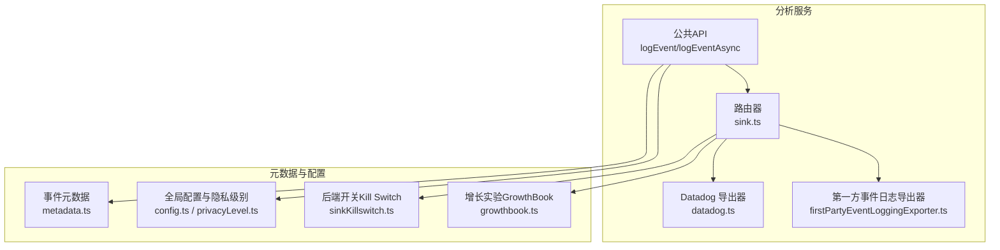
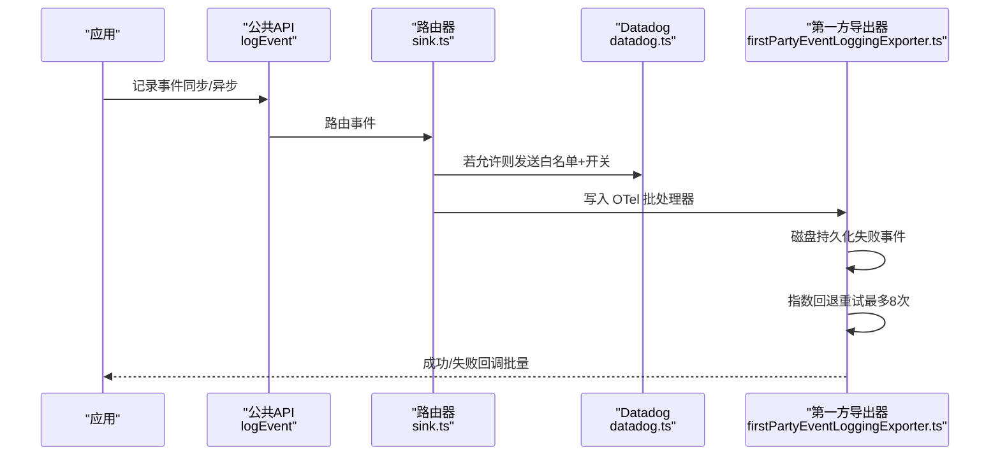
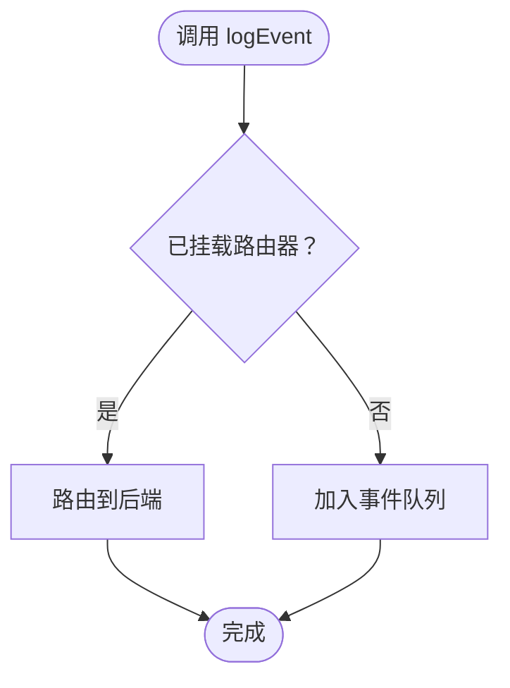
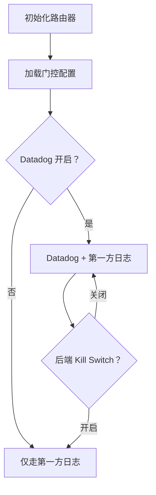
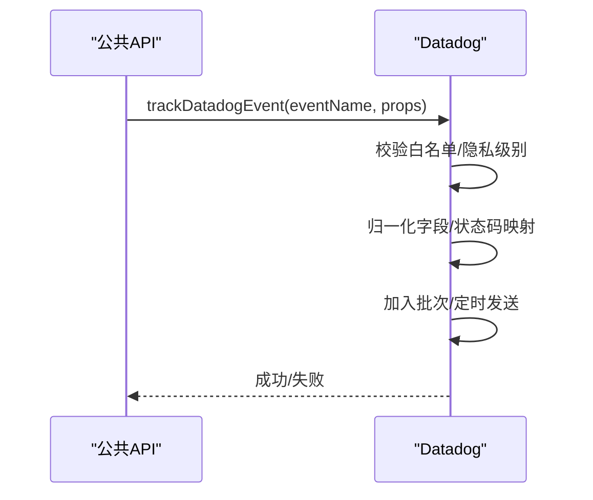
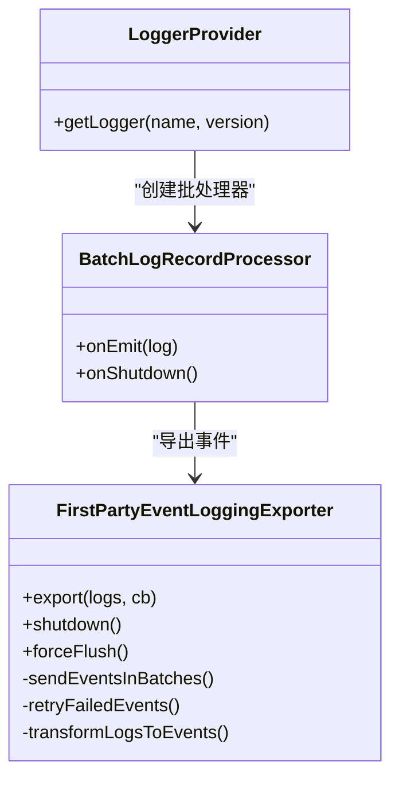
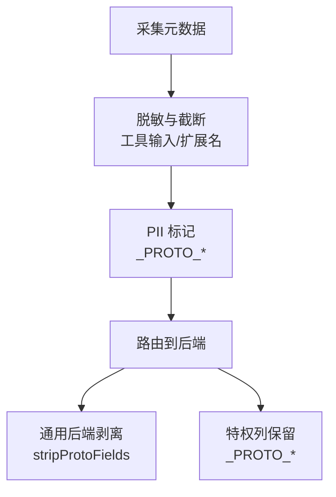
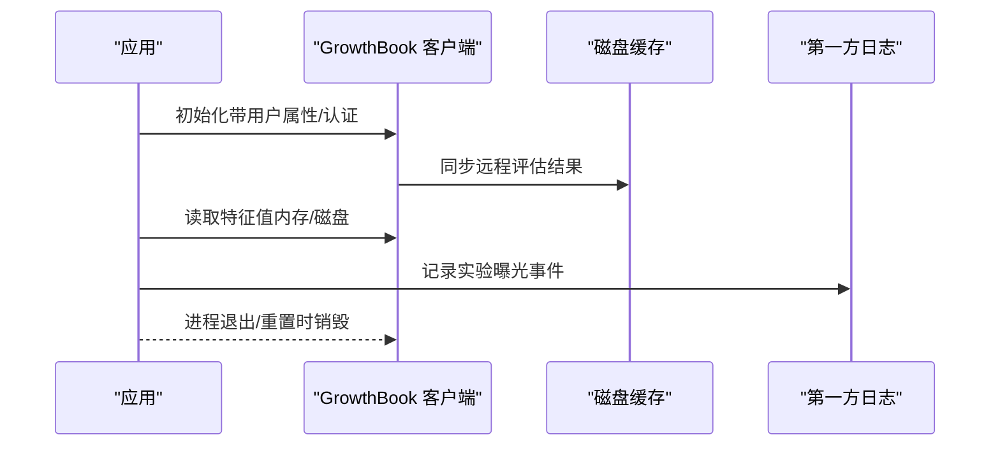
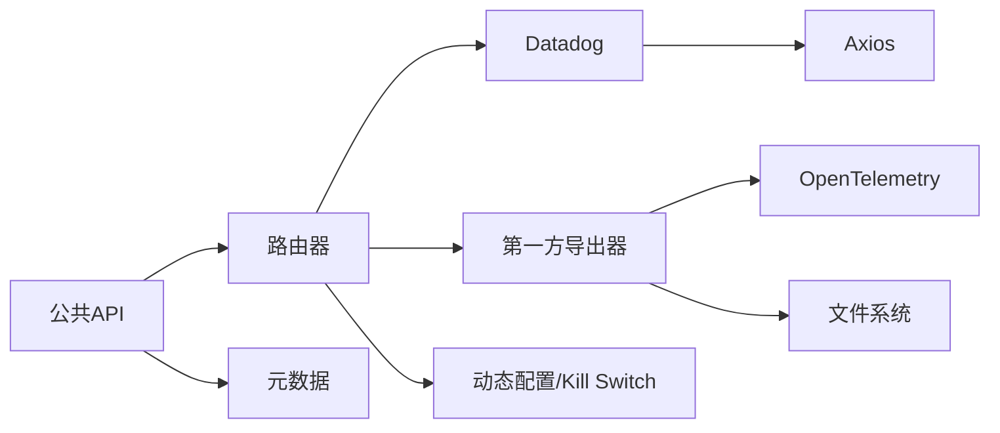

# 分析服务

<cite>
**本文引用的文件**
- [src/services/analytics/index.ts](file://src/services/analytics/index.ts)
- [src/services/analytics/sink.ts](file://src/services/analytics/sink.ts)
- [src/services/analytics/firstPartyEventLogger.ts](file://src/services/analytics/firstPartyEventLogger.ts)
- [src/services/analytics/firstPartyEventLoggingExporter.ts](file://src/services/analytics/firstPartyEventLoggingExporter.ts)
- [src/services/analytics/datadog.ts](file://src/services/analytics/datadog.ts)
- [src/services/analytics/metadata.ts](file://src/services/analytics/metadata.ts)
- [src/services/analytics/config.ts](file://src/services/analytics/config.ts)
- [src/services/analytics/sinkKillswitch.ts](file://src/services/analytics/sinkKillswitch.ts)
- [src/services/analytics/growthbook.ts](file://src/services/analytics/growthbook.ts)
- [src/utils/privacyLevel.ts](file://src/utils/privacyLevel.ts)
- [docs/zh/01-遥测与隐私分析.md](file://docs/zh/01-遥测与隐私分析.md)
- [docs/ja/01-テレメトリとプライバシー.md](file://docs/ja/01-テレメトリとプライバシー.md)
</cite>

## 目录
1. [简介](#简介)
2. [项目结构](#项目结构)
3. [核心组件](#核心组件)
4. [架构总览](#架构总览)
5. [详细组件分析](#详细组件分析)
6. [依赖关系分析](#依赖关系分析)
7. [性能考量](#性能考量)
8. [故障排查指南](#故障排查指南)
9. [结论](#结论)
10. [附录](#附录)

## 简介
本文件系统化梳理 Claude Code 分析服务模块的设计与实现，覆盖事件收集、数据聚合与报告生成的全链路流程；重点解析四大核心子系统：Datadog 集成（性能监控与 APM）、增长实验框架（A/B 测试与实验管理）、第一方事件日志（用户行为与会话分析）、指标导出器（数据管道与存储集成）。同时阐述隐私保护机制、数据脱敏与合规性策略，说明事件生命周期、数据流处理与实时分析能力，并提供扩展指南与最佳实践。

## 项目结构
分析服务位于 src/services/analytics 目录下，采用“公共 API + 路由器 + 多后端导出器”的分层设计：
- 公共 API：统一事件入口与队列，屏蔽后端差异
- 路由器：根据动态配置与开关路由至 Datadog 或第一方事件日志
- 导出器：Datadog 日志直传；第一方事件日志通过 OpenTelemetry 批量导出并具备磁盘持久化与指数回退重试

图表来源
- [src/services/analytics/index.ts:1-174](file://src/services/analytics/index.ts#L1-L174)
- [src/services/analytics/sink.ts:1-114](file://src/services/analytics/sink.ts#L1-L114)
- [src/services/analytics/firstPartyEventLoggingExporter.ts:73-139](file://src/services/analytics/firstPartyEventLoggingExporter.ts#L73-L139)
- [src/services/analytics/datadog.ts:12-144](file://src/services/analytics/datadog.ts#L12-L144)
- [src/services/analytics/metadata.ts:693-743](file://src/services/analytics/metadata.ts#L693-L743)
- [src/services/analytics/config.ts:19-27](file://src/services/analytics/config.ts#L19-L27)
- [src/services/analytics/sinkKillswitch.ts:18-25](file://src/services/analytics/sinkKillswitch.ts#L18-L25)
- [src/services/analytics/growthbook.ts:490-664](file://src/services/analytics/growthbook.ts#L490-L664)

章节来源
- [src/services/analytics/index.ts:1-174](file://src/services/analytics/index.ts#L1-L174)
- [src/services/analytics/sink.ts:1-114](file://src/services/analytics/sink.ts#L1-L114)

## 核心组件
- 公共 API（事件入口）
  - 提供同步与异步事件接口，支持在路由器挂载前进行事件队列缓存与延迟投递
  - 提供字段清洗与 PII 标记能力，确保敏感信息不被意外透出
- 路由器（事件分发）
  - 在应用启动阶段初始化并绑定后端
  - 动态门控：Datadog 开关、后端 Kill Switch、采样配置
- Datadog 集成
  - 限定白名单事件类型，按批次与定时器推送
  - 卡片化字段归一化、状态码标准化、用户桶化以降低基数
- 第一方事件日志
  - OpenTelemetry 批处理器 + 自研导出器，支持磁盘持久化与二次回退重试
  - 协议缓冲区序列化，严格区分通用访问与特权列（_PROTO_*）
- 元数据与隐私
  - 统一采集环境指纹、进程指标、用户追踪、工具输入与文件扩展名
  - 通过隐私级别与动态配置控制是否禁用分析
- 增长实验（A/B 测试）
  - GrowthBook 客户端初始化、远程评估、特征值缓存与周期刷新
  - 实验曝光事件上报至第一方日志，避免通用后端泄露特权字段

章节来源
- [src/services/analytics/index.ts:133-164](file://src/services/analytics/index.ts#L133-L164)
- [src/services/analytics/sink.ts:109-114](file://src/services/analytics/sink.ts#L109-L114)
- [src/services/analytics/datadog.ts:19-83](file://src/services/analytics/datadog.ts#L19-L83)
- [src/services/analytics/firstPartyEventLoggingExporter.ts:73-139](file://src/services/analytics/firstPartyEventLoggingExporter.ts#L73-L139)
- [src/services/analytics/metadata.ts:693-743](file://src/services/analytics/metadata.ts#L693-L743)
- [src/services/analytics/growthbook.ts:490-664](file://src/services/analytics/growthbook.ts#L490-L664)

## 架构总览
分析服务采用“双通道”架构：Datadog 用于性能监控与 APM，第一方事件日志用于内部会话与行为分析。两者均受隐私级别与动态配置约束，且支持运行期开关与重试容错。

图表来源
- [src/services/analytics/index.ts:133-164](file://src/services/analytics/index.ts#L133-L164)
- [src/services/analytics/sink.ts:109-114](file://src/services/analytics/sink.ts#L109-L114)
- [src/services/analytics/firstPartyEventLoggingExporter.ts:277-377](file://src/services/analytics/firstPartyEventLoggingExporter.ts#L277-L377)
- [src/services/analytics/datadog.ts:160-279](file://src/services/analytics/datadog.ts#L160-L279)

## 详细组件分析

### 公共 API 与事件队列
- 设计要点
  - 无后端耦合：公共 API 不依赖具体导出器，避免循环导入
  - 启动即队列：在路由器挂载前，事件进入内存队列，挂载后微任务批量投递
  - 类型级防护：提供 PII 标记与 _PROTO_ 字段剥离工具，强制开发者显式声明数据安全
- 关键路径
  - logEvent / logEventAsync：入队或直接投递
  - attachAnalyticsSink：一次性挂载，自动清空队列
  - stripProtoFields：在通用后端投递前移除特权字段

图表来源
- [src/services/analytics/index.ts:83-123](file://src/services/analytics/index.ts#L83-L123)

章节来源
- [src/services/analytics/index.ts:19-58](file://src/services/analytics/index.ts#L19-L58)
- [src/services/analytics/index.ts:95-123](file://src/services/analytics/index.ts#L95-L123)
- [src/services/analytics/index.ts:133-164](file://src/services/analytics/index.ts#L133-L164)

### 路由器与动态门控
- 初始化
  - initializeAnalyticsSink：注册 logEvent/logEventAsync 实现
  - initializeAnalyticsGates：启动时加载 Datadog 开关与后端 Kill Switch
- 门控逻辑
  - shouldTrackDatadog：结合 Kill Switch 与 GrowthBook 门控
  - isSinkKilled：按后端粒度动态关闭（默认开启）

图表来源
- [src/services/analytics/sink.ts:96-114](file://src/services/analytics/sink.ts#L96-L114)
- [src/services/analytics/sink.ts:29-43](file://src/services/analytics/sink.ts#L29-L43)
- [src/services/analytics/sinkKillswitch.ts:18-25](file://src/services/analytics/sinkKillswitch.ts#L18-L25)

章节来源
- [src/services/analytics/sink.ts:96-114](file://src/services/analytics/sink.ts#L96-L114)
- [src/services/analytics/sink.ts:29-43](file://src/services/analytics/sink.ts#L29-L43)
- [src/services/analytics/sinkKillswitch.ts:18-25](file://src/services/analytics/sinkKillswitch.ts#L18-L25)

### Datadog 集成（性能监控与 APM）
- 白名单事件：仅允许预批准的 64 种事件
- 卡片化与归一化：平台、模型、订阅等级、工具名等字段标准化，状态码映射为 http_status 与 http_status_range
- 批处理与定时：最大 100 条/批，定时器触发；用户 ID 哈希桶化以估算影响用户数
- 采样与速率：通过动态配置可对事件进行采样，采样率写入元数据

图表来源
- [src/services/analytics/datadog.ts:19-83](file://src/services/analytics/datadog.ts#L19-L83)
- [src/services/analytics/datadog.ts:160-279](file://src/services/analytics/datadog.ts#L160-L279)

章节来源
- [src/services/analytics/datadog.ts:12-144](file://src/services/analytics/datadog.ts#L12-L144)
- [src/services/analytics/datadog.ts:281-308](file://src/services/analytics/datadog.ts#L281-L308)

### 第一方事件日志（用户行为与会话分析）
- OpenTelemetry 批处理：默认 10 秒/200 条，支持动态配置
- 磁盘持久化与指数回退：失败事件写入 ~/.claude/telemetry/，最多 8 次重试
- 协议缓冲区：事件体与元数据序列化为 ClaudeCodeInternalEvent/GrowthbookExperimentEvent
- PII 保护：_PROTO_* 字段仅用于特权列，其余通过 stripProtoFields 清理
- 实验曝光：将 GrowthBook 实验分配事件写入第一方日志，避免泄露给通用后端

图表来源
- [src/services/analytics/firstPartyEventLoggingExporter.ts:73-139](file://src/services/analytics/firstPartyEventLoggingExporter.ts#L73-L139)
- [src/services/analytics/firstPartyEventLoggingExporter.ts:306-377](file://src/services/analytics/firstPartyEventLoggingExporter.ts#L306-L377)
- [src/services/analytics/firstPartyEventLogger.ts:359-389](file://src/services/analytics/firstPartyEventLogger.ts#L359-L389)

章节来源
- [src/services/analytics/firstPartyEventLogger.ts:141-144](file://src/services/analytics/firstPartyEventLogger.ts#L141-L144)
- [src/services/analytics/firstPartyEventLogger.ts:312-389](file://src/services/analytics/firstPartyEventLogger.ts#L312-L389)
- [src/services/analytics/firstPartyEventLoggingExporter.ts:44-46](file://src/services/analytics/firstPartyEventLoggingExporter.ts#L44-L46)

### 元数据采集与隐私保护
- 环境指纹：平台、架构、Node 版本、终端、包管理器/运行时、CI/CD、WSL/Linux 发行版/内核、VCS、版本与构建时间、部署环境
- 进程指标：uptime、rss、heapTotal、heapUsed、cpuUsage、cpuPercent
- 用户追踪：模型、会话/用户/设备 ID、账户/组织 UUID、订阅等级、仓库远程 URL 哈希、代理类型、团队名、父会话 ID
- 工具输入与文件扩展名：默认截断，可通过 OTEL_LOG_TOOL_DETAILS=1 开启完整输入记录；Bash 命令中涉及 rm/mv/cp 等的文件扩展名提取
- 隐私级别：no-telemetry/essential-traffic 控制分析与非必要网络流量
- PII 标记：_PROTO_* 字段仅用于特权列，stripProtoFields 在通用后端投递前清理

图表来源
- [src/services/analytics/metadata.ts:236-303](file://src/services/analytics/metadata.ts#L236-L303)
- [src/services/analytics/metadata.ts:323-412](file://src/services/analytics/metadata.ts#L323-L412)
- [src/services/analytics/metadata.ts:693-743](file://src/services/analytics/metadata.ts#L693-L743)
- [src/services/analytics/index.ts:45-58](file://src/services/analytics/index.ts#L45-L58)

章节来源
- [src/services/analytics/metadata.ts:417-496](file://src/services/analytics/metadata.ts#L417-L496)
- [src/services/analytics/metadata.ts:236-303](file://src/services/analytics/metadata.ts#L236-L303)
- [src/utils/privacyLevel.ts:20-44](file://src/utils/privacyLevel.ts#L20-L44)

### 增长实验框架（A/B 测试与实验管理）
- 客户端初始化：基于用户属性与认证头创建 GrowthBook 客户端，支持远程评估
- 缓存与刷新：内存缓存 + 磁盘缓存，周期性刷新；支持环境变量与配置页覆盖
- 曝光日志：首次访问实验特征时记录实验分配事件至第一方日志，避免泄露特权字段
- 安全与销毁：优雅关闭时销毁客户端，防止资源泄漏

图表来源
- [src/services/analytics/growthbook.ts:490-664](file://src/services/analytics/growthbook.ts#L490-L664)
- [src/services/analytics/growthbook.ts:327-417](file://src/services/analytics/growthbook.ts#L327-L417)
- [src/services/analytics/growthbook.ts:296-314](file://src/services/analytics/growthbook.ts#L296-L314)

章节来源
- [src/services/analytics/growthbook.ts:490-664](file://src/services/analytics/growthbook.ts#L490-L664)
- [src/services/analytics/growthbook.ts:327-417](file://src/services/analytics/growthbook.ts#L327-L417)
- [src/services/analytics/growthbook.ts:296-314](file://src/services/analytics/growthbook.ts#L296-L314)

## 依赖关系分析
- 组件耦合
  - 公共 API 与路由器低耦合：通过接口注入后端，避免循环依赖
  - 路由器依赖动态配置与 Kill Switch，解耦于具体导出器
  - Datadog 与第一方导出器各自独立，互不影响
- 外部依赖
  - Datadog：HTTP POST、超时控制、批次大小
  - OpenTelemetry：批处理器、日志记录器、资源属性
  - Axios：网络请求封装与错误上下文
  - 文件系统：失败事件持久化与重试

图表来源
- [src/services/analytics/index.ts:72-78](file://src/services/analytics/index.ts#L72-L78)
- [src/services/analytics/sink.ts:11-15](file://src/services/analytics/sink.ts#L11-L15)
- [src/services/analytics/firstPartyEventLoggingExporter.ts:7-35](file://src/services/analytics/firstPartyEventLoggingExporter.ts#L7-L35)
- [src/services/analytics/datadog.ts:1-11](file://src/services/analytics/datadog.ts#L1-L11)

章节来源
- [src/services/analytics/index.ts:72-78](file://src/services/analytics/index.ts#L72-L78)
- [src/services/analytics/sink.ts:11-15](file://src/services/analytics/sink.ts#L11-L15)
- [src/services/analytics/firstPartyEventLoggingExporter.ts:7-35](file://src/services/analytics/firstPartyEventLoggingExporter.ts#L7-L35)
- [src/services/analytics/datadog.ts:1-11](file://src/services/analytics/datadog.ts#L1-L11)

## 性能考量
- 批处理与定时：Datadog 默认 15 秒/100 条；第一方默认 10 秒/200 条，可动态调整
- 回退重试：指数回退（二次方），最大 8 次，失败事件落盘，保证最终一致性
- 卡片化与采样：模型/工具名归一化、状态码映射、用户桶化、事件采样，降低基数与带宽
- 内存与 CPU：批处理器与磁盘 IO 并发控制，避免阻塞主事件循环

## 故障排查指南
- Datadog 无法发送
  - 检查 NODE_ENV 是否为 production、是否命中白名单事件、是否为第三方云提供商
  - 查看开关与 Kill Switch：tengu_log_datadog_events 与后端 Kill Switch
  - 观察网络超时与端点可达性
- 第一方事件丢失
  - 检查 ~/.claude/telemetry/ 中失败事件文件，确认重试次数与上下文
  - 查看磁盘权限与空间，确保可写
  - 关注指数回退是否过长导致积压
- 实验特征未生效
  - 确认 GrowthBook 客户端初始化成功与远程评估缓存同步
  - 检查环境变量与配置页覆盖，确认刷新周期
- 隐私与 PII 泄露风险
  - 确保 _PROTO_* 字段仅出现在特权列，通用后端投递前经 stripProtoFields 清理
  - 工具输入完整记录需谨慎启用（OTEL_LOG_TOOL_DETAILS=1）

章节来源
- [src/services/analytics/datadog.ts:130-144](file://src/services/analytics/datadog.ts#L130-L144)
- [src/services/analytics/firstPartyEventLoggingExporter.ts:445-517](file://src/services/analytics/firstPartyEventLoggingExporter.ts#L445-L517)
- [src/services/analytics/growthbook.ts:622-664](file://src/services/analytics/growthbook.ts#L622-L664)
- [src/services/analytics/index.ts:45-58](file://src/services/analytics/index.ts#L45-L58)

## 结论
该分析服务通过“公共 API + 路由器 + 多后端导出器”的架构实现了高内聚、低耦合的事件处理体系。Datadog 与第一方事件日志分别承担性能监控与内部会话分析职责，二者均具备完善的隐私保护与容错机制。动态配置与 Kill Switch 提供运行期可控性，采样与卡片化降低基数与带宽压力。建议在生产环境中谨慎启用完整工具输入记录，并定期审查实验特征与后端开关，确保合规与性能平衡。

## 附录

### 事件生命周期与数据流
- 采集：公共 API 接收事件，统一注入元数据
- 路由：路由器根据门控与开关选择后端
- 导出：Datadog 直接推送；第一方通过 OTel 批处理与磁盘持久化
- 报告：Datadog 仪表板与内部 BigQuery 表

章节来源
- [src/services/analytics/index.ts:133-164](file://src/services/analytics/index.ts#L133-L164)
- [src/services/analytics/sink.ts:109-114](file://src/services/analytics/sink.ts#L109-L114)
- [src/services/analytics/firstPartyEventLoggingExporter.ts:277-377](file://src/services/analytics/firstPartyEventLoggingExporter.ts#L277-L377)

### 隐私保护与合规
- 隐私级别：no-telemetry/essential-traffic 控制分析与非必要网络
- PII 标记与剥离：_PROTO_* 仅用于特权列，通用后端剥离
- 工具输入截断：默认限制长度与深度，可选完整记录
- 文件扩展名：长扩展名替换为 other，避免敏感信息

章节来源
- [src/utils/privacyLevel.ts:20-44](file://src/utils/privacyLevel.ts#L20-L44)
- [src/services/analytics/metadata.ts:236-303](file://src/services/analytics/metadata.ts#L236-L303)
- [src/services/analytics/metadata.ts:323-412](file://src/services/analytics/metadata.ts#L323-L412)
- [src/services/analytics/index.ts:45-58](file://src/services/analytics/index.ts#L45-L58)

### 扩展指南
- 新增指标
  - 在元数据采集处扩展 EventMetadata 字段，遵循隐私与脱敏原则
  - 对于特权列，使用 _PROTO_* 前缀并在导出器中提升至顶层
- 自定义事件
  - 通过公共 API logEvent/logEventAsync 记录，确保不在通用后端泄露 PII
  - 如需 Datadog，需将事件名加入白名单并遵守字段归一化
- 报告定制
  - Datadog：利用标签与字段映射进行查询与聚合
  - 第一方：BigQuery 表结构与列名遵循 to1PEventFormat 的 snake_case 映射

章节来源
- [src/services/analytics/metadata.ts:796-800](file://src/services/analytics/metadata.ts#L796-L800)
- [src/services/analytics/datadog.ts:19-83](file://src/services/analytics/datadog.ts#L19-L83)
- [src/services/analytics/firstPartyEventLoggingExporter.ts:635-762](file://src/services/analytics/firstPartyEventLoggingExporter.ts#L635-L762)