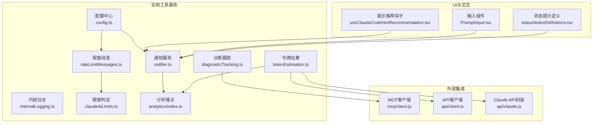
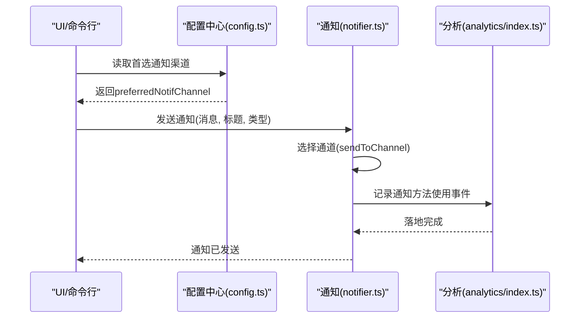
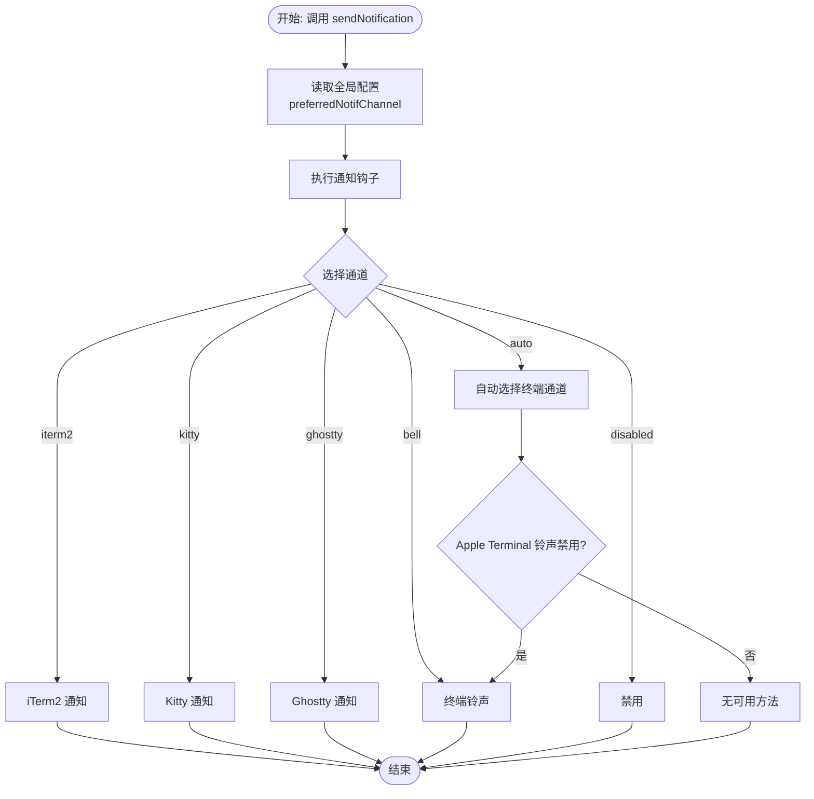
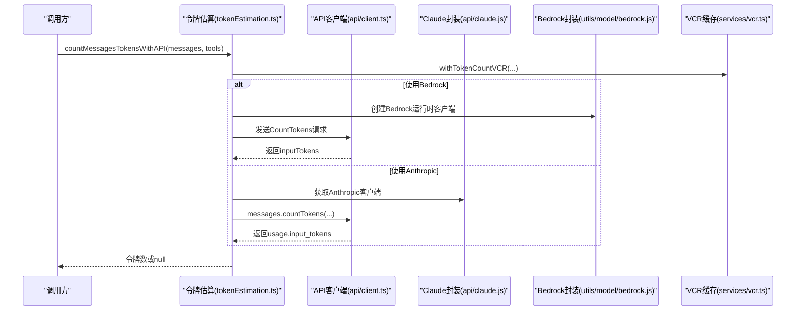
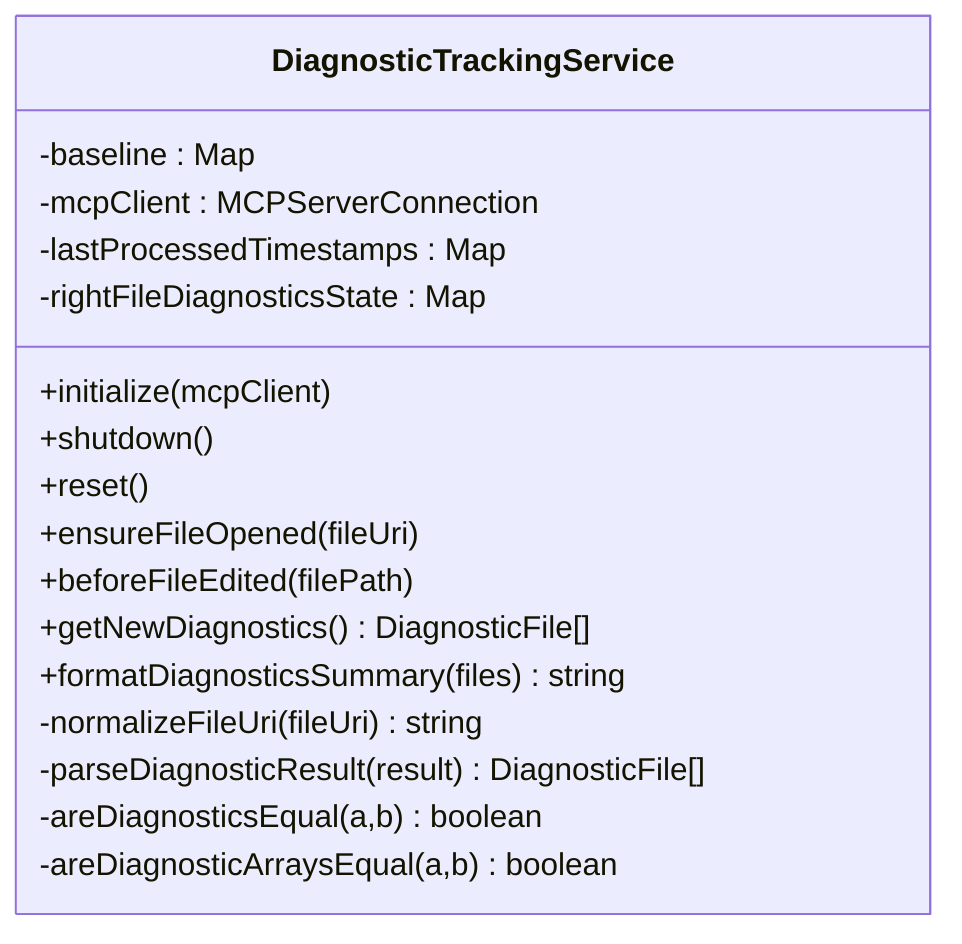
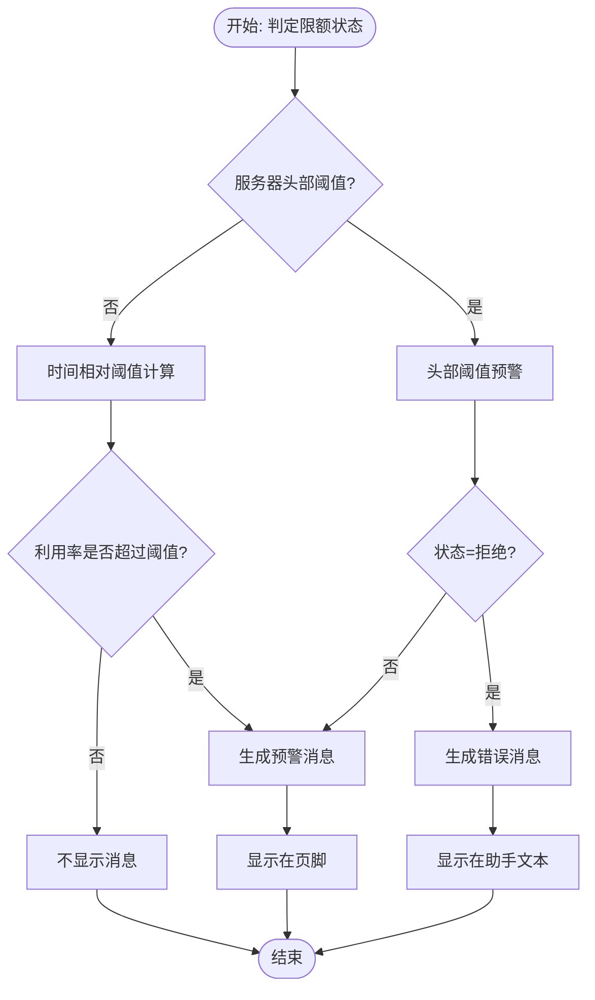
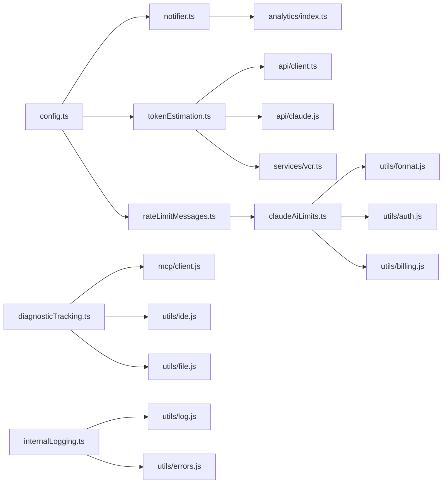

# 实用工具服务

<cite>
**本文档引用的文件**
- [src/services/notifier.ts](file://src/services/notifier.ts)
- [src/services/tokenEstimation.ts](file://src/services/tokenEstimation.ts)
- [src/services/diagnosticTracking.ts](file://src/services/diagnosticTracking.ts)
- [src/services/internalLogging.ts](file://src/services/internalLogging.ts)
- [src/services/rateLimitMessages.ts](file://src/services/rateLimitMessages.ts)
- [src/services/claudeAiLimits.ts](file://src/services/claudeAiLimits.ts)
- [src/services/analytics/index.ts](file://src/services/analytics/index.ts)
- [src/utils/config.ts](file://src/utils/config.ts)
- [src/hooks/useClaudeCodeHintRecommendation.tsx](file://src/hooks/useClaudeCodeHintRecommendation.tsx)
- [src/utils/plugins/hintRecommendation.ts](file://src/utils/plugins/hintRecommendation.ts)
- [src/components/PromptInput/PromptInput.tsx](file://src/components/PromptInput/PromptInput.tsx)
- [src/utils/statusNoticeDefinitions.tsx](file://src/utils/statusNoticeDefinitions.tsx)
- [src/services/api/emptyUsage.ts](file://src/services/api/emptyUsage.ts)
- [src/cost-tracker.ts](file://src/cost-tracker.ts)
- [src/services/vcr.ts](file://src/services/vcr.ts)
- [src/services/api/client.ts](file://src/services/api/client.ts)
- [src/services/api/claude.js](file://src/services/api/claude.js)
- [src/utils/model/model.js](file://src/utils/model/model.js)
- [src/utils/model/bedrock.js](file://src/utils/model/bedrock.js)
- [src/utils/messages.js](file://src/utils/messages.js)
- [src/utils/toolSearch.js](file://src/utils/toolSearch.js)
- [src/utils/envUtils.js](file://src/utils/envUtils.js)
- [src/utils/betas.js](file://src/utils/betas.js)
- [src/constants/betas.js](file://src/constants/betas.js)
- [src/services/mcp/client.js](file://src/services/mcp/client.js)
- [src/services/mcp/types.js](file://src/services/mcp/types.js)
- [src/utils/ide.js](file://src/utils/ide.js)
- [src/utils/file.js](file://src/utils/file.js)
- [src/utils/slowOperations.js](file://src/utils/slowOperations.js)
- [src/utils/log.js](file://src/utils/log.js)
- [src/utils/errors.js](file://src/utils/errors.js)
- [src/utils/debug.js](file://src/utils/debug.js)
- [src/context/notifications.js](file://src/context/notifications.js)
- [src/utils/claudeCodeHints.js](file://src/utils/claudeCodeHints.js)
- [src/services/preventSleep.ts](file://src/services/preventSleep.ts)
- [src/services/awaySummary.ts](file://src/services/awaySummary.ts)
- [src/services/voice.ts](file://src/services/voice.ts)
- [src/services/voiceKeyterms.ts](file://src/services/voiceKeyterms.ts)
- [src/services/voiceStreamSTT.ts](file://src/services/voiceStreamSTT.ts)
- [src/services/mockRateLimits.ts](file://src/services/mockRateLimits.ts)
- [src/services/rateLimitMocking.ts](file://src/services/rateLimitMocking.ts)
- [src/services/toolUseSummary.ts](file://src/services/toolUseSummary.ts)
- [src/services/extractMemories.ts](file://src/services/extractMemories.ts)
- [src/services/compact/reactiveCompact.js](file://src/services/compact/reactiveCompact.js)
- [src/services/contextCollapse/index.js](file://src/services/contextCollapse/index.js)
- [src/services/contextCollapse/operations.js](file://src/services/contextCollapse/operations.js)
- [src/services/skillSearch/telemetry.js](file://src/services/skillSearch/telemetry.js)
- [src/services/skillSearch/remoteSkillState.js](file://src/services/skillSearch/remoteSkillState.js)
- [src/services/skillSearch/remoteSkillLoader.js](file://src/services/skillSearch/remoteSkillLoader.js)
- [src/services/skillSearch/featureCheck.js](file://src/services/skillSearch/featureCheck.js)
- [src/services/lsp/index.js](file://src/services/lsp/index.js)
- [src/services/lsp/operations.js](file://src/services/lsp/operations.js)
- [src/services/mcp/index.js](file://src/services/mcp/index.js)
- [src/services/mcp/operations.js](file://src/services/mcp/operations.js)
- [src/services/mcp/telemetry.js](file://src/services/mcp/telemetry.js)
- [src/services/mcp/remoteMcpState.js](file://src/services/mcp/remoteMcpState.js)
- [src/services/mcp/remoteMcpLoader.js](file://src/services/mcp/remoteMcpLoader.js)
- [src/services/mcp/featureCheck.js](file://src/services/mcp/featureCheck.js)
- [src/services/tips/index.js](file://src/services/tips/index.js)
- [src/services/tips/operations.js](file://src/services/tips/operations.js)
- [src/services/tips/telemetry.js](file://src/services/tips/telemetry.js)
- [src/services/tips/remoteTipsState.js](file://src/services/tips/remoteTipsState.js)
- [src/services/tips/remoteTipsLoader.js](file://src/services/tips/remoteTipsLoader.js)
- [src/services/tips/featureCheck.js](file://src/services/tips/featureCheck.js)
- [src/services/AgentSummary/index.js](file://src/services/AgentSummary/index.js)
- [src/services/AgentSummary/operations.js](file://src/services/AgentSummary/operations.js)
- [src/services/MagicDocs/index.js](file://src/services/MagicDocs/index.js)
- [src/services/MagicDocs/operations.js](file://src/services/MagicDocs/operations.js)
- [src/services/PromptSuggestion/index.js](file://src/services/PromptSuggestion/index.js)
- [src/services/PromptSuggestion/operations.js](file://src/services/PromptSuggestion/operations.js)
- [src/services/SessionMemory/index.js](file://src/services/SessionMemory/index.js)
- [src/services/SessionMemory/operations.js](file://src/services/SessionMemory/operations.js)
- [src/services/SessionMemory/telemetry.js](file://src/services/SessionMemory/telemetry.js)
- [src/services/SessionMemory/remoteSessionMemoryState.js](file://src/services/SessionMemory/remoteSessionMemoryState.js)
- [src/services/SessionMemory/remoteSessionMemoryLoader.js](file://src/services/SessionMemory/remoteSessionMemoryLoader.js)
- [src/services/SessionMemory/featureCheck.js](file://src/services/SessionMemory/featureCheck.js)
- [src/services/remoteManagedSettings/index.js](file://src/services/remoteManagedSettings/index.js)
- [src/services/remoteManagedSettings/operations.js](file://src/services/remoteManagedSettings/operations.js)
- [src/services/remoteManagedSettings/telemetry.js](file://src/services/remoteManagedSettings/telemetry.js)
- [src/services/remoteManagedSettings/remoteManagedSettingsState.js](file://src/services/remoteManagedSettings/remoteManagedSettingsState.js)
- [src/services/remoteManagedSettings/remoteManagedSettingsLoader.js](file://src/services/remoteManagedSettings/remoteManagedSettingsLoader.js)
- [src/services/remoteManagedSettings/featureCheck.js](file://src/services/remoteManagedSettings/featureCheck.js)
- [src/services/settingsSync/index.js](file://src/services/settingsSync/index.js)
- [src/services/settingsSync/operations.js](file://src/services/settingsSync/operations.js)
- [src/services/settingsSync/telemetry.js](file://src/services/settingsSync/telemetry.js)
- [src/services/settingsSync/remoteSettingsSyncState.js](file://src/services/settingsSync/remoteSettingsSyncState.js)
- [src/services/settingsSync/remoteSettingsSyncLoader.js](file://src/services/settingsSync/remoteSettingsSyncLoader.js)
- [src/services/settingsSync/featureCheck.js](file://src/services/settingsSync/featureCheck.js)
- [src/services/teamMemorySync/index.js](file://src/services/teamMemorySync/index.js)
- [src/services/teamMemorySync/operations.js](file://src/services/teamMemorySync/operations.js)
- [src/services/teamMemorySync/telemetry.js](file://src/services/teamMemorySync/telemetry.js)
- [src/services/teamMemorySync/remoteTeamMemorySyncState.js](file://src/services/teamMemorySync/remoteTeamMemorySyncState.js)
- [src/services/teamMemorySync/remoteTeamMemorySyncLoader.js](file://src/services/teamMemorySync/remoteTeamMemorySyncLoader.js)
- [src/services/teamMemorySync/featureCheck.js](file://src/services/teamMemorySync/featureCheck.js)
</cite>

## 目录
1. [简介](#简介)
2. [项目结构](#项目结构)
3. [核心组件](#核心组件)
4. [架构总览](#架构总览)
5. [详细组件分析](#详细组件分析)
6. [依赖关系分析](#依赖关系分析)
7. [性能考量](#性能考量)
8. [故障排查指南](#故障排查指南)
9. [结论](#结论)
10. [附录](#附录)

## 简介
本文件面向Claude Code的实用工具服务模块，系统化梳理其架构设计与实现细节，重点覆盖以下方面：
- 辅助功能：提示服务（智能建议、使用指南）
- 系统支持：通知系统（状态提醒、错误通知）、令牌估算（成本计算、预算控制）
- 用户体验增强：诊断跟踪（问题检测、日志收集）、内部日志（调试输出、性能监控）
- 配置管理、触发机制与用户交互设计
- 工具间协作关系、数据共享与状态同步
- 扩展指南与性能优化、用户体验改进、故障诊断方法

## 项目结构
实用工具服务主要分布在src/services目录下，围绕通知、令牌估算、诊断跟踪、内部日志等核心能力构建，并通过配置中心、分析埋点、MCP集成等方式与上层UI与命令行交互。

**图表来源**
- [src/services/notifier.ts:1-157](file://src/services/notifier.ts#L1-L157)
- [src/services/tokenEstimation.ts:1-496](file://src/services/tokenEstimation.ts#L1-L496)
- [src/services/diagnosticTracking.ts:1-398](file://src/services/diagnosticTracking.ts#L1-L398)
- [src/services/internalLogging.ts:1-91](file://src/services/internalLogging.ts#L1-L91)
- [src/services/rateLimitMessages.ts:1-345](file://src/services/rateLimitMessages.ts#L1-L345)
- [src/services/claudeAiLimits.ts:43-374](file://src/services/claudeAiLimits.ts#L43-L374)
- [src/utils/config.ts:1-800](file://src/utils/config.ts#L1-L800)
- [src/services/analytics/index.ts:1-174](file://src/services/analytics/index.ts#L1-L174)
- [src/hooks/useClaudeCodeHintRecommendation.tsx:12-128](file://src/hooks/useClaudeCodeHintRecommendation.tsx#L12-L128)
- [src/components/PromptInput/PromptInput.tsx:747-785](file://src/components/PromptInput/PromptInput.tsx#L747-L785)
- [src/utils/statusNoticeDefinitions.tsx:153-197](file://src/utils/statusNoticeDefinitions.tsx#L153-L197)
- [src/services/mcp/client.js:1-200](file://src/services/mcp/client.js#L1-L200)
- [src/services/api/client.ts:1-200](file://src/services/api/client.ts#L1-L200)
- [src/services/api/claude.js:1-200](file://src/services/api/claude.js#L1-L200)

**章节来源**
- [src/services/notifier.ts:1-157](file://src/services/notifier.ts#L1-L157)
- [src/services/tokenEstimation.ts:1-496](file://src/services/tokenEstimation.ts#L1-L496)
- [src/services/diagnosticTracking.ts:1-398](file://src/services/diagnosticTracking.ts#L1-L398)
- [src/services/internalLogging.ts:1-91](file://src/services/internalLogging.ts#L1-L91)
- [src/services/rateLimitMessages.ts:1-345](file://src/services/rateLimitMessages.ts#L1-L345)
- [src/services/claudeAiLimits.ts:43-374](file://src/services/claudeAiLimits.ts#L43-L374)
- [src/utils/config.ts:1-800](file://src/utils/config.ts#L1-L800)
- [src/services/analytics/index.ts:1-174](file://src/services/analytics/index.ts#L1-L174)

## 核心组件
- 通知系统：统一通道分发通知，支持自动/终端/iTerm2/kitty/ghostty/铃声等多种渠道，具备回退与错误处理。
- 令牌估算：多模型/多平台适配，支持API计数、粗估、Bedrock/Vercel Vertex兼容路径，思考块与工具搜索字段剥离。
- 诊断跟踪：基于MCP获取IDE诊断，对比基线，提取新增诊断，格式化摘要，支持右文件视图切换。
- 内部日志：仅在特定用户类型下记录命名空间与容器ID，用于内部审计与定位。
- 限额与消息：限额状态判定与消息生成，支持会话/周/Opus/Sonnet/超支等多维度，支持头部与时间相对阈值双策略。
- 配置中心：集中式全局/项目配置读写，键白名单校验，信任对话缓存与路径遍历检查。
- 分析埋点：事件队列与异步落盘，支持采样与PII标记字段分离。

**章节来源**
- [src/services/notifier.ts:18-157](file://src/services/notifier.ts#L18-L157)
- [src/services/tokenEstimation.ts:124-496](file://src/services/tokenEstimation.ts#L124-L496)
- [src/services/diagnosticTracking.ts:30-398](file://src/services/diagnosticTracking.ts#L30-L398)
- [src/services/internalLogging.ts:10-91](file://src/services/internalLogging.ts#L10-L91)
- [src/services/rateLimitMessages.ts:45-345](file://src/services/rateLimitMessages.ts#L45-L345)
- [src/services/claudeAiLimits.ts:43-374](file://src/services/claudeAiLimits.ts#L43-L374)
- [src/utils/config.ts:627-800](file://src/utils/config.ts#L627-L800)
- [src/services/analytics/index.ts:69-174](file://src/services/analytics/index.ts#L69-L174)

## 架构总览
实用工具服务通过“配置中心”统一读取用户偏好，“分析埋点”承载事件采集，“通知系统”负责跨终端/渠道的消息分发；“令牌估算”与“诊断跟踪”分别面向成本控制与问题定位；“内部日志”在受控环境下补充调试信息；“限额与消息”保障资源使用的可见性与可控性。

**图表来源**
- [src/utils/config.ts:580-626](file://src/utils/config.ts#L580-L626)
- [src/services/notifier.ts:18-104](file://src/services/notifier.ts#L18-L104)
- [src/services/analytics/index.ts:133-164](file://src/services/analytics/index.ts#L133-L164)

## 详细组件分析

### 通知系统（提示与提醒）
- 设计要点
  - 统一入口sendNotification，先执行通知钩子，再按配置通道发送。
  - 自动通道根据终端环境选择最优方案，若Apple Terminal铃声禁用则回退到铃声。
  - 支持iTerm2/kitty/ghostty/铃声/禁用等多通道，失败时返回错误标识。
  - 埋点记录实际使用通道与终端类型，便于分析渠道有效性。
- 触发机制
  - UI层通过上下文或组件调用发送通知，如提示高努力/计划/审查等场景。
  - 提示推荐钩子与插件安装提示也通过通知系统呈现。
- 用户交互
  - 通知标题默认“Claude Code”，可自定义；支持优先级与超时控制。

**图表来源**
- [src/services/notifier.ts:18-157](file://src/services/notifier.ts#L18-L157)

**章节来源**
- [src/services/notifier.ts:12-157](file://src/services/notifier.ts#L12-L157)
- [src/hooks/useClaudeCodeHintRecommendation.tsx:66-114](file://src/hooks/useClaudeCodeHintRecommendation.tsx#L66-L114)
- [src/utils/plugins/hintRecommendation.ts:121-164](file://src/utils/plugins/hintRecommendation.ts#L121-L164)
- [src/components/PromptInput/PromptInput.tsx:747-785](file://src/components/PromptInput/PromptInput.tsx#L747-L785)
- [src/utils/statusNoticeDefinitions.tsx:153-197](file://src/utils/statusNoticeDefinitions.tsx#L153-L197)

### 令牌估算（成本计算与预算控制）
- 设计要点
  - API计数：支持Anthropic/Bedrock/Vercel Vertex，自动启用思考块与beta过滤。
  - 粗估：按内容长度与文件类型调整字节/令牌比率，图像/文档/工具调用有专门估算。
  - Bedrock路径：动态加载AWS SDK，解析CountTokens响应。
  - 工具搜索兼容：剥离tool_search相关字段避免API错误。
  - VCR缓存：对令牌计数请求进行录制/回放以提升稳定性与性能。
- 性能与准确性
  - 优先使用API计数；在不可用时回退粗估，避免过小估算导致自动压缩过早触发。
  - 对思考块与工具调用进行特殊处理，确保估算更贴近真实消耗。

**图表来源**
- [src/services/tokenEstimation.ts:140-201](file://src/services/tokenEstimation.ts#L140-L201)
- [src/services/tokenEstimation.ts:437-496](file://src/services/tokenEstimation.ts#L437-L496)
- [src/services/vcr.ts:1-200](file://src/services/vcr.ts#L1-L200)
- [src/services/api/client.ts:1-200](file://src/services/api/client.ts#L1-L200)
- [src/services/api/claude.js:1-200](file://src/services/api/claude.js#L1-L200)
- [src/utils/model/bedrock.js:1-200](file://src/utils/model/bedrock.js#L1-L200)

**章节来源**
- [src/services/tokenEstimation.ts:124-496](file://src/services/tokenEstimation.ts#L124-L496)
- [src/services/api/emptyUsage.ts:1-22](file://src/services/api/emptyUsage.ts#L1-L22)
- [src/cost-tracker.ts:286-323](file://src/cost-tracker.ts#L286-L323)

### 诊断跟踪（问题检测与日志收集）
- 设计要点
  - 单例服务，初始化时绑定MCP客户端；支持重置与关闭清理。
  - 编辑前捕获基线诊断，编辑后对比差异，支持file://与_claude_fs_right两类URI。
  - 路径归一化与Windows大小写不敏感比较，避免误判。
  - 右文件视图变更时动态切换使用源文件或右文件诊断。
  - 格式化摘要字符串，限制最大字符数并截断。
- 与IDE集成
  - 通过MCP调用openFile确保文件在IDE中打开，再获取诊断。
  - 解析RPC返回文本块为诊断数组，逐项比对差异。

**图表来源**
- [src/services/diagnosticTracking.ts:30-398](file://src/services/diagnosticTracking.ts#L30-L398)
- [src/services/mcp/client.js:1-200](file://src/services/mcp/client.js#L1-L200)
- [src/services/mcp/types.js:1-200](file://src/services/mcp/types.js#L1-L200)
- [src/utils/ide.js:1-200](file://src/utils/ide.js#L1-L200)
- [src/utils/file.js:1-200](file://src/utils/file.js#L1-L200)
- [src/utils/slowOperations.js:1-200](file://src/utils/slowOperations.js#L1-L200)

**章节来源**
- [src/services/diagnosticTracking.ts:30-398](file://src/services/diagnosticTracking.ts#L30-L398)

### 内部日志（调试输出与性能监控）
- 设计要点
  - 仅在特定用户类型（如蚂蚁）下启用，读取K8s命名空间与容器ID，使用缓存避免重复IO。
  - 将权限上下文与容器信息作为事件元数据上报，便于内部审计与定位。
- 适用场景
  - 开发环境与受控集群内，帮助快速定位容器/命名空间相关问题。

**章节来源**
- [src/services/internalLogging.ts:10-91](file://src/services/internalLogging.ts#L10-L91)

### 限额与消息（预算控制与提示）
- 设计要点
  - 限额状态：拒绝/预警/允许三种状态，支持会话/周/Opus/Sonnet/超支等类型。
  - 消息生成：支持头部检测与时间相对阈值两种策略，避免低使用量时的误预警。
  - UI提示：错误消息显示在助手文本中，警告消息显示在页脚，避免与错误混淆。
- 与通知联动
  - 限额接近或超出时，结合通知系统向用户发出即时提醒。

**图表来源**
- [src/services/claudeAiLimits.ts:342-374](file://src/services/claudeAiLimits.ts#L342-L374)
- [src/services/rateLimitMessages.ts:45-141](file://src/services/rateLimitMessages.ts#L45-L141)

**章节来源**
- [src/services/claudeAiLimits.ts:43-374](file://src/services/claudeAiLimits.ts#L43-L374)
- [src/services/rateLimitMessages.ts:1-345](file://src/services/rateLimitMessages.ts#L1-L345)

### 配置管理、触发机制与用户交互
- 配置中心
  - 全局/项目配置键白名单，支持键存在性检查与默认值工厂。
  - 信任对话接受状态缓存与路径遍历检查，避免跨目录信任泄露。
- 触发机制
  - 通知：UI/组件通过上下文调用；提示推荐钩子订阅待展示提示并引导安装。
  - 令牌估算：在工具结果过大或需要预算控制时触发；支持VCR缓存。
  - 诊断跟踪：在文件编辑前后自动触发，确保基线与增量对比。
- 用户交互
  - 通过状态栏提示、页脚警告、通知弹窗等方式反馈限额与诊断结果。

**章节来源**
- [src/utils/config.ts:627-800](file://src/utils/config.ts#L627-L800)
- [src/hooks/useClaudeCodeHintRecommendation.tsx:24-128](file://src/hooks/useClaudeCodeHintRecommendation.tsx#L24-L128)
- [src/utils/plugins/hintRecommendation.ts:121-164](file://src/utils/plugins/hintRecommendation.ts#L121-L164)
- [src/utils/statusNoticeDefinitions.tsx:153-197](file://src/utils/statusNoticeDefinitions.tsx#L153-L197)

### 工具协作关系、数据共享与状态同步
- 通知与分析
  - 通知发送后记录事件，分析服务统一落盘，支持采样与PII字段分离。
- 令牌估算与成本追踪
  - 估算结果与成本追踪器协同，累计input/output/cache读写令牌，支持advisor工具用量聚合。
- 诊断跟踪与MCP
  - 通过MCP客户端获取IDE诊断，确保文件在IDE中打开后再抓取，避免无效诊断。
- 配置与通知/限额
  - 通知渠道与限额消息均从配置中心读取，保证一致性。

**章节来源**
- [src/services/analytics/index.ts:69-174](file://src/services/analytics/index.ts#L69-L174)
- [src/cost-tracker.ts:286-323](file://src/cost-tracker.ts#L286-L323)
- [src/services/diagnosticTracking.ts:103-129](file://src/services/diagnosticTracking.ts#L103-L129)
- [src/utils/config.ts:580-626](file://src/utils/config.ts#L580-L626)

## 依赖关系分析

**图表来源**
- [src/utils/config.ts:1-800](file://src/utils/config.ts#L1-L800)
- [src/services/notifier.ts:1-157](file://src/services/notifier.ts#L1-L157)
- [src/services/rateLimitMessages.ts:1-345](file://src/services/rateLimitMessages.ts#L1-L345)
- [src/services/claudeAiLimits.ts:43-374](file://src/services/claudeAiLimits.ts#L43-L374)
- [src/services/tokenEstimation.ts:1-496](file://src/services/tokenEstimation.ts#L1-L496)
- [src/services/diagnosticTracking.ts:1-398](file://src/services/diagnosticTracking.ts#L1-L398)
- [src/services/internalLogging.ts:1-91](file://src/services/internalLogging.ts#L1-L91)
- [src/services/analytics/index.ts:1-174](file://src/services/analytics/index.ts#L1-L174)
- [src/services/api/client.ts:1-200](file://src/services/api/client.ts#L1-L200)
- [src/services/api/claude.js:1-200](file://src/services/api/claude.js#L1-L200)
- [src/services/vcr.ts:1-200](file://src/services/vcr.ts#L1-L200)
- [src/services/mcp/client.js:1-200](file://src/services/mcp/client.js#L1-L200)
- [src/utils/ide.js:1-200](file://src/utils/ide.js#L1-L200)
- [src/utils/file.js:1-200](file://src/utils/file.js#L1-L200)
- [src/utils/log.js:1-200](file://src/utils/log.js#L1-L200)
- [src/utils/errors.js:1-200](file://src/utils/errors.js#L1-L200)

**章节来源**
- [src/utils/config.ts:1-800](file://src/utils/config.ts#L1-L800)
- [src/services/notifier.ts:1-157](file://src/services/notifier.ts#L1-L157)
- [src/services/rateLimitMessages.ts:1-345](file://src/services/rateLimitMessages.ts#L1-L345)
- [src/services/claudeAiLimits.ts:43-374](file://src/services/claudeAiLimits.ts#L43-L374)
- [src/services/tokenEstimation.ts:1-496](file://src/services/tokenEstimation.ts#L1-L496)
- [src/services/diagnosticTracking.ts:1-398](file://src/services/diagnosticTracking.ts#L1-L398)
- [src/services/internalLogging.ts:1-91](file://src/services/internalLogging.ts#L1-L91)
- [src/services/analytics/index.ts:1-174](file://src/services/analytics/index.ts#L1-L174)

## 性能考量
- 令牌估算
  - 优先使用API计数；在不可用时采用粗估并按文件类型调整比率，避免过小估算导致自动压缩过早触发。
  - 动态加载AWS SDK与工具搜索字段剥离减少不必要的开销。
- 诊断跟踪
  - 路径归一化与缓存最近处理时间，避免重复抓取；仅对编辑过的文件进行增量对比。
- 通知系统
  - 自动通道探测与铃声检测延迟IO，失败回退至可用通道，降低失败率。
- 分析埋点
  - 事件队列与异步落盘，避免阻塞启动路径；采样配置降低存储压力。

[本节为通用指导，无需具体文件分析]

## 故障排查指南
- 通知未送达
  - 检查配置中的首选通道与终端环境；确认Apple Terminal铃声设置；查看错误回退分支。
- 令牌估算为null
  - 确认API可用性与模型/beta参数；检查工具搜索字段剥离逻辑；启用VCR缓存验证。
- 诊断无结果
  - 确认MCP连接状态与IDE客户端；确保文件已在IDE中打开；检查URI协议前缀与路径归一化。
- 限额误报/漏报
  - 检查服务器头部阈值与本地时间相对阈值策略；核对订阅类型与超支配置。
- 内部日志缺失
  - 确认用户类型为受控类型；检查命名空间与容器ID读取路径。

**章节来源**
- [src/services/notifier.ts:110-157](file://src/services/notifier.ts#L110-L157)
- [src/services/tokenEstimation.ts:196-200](file://src/services/tokenEstimation.ts#L196-L200)
- [src/services/diagnosticTracking.ts:103-129](file://src/services/diagnosticTracking.ts#L103-L129)
- [src/services/claudeAiLimits.ts:342-374](file://src/services/claudeAiLimits.ts#L342-L374)
- [src/services/internalLogging.ts:17-66](file://src/services/internalLogging.ts#L17-L66)

## 结论
实用工具服务通过统一的配置中心、分析埋点与通知系统，实现了对提示、通知、令牌估算、诊断跟踪与内部日志的系统化支撑。其设计强调：
- 可靠性：多通道通知、API计数与粗估双轨、诊断增量对比与路径归一化
- 可观测性：事件队列、PII分离、限额消息与诊断摘要
- 可扩展性：钩子与配置驱动、模块化服务、VCR缓存与动态加载

这些特性共同提升了用户体验与系统的可维护性。

[本节为总结，无需具体文件分析]

## 附录
- 扩展指南
  - 新增通知策略：在通知通道选择逻辑中增加新分支，确保错误回退与埋点记录完善。
  - 新增令牌估算策略：在API计数失败时的回退路径中加入新策略，保持与现有剥离逻辑一致。
  - 新增诊断来源：在MCP RPC调用中支持新的URI协议或诊断格式，更新解析与比较逻辑。
- 最佳实践
  - 优先使用API计数，保留粗估作为兜底；对图像/文档/工具调用采用专用估算。
  - 限额消息与通知联动，避免UI重复提示；对团队/企业用户屏蔽不必要的超支提示。
  - 诊断跟踪仅对编辑过的文件进行增量对比，减少IO与CPU开销。
- 相关服务清单（按功能分类）
  - 通知与提示：notifier.ts、useClaudeCodeHintRecommendation.tsx、statusNoticeDefinitions.tsx
  - 令牌估算：tokenEstimation.ts、vcr.ts、api/claude.js、api/client.ts
  - 诊断跟踪：diagnosticTracking.ts、mcp/client.js、utils/ide.js、utils/file.js
  - 内部日志：internalLogging.ts、utils/log.js、utils/errors.js
  - 限额与消息：claudeAiLimits.ts、rateLimitMessages.ts、utils/format.js、utils/auth.js、utils/billing.js

[本节为概览，无需具体文件分析]