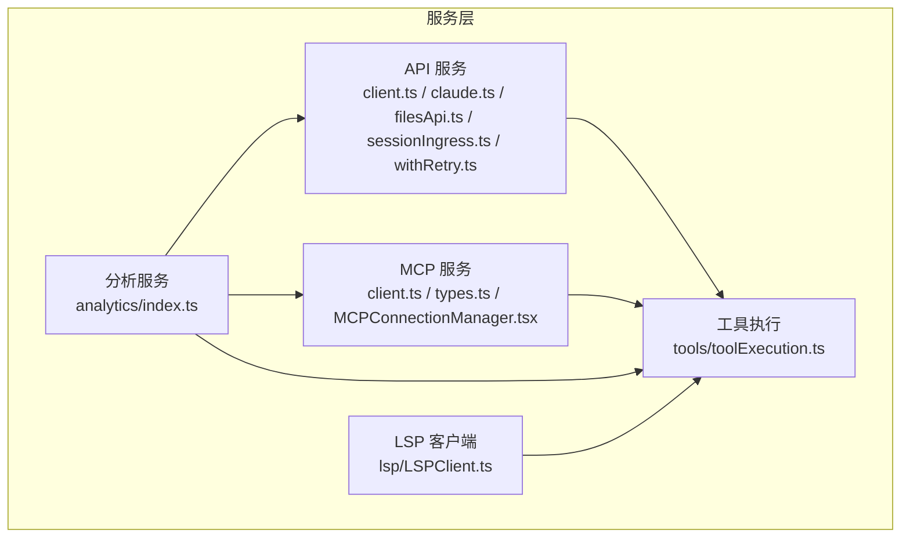
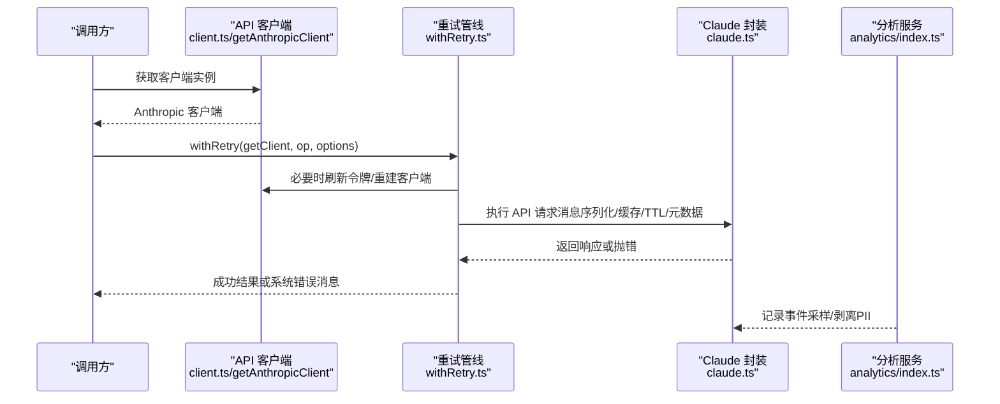
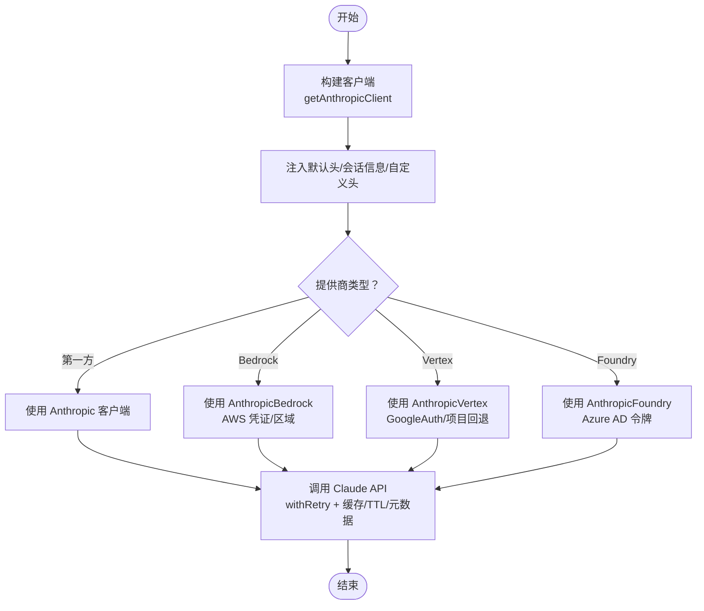
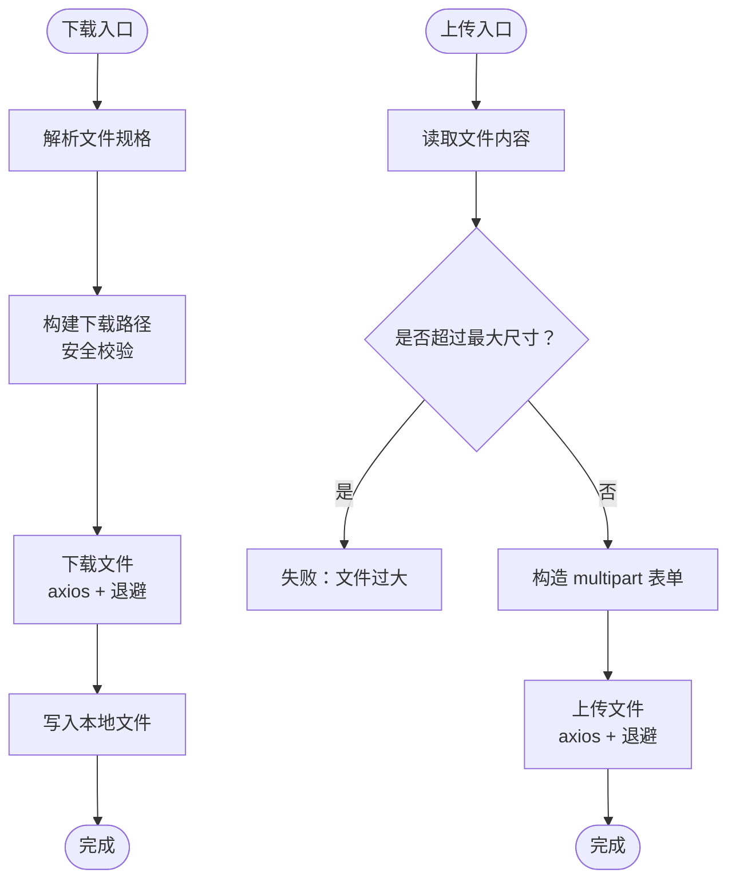
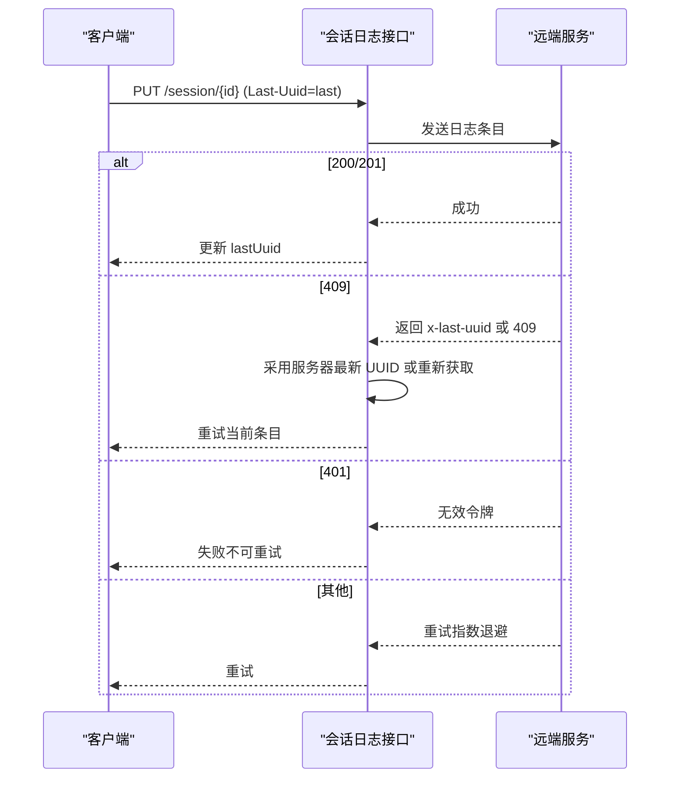
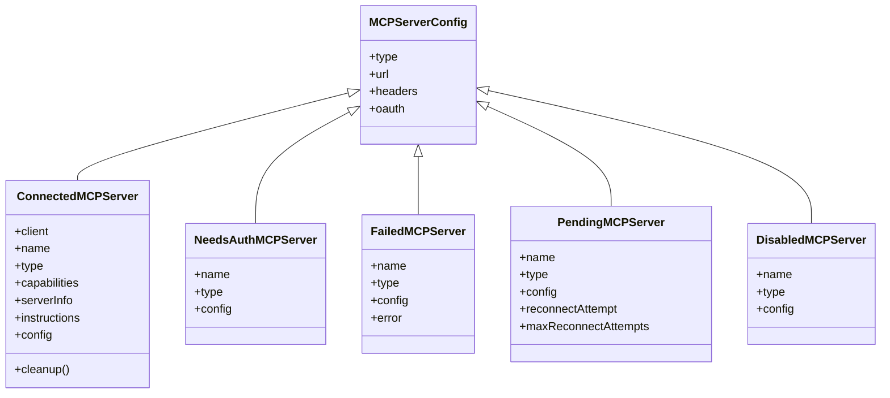
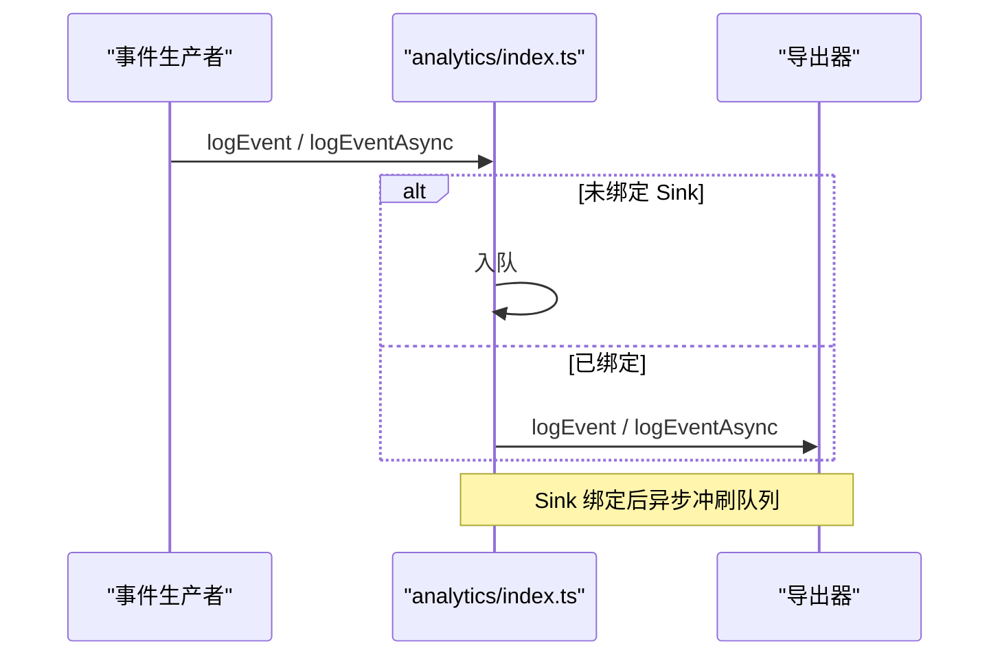
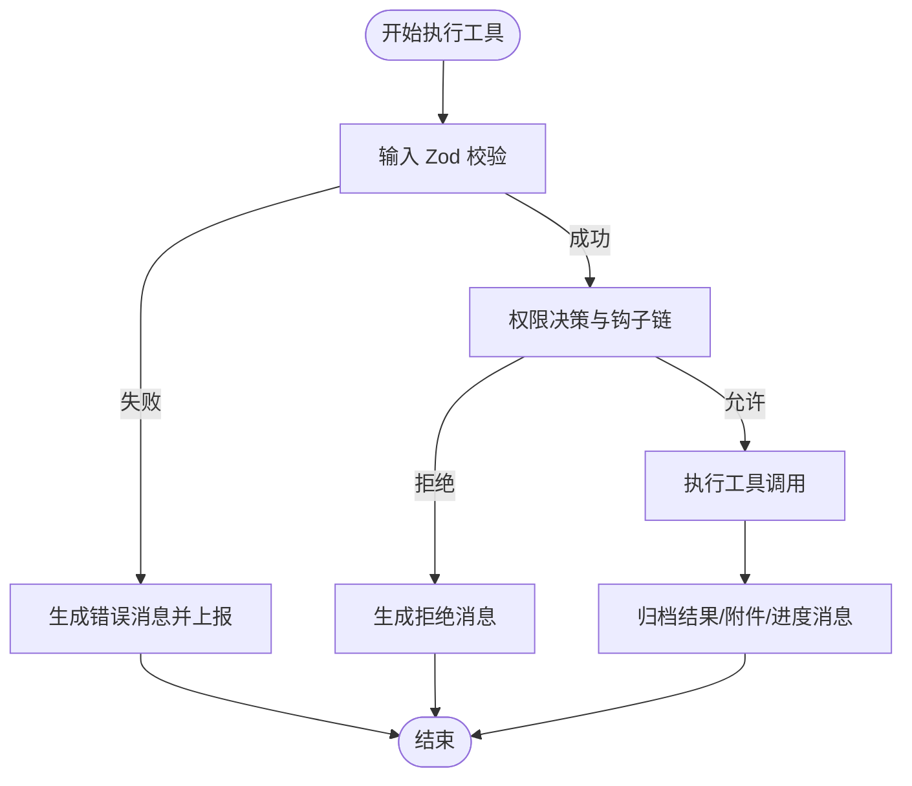
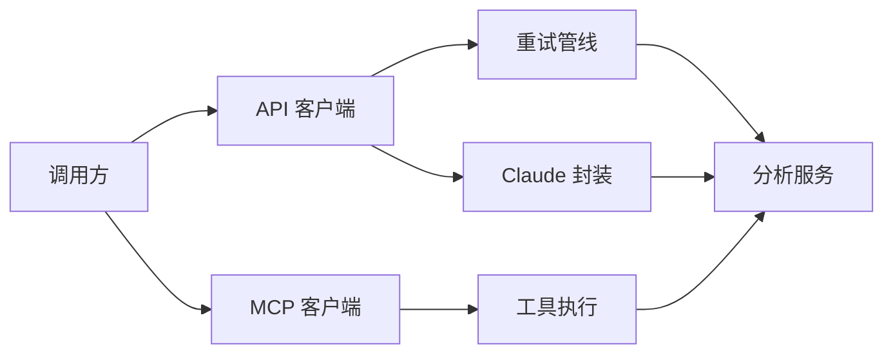

# 服务层

<cite>
**本文引用的文件**
- [src/services/api/client.ts](file://src/services/api/client.ts)
- [src/services/api/claude.ts](file://src/services/api/claude.ts)
- [src/services/api/filesApi.ts](file://src/services/api/filesApi.ts)
- [src/services/api/sessionIngress.ts](file://src/services/api/sessionIngress.ts)
- [src/services/api/withRetry.ts](file://src/services/api/withRetry.ts)
- [src/services/mcp/client.ts](file://src/services/mcp/client.ts)
- [src/services/mcp/types.ts](file://src/services/mcp/types.ts)
- [src/services/mcp/MCPConnectionManager.tsx](file://src/services/mcp/MCPConnectionManager.tsx)
- [src/services/analytics/index.ts](file://src/services/analytics/index.ts)
- [src/services/lsp/LSPClient.ts](file://src/services/lsp/LSPClient.ts)
- [src/services/tools/toolExecution.ts](file://src/services/tools/toolExecution.ts)
</cite>

## 目录
1. [引言](#引言)
2. [项目结构](#项目结构)
3. [核心组件](#核心组件)
4. [架构总览](#架构总览)
5. [详细组件分析](#详细组件分析)
6. [依赖关系分析](#依赖关系分析)
7. [性能考量](#性能考量)
8. [故障排查指南](#故障排查指南)
9. [结论](#结论)
10. [附录](#附录)

## 引言
本文件系统性梳理 Claude Code 的服务层架构与实现，聚焦以下目标：
- API 客户端封装与统一接入（Anthropic SDK、第三方云厂商、自定义代理）
- 业务逻辑抽象与跨组件通信机制（工具执行、MCP 协议、遥测与事件日志）
- 核心服务模块：API 服务（Claude API、文件服务、会话服务）、分析服务（遥测、事件日志、增长实验）、MCP 服务（协议适配、连接管理、资源调度）
- 依赖注入模式、错误处理策略与重试机制
- 服务间通信协议与数据传输格式
- 扩展指南（新增服务、配置管理、监控集成）
- 性能优化、缓存策略与并发控制

## 项目结构
服务层位于 src/services 下，按功能域划分：
- api：统一的 API 客户端、Claude 调用封装、文件上传下载、会话日志持久化、重试与退避
- mcp：MCP 协议客户端、连接管理、认证与传输适配
- analytics：事件日志与遥测入口，支持多后端导出
- lsp：语言服务器协议客户端封装
- tools：工具执行管线（权限校验、输入校验、进度上报、结果归档）
- 其他子目录：会话记忆、自动梦、提示词建议等

图表来源
- [src/services/api/client.ts:1-390](file://src/services/api/client.ts#L1-L390)
- [src/services/api/claude.ts:1-800](file://src/services/api/claude.ts#L1-L800)
- [src/services/api/filesApi.ts:1-749](file://src/services/api/filesApi.ts#L1-L749)
- [src/services/api/sessionIngress.ts:1-515](file://src/services/api/sessionIngress.ts#L1-L515)
- [src/services/api/withRetry.ts:1-823](file://src/services/api/withRetry.ts#L1-L823)
- [src/services/mcp/client.ts:1-800](file://src/services/mcp/client.ts#L1-L800)
- [src/services/mcp/types.ts:1-259](file://src/services/mcp/types.ts#L1-L259)
- [src/services/mcp/MCPConnectionManager.tsx:1-73](file://src/services/mcp/MCPConnectionManager.tsx#L1-L73)
- [src/services/analytics/index.ts:1-174](file://src/services/analytics/index.ts#L1-L174)
- [src/services/lsp/LSPClient.ts:1-448](file://src/services/lsp/LSPClient.ts#L1-L448)
- [src/services/tools/toolExecution.ts:1-800](file://src/services/tools/toolExecution.ts#L1-L800)

章节来源
- [src/services/api/client.ts:1-390](file://src/services/api/client.ts#L1-L390)
- [src/services/mcp/client.ts:1-800](file://src/services/mcp/client.ts#L1-L800)
- [src/services/analytics/index.ts:1-174](file://src/services/analytics/index.ts#L1-L174)

## 核心组件
- API 客户端与调用封装
  - 统一构建 Anthropic 客户端，支持多提供商（第一方、Bedrock、Vertex、Foundry），自动注入头、代理、超时、重试与调试日志
  - Claude API 封装：消息序列化、缓存控制、提示词缓存 TTL、努力值与任务预算参数、元数据注入
  - 文件服务：下载/上传/列出，带指数退避、并发限制、路径安全校验
  - 会话服务：会话日志写入/读取，乐观并发控制（Last-Uuid），顺序化写入避免竞态
  - 重试与退避：统一 withRetry 管线，支持 529/429/401/403 等场景，持久会话模式下的心跳与节流
- MCP 服务
  - 协议适配：SSE、HTTP、WebSocket、STDIO、SDK、claude.ai 代理
  - 连接管理：批量连接、缓存键、认证失败缓存、会话过期检测与清理
  - 资源调度：工具/资源发现、名称规范化、内容截断与输出存储
- 分析服务
  - 事件日志：队列化、延迟绑定导出器、采样、PII 字段剥离
  - 遥测：链路追踪标记、事件埋点、指标聚合
- 工具执行
  - 输入校验（Zod）、权限决策、钩子链、进度消息、结果归档与附件生成
  - MCP 工具调用：错误分类（认证、工具调用）、统计与告警

章节来源
- [src/services/api/claude.ts:1-800](file://src/services/api/claude.ts#L1-L800)
- [src/services/api/filesApi.ts:1-749](file://src/services/api/filesApi.ts#L1-L749)
- [src/services/api/sessionIngress.ts:1-515](file://src/services/api/sessionIngress.ts#L1-L515)
- [src/services/api/withRetry.ts:1-823](file://src/services/api/withRetry.ts#L1-L823)
- [src/services/mcp/client.ts:1-800](file://src/services/mcp/client.ts#L1-L800)
- [src/services/mcp/types.ts:1-259](file://src/services/mcp/types.ts#L1-L259)
- [src/services/analytics/index.ts:1-174](file://src/services/analytics/index.ts#L1-L174)
- [src/services/tools/toolExecution.ts:1-800](file://src/services/tools/toolExecution.ts#L1-L800)

## 架构总览
服务层通过“统一客户端 + 业务封装 + 事件日志”的三层设计实现高内聚低耦合：
- 统一客户端：API 客户端负责网络层、认证与传输；MCP 客户端负责协议与连接
- 业务封装：Claude API 封装、文件服务、会话服务在各自领域内抽象调用流程
- 事件日志：analytics 模块作为无依赖入口，延迟绑定导出器，避免循环依赖

图表来源
- [src/services/api/client.ts:88-316](file://src/services/api/client.ts#L88-L316)
- [src/services/api/withRetry.ts:170-517](file://src/services/api/withRetry.ts#L170-L517)
- [src/services/api/claude.ts:709-780](file://src/services/api/claude.ts#L709-L780)
- [src/services/analytics/index.ts:133-164](file://src/services/analytics/index.ts#L133-L164)

## 详细组件分析

### API 客户端与调用封装
- 多提供商支持
  - 第一方：自动注入用户代理、会话标识、额外保护头、可选自定义头
  - Bedrock：AWS 凭证刷新、区域选择、Bearer Token 支持
  - Vertex：Google Auth 客户端、项目回退、元数据服务器规避
  - Foundry：Azure AD 令牌提供者、可选跳过认证
- 请求级增强
  - 注入 x-client-request-id（仅第一方）用于跨端关联
  - 日志记录请求 URL 与来源，便于调试
- 调用封装
  - Claude API 封装：消息参数转换、缓存控制、提示词缓存 TTL、任务预算、元数据注入
  - 文件服务：下载/上传/列出，指数退避、并发限制、路径安全校验
  - 会话服务：PUT 带 Last-Uuid 的乐观并发控制，顺序化写入，409 冲突恢复

图表来源
- [src/services/api/client.ts:88-316](file://src/services/api/client.ts#L88-L316)
- [src/services/api/withRetry.ts:170-517](file://src/services/api/withRetry.ts#L170-L517)
- [src/services/api/claude.ts:709-780](file://src/services/api/claude.ts#L709-L780)

章节来源
- [src/services/api/client.ts:1-390](file://src/services/api/client.ts#L1-L390)
- [src/services/api/claude.ts:1-800](file://src/services/api/claude.ts#L1-L800)
- [src/services/api/withRetry.ts:1-823](file://src/services/api/withRetry.ts#L1-L823)

### 文件服务（Public Files API）
- 下载：指数退避、状态码分级处理、超时控制、路径安全校验（防路径穿越）
- 并发下载：限流并发，保持顺序返回
- 上传：大小限制、multipart/form-data 构造、边界唯一性、非重试错误快速失败
- 列表：分页游标、鉴权错误处理

图表来源
- [src/services/api/filesApi.ts:125-267](file://src/services/api/filesApi.ts#L125-L267)
- [src/services/api/filesApi.ts:378-552](file://src/services/api/filesApi.ts#L378-L552)

章节来源
- [src/services/api/filesApi.ts:1-749](file://src/services/api/filesApi.ts#L1-L749)

### 会话服务（会话日志持久化）
- PUT 写入：Last-Uuid 头实现乐观并发控制
- 409 冲突处理：采用服务器最新 UUID 或重新拉取会话头
- 顺序化写入：按会话串行化，避免并发写入冲突
- 读取：支持 JWT 与 OAuth 两种方式，带超时与结构校验

图表来源
- [src/services/api/sessionIngress.ts:63-186](file://src/services/api/sessionIngress.ts#L63-L186)

章节来源
- [src/services/api/sessionIngress.ts:1-515](file://src/services/api/sessionIngress.ts#L1-L515)

### MCP 服务（协议适配、连接管理、资源调度）
- 协议适配
  - SSE/HTTP/WebSocket/STDIO/SDK/claude.ai 代理，统一传输层包装
  - 超时与 Accept 头规范化，避免严格模式下被拒绝
- 连接管理
  - 批量连接、缓存键、认证失败缓存（15 分钟）、会话过期检测
  - 代理与 mTLS 支持，WebSocket 代理与 TLS 选项
- 资源调度
  - 工具/资源发现、名称规范化、内容截断与输出存储
  - MCP 工具调用错误分类（认证、工具调用）

图表来源
- [src/services/mcp/types.ts:163-227](file://src/services/mcp/types.ts#L163-L227)

章节来源
- [src/services/mcp/client.ts:1-800](file://src/services/mcp/client.ts#L1-L800)
- [src/services/mcp/types.ts:1-259](file://src/services/mcp/types.ts#L1-L259)
- [src/services/mcp/MCPConnectionManager.tsx:1-73](file://src/services/mcp/MCPConnectionManager.tsx#L1-L73)

### 分析服务（遥测、事件日志、增长实验）
- 事件日志
  - 无依赖入口，事件队列直到 sink 绑定后异步冲刷
  - 采样与 PII 字段剥离，支持同步/异步事件
- 遥测
  - 事件埋点、链路追踪标记、指标聚合
- 增长实验
  - 动态配置读取与采样

图表来源
- [src/services/analytics/index.ts:95-164](file://src/services/analytics/index.ts#L95-L164)

章节来源
- [src/services/analytics/index.ts:1-174](file://src/services/analytics/index.ts#L1-L174)

### 工具执行（权限、输入校验、进度、结果）
- 输入校验：Zod Schema 校验与提示补充（延迟工具缺失 schema 的指引）
- 权限决策：预钩子、分类器、交互式弹窗、规则来源映射
- 进度与结果：进度消息、最终结果、附件生成、工具结果归档
- MCP 集成：工具名解析、服务器类型与基础 URL 提取、错误分类

图表来源
- [src/services/tools/toolExecution.ts:599-800](file://src/services/tools/toolExecution.ts#L599-L800)

章节来源
- [src/services/tools/toolExecution.ts:1-800](file://src/services/tools/toolExecution.ts#L1-L800)

### LSP 客户端
- 子进程启动、stdio 通信、JSON-RPC 连接
- 初始化、请求/通知、错误与关闭处理、优雅停止
- 协议跟踪与诊断日志

章节来源
- [src/services/lsp/LSPClient.ts:1-448](file://src/services/lsp/LSPClient.ts#L1-L448)

## 依赖关系分析
- 低耦合高内聚
  - analytics 无外部依赖，延迟绑定导出器，避免循环依赖
  - API 与 MCP 通过统一的客户端/传输层解耦具体提供商
- 关键依赖链
  - 调用方 → API 客户端 → withRetry → Claude 封装 → 分析服务
  - 调用方 → MCP 客户端 → 工具执行 → 分析服务
- 循环依赖防护
  - analytics 使用 marker 类型与队列化事件，避免直接导入上层模块

图表来源
- [src/services/analytics/index.ts:1-174](file://src/services/analytics/index.ts#L1-L174)
- [src/services/api/withRetry.ts:1-823](file://src/services/api/withRetry.ts#L1-L823)
- [src/services/api/claude.ts:1-800](file://src/services/api/claude.ts#L1-L800)
- [src/services/tools/toolExecution.ts:1-800](file://src/services/tools/toolExecution.ts#L1-L800)
- [src/services/mcp/client.ts:1-800](file://src/services/mcp/client.ts#L1-L800)

章节来源
- [src/services/analytics/index.ts:1-174](file://src/services/analytics/index.ts#L1-L174)
- [src/services/api/withRetry.ts:1-823](file://src/services/api/withRetry.ts#L1-L823)

## 性能考量
- 并发控制
  - 文件下载/上传：默认并发 5，避免过度占用带宽与磁盘
  - MCP 连接：批量连接大小可配置，远程服务器默认更大批次
- 缓存策略
  - Claude API：提示词缓存控制与 TTL（1 小时白名单），按查询来源与用户资格动态决定
  - MCP 认证失败缓存：15 分钟，减少重复认证抖动
- 超时与退避
  - API 请求：60 秒超时，Accept 规范化，避免信号复用导致的超时问题
  - 重试：指数退避 + 抖动，529/429/408/409/5xx 可重试，持久模式下心跳节流
- 资源管理
  - LSP：进程生命周期管理、错误监听、优雅停止
  - MCP：WebSocket 代理与 TLS、连接清理函数

章节来源
- [src/services/api/filesApi.ts:269-345](file://src/services/api/filesApi.ts#L269-L345)
- [src/services/mcp/client.ts:552-561](file://src/services/mcp/client.ts#L552-L561)
- [src/services/mcp/client.ts:492-550](file://src/services/mcp/client.ts#L492-L550)
- [src/services/api/withRetry.ts:530-548](file://src/services/api/withRetry.ts#L530-L548)
- [src/services/lsp/LSPClient.ts:373-445](file://src/services/lsp/LSPClient.ts#L373-L445)

## 故障排查指南
- API 错误与重试
  - 401/403：刷新 OAuth 令牌或清除密钥助手缓存，必要时重建客户端
  - 429/529：短等待保留缓存命中，长等待进入冷却切换标准速度
  - 5xx/超时/锁超时：指数退避重试，持久模式下心跳节流
  - 上下文溢出：调整 max_tokens，确保思考与输出预算
- MCP 错误
  - 401：认证失败缓存，触发“需要认证”状态
  - 404（Session not found）：会话过期，清理缓存后重建客户端
  - 传输异常：检查代理、TLS、超时设置
- 文件服务
  - 404/401/403：立即失败（非重试），记录事件
  - 路径穿越：安全校验失败，拒绝写入
- 会话日志
  - 409：采用服务器最新 UUID 或重新拉取，避免重复写入
  - 401：令牌失效，停止重试

章节来源
- [src/services/api/withRetry.ts:144-517](file://src/services/api/withRetry.ts#L144-L517)
- [src/services/mcp/client.ts:152-206](file://src/services/mcp/client.ts#L152-L206)
- [src/services/api/filesApi.ts:161-179](file://src/services/api/filesApi.ts#L161-L179)
- [src/services/api/sessionIngress.ts:90-186](file://src/services/api/sessionIngress.ts#L90-L186)

## 结论
服务层以“统一客户端 + 业务封装 + 事件日志”为核心，实现了对多提供商 API、MCP 协议与工具执行的抽象与解耦。通过完善的重试与退避、并发控制与缓存策略，以及严格的错误分类与监控集成，整体具备良好的稳定性与可观测性。扩展新服务时，建议遵循现有模式：统一客户端封装、业务域内抽象、事件日志与遥测、可配置的重试与并发策略。

## 附录
- 新增服务添加步骤
  - 在 src/services 下新建目录与模块，提供统一客户端与业务封装
  - 通过 analytics/index.ts 暴露事件接口，避免循环依赖
  - 在 withRetry 或对应模块中实现重试与退避策略
  - 配置并发与缓存参数，确保资源可控
- 配置管理
  - 环境变量驱动（API 超时、提供商开关、批大小、重试上限等）
  - MCP 服务器配置支持多传输类型与 OAuth/XAA
- 监控集成
  - 事件采样与 PII 剥离
  - 链路追踪标记与系统错误消息（APIUserAbortError 等）
  - 持久会话模式下的心跳与节流指标