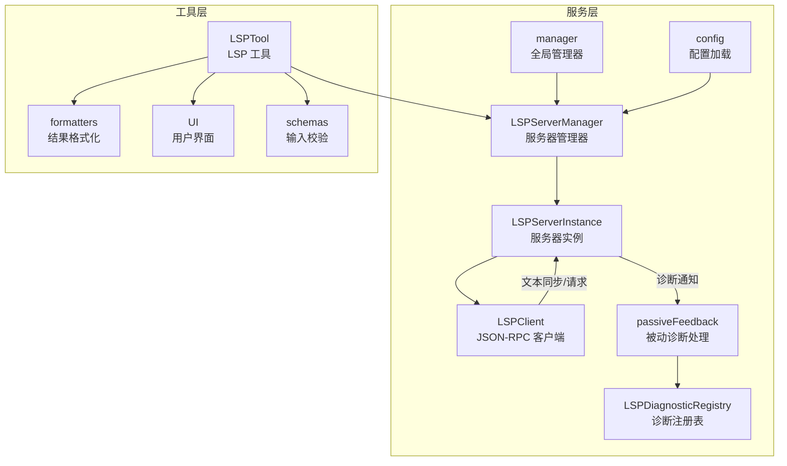
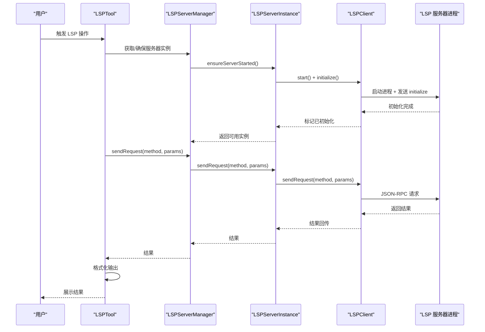
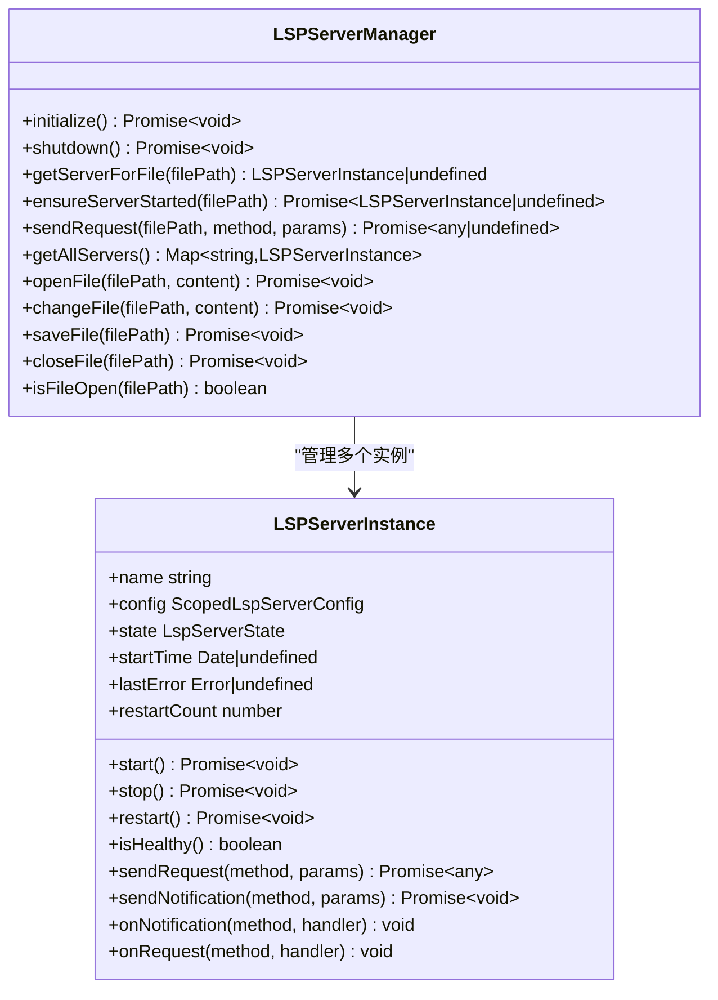
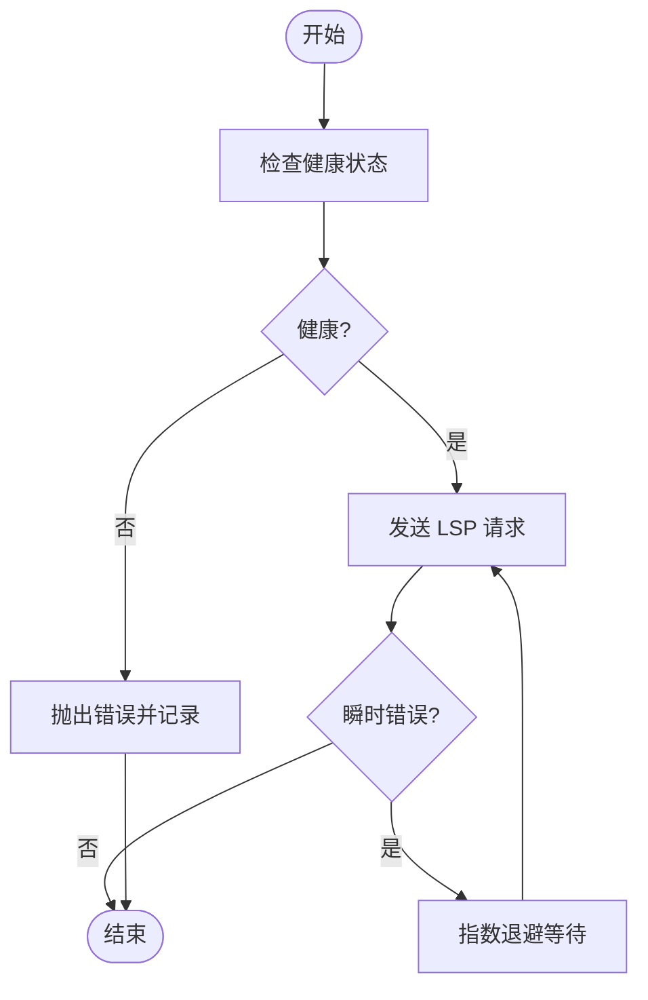
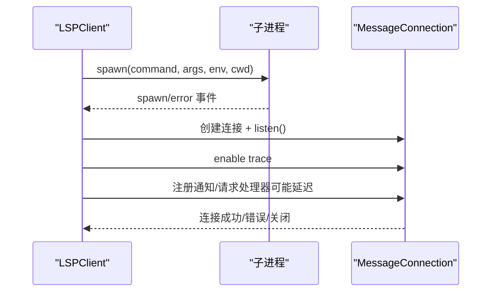
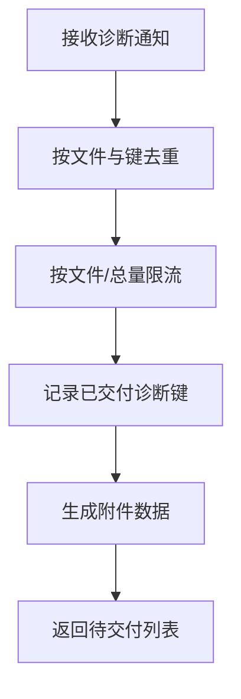
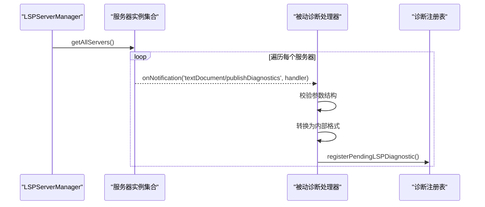
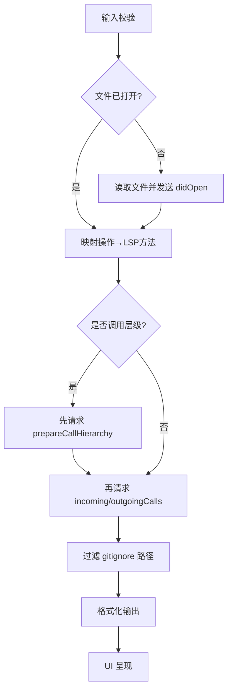
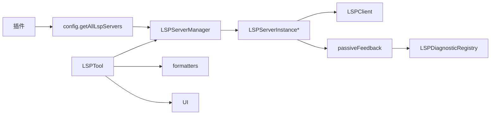

# 语言服务器协议服务

<cite>
**本文档引用的文件**
- [LSPServerManager.ts](file://src/services/lsp/LSPServerManager.ts)
- [LSPServerInstance.ts](file://src/services/lsp/LSPServerInstance.ts)
- [LSPClient.ts](file://src/services/lsp/LSPClient.ts)
- [LSPDiagnosticRegistry.ts](file://src/services/lsp/LSPDiagnosticRegistry.ts)
- [passiveFeedback.ts](file://src/services/lsp/passiveFeedback.ts)
- [config.ts](file://src/services/lsp/config.ts)
- [manager.ts](file://src/services/lsp/manager.ts)
- [LSPTool.ts](file://src/tools/LSPTool/LSPTool.ts)
- [formatters.ts](file://src/tools/LSPTool/formatters.ts)
- [schemas.ts](file://src/tools/LSPTool/schemas.ts)
- [UI.tsx](file://src/tools/LSPTool/UI.tsx)
</cite>

## 目录
1. [简介](#简介)
2. [项目结构](#项目结构)
3. [核心组件](#核心组件)
4. [架构总览](#架构总览)
5. [详细组件分析](#详细组件分析)
6. [依赖关系分析](#依赖关系分析)
7. [性能考虑](#性能考虑)
8. [故障排除指南](#故障排除指南)
9. [结论](#结论)
10. [附录](#附录)

## 简介
本文件系统性梳理 Claude Code 的语言服务器协议（LSP）服务模块，围绕以下目标展开：
- 深入解释 LSP 服务的架构设计：服务器管理、客户端通信、诊断处理
- 详解核心 LSP 组件：LSP 服务器管理器（多语言服务器、生命周期管理）、LSP 客户端（协议实现、消息处理）、诊断注册表（错误检测、警告管理）、被动反馈（智能建议、代码补全）
- 阐述 LSP 协议实现、符号解析和代码导航功能
- 解释语言服务器发现、自动配置和性能优化策略
- 提供 LSP 扩展指南，包括新语言支持、自定义诊断规则和插件集成
- 包含 LSP 调试工具、性能监控和故障排除方法

## 项目结构
LSP 服务位于 `src/services/lsp`，工具层位于 `src/tools/LSPTool`，整体采用分层设计：
- 服务层：负责 LSP 服务器实例管理、进程通信、协议封装、诊断收集与派发
- 工具层：面向用户交互的 LSP 工具，提供定义跳转、引用查找、悬停信息、符号浏览等能力，并进行结果格式化与 UI 呈现
- 配置与发现：通过插件机制动态加载 LSP 服务器配置

**图表来源**
- [LSPServerManager.ts:59-421](file://src/services/lsp/LSPServerManager.ts#L59-L421)
- [LSPServerInstance.ts:90-493](file://src/services/lsp/LSPServerInstance.ts#L90-L493)
- [LSPClient.ts:51-448](file://src/services/lsp/LSPClient.ts#L51-L448)
- [LSPDiagnosticRegistry.ts:40-387](file://src/services/lsp/LSPDiagnosticRegistry.ts#L40-L387)
- [passiveFeedback.ts:125-329](file://src/services/lsp/passiveFeedback.ts#L125-L329)
- [config.ts:15-80](file://src/services/lsp/config.ts#L15-L80)
- [manager.ts:145-290](file://src/services/lsp/manager.ts#L145-L290)
- [LSPTool.ts:127-800](file://src/tools/LSPTool/LSPTool.ts#L127-L800)
- [formatters.ts:127-593](file://src/tools/LSPTool/formatters.ts#L127-L593)
- [schemas.ts:8-191](file://src/tools/LSPTool/schemas.ts#L8-L191)
- [UI.tsx:160-228](file://src/tools/LSPTool/UI.tsx#L160-L228)

**章节来源**
- [LSPServerManager.ts:1-421](file://src/services/lsp/LSPServerManager.ts#L1-L421)
- [LSPServerInstance.ts:1-512](file://src/services/lsp/LSPServerInstance.ts#L1-L512)
- [LSPClient.ts:1-448](file://src/services/lsp/LSPClient.ts#L1-L448)
- [LSPDiagnosticRegistry.ts:1-387](file://src/services/lsp/LSPDiagnosticRegistry.ts#L1-L387)
- [passiveFeedback.ts:1-329](file://src/services/lsp/passiveFeedback.ts#L1-L329)
- [config.ts:1-80](file://src/services/lsp/config.ts#L1-L80)
- [manager.ts:1-290](file://src/services/lsp/manager.ts#L1-L290)
- [LSPTool.ts:1-861](file://src/tools/LSPTool/LSPTool.ts#L1-L861)
- [formatters.ts:1-593](file://src/tools/LSPTool/formatters.ts#L1-L593)
- [schemas.ts:1-216](file://src/tools/LSPTool/schemas.ts#L1-L216)
- [UI.tsx:1-228](file://src/tools/LSPTool/UI.tsx#L1-L228)

## 核心组件
- LSPServerManager：多语言服务器管理器，负责配置加载、服务器实例创建、请求路由、文件同步（open/change/save/close）、健康状态检查与统一生命周期管理
- LSPServerInstance：单个 LSP 服务器实例封装，包含进程启动/停止、初始化参数构造、客户端能力声明、请求重试与错误恢复、通知/请求回调注册
- LSPClient：基于 vscode-jsonrpc 的轻量客户端，负责子进程管理、stdio 通信、协议追踪、连接错误处理、延迟初始化队列
- LSPDiagnosticRegistry：异步诊断注册表，接收来自各服务器的诊断通知，执行去重、限流、跨轮次去重并按附件形式交付
- passiveFeedback：被动诊断处理，注册 textDocument/publishDiagnostics 处理器，桥接 LSP 诊断到内部诊断系统
- config/manager：配置加载与全局管理器，从插件中发现 LSP 服务器，初始化/重启/关闭管理器，暴露连接状态查询

**章节来源**
- [LSPServerManager.ts:16-43](file://src/services/lsp/LSPServerManager.ts#L16-L43)
- [LSPServerInstance.ts:33-65](file://src/services/lsp/LSPServerInstance.ts#L33-L65)
- [LSPClient.ts:21-41](file://src/services/lsp/LSPClient.ts#L21-L41)
- [LSPDiagnosticRegistry.ts:24-39](file://src/services/lsp/LSPDiagnosticRegistry.ts#L24-L39)
- [passiveFeedback.ts:117-124](file://src/services/lsp/passiveFeedback.ts#L117-L124)
- [config.ts:15-80](file://src/services/lsp/config.ts#L15-L80)
- [manager.ts:14-36](file://src/services/lsp/manager.ts#L14-L36)

## 架构总览
LSP 服务采用“管理器-实例-客户端”的三层架构：
- 管理器层：集中管理多个语言服务器，按文件扩展名路由请求，维护打开文件映射，提供统一的请求/通知接口
- 实例层：每个语言服务器一个实例，封装进程生命周期、初始化握手、能力声明、重试与崩溃恢复
- 客户端层：使用 JSON-RPC 与 LSP 服务器进程通信，提供延迟初始化、错误处理、协议追踪
- 工具层：LSPTool 将用户操作映射为 LSP 方法调用，进行结果格式化与 UI 呈现

**图表来源**
- [LSPTool.ts:224-414](file://src/tools/LSPTool/LSPTool.ts#L224-L414)
- [LSPServerManager.ts:215-263](file://src/services/lsp/LSPServerManager.ts#L215-L263)
- [LSPServerInstance.ts:355-410](file://src/services/lsp/LSPServerInstance.ts#L355-L410)
- [LSPClient.ts:256-314](file://src/services/lsp/LSPClient.ts#L256-L314)

**章节来源**
- [LSPTool.ts:224-414](file://src/tools/LSPTool/LSPTool.ts#L224-L414)
- [LSPServerManager.ts:215-263](file://src/services/lsp/LSPServerManager.ts#L215-L263)
- [LSPServerInstance.ts:355-410](file://src/services/lsp/LSPServerInstance.ts#L355-L410)
- [LSPClient.ts:256-314](file://src/services/lsp/LSPClient.ts#L256-L314)

## 详细组件分析

### LSPServerManager 分析
职责与特性：
- 配置加载：从插件中聚合所有 LSP 服务器配置，建立“扩展名→服务器列表”映射
- 实例管理：为每个服务器创建实例，注册反向请求处理器（如 workspace/configuration）
- 文件路由：根据文件扩展名选择对应服务器，确保服务器处于运行态
- 文本同步：统一处理 didOpen/didChange/didSave/didClose，维护已打开文件映射
- 生命周期：提供初始化、优雅关闭、健康检查、错误统计

**图表来源**
- [LSPServerManager.ts:16-43](file://src/services/lsp/LSPServerManager.ts#L16-L43)
- [LSPServerInstance.ts:33-65](file://src/services/lsp/LSPServerInstance.ts#L33-L65)

**章节来源**
- [LSPServerManager.ts:59-421](file://src/services/lsp/LSPServerManager.ts#L59-L421)

### LSPServerInstance 分析
职责与特性：
- 进程生命周期：启动/停止/重启，带崩溃恢复计数与最大重启限制
- 初始化握手：构造 InitializeParams（工作区信息、能力声明），支持超时控制
- 错误处理：对“内容修改”类瞬时错误进行指数退避重试
- 通知/请求：封装 sendRequest/sendNotification，注册 onNotification/onRequest 回调

**图表来源**
- [LSPServerInstance.ts:355-410](file://src/services/lsp/LSPServerInstance.ts#L355-L410)

**章节来源**
- [LSPServerInstance.ts:90-493](file://src/services/lsp/LSPServerInstance.ts#L90-L493)

### LSPClient 分析
职责与特性：
- 子进程管理：spawn LSP 服务器，捕获启动失败、进程退出、stdin 错误
- JSON-RPC 通信：基于 vscode-jsonrpc 创建 MessageConnection，注册错误/关闭事件
- 协议追踪：可启用 Trace.Verbose 记录协议细节
- 延迟初始化：在连接就绪前排队通知/请求处理器，连接后批量应用

**图表来源**
- [LSPClient.ts:88-254](file://src/services/lsp/LSPClient.ts#L88-L254)
- [LSPClient.ts:337-371](file://src/services/lsp/LSPClient.ts#L337-L371)

**章节来源**
- [LSPClient.ts:51-448](file://src/services/lsp/LSPClient.ts#L51-L448)

### LSPDiagnosticRegistry 分析
职责与特性：
- 异步诊断注册：接收来自 LSP 服务器的 textDocument/publishDiagnostics 通知
- 去重与限流：按文件 URI 和诊断键去重，限制每文件与总量，支持跨轮次 LRU 去重
- 交付机制：返回可直接作为附件投递的结果，标记已发送以便后续清理

**图表来源**
- [LSPDiagnosticRegistry.ts:136-184](file://src/services/lsp/LSPDiagnosticRegistry.ts#L136-L184)
- [LSPDiagnosticRegistry.ts:193-338](file://src/services/lsp/LSPDiagnosticRegistry.ts#L193-L338)

**章节来源**
- [LSPDiagnosticRegistry.ts:40-387](file://src/services/lsp/LSPDiagnosticRegistry.ts#L40-L387)

### passiveFeedback 分析
职责与特性：
- 注册诊断处理器：遍历所有服务器实例，注册 textDocument/publishDiagnostics 处理器
- 参数校验与转换：验证参数结构，转换为内部诊断格式
- 失败隔离：单个服务器失败不影响其他服务器；连续失败达到阈值发出警告
- 统一注册：通过 LSPServerManager.getAllServers() 获取实例，避免直接耦合

**图表来源**
- [passiveFeedback.ts:125-329](file://src/services/lsp/passiveFeedback.ts#L125-L329)

**章节来源**
- [passiveFeedback.ts:117-329](file://src/services/lsp/passiveFeedback.ts#L117-L329)

### LSPTool 分析
职责与特性：
- 输入校验：使用 Zod 构建判别式联合 Schema，严格校验操作类型与位置参数
- 文件同步：若文件未打开，先读取内容并发送 didOpen
- 请求路由：将操作映射为标准 LSP 方法（如 textDocument/definition、textDocument/references 等）
- 特殊流程：调用层级（incomingCalls/outgoingCalls）需要两步：先 prepareCallHierarchy 再请求具体调用
- 结果过滤：对位置型结果（定义/引用/实现/工作区符号）过滤 gitignore 的路径
- 输出格式化：委托 formatters 对结果进行人类可读的格式化
- UI 呈现：UI 组件根据结果数量与文件数量展示摘要与展开视图

**图表来源**
- [LSPTool.ts:224-414](file://src/tools/LSPTool/LSPTool.ts#L224-L414)
- [LSPTool.ts:427-513](file://src/tools/LSPTool/LSPTool.ts#L427-L513)
- [formatters.ts:127-593](file://src/tools/LSPTool/formatters.ts#L127-L593)

**章节来源**
- [LSPTool.ts:127-800](file://src/tools/LSPTool/LSPTool.ts#L127-L800)
- [formatters.ts:127-593](file://src/tools/LSPTool/formatters.ts#L127-L593)
- [schemas.ts:8-191](file://src/tools/LSPTool/schemas.ts#L8-L191)
- [UI.tsx:160-228](file://src/tools/LSPTool/UI.tsx#L160-L228)

## 依赖关系分析
- 插件驱动：LSP 服务器配置仅来自插件，通过 getAllLspServers 并行加载，合并结果
- 管理器单例：manager.ts 提供全局单例与初始化状态机，支持重初始化以适配插件刷新
- 工具依赖：LSPTool 依赖管理器获取实例，依赖 formatters 进行结果格式化，依赖 UI 进行呈现
- 诊断链路：LSP 服务器→passiveFeedback→LSPDiagnosticRegistry→附件系统

**图表来源**
- [config.ts:15-80](file://src/services/lsp/config.ts#L15-L80)
- [manager.ts:145-290](file://src/services/lsp/manager.ts#L145-L290)
- [LSPServerManager.ts:59-421](file://src/services/lsp/LSPServerManager.ts#L59-L421)
- [LSPServerInstance.ts:90-493](file://src/services/lsp/LSPServerInstance.ts#L90-L493)
- [LSPClient.ts:51-448](file://src/services/lsp/LSPClient.ts#L51-L448)
- [passiveFeedback.ts:125-329](file://src/services/lsp/passiveFeedback.ts#L125-L329)
- [LSPDiagnosticRegistry.ts:40-387](file://src/services/lsp/LSPDiagnosticRegistry.ts#L40-L387)
- [LSPTool.ts:127-800](file://src/tools/LSPTool/LSPTool.ts#L127-L800)
- [formatters.ts:127-593](file://src/tools/LSPTool/formatters.ts#L127-L593)
- [UI.tsx:160-228](file://src/tools/LSPTool/UI.tsx#L160-L228)

**章节来源**
- [config.ts:15-80](file://src/services/lsp/config.ts#L15-L80)
- [manager.ts:145-290](file://src/services/lsp/manager.ts#L145-L290)

## 性能考虑
- 启动与初始化
  - 使用工厂函数与惰性 require，仅在实际需要时加载 LSP 客户端，降低冷启动开销
  - 支持启动超时与最大重启次数，避免持久崩溃导致资源泄漏
- 请求与重试
  - 对瞬时错误（如“内容修改”）采用指数退避重试，减少服务器索引期间的失败率
  - 限制单文件与总诊断数量，防止诊断风暴影响对话性能
- 文件同步
  - didOpen 仅在必要时触发，避免重复同步
  - 仅在文件大小小于阈值时进行同步，防止大文件拖慢响应
- 连接与协议
  - 启用协议追踪便于诊断，但注意仅在开发/调试场景开启
  - 延迟初始化队列确保处理器在连接就绪后一次性应用，减少重复注册成本

[本节为通用指导，无需特定文件引用]

## 故障排除指南
- 启动失败
  - 检查命令是否存在、工作目录权限、环境变量覆盖
  - 查看 stderr 日志与连接错误日志，定位 spawn 或 initialize 失败原因
- 连接异常
  - 关注连接错误/关闭事件，确认进程是否意外退出或被杀
  - 若出现“内容修改”错误，属于服务器索引过程中的预期行为，可等待重试
- 诊断不显示
  - 确认被动诊断处理器已注册且无连续失败
  - 检查去重与限流策略是否过滤了全部诊断
- 工具调用失败
  - 校验输入参数（文件路径、行列号）是否有效
  - 检查文件是否过大或被 gitignore 过滤
  - 查看格式化阶段的日志，定位结果为空的原因

**章节来源**
- [LSPClient.ts:144-178](file://src/services/lsp/LSPClient.ts#L144-L178)
- [LSPServerInstance.ts:377-402](file://src/services/lsp/LSPServerInstance.ts#L377-L402)
- [passiveFeedback.ts:231-276](file://src/services/lsp/passiveFeedback.ts#L231-L276)
- [LSPTool.ts:155-210](file://src/tools/LSPTool/LSPTool.ts#L155-L210)

## 结论
该 LSP 服务模块通过清晰的分层设计与稳健的错误处理机制，实现了多语言服务器的统一管理与高效通信。配合被动诊断与工具层的丰富能力，为用户提供稳定、可扩展的语言智能体验。通过插件化的配置加载与全局管理器的状态机，系统具备良好的可维护性与可扩展性。

[本节为总结性内容，无需特定文件引用]

## 附录

### LSP 协议与符号解析要点
- 协议实现：基于 vscode-languageserver-protocol，客户端能力声明遵循 LSP 3.16+ 与兼容字段
- 符号解析：支持 documentSymbol（层次化）与 workspace/symbol（平面），并可过滤 gitignore 路径
- 导航功能：goToDefinition/goToImplementation/findReferences/hover/prepareCallHierarchy/incomingCalls/outgoingCalls

**章节来源**
- [LSPServerInstance.ts:167-237](file://src/services/lsp/LSPServerInstance.ts#L167-L237)
- [LSPTool.ts:427-513](file://src/tools/LSPTool/LSPTool.ts#L427-L513)
- [formatters.ts:340-422](file://src/tools/LSPTool/formatters.ts#L340-L422)

### 语言服务器发现与自动配置
- 来源：仅来自插件，通过 getAllLspServers 并行加载，合并同名覆盖策略
- 自动配置：扩展名→语言映射由服务器配置提供，管理器据此路由请求
- 刷新：插件缓存更新后可触发重新初始化，确保新服务器及时生效

**章节来源**
- [config.ts:15-80](file://src/services/lsp/config.ts#L15-L80)
- [manager.ts:226-253](file://src/services/lsp/manager.ts#L226-L253)

### 扩展指南
- 新语言支持
  - 在插件中提供 LSP 服务器配置（命令、参数、扩展名映射、工作区设置）
  - 确保服务器能在指定工作目录下正常初始化
- 自定义诊断规则
  - 可在被动诊断处理器中增加自定义过滤逻辑（需谨慎避免性能问题）
  - 使用诊断注册表的去重与限流能力，保证用户体验
- 插件集成
  - 通过插件缓存刷新触发 reinitializeLspServerManager，使新服务器即时可用
  - 注意错误隔离与连续失败告警，保障系统稳定性

**章节来源**
- [config.ts:15-80](file://src/services/lsp/config.ts#L15-L80)
- [manager.ts:226-253](file://src/services/lsp/manager.ts#L226-L253)
- [passiveFeedback.ts:125-329](file://src/services/lsp/passiveFeedback.ts#L125-L329)