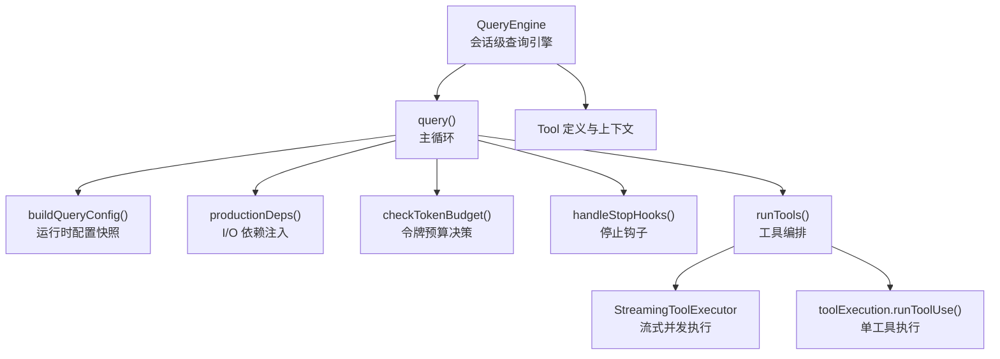
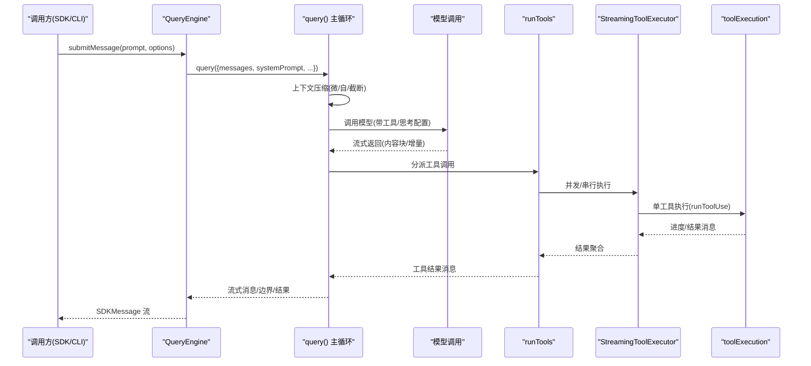
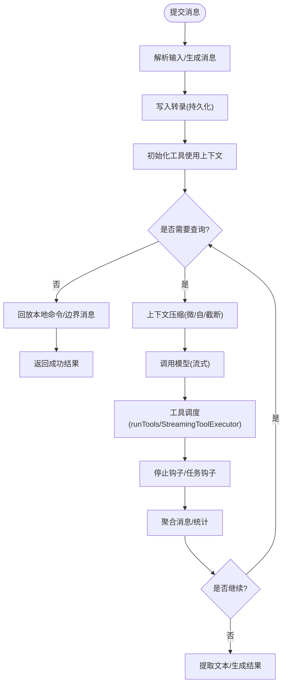
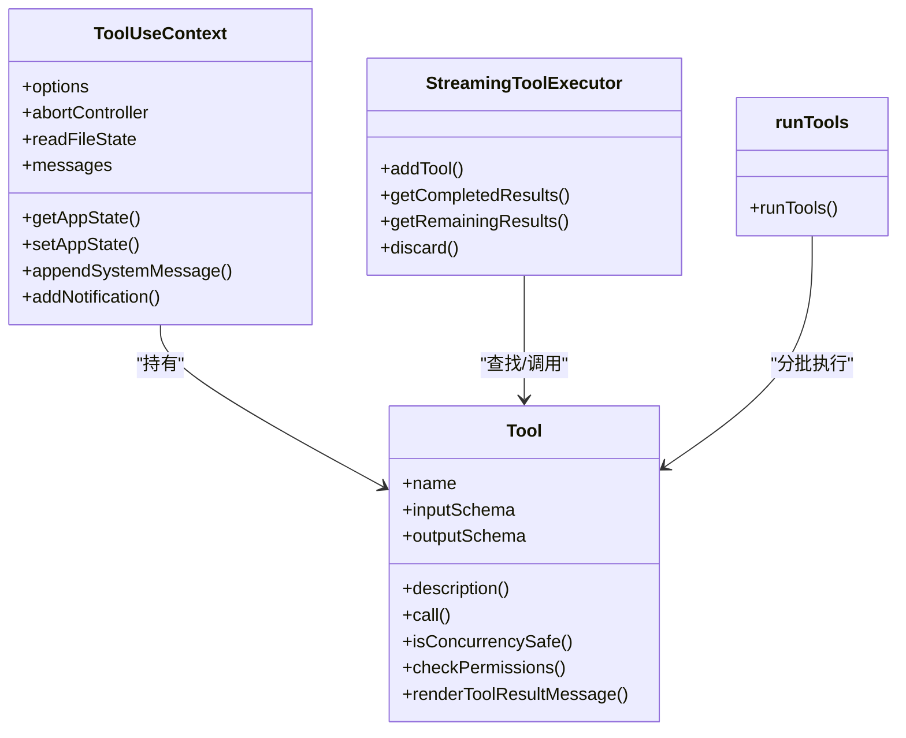
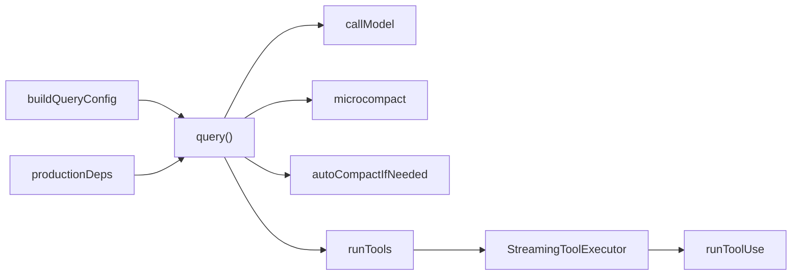

# 查询引擎层

<cite>
**本文引用的文件**
- [src/QueryEngine.ts](file://src/QueryEngine.ts)
- [src/query.ts](file://src/query.ts)
- [src/query/config.ts](file://src/query/config.ts)
- [src/query/deps.ts](file://src/query/deps.ts)
- [src/query/tokenBudget.ts](file://src/query/tokenBudget.ts)
- [src/query/stopHooks.ts](file://src/query/stopHooks.ts)
- [src/Tool.ts](file://src/Tool.ts)
- [src/services/tools/StreamingToolExecutor.ts](file://src/services/tools/StreamingToolExecutor.ts)
- [src/services/tools/toolOrchestration.ts](file://src/services/tools/toolOrchestration.ts)
- [src/services/tools/toolExecution.ts](file://src/services/tools/toolExecution.ts)
</cite>

## 目录
1. [简介](#简介)
2. [项目结构](#项目结构)
3. [核心组件](#核心组件)
4. [架构总览](#架构总览)
5. [详细组件分析](#详细组件分析)
6. [依赖关系分析](#依赖关系分析)
7. [性能考量](#性能考量)
8. [故障排除指南](#故障排除指南)
9. [结论](#结论)

## 简介
本文件系统性梳理 Claude Code 的查询引擎层，聚焦以下目标：
- 深入解释查询引擎的核心架构：消息循环处理、查询执行、工具调用协调与响应生成
- 全面阐述 QueryEngine 类的设计模式：查询队列管理、并发控制与错误恢复机制
- 详述查询处理的完整生命周期：输入解析、权限验证、工具选择、执行调度与结果聚合
- 解释查询引擎与工具系统的交互模式：工具注册、参数传递与状态同步
- 提供性能优化策略：缓存机制、批量处理与资源管理
- 给出查询失败的故障排除指南与监控指标建议

## 项目结构
查询引擎层位于 src 目录下，核心文件包括：
- QueryEngine：面向 SDK/CLI 的会话级查询引擎，封装消息循环、权限与工具调用协调
- query：查询主循环（query.ts），负责上下文压缩、令牌预算、工具调度与流式输出
- query/config.ts、query/deps.ts、query/tokenBudget.ts：配置、依赖注入与令牌预算
- query/stopHooks.ts：停止钩子（Stop hooks）与任务完成钩子等扩展点
- Tool 与工具执行相关服务：工具定义、并发/串行调度、流式执行器

图表来源
- [src/QueryEngine.ts:184-1177](file://src/QueryEngine.ts#L184-L1177)
- [src/query.ts:219-1295](file://src/query.ts#L219-L1295)
- [src/query/config.ts:29-46](file://src/query/config.ts#L29-L46)
- [src/query/deps.ts:33-40](file://src/query/deps.ts#L33-L40)
- [src/query/tokenBudget.ts:45-93](file://src/query/tokenBudget.ts#L45-L93)
- [src/query/stopHooks.ts:65-473](file://src/query/stopHooks.ts#L65-L473)
- [src/services/tools/StreamingToolExecutor.ts:40-519](file://src/services/tools/StreamingToolExecutor.ts#L40-L519)
- [src/services/tools/toolOrchestration.ts:19-189](file://src/services/tools/toolOrchestration.ts#L19-L189)
- [src/Tool.ts:158-300](file://src/Tool.ts#L158-L300)

章节来源
- [src/QueryEngine.ts:184-1177](file://src/QueryEngine.ts#L184-L1177)
- [src/query.ts:219-1295](file://src/query.ts#L219-L1295)

## 核心组件
- QueryEngine：面向 SDK/CLI 的会话级查询引擎，负责消息构建、系统提示拼装、权限跟踪、转录持久化、流式响应与最终结果汇总。支持中断、消息读取与会话 ID 获取。
- query：查询主循环，按轮次迭代，执行上下文压缩（微压缩、自动压缩、历史截断）、令牌预算检查、模型调用、工具调度与停止钩子。
- 工具系统：Tool 定义与 ToolUseContext 上下文，统一工具注册、权限校验、并发安全判定、进度与结果渲染。
- 流式工具执行器：StreamingToolExecutor 在并发安全前提下有序产出进度与结果，支持丢弃与取消传播。
- 编排与执行：runTools 将工具按并发安全分批执行；toolExecution 负责单工具调用与结果映射。

章节来源
- [src/QueryEngine.ts:184-1177](file://src/QueryEngine.ts#L184-L1177)
- [src/query.ts:219-1295](file://src/query.ts#L219-L1295)
- [src/Tool.ts:158-300](file://src/Tool.ts#L158-L300)
- [src/services/tools/StreamingToolExecutor.ts:40-519](file://src/services/tools/StreamingToolExecutor.ts#L40-L519)
- [src/services/tools/toolOrchestration.ts:19-189](file://src/services/tools/toolOrchestration.ts#L19-L189)

## 架构总览
查询引擎采用“会话级引擎 + 主循环”的分层设计：
- QueryEngine：负责会话状态、权限与系统提示组装、转录持久化、流式响应与最终结果
- query：负责每轮迭代的上下文压缩、令牌预算、模型调用、工具调度与钩子扩展
- 工具层：Tool 定义 + 编排 + 执行，支持并发/串行、进度与结果的有序产出

图表来源
- [src/QueryEngine.ts:209-1156](file://src/QueryEngine.ts#L209-L1156)
- [src/query.ts:241-1295](file://src/query.ts#L241-L1295)
- [src/services/tools/StreamingToolExecutor.ts:40-519](file://src/services/tools/StreamingToolExecutor.ts#L40-L519)
- [src/services/tools/toolOrchestration.ts:19-189](file://src/services/tools/toolOrchestration.ts#L19-L189)
- [src/services/tools/toolExecution.ts:1256-1301](file://src/services/tools/toolExecution.ts#L1256-L1301)

## 详细组件分析

### QueryEngine 设计与生命周期
- 设计模式
  - 面向会话的有界状态机：维护 mutableMessages、权限拒绝记录、累计用量与文件读缓存
  - 包装 canUseTool：在工具使用前收集权限拒绝信息，便于 SDK 报告
  - 系统提示拼装：默认系统提示 + 自定义 + 记忆机制提示 + 追加提示
  - 转录持久化：在进入主循环前写入用户消息，保证中断后可恢复
  - 流式响应：normalizeMessage 规范化消息并逐条产出，支持 includePartialMessages
  - 中断与状态查询：提供 interrupt/getMessages/getReadFileState/getSessionId/setModel
- 生命周期要点
  - 输入解析：processUserInput 生成消息与允许工具集合
  - 权限验证：包装 canUseTool 收集拒绝项
  - 工具选择：由模型在流中产生 tool_use 块
  - 执行调度：runTools 或 StreamingToolExecutor 负责并发/串行
  - 结果聚合：最终提取文本结果、统计耗时/用量/费用/权限拒绝

图表来源
- [src/QueryEngine.ts:209-1156](file://src/QueryEngine.ts#L209-L1156)
- [src/query.ts:241-1295](file://src/query.ts#L241-L1295)

章节来源
- [src/QueryEngine.ts:184-1177](file://src/QueryEngine.ts#L184-L1177)

### 查询主循环（query）与上下文压缩
- 上下文压缩
  - 微压缩：对缓存编辑友好，必要时延迟边界消息
  - 自动压缩：根据阈值触发，产出摘要消息与附件
  - 历史截断（HISTORY_SNIP）：在 SDK 场景按边界回收内存
- 令牌预算与阻塞限制
  - checkTokenBudget 决策是否继续或停止
  - 阻塞上限：在未启用自动压缩时阻止过长提示
- 模型调用与回退
  - callModel 流式调用，支持流式回退（tombstone 清理）
  - 反馈式工具输入补全（backfillObservableInput）

章节来源
- [src/query.ts:241-1295](file://src/query.ts#L241-L1295)
- [src/query/tokenBudget.ts:45-93](file://src/query/tokenBudget.ts#L45-L93)

### 工具系统与执行编排
- 工具定义与上下文
  - Tool 接口：名称、描述、输入/输出模式、并发安全、权限校验、渲染与进度回调
  - ToolUseContext：工具执行所需上下文（命令、工具集、MCP 客户端、代理定义、文件缓存、通知等）
- 并发与串行
  - runTools：将工具按并发安全分批执行，读操作并发，非读操作串行
  - StreamingToolExecutor：在并发前提下保持顺序与进度优先产出，支持丢弃与取消传播
- 执行细节
  - runToolUse：单工具执行，产出进度/结果消息，支持结构化输出与内容替换
  - 结果映射：mapToolResultToToolResultBlockParam 统一 API 输出格式

图表来源
- [src/Tool.ts:158-300](file://src/Tool.ts#L158-L300)
- [src/Tool.ts:362-695](file://src/Tool.ts#L362-L695)
- [src/services/tools/StreamingToolExecutor.ts:40-519](file://src/services/tools/StreamingToolExecutor.ts#L40-L519)
- [src/services/tools/toolOrchestration.ts:19-189](file://src/services/tools/toolOrchestration.ts#L19-L189)

章节来源
- [src/Tool.ts:158-300](file://src/Tool.ts#L158-L300)
- [src/services/tools/StreamingToolExecutor.ts:40-519](file://src/services/tools/StreamingToolExecutor.ts#L40-L519)
- [src/services/tools/toolOrchestration.ts:19-189](file://src/services/tools/toolOrchestration.ts#L19-L189)
- [src/services/tools/toolExecution.ts:1256-1301](file://src/services/tools/toolExecution.ts#L1256-L1301)

### 停止钩子与扩展点
- 停止钩子（Stop hooks）：在助手响应后运行，产出进度/附件/错误，可阻止继续或生成摘要
- 任务完成钩子与伙伴空闲钩子：在特定角色下运行，支持阻断与统计
- 钩子执行期间的中断检测与通知

章节来源
- [src/query/stopHooks.ts:65-473](file://src/query/stopHooks.ts#L65-L473)

## 依赖关系分析
- 配置与依赖注入
  - buildQueryConfig 快照运行时门禁（特性开关、环境变量）
  - productionDeps 注入模型调用、微压缩、自动压缩与 UUID 生成
- 查询循环依赖
  - query 依赖 deps（callModel、microcompact、autocompact）
  - 通过 deps 抽象测试友好，避免模块级 spy
- 工具层依赖
  - runTools 与 StreamingToolExecutor 依赖 Tool 定义与 canUseTool
  - toolExecution 负责具体工具调用与结果映射

图表来源
- [src/query/config.ts:29-46](file://src/query/config.ts#L29-L46)
- [src/query/deps.ts:33-40](file://src/query/deps.ts#L33-L40)
- [src/query.ts:241-1295](file://src/query.ts#L241-L1295)
- [src/services/tools/StreamingToolExecutor.ts:40-519](file://src/services/tools/StreamingToolExecutor.ts#L40-L519)
- [src/services/tools/toolOrchestration.ts:19-189](file://src/services/tools/toolOrchestration.ts#L19-L189)

章节来源
- [src/query/config.ts:29-46](file://src/query/config.ts#L29-L46)
- [src/query/deps.ts:33-40](file://src/query/deps.ts#L33-L40)

## 性能考量
- 缓存机制
  - prompt 缓存：renderedSystemPrompt 冻结以共享父线程 prompt 缓存
  - 工具结果缓存：applyToolResultBudget 与内容替换记录，减少重复传输
  - 文件读缓存：cloneFileStateCache 与 readFileState 共享读状态
- 批量处理
  - 工具并发：runTools 对只读工具进行并发批处理，受 CLAUDE_CODE_MAX_TOOL_USE_CONCURRENCY 控制
  - 流式执行：StreamingToolExecutor 优先产出进度，降低等待时间
- 资源管理
  - 令牌预算：checkTokenBudget 动态决定继续/停止，避免超预算
  - 上下文压缩：微/自动/截断三段式压缩，控制历史长度
  - 中断传播：Bash 错误通过 siblingAbortController 向兄弟进程传播，避免无效执行
- I/O 优化
  - 转录写入：recordTranscript 异步写入，fire-and-forget 降低阻塞
  - prompt dump：仅在需要时创建 createDumpPromptsFetch，避免会话内累积闭包

章节来源
- [src/query/tokenBudget.ts:45-93](file://src/query/tokenBudget.ts#L45-L93)
- [src/services/tools/toolOrchestration.ts:8-12](file://src/services/tools/toolOrchestration.ts#L8-L12)
- [src/services/tools/StreamingToolExecutor.ts:40-519](file://src/services/tools/StreamingToolExecutor.ts#L40-L519)
- [src/query.ts:588-590](file://src/query.ts#L588-L590)

## 故障排除指南
- 常见错误类型与定位
  - 最大轮次/预算/结构化输出重试限制：QueryEngine 在相应条件满足时直接返回错误结果
  - API 错误诊断：错误日志水印（errorLogWatermark）限定本次轮次范围，便于定位
  - 流式回退：出现 streaming fallback 时，QueryEngine 会丢弃部分消息并通过 tombstone 清理
- 诊断字段
  - result_type、last_content_type、stop_reason：用于 error_during_execution 诊断
  - errors[]：包含诊断前缀与内存错误缓冲区片段
- 复现与恢复
  - 使用 replayUserMessages 回放初始用户消息确认
  - 检查权限拒绝列表 permission_denials，核对 canUseTool 返回行为
  - 若出现 prompt too long 或 max_output_tokens，检查上下文压缩与令牌预算策略

章节来源
- [src/QueryEngine.ts:841-1118](file://src/QueryEngine.ts#L841-L1118)
- [src/query.ts:788-827](file://src/query.ts#L788-L827)

## 结论
查询引擎层通过 QueryEngine 与 query 主循环实现“会话级状态 + 每轮上下文压缩 + 工具编排”的稳健架构。其设计强调：
- 明确的消息循环与边界：从输入解析到结果聚合的完整闭环
- 权限与安全：包装 canUseTool 收集拒绝，钩子扩展与阻断能力
- 并发与可靠性：工具并发/串行编排、流式执行与取消传播
- 性能与可运维：令牌预算、上下文压缩、缓存与异步 I/O
- 可观测性与可诊断：结构化结果、错误水印与钩子输出