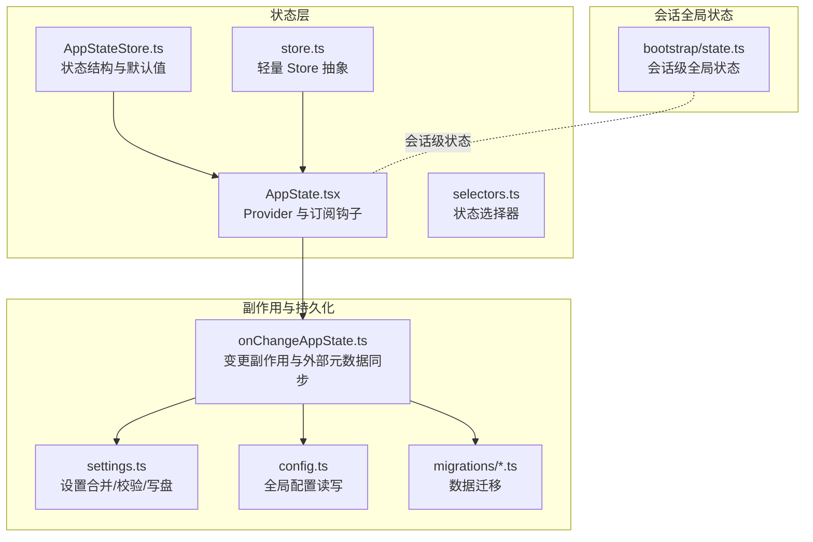
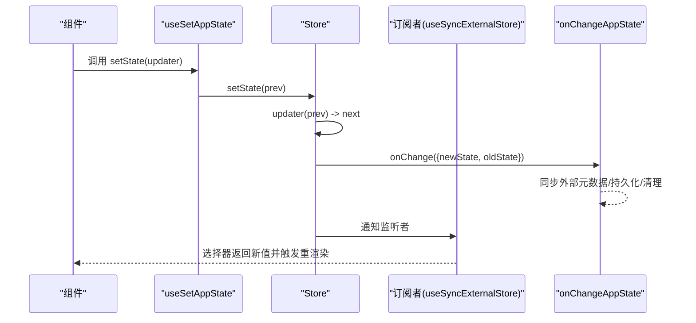
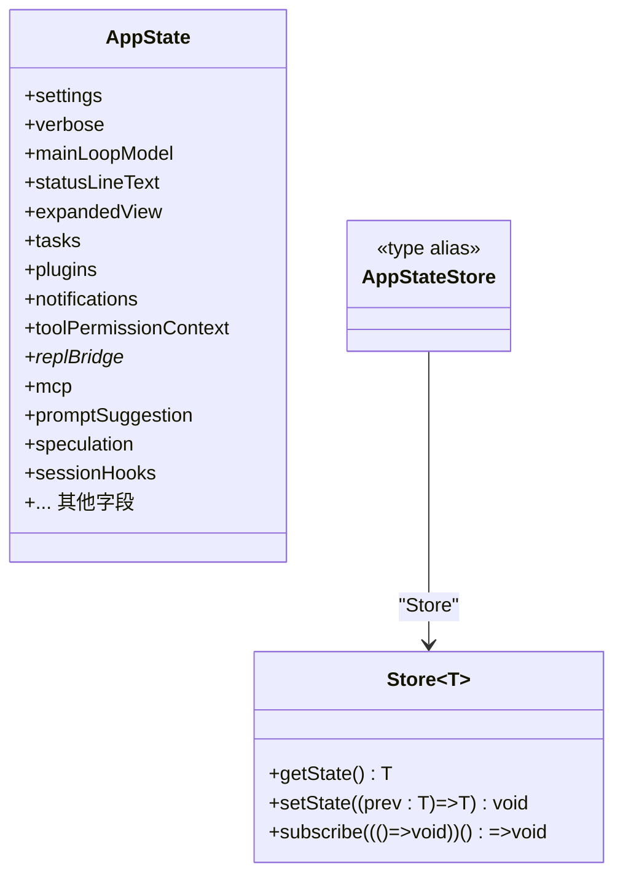
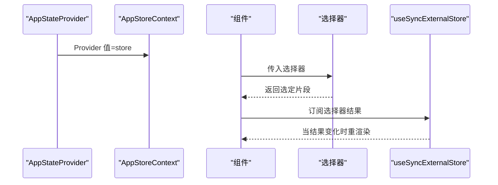
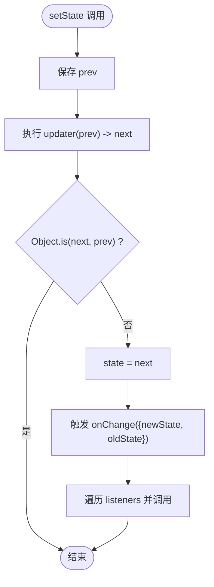
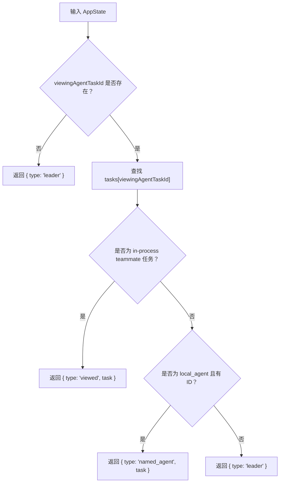
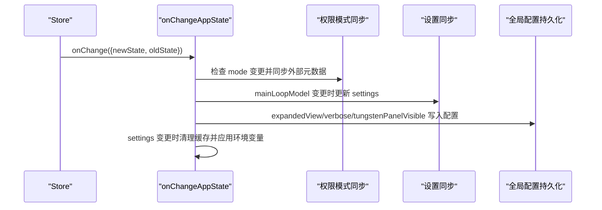
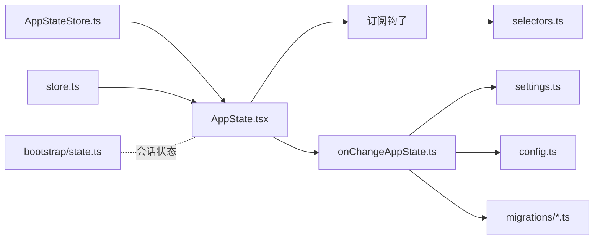

# 状态管理层

<cite>
**本文引用的文件**
- [AppStateStore.ts](file://src/state/AppStateStore.ts)
- [AppState.tsx](file://src/state/AppState.tsx)
- [store.ts](file://src/state/store.ts)
- [selectors.ts](file://src/state/selectors.ts)
- [onChangeAppState.ts](file://src/state/onChangeAppState.ts)
- [state.ts](file://src/bootstrap/state.ts)
- [settings.ts](file://src/utils/settings/settings.ts)
- [config.ts](file://src/utils/config.ts)
- [migrateLegacyOpusToCurrent.ts](file://src/migrations/migrateLegacyOpusToCurrent.ts)
- [migrateSonnet45ToSonnet46.ts](file://src/migrations/migrateSonnet45ToSonnet46.ts)
- [migrateEnableAllProjectMcpServersToSettings.ts](file://src/migrations/migrateEnableAllProjectMcpServersToSettings.ts)
</cite>

## 目录
1. [简介](#简介)
2. [项目结构](#项目结构)
3. [核心组件](#核心组件)
4. [架构总览](#架构总览)
5. [详细组件分析](#详细组件分析)
6. [依赖关系分析](#依赖关系分析)
7. [性能考量](#性能考量)
8. [故障排查指南](#故障排查指南)
9. [结论](#结论)
10. [附录](#附录)

## 简介
本文件系统性梳理 Claude Code 的状态管理层，围绕以下目标展开：
- 全局状态存储：AppState 的结构设计、字段语义与生命周期
- 订阅机制：基于 useSyncExternalStore 的选择器订阅与最小化重渲染
- 副作用处理：onChangeAppState 钩子如何同步外部元数据、持久化配置与缓存清理
- 状态选择器：派生状态、类型安全与性能优化
- 持久化策略：设置合并、配置文件读写、跨进程一致性与迁移
- 最佳实践：规范化状态、异步状态处理、调试与并发控制

## 项目结构
状态管理层由“状态定义 + 存储 + 订阅 + 选择器 + 副作用 + 持久化”构成，核心文件如下：
- 状态定义与默认值：AppStateStore.ts
- React Provider 与订阅钩子：AppState.tsx
- 轻量 Store 抽象：store.ts
- 状态选择器：selectors.ts
- 全局副作用与外部元数据同步：onChangeAppState.ts
- 会话级全局状态（非 UI）：bootstrap/state.ts
- 设置系统（合并、校验、写盘）：utils/settings/settings.ts
- 全局配置（用户偏好、特性开关等）：utils/config.ts
- 数据迁移（设置/配置字段迁移）：migrations/*.ts

图表来源
- [AppStateStore.ts:1-570](file://src/state/AppStateStore.ts#L1-L570)
- [store.ts:1-35](file://src/state/store.ts#L1-L35)
- [AppState.tsx:1-200](file://src/state/AppState.tsx#L1-L200)
- [selectors.ts:1-77](file://src/state/selectors.ts#L1-L77)
- [onChangeAppState.ts:1-172](file://src/state/onChangeAppState.ts#L1-L172)
- [settings.ts:1-800](file://src/utils/settings/settings.ts#L1-L800)
- [config.ts:1-800](file://src/utils/config.ts#L1-L800)
- [state.ts:1-800](file://src/bootstrap/state.ts#L1-L800)

章节来源
- [AppStateStore.ts:1-570](file://src/state/AppStateStore.ts#L1-L570)
- [AppState.tsx:1-200](file://src/state/AppState.tsx#L1-L200)
- [store.ts:1-35](file://src/state/store.ts#L1-L35)
- [selectors.ts:1-77](file://src/state/selectors.ts#L1-L77)
- [onChangeAppState.ts:1-172](file://src/state/onChangeAppState.ts#L1-L172)
- [state.ts:1-800](file://src/bootstrap/state.ts#L1-L800)
- [settings.ts:1-800](file://src/utils/settings/settings.ts#L1-L800)
- [config.ts:1-800](file://src/utils/config.ts#L1-L800)

## 核心组件
- Store 抽象：提供 getState、setState、subscribe 三件套，内部以 Set 维护监听者，支持 onChange 回调
- AppState：大型全局状态对象，包含设置、任务、插件、通知、权限上下文、桥接状态、MCP 状态、提示词建议、推测状态等
- Provider 与订阅钩子：AppStateProvider 创建 Store 并注入上下文；useAppState 使用 useSyncExternalStore 基于选择器订阅
- 选择器：纯函数从 AppState 派生视图态，避免在组件内做复杂计算
- onChangeAppState：集中处理模式切换、主循环模型同步、全局配置持久化、缓存清理等副作用
- 设置与配置：settings.ts 负责多源设置合并与写盘；config.ts 负责全局偏好与特性开关持久化

章节来源
- [store.ts:1-35](file://src/state/store.ts#L1-L35)
- [AppStateStore.ts:89-570](file://src/state/AppStateStore.ts#L89-L570)
- [AppState.tsx:37-200](file://src/state/AppState.tsx#L37-L200)
- [selectors.ts:1-77](file://src/state/selectors.ts#L1-L77)
- [onChangeAppState.ts:43-172](file://src/state/onChangeAppState.ts#L43-L172)
- [settings.ts:645-800](file://src/utils/settings/settings.ts#L645-L800)
- [config.ts:797-800](file://src/utils/config.ts#L797-L800)

## 架构总览
状态管理采用“不可变更新 + 选择器订阅 + 集中式副作用”的设计：
- 更新路径：组件通过 useSetAppState 获取 setState，按需调用；Store 在 setState 中执行 Object.is 比较去重后触发 onChange 与广播
- 订阅路径：useSyncExternalStore 将选择器返回值作为订阅键，仅在 Object.is 不同时触发重渲染
- 副作用路径：onChangeAppState 监听每次状态变更，负责外部元数据同步、配置持久化、缓存清理与环境变量应用

图表来源
- [AppState.tsx:117-179](file://src/state/AppState.tsx#L117-L179)
- [store.ts:20-33](file://src/state/store.ts#L20-L33)
- [onChangeAppState.ts:43-92](file://src/state/onChangeAppState.ts#L43-L92)

## 详细组件分析

### AppStateStore 设计与默认值
- 状态结构：包含设置、任务、插件、通知、权限上下文、桥接状态、MCP 状态、提示词建议、推测状态、思维/建议开关、会话钩子、inbox、工蜂权限请求、技能改进、活动覆盖层、快速模式、顾问模型、努力值、UltraPlan 状态、权限回调等
- 默认值：getDefaultAppState 提供完整初始状态，确保首次渲染与回放一致
- 类型约束：DeepImmutable 用于深层只读推断，部分字段（如 tasks）显式排除以允许函数类型存在

图表来源
- [AppStateStore.ts:89-570](file://src/state/AppStateStore.ts#L89-L570)
- [store.ts:4-8](file://src/state/store.ts#L4-L8)

章节来源
- [AppStateStore.ts:89-570](file://src/state/AppStateStore.ts#L89-L570)
- [AppStateStore.ts:456-570](file://src/state/AppStateStore.ts#L456-L570)

### Provider 与订阅机制（AppState.tsx）
- AppStateProvider：创建 Store 并注入上下文；在挂载时检查并禁用可能被远程设置覆盖的“绕过权限模式”
- useAppState：基于 useSyncExternalStore 的选择器订阅，仅在 Object.is 不同时重渲染
- useSetAppState：稳定引用的 setState，适合仅需要更新而不需要订阅的场景
- 安全钩子：useAppStateMaybeOutsideOfProvider 在 Provider 外部返回 undefined，避免错误使用

图表来源
- [AppState.tsx:37-110](file://src/state/AppState.tsx#L37-L110)
- [AppState.tsx:142-179](file://src/state/AppState.tsx#L142-L179)

章节来源
- [AppState.tsx:37-110](file://src/state/AppState.tsx#L37-L110)
- [AppState.tsx:142-179](file://src/state/AppState.tsx#L142-L179)

### Store 抽象（store.ts）
- 核心能力：getState、setState、subscribe
- 去重逻辑：Object.is(prev, next) 则不更新与广播
- 广播策略：遍历监听集合逐个调用
- 可选 onChange：在每次状态变更时回调，便于副作用处理

图表来源
- [store.ts:20-33](file://src/state/store.ts#L20-L33)

章节来源
- [store.ts:1-35](file://src/state/store.ts#L1-L35)

### 状态选择器（selectors.ts）
- getViewedTeammateTask：从 viewingAgentTaskId 与 tasks 中安全提取当前查看的同伴任务
- getActiveAgentForInput：根据当前视图与任务类型决定输入路由（leader/viewed/named_agent）

图表来源
- [selectors.ts:18-76](file://src/state/selectors.ts#L18-L76)

章节来源
- [selectors.ts:1-77](file://src/state/selectors.ts#L1-L77)

### 副作用处理（onChangeAppState.ts）
- 权限模式同步：当 toolPermissionContext.mode 变更时，对外部元数据与 SDK 状态流进行同步，并处理 UltraPlan 首次计划周期标记
- 主循环模型同步：当 mainLoopModel 变更时，同步到 settings 并更新主循环模型覆盖
- 全局配置持久化：当 expandedView/verbose/tungstenPanelVisible 等变更时，写入全局配置
- 设置变更副作用：当 settings 变更时，清理认证相关缓存并重新应用环境变量

图表来源
- [onChangeAppState.ts:43-172](file://src/state/onChangeAppState.ts#L43-L172)

章节来源
- [onChangeAppState.ts:43-172](file://src/state/onChangeAppState.ts#L43-L172)

### 会话全局状态（bootstrap/state.ts）
- 会话级全局状态：包含成本、时延、工具耗时、令牌用量、会话标识、代理颜色映射、最后交互时间、慢操作追踪、SDK 事件、计划 slug 缓存等
- 生命周期：单例状态，提供读写访问器与信号订阅（如会话切换）

章节来源
- [state.ts:45-257](file://src/bootstrap/state.ts#L45-L257)
- [state.ts:429-489](file://src/bootstrap/state.ts#L429-L489)

### 设置系统与持久化（settings.ts）
- 多源设置：用户、项目、本地、策略、标志等优先级合并
- 解析与校验：Zod Schema 校验，非法规则过滤，错误收集
- 写盘与缓存：合并策略（数组去重、undefined 删除）、写盘后重置缓存
- 会话缓存：按源缓存解析结果，减少重复 IO

章节来源
- [settings.ts:645-800](file://src/utils/settings/settings.ts#L645-L800)
- [settings.ts:416-524](file://src/utils/settings/settings.ts#L416-L524)

### 全局配置持久化（config.ts）
- 全局配置：主题、通知渠道、编辑器模式、自动紧凑、终端进度条、特性开关、统计缓存、迁移版本等
- 写盘策略：原子写入、防丢失保护（检测认证状态丢失）、测试模式下的特殊处理
- 键白名单：严格限定可持久化的键，避免污染

章节来源
- [config.ts:797-800](file://src/utils/config.ts#L797-L800)
- [config.ts:627-666](file://src/utils/config.ts#L627-L666)

### 数据迁移（migrations/*.ts）
- 迁移策略：读取旧位置字段 → 合并到新位置（settings）→ 清理旧字段 → 记录迁移事件
- 示例：
  - migrateLegacyOpusToCurrent：将历史 Opus 版本字符串迁移到统一别名，并记录迁移时间戳
  - migrateSonnet45ToSonnet46：将 Sonnet 4.5 字符串迁移到 sonnet/sonnet[1m]，并记录迁移时间戳
  - migrateEnableAllProjectMcpServersToSettings：将项目配置中的 MCP 服务器批准字段迁移到 localSettings

章节来源
- [migrateLegacyOpusToCurrent.ts:29-57](file://src/migrations/migrateLegacyOpusToCurrent.ts#L29-L57)
- [migrateSonnet45ToSonnet46.ts:29-67](file://src/migrations/migrateSonnet45ToSonnet46.ts#L29-L67)
- [migrateEnableAllProjectMcpServersToSettings.ts:17-118](file://src/migrations/migrateEnableAllProjectMcpServersToSettings.ts#L17-L118)

## 依赖关系分析
- 组件耦合
  - AppState.tsx 依赖 Store 抽象与 AppState 结构
  - onChangeAppState 依赖 settings/config 与权限模式转换工具
  - selectors 依赖 AppState 与任务类型判断
- 外部依赖
  - React.useSyncExternalStore 用于订阅
  - Zod 用于设置校验
  - 文件系统与 JSON 序列化用于持久化

图表来源
- [AppStateStore.ts:1-570](file://src/state/AppStateStore.ts#L1-L570)
- [AppState.tsx:1-200](file://src/state/AppState.tsx#L1-L200)
- [store.ts:1-35](file://src/state/store.ts#L1-L35)
- [selectors.ts:1-77](file://src/state/selectors.ts#L1-L77)
- [onChangeAppState.ts:1-172](file://src/state/onChangeAppState.ts#L1-L172)
- [settings.ts:1-800](file://src/utils/settings/settings.ts#L1-L800)
- [config.ts:1-800](file://src/utils/config.ts#L1-L800)
- [state.ts:1-800](file://src/bootstrap/state.ts#L1-L800)

章节来源
- [AppStateStore.ts:1-570](file://src/state/AppStateStore.ts#L1-L570)
- [AppState.tsx:1-200](file://src/state/AppState.tsx#L1-L200)
- [store.ts:1-35](file://src/state/store.ts#L1-L35)
- [selectors.ts:1-77](file://src/state/selectors.ts#L1-L77)
- [onChangeAppState.ts:1-172](file://src/state/onChangeAppState.ts#L1-L172)
- [settings.ts:1-800](file://src/utils/settings/settings.ts#L1-L800)
- [config.ts:1-800](file://src/utils/config.ts#L1-L800)
- [state.ts:1-800](file://src/bootstrap/state.ts#L1-L800)

## 性能考量
- 订阅粒度：useAppState 通过选择器返回现有对象引用，避免不必要的重渲染
- 去重更新：Store 在 setState 中使用 Object.is 去重，减少广播与重渲染
- 选择器纯函数：派生逻辑无副作用，便于缓存与测试
- 设置合并：数组去重与浅拷贝策略降低写盘开销
- 会话全局状态：单例状态避免重复初始化，提供批量读写接口

## 故障排查指南
- 权限模式不同步
  - 现象：CLI 模式变更后 UI 未同步
  - 排查：确认 onChangeAppState 是否正确触发外部元数据同步
  - 参考：[onChangeAppState.ts:65-92](file://src/state/onChangeAppState.ts#L65-L92)
- 设置写盘失败或 JSON 语法错误
  - 现象：设置未生效或报错
  - 排查：检查 settings.ts 的写盘流程与错误处理
  - 参考：[settings.ts:416-524](file://src/utils/settings/settings.ts#L416-L524)
- 全局配置持久化丢失敏感状态
  - 现象：重启后认证状态丢失
  - 排查：检查 wouldLoseAuthState 保护逻辑与写盘流程
  - 参考：[config.ts:782-795](file://src/utils/config.ts#L782-L795)
- 选择器导致频繁重渲染
  - 现象：组件不必要地多次渲染
  - 排查：确保选择器返回现有对象引用而非新建对象
  - 参考：[AppState.tsx:126-141](file://src/state/AppState.tsx#L126-L141)
- 数据迁移未生效
  - 现象：旧字段仍存在或新字段未出现
  - 排查：检查迁移函数的读取、合并与清理步骤
  - 参考：[migrateEnableAllProjectMcpServersToSettings.ts:33-107](file://src/migrations/migrateEnableAllProjectMcpServersToSettings.ts#L33-L107)

章节来源
- [onChangeAppState.ts:65-92](file://src/state/onChangeAppState.ts#L65-L92)
- [settings.ts:416-524](file://src/utils/settings/settings.ts#L416-L524)
- [config.ts:782-795](file://src/utils/config.ts#L782-L795)
- [AppState.tsx:126-141](file://src/state/AppState.tsx#L126-L141)
- [migrateEnableAllProjectMcpServersToSettings.ts:33-107](file://src/migrations/migrateEnableAllProjectMcpServersToSettings.ts#L33-L107)

## 结论
Claude Code 的状态管理层以轻量 Store 为核心，结合 React 选择器订阅与集中式副作用，实现了高性能、可维护的全局状态管理。通过严格的设置合并与持久化策略、完善的迁移机制以及清晰的选择器抽象，系统在复杂 UI 与多源配置下保持一致性与可扩展性。

## 附录
- 最佳实践清单
  - 使用选择器返回现有对象引用，避免在选择器内创建新对象
  - setState 使用幂等更新，尽量复用不变对象
  - 将副作用集中在 onChangeAppState，保持选择器纯函数
  - 设置合并使用明确的删除语义（undefined），数组使用去重策略
  - 对外暴露的键遵循全局配置键白名单，避免污染
  - 异步状态处理时，使用稳定的 setState 引用并配合选择器订阅
  - 并发更新时，利用 Object.is 去重与选择器最小化重渲染
  - 使用迁移脚本进行字段升级，保证向后兼容与数据一致性