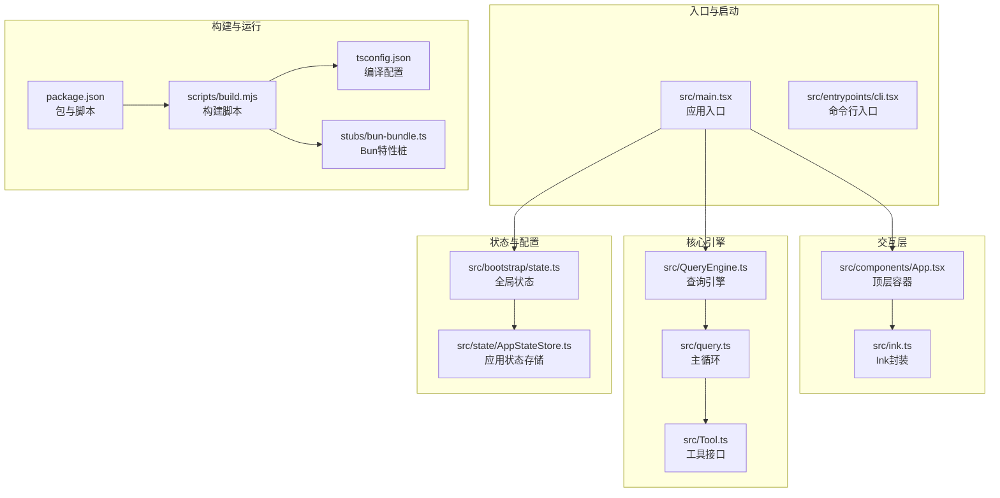
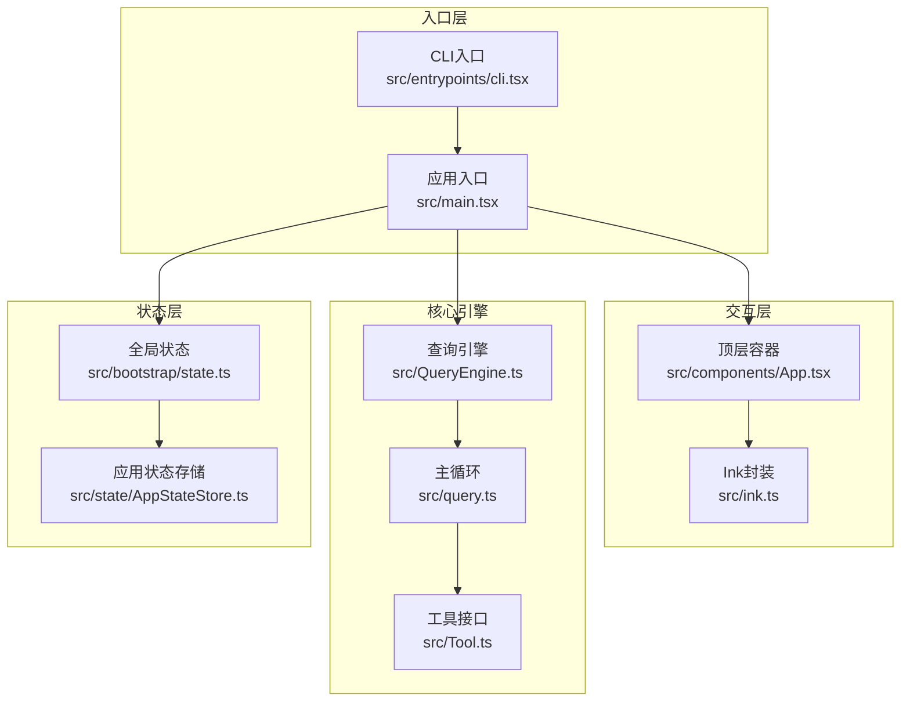
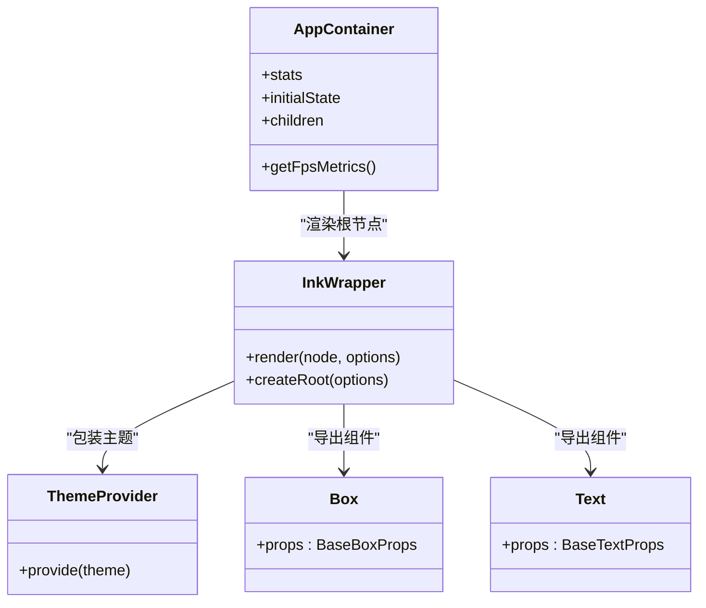
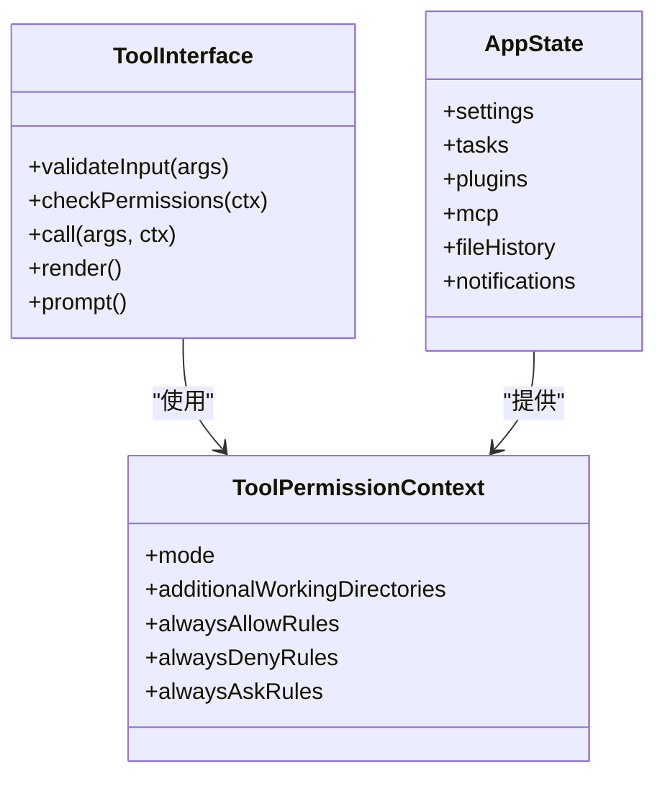
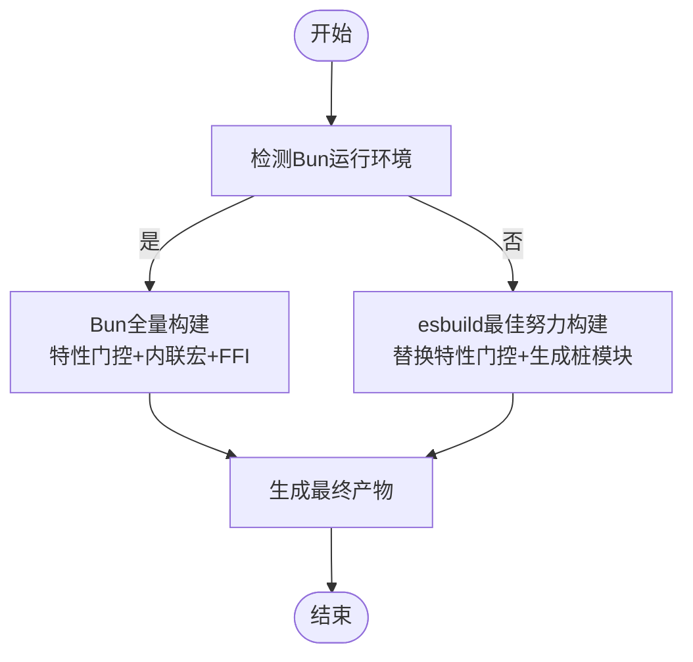
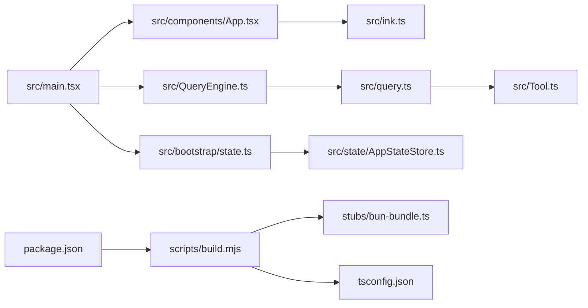

# 技术选型与架构决策

<cite>
**本文档引用的文件**
- [package.json](file://package.json)
- [tsconfig.json](file://tsconfig.json)
- [README.md](file://README.md)
- [QUICKSTART.md](file://QUICKSTART.md)
- [scripts/build.mjs](file://scripts/build.mjs)
- [stubs/bun-bundle.ts](file://stubs/bun-bundle.ts)
- [src/main.tsx](file://src/main.tsx)
- [src/QueryEngine.ts](file://src/QueryEngine.ts)
- [src/query.ts](file://src/query.ts)
- [src/Tool.ts](file://src/Tool.ts)
- [src/bootstrap/state.ts](file://src/bootstrap/state.ts)
- [src/state/AppStateStore.ts](file://src/state/AppStateStore.ts)
- [src/ink.ts](file://src/ink.ts)
- [src/components/App.tsx](file://src/components/App.tsx)
</cite>

## 目录
1. [引言](#引言)
2. [项目结构](#项目结构)
3. [核心组件](#核心组件)
4. [架构总览](#架构总览)
5. [详细组件分析](#详细组件分析)
6. [依赖关系分析](#依赖关系分析)
7. [性能考量](#性能考量)
8. [故障排查指南](#故障排查指南)
9. [结论](#结论)
10. [附录](#附录)

## 引言
本文件面向Claude Code的技术选型与架构决策进行系统化分析，重点围绕以下目标展开：
- 解释核心技术栈（React+Ink作为终端UI框架、TypeScript提供类型安全、Bun作为构建工具）的选择动机与收益；
- 分析架构决策（性能权衡、可扩展性、维护成本）；
- 阐述模块化架构优于单体架构的原因，并说明如何在功能完整性与系统复杂度之间取得平衡；
- 提供技术债务管理策略与未来演进规划；
- 对比替代方案并评估迁移成本。

## 项目结构
该项目采用高度模块化的前端/后端混合架构，以TypeScript为统一语言，通过React+Ink实现终端交互式UI，以模块化服务层承载业务逻辑，以工具系统与任务系统支撑多Agent协作与自动化执行。构建阶段通过脚本对源码进行转换与打包，以适配不同运行环境。

图表来源
- [src/main.tsx:1-120](file://src/main.tsx#L1-L120)
- [src/QueryEngine.ts:1-120](file://src/QueryEngine.ts#L1-L120)
- [src/query.ts:1-120](file://src/query.ts#L1-L120)
- [src/Tool.ts:1-120](file://src/Tool.ts#L1-L120)
- [src/bootstrap/state.ts:1-120](file://src/bootstrap/state.ts#L1-L120)
- [src/state/AppStateStore.ts:1-120](file://src/state/AppStateStore.ts#L1-L120)
- [src/ink.ts:1-86](file://src/ink.ts#L1-L86)
- [src/components/App.tsx:1-56](file://src/components/App.tsx#L1-L56)
- [scripts/build.mjs:1-120](file://scripts/build.mjs#L1-L120)
- [stubs/bun-bundle.ts:1-5](file://stubs/bun-bundle.ts#L1-L5)
- [tsconfig.json:1-37](file://tsconfig.json#L1-L37)
- [package.json:1-21](file://package.json#L1-L21)

章节来源
- [README.md:250-380](file://README.md#L250-L380)
- [QUICKSTART.md:1-122](file://QUICKSTART.md#L1-L122)

## 核心组件
- 应用入口与启动：负责初始化、权限与信任检查、延迟预取、特性门控分支处理等。
- 查询引擎与主循环：封装消息流转、工具调用、上下文压缩、会话持久化等核心流程。
- 工具系统：定义工具接口、权限校验、并发安全、渲染与描述生成等能力。
- 终端UI层：基于React+Ink提供主题化、输入事件、帧渲染、文本/布局组件。
- 全局状态与应用状态：集中管理会话、模型、插件、MCP、任务、通知等状态。
- 构建与运行：通过脚本完成源码转换、死代码消除、esbuild打包与桩模块注入。

章节来源
- [src/main.tsx:1-200](file://src/main.tsx#L1-L200)
- [src/QueryEngine.ts:1-200](file://src/QueryEngine.ts#L1-L200)
- [src/query.ts:1-200](file://src/query.ts#L1-L200)
- [src/Tool.ts:1-200](file://src/Tool.ts#L1-L200)
- [src/ink.ts:1-86](file://src/ink.ts#L1-L86)
- [src/bootstrap/state.ts:1-200](file://src/bootstrap/state.ts#L1-L200)
- [src/state/AppStateStore.ts:1-200](file://src/state/AppStateStore.ts#L1-L200)

## 架构总览
系统采用“入口层—查询引擎—工具/服务/状态”分层设计，结合特性门控（feature gates）实现按需裁剪与实验发布。终端UI通过React+Ink在Node环境中渲染，支持主题、输入、动画与布局。状态层以不可变数据结构与深度冻结提升稳定性，配合事件驱动的订阅机制实现响应式更新。

图表来源
- [src/main.tsx:1-120](file://src/main.tsx#L1-L120)
- [src/QueryEngine.ts:1-120](file://src/QueryEngine.ts#L1-L120)
- [src/query.ts:1-120](file://src/query.ts#L1-L120)
- [src/Tool.ts:1-120](file://src/Tool.ts#L1-L120)
- [src/bootstrap/state.ts:1-120](file://src/bootstrap/state.ts#L1-L120)
- [src/state/AppStateStore.ts:1-120](file://src/state/AppStateStore.ts#L1-L120)
- [src/ink.ts:1-86](file://src/ink.ts#L1-L86)
- [src/components/App.tsx:1-56](file://src/components/App.tsx#L1-L56)

## 详细组件分析

### React+Ink作为UI框架的优势
- 终端原生渲染：Ink在Node环境中直接输出ANSI控制序列，避免浏览器依赖，适合CLI场景。
- 主题与布局：通过ThemeProvider与Box/Text等组件提供一致的视觉与布局体验。
- 响应式与事件：useInput、useStdin、useAnimationFrame等钩子简化键盘输入与动画帧管理。
- 性能优化：Ink的渲染器与节点缓存减少不必要的重绘，适合高频交互。

图表来源
- [src/ink.ts:1-86](file://src/ink.ts#L1-L86)
- [src/components/App.tsx:1-56](file://src/components/App.tsx#L1-L56)

章节来源
- [src/ink.ts:1-86](file://src/ink.ts#L1-L86)
- [src/components/App.tsx:1-56](file://src/components/App.tsx#L1-L56)

### TypeScript提供类型安全的好处
- 类型约束工具接口与权限上下文，降低工具调用错误与权限绕过风险。
- 不可变状态与深度冻结类型（DeepImmutable）确保状态变更的可追踪性与一致性。
- 统一的消息类型、进度类型与工具结果类型，便于跨模块协作与API对接。

图表来源
- [src/Tool.ts:1-200](file://src/Tool.ts#L1-L200)
- [src/state/AppStateStore.ts:1-200](file://src/state/AppStateStore.ts#L1-L200)

章节来源
- [src/Tool.ts:1-200](file://src/Tool.ts#L1-L200)
- [src/state/AppStateStore.ts:1-200](file://src/state/AppStateStore.ts#L1-L200)

### Bun作为构建工具的性能优势
- 编译时特性门控：通过feature()在编译期决定是否包含分支，实现死代码消除与产物瘦身。
- 内置原语与快速打包：相比通用打包器，Bun在内联宏、FFI与平台特定能力上具备更高效率。
- 与源码的强耦合：源码中大量使用bun:bundle与MACRO，需要Bun才能完整复现编译效果。

图表来源
- [scripts/build.mjs:1-120](file://scripts/build.mjs#L1-L120)
- [stubs/bun-bundle.ts:1-5](file://stubs/bun-bundle.ts#L1-L5)

章节来源
- [scripts/build.mjs:1-120](file://scripts/build.mjs#L1-L120)
- [stubs/bun-bundle.ts:1-5](file://stubs/bun-bundle.ts#L1-L5)

### 架构决策的技术考量
- 性能权衡
  - 特性门控与死代码消除：通过feature()在构建期裁剪未启用功能，显著减小产物体积与冷启动时间。
  - 延迟预取与异步初始化：将非关键路径的初始化推迟到首次渲染之后，缩短首屏时间。
  - 终端渲染优化：Ink的帧调度与节点缓存减少UI抖动与重绘开销。
- 可扩展性
  - 模块化服务层：API客户端、分析、MCP、插件、工具执行器等均独立模块，便于增量开发与替换。
  - 工具系统抽象：统一的工具接口与权限上下文使新工具快速接入并保持一致的安全与可观测性。
  - 状态层隔离：全局状态与应用状态分离，避免跨模块耦合导致的状态风暴。
- 维护成本
  - TypeScript类型体系：统一的数据结构与接口定义降低沟通成本与回归风险。
  - 渐进式特性发布：通过特性门控与实验标志，可在不破坏稳定版本的前提下进行A/B测试与灰度发布。
  - 构建脚本与桩模块：在缺少Bun时仍可产出可用产物，但需手动修复缺失模块。

章节来源
- [src/main.tsx:380-431](file://src/main.tsx#L380-L431)
- [src/QueryEngine.ts:110-128](file://src/QueryEngine.ts#L110-L128)
- [src/query.ts:1-120](file://src/query.ts#L1-L120)
- [src/ink.ts:1-86](file://src/ink.ts#L1-L86)
- [src/bootstrap/state.ts:1-120](file://src/bootstrap/state.ts#L1-L120)
- [src/state/AppStateStore.ts:1-120](file://src/state/AppStateStore.ts#L1-L120)

### 模块化架构优于单体架构的原因
- 职责清晰：入口、UI、引擎、服务、状态各司其职，降低修改面与副作用范围。
- 并行开发：不同模块可由不同团队并行开发与测试，缩短交付周期。
- 易于替换：服务层与工具层的抽象使得第三方实现（如新的API客户端或工具）可平滑接入。
- 可观测性：模块边界明确，便于埋点、日志与指标的分层收集与分析。

章节来源
- [README.md:383-446](file://README.md#L383-L446)
- [src/QueryEngine.ts:1-120](file://src/QueryEngine.ts#L1-L120)
- [src/Tool.ts:1-120](file://src/Tool.ts#L1-L120)

### 功能完整性与系统复杂度的平衡
- 通过特性门控与条件导入，在不牺牲功能完整性的情况下隐藏实验性与内部特性，避免对普通用户的干扰。
- 将高开销操作（如远程桥接、MCP连接、插件加载）延迟到需要时再初始化，降低默认启动成本。
- 使用不可变状态与事件驱动更新，减少状态同步复杂度与竞态风险。

章节来源
- [src/main.tsx:70-82](file://src/main.tsx#L70-L82)
- [src/QueryEngine.ts:110-128](file://src/QueryEngine.ts#L110-L128)
- [src/bootstrap/state.ts:1-120](file://src/bootstrap/state.ts#L1-L120)

### 技术债务管理策略与未来演进规划
- 技术债务管理
  - 逐步替换：对遗留模块（如vendor原生桩）进行渐进式重构，优先选择影响面大且改动成本低的部分。
  - 类型完善：持续补充缺失的类型定义，尤其是动态导入与第三方模块，提升静态检查覆盖率。
  - 构建健壮性：完善构建脚本对缺失模块的自动识别与修复流程，减少人工干预。
- 未来演进
  - 从Bun迁移到通用打包器：在保留特性门控的同时，通过配置与宏替换实现跨工具链兼容。
  - 服务层标准化：将API客户端、分析与MCP等服务抽象为可插拔模块，支持多后端与多协议。
  - UI现代化：在保持Ink生态的同时，探索可复用的组件库与主题系统，提升可维护性与一致性。

章节来源
- [QUICKSTART.md:58-104](file://QUICKSTART.md#L58-L104)
- [scripts/build.mjs:120-246](file://scripts/build.mjs#L120-L246)

### 与替代方案的对比分析与迁移成本评估
- 替代方案
  - UI：从React迁移到其他终端UI库（如blessed、ink的替代品）可能带来生态与学习成本；Ink在终端渲染与主题方面已满足需求。
  - 构建：从Bun迁移到esbuild/Vite/Rollup等通用打包器，需解决特性门控与内联宏问题，迁移成本中等。
  - 状态：从当前状态模型迁移到Redux/XState等，需重新设计状态流与订阅机制，成本较高。
- 迁移成本
  - 中短期：完善构建脚本与桩模块，补齐缺失类型，降低对Bun的强依赖。
  - 中长期：引入标准化服务层与可插拔架构，逐步替换遗留模块，提升可维护性与可移植性。

章节来源
- [QUICKSTART.md:58-104](file://QUICKSTART.md#L58-L104)
- [scripts/build.mjs:120-246](file://scripts/build.mjs#L120-L246)

## 依赖关系分析
- 入口依赖：入口文件依赖UI容器、查询引擎、状态与工具系统，形成自上而下的控制流。
- 查询引擎依赖：查询引擎依赖工具系统、消息处理、上下文与会话存储，形成闭环的对话与工具调用链。
- UI依赖：UI容器依赖主题提供者与状态上下文，保证渲染一致性与响应式更新。
- 构建依赖：构建脚本依赖esbuild与桩模块，通过特征替换与迭代stub创建实现最佳努力打包。

图表来源
- [src/main.tsx:1-120](file://src/main.tsx#L1-L120)
- [src/QueryEngine.ts:1-120](file://src/QueryEngine.ts#L1-L120)
- [src/query.ts:1-120](file://src/query.ts#L1-L120)
- [src/Tool.ts:1-120](file://src/Tool.ts#L1-L120)
- [src/bootstrap/state.ts:1-120](file://src/bootstrap/state.ts#L1-L120)
- [src/state/AppStateStore.ts:1-120](file://src/state/AppStateStore.ts#L1-L120)
- [src/ink.ts:1-86](file://src/ink.ts#L1-L86)
- [src/components/App.tsx:1-56](file://src/components/App.tsx#L1-L56)
- [scripts/build.mjs:1-120](file://scripts/build.mjs#L1-L120)
- [stubs/bun-bundle.ts:1-5](file://stubs/bun-bundle.ts#L1-L5)
- [tsconfig.json:1-37](file://tsconfig.json#L1-L37)
- [package.json:1-21](file://package.json#L1-L21)

章节来源
- [src/main.tsx:1-120](file://src/main.tsx#L1-L120)
- [src/QueryEngine.ts:1-120](file://src/QueryEngine.ts#L1-L120)
- [src/query.ts:1-120](file://src/query.ts#L1-L120)
- [src/Tool.ts:1-120](file://src/Tool.ts#L1-L120)
- [src/bootstrap/state.ts:1-120](file://src/bootstrap/state.ts#L1-L120)
- [src/state/AppStateStore.ts:1-120](file://src/state/AppStateStore.ts#L1-L120)
- [src/ink.ts:1-86](file://src/ink.ts#L1-L86)
- [src/components/App.tsx:1-56](file://src/components/App.tsx#L1-L56)
- [scripts/build.mjs:1-120](file://scripts/build.mjs#L1-L120)
- [stubs/bun-bundle.ts:1-5](file://stubs/bun-bundle.ts#L1-L5)
- [tsconfig.json:1-37](file://tsconfig.json#L1-L37)
- [package.json:1-21](file://package.json#L1-L21)

## 性能考量
- 启动性能
  - 特性门控与死代码消除显著减少初始包体，缩短冷启动时间。
  - 延迟初始化与异步预取避免阻塞首屏渲染。
- 运行性能
  - 终端渲染优化与帧调度减少UI抖动。
  - 工具执行器支持并发与串行组合，提高吞吐。
- 存储与会话
  - 会话持久化采用追加日志格式，支持快速恢复与回放。
  - 上下文压缩与边界标记减少历史消息长度，降低API成本。

章节来源
- [src/main.tsx:380-431](file://src/main.tsx#L380-L431)
- [src/query.ts:1-120](file://src/query.ts#L1-L120)
- [README.md:750-776](file://README.md#L750-L776)

## 故障排查指南
- 构建失败
  - 症状：esbuild解析缺失模块或语法错误。
  - 处理：根据构建脚本输出定位缺失模块，创建stub文件并重试。
- 运行时异常
  - 症状：调试模式被禁用或启动即退出。
  - 处理：检查调试参数与环境变量，确认未处于调试模式。
- 权限与信任
  - 症状：工具调用被拒绝或信任对话框未出现。
  - 处理：检查权限规则、信任状态与会话配置。

章节来源
- [scripts/build.mjs:170-246](file://scripts/build.mjs#L170-L246)
- [src/main.tsx:265-271](file://src/main.tsx#L265-L271)
- [src/bootstrap/state.ts:350-420](file://src/bootstrap/state.ts#L350-L420)

## 结论
本项目通过React+Ink实现高效稳定的终端UI，借助TypeScript强化类型安全与可维护性，并以Bun的特性门控与内联宏实现高性能构建与实验发布。模块化架构在功能完整性与系统复杂度之间取得良好平衡，配合渐进式重构与标准化服务层，可进一步降低技术债务并提升可移植性。未来建议在保持Ink生态优势的同时，逐步完善构建与类型体系，探索更通用的服务抽象与可插拔架构。

## 附录
- 快速开始与构建说明参见[QUICKSTART.md:1-122](file://QUICKSTART.md#L1-L122)。
- 项目整体架构与目录参考参见[README.md:250-380](file://README.md#L250-L380)。