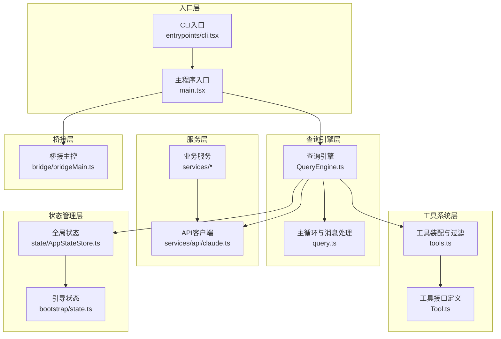
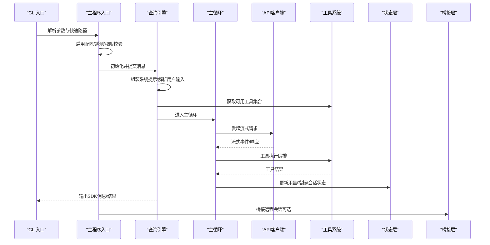
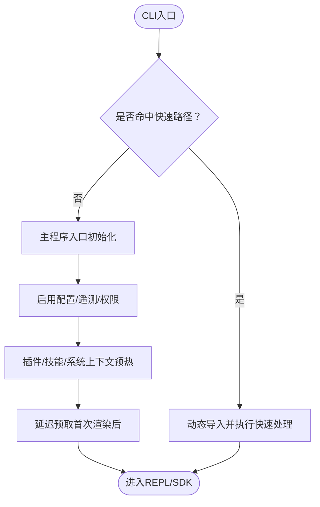
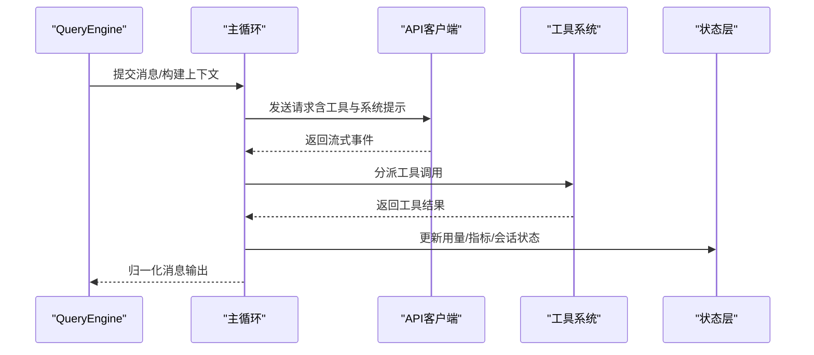
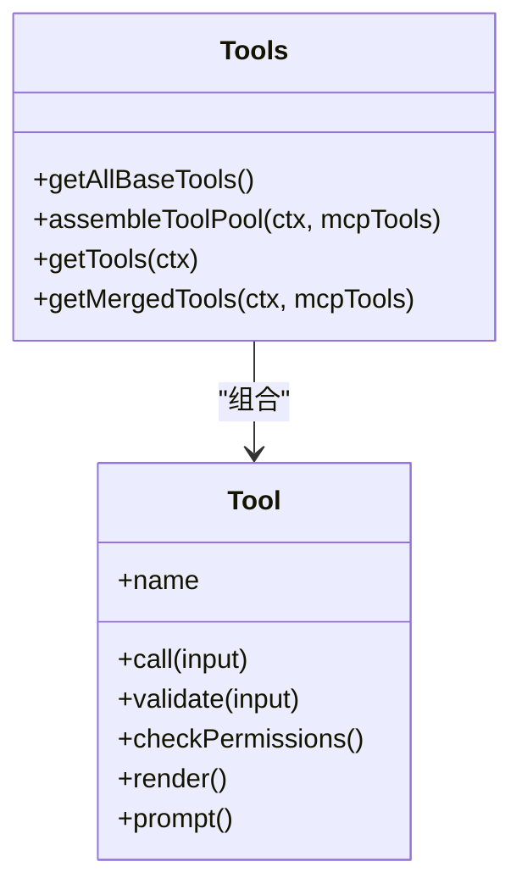
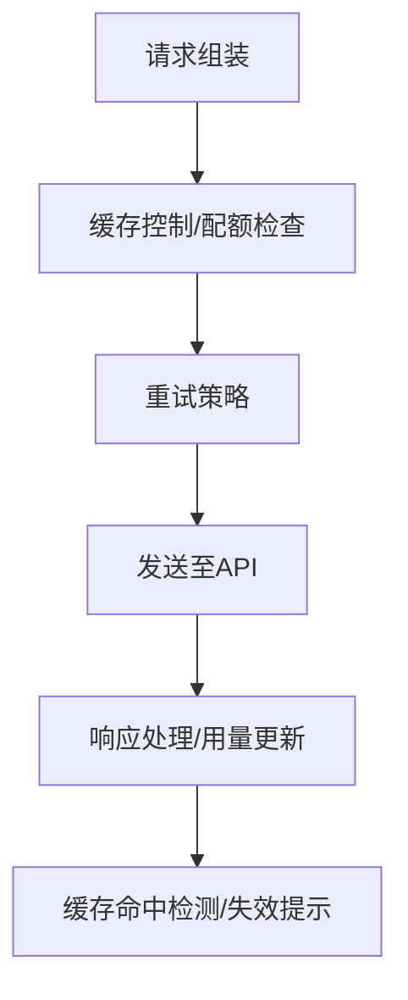
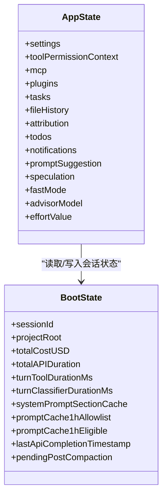
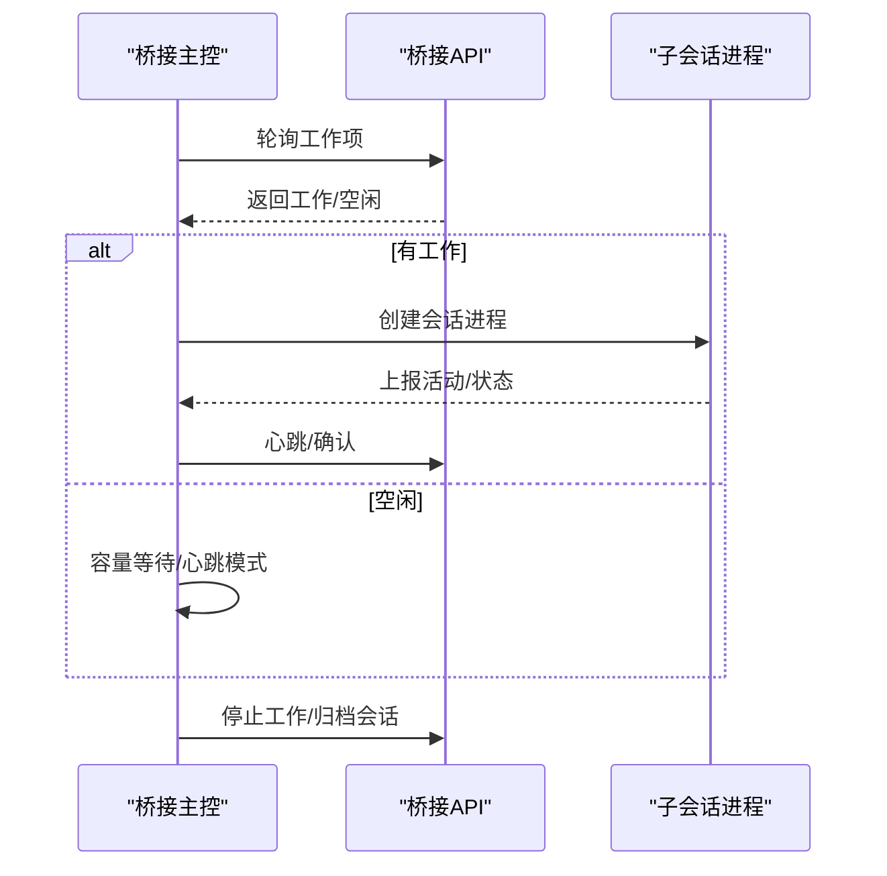
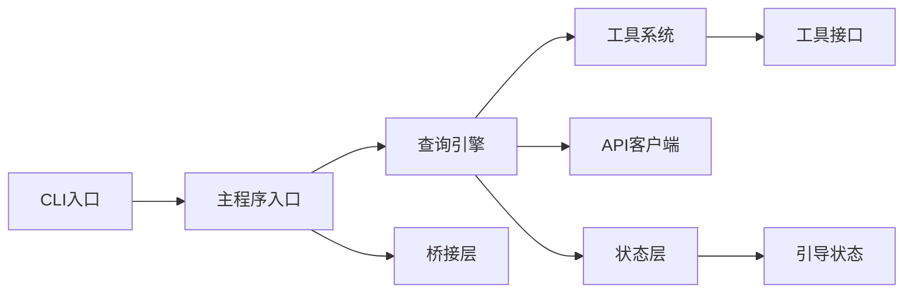

# 整体架构设计

<cite>
**本文档引用的文件**
- [README.md](file://README.md)
- [package.json](file://package.json)
- [src/main.tsx](file://src/main.tsx)
- [src/bootstrap/state.ts](file://src/bootstrap/state.ts)
- [src/QueryEngine.ts](file://src/QueryEngine.ts)
- [src/bridge/bridgeMain.ts](file://src/bridge/bridgeMain.ts)
- [src/services/api/claude.ts](file://src/services/api/claude.ts)
- [src/tools.ts](file://src/tools.ts)
- [src/state/AppStateStore.ts](file://src/state/AppStateStore.ts)
- [src/entrypoints/cli.tsx](file://src/entrypoints/cli.tsx)
</cite>

## 目录
1. [引言](#引言)
2. [项目结构](#项目结构)
3. [核心组件](#核心组件)
4. [架构总览](#架构总览)
5. [详细组件分析](#详细组件分析)
6. [依赖关系分析](#依赖关系分析)
7. [性能考虑](#性能考虑)
8. [故障排除指南](#故障排除指南)
9. [结论](#结论)

## 引言
本文件面向Claude Code的整体架构设计，基于仓库源码进行系统化梳理与可视化呈现。文档围绕“入口层、查询引擎层、工具系统层、服务层、状态管理层、桥接层”六大分层展开，阐明各层职责、交互关系与数据流，并解释采用该分层设计的原因（模块化、可扩展性、安全性）。同时，结合技术选型（React+Ink、TypeScript）说明其在工程实践中的价值与权衡。

## 项目结构
从代码组织看，项目采用“按职责分层 + 功能域聚合”的混合结构：
- 入口层：命令行入口与主程序启动流程
- 查询引擎层：消息处理、系统提示组装、主循环与工具执行编排
- 工具系统层：内置工具与MCP工具的统一装配与过滤
- 服务层：API客户端、分析与遥测、插件与设置同步、MCP协议管理等
- 状态管理层：应用全局状态与上下文
- 桥接层：本地桥接到远程环境（桌面/容器）

**图表来源**
- [src/entrypoints/cli.tsx:1-303](file://src/entrypoints/cli.tsx#L1-L303)
- [src/main.tsx:1-800](file://src/main.tsx#L1-L800)
- [src/QueryEngine.ts:1-800](file://src/QueryEngine.ts#L1-L800)
- [src/tools.ts:1-390](file://src/tools.ts#L1-L390)
- [src/services/api/claude.ts:1-800](file://src/services/api/claude.ts#L1-L800)
- [src/state/AppStateStore.ts:1-570](file://src/state/AppStateStore.ts#L1-L570)
- [src/bootstrap/state.ts:1-800](file://src/bootstrap/state.ts#L1-L800)
- [src/bridge/bridgeMain.ts:1-800](file://src/bridge/bridgeMain.ts#L1-L800)

**章节来源**
- [README.md:383-496](file://README.md#L383-L496)
- [src/entrypoints/cli.tsx:1-303](file://src/entrypoints/cli.tsx#L1-L303)
- [src/main.tsx:1-800](file://src/main.tsx#L1-L800)

## 核心组件
- 入口层
  - CLI入口负责快速路径优化与子命令分发，动态加载以降低模块评估成本；主程序入口完成配置启用、权限检查、遥测初始化、插件与技能预热、会话与工作树管理等。
- 查询引擎层
  - QueryEngine封装查询生命周期，负责系统提示组装、用户输入解析、消息持久化、主循环驱动、工具执行编排与结果归一化输出。
- 工具系统层
  - tools.ts提供工具装配与过滤逻辑，支持内置工具与MCP工具合并，按权限规则去重与筛选，保证提示缓存稳定性。
- 服务层
  - services/api/claude.ts封装API调用、重试策略、缓存控制、配额与限额、思维与思考头、任务预算、结构化输出等；其他服务模块覆盖分析、插件、MCP连接、设置同步等。
- 状态管理层
  - state/AppStateStore.ts定义应用全局状态结构与默认值；bootstrap/state.ts提供会话级状态与指标统计，贯穿查询链路。
- 桥接层
  - bridge/bridgeMain.ts实现桥接轮询、心跳、会话生命周期管理、容量唤醒、令牌刷新与错误回退，支撑本地到远程环境的稳定连接。

**章节来源**
- [src/QueryEngine.ts:1-800](file://src/QueryEngine.ts#L1-L800)
- [src/tools.ts:1-390](file://src/tools.ts#L1-L390)
- [src/services/api/claude.ts:1-800](file://src/services/api/claude.ts#L1-L800)
- [src/state/AppStateStore.ts:1-570](file://src/state/AppStateStore.ts#L1-L570)
- [src/bootstrap/state.ts:1-800](file://src/bootstrap/state.ts#L1-L800)
- [src/bridge/bridgeMain.ts:1-800](file://src/bridge/bridgeMain.ts#L1-L800)

## 架构总览
下图展示了从CLI到REPL/SDK的端到端调用链，以及查询引擎与工具系统、服务层、状态层、桥接层的交互关系。

**图表来源**
- [src/entrypoints/cli.tsx:1-303](file://src/entrypoints/cli.tsx#L1-L303)
- [src/main.tsx:1-800](file://src/main.tsx#L1-L800)
- [src/QueryEngine.ts:1-800](file://src/QueryEngine.ts#L1-L800)
- [src/services/api/claude.ts:1-800](file://src/services/api/claude.ts#L1-L800)
- [src/tools.ts:1-390](file://src/tools.ts#L1-L390)
- [src/state/AppStateStore.ts:1-570](file://src/state/AppStateStore.ts#L1-L570)
- [src/bridge/bridgeMain.ts:1-800](file://src/bridge/bridgeMain.ts#L1-L800)

## 详细组件分析

### 入口层分析
- CLI入口（entrypoints/cli.tsx）
  - 快速路径：版本查询、系统提示导出、MCP/Chrome桥接专用入口、守护进程与后台会话管理等均通过条件分支与动态导入实现，避免非必要模块加载。
  - 远程控制入口：鉴权检查、策略限制、最小版本校验后进入桥接主控。
- 主程序入口（main.tsx）
  - 启动阶段：配置启用、遥测初始化、策略门禁与托管设置、插件与技能预热、系统上下文预取、权限与信任建立、会话与工作树准备等。
  - 延迟预取：首次渲染后异步执行耗时操作，避免阻塞首屏渲染。

**图表来源**
- [src/entrypoints/cli.tsx:1-303](file://src/entrypoints/cli.tsx#L1-L303)
- [src/main.tsx:1-800](file://src/main.tsx#L1-L800)

**章节来源**
- [src/entrypoints/cli.tsx:1-303](file://src/entrypoints/cli.tsx#L1-L303)
- [src/main.tsx:1-800](file://src/main.tsx#L1-L800)

### 查询引擎层分析
- QueryEngine职责
  - 生命周期管理：单次查询的完整生命周期，包括系统提示组装、用户输入处理、消息持久化、主循环、工具执行与结果归一化。
  - 权限追踪：包装canUseTool以记录拒绝原因，用于SDK报告。
  - 工具池装配：结合内置工具与MCP工具，按权限规则去重与排序，确保提示缓存稳定性。
- 主循环（query.ts）
  - 流式处理：接收API事件，更新用量与停止原因，生成标准化消息，支持进度消息与用户消息的持久化与回放。
  - 压缩与历史管理：自动压缩、边界标记、快照与恢复，保障长会话内存占用可控。

**图表来源**
- [src/QueryEngine.ts:1-800](file://src/QueryEngine.ts#L1-L800)
- [src/services/api/claude.ts:1-800](file://src/services/api/claude.ts#L1-L800)
- [src/tools.ts:1-390](file://src/tools.ts#L1-L390)
- [src/state/AppStateStore.ts:1-570](file://src/state/AppStateStore.ts#L1-L570)

**章节来源**
- [src/QueryEngine.ts:1-800](file://src/QueryEngine.ts#L1-L800)

### 工具系统层分析
- 工具装配（tools.ts）
  - 内置工具：覆盖文件操作、搜索发现、执行、交互、计划工作流、MCP协议、技能扩展等。
  - MCP工具：动态注入与权限过滤，按名称去重，内置工具优先。
  - 条件编译：通过feature()/USER_TYPE等门禁裁剪工具集，减少打包体积与运行时开销。
- 工具接口（Tool.ts）
  - 定义工具生命周期、能力标识（并发安全、只读、破坏性）、渲染与AI侧描述等，统一工具行为契约。

**图表来源**
- [src/tools.ts:1-390](file://src/tools.ts#L1-L390)

**章节来源**
- [src/tools.ts:1-390](file://src/tools.ts#L1-L390)

### 服务层分析
- API客户端（services/api/claude.ts）
  - 请求组装：系统提示、消息序列、工具列表、思维与思考头、任务预算、结构化输出等。
  - 缓存与配额：提示缓存控制、1小时TTL策略、配额提取与限额检查、缓存命中检测与失效提示。
  - 重试与降级：统一重试策略、降级触发与回退处理，保障稳定性。
- 其他服务
  - 分析与遥测：GrowthBook门禁、事件日志、指标采集。
  - 插件与设置同步：插件加载、设置同步、跨设备一致性。
  - MCP协议：服务器发现、认证、工具注册与资源列举。

**图表来源**
- [src/services/api/claude.ts:1-800](file://src/services/api/claude.ts#L1-L800)

**章节来源**
- [src/services/api/claude.ts:1-800](file://src/services/api/claude.ts#L1-L800)

### 状态管理层分析
- 应用状态（state/AppStateStore.ts）
  - 结构化状态：设置、工具权限上下文、MCP/插件/通知、任务、代理定义、文件历史、归属信息、思维与建议、推测状态等。
  - 默认值与初始化：getDefaultAppState集中定义初始状态，确保一致性。
- 引导状态（bootstrap/state.ts）
  - 会话级指标：用量、时延、工具时延、分类器时延、行数变化、错误日志、提示缓存相关标志等。
  - 会话切换与持久化：支持会话ID切换、项目目录与转储路径推导、持久化开关等。

**图表来源**
- [src/state/AppStateStore.ts:1-570](file://src/state/AppStateStore.ts#L1-L570)
- [src/bootstrap/state.ts:1-800](file://src/bootstrap/state.ts#L1-L800)

**章节来源**
- [src/state/AppStateStore.ts:1-570](file://src/state/AppStateStore.ts#L1-L570)
- [src/bootstrap/state.ts:1-800](file://src/bootstrap/state.ts#L1-L800)

### 桥接层分析
- 桥接主控（bridge/bridgeMain.ts）
  - 轮询与心跳：根据容量与配置周期性轮询工作项，心跳保持活跃，异常时触发重新入队或致命错误处理。
  - 会话生命周期：创建、运行、停止、归档、清理工作树，支持多会话模式与容量唤醒。
  - 认证与令牌：OAuth令牌刷新、JWT过期重连、环境与会话ID兼容映射。
  - 错误与回退：连接失败、认证失败、环境过期等场景的分级回退与告警。

**图表来源**
- [src/bridge/bridgeMain.ts:1-800](file://src/bridge/bridgeMain.ts#L1-L800)

**章节来源**
- [src/bridge/bridgeMain.ts:1-800](file://src/bridge/bridgeMain.ts#L1-L800)

## 依赖关系分析
- 模块耦合与内聚
  - QueryEngine对工具系统、API客户端、状态层存在强依赖，但通过接口与上下文解耦，便于替换与测试。
  - 工具系统与MCP工具通过统一接口抽象，实现“内置工具优先、MCP工具补充”的策略。
  - 状态层与引导状态分离，前者面向UI与业务逻辑，后者面向会话指标与持久化。
- 外部依赖与集成点
  - API客户端依赖Anthropic SDK与自研重试/缓存策略。
  - 桥接层依赖远程控制服务与工作队列，具备可观测性与告警机制。
- 循环依赖规避
  - 通过延迟导入与功能门禁（feature）避免循环依赖，例如工具系统对某些特性模块的按需加载。

**图表来源**
- [src/entrypoints/cli.tsx:1-303](file://src/entrypoints/cli.tsx#L1-L303)
- [src/main.tsx:1-800](file://src/main.tsx#L1-L800)
- [src/QueryEngine.ts:1-800](file://src/QueryEngine.ts#L1-L800)
- [src/tools.ts:1-390](file://src/tools.ts#L1-L390)
- [src/services/api/claude.ts:1-800](file://src/services/api/claude.ts#L1-L800)
- [src/state/AppStateStore.ts:1-570](file://src/state/AppStateStore.ts#L1-L570)
- [src/bootstrap/state.ts:1-800](file://src/bootstrap/state.ts#L1-L800)
- [src/bridge/bridgeMain.ts:1-800](file://src/bridge/bridgeMain.ts#L1-L800)

**章节来源**
- [src/QueryEngine.ts:1-800](file://src/QueryEngine.ts#L1-L800)
- [src/tools.ts:1-390](file://src/tools.ts#L1-L390)
- [src/services/api/claude.ts:1-800](file://src/services/api/claude.ts#L1-L800)
- [src/state/AppStateStore.ts:1-570](file://src/state/AppStateStore.ts#L1-L570)
- [src/bootstrap/state.ts:1-800](file://src/bootstrap/state.ts#L1-L800)
- [src/bridge/bridgeMain.ts:1-800](file://src/bridge/bridgeMain.ts#L1-L800)

## 性能考虑
- 启动性能
  - CLI快速路径与动态导入显著降低模块评估时间；主程序延迟预取避免阻塞首屏渲染。
- 查询性能
  - 提示缓存与1小时TTL策略、缓存命中检测与失效提示，减少重复计算；自动压缩与边界标记降低上下文长度。
  - 工具池排序与去重，确保系统提示缓存稳定，避免频繁失效。
- 远程桥接
  - 轮询与心跳的背压策略、容量唤醒与错误回退，平衡吞吐与稳定性；令牌刷新与重连机制提升可用性。

[本节为通用性能讨论，不直接分析具体文件]

## 故障排除指南
- 权限与信任
  - 若出现权限拒绝或信任对话框，检查信任状态与权限模式；必要时使用会话级豁免或策略调整。
- API错误与重试
  - 关注配额状态与头部限制，查看重试日志与降级触发原因；必要时调整模型与思维配置。
- 桥接问题
  - 观察桥接轮询与心跳状态、错误计数与回退时间；检查认证令牌与环境版本要求。
- 状态与持久化
  - 使用会话切换与转储路径排查；关注提示缓存相关标志与最后API完成时间，辅助定位缓存命中问题。

**章节来源**
- [src/services/api/claude.ts:1-800](file://src/services/api/claude.ts#L1-L800)
- [src/bridge/bridgeMain.ts:1-800](file://src/bridge/bridgeMain.ts#L1-L800)
- [src/bootstrap/state.ts:1-800](file://src/bootstrap/state.ts#L1-L800)

## 结论
该架构以“入口层—查询引擎层—工具系统层—服务层—状态管理层—桥接层”为主线，实现了清晰的职责划分与稳定的交互关系。通过模块化与功能门禁（feature）实现可扩展性，借助TypeScript与React+Ink保障开发效率与用户体验。API客户端与服务层的解耦提升了可维护性与可测试性，状态层与引导状态的分离增强了可观测性与可靠性。整体设计兼顾性能、安全与可演进性，适合复杂生产场景下的持续迭代。