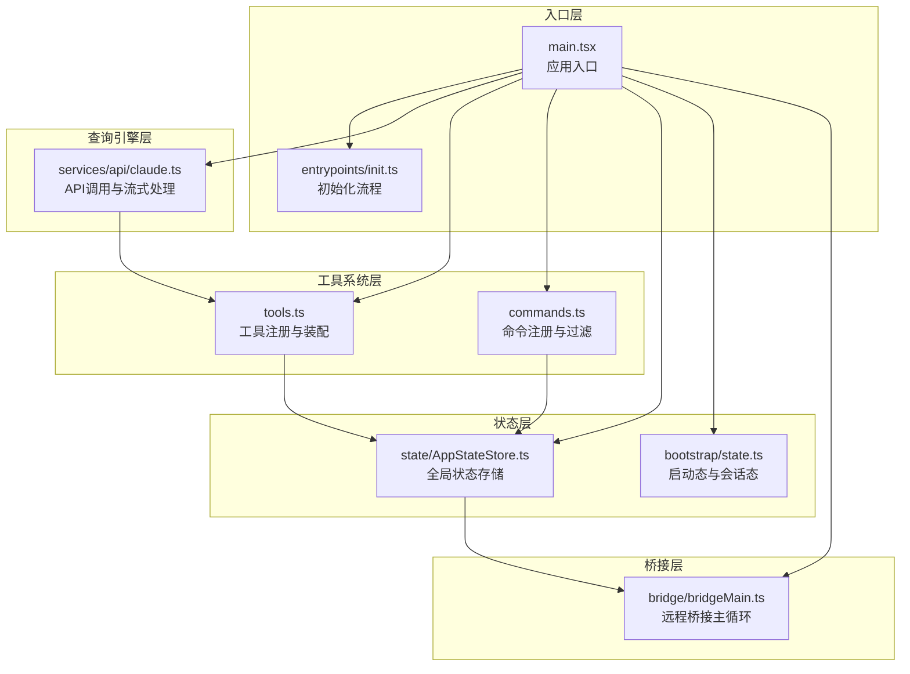
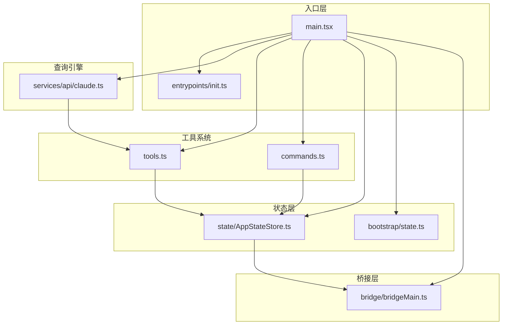
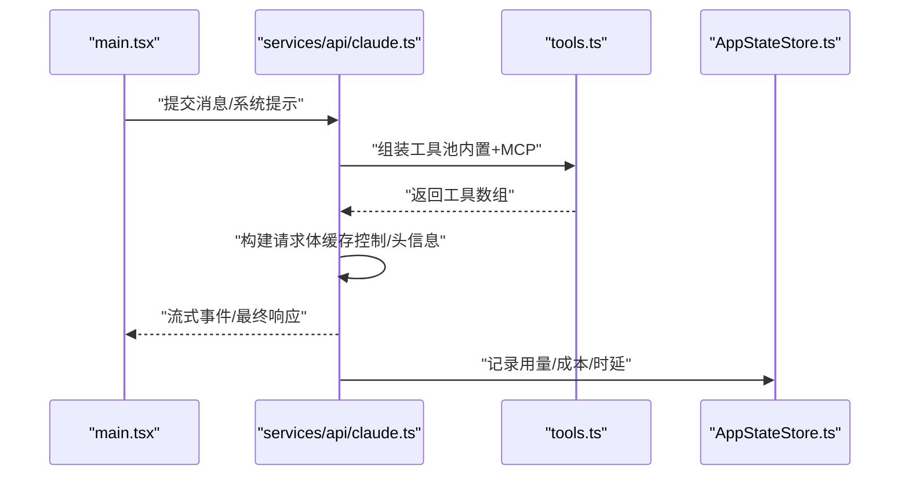
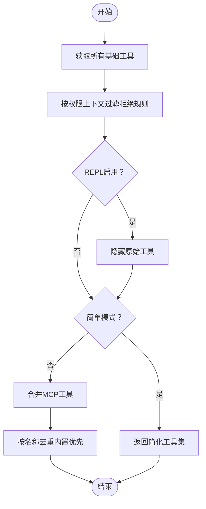
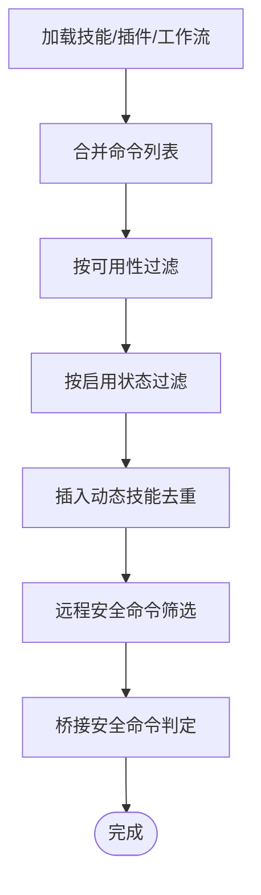
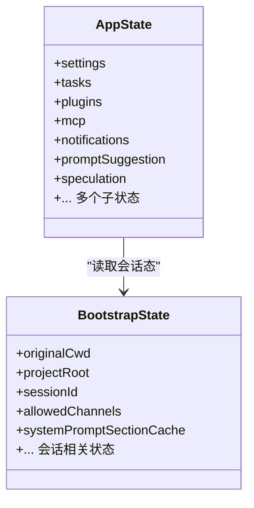
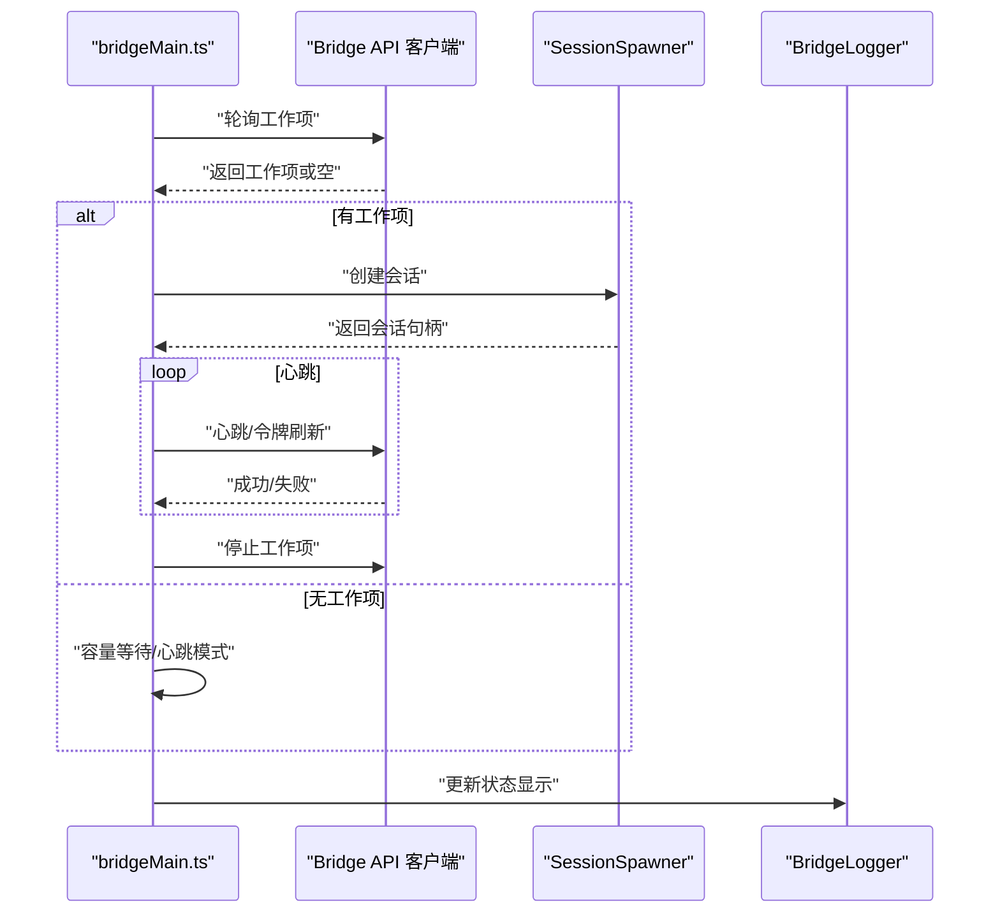
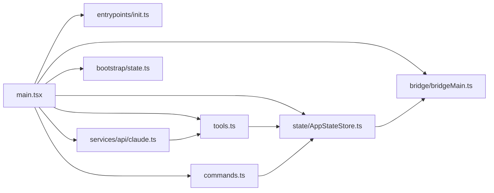

# 模块化设计原则

<cite>
**本文档引用的文件**
- [README.md](file://README.md)
- [package.json](file://package.json)
- [src/main.tsx](file://src/main.tsx)
- [src/bootstrap/state.ts](file://src/bootstrap/state.ts)
- [src/entrypoints/init.ts](file://src/entrypoints/init.ts)
- [src/commands.ts](file://src/commands.ts)
- [src/tools.ts](file://src/tools.ts)
- [src/services/api/claude.ts](file://src/services/api/claude.ts)
- [src/state/AppStateStore.ts](file://src/state/AppStateStore.ts)
- [src/bridge/bridgeMain.ts](file://src/bridge/bridgeMain.ts)
</cite>

## 目录
1. [引言](#引言)
2. [项目结构](#项目结构)
3. [核心组件](#核心组件)
4. [架构总览](#架构总览)
5. [详细组件分析](#详细组件分析)
6. [依赖关系分析](#依赖关系分析)
7. [性能考量](#性能考量)
8. [故障排除指南](#故障排除指南)
9. [结论](#结论)
10. [附录](#附录)

## 引言

本文件系统性梳理 Claude Code 的模块化设计原则与实现方式，围绕单一职责、高内聚低耦合、接口隔离与依赖倒置四大原则展开，结合源码中的模块组织策略（功能模块、基础设施模块、技术支撑模块）与模块间依赖管理（循环依赖规避、模块边界定义、接口设计），总结模块化带来的代码复用、团队协作效率提升与系统可维护性增强等收益，并提供可操作的最佳实践。

## 项目结构

该项目采用“按层+按功能域”的混合组织方式：入口层、查询引擎层、工具系统层、服务层、状态层、桥接层等，同时在各层内进一步细分功能域（命令、工具、服务、组件等）。这种组织方式既保证了高层职责清晰，又便于在具体功能域内实现高内聚。

**图表来源**
- [src/main.tsx:585-800](file://src/main.tsx#L585-L800)
- [src/entrypoints/init.ts:1-341](file://src/entrypoints/init.ts#L1-L341)
- [src/services/api/claude.ts:1-200](file://src/services/api/claude.ts#L1-L200)
- [src/tools.ts:1-200](file://src/tools.ts#L1-L200)
- [src/commands.ts:1-200](file://src/commands.ts#L1-L200)
- [src/state/AppStateStore.ts:1-200](file://src/state/AppStateStore.ts#L1-L200)
- [src/bootstrap/state.ts:1-200](file://src/bootstrap/state.ts#L1-L200)
- [src/bridge/bridgeMain.ts:1-200](file://src/bridge/bridgeMain.ts#L1-L200)

**章节来源**
- [README.md:250-380](file://README.md#L250-L380)
- [package.json:1-21](file://package.json#L1-L21)

## 核心组件

- 应用入口与初始化
  - main.tsx：负责解析参数、加载配置、建立信任后初始化遥测、预取资源、渲染 REPL 或 SDK 入口。
  - entrypoints/init.ts：集中执行配置启用、环境变量应用、代理/证书、上游代理、LSP 管理器清理、遥测初始化等。
- 查询引擎与API层
  - services/api/claude.ts：封装 Claude API 客户端、消息归一化、缓存控制、重试机制、工具权限上下文、流式事件处理。
- 工具与命令系统
  - tools.ts：内置工具清单、条件工具（基于 feature/环境变量）、工具池装配、去重与排序、权限规则过滤。
  - commands.ts：命令注册、可用性过滤、远程安全命令白名单、动态技能命令合并。
- 状态与启动态
  - state/AppStateStore.ts：全局应用状态（设置、任务、插件、MCP、通知、提示建议、推测状态等）。
  - bootstrap/state.ts：启动态与会话态（路径、计数器、指标、会话ID、通道白名单、提示缓存开关等）。
- 桥接层
  - bridge/bridgeMain.ts：远程桥接主循环（心跳、会话管理、容量唤醒、令牌刷新、错误回退、日志输出）。

**章节来源**
- [src/main.tsx:585-800](file://src/main.tsx#L585-L800)
- [src/entrypoints/init.ts:1-341](file://src/entrypoints/init.ts#L1-L341)
- [src/services/api/claude.ts:1-200](file://src/services/api/claude.ts#L1-L200)
- [src/tools.ts:1-200](file://src/tools.ts#L1-L200)
- [src/commands.ts:1-200](file://src/commands.ts#L1-L200)
- [src/state/AppStateStore.ts:1-200](file://src/state/AppStateStore.ts#L1-L200)
- [src/bootstrap/state.ts:1-200](file://src/bootstrap/state.ts#L1-L200)
- [src/bridge/bridgeMain.ts:1-200](file://src/bridge/bridgeMain.ts#L1-L200)

## 架构总览

整体采用“入口 → 查询引擎 → 工具/服务/状态”的分层架构，配合桥接层实现远程能力扩展。查询引擎通过 API 层与 Claude 交互，工具系统负责执行具体动作，服务层提供业务能力（如 MCP、分析、设置同步等），状态层统一承载应用状态与会话信息。

**图表来源**
- [src/main.tsx:585-800](file://src/main.tsx#L585-L800)
- [src/services/api/claude.ts:1-200](file://src/services/api/claude.ts#L1-L200)
- [src/tools.ts:1-200](file://src/tools.ts#L1-L200)
- [src/commands.ts:1-200](file://src/commands.ts#L1-L200)
- [src/state/AppStateStore.ts:1-200](file://src/state/AppStateStore.ts#L1-L200)
- [src/bootstrap/state.ts:1-200](file://src/bootstrap/state.ts#L1-L200)
- [src/bridge/bridgeMain.ts:1-200](file://src/bridge/bridgeMain.ts#L1-L200)

## 详细组件分析

### 组件A：查询引擎与API层（services/api/claude.ts）

- 单一职责
  - 封装 Claude API 客户端调用、消息归一化、缓存控制、重试策略、工具权限上下文、流式事件处理。
- 高内聚低耦合
  - 与工具系统解耦：通过工具池装配与权限上下文传递，不直接依赖具体工具实现。
  - 与状态层弱耦合：仅读取会话态与引导态，不持有全局状态。
- 接口隔离
  - 对外暴露 queryModelWithStreaming/queryModelWithoutStreaming 等明确接口，屏蔽底层细节。
- 依赖倒置
  - 通过工具池装配与 MCP 工具合并，向上游只暴露统一工具集合。

**图表来源**
- [src/services/api/claude.ts:709-800](file://src/services/api/claude.ts#L709-L800)
- [src/tools.ts:345-390](file://src/tools.ts#L345-L390)
- [src/state/AppStateStore.ts:1-200](file://src/state/AppStateStore.ts#L1-L200)

**章节来源**
- [src/services/api/claude.ts:1-800](file://src/services/api/claude.ts#L1-L800)

### 组件B：工具系统（tools.ts）

- 单一职责
  - 提供工具注册、条件工具装配、工具池去重与排序、权限规则过滤。
- 高内聚低耦合
  - 内置工具与 MCP 工具分离装配，通过统一接口合并，降低耦合度。
- 接口隔离
  - 对外提供 getTools/assembleToolPool/getMergedTools 等清晰接口。
- 依赖倒置
  - 通过权限上下文与 deny 规则过滤，向上游屏蔽底层工具实现细节。

**图表来源**
- [src/tools.ts:271-390](file://src/tools.ts#L271-L390)

**章节来源**
- [src/tools.ts:1-390](file://src/tools.ts#L1-L390)

### 组件C：命令系统（commands.ts）

- 单一职责
  - 命令注册、可用性过滤、远程安全命令白名单、动态技能命令合并。
- 高内聚低耦合
  - 动态技能与插件技能异步加载，memoize 缓存避免重复 I/O。
- 接口隔离
  - 对外提供 getCommands/filterCommandsForRemoteMode/isBridgeSafeCommand 等接口。
- 依赖倒置
  - 通过 availability 与 isEnabled 抽象，屏蔽底层实现细节。

**图表来源**
- [src/commands.ts:449-517](file://src/commands.ts#L449-L517)

**章节来源**
- [src/commands.ts:1-755](file://src/commands.ts#L1-L755)

### 组件D：状态层（AppStateStore.ts 与 bootstrap/state.ts）

- 单一职责
  - AppStateStore.ts：统一应用状态（设置、任务、插件、MCP、通知、提示建议、推测状态等）。
  - bootstrap/state.ts：启动态与会话态（路径、计数器、指标、会话ID、通道白名单、提示缓存开关等）。
- 高内聚低耦合
  - AppStateStore.ts 作为全局状态容器，其他模块通过 hooks/store 访问，避免直接耦合。
- 接口隔离
  - 通过 getter/setter 与信号（signals）暴露状态变更，接口稳定。
- 依赖倒置
  - 各模块只依赖状态接口，不依赖具体实现细节。

**图表来源**
- [src/state/AppStateStore.ts:89-452](file://src/state/AppStateStore.ts#L89-L452)
- [src/bootstrap/state.ts:45-257](file://src/bootstrap/state.ts#L45-L257)

**章节来源**
- [src/state/AppStateStore.ts:1-570](file://src/state/AppStateStore.ts#L1-L570)
- [src/bootstrap/state.ts:1-800](file://src/bootstrap/state.ts#L1-L800)

### 组件E：桥接层（bridge/bridgeMain.ts）

- 单一职责
  - 远程桥接主循环：心跳、会话管理、容量唤醒、令牌刷新、错误回退、日志输出。
- 高内聚低耦合
  - 通过配置与回调抽象，与上层应用解耦。
- 接口隔离
  - 对外暴露 runBridgeLoop 等接口，屏蔽内部细节。
- 依赖倒置
  - 通过 API 客户端与会话运行器抽象，向上层只暴露必要接口。

**图表来源**
- [src/bridge/bridgeMain.ts:141-800](file://src/bridge/bridgeMain.ts#L141-L800)

**章节来源**
- [src/bridge/bridgeMain.ts:1-800](file://src/bridge/bridgeMain.ts#L1-L800)

## 依赖关系分析

- 模块边界与职责
  - 入口层（main.tsx/entrypoints/init.ts）负责启动与初始化，不直接参与业务逻辑。
  - 查询引擎层（services/api/claude.ts）负责与 Claude API 交互，工具系统与命令系统通过接口注入。
  - 工具系统（tools.ts）与命令系统（commands.ts）通过状态层（AppStateStore.ts）共享状态。
  - 桥接层（bridge/bridgeMain.ts）独立于业务逻辑，仅通过 API 与会话运行器交互。
- 循环依赖规避
  - 使用延迟 require（如 main.tsx 中对 teammate 相关模块的动态 require）避免循环导入。
  - 状态层通过接口与信号（signals）解耦，避免双向引用。
- 接口设计
  - 工具系统与命令系统均提供统一接口（如 getTools/assembleToolPool、getCommands），便于替换与扩展。
  - API 层通过选项对象（Options）聚合参数，减少方法签名复杂度。

**图表来源**
- [src/main.tsx:68-95](file://src/main.tsx#L68-L95)
- [src/entrypoints/init.ts:1-100](file://src/entrypoints/init.ts#L1-L100)
- [src/services/api/claude.ts:1-120](file://src/services/api/claude.ts#L1-L120)
- [src/tools.ts:1-120](file://src/tools.ts#L1-L120)
- [src/commands.ts:1-120](file://src/commands.ts#L1-L120)
- [src/state/AppStateStore.ts:1-120](file://src/state/AppStateStore.ts#L1-L120)
- [src/bootstrap/state.ts:1-120](file://src/bootstrap/state.ts#L1-L120)
- [src/bridge/bridgeMain.ts:1-120](file://src/bridge/bridgeMain.ts#L1-L120)

**章节来源**
- [src/main.tsx:68-95](file://src/main.tsx#L68-L95)
- [src/state/AppStateStore.ts:1-120](file://src/state/AppStateStore.ts#L1-L120)
- [src/bootstrap/state.ts:1-120](file://src/bootstrap/state.ts#L1-L120)

## 性能考量

- 启动阶段优化
  - main.tsx 中对部分模块进行延迟 require，避免在启动热路径上加载重型模块。
  - 初始化流程（entrypoints/init.ts）将网络与证书配置前置，减少后续阻塞。
- 并发与批处理
  - 工具系统支持并发安全工具并行执行，降低整体时延。
- 缓存与提示缓存
  - API 层支持提示缓存控制与 TTL 策略，结合状态层的 prompt cache 开关，平衡命中率与一致性。
- 资源预取
  - 启动完成后进行非关键资源的异步预取，避免阻塞首屏渲染。

[本节为通用指导，无需特定文件引用]

## 故障排除指南

- 遥测与诊断
  - 初始化阶段记录关键时间点（profileCheckpoint），便于定位启动瓶颈。
  - 通过日志与诊断输出（diagLogs）收集问题线索。
- 错误处理
  - API 层使用 withRetry 包装请求，区分可重试与不可重试错误，避免无限重试。
  - 桥接层对认证失败与致命错误进行分类处理，触发重新连接或终止。
- 权限与规则
  - 工具系统通过 deny 规则与权限上下文过滤，避免危险工具被调用。
  - 命令系统提供远程安全命令白名单，限制远程输入命令范围。

**章节来源**
- [src/entrypoints/init.ts:57-238](file://src/entrypoints/init.ts#L57-L238)
- [src/services/api/claude.ts:252-257](file://src/services/api/claude.ts#L252-L257)
- [src/bridge/bridgeMain.ts:202-270](file://src/bridge/bridgeMain.ts#L202-L270)
- [src/tools.ts:262-269](file://src/tools.ts#L262-L269)
- [src/commands.ts:619-686](file://src/commands.ts#L619-L686)

## 结论

该代码库通过清晰的分层与模块化设计，实现了单一职责、高内聚低耦合、接口隔离与依赖倒置的工程化目标。入口层负责启动与初始化，查询引擎层专注 API 交互，工具与命令系统通过统一接口与状态层协作，桥接层独立扩展远程能力。模块化带来的收益包括：代码复用性强、团队协作效率提升、系统可维护性增强。建议在新功能开发中遵循现有接口与抽象，保持模块边界清晰，避免循环依赖，持续优化启动与运行时性能。

[本节为总结性内容，无需特定文件引用]

## 附录

- 实际模块示例
  - 查询引擎：services/api/claude.ts
  - 工具系统：tools.ts
  - 命令系统：commands.ts
  - 状态层：state/AppStateStore.ts、bootstrap/state.ts
  - 桥接层：bridge/bridgeMain.ts
- 最佳实践
  - 使用延迟 require 避免启动热路径阻塞
  - 通过统一接口（getTools/assembleToolPool、getCommands）装配与访问能力
  - 利用 memoize 缓存昂贵计算结果
  - 严格区分可重试与不可重试错误，合理设置超时与回退策略
  - 保持模块边界清晰，避免循环依赖

[本节为补充说明，无需特定文件引用]