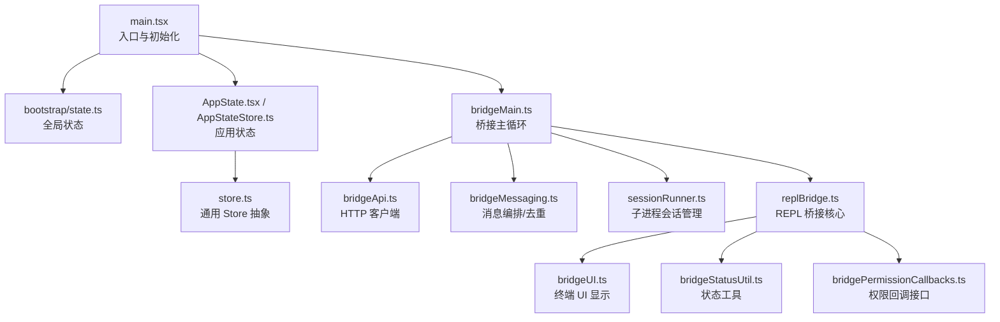
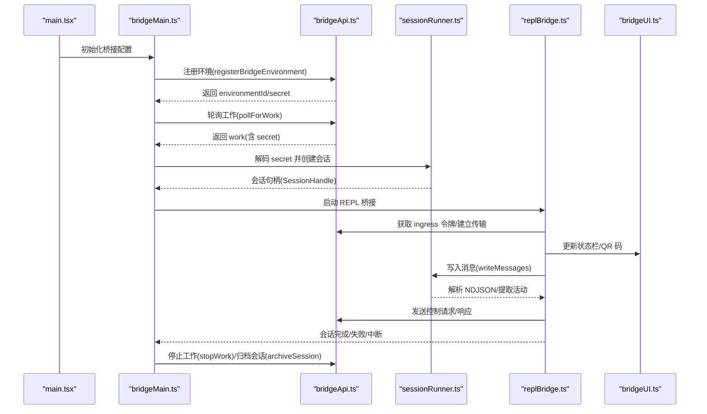
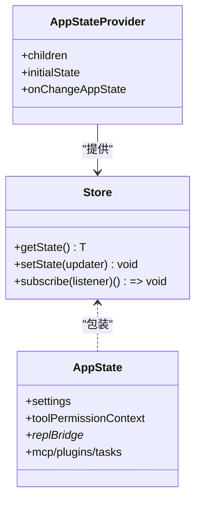
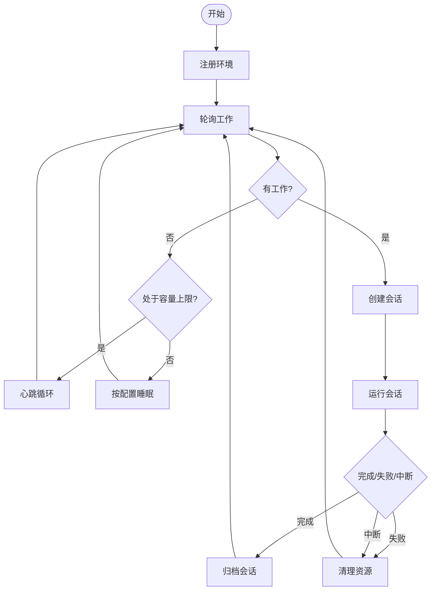
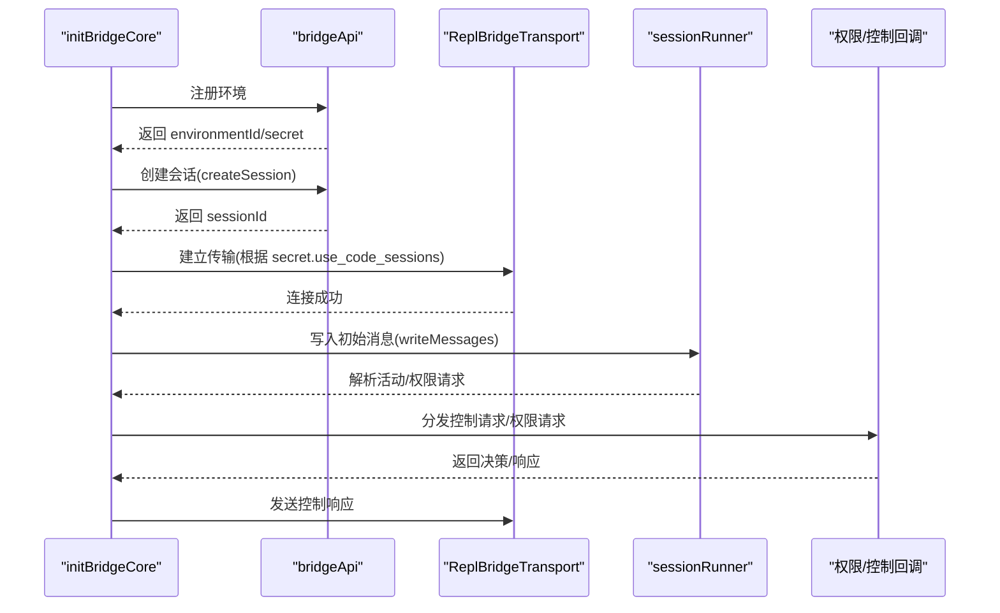
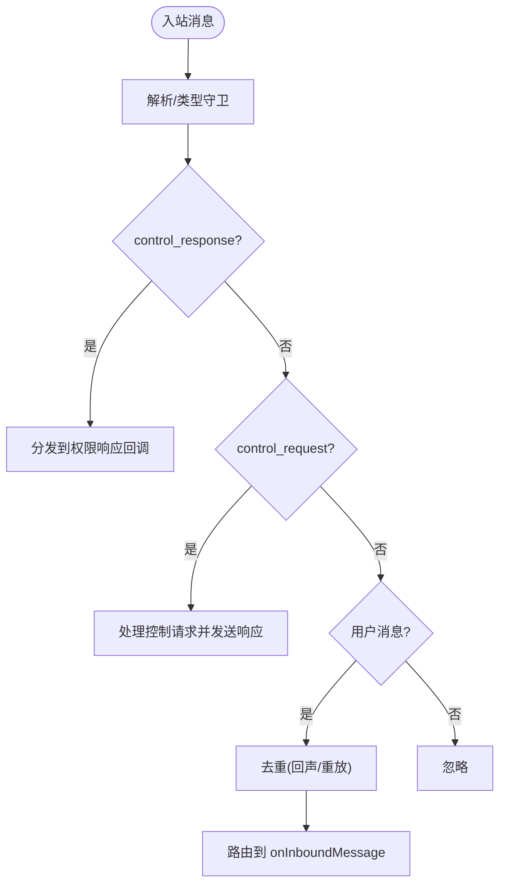
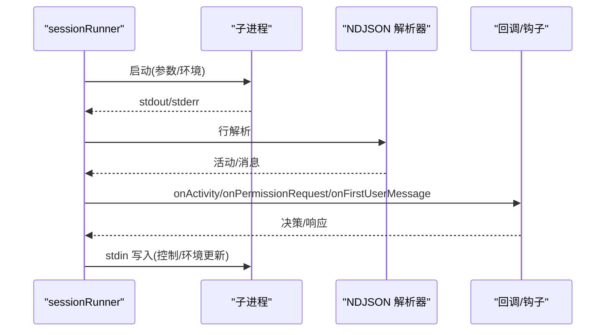
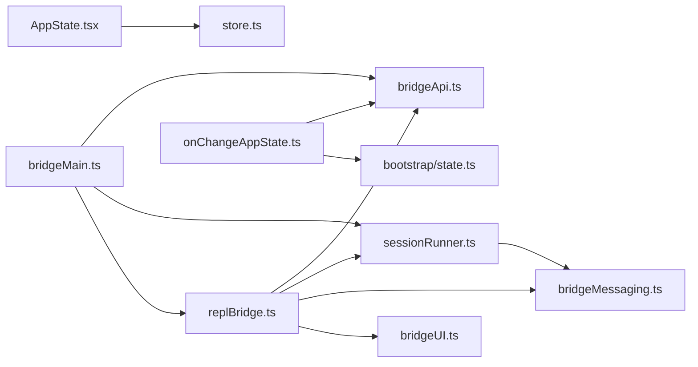

# 组件交互机制

<cite>
**本文档引用的文件**
- [src/main.tsx](file://src/main.tsx)
- [src/bootstrap/state.ts](file://src/bootstrap/state.ts)
- [src/state/AppState.tsx](file://src/state/AppState.tsx)
- [src/state/AppStateStore.ts](file://src/state/AppStateStore.ts)
- [src/state/store.ts](file://src/state/store.ts)
- [src/state/onChangeAppState.ts](file://src/state/onChangeAppState.ts)
- [src/bridge/bridgeMain.ts](file://src/bridge/bridgeMain.ts)
- [src/bridge/bridgeApi.ts](file://src/bridge/bridgeApi.ts)
- [src/bridge/bridgeMessaging.ts](file://src/bridge/bridgeMessaging.ts)
- [src/bridge/bridgePermissionCallbacks.ts](file://src/bridge/bridgePermissionCallbacks.ts)
- [src/bridge/bridgeStatusUtil.ts](file://src/bridge/bridgeStatusUtil.ts)
- [src/bridge/bridgeUI.ts](file://src/bridge/bridgeUI.ts)
- [src/bridge/sessionRunner.ts](file://src/bridge/sessionRunner.ts)
- [src/bridge/replBridge.ts](file://src/bridge/replBridge.ts)
</cite>

## 目录
1. [引言](#引言)
2. [项目结构](#项目结构)
3. [核心组件](#核心组件)
4. [架构总览](#架构总览)
5. [详细组件分析](#详细组件分析)
6. [依赖关系分析](#依赖关系分析)
7. [性能考虑](#性能考虑)
8. [故障排查指南](#故障排查指南)
9. [结论](#结论)

## 引言
本文件系统性梳理 Claude Code 的组件交互机制，聚焦以下主题：
- 事件驱动通信：桥接器与 REPL 的消息编排、权限请求/响应、控制请求/响应
- 消息传递机制：WebSocket/SSE 入口、NDJSON 流、回声去重与重放防护
- 回调函数模式：状态变更监听、权限决策回调、桥接器生命周期回调
- 状态共享机制：全局状态（bootstrap/state）、局部状态（AppState/Store）与状态同步策略
- 生命周期管理：初始化顺序、依赖注入、资源清理与优雅退出
- 错误传播与异常处理：致命错误、降级策略、恢复机制
- 最佳实践：性能优化、内存管理、并发控制

## 项目结构
项目采用分层架构：
- 入口与启动：main.tsx 负责初始化、设置入口点、加载配置与特性门控
- 状态层：bootstrap/state 提供进程级全局状态；AppState/Store 提供 React 可订阅的应用状态
- 桥接层：bridgeMain、bridgeApi、bridgeMessaging、replBridge、sessionRunner 实现远程桥接与会话管理
- UI 层：bridgeUI 提供终端状态显示与 QR 码等可视化

图表来源
- [src/main.tsx:585-800](file://src/main.tsx#L585-L800)
- [src/bootstrap/state.ts:43-120](file://src/bootstrap/state.ts#L43-L120)
- [src/state/AppState.tsx:27-110](file://src/state/AppState.tsx#L27-L110)
- [src/state/AppStateStore.ts:89-180](file://src/state/AppStateStore.ts#L89-L180)
- [src/state/store.ts:10-35](file://src/state/store.ts#L10-L35)
- [src/bridge/bridgeMain.ts:141-200](file://src/bridge/bridgeMain.ts#L141-L200)
- [src/bridge/bridgeApi.ts:68-140](file://src/bridge/bridgeApi.ts#L68-L140)
- [src/bridge/bridgeMessaging.ts:132-208](file://src/bridge/bridgeMessaging.ts#L132-L208)
- [src/bridge/sessionRunner.ts:248-548](file://src/bridge/sessionRunner.ts#L248-L548)
- [src/bridge/replBridge.ts:260-340](file://src/bridge/replBridge.ts#L260-L340)
- [src/bridge/bridgeUI.ts:294-320](file://src/bridge/bridgeUI.ts#L294-L320)
- [src/bridge/bridgeStatusUtil.ts:9-31](file://src/bridge/bridgeStatusUtil.ts#L9-L31)
- [src/bridge/bridgePermissionCallbacks.ts:10-27](file://src/bridge/bridgePermissionCallbacks.ts#L10-L27)

章节来源
- [src/main.tsx:585-800](file://src/main.tsx#L585-L800)
- [src/bootstrap/state.ts:43-120](file://src/bootstrap/state.ts#L43-L120)
- [src/state/AppState.tsx:27-110](file://src/state/AppState.tsx#L27-L110)
- [src/state/AppStateStore.ts:89-180](file://src/state/AppStateStore.ts#L89-L180)
- [src/state/store.ts:10-35](file://src/state/store.ts#L10-L35)

## 核心组件
- 全局状态（bootstrap/state）
  - 进程级状态容器，包含会话 ID、计数器、指标、运行时元数据、通道与提示缓存等
  - 提供原子切换会话、持久化统计、时间戳刷新等能力
- 应用状态（AppState/Store）
  - 基于通用 Store 抽象，提供 getState/setState/subscribe
  - AppStateProvider 将状态注入 React 上下文，支持选择性订阅与设置
  - onChangeAppState 在状态变更时触发外部元数据同步与配置持久化
- 桥接器（bridgeMain/replBridge/bridgeApi）
  - bridgeMain：环境注册、工作轮询、心跳、会话生命周期管理
  - replBridge：REPL 桥接核心，负责环境重建、传输切换、消息写入与控制请求处理
  - bridgeApi：统一的 HTTP 客户端封装，含认证重试、错误分类与致命错误抛出
- 会话运行器（sessionRunner）
  - 子进程会话管理，解析 NDJSON 输出、提取活动轨迹、处理权限请求与首次用户消息
- 消息编排（bridgeMessaging）
  - 解析入站消息、去重（回声与重放）、路由到回调、处理服务器控制请求
- UI（bridgeUI/bridgeStatusUtil）
  - 终端状态栏渲染、QR 码生成、连接状态与会话活动展示

章节来源
- [src/bootstrap/state.ts:43-120](file://src/bootstrap/state.ts#L43-L120)
- [src/state/AppState.tsx:27-110](file://src/state/AppState.tsx#L27-L110)
- [src/state/store.ts:10-35](file://src/state/store.ts#L10-L35)
- [src/state/onChangeAppState.ts:43-92](file://src/state/onChangeAppState.ts#L43-L92)
- [src/bridge/bridgeMain.ts:141-200](file://src/bridge/bridgeMain.ts#L141-L200)
- [src/bridge/replBridge.ts:260-340](file://src/bridge/replBridge.ts#L260-L340)
- [src/bridge/bridgeApi.ts:68-140](file://src/bridge/bridgeApi.ts#L68-L140)
- [src/bridge/sessionRunner.ts:248-548](file://src/bridge/sessionRunner.ts#L248-L548)
- [src/bridge/bridgeMessaging.ts:132-208](file://src/bridge/bridgeMessaging.ts#L132-L208)
- [src/bridge/bridgeUI.ts:294-320](file://src/bridge/bridgeUI.ts#L294-L320)
- [src/bridge/bridgeStatusUtil.ts:9-31](file://src/bridge/bridgeStatusUtil.ts#L9-L31)

## 架构总览
Claude Code 的组件交互以“桥接器-会话-REPL”为主线，结合“全局状态-应用状态”的双层状态体系实现事件驱动与消息编排。

图表来源
- [src/main.tsx:585-800](file://src/main.tsx#L585-L800)
- [src/bridge/bridgeMain.ts:141-200](file://src/bridge/bridgeMain.ts#L141-L200)
- [src/bridge/bridgeApi.ts:141-197](file://src/bridge/bridgeApi.ts#L141-L197)
- [src/bridge/sessionRunner.ts:248-548](file://src/bridge/sessionRunner.ts#L248-L548)
- [src/bridge/replBridge.ts:260-340](file://src/bridge/replBridge.ts#L260-L340)
- [src/bridge/bridgeUI.ts:294-320](file://src/bridge/bridgeUI.ts#L294-L320)

## 详细组件分析

### 全局状态与应用状态
- 全局状态（bootstrap/state）
  - 提供会话切换、统计计数、时间戳刷新、令牌与指标等进程级信息
  - 通过 createSignal 订阅会话切换事件，用于跨模块同步
- 应用状态（AppState/Store）
  - Store 抽象提供不可变更新与订阅通知
  - AppStateProvider 将状态注入上下文，useAppState/useSetAppState 支持 React 组件订阅与更新
  - onChangeAppState 在模式变化时同步外部元数据与持久化设置

图表来源
- [src/state/store.ts:10-35](file://src/state/store.ts#L10-L35)
- [src/state/AppStateStore.ts:89-180](file://src/state/AppStateStore.ts#L89-L180)
- [src/state/AppState.tsx:27-110](file://src/state/AppState.tsx#L27-L110)

章节来源
- [src/bootstrap/state.ts:43-120](file://src/bootstrap/state.ts#L43-L120)
- [src/state/store.ts:10-35](file://src/state/store.ts#L10-L35)
- [src/state/AppState.tsx:27-110](file://src/state/AppState.tsx#L27-L110)
- [src/state/AppStateStore.ts:89-180](file://src/state/AppStateStore.ts#L89-L180)
- [src/state/onChangeAppState.ts:43-92](file://src/state/onChangeAppState.ts#L43-L92)

### 桥接器主循环（bridgeMain）
- 环境注册与会话创建：通过 bridgeApi 完成环境注册与会话创建
- 工作轮询与心跳：根据配置周期性轮询工作项，维护会话令牌与活动轨迹
- 会话生命周期：处理完成、失败、中断，清理资源并可选归档
- 多会话模式：在多会话模式下维持状态显示与容量唤醒

图表来源
- [src/bridge/bridgeMain.ts:141-200](file://src/bridge/bridgeMain.ts#L141-L200)
- [src/bridge/bridgeApi.ts:199-247](file://src/bridge/bridgeApi.ts#L199-L247)

章节来源
- [src/bridge/bridgeMain.ts:141-200](file://src/bridge/bridgeMain.ts#L141-L200)
- [src/bridge/bridgeApi.ts:199-247](file://src/bridge/bridgeApi.ts#L199-L247)

### REPL 桥接核心（replBridge）
- 环境重建与会话复用：支持崩溃恢复指针与“原地重连”
- 传输适配：HybridTransport（v1）与 SSETransport（v2）自动切换
- 初始历史回放：通过 FlushGate 控制初始消息写入顺序
- 权限与控制：处理服务器下发的控制请求，调用回调进行权限决策

图表来源
- [src/bridge/replBridge.ts:260-340](file://src/bridge/replBridge.ts#L260-L340)
- [src/bridge/bridgeApi.ts:141-197](file://src/bridge/bridgeApi.ts#L141-L197)
- [src/bridge/sessionRunner.ts:248-548](file://src/bridge/sessionRunner.ts#L248-L548)
- [src/bridge/bridgeMessaging.ts:243-391](file://src/bridge/bridgeMessaging.ts#L243-L391)

章节来源
- [src/bridge/replBridge.ts:260-340](file://src/bridge/replBridge.ts#L260-L340)
- [src/bridge/sessionRunner.ts:248-548](file://src/bridge/sessionRunner.ts#L248-L548)
- [src/bridge/bridgeMessaging.ts:243-391](file://src/bridge/bridgeMessaging.ts#L243-L391)

### 消息编排与权限回调（bridgeMessaging/bridgePermissionCallbacks）
- 入站消息处理：解析 SDKMessage，过滤非用户消息，去重回声与重放
- 控制请求处理：对服务器下发的 control_request 进行快速响应，避免超时
- 权限回调接口：定义请求/响应格式与类型守卫，支持取消未决请求

图表来源
- [src/bridge/bridgeMessaging.ts:132-208](file://src/bridge/bridgeMessaging.ts#L132-L208)
- [src/bridge/bridgePermissionCallbacks.ts:10-27](file://src/bridge/bridgePermissionCallbacks.ts#L10-L27)

章节来源
- [src/bridge/bridgeMessaging.ts:132-208](file://src/bridge/bridgeMessaging.ts#L132-L208)
- [src/bridge/bridgePermissionCallbacks.ts:10-27](file://src/bridge/bridgePermissionCallbacks.ts#L10-L27)

### 会话运行器（sessionRunner）
- 子进程管理：构建参数、环境变量、标准流管道
- NDJSON 解析：提取工具使用、文本、结果等活动，记录最近活动与错误
- 权限请求转发：检测 can_use_tool 请求并通过回调上报
- 首次用户消息：从 replayed 用户消息中提取标题文本

图表来源
- [src/bridge/sessionRunner.ts:248-548](file://src/bridge/sessionRunner.ts#L248-L548)

章节来源
- [src/bridge/sessionRunner.ts:248-548](file://src/bridge/sessionRunner.ts#L248-L548)

### UI 与状态工具（bridgeUI/bridgeStatusUtil）
- 状态栏渲染：连接中/已连接/重连中/失败状态切换，支持 QR 码与会话列表
- 工具活动展示：保留最近工具活动并在过期后清除
- 状态工具：格式化持续时间、截断文本、计算闪烁动画索引

章节来源
- [src/bridge/bridgeUI.ts:294-320](file://src/bridge/bridgeUI.ts#L294-L320)
- [src/bridge/bridgeStatusUtil.ts:9-31](file://src/bridge/bridgeStatusUtil.ts#L9-L31)

## 依赖关系分析
- 组件耦合
  - bridgeMain 依赖 bridgeApi、sessionRunner、replBridge、bridgeUI
  - replBridge 依赖 bridgeApi、sessionRunner、bridgeMessaging、bridgeUI
  - sessionRunner 依赖 bridgeMessaging 的消息解析与去重
  - AppStateProvider 依赖 store.ts 的 Store 抽象
- 状态同步
  - onChangeAppState 将权限模式与元数据同步至外部系统
  - bootstrap/state 通过信号订阅会话切换，确保跨模块一致性
- 外部依赖
  - HTTP 客户端封装（axios），统一错误分类与致命错误抛出
  - 子进程通信（stdin/stdout/stderr），NDJSON 协议

图表来源
- [src/bridge/bridgeMain.ts:141-200](file://src/bridge/bridgeMain.ts#L141-L200)
- [src/bridge/replBridge.ts:260-340](file://src/bridge/replBridge.ts#L260-L340)
- [src/bridge/bridgeApi.ts:68-140](file://src/bridge/bridgeApi.ts#L68-L140)
- [src/bridge/sessionRunner.ts:248-548](file://src/bridge/sessionRunner.ts#L248-L548)
- [src/bridge/bridgeMessaging.ts:132-208](file://src/bridge/bridgeMessaging.ts#L132-L208)
- [src/bridge/bridgeUI.ts:294-320](file://src/bridge/bridgeUI.ts#L294-L320)
- [src/state/AppState.tsx:27-110](file://src/state/AppState.tsx#L27-L110)
- [src/state/store.ts:10-35](file://src/state/store.ts#L10-L35)
- [src/state/onChangeAppState.ts:43-92](file://src/state/onChangeAppState.ts#L43-L92)
- [src/bootstrap/state.ts:43-120](file://src/bootstrap/state.ts#L43-L120)

章节来源
- [src/bridge/bridgeMain.ts:141-200](file://src/bridge/bridgeMain.ts#L141-L200)
- [src/bridge/replBridge.ts:260-340](file://src/bridge/replBridge.ts#L260-L340)
- [src/bridge/bridgeApi.ts:68-140](file://src/bridge/bridgeApi.ts#L68-L140)
- [src/bridge/sessionRunner.ts:248-548](file://src/bridge/sessionRunner.ts#L248-L548)
- [src/bridge/bridgeMessaging.ts:132-208](file://src/bridge/bridgeMessaging.ts#L132-L208)
- [src/bridge/bridgeUI.ts:294-320](file://src/bridge/bridgeUI.ts#L294-L320)
- [src/state/AppState.tsx:27-110](file://src/state/AppState.tsx#L27-L110)
- [src/state/store.ts:10-35](file://src/state/store.ts#L10-L35)
- [src/state/onChangeAppState.ts:43-92](file://src/state/onChangeAppState.ts#L43-L92)
- [src/bootstrap/state.ts:43-120](file://src/bootstrap/state.ts#L43-L120)

## 性能考虑
- 启动阶段延迟：main.tsx 中对部分异步预取进行条件调度，避免阻塞首帧渲染
- 轮询与心跳：根据配置动态调整轮询间隔与心跳频率，避免空闲时过度轮询
- 去重与缓冲：BoundedUUIDSet 控制回声与重放去重窗口，限制内存占用
- 传输切换：v1/v2 传输自动切换，减少历史重放带来的带宽与 CPU 开销
- 缓冲与批处理：FlushGate 控制初始消息写入顺序，避免乱序与重复

## 故障排查指南
- 致命错误（BridgeFatalError）
  - 401/403/404/410 等状态被转换为致命错误，停止轮询并进入失败状态
  - isSuppressible403 用于区分可抑制的权限错误
- 重连与恢复
  - 环境丢失时尝试“原地重连”，否则归档旧会话并创建新会话
  - 崩溃恢复指针支持在相同目录继续桥接
- 日志与诊断
  - 详细的调试日志输出与诊断日志记录，便于定位问题
  - UI 层提供失败状态与错误信息展示

章节来源
- [src/bridge/bridgeApi.ts:454-500](file://src/bridge/bridgeApi.ts#L454-L500)
- [src/bridge/bridgeApi.ts:516-524](file://src/bridge/bridgeApi.ts#L516-L524)
- [src/bridge/replBridge.ts:605-742](file://src/bridge/replBridge.ts#L605-L742)
- [src/bridge/bridgeUI.ts:427-448](file://src/bridge/bridgeUI.ts#L427-L448)

## 结论
Claude Code 的组件交互机制通过“全局状态 + 应用状态”的双层状态体系与“桥接器-会话-REPL”的事件驱动架构，实现了高可靠的消息编排与权限控制。其关键优势在于：
- 清晰的职责分离与低耦合设计
- 完备的错误分类与恢复路径
- 高效的去重与缓冲策略
- 可观测的 UI 与诊断日志

建议在扩展新功能时遵循现有模式：优先通过状态层同步与回调接口解耦，利用去重与缓冲机制提升稳定性，并在关键路径保持可观测性与可诊断性。