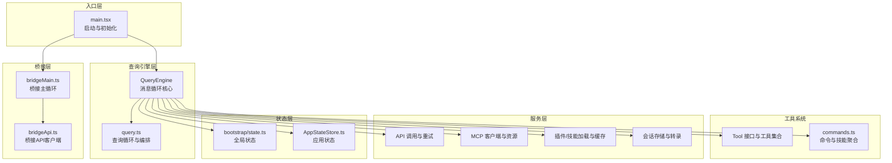
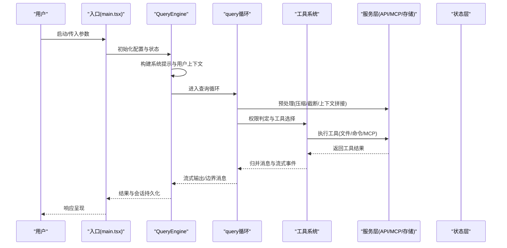
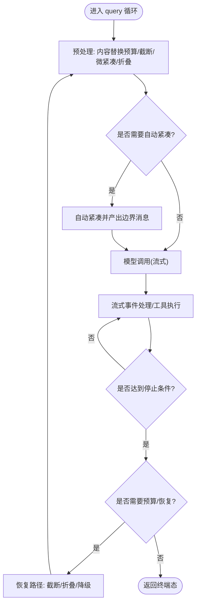
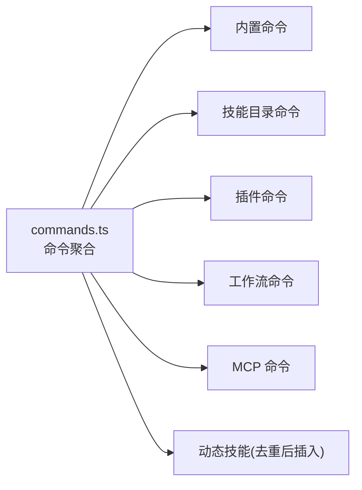
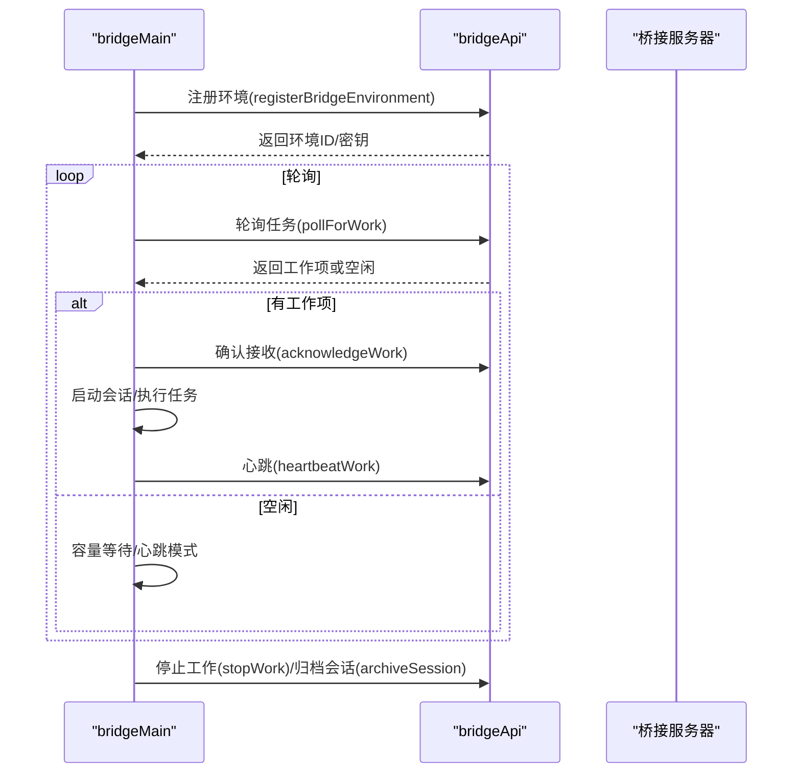
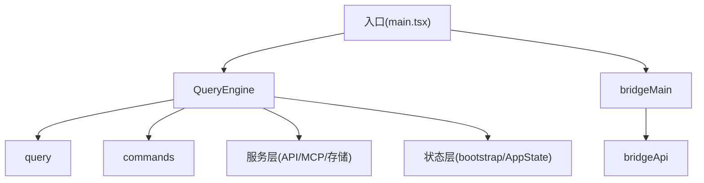

# 架构设计

<cite>
**本文引用的文件**
- [src/main.tsx](file://src/main.tsx)
- [src/QueryEngine.ts](file://src/QueryEngine.ts)
- [src/query.ts](file://src/query.ts)
- [src/bootstrap/state.ts](file://src/bootstrap/state.ts)
- [src/state/AppStateStore.ts](file://src/state/AppStateStore.ts)
- [src/bridge/bridgeMain.ts](file://src/bridge/bridgeMain.ts)
- [src/bridge/bridgeApi.ts](file://src/bridge/bridgeApi.ts)
- [src/commands.ts](file://src/commands.ts)
</cite>

## 目录
1. [引言](#引言)
2. [项目结构](#项目结构)
3. [核心组件](#核心组件)
4. [架构总览](#架构总览)
5. [详细组件分析](#详细组件分析)
6. [依赖分析](#依赖分析)
7. [性能考虑](#性能考虑)
8. [故障排查指南](#故障排查指南)
9. [结论](#结论)
10. [附录](#附录)

## 引言
本文件面向Claude Code的架构设计，聚焦其分层架构与消息循环核心（QueryEngine）的设计原理与实现细节。文档从入口层、查询引擎、工具系统、服务层、状态层与桥接层六个维度，系统阐述组件职责、交互方式与数据流控制流，解释从用户输入到最终响应的完整路径，并给出架构决策的技术考量、关键设计模式（观察者、工厂、策略等）、可扩展性设计（插件系统、技能系统）以及相应的架构图与组件关系图。

## 项目结构
Claude Code采用“入口层-查询引擎-工具系统-服务层-状态层-桥接层”的分层组织，配合命令系统与插件/技能扩展机制，形成可演进的模块化体系。

- 入口层：负责初始化、参数解析、特性门控、环境准备与启动序列（CLI/SDK/REPL），并触发后续工作流。
- 查询引擎：封装消息循环与对话生命周期，协调上下文构建、工具调用、权限控制、压缩与重试等。
- 工具系统：统一抽象工具接口，提供权限判定、执行器与结果归档。
- 服务层：围绕API调用、MCP集成、插件/技能加载、提示词构建、会话存储、遥测与分析等。
- 状态层：集中管理全局状态、会话状态、权限上下文、统计指标与钩子事件。
- 桥接层：远程控制桥接（桥接守护进程）负责环境注册、任务轮询、会话生命周期与错误回退。



**图表来源**
- [src/main.tsx:585-800](file://src/main.tsx#L585-L800)
- [src/QueryEngine.ts:184-212](file://src/QueryEngine.ts#L184-L212)
- [src/query.ts:219-240](file://src/query.ts#L219-L240)
- [src/bootstrap/state.ts:431-450](file://src/bootstrap/state.ts#L431-L450)
- [src/state/AppStateStore.ts:456-570](file://src/state/AppStateStore.ts#L456-L570)
- [src/bridge/bridgeMain.ts:141-152](file://src/bridge/bridgeMain.ts#L141-L152)
- [src/bridge/bridgeApi.ts:68-98](file://src/bridge/bridgeApi.ts#L68-L98)

**章节来源**
- [src/main.tsx:585-800](file://src/main.tsx#L585-L800)
- [src/bridge/bridgeMain.ts:141-152](file://src/bridge/bridgeMain.ts#L141-L152)

## 核心组件
- QueryEngine：承载一次对话的生命周期与状态，负责消息构建、权限判定、工具调度、压缩与重试、会话持久化与进度输出。
- query：查询循环的实现，负责上下文压缩（自动/微紧凑/历史截断）、模型调用、流式事件处理、停止钩子与恢复路径。
- commands：命令与技能的聚合入口，支持动态发现、插件注入与可用性过滤。
- AppStateStore：应用状态容器，统一管理设置、权限上下文、MCP/插件状态、任务与通知等。
- bootstrap/state：全局状态与会话状态，提供成本、时延、令牌用量等度量与会话切换能力。
- bridgeMain/bridgeApi：桥接守护进程与API客户端，负责环境注册、任务轮询、心跳、会话生命周期与错误处理。

**章节来源**
- [src/QueryEngine.ts:184-212](file://src/QueryEngine.ts#L184-L212)
- [src/query.ts:219-240](file://src/query.ts#L219-L240)
- [src/commands.ts:258-346](file://src/commands.ts#L258-L346)
- [src/state/AppStateStore.ts:456-570](file://src/state/AppStateStore.ts#L456-L570)
- [src/bootstrap/state.ts:431-450](file://src/bootstrap/state.ts#L431-L450)
- [src/bridge/bridgeMain.ts:141-152](file://src/bridge/bridgeMain.ts#L141-L152)
- [src/bridge/bridgeApi.ts:68-98](file://src/bridge/bridgeApi.ts#L68-L98)

## 架构总览
下图展示从用户输入到响应输出的关键路径，以及各层之间的耦合关系与数据流方向。



**图表来源**
- [src/main.tsx:585-800](file://src/main.tsx#L585-L800)
- [src/QueryEngine.ts:209-236](file://src/QueryEngine.ts#L209-L236)
- [src/query.ts:219-240](file://src/query.ts#L219-L240)

## 详细组件分析

### QueryEngine：消息循环核心
- 职责
  - 维护会话状态（消息数组、使用量、权限拒绝记录、文件缓存等）
  - 将用户输入预处理为消息，注入系统提示与用户上下文
  - 协调工具权限判定、工具执行、上下文压缩与重试
  - 通过异步生成器向SDK/REPL推送流式消息与边界事件
  - 支持历史截断（snip）、微紧凑（microcompact）、自动紧凑（autocompact）与上下文折叠（context collapse）
- 关键交互
  - 与query循环协作，驱动模型调用与工具执行
  - 与状态层交互，更新会话ID、成本与时延统计
  - 与服务层交互，获取MCP工具、插件与技能列表
- 设计要点
  - 使用可选的snipReplay回调在长会话中限制内存占用
  - 包装canUseTool以收集权限拒绝信息，便于SDK报告
  - 在每次turn开始前快照/重置预算与用量，确保成本可控

```mermaid
classDiagram
class QueryEngine {
-config : QueryEngineConfig
-mutableMessages : Message[]
-abortController : AbortController
-permissionDenials : SDKPermissionDenial[]
-totalUsage : NonNullableUsage
-readFileState : FileStateCache
+constructor(config)
+submitMessage(prompt, options) AsyncGenerator
}
class QueryParams {
+messages : Message[]
+systemPrompt : SystemPrompt
+userContext : Map
+systemContext : Map
+canUseTool : CanUseToolFn
+toolUseContext : ToolUseContext
+fallbackModel? : string
+querySource : QuerySource
+maxTurns? : number
+taskBudget? : {total : number}
}
QueryEngine --> QueryParams : "消费"
```

**图表来源**
- [src/QueryEngine.ts:130-173](file://src/QueryEngine.ts#L130-L173)
- [src/QueryEngine.ts:209-236](file://src/QueryEngine.ts#L209-L236)

**章节来源**
- [src/QueryEngine.ts:184-212](file://src/QueryEngine.ts#L184-L212)
- [src/QueryEngine.ts:209-236](file://src/QueryEngine.ts#L209-L236)
- [src/QueryEngine.ts:675-751](file://src/QueryEngine.ts#L675-L751)

### query：查询循环与编排
- 职责
  - 驱动单次查询的完整生命周期：预处理、压缩、模型调用、工具执行、流式事件与边界消息产出
  - 处理最大输出令牌恢复、媒体恢复、提示过长阻断与恢复路径
  - 管理任务预算（task_budget）与令牌预算（token budget）
- 关键流程
  - 预处理：应用内容替换预算、历史截断、微紧凑、上下文折叠
  - 自动紧凑：根据阈值触发，产出紧凑边界消息
  - 流式模型调用：按块产出事件，合并工具结果，处理停止钩子
  - 恢复路径：针对提示过长、最大输出令牌等可恢复错误进行降级或重试
- 设计要点
  - 使用状态对象在迭代间传递消息、预算、计数与过渡原因
  - 通过feature门控启用/禁用历史截断、上下文折叠、反应式紧凑等特性



**图表来源**
- [src/query.ts:241-307](file://src/query.ts#L241-L307)
- [src/query.ts:412-427](file://src/query.ts#L412-L427)
- [src/query.ts:652-708](file://src/query.ts#L652-L708)

**章节来源**
- [src/query.ts:219-240](file://src/query.ts#L219-L240)
- [src/query.ts:241-307](file://src/query.ts#L241-L307)
- [src/query.ts:652-708](file://src/query.ts#L652-L708)

### 工具系统与命令/技能聚合
- commands：统一加载与聚合命令源（内置、技能目录、插件、工作流），并提供可用性过滤与动态技能插入
- 技能系统：支持从技能目录、插件与MCP动态发现与加载，作为模型可调用的“提示型命令”
- 设计要点
  - 通过memoize缓存命令加载，避免重复磁盘I/O与动态导入开销
  - 动态技能去重并插入到合适位置，保证与插件/内置命令的层次清晰
  - 提供远程安全命令白名单，保障远端桥接场景的安全性



**图表来源**
- [src/commands.ts:258-346](file://src/commands.ts#L258-L346)
- [src/commands.ts:449-469](file://src/commands.ts#L449-L469)
- [src/commands.ts:586-608](file://src/commands.ts#L586-L608)

**章节来源**
- [src/commands.ts:258-346](file://src/commands.ts#L258-L346)
- [src/commands.ts:449-469](file://src/commands.ts#L449-L469)
- [src/commands.ts:586-608](file://src/commands.ts#L586-L608)

### 状态层：全局与应用状态
- bootstrap/state：提供会话ID、成本/时延统计、令牌用量、转录与持久化开关、计划slug缓存、提示缓存开关等
- AppStateStore：集中管理设置、权限上下文、MCP/插件状态、任务、通知、提示建议、推测状态等
- 设计要点
  - 将会话状态与全局状态分离，避免跨模块耦合
  - 提供原子性切换会话的能力，保证会话一致性
  - 通过深度不可变类型约束，减少意外修改

```mermaid
classDiagram
class BootstrapState {
+getSessionId()
+addToTotalCostState()
+getTotalCostUSD()
+sessionPersistenceDisabled : boolean
+systemPromptSectionCache : Map
}
class AppState {
+settings : SettingsJson
+toolPermissionContext : ToolPermissionContext
+mcp : {clients, tools, commands, resources}
+plugins : {enabled, disabled, commands, errors}
+tasks : Map
+notifications : {current, queue}
+promptSuggestion : {...}
}
BootstrapState <.. AppState : "被查询引擎使用"
```

**图表来源**
- [src/bootstrap/state.ts:431-450](file://src/bootstrap/state.ts#L431-L450)
- [src/bootstrap/state.ts:557-568](file://src/bootstrap/state.ts#L557-L568)
- [src/state/AppStateStore.ts:89-452](file://src/state/AppStateStore.ts#L89-L452)

**章节来源**
- [src/bootstrap/state.ts:431-450](file://src/bootstrap/state.ts#L431-L450)
- [src/bootstrap/state.ts:557-568](file://src/bootstrap/state.ts#L557-L568)
- [src/state/AppStateStore.ts:89-452](file://src/state/AppStateStore.ts#L89-L452)

### 桥接层：远程控制桥接守护进程
- bridgeMain：桥接主循环，负责环境注册、任务轮询、心跳、会话生命周期管理、容量唤醒与错误回退
- bridgeApi：桥接API客户端，封装认证、重试、错误分类与语义化异常
- 设计要点
  - 采用指数退避与容量唤醒机制，平衡吞吐与延迟
  - 对401/403等致命错误进行分类处理，支持刷新令牌与重新派发
  - 通过兼容ID与会话标题管理，提升可观测性与用户体验



**图表来源**
- [src/bridge/bridgeMain.ts:141-152](file://src/bridge/bridgeMain.ts#L141-L152)
- [src/bridge/bridgeApi.ts:141-197](file://src/bridge/bridgeApi.ts#L141-L197)
- [src/bridge/bridgeApi.ts:199-247](file://src/bridge/bridgeApi.ts#L199-L247)

**章节来源**
- [src/bridge/bridgeMain.ts:141-152](file://src/bridge/bridgeMain.ts#L141-L152)
- [src/bridge/bridgeApi.ts:141-197](file://src/bridge/bridgeApi.ts#L141-L197)
- [src/bridge/bridgeApi.ts:199-247](file://src/bridge/bridgeApi.ts#L199-L247)

## 依赖分析
- 入口层对查询引擎与桥接层存在直接依赖；查询引擎对工具系统、服务层与状态层均有依赖；服务层内部通过门控与懒加载实现特性隔离；状态层为多处模块提供只读/写能力。
- 命令系统与技能系统通过commands.ts聚合，既支持静态内置命令，也支持动态发现与插件注入，形成可扩展的“技能-命令”生态。
- 桥接层与入口层之间通过环境注册与会话生命周期紧密耦合，但API层提供明确的错误分类与回退策略，降低上层复杂度。



**图表来源**
- [src/main.tsx:585-800](file://src/main.tsx#L585-L800)
- [src/QueryEngine.ts:184-212](file://src/QueryEngine.ts#L184-L212)
- [src/query.ts:219-240](file://src/query.ts#L219-L240)
- [src/commands.ts:258-346](file://src/commands.ts#L258-L346)
- [src/bridge/bridgeMain.ts:141-152](file://src/bridge/bridgeMain.ts#L141-L152)
- [src/bridge/bridgeApi.ts:68-98](file://src/bridge/bridgeApi.ts#L68-L98)

**章节来源**
- [src/main.tsx:585-800](file://src/main.tsx#L585-L800)
- [src/QueryEngine.ts:184-212](file://src/QueryEngine.ts#L184-L212)
- [src/query.ts:219-240](file://src/query.ts#L219-L240)
- [src/commands.ts:258-346](file://src/commands.ts#L258-L346)
- [src/bridge/bridgeMain.ts:141-152](file://src/bridge/bridgeMain.ts#L141-L152)
- [src/bridge/bridgeApi.ts:68-98](file://src/bridge/bridgeApi.ts#L68-L98)

## 性能考虑
- 启动阶段的延迟优化：入口层通过早期参数解析、特性门控与惰性导入，减少模块评估与网络请求的阻塞；deferred prefetches在首次渲染后异步执行，避免抢占主线程。
- 查询阶段的成本控制：QueryEngine在每次提交消息时重置用量与预算，结合自动紧凑与历史截断，控制上下文规模；query循环内对最大输出令牌与提示过长进行恢复路径处理，避免无谓重试。
- 状态与存储：bootstrap/state提供增量统计与会话持久化开关，避免不必要的磁盘写入；会话转录采用异步写入与批量刷新策略，降低I/O抖动。
- 桥接层的吞吐与稳定性：bridgeMain采用心跳模式与容量唤醒，减少轮询压力；bridgeApi对401/403进行分类处理与重试，提升连接稳定性。

[本节为通用指导，不直接分析具体文件]

## 故障排查指南
- 认证与权限
  - 桥接API遇到401/403时，bridgeApi会抛出BridgeFatalError，区分环境过期与权限不足；必要时触发重新派发或刷新令牌。
- 查询失败与恢复
  - query循环对提示过长与最大输出令牌等错误进行“保留-恢复”策略，先产出占位消息再尝试恢复；若仍失败，返回终端态并携带原因。
- 会话与转录
  - QueryEngine在提交消息后优先写入转录，即使API未完成也能保证可恢复性；必要时触发flush以确保数据落盘。
- 状态一致性
  - bootstrap/state提供会话切换信号与原子性操作，确保会话ID与项目目录一致；AppStateStore提供深度不可变约束，减少竞态。

**章节来源**
- [src/bridge/bridgeApi.ts:454-500](file://src/bridge/bridgeApi.ts#L454-L500)
- [src/query.ts:788-800](file://src/query.ts#L788-L800)
- [src/QueryEngine.ts:436-463](file://src/QueryEngine.ts#L436-L463)
- [src/bootstrap/state.ts:468-498](file://src/bootstrap/state.ts#L468-L498)

## 结论
Claude Code采用“入口层-查询引擎-工具系统-服务层-状态层-桥接层”的分层架构，QueryEngine作为消息循环核心，贯穿上下文构建、工具调度、压缩与恢复、权限控制与会话持久化。通过特性门控、惰性加载与异步预取，系统在保证可扩展性的同时兼顾性能与稳定性。命令与技能系统、插件生态与桥接守护进程进一步增强了平台的开放性与远程控制能力。

[本节为总结性内容，不直接分析具体文件]

## 附录
- 设计模式
  - 观察者模式：状态层通过信号与订阅机制（如会话切换）实现跨模块解耦。
  - 工厂模式：命令与工具的加载通过聚合函数与门控实现动态工厂式装配。
  - 策略模式：查询循环中的自动紧凑、微紧凑、历史截断与上下文折叠通过feature门控与策略组合实现灵活切换。
- 可扩展性
  - 插件系统：commands.ts提供插件命令与技能的统一入口，支持缓存与去重。
  - 技能系统：支持从目录、插件与MCP动态发现，作为模型可调用的“提示型命令”，并通过工具接口统一执行。
  - 桥接扩展：bridgeMain/bridgeApi提供环境注册、任务轮询与错误回退，便于接入更多远程场景。

[本节为概念性内容，不直接分析具体文件]