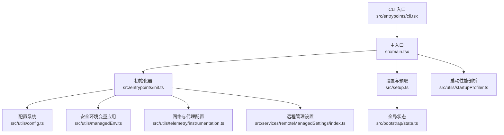
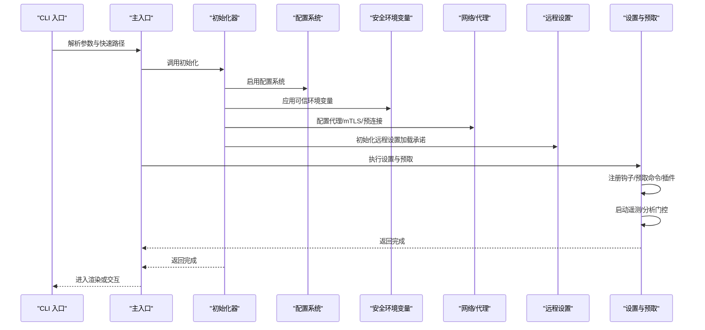
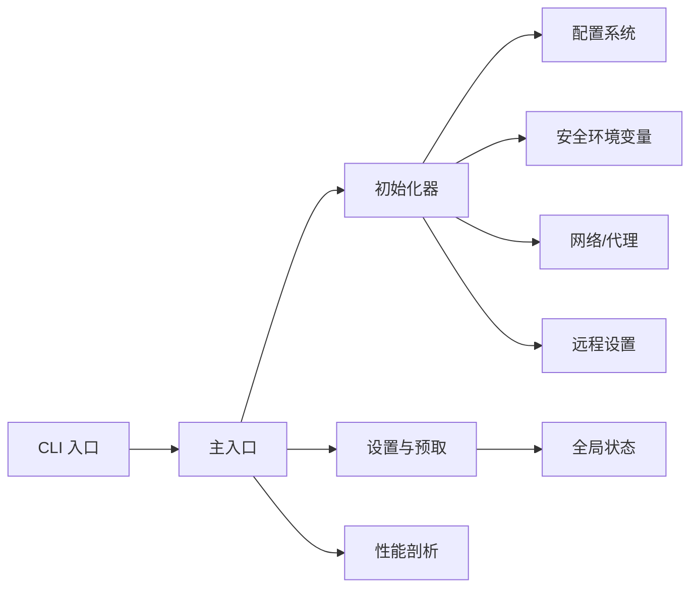

# 初始化流程

<cite>
**本文档引用的文件**
- [src/main.tsx](file://src/main.tsx)
- [src/entrypoints/init.ts](file://src/entrypoints/init.ts)
- [src/setup.ts](file://src/setup.ts)
- [src/bootstrap/state.ts](file://src/bootstrap/state.ts)
- [src/utils/startupProfiler.ts](file://src/utils/startupProfiler.ts)
- [src/utils/config.ts](file://src/utils/config.ts)
- [src/utils/managedEnv.ts](file://src/utils/managedEnv.ts)
- [src/entrypoints/cli.tsx](file://src/entrypoints/cli.tsx)
- [src/utils/telemetry/instrumentation.ts](file://src/utils/telemetry/instrumentation.ts)
- [src/services/remoteManagedSettings/index.ts](file://src/services/remoteManagedSettings/index.ts)
- [src/utils/cliArgs.ts](file://src/utils/cliArgs.ts)
- [src/services/mcp/envExpansion.ts](file://src/services/mcp/envExpansion.ts)
</cite>

## 目录
1. [简介](#简介)
2. [项目结构](#项目结构)
3. [核心组件](#核心组件)
4. [架构总览](#架构总览)
5. [详细组件分析](#详细组件分析)
6. [依赖关系分析](#依赖关系分析)
7. [性能考虑](#性能考虑)
8. [故障排除指南](#故障排除指南)
9. [结论](#结论)

## 简介
本文件系统性阐述 Claude Code 应用程序的初始化流程，覆盖从 CLI 入口到应用启动的完整序列。重点包括：
- 主入口点设置与早期快速路径
- 环境初始化与安全变量应用策略
- 核心组件加载顺序与并行化策略
- 配置加载、状态初始化与依赖注入机制
- 启动阶段的资源预加载、缓存初始化与网络连接建立
- 初始化配置示例（环境变量、配置文件解析、默认值处理）
- 错误处理与故障恢复机制
- 启动性能优化与并行初始化技术策略

## 项目结构
Claude Code 的初始化流程围绕以下关键模块展开：
- CLI 入口：负责早期标志解析与快速路径分流
- 初始化器：负责配置启用、安全环境变量应用、网络代理与 mTLS 配置、遥测初始化等
- 设置与状态：负责配置系统、全局状态、会话状态与持久化
- 性能剖析：记录启动阶段时间线与内存快照
- 远程管理设置：企业级远程设置拉取与校验

图表来源
- [src/entrypoints/cli.tsx](file://src/entrypoints/cli.tsx)
- [src/main.tsx](file://src/main.tsx)
- [src/entrypoints/init.ts](file://src/entrypoints/init.ts)
- [src/utils/config.ts](file://src/utils/config.ts)
- [src/utils/managedEnv.ts](file://src/utils/managedEnv.ts)
- [src/utils/telemetry/instrumentation.ts](file://src/utils/telemetry/instrumentation.ts)
- [src/services/remoteManagedSettings/index.ts](file://src/services/remoteManagedSettings/index.ts)
- [src/setup.ts](file://src/setup.ts)
- [src/bootstrap/state.ts](file://src/bootstrap/state.ts)
- [src/utils/startupProfiler.ts](file://src/utils/startupProfiler.ts)

章节来源
- [src/entrypoints/cli.tsx](file://src/entrypoints/cli.tsx)
- [src/main.tsx](file://src/main.tsx)
- [src/entrypoints/init.ts](file://src/entrypoints/init.ts)
- [src/utils/config.ts](file://src/utils/config.ts)
- [src/utils/managedEnv.ts](file://src/utils/managedEnv.ts)
- [src/utils/telemetry/instrumentation.ts](file://src/utils/telemetry/instrumentation.ts)
- [src/services/remoteManagedSettings/index.ts](file://src/services/remoteManagedSettings/index.ts)
- [src/setup.ts](file://src/setup.ts)
- [src/bootstrap/state.ts](file://src/bootstrap/state.ts)
- [src/utils/startupProfiler.ts](file://src/utils/startupProfiler.ts)

## 核心组件
- CLI 入口：提供版本查询、系统提示导出、桥接模式、守护进程、后台会话管理、模板作业、环境运行器、自托管运行器等快速路径；最终在无特殊标志时导入并执行主入口。
- 初始化器：启用配置系统、应用安全环境变量、配置代理与 mTLS、预连接 API、初始化遥测、注册清理钩子等。
- 设置与状态：提供配置文件读写、合并与验证、设置源过滤、全局状态存储与会话状态切换。
- 性能剖析：通过性能标记记录启动阶段耗时，支持采样日志与详细报告输出。
- 远程管理设置：按用户资格异步拉取企业设置，带超时与降级策略。

章节来源
- [src/entrypoints/cli.tsx](file://src/entrypoints/cli.tsx)
- [src/entrypoints/init.ts](file://src/entrypoints/init.ts)
- [src/utils/config.ts](file://src/utils/config.ts)
- [src/bootstrap/state.ts](file://src/bootstrap/state.ts)
- [src/utils/startupProfiler.ts](file://src/utils/startupProfiler.ts)
- [src/services/remoteManagedSettings/index.ts](file://src/services/remoteManagedSettings/index.ts)

## 架构总览
初始化流程遵循“早安全、早并行、早失败”的原则：
- 早期安全：在信任对话前仅应用可信环境变量，避免项目级危险变量污染
- 并行化：关键 I/O 与网络操作尽可能并行，减少首帧阻塞
- 可观测性：全程使用性能剖析记录关键节点
- 容错：远程设置与网络连接采用失败开路策略，不影响主流程

图表来源
- [src/entrypoints/cli.tsx](file://src/entrypoints/cli.tsx)
- [src/main.tsx](file://src/main.tsx)
- [src/entrypoints/init.ts](file://src/entrypoints/init.ts)
- [src/utils/config.ts](file://src/utils/config.ts)
- [src/utils/managedEnv.ts](file://src/utils/managedEnv.ts)
- [src/utils/telemetry/instrumentation.ts](file://src/utils/telemetry/instrumentation.ts)
- [src/services/remoteManagedSettings/index.ts](file://src/services/remoteManagedSettings/index.ts)
- [src/setup.ts](file://src/setup.ts)

## 详细组件分析

### CLI 入口与快速路径
- 版本查询与系统提示导出：零模块加载成本的快速路径
- 桥接模式、守护进程、后台会话管理、模板作业、环境运行器、自托管运行器等专用子命令的快速路径
- 早期设置环境变量（如 --bare）以影响后续模块评估与命令构建
- 未命中快速路径时，捕获早期输入并导入主入口

章节来源
- [src/entrypoints/cli.tsx](file://src/entrypoints/cli.tsx)

### 主入口与启动序列
- 安全基线：设置 Windows 路径搜索保护、初始化警告处理器、注册退出与信号处理
- 深度链接与协议处理：解析 cc://、cc+unix://、macOS URL Scheme 等，必要时提前退出
- 子命令路由：处理 assistant、ssh 等子命令的早期参数抽取与重写
- 早期设置标志：解析 --settings 与 --setting-sources，尽早应用设置源过滤
- 初始化与设置：调用初始化器、执行设置与预取、延迟预取后台任务
- 启动遥测：在信任建立后初始化遥测

章节来源
- [src/main.tsx](file://src/main.tsx)

### 初始化器（init.ts）
职责与顺序：
- 启用配置系统与应用安全环境变量（仅可信源）
- 记录首次启动时间、配置 mTLS 与全局代理
- 预连接 Anthropic API，降低首次请求延迟
- 初始化远程管理设置加载承诺与策略限制加载承诺
- 注册清理钩子（LSP 管理器、团队清理等）
- 创建临时目录（如启用）、设置 Windows Shell 等

遥测初始化：
- 在信任建立后初始化遥测，支持 Beta 追踪的急切初始化
- 通过动态导入延迟加载遥测 SDK，减少冷启动体积

章节来源
- [src/entrypoints/init.ts](file://src/entrypoints/init.ts)
- [src/utils/telemetry/instrumentation.ts](file://src/utils/telemetry/instrumentation.ts)

### 设置与状态（config.ts 与 bootstrap/state.ts）
配置系统：
- 支持多源合并（用户、项目、本地、策略、标志），并进行键验证与错误回退
- 提供配置文件读写、锁文件、变更检测与缓存重置
- 支持设置源过滤，隔离潜在危险变量

全局状态：
- 统一管理会话 ID、工作目录、计数器、指标、遥测提供者、代理颜色映射、计划缩略名缓存等
- 提供原子性的会话切换与监听机制

章节来源
- [src/utils/config.ts](file://src/utils/config.ts)
- [src/bootstrap/state.ts](file://src/bootstrap/state.ts)

### 安全环境变量应用（managedEnv.ts）
策略：
- 可信源：用户设置、策略设置、命令行标志
- 项目源：仅应用白名单安全变量
- 两阶段应用：信任前应用可信源；信任后应用全部（除特定路由变量）

章节来源
- [src/utils/managedEnv.ts](file://src/utils/managedEnv.ts)

### 启动性能剖析（startupProfiler.ts）
能力：
- 采样日志：按比例向 Statsig 发送阶段耗时
- 详细报告：可输出完整时间线与内存快照至配置目录
- 阶段定义：导入时间、初始化时间、设置加载时间、总启动时间

章节来源
- [src/utils/startupProfiler.ts](file://src/utils/startupProfiler.ts)

### 远程管理设置（remoteManagedSettings）
特性：
- 资格检查：根据认证方式与订阅类型判断是否可获取
- 异步拉取：带超时与重试，失败开路不阻塞
- 缓存与校验：基于校验和的缓存与降级策略
- 加载承诺：允许其他模块等待远程设置就绪

章节来源
- [src/services/remoteManagedSettings/index.ts](file://src/services/remoteManagedSettings/index.ts)

### 设置与预取（setup.ts）
职责：
- 设置工作目录、捕获钩子配置快照、初始化文件变更监控
- 工作树模式：在 Git 或钩子模式下创建工作树与 tmux 会话
- 注册会话内存、上下文折叠、插件钩子预取与热重载
- 启动遥测与分析门控、预取 API Key、Logo v2 数据

章节来源
- [src/setup.ts](file://src/setup.ts)

## 依赖关系分析
初始化流程的关键依赖链：
- CLI 入口依赖主入口与各快速路径模块
- 主入口依赖初始化器、设置与状态、性能剖析
- 初始化器依赖配置系统、安全环境变量、网络/代理、远程设置、遥测
- 设置与状态依赖配置文件系统、设置源、缓存与变更检测
- 性能剖析被广泛用于记录关键阶段

图表来源
- [src/entrypoints/cli.tsx](file://src/entrypoints/cli.tsx)
- [src/main.tsx](file://src/main.tsx)
- [src/entrypoints/init.ts](file://src/entrypoints/init.ts)
- [src/utils/config.ts](file://src/utils/config.ts)
- [src/utils/managedEnv.ts](file://src/utils/managedEnv.ts)
- [src/utils/telemetry/instrumentation.ts](file://src/utils/telemetry/instrumentation.ts)
- [src/services/remoteManagedSettings/index.ts](file://src/services/remoteManagedSettings/index.ts)
- [src/setup.ts](file://src/setup.ts)
- [src/bootstrap/state.ts](file://src/bootstrap/state.ts)
- [src/utils/startupProfiler.ts](file://src/utils/startupProfiler.ts)

章节来源
- [src/entrypoints/cli.tsx](file://src/entrypoints/cli.tsx)
- [src/main.tsx](file://src/main.tsx)
- [src/entrypoints/init.ts](file://src/entrypoints/init.ts)
- [src/utils/config.ts](file://src/utils/config.ts)
- [src/utils/managedEnv.ts](file://src/utils/managedEnv.ts)
- [src/utils/telemetry/instrumentation.ts](file://src/utils/telemetry/instrumentation.ts)
- [src/services/remoteManagedSettings/index.ts](file://src/services/remoteManagedSettings/index.ts)
- [src/setup.ts](file://src/setup.ts)
- [src/bootstrap/state.ts](file://src/bootstrap/state.ts)
- [src/utils/startupProfiler.ts](file://src/utils/startupProfiler.ts)

## 性能考虑
- 早期并行：
  - 启动剖析标记与关键阶段划分，避免重复测量
  - 预连接 API、预取用户信息、系统上下文、提示与模型能力
- 模块懒加载：
  - 遥测 SDK、分析门控、上游代理等通过动态导入延迟加载
- I/O 与事件循环：
  - 将非关键后台任务延迟到首次渲染后执行，减少主线程阻塞
- 内存与缓存：
  - 使用内存快照记录关键阶段内存占用，辅助定位内存泄漏与峰值

章节来源
- [src/main.tsx](file://src/main.tsx)
- [src/entrypoints/init.ts](file://src/entrypoints/init.ts)
- [src/utils/startupProfiler.ts](file://src/utils/startupProfiler.ts)

## 故障排除指南
常见问题与处理：
- 配置解析错误：
  - 非交互模式下直接退出并打印错误
  - 交互模式下弹出无效配置对话框
- 环境变量冲突：
  - 通过安全变量白名单与两阶段应用策略降低风险
  - 在信任建立后重新应用环境变量并重建代理/证书缓存
- 远程设置失败：
  - 失败开路，不影响主流程；可通过超时承诺避免死锁
- 网络与代理：
  - 代理/mTLS 配置失败时，确保清理缓存并重新配置
- 启动性能异常：
  - 启用详细剖析并输出报告，结合阶段耗时定位瓶颈

章节来源
- [src/entrypoints/init.ts](file://src/entrypoints/init.ts)
- [src/utils/config.ts](file://src/utils/config.ts)
- [src/utils/managedEnv.ts](file://src/utils/managedEnv.ts)
- [src/services/remoteManagedSettings/index.ts](file://src/services/remoteManagedSettings/index.ts)
- [src/utils/startupProfiler.ts](file://src/utils/startupProfiler.ts)

## 结论
Claude Code 的初始化流程通过“早安全、早并行、早失败”的设计，在保证安全性的同时最大化启动性能。关键在于：
- 严格的环境变量应用策略与两阶段加载
- 广泛的并行化与懒加载
- 完备的可观测性与容错机制
- 清晰的阶段划分与可扩展的依赖注入