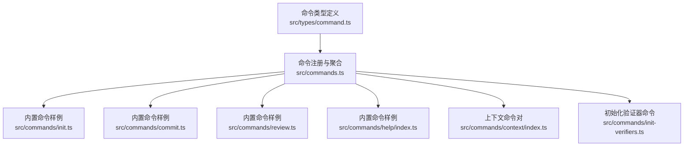
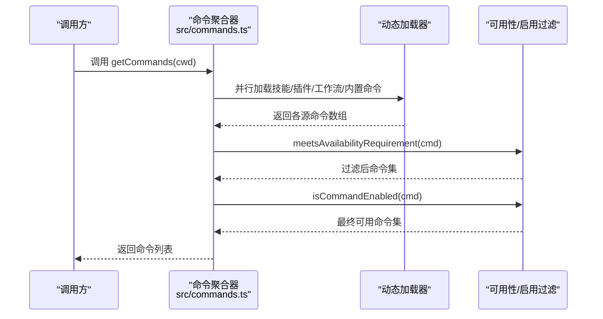
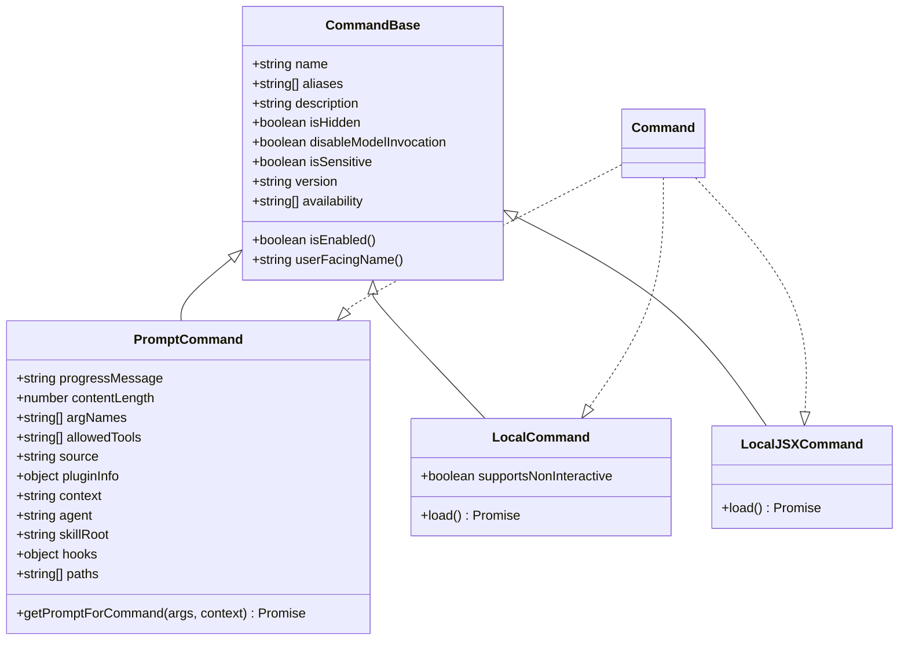
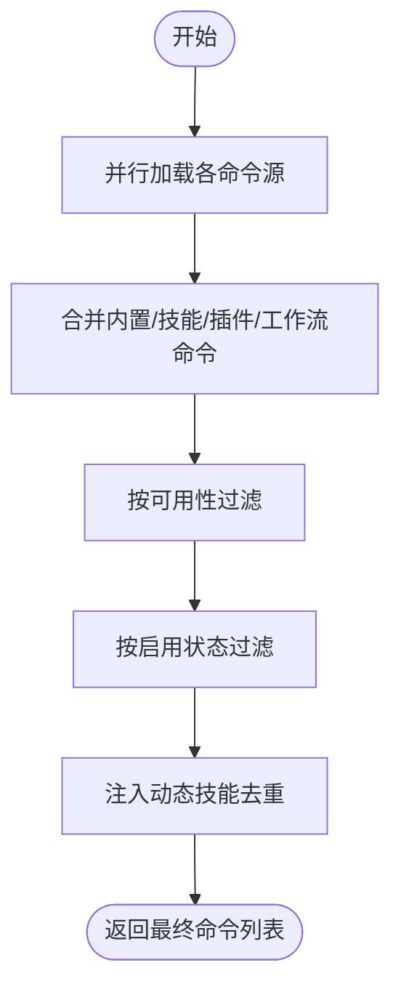
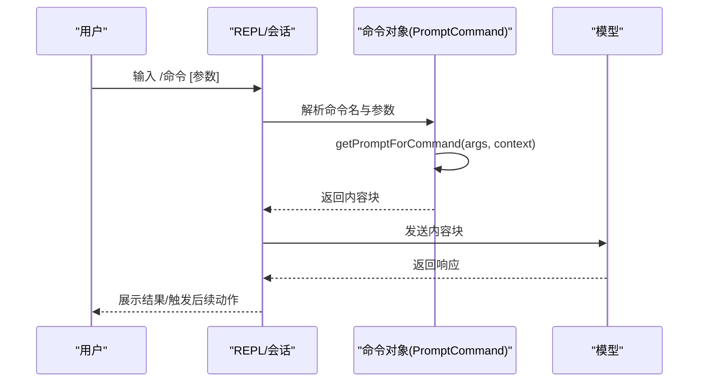
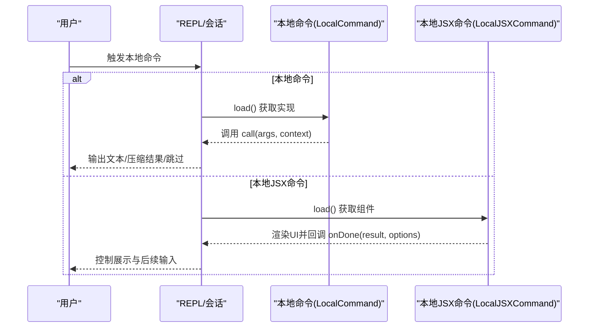
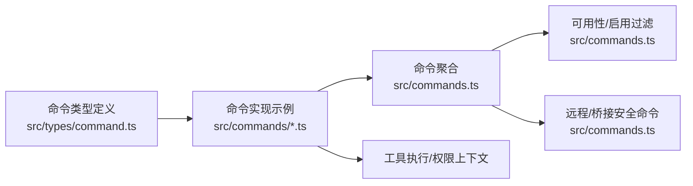

# 命令系统

<cite>
**本文引用的文件**
- [src/commands.ts](file://src/commands.ts)
- [src/types/command.ts](file://src/types/command.ts)
- [src/commands/init.ts](file://src/commands/init.ts)
- [src/commands/init-verifiers.ts](file://src/commands/init-verifiers.ts)
- [src/commands/help/index.ts](file://src/commands/help/index.ts)
- [src/commands/context/index.ts](file://src/commands/context/index.ts)
- [src/commands/review.ts](file://src/commands/review.ts)
- [src/commands/commit.ts](file://src/commands/commit.ts)
</cite>

## 目录
1. [引言](#引言)
2. [项目结构](#项目结构)
3. [核心组件](#核心组件)
4. [架构总览](#架构总览)
5. [详细组件分析](#详细组件分析)
6. [依赖分析](#依赖分析)
7. [性能考虑](#性能考虑)
8. [故障排查指南](#故障排查指南)
9. [结论](#结论)
10. [附录](#附录)

## 引言
本文件面向Claude Code的命令系统，系统性阐述命令注册、解析与执行机制，Slash命令（技能）的实现原理（语法解析、参数处理、执行流程），扩展机制（新增命令与自定义命令开发流程），以及命令系统与工具系统的集成关系。同时给出错误处理、权限验证与性能优化策略，并提供可操作的命令开发示例与参考路径。

## 项目结构
命令系统的核心由“命令类型定义”“命令注册与聚合”“可用性过滤与动态加载”三部分组成：
- 类型层：统一定义命令基元、本地命令、提示型命令、结果展示等契约，确保不同来源（内置、插件、技能目录、工作流）的命令具有一致的运行时行为。
- 聚合层：集中注册所有命令源，按可用性与启用状态进行筛选，支持动态技能注入与去重合并。
- 执行层：根据命令类型分派到Prompt生成器或本地实现；对Slash命令（技能）提供模型可见的描述与工具约束。

图表来源
- [src/commands.ts:258-517](file://src/commands.ts#L258-L517)
- [src/types/command.ts:205-217](file://src/types/command.ts#L205-L217)
- [src/commands/init.ts:226-254](file://src/commands/init.ts#L226-L254)
- [src/commands/commit.ts:57-90](file://src/commands/commit.ts#L57-L90)
- [src/commands/review.ts:33-54](file://src/commands/review.ts#L33-L54)
- [src/commands/help/index.ts:3-10](file://src/commands/help/index.ts#L3-L10)
- [src/commands/context/index.ts:4-24](file://src/commands/context/index.ts#L4-L24)
- [src/commands/init-verifiers.ts:3-260](file://src/commands/init-verifiers.ts#L3-L260)

章节来源
- [src/commands.ts:258-517](file://src/commands.ts#L258-L517)
- [src/types/command.ts:205-217](file://src/types/command.ts#L205-L217)

## 核心组件
- 命令类型与契约
  - 统一的Command基类与三种命令形态：PromptCommand（模型可见）、LocalCommand（本地执行）、LocalJSXCommand（本地渲染UI）。
  - 结果约定：LocalCommandResult支持文本、压缩结果、跳过等；PromptCommand通过getPromptForCommand生成内容块。
- 命令注册与聚合
  - 内置命令集合与条件导入（如语音、助手、远程控制等特性开关）。
  - 动态技能与插件命令的异步加载与合并，支持缓存与去重。
  - 可用性过滤：按订阅/控制台环境限制命令可见性；启用状态过滤：按isEnabled判定是否可用。
- 运行时能力
  - Slash命令（技能）的模型可见性与工具约束；远程/桥接安全命令白名单；帮助与上下文可视化等本地命令。

章节来源
- [src/types/command.ts:16-107](file://src/types/command.ts#L16-L107)
- [src/types/command.ts:175-206](file://src/types/command.ts#L175-L206)
- [src/commands.ts:258-517](file://src/commands.ts#L258-L517)

## 架构总览
命令系统采用“类型统一 + 源聚合 + 条件加载 + 安全过滤”的分层设计。下图展示了从命令注册到可用命令列表生成的关键流程：

图表来源
- [src/commands.ts:449-517](file://src/commands.ts#L449-L517)
- [src/commands.ts:417-443](file://src/commands.ts#L417-L443)
- [src/commands.ts:483-485](file://src/commands.ts#L483-L485)

## 详细组件分析

### 命令类型与数据模型
命令类型定义了统一的契约，确保不同来源的命令在运行时行为一致。关键点：
- 命令形态
  - PromptCommand：面向模型的技能，通过getPromptForCommand生成内容块，支持进度消息、内容长度、工具白名单、上下文模式（内联/分叉）等。
  - LocalCommand：本地命令，支持非交互执行，延迟加载实现模块。
  - LocalJSXCommand：本地渲染UI命令，延迟加载，适合复杂交互。
- 结果与显示
  - LocalCommandResult支持文本、压缩结果、跳过等；CommandResultDisplay控制结果在会话中的呈现方式（跳过/系统/用户）。
- 命令元信息
  - 包含名称、别名、描述、版本、可用性（订阅/控制台）、是否隐藏、是否禁用模型调用、是否敏感参数（历史中脱敏）等。

图表来源
- [src/types/command.ts:16-107](file://src/types/command.ts#L16-L107)
- [src/types/command.ts:175-206](file://src/types/command.ts#L175-L206)

章节来源
- [src/types/command.ts:16-107](file://src/types/command.ts#L16-L107)
- [src/types/command.ts:175-206](file://src/types/command.ts#L175-L206)

### 命令注册与聚合
- 内置命令注册
  - 通过集中导入与条件require注册大量内置命令，支持特性开关与平台差异。
- 动态命令加载
  - 技能目录命令、插件技能、内置插件技能、工作流命令与插件命令并行加载，合并后统一过滤。
- 可用性与启用过滤
  - meetsAvailabilityRequirement按订阅/控制台环境过滤；isCommandEnabled按isEnabled判定；动态技能去重并插入到合适位置。
- 缓存与失效
  - 使用memoize缓存加载结果；提供clearCommandMemoizationCaches与clearCommandsCache以应对动态技能变更。

图表来源
- [src/commands.ts:449-517](file://src/commands.ts#L449-L517)
- [src/commands.ts:417-443](file://src/commands.ts#L417-L443)

章节来源
- [src/commands.ts:258-517](file://src/commands.ts#L258-L517)

### Slash命令（技能）实现原理
- 识别与分类
  - Slash命令即PromptCommand，通常来自技能目录、插件或内置命令；可通过loadedFrom区分来源，通过disableModelInvocation控制是否允许模型直接调用。
- 语法与参数
  - 参数通过命令名称后的字符串传递；PromptCommand支持argNames与allowedTools约束；敏感参数可标记isSensitive在历史中脱敏。
- 执行流程
  - getPromptForCommand生成内容块，交由模型处理；结果可选择是否触发后续查询、插入元消息、设置下一步输入等。
- 模型可见性
  - getSkillToolCommands与getSlashCommandToolSkills分别用于模型可调用的技能索引与Slash命令索引，均考虑来源与描述存在性。

图表来源
- [src/commands.ts:563-608](file://src/commands.ts#L563-L608)
- [src/types/command.ts:53-56](file://src/types/command.ts#L53-L56)

章节来源
- [src/commands.ts:563-608](file://src/commands.ts#L563-L608)
- [src/types/command.ts:53-56](file://src/types/command.ts#L53-L56)

### 本地命令与本地JSX命令
- 本地命令（LocalCommand）
  - 支持非交互执行，延迟加载call函数；返回LocalCommandResult，可选择跳过消息或输出压缩结果。
- 本地JSX命令（LocalJSXCommand）
  - 延迟加载UI组件，适合复杂交互场景；通过LocalJSXCommandOnDone回调控制结果展示、是否继续查询、插入元消息等。

图表来源
- [src/types/command.ts:62-72](file://src/types/command.ts#L62-L72)
- [src/types/command.ts:131-135](file://src/types/command.ts#L131-L135)

章节来源
- [src/types/command.ts:62-72](file://src/types/command.ts#L62-L72)
- [src/types/command.ts:131-135](file://src/types/command.ts#L131-L135)

### 典型命令示例与开发要点

#### 示例一：初始化命令（PromptCommand）
- 接口要点
  - type为prompt，source为builtin，contentLength为0（动态内容），progressMessage用于UI反馈。
  - getPromptForCommand返回内容块，支持特性开关与环境变量控制描述文案。
- 开发建议
  - 将长提示词拆分为常量或外部文件，便于维护与测试。
  - 使用工具权限上下文（如alwaysAllowRules）明确允许的工具集合。
- 参考路径
  - [src/commands/init.ts:226-254](file://src/commands/init.ts#L226-L254)

章节来源
- [src/commands/init.ts:226-254](file://src/commands/init.ts#L226-L254)

#### 示例二：提交命令（PromptCommand + 工具约束）
- 接口要点
  - allowedTools限定为git相关工具，getPromptForCommand中通过executeShellCommandsInPrompt注入实时shell输出。
  - 在工具权限上下文中显式允许命令使用的工具规则。
- 开发建议
  - 对可能泄露敏感信息的文件进行提示与阻止；避免使用需要交互的git子命令。
- 参考路径
  - [src/commands/commit.ts:57-90](file://src/commands/commit.ts#L57-L90)

章节来源
- [src/commands/commit.ts:57-90](file://src/commands/commit.ts#L57-L90)

#### 示例三：代码审查命令（PromptCommand）
- 接口要点
  - 本地评审为纯PromptCommand，ultrareview为LocalJSXCommand（受特性开关控制）。
  - 通过LOCAL_REVIEW_PROMPT(args)生成评审指令，支持PR号参数。
- 开发建议
  - 明确评审范围与输出格式；必要时引入AskUserQuestion收集缺失上下文。
- 参考路径
  - [src/commands/review.ts:33-54](file://src/commands/review.ts#L33-L54)

章节来源
- [src/commands/review.ts:33-54](file://src/commands/review.ts#L33-L54)

#### 示例四：帮助命令（LocalJSXCommand）
- 接口要点
  - type为local-jsx，通过load延迟加载帮助实现。
- 开发建议
  - 帮助界面应包含命令列表、别名、简要描述与来源标注。
- 参考路径
  - [src/commands/help/index.ts:3-10](file://src/commands/help/index.ts#L3-L10)

章节来源
- [src/commands/help/index.ts:3-10](file://src/commands/help/index.ts#L3-L10)

#### 示例五：上下文命令对（LocalJSX + Local）
- 接口要点
  - 同名命令提供交互式（context）与非交互式（contextNonInteractive）两种实现，通过isEnabled与isHidden控制在不同会话模式下的可用性。
- 开发建议
  - 非交互模式需保证无UI依赖，仅输出文本或结构化结果。
- 参考路径
  - [src/commands/context/index.ts:4-24](file://src/commands/context/index.ts#L4-L24)

章节来源
- [src/commands/context/index.ts:4-24](file://src/commands/context/index.ts#L4-L24)

#### 示例六：初始化验证器命令（PromptCommand）
- 接口要点
  - 通过TodoWrite工具跟踪进度，自动检测项目类型与验证工具，生成验证器技能模板。
  - 支持Web、CLI、API三类验证器的工具组合与配置建议。
- 开发建议
  - 严格区分单元测试与功能性验证；为每类验证器提供清晰的allowed-tools清单。
- 参考路径
  - [src/commands/init-verifiers.ts:3-260](file://src/commands/init-verifiers.ts#L3-L260)

章节来源
- [src/commands/init-verifiers.ts:3-260](file://src/commands/init-verifiers.ts#L3-L260)

### 命令系统与工具系统的集成
- 工具约束
  - PromptCommand通过allowedTools声明允许的工具集合；LocalCommand可在上下文中动态调整工具权限。
- 工具执行
  - 命令通过工具执行实现具体功能（如git、浏览器自动化、HTTP请求等），并在Prompt中以HEREDOC形式一次性发送多条工具调用。
- MCP与插件
  - 技能与命令可来源于MCP、插件与技能目录，系统通过统一类型与过滤逻辑整合。

章节来源
- [src/commands/commit.ts:65-86](file://src/commands/commit.ts#L65-L86)
- [src/commands.ts:547-559](file://src/commands.ts#L547-L559)

### 扩展机制与自定义命令开发流程
- 新增内置命令
  - 在src/commands.ts中注册新命令对象；若涉及特性开关，使用条件require并加入INTERNAL_ONLY_COMMANDS或FEATURE_*分支。
  - 为命令提供description、argumentHint、whenToUse、version等元信息；必要时设置availability与isEnabled。
- 新增技能命令
  - 将技能放置于技能目录，系统自动发现并加载；或通过插件/工作流提供命令。
  - 确保技能具备描述（description或whenToUse），以便在模型可见索引中出现。
- 动态技能注入
  - 通过getDynamicSkills与去重逻辑，动态技能会在插件技能之后、内置命令之前插入，避免重复。
- 清理与刷新
  - 当动态技能变化时，调用clearCommandMemoizationCaches或clearCommandsCache以刷新缓存。

章节来源
- [src/commands.ts:449-517](file://src/commands.ts#L449-L517)
- [src/commands.ts:519-539](file://src/commands.ts#L519-L539)

## 依赖分析
- 命令类型依赖
  - CommandBase依赖工具上下文、EffortValue、主题、日志选项、插件清单等类型，体现命令与系统其他模块的耦合。
- 命令聚合依赖
  - commands.ts依赖技能加载、插件命令加载、MCP技能过滤、远程/桥接安全命令集合、可用性判断等。
- 命令实现依赖
  - 具体命令实现依赖工具执行、权限上下文、环境变量、特性开关等。

图表来源
- [src/types/command.ts:1-15](file://src/types/command.ts#L1-L15)
- [src/commands.ts:417-443](file://src/commands.ts#L417-L443)
- [src/commands.ts:619-676](file://src/commands.ts#L619-L676)

章节来源
- [src/types/command.ts:1-15](file://src/types/command.ts#L1-L15)
- [src/commands.ts:417-443](file://src/commands.ts#L417-L443)
- [src/commands.ts:619-676](file://src/commands.ts#L619-L676)

## 性能考虑
- 懒加载与延迟初始化
  - LocalJSXCommand与部分内置命令通过load延迟加载，减少启动时内存占用。
- 缓存策略
  - loadAllCommands、getSkillToolCommands、getSlashCommandToolSkills等使用memoize缓存，避免重复磁盘I/O与动态导入开销。
- 并行加载
  - 技能、插件、工作流命令并行加载，缩短命令列表生成时间。
- 去重与插入策略
  - 动态技能去重并插入到插件技能之后、内置命令之前，避免重复与顺序问题。

章节来源
- [src/commands.ts:449-517](file://src/commands.ts#L449-L517)
- [src/commands.ts:563-608](file://src/commands.ts#L563-L608)

## 故障排查指南
- 命令未显示
  - 检查availability与isEnabled是否满足当前环境；确认命令未被isHidden隐藏。
  - 参考：[src/commands.ts:417-443](file://src/commands.ts#L417-L443)、[src/commands.ts:483-485](file://src/commands.ts#L483-L485)
- 命令不可用或报错
  - 确认allowedTools与工具权限上下文配置正确；检查alwaysAllowRules是否包含命令所需工具。
  - 参考：[src/commands/commit.ts:75-83](file://src/commands/commit.ts#L75-L83)
- 动态技能不生效
  - 调用clearCommandMemoizationCaches或clearCommandsCache刷新缓存；确认动态技能名称未与内置/插件命令重复。
  - 参考：[src/commands.ts:519-539](file://src/commands.ts#L519-L539)
- Slash命令无法被模型调用
  - 确认hasUserSpecifiedDescription或whenToUse存在；检查disableModelInvocation与loadedFrom。
  - 参考：[src/commands.ts:586-608](file://src/commands.ts#L586-L608)

章节来源
- [src/commands.ts:417-443](file://src/commands.ts#L417-L443)
- [src/commands.ts:483-485](file://src/commands.ts#L483-L485)
- [src/commands/commit.ts:75-83](file://src/commands/commit.ts#L75-L83)
- [src/commands.ts:519-539](file://src/commands.ts#L519-L539)
- [src/commands.ts:586-608](file://src/commands.ts#L586-L608)

## 结论
命令系统通过统一类型、聚合加载与安全过滤，实现了对内置、技能、插件与工作流命令的一致管理。Slash命令（技能）以PromptCommand为核心，结合allowedTools与权限上下文，既能满足模型调用需求，又能保障执行安全。配合懒加载、缓存与并行加载策略，系统在可用性与性能之间取得平衡。开发者可依据本文档提供的接口与流程，快速扩展新命令与自定义技能。

## 附录
- 常用工具与上下文
  - ToolUseContext：工具调用上下文，包含获取应用状态、消息更新等能力。
  - LocalJSXCommandOnDone：本地JSX命令完成回调，支持结果展示、是否继续查询、插入元消息等。
- 关键API参考路径
  - 命令类型与契约：[src/types/command.ts](file://src/types/command.ts)
  - 命令注册与聚合：[src/commands.ts](file://src/commands.ts)
  - 初始化命令：[src/commands/init.ts](file://src/commands/init.ts)
  - 提交命令：[src/commands/commit.ts](file://src/commands/commit.ts)
  - 代码审查命令：[src/commands/review.ts](file://src/commands/review.ts)
  - 帮助命令：[src/commands/help/index.ts](file://src/commands/help/index.ts)
  - 上下文命令对：[src/commands/context/index.ts](file://src/commands/context/index.ts)
  - 初始化验证器命令：[src/commands/init-verifiers.ts](file://src/commands/init-verifiers.ts)