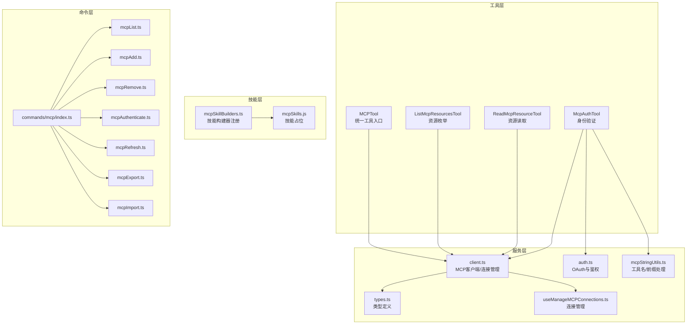
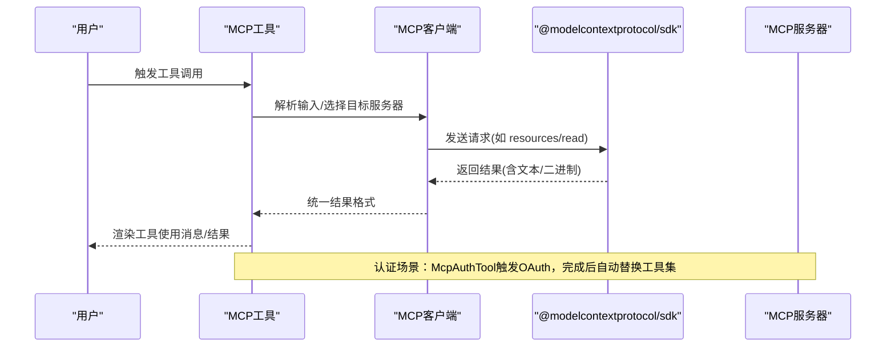
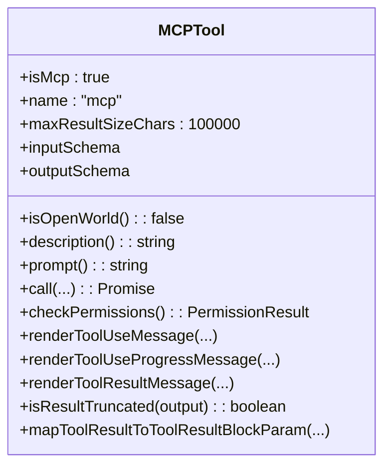
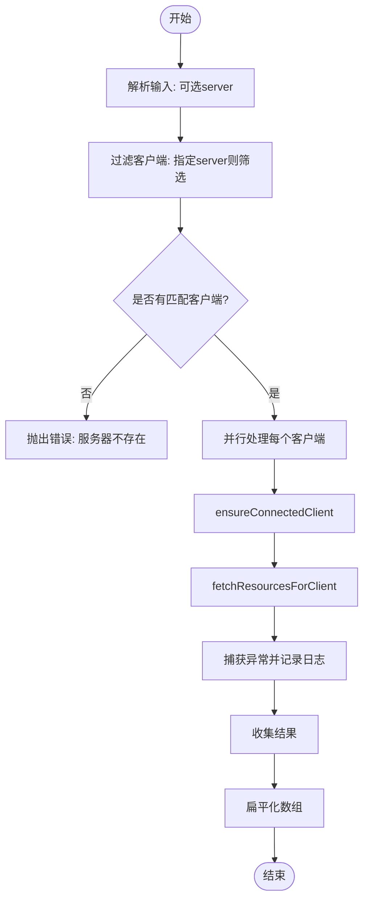
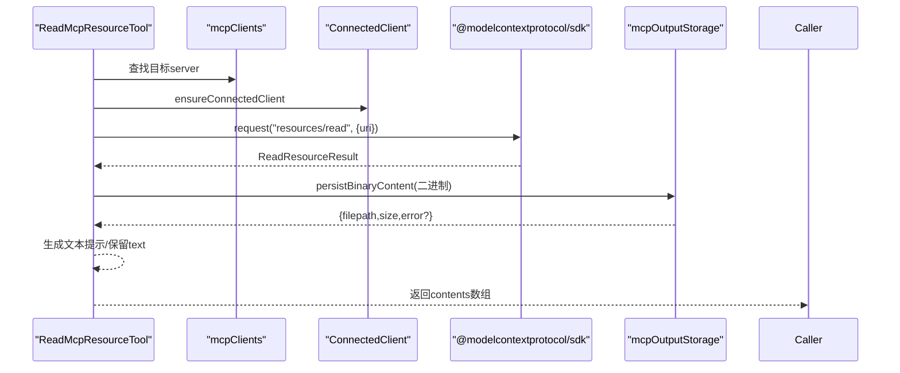
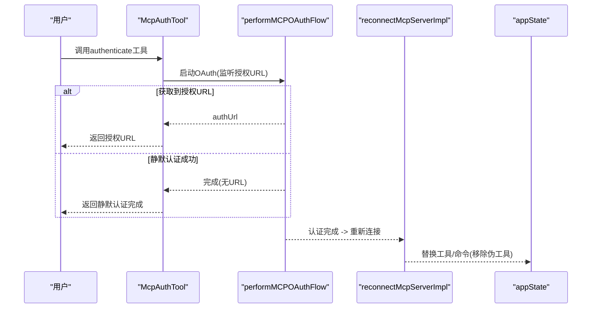
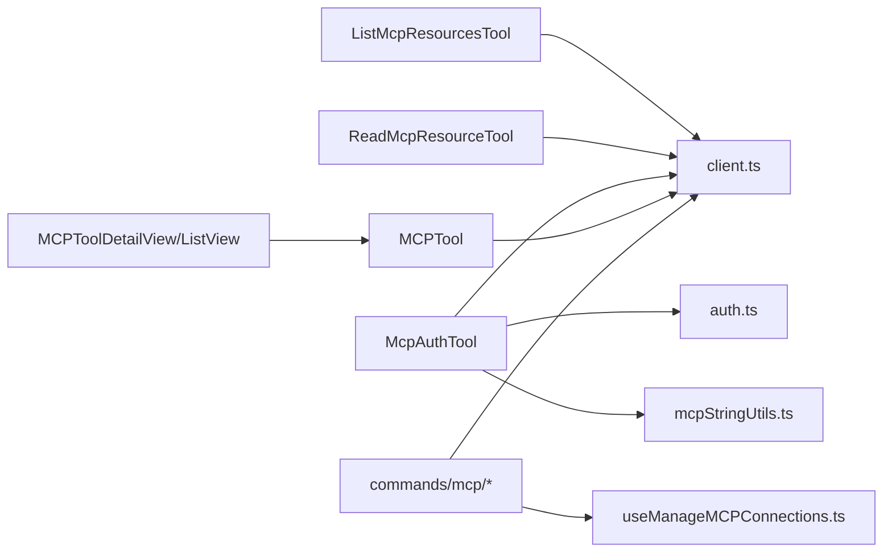

# MCP与集成工具

<cite>
**本文引用的文件**
- [src/tools/MCPTool/MCPTool.ts](file://src/tools/MCPTool/MCPTool.ts)
- [src/tools/ListMcpResourcesTool/ListMcpResourcesTool.ts](file://src/tools/ListMcpResourcesTool/ListMcpResourcesTool.ts)
- [src/tools/ReadMcpResourceTool/ReadMcpResourceTool.ts](file://src/tools/ReadMcpResourceTool/ReadMcpResourceTool.ts)
- [src/tools/McpAuthTool/McpAuthTool.ts](file://src/tools/McpAuthTool/McpAuthTool.ts)
- [src/skills/mcpSkillBuilders.ts](file://src/skills/mcpSkillBuilders.ts)
- [skills/mcpSkills.js](file://skills/mcpSkills.js)
- [src/services/mcp/client.ts](file://src/services/mcp/client.ts)
- [src/services/mcp/auth.ts](file://src/services/mcp/auth.ts)
- [src/services/mcp/types.ts](file://src/services/mcp/types.ts)
- [src/services/mcp/mcpStringUtils.ts](file://src/services/mcp/mcpStringUtils.ts)
- [src/services/mcp/useManageMCPConnections.ts](file://src/services/mcp/useManageMCPConnections.ts)
- [src/services/mcp/officialRegistry.ts](file://src/services/mcp/officialRegistry.ts)
- [src/services/mcp/xaa.ts](file://src/services/mcp/xaa.ts)
- [src/services/mcp/xaaIdpLogin.ts](file://src/services/mcp/xaaIdpLogin.ts)
- [src/utils/mcpOutputStorage.js](file://src/utils/mcpOutputStorage.js)
- [src/utils/errors.js](file://src/utils/errors.js)
- [src/utils/log.js](file://src/utils/log.js)
- [src/utils/terminal.js](file://src/utils/terminal.js)
- [src/utils/slowOperations.js](file://src/utils/slowOperations.js)
- [src/utils/lazySchema.js](file://src/utils/lazySchema.js)
- [src/commands/mcp/index.ts](file://src/commands/mcp/index.ts)
- [src/commands/mcp/mcpList.ts](file://src/commands/mcp/mcpList.ts)
- [src/commands/mcp/mcpAdd.ts](file://src/commands/mcp/mcpAdd.ts)
- [src/commands/mcp/mcpRemove.ts](file://src/commands/mcp/mcpRemove.ts)
- [src/commands/mcp/mcpAuthenticate.ts](file://src/commands/mcp/mcpAuthenticate.ts)
- [src/commands/mcp/mcpRefresh.ts](file://src/commands/mcp/mcpRefresh.ts)
- [src/commands/mcp/mcpExport.ts](file://src/commands/mcp/mcpExport.ts)
- [src/commands/mcp/mcpImport.ts](file://src/commands/mcp/mcpImport.ts)
- [src/entrypoints/mcp.ts](file://src/entrypoints/mcp.ts)
- [src/components/mcp/MCPToolDetailView.tsx](file://src/components/mcp/MCPToolDetailView.tsx)
- [src/components/mcp/MCPToolListView.tsx](file://src/components/mcp/MCPToolListView.tsx)
</cite>

## 目录
1. [简介](#简介)
2. [项目结构](#项目结构)
3. [核心组件](#核心组件)
4. [架构总览](#架构总览)
5. [详细组件分析](#详细组件分析)
6. [依赖关系分析](#依赖关系分析)
7. [性能考虑](#性能考虑)
8. [故障排除指南](#故障排除指南)
9. [结论](#结论)
10. [附录](#附录)

## 简介
本文件面向Claude Code中的MCP（Model Context Protocol）集成与工具体系，系统性梳理以下能力与实现：
- 外部服务集成：MCPTool作为统一入口，封装并代理来自不同MCP服务器的工具调用。
- 资源发现与工具包装：ListMcpResourcesTool用于枚举资源，ReadMcpResourceTool用于读取与解析资源内容。
- 身份验证与授权：McpAuthTool负责触发OAuth流程，完成认证后自动替换为真实工具集。
- 协议实现细节：基于@modelcontextprotocol/sdk的请求/响应、能力协商、通知与错误处理。
- 连接管理：连接状态维护、重连策略、缓存与失效机制。
- 配置与安全：服务器配置、传输类型、鉴权方式、通道白名单与权限控制。
- 性能优化：并发安全、结果截断检测、二进制内容落盘、LRU缓存与预热。
- 最佳实践与排障：调试技巧、常见问题定位与修复建议。

## 项目结构
围绕MCP的代码主要分布在以下模块：
- 工具层：MCPTool、ListMcpResourcesTool、ReadMcpResourceTool、McpAuthTool
- 服务层：MCP客户端与认证、类型定义、字符串工具、连接管理
- 技能层：MCP技能构建器注册与占位
- 命令层：CLI命令与导入导出、刷新等管理操作
- UI层：工具列表与详情展示组件

图表来源
- [src/tools/MCPTool/MCPTool.ts:1-78](file://src/tools/MCPTool/MCPTool.ts#L1-L78)
- [src/tools/ListMcpResourcesTool/ListMcpResourcesTool.ts:1-124](file://src/tools/ListMcpResourcesTool/ListMcpResourcesTool.ts#L1-L124)
- [src/tools/ReadMcpResourceTool/ReadMcpResourceTool.ts:1-159](file://src/tools/ReadMcpResourceTool/ReadMcpResourceTool.ts#L1-L159)
- [src/tools/McpAuthTool/McpAuthTool.ts:1-216](file://src/tools/McpAuthTool/McpAuthTool.ts#L1-L216)
- [src/services/mcp/client.ts](file://src/services/mcp/client.ts)
- [src/services/mcp/auth.ts](file://src/services/mcp/auth.ts)
- [src/services/mcp/types.ts](file://src/services/mcp/types.ts)
- [src/services/mcp/mcpStringUtils.ts](file://src/services/mcp/mcpStringUtils.ts)
- [src/services/mcp/useManageMCPConnections.ts](file://src/services/mcp/useManageMCPConnections.ts)
- [src/skills/mcpSkillBuilders.ts:1-45](file://src/skills/mcpSkillBuilders.ts#L1-L45)
- [skills/mcpSkills.js:1-4](file://skills/mcpSkills.js#L1-L4)
- [src/commands/mcp/index.ts](file://src/commands/mcp/index.ts)
- [src/commands/mcp/mcpList.ts](file://src/commands/mcp/mcpList.ts)
- [src/commands/mcp/mcpAdd.ts](file://src/commands/mcp/mcpAdd.ts)
- [src/commands/mcp/mcpRemove.ts](file://src/commands/mcp/mcpRemove.ts)
- [src/commands/mcp/mcpAuthenticate.ts](file://src/commands/mcp/mcpAuthenticate.ts)
- [src/commands/mcp/mcpRefresh.ts](file://src/commands/mcp/mcpRefresh.ts)
- [src/commands/mcp/mcpExport.ts](file://src/commands/mcp/mcpExport.ts)
- [src/commands/mcp/mcpImport.ts](file://src/commands/mcp/mcpImport.ts)

章节来源
- [src/tools/MCPTool/MCPTool.ts:1-78](file://src/tools/MCPTool/MCPTool.ts#L1-L78)
- [src/tools/ListMcpResourcesTool/ListMcpResourcesTool.ts:1-124](file://src/tools/ListMcpResourcesTool/ListMcpResourcesTool.ts#L1-L124)
- [src/tools/ReadMcpResourceTool/ReadMcpResourceTool.ts:1-159](file://src/tools/ReadMcpResourceTool/ReadMcpResourceTool.ts#L1-L159)
- [src/tools/McpAuthTool/McpAuthTool.ts:1-216](file://src/tools/McpAuthTool/McpAuthTool.ts#L1-L216)
- [src/skills/mcpSkillBuilders.ts:1-45](file://src/skills/mcpSkillBuilders.ts#L1-L45)
- [skills/mcpSkills.js:1-4](file://skills/mcpSkills.js#L1-L4)

## 核心组件
- MCPTool：作为所有MCP工具的统一入口，动态注入实际工具名称与参数，支持进度渲染与结果截断检测。
- ListMcpResourcesTool：按服务器过滤枚举资源，聚合多个连接的结果，失败单点不影响整体。
- ReadMcpResourceTool：读取指定URI资源，支持文本与二进制内容，二进制自动落盘并生成可读提示。
- McpAuthTool：为未认证的MCP服务器生成“伪工具”，触发OAuth流程并在完成后自动替换为真实工具集合。

章节来源
- [src/tools/MCPTool/MCPTool.ts:27-77](file://src/tools/MCPTool/MCPTool.ts#L27-L77)
- [src/tools/ListMcpResourcesTool/ListMcpResourcesTool.ts:40-123](file://src/tools/ListMcpResourcesTool/ListMcpResourcesTool.ts#L40-L123)
- [src/tools/ReadMcpResourceTool/ReadMcpResourceTool.ts:49-158](file://src/tools/ReadMcpResourceTool/ReadMcpResourceTool.ts#L49-L158)
- [src/tools/McpAuthTool/McpAuthTool.ts:49-215](file://src/tools/McpAuthTool/McpAuthTool.ts#L49-L215)

## 架构总览
下图展示了MCP工具在应用中的调用链路与关键交互：

图表来源
- [src/tools/MCPTool/MCPTool.ts:51-55](file://src/tools/MCPTool/MCPTool.ts#L51-L55)
- [src/tools/ListMcpResourcesTool/ListMcpResourcesTool.ts:66-101](file://src/tools/ListMcpResourcesTool/ListMcpResourcesTool.ts#L66-L101)
- [src/tools/ReadMcpResourceTool/ReadMcpResourceTool.ts:75-144](file://src/tools/ReadMcpResourceTool/ReadMcpResourceTool.ts#L75-L144)
- [src/tools/McpAuthTool/McpAuthTool.ts:85-206](file://src/tools/McpAuthTool/McpAuthTool.ts#L85-L206)

## 详细组件分析

### MCPTool：统一入口与工具包装
- 动态属性覆盖：在运行时由mcpClient.ts设置name、description、prompt、call等，以适配具体服务器与工具。
- 权限与UI：checkPermissions返回透传策略，提供渲染函数用于工具使用与结果消息。
- 截断检测：基于终端输出长度判断结果是否截断，避免超长输出影响上下文。

图表来源
- [src/tools/MCPTool/MCPTool.ts:27-77](file://src/tools/MCPTool/MCPTool.ts#L27-L77)

章节来源
- [src/tools/MCPTool/MCPTool.ts:1-78](file://src/tools/MCPTool/MCPTool.ts#L1-L78)

### ListMcpResourcesTool：资源枚举与元数据聚合
- 输入/输出模式：输入可选server过滤；输出包含uri、name、mimeType、description、server等字段。
- 并发与容错：对每个已连接客户端并行执行ensureConnectedClient与fetchResourcesForClient，单点异常记录日志但不阻塞整体。
- 缓存与预热：资源列表通过LRU缓存，启动即预热，onclose与resources/list_changed通知会失效缓存，确保一致性。
- 结果映射：空结果时给出友好提示，非空则序列化为JSON字符串。

图表来源
- [src/tools/ListMcpResourcesTool/ListMcpResourcesTool.ts:66-101](file://src/tools/ListMcpResourcesTool/ListMcpResourcesTool.ts#L66-L101)

章节来源
- [src/tools/ListMcpResourcesTool/ListMcpResourcesTool.ts:1-124](file://src/tools/ListMcpResourcesTool/ListMcpResourcesTool.ts#L1-L124)

### ReadMcpResourceTool：内容读取与解析
- 请求路径：直接调用connectedClient.client.request('resources/read')，使用ReadResourceResultSchema进行校验。
- 内容处理：
  - 文本内容：原样保留。
  - 二进制内容：Base64解码后写入磁盘，生成带MIME类型的文件路径，并返回可读提示文本，避免将大块Base64字符串放入上下文。
- 错误与边界：当服务器不支持resources能力或连接状态异常时，抛出明确错误信息。

图表来源
- [src/tools/ReadMcpResourceTool/ReadMcpResourceTool.ts:75-144](file://src/tools/ReadMcpResourceTool/ReadMcpResourceTool.ts#L75-L144)
- [src/utils/mcpOutputStorage.js](file://src/utils/mcpOutputStorage.js)

章节来源
- [src/tools/ReadMcpResourceTool/ReadMcpResourceTool.ts:1-159](file://src/tools/ReadMcpResourceTool/ReadMcpResourceTool.ts#L1-L159)

### McpAuthTool：身份验证与授权流程
- 触发条件：仅对未认证且支持OAuth的HTTP/SSE服务器生效；Claude AI代理类型提示用户手动认证。
- 流程设计：
  - 启动performMCPOAuthFlow，监听onAuthorizationUrl回调以获取授权URL。
  - 若静默认证成功（如XAA缓存Token），则无需用户打开浏览器。
  - 认证完成后，clearMcpAuthCache并reconnectMcpServerImpl，基于前缀替换工具集与命令集，移除“伪工具”。
- 安全与兼容：严格区分传输类型，避免对stdio等不支持OAuth的通道发起流程。

图表来源
- [src/tools/McpAuthTool/McpAuthTool.ts:85-206](file://src/tools/McpAuthTool/McpAuthTool.ts#L85-L206)
- [src/services/mcp/auth.ts](file://src/services/mcp/auth.ts)
- [src/services/mcp/client.ts](file://src/services/mcp/client.ts)
- [src/services/mcp/mcpStringUtils.ts](file://src/services/mcp/mcpStringUtils.ts)

章节来源
- [src/tools/McpAuthTool/McpAuthTool.ts:1-216](file://src/tools/McpAuthTool/McpAuthTool.ts#L1-L216)

### MCP协议实现与连接管理
- 协议实现：通过@modelcontextprotocol/sdk进行请求/响应、能力协商与通知订阅。
- 连接管理：
  - ensureConnectedClient：健康检查与缓存命中时的无操作，断开后重建连接。
  - reconnectMcpServerImpl：在认证完成后重建连接并返回新的工具/命令集合。
  - 缓存与失效：资源列表LRU缓存，onclose与resources/list_changed通知触发失效。
- 类型与工具名：mcpStringUtils提供工具名构建与前缀提取，便于批量替换。

章节来源
- [src/services/mcp/client.ts](file://src/services/mcp/client.ts)
- [src/services/mcp/auth.ts](file://src/services/mcp/auth.ts)
- [src/services/mcp/types.ts](file://src/services/mcp/types.ts)
- [src/services/mcp/mcpStringUtils.ts](file://src/services/mcp/mcpStringUtils.ts)

### MCP技能与构建器
- mcpSkillBuilders.ts：注册与获取MCP技能构建器，避免循环依赖，确保在启动阶段完成初始化。
- skills/mcpSkills.js：自动生成的占位模块，配合构建器进行技能发现。

章节来源
- [src/skills/mcpSkillBuilders.ts:1-45](file://src/skills/mcpSkillBuilders.ts#L1-L45)
- [skills/mcpSkills.js:1-4](file://skills/mcpSkills.js#L1-L4)

## 依赖关系分析
- 工具到服务：ListMcpResourcesTool与ReadMcpResourceTool均依赖client.ts提供的连接与资源访问能力；McpAuthTool依赖auth.ts与client.ts。
- UI到工具：MCPToolDetailView与MCPToolListView消费工具的描述、提示与渲染函数。
- 命令到服务：commands/mcp系列命令负责服务器的增删改查、认证与刷新，最终委托给连接管理与配置模块。

图表来源
- [src/tools/ListMcpResourcesTool/ListMcpResourcesTool.ts](file://src/tools/ListMcpResourcesTool/ListMcpResourcesTool.ts)
- [src/tools/ReadMcpResourceTool/ReadMcpResourceTool.ts](file://src/tools/ReadMcpResourceTool/ReadMcpResourceTool.ts)
- [src/tools/McpAuthTool/McpAuthTool.ts](file://src/tools/McpAuthTool/McpAuthTool.ts)
- [src/tools/MCPTool/MCPTool.ts](file://src/tools/MCPTool/MCPTool.ts)
- [src/services/mcp/client.ts](file://src/services/mcp/client.ts)
- [src/services/mcp/auth.ts](file://src/services/mcp/auth.ts)
- [src/services/mcp/mcpStringUtils.ts](file://src/services/mcp/mcpStringUtils.ts)
- [src/services/mcp/useManageMCPConnections.ts](file://src/services/mcp/useManageMCPConnections.ts)
- [src/components/mcp/MCPToolDetailView.tsx](file://src/components/mcp/MCPToolDetailView.tsx)
- [src/components/mcp/MCPToolListView.tsx](file://src/components/mcp/MCPToolListView.tsx)
- [src/commands/mcp/index.ts](file://src/commands/mcp/index.ts)

章节来源
- [src/tools/MCPTool/MCPTool.ts:1-78](file://src/tools/MCPTool/MCPTool.ts#L1-L78)
- [src/tools/ListMcpResourcesTool/ListMcpResourcesTool.ts:1-124](file://src/tools/ListMcpResourcesTool/ListMcpResourcesTool.ts#L1-L124)
- [src/tools/ReadMcpResourceTool/ReadMcpResourceTool.ts:1-159](file://src/tools/ReadMcpResourceTool/ReadMcpResourceTool.ts#L1-L159)
- [src/tools/McpAuthTool/McpAuthTool.ts:1-216](file://src/tools/McpAuthTool/McpAuthTool.ts#L1-L216)

## 性能考虑
- 并发安全：ListMcpResourcesTool与ReadMcpResourceTool声明isConcurrencySafe，允许并发调用提升吞吐。
- 结果截断：通过isOutputLineTruncated与jsonStringify结合，避免超长输出导致上下文溢出。
- 二进制落盘：ReadMcpResourceTool将大块二进制内容持久化到磁盘，仅在结果中保留路径与提示，降低内存与上下文压力。
- 缓存与预热：资源列表LRU缓存与启动预热，减少重复查询；onclose与list_changed事件失效缓存，保证一致性。
- 连接复用：ensureConnectedClient在健康状态下为无操作，断线后重建，减少不必要的握手成本。

章节来源
- [src/tools/ListMcpResourcesTool/ListMcpResourcesTool.ts:41-46](file://src/tools/ListMcpResourcesTool/ListMcpResourcesTool.ts#L41-L46)
- [src/tools/ReadMcpResourceTool/ReadMcpResourceTool.ts:50-55](file://src/tools/ReadMcpResourceTool/ReadMcpResourceTool.ts#L50-L55)
- [src/utils/terminal.js](file://src/utils/terminal.js)
- [src/utils/slowOperations.js](file://src/utils/slowOperations.js)
- [src/utils/mcpOutputStorage.js](file://src/utils/mcpOutputStorage.js)

## 故障排除指南
- 服务器未找到或未连接
  - 现象：调用报错提示服务器不存在或未连接。
  - 排查：确认mcpClients中是否存在该server，检查连接状态与capabilities.resources。
  - 参考
    - [src/tools/ListMcpResourcesTool/ListMcpResourcesTool.ts:73-77](file://src/tools/ListMcpResourcesTool/ListMcpResourcesTool.ts#L73-L77)
    - [src/tools/ReadMcpResourceTool/ReadMcpResourceTool.ts:80-88](file://src/tools/ReadMcpResourceTool/ReadMcpResourceTool.ts#L80-L88)
- 资源读取失败
  - 现象：resources/read请求异常或二进制保存失败。
  - 排查：查看logMCPError输出；确认服务器支持resources能力；检查二进制内容编码与磁盘权限。
  - 参考
    - [src/tools/ReadMcpResourceTool/ReadMcpResourceTool.ts:94-144](file://src/tools/ReadMcpResourceTool/ReadMcpResourceTool.ts#L94-L144)
    - [src/utils/mcpOutputStorage.js](file://src/utils/mcpOutputStorage.js)
    - [src/utils/log.js](file://src/utils/log.js)
- 认证流程无法启动
  - 现象：McpAuthTool返回不支持OAuth或启动失败。
  - 排查：确认服务器传输类型为sse或http；Claude AI代理类型需手动认证；检查performMCPOAuthFlow回调与AbortController信号。
  - 参考
    - [src/tools/McpAuthTool/McpAuthTool.ts:98-108](file://src/tools/McpAuthTool/McpAuthTool.ts#L98-L108)
    - [src/tools/McpAuthTool/McpAuthTool.ts:126-132](file://src/tools/McpAuthTool/McpAuthTool.ts#L126-L132)
    - [src/services/mcp/auth.ts](file://src/services/mcp/auth.ts)
- 工具替换未生效
  - 现象：认证完成后工具仍显示为“伪工具”。
  - 排查：确认reconnectMcpServerImpl返回的新工具/命令；检查前缀匹配与appState.mcp.tools/commands更新逻辑。
  - 参考
    - [src/tools/McpAuthTool/McpAuthTool.ts:138-172](file://src/tools/McpAuthTool/McpAuthTool.ts#L138-L172)
    - [src/services/mcp/mcpStringUtils.ts](file://src/services/mcp/mcpStringUtils.ts)

章节来源
- [src/tools/ListMcpResourcesTool/ListMcpResourcesTool.ts:66-101](file://src/tools/ListMcpResourcesTool/ListMcpResourcesTool.ts#L66-L101)
- [src/tools/ReadMcpResourceTool/ReadMcpResourceTool.ts:75-144](file://src/tools/ReadMcpResourceTool/ReadMcpResourceTool.ts#L75-L144)
- [src/tools/McpAuthTool/McpAuthTool.ts:85-206](file://src/tools/McpAuthTool/McpAuthTool.ts#L85-L206)
- [src/utils/log.js](file://src/utils/log.js)

## 结论
本文件系统性梳理了Claude Code中MCP工具链的实现与最佳实践，涵盖资源发现、内容读取、身份验证、连接管理与性能优化等方面。通过统一入口MCPTool、并发安全的资源枚举、二进制内容落盘策略以及OAuth驱动的自动化工具替换，MCP集成在可用性与稳定性之间取得了良好平衡。建议在生产环境中结合日志监控、缓存失效策略与权限控制，持续优化用户体验与系统可靠性。

## 附录
- CLI命令与管理
  - 列表、添加、删除、认证、刷新、导入、导出等命令位于src/commands/mcp目录，提供从命令行管理MCP服务器的能力。
- 入口与UI
  - 入口文件与工具列表/详情组件分别位于src/entrypoints/mcp.ts与src/components/mcp目录，支撑桌面端与Web端的可视化管理。

章节来源
- [src/commands/mcp/index.ts](file://src/commands/mcp/index.ts)
- [src/commands/mcp/mcpList.ts](file://src/commands/mcp/mcpList.ts)
- [src/commands/mcp/mcpAdd.ts](file://src/commands/mcp/mcpAdd.ts)
- [src/commands/mcp/mcpRemove.ts](file://src/commands/mcp/mcpRemove.ts)
- [src/commands/mcp/mcpAuthenticate.ts](file://src/commands/mcp/mcpAuthenticate.ts)
- [src/commands/mcp/mcpRefresh.ts](file://src/commands/mcp/mcpRefresh.ts)
- [src/commands/mcp/mcpExport.ts](file://src/commands/mcp/mcpExport.ts)
- [src/commands/mcp/mcpImport.ts](file://src/commands/mcp/mcpImport.ts)
- [src/entrypoints/mcp.ts](file://src/entrypoints/mcp.ts)
- [src/components/mcp/MCPToolDetailView.tsx](file://src/components/mcp/MCPToolDetailView.tsx)
- [src/components/mcp/MCPToolListView.tsx](file://src/components/mcp/MCPToolListView.tsx)