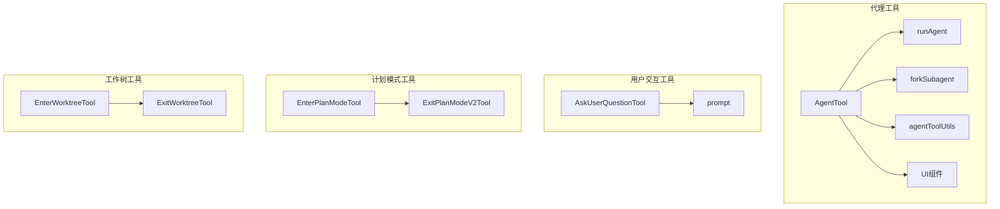
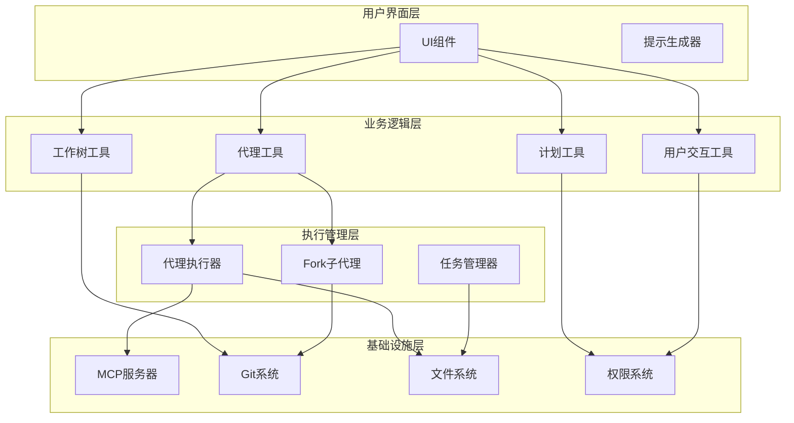
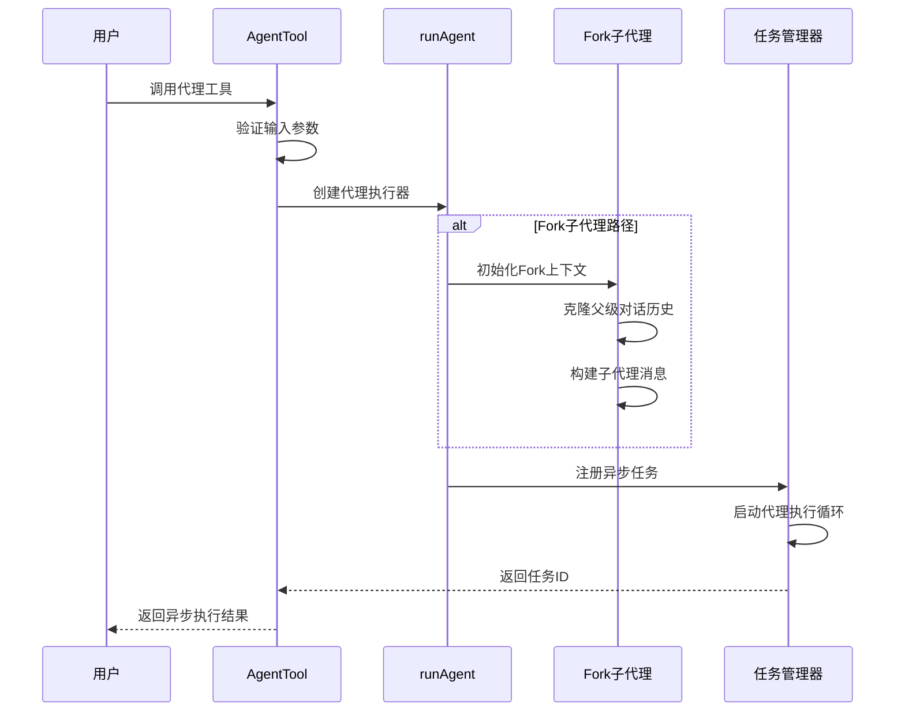
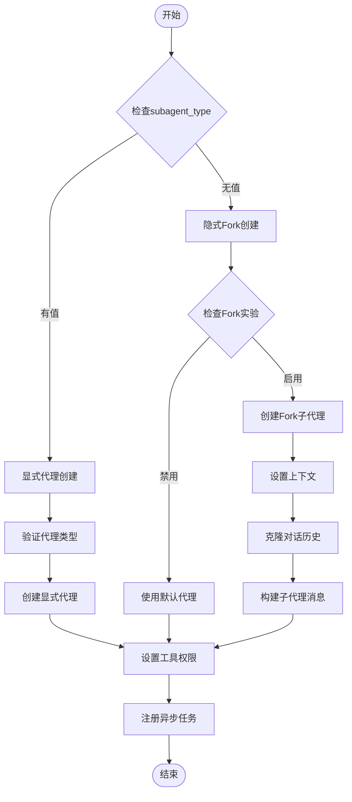
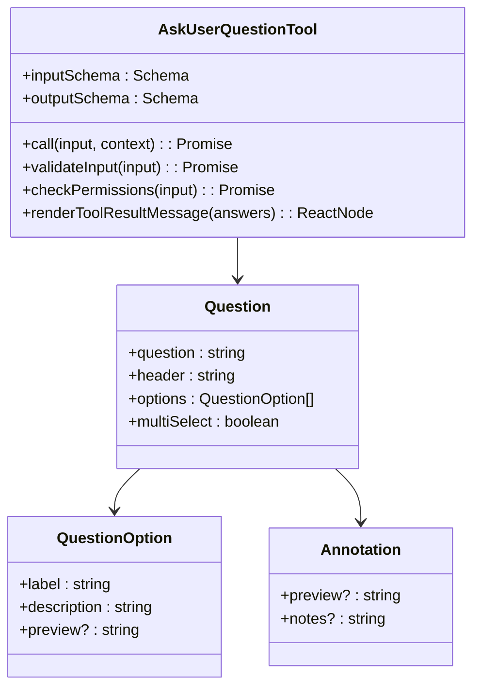
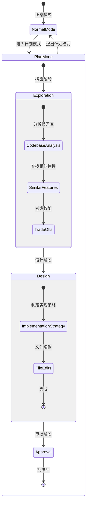
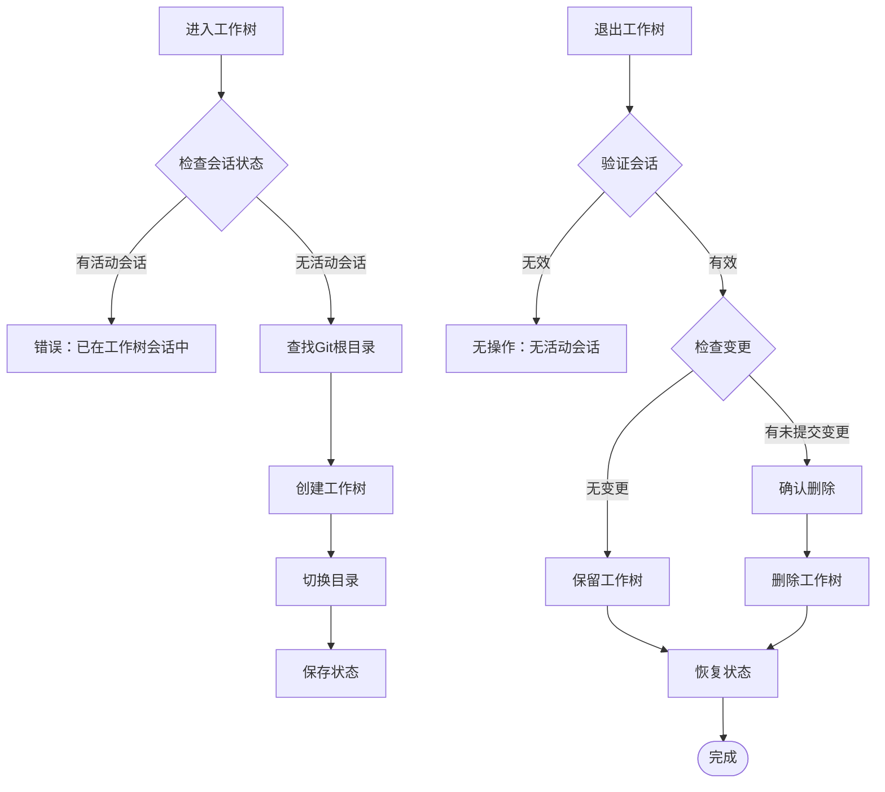
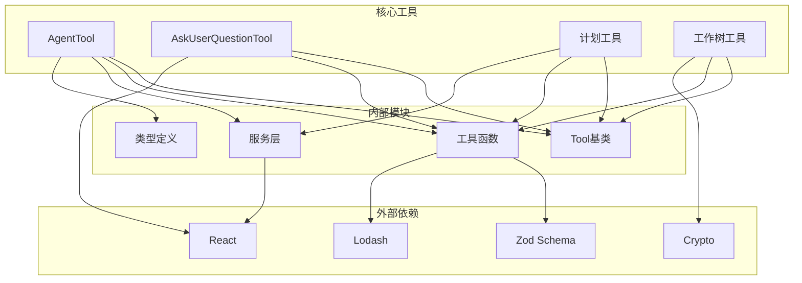

# 代理与计划工具

<cite>
**本文档引用的文件**
- [AgentTool.tsx](file://src/tools/AgentTool/AgentTool.tsx)
- [runAgent.ts](file://src/tools/AgentTool/runAgent.ts)
- [forkSubagent.ts](file://src/tools/AgentTool/forkSubagent.ts)
- [agentToolUtils.ts](file://src/tools/AgentTool/agentToolUtils.ts)
- [UI.tsx](file://src/tools/AgentTool/UI.tsx)
- [AskUserQuestionTool.tsx](file://src/tools/AskUserQuestionTool/AskUserQuestionTool.tsx)
- [prompt.ts](file://src/tools/AskUserQuestionTool/prompt.ts)
- [EnterPlanModeTool.ts](file://src/tools/EnterPlanModeTool/EnterPlanModeTool.ts)
- [ExitPlanModeV2Tool.ts](file://src/tools/ExitPlanModeTool/ExitPlanModeV2Tool.ts)
- [EnterWorktreeTool.ts](file://src/tools/EnterWorktreeTool/EnterWorktreeTool.ts)
- [ExitWorktreeTool.ts](file://src/tools/ExitWorktreeTool/ExitWorktreeTool.ts)
</cite>

## 目录
1. [简介](#简介)
2. [项目结构](#项目结构)
3. [核心组件](#核心组件)
4. [架构概览](#架构概览)
5. [详细组件分析](#详细组件分析)
6. [依赖关系分析](#依赖关系分析)
7. [性能考虑](#性能考虑)
8. [故障排除指南](#故障排除指南)
9. [结论](#结论)

## 简介

Claude Code的代理与计划工具系统是一个强大的多代理协作平台，提供了完整的代理生命周期管理和智能决策支持功能。该系统包含五个核心工具：AgentTool（多代理协作）、AskUserQuestionTool（用户交互决策）、EnterPlanModeTool/ExitPlanModeTool（计划模式切换）以及EnterWorktreeTool/ExitWorktreeTool（工作树管理）。

该系统采用先进的异步代理架构，支持代理间的无缝通信、状态同步和冲突解决机制。通过fork子代理实验，系统实现了统一的任务通知模型，所有代理 spawn 都以异步方式运行，确保了更好的用户体验和资源管理。

## 项目结构

代理与计划工具系统位于 `src/tools/` 目录下，采用模块化设计，每个工具都有独立的功能域：

**图表来源**
- [AgentTool.tsx:1-800](file://src/tools/AgentTool/AgentTool.tsx#L1-L800)
- [AskUserQuestionTool.tsx:1-266](file://src/tools/AskUserQuestionTool/AskUserQuestionTool.tsx#L1-L266)
- [EnterPlanModeTool.ts:1-127](file://src/tools/EnterPlanModeTool/EnterPlanModeTool.ts#L1-L127)
- [EnterWorktreeTool.ts:1-128](file://src/tools/EnterWorktreeTool/EnterWorktreeTool.ts#L1-L128)

**章节来源**
- [AgentTool.tsx:1-800](file://src/tools/AgentTool/AgentTool.tsx#L1-L800)
- [AskUserQuestionTool.tsx:1-266](file://src/tools/AskUserQuestionTool/AskUserQuestionTool.tsx#L1-L266)

## 核心组件

### 多代理协作系统

代理工具系统的核心是 AgentTool，它提供了完整的多代理协作能力：

- **代理类型管理**：支持内置代理和自定义代理的统一管理
- **权限模式控制**：提供多种权限模式（acceptEdits、bypassPermissions、plan、auto）
- **异步代理执行**：所有代理 spawn 默认以异步方式运行
- **工作树隔离**：支持 Git 工作树隔离，确保代理操作的独立性

### 用户交互决策系统

AskUserQuestionTool 提供了智能的用户交互能力：

- **多选题设计**：支持单选和多选问题
- **预览功能**：支持 HTML 和 Markdown 预览内容
- **选项注释**：允许用户添加自由文本注释
- **渠道感知**：自动检测消息渠道并调整行为

### 计划模式管理系统

计划模式工具提供了完整的规划和执行流程：

- **进入计划模式**：切换到只读探索和规划模式
- **退出计划模式**：提交计划进行审批并开始编码
- **权限请求**：支持基于语义的工具权限请求
- **团队协作**：支持团队成员间的计划审批

### 工作树管理系统

工作树工具提供了代码隔离和版本控制能力：

- **工作树创建**：在 Git 仓库中创建隔离的工作树
- **上下文切换**：在工作树之间安全切换
- **变更管理**：支持保留或删除工作树中的更改
- **会话状态**：维护工作树会话的完整状态

**章节来源**
- [AgentTool.tsx:239-800](file://src/tools/AgentTool/AgentTool.tsx#L239-L800)
- [AskUserQuestionTool.tsx:109-245](file://src/tools/AskUserQuestionTool/AskUserQuestionTool.tsx#L109-L245)

## 架构概览

代理与计划工具系统采用分层架构设计，确保了良好的可扩展性和维护性：

**图表来源**
- [runAgent.ts:248-800](file://src/tools/AgentTool/runAgent.ts#L248-L800)
- [forkSubagent.ts:1-211](file://src/tools/AgentTool/forkSubagent.ts#L1-L211)

## 详细组件分析

### AgentTool 组件分析

AgentTool 是整个代理系统的核心，负责多代理协作机制的实现：

#### 多代理协作机制

**图表来源**
- [AgentTool.tsx:239-800](file://src/tools/AgentTool/AgentTool.tsx#L239-L800)
- [runAgent.ts:248-800](file://src/tools/AgentTool/runAgent.ts#L248-L800)

#### 子代理创建和管理

AgentTool 支持两种子代理创建模式：

1. **显式代理类型**：通过 `subagent_type` 参数指定特定代理类型
2. **Fork子代理**：当省略 `subagent_type` 时，使用隐式 fork 模式

**图表来源**
- [AgentTool.tsx:318-364](file://src/tools/AgentTool/AgentTool.tsx#L318-L364)
- [forkSubagent.ts:107-169](file://src/tools/AgentTool/forkSubagent.ts#L107-L169)

#### 代理间通信协议

代理系统实现了完善的通信协议：

- **消息传递**：通过标准化的消息格式在代理间传递信息
- **状态同步**：维护代理间的共享状态和上下文
- **权限继承**：子代理继承父代理的权限设置
- **工具池管理**：动态组装代理可用的工具集合

**章节来源**
- [AgentTool.tsx:196-800](file://src/tools/AgentTool/AgentTool.tsx#L196-L800)
- [runAgent.ts:48-800](file://src/tools/AgentTool/runAgent.ts#L48-L800)

### AskUserQuestionTool 组件分析

AskUserQuestionTool 提供了智能的用户交互决策支持：

#### 用户交互设计

**图表来源**
- [AskUserQuestionTool.tsx:14-82](file://src/tools/AskUserQuestionTool/AskUserQuestionTool.tsx#L14-L82)

#### 决策支持机制

AskUserQuestionTool 实现了多层次的决策支持：

- **选项设计**：提供清晰的选项标签和描述
- **预览功能**：支持视觉比较的预览内容
- **注释收集**：允许用户添加自由文本注释
- **渠道适配**：根据消息渠道调整交互方式

**章节来源**
- [AskUserQuestionTool.tsx:109-245](file://src/tools/AskUserQuestionTool/AskUserQuestionTool.tsx#L109-L245)
- [prompt.ts:1-45](file://src/tools/AskUserQuestionTool/prompt.ts#L1-L45)

### 计划模式工具组件分析

计划模式工具提供了完整的规划和执行流程：

#### 计划模式切换机制

**图表来源**
- [EnterPlanModeTool.ts:77-102](file://src/tools/EnterPlanModeTool/EnterPlanModeTool.ts#L77-L102)
- [ExitPlanModeV2Tool.ts:243-418](file://src/tools/ExitPlanModeTool/ExitPlanModeV2Tool.ts#L243-L418)

#### 思考过程和决策树构建

计划模式下的思考过程遵循严格的决策树构建：

1. **代码库探索**：深入了解现有模式和架构
2. **方案设计**：考虑多种方法及其权衡
3. **用户咨询**：使用 AskUserQuestionTool 获取必要信息
4. **策略制定**：设计具体的实现策略
5. **审批流程**：提交计划等待批准

**章节来源**
- [EnterPlanModeTool.ts:77-126](file://src/tools/EnterPlanModeTool/EnterPlanModeTool.ts#L77-L126)
- [ExitPlanModeV2Tool.ts:419-493](file://src/tools/ExitPlanModeTool/ExitPlanModeV2Tool.ts#L419-L493)

### 工作树管理工具组件分析

工作树工具提供了代码隔离和版本控制能力：

#### 工作树管理流程

**图表来源**
- [EnterWorktreeTool.ts:77-119](file://src/tools/EnterWorktreeTool/EnterWorktreeTool.ts#L77-L119)
- [ExitWorktreeTool.ts:174-321](file://src/tools/ExitWorktreeTool/ExitWorktreeTool.ts#L174-L321)

#### 工作树隔离机制

工作树工具实现了安全的代码隔离：

- **Git集成**：与 Git 系统深度集成，确保版本控制一致性
- **路径转换**：处理父子代理间的路径差异
- **变更检测**：自动检测工作树中的文件变更
- **状态管理**：维护工作树会话的完整状态信息

**章节来源**
- [EnterWorktreeTool.ts:77-128](file://src/tools/EnterWorktreeTool/EnterWorktreeTool.ts#L77-L128)
- [ExitWorktreeTool.ts:174-330](file://src/tools/ExitWorktreeTool/ExitWorktreeTool.ts#L174-L330)

## 依赖关系分析

代理与计划工具系统具有清晰的依赖关系结构：

**图表来源**
- [AgentTool.tsx:1-50](file://src/tools/AgentTool/AgentTool.tsx#L1-L50)
- [AskUserQuestionTool.tsx:1-15](file://src/tools/AskUserQuestionTool/AskUserQuestionTool.tsx#L1-L15)

**章节来源**
- [agentToolUtils.ts:1-687](file://src/tools/AgentTool/agentToolUtils.ts#L1-L687)
- [UI.tsx:1-800](file://src/tools/AgentTool/UI.tsx#L1-L800)

## 性能考虑

代理与计划工具系统在设计时充分考虑了性能优化：

### 异步执行优化

- **后台代理执行**：所有代理 spawn 默认以异步方式运行，避免阻塞主进程
- **缓存共享**：fork 子代理通过精确的 API 请求前缀实现 prompt 缓存共享
- **内存管理**：智能的内存缓存管理和清理机制

### 资源管理优化

- **工作树隔离**：通过 Git 工作树实现代码隔离，减少资源冲突
- **权限控制**：细粒度的权限控制系统，防止不必要的资源访问
- **工具池优化**：动态组装代理可用工具，避免加载不必要工具

### 性能监控

- **进度跟踪**：实时跟踪代理执行进度和资源使用情况
- **统计分析**：收集详细的性能统计数据用于优化
- **错误处理**：完善的错误处理和恢复机制

## 故障排除指南

### 常见问题和解决方案

#### 代理启动失败

**问题症状**：代理无法启动或立即失败

**可能原因**：
- 权限不足
- 工具不可用
- 网络连接问题

**解决方案**：
1. 检查代理权限设置
2. 验证所需工具是否可用
3. 确认网络连接正常

#### 工作树操作异常

**问题症状**：工作树创建或删除失败

**可能原因**：
- Git 状态不一致
- 权限问题
- 文件锁定

**解决方案**：
1. 检查 Git 状态和分支
2. 确认有足够的文件系统权限
3. 关闭可能锁定文件的应用程序

#### 计划模式问题

**问题症状**：计划模式切换异常

**可能原因**：
- 渠道限制
- 权限不足
- 状态冲突

**解决方案**：
1. 检查消息渠道设置
2. 验证用户权限
3. 确认当前状态兼容性

**章节来源**
- [AgentTool.tsx:262-280](file://src/tools/AgentTool/AgentTool.tsx#L262-L280)
- [ExitWorktreeTool.ts:174-224](file://src/tools/ExitWorktreeTool/ExitWorktreeTool.ts#L174-L224)

## 结论

Claude Code的代理与计划工具系统是一个功能强大、设计精良的多代理协作平台。该系统通过以下关键特性实现了高效的代理管理和智能决策支持：

### 核心优势

1. **灵活的代理架构**：支持多种代理类型和权限模式
2. **智能用户交互**：提供直观的决策支持工具
3. **安全的工作隔离**：通过工作树实现代码隔离
4. **统一的任务管理**：所有代理 spawn 采用统一的异步执行模型

### 技术创新

- **Fork子代理实验**：实现了统一的任务通知模型
- **权限继承机制**：确保代理间的权限一致性
- **状态同步系统**：维护代理间的共享状态
- **冲突解决机制**：处理代理间的资源竞争

### 应用场景

该系统适用于各种复杂的开发场景，包括但不限于：
- 大规模代码重构
- 多团队协作项目
- 自动化代码生成
- 智能代码审查

通过持续的优化和改进，该系统将继续为开发者提供强大而易用的代理协作能力。