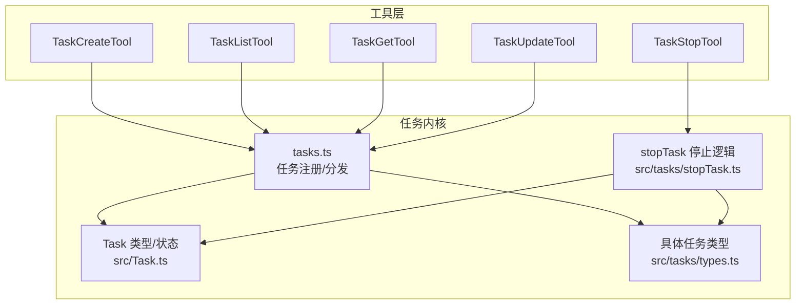
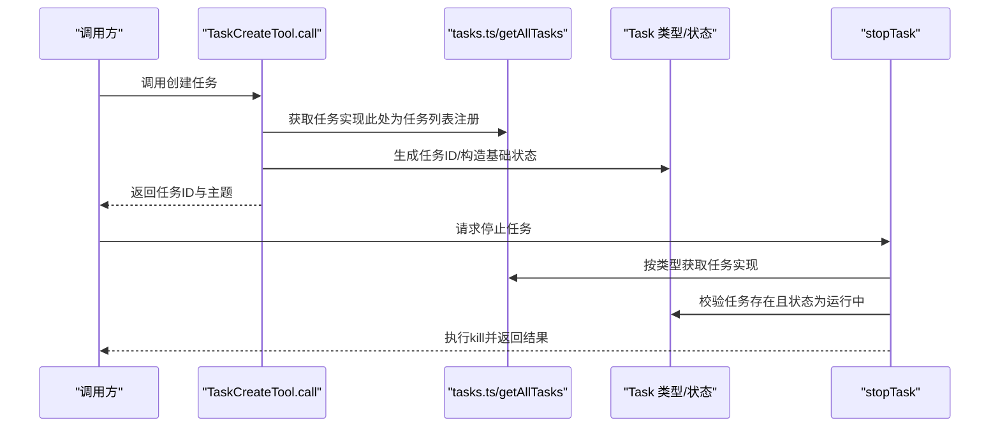
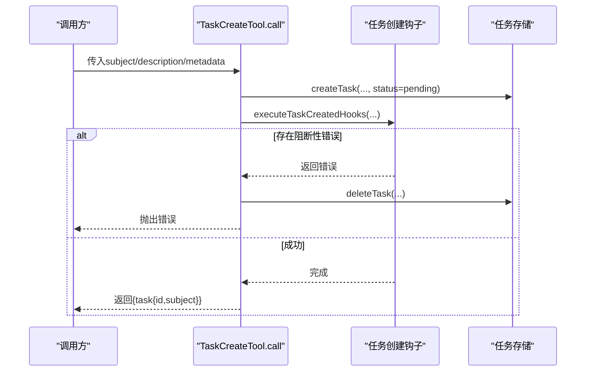
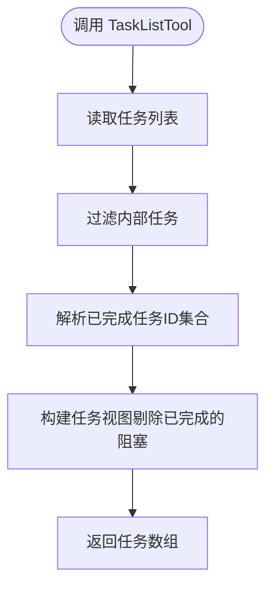
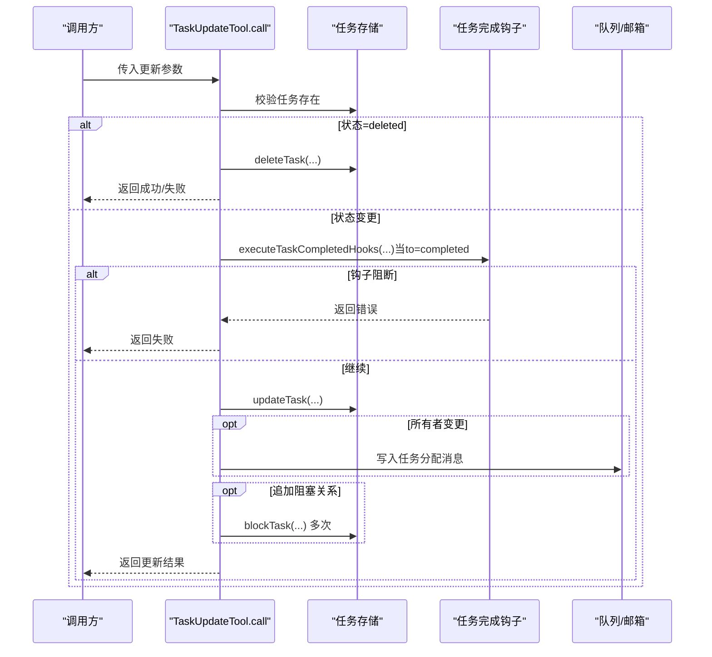
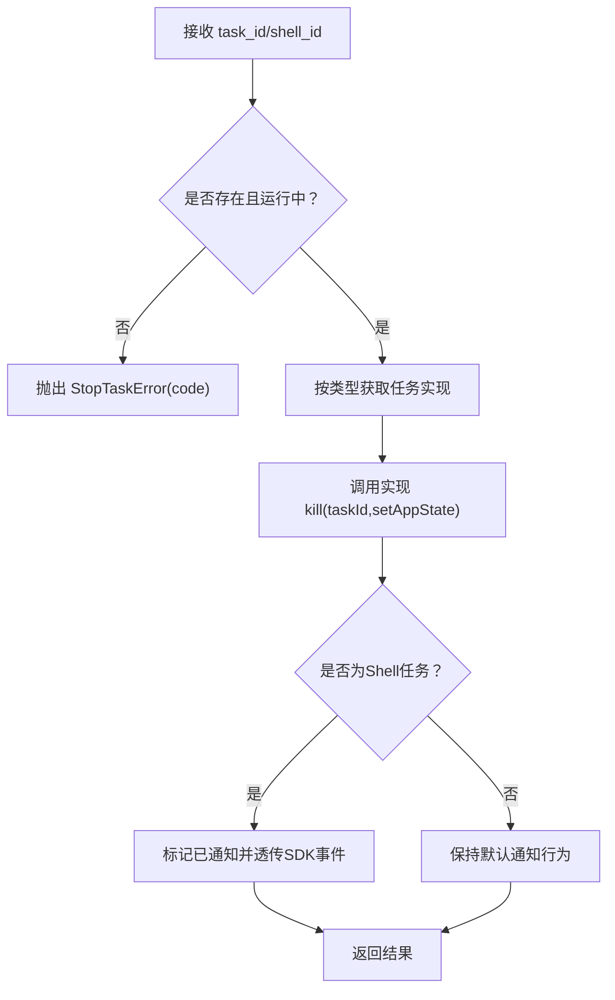
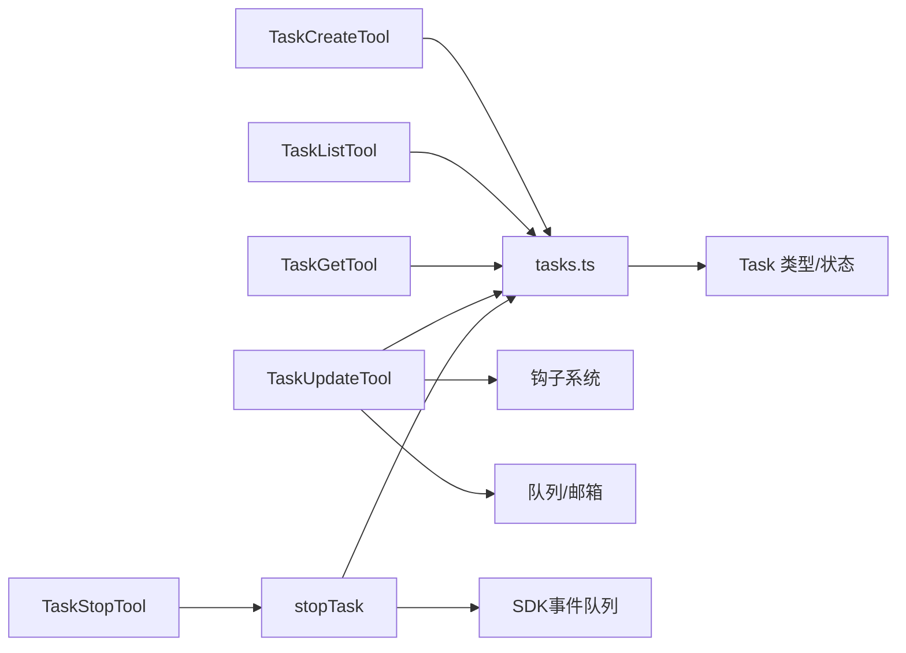

# 任务管理工具

<cite>
**本文引用的文件**
- [src/Task.ts](file://src/Task.ts)
- [src/tasks.ts](file://src/tasks.ts)
- [src/tasks/types.ts](file://src/tasks/types.ts)
- [src/tasks/stopTask.ts](file://src/tasks/stopTask.ts)
- [src/tools/TaskCreateTool/TaskCreateTool.ts](file://src/tools/TaskCreateTool/TaskCreateTool.ts)
- [src/tools/TaskListTool/TaskListTool.ts](file://src/tools/TaskListTool/TaskListTool.ts)
- [src/tools/TaskGetTool/TaskGetTool.ts](file://src/tools/TaskGetTool/TaskGetTool.ts)
- [src/tools/TaskUpdateTool/TaskUpdateTool.ts](file://src/tools/TaskUpdateTool/TaskUpdateTool.ts)
- [src/tools/TaskStopTool/TaskStopTool.ts](file://src/tools/TaskStopTool/TaskStopTool.ts)
</cite>

## 目录
1. [简介](#简介)
2. [项目结构](#项目结构)
3. [核心组件](#核心组件)
4. [架构总览](#架构总览)
5. [详细组件分析](#详细组件分析)
6. [依赖分析](#依赖分析)
7. [性能考虑](#性能考虑)
8. [故障排除指南](#故障排除指南)
9. [结论](#结论)
10. [附录](#附录)

## 简介
本文件面向Claude Code的任务管理工具链，系统性梳理TaskCreateTool、TaskListTool、TaskGetTool、TaskUpdateTool、TaskStopTool五大工具的功能特性、输入输出、调用流程与错误处理，并结合底层任务类型、状态机与生命周期管理，给出依赖关系、优先级与资源分配策略、最佳实践、性能优化建议与故障排除指引。文档同时提供可操作的任务创建、执行与监控示例路径，帮助开发者与使用者快速上手并稳定落地。

## 项目结构
围绕任务管理的核心代码分布在以下位置：
- 任务类型与状态：src/Task.ts 定义任务类型枚举、状态枚举、基础状态字段与任务ID生成器；src/tasks/types.ts 定义具体任务状态联合类型与“后台任务”判定逻辑。
- 任务实现注册与分发：src/tasks.ts 提供任务集合与按类型获取任务实现的能力。
- 停止任务通用逻辑：src/tasks/stopTask.ts 提供统一的停止流程与错误分类。
- 工具层（对外接口）：src/tools/TaskCreateTool、TaskListTool、TaskGetTool、TaskUpdateTool、TaskStopTool 分别封装了创建、列出、查询、更新、停止任务的工具定义与调用逻辑。

图表来源
- [src/tools/TaskCreateTool/TaskCreateTool.ts:1-139](file://src/tools/TaskCreateTool/TaskCreateTool.ts#L1-L139)
- [src/tools/TaskListTool/TaskListTool.ts:1-117](file://src/tools/TaskListTool/TaskListTool.ts#L1-L117)
- [src/tools/TaskGetTool/TaskGetTool.ts:1-129](file://src/tools/TaskGetTool/TaskGetTool.ts#L1-L129)
- [src/tools/TaskUpdateTool/TaskUpdateTool.ts:1-407](file://src/tools/TaskUpdateTool/TaskUpdateTool.ts#L1-L407)
- [src/tools/TaskStopTool/TaskStopTool.ts:1-132](file://src/tools/TaskStopTool/TaskStopTool.ts#L1-L132)
- [src/tasks.ts:1-40](file://src/tasks.ts#L1-L40)
- [src/Task.ts:1-126](file://src/Task.ts#L1-L126)
- [src/tasks/types.ts:1-47](file://src/tasks/types.ts#L1-L47)
- [src/tasks/stopTask.ts:1-101](file://src/tasks/stopTask.ts#L1-L101)

章节来源
- [src/Task.ts:1-126](file://src/Task.ts#L1-L126)
- [src/tasks.ts:1-40](file://src/tasks.ts#L1-L40)
- [src/tasks/types.ts:1-47](file://src/tasks/types.ts#L1-L47)
- [src/tasks/stopTask.ts:1-101](file://src/tasks/stopTask.ts#L1-L101)

## 核心组件
- 任务类型与状态
  - 任务类型：本地Shell、本地Agent、远程Agent、进程内伙伴、本地工作流、MCP监控、梦境任务等。
  - 任务状态：待定、运行中、已完成、失败、被终止（含终端态判断）。
  - 基础状态字段：包含任务ID、类型、状态、描述、关联toolUseId、开始/结束时间、输出文件路径与偏移、是否已通知等。
  - 任务ID生成：基于类型前缀与随机字符组合，确保兼容性与抗碰撞能力。
- 任务实现注册与分发
  - getAllTasks 返回当前可用任务实现数组；getTaskByType 按类型查找对应实现，用于后续kill等操作。
- 停止任务通用逻辑
  - 校验任务存在与状态为“运行中”，根据类型获取实现并调用kill，对特定类型抑制噪声通知并透传SDK事件。

章节来源
- [src/Task.ts:6-126](file://src/Task.ts#L6-L126)
- [src/tasks.ts:17-40](file://src/tasks.ts#L17-L40)
- [src/tasks/stopTask.ts:31-101](file://src/tasks/stopTask.ts#L31-L101)

## 架构总览
从工具到任务内核的调用路径如下：

图表来源
- [src/tools/TaskCreateTool/TaskCreateTool.ts:80-129](file://src/tools/TaskCreateTool/TaskCreateTool.ts#L80-L129)
- [src/tasks.ts:22-39](file://src/tasks.ts#L22-L39)
- [src/tasks/stopTask.ts:38-100](file://src/tasks/stopTask.ts#L38-L100)
- [src/Task.ts:44-57](file://src/Task.ts#L44-L57)

## 详细组件分析

### TaskCreateTool（任务创建）
- 功能概述
  - 接收主题、描述、活动形态、元数据等参数，创建一个状态为“待定”的任务。
  - 创建后触发“任务已创建”钩子，若出现阻断性错误则回滚删除任务。
  - 自动展开任务视图以便用户可见。
- 输入/输出要点
  - 输入：subject、description、activeForm（进行时形态）、metadata（任意键值对）。
  - 输出：包含任务ID与主题的对象。
- 关键流程
  - 调用任务存储创建任务，随后遍历钩子生成器收集阻断性消息，必要时删除任务并抛错。
  - 更新应用状态以展开任务视图。
- 使用建议
  - 在批量创建或自动化场景下，建议先校验元数据键值，避免后续钩子阻断。
  - 若需立即进入执行阶段，可在创建后通过TaskUpdateTool将状态置为“进行中”。

图表来源
- [src/tools/TaskCreateTool/TaskCreateTool.ts:80-129](file://src/tools/TaskCreateTool/TaskCreateTool.ts#L80-L129)

章节来源
- [src/tools/TaskCreateTool/TaskCreateTool.ts:1-139](file://src/tools/TaskCreateTool/TaskCreateTool.ts#L1-L139)

### TaskListTool（任务列表）
- 功能概述
  - 列出所有非内部标记的任务，过滤掉已完成但未解析的阻塞项，返回任务简要信息。
  - 只读工具，适合定期轮询或作为下一步动作的输入。
- 输入/输出要点
  - 输入：无。
  - 输出：任务数组，包含ID、主题、状态、所有者、被哪些任务阻塞。
- 使用建议
  - 结合TaskGetTool获取详情，再用TaskUpdateTool进行状态推进或添加阻塞关系。
  - 可用于构建“下一个可执行任务”的筛选逻辑。

图表来源
- [src/tools/TaskListTool/TaskListTool.ts:65-90](file://src/tools/TaskListTool/TaskListTool.ts#L65-L90)

章节来源
- [src/tools/TaskListTool/TaskListTool.ts:1-117](file://src/tools/TaskListTool/TaskListTool.ts#L1-L117)

### TaskGetTool（任务详情）
- 功能概述
  - 根据任务ID精确查询任务详情，包括阻塞与被阻塞关系。
  - 若任务不存在返回空对象，便于上层容错。
- 输入/输出要点
  - 输入：taskId。
  - 输出：任务详情对象（可能为空）。
- 使用建议
  - 在执行任何变更前，先用TaskGetTool确认当前状态与依赖关系，避免误操作。

章节来源
- [src/tools/TaskGetTool/TaskGetTool.ts:1-129](file://src/tools/TaskGetTool/TaskGetTool.ts#L1-L129)

### TaskUpdateTool（任务更新）
- 功能概述
  - 支持更新主题、描述、活动形态、所有者、元数据、状态等字段。
  - 特殊状态“deleted”直接删除任务文件。
  - 标记为“已完成”时触发“任务完成”钩子，若出现阻断性错误则拒绝变更。
  - 当状态从非“进行中”变为“进行中”且启用Agent Swarms时，自动补全所有者。
  - 更改所有者时通过邮箱通道通知目标成员。
  - 可追加阻塞关系（blocks 与 blockedBy），去重后写入。
  - 在满足条件时附加“验证提醒”提示。
- 输入/输出要点
  - 输入：taskId + 可选字段（subject/description/activeForm/status/owner/metadata/addBlocks/addBlockedBy）。
  - 输出：success、taskId、updatedFields、statusChange（如有）、verificationNudgeNeeded（内部特性）。
- 使用建议
  - 优先使用“进行中”推动任务，完成后使用“已完成”触发钩子与清理。
  - 添加阻塞关系时注意双向一致性，避免循环阻塞。
  - 元数据更新支持键为null时删除该键，便于增量维护。

图表来源
- [src/tools/TaskUpdateTool/TaskUpdateTool.ts:123-363](file://src/tools/TaskUpdateTool/TaskUpdateTool.ts#L123-L363)

章节来源
- [src/tools/TaskUpdateTool/TaskUpdateTool.ts:1-407](file://src/tools/TaskUpdateTool/TaskUpdateTool.ts#L1-L407)

### TaskStopTool（任务停止）
- 功能概述
  - 基于任务ID停止运行中的任务，支持旧版shell_id参数兼容。
  - 校验任务存在且状态为“运行中”，否则抛出带code的StopTaskError。
  - 通过任务类型分发到具体实现的kill逻辑，对Shell类任务抑制噪声通知并透传SDK事件。
- 输入/输出要点
  - 输入：task_id 或已废弃的shell_id。
  - 输出：包含消息、任务ID、任务类型、命令描述等。
- 使用建议
  - 仅对“运行中”任务调用；如需中断，请先确认任务状态。
  - 对Shell任务停止后不会产生“退出码137”噪音通知，便于自动化集成。

图表来源
- [src/tools/TaskStopTool/TaskStopTool.ts:60-130](file://src/tools/TaskStopTool/TaskStopTool.ts#L60-L130)
- [src/tasks/stopTask.ts:38-100](file://src/tasks/stopTask.ts#L38-L100)

章节来源
- [src/tools/TaskStopTool/TaskStopTool.ts:1-132](file://src/tools/TaskStopTool/TaskStopTool.ts#L1-L132)
- [src/tasks/stopTask.ts:1-101](file://src/tasks/stopTask.ts#L1-L101)

## 依赖分析
- 组件耦合
  - 工具层通过tasks.ts间接依赖Task类型与状态定义，保证跨工具的一致性。
  - TaskStopTool/stopTask依赖任务类型分发，避免在工具层硬编码类型分支。
- 外部依赖与集成点
  - 钩子系统：TaskCreateTool/TaskUpdateTool在关键节点触发钩子，用于扩展业务规则。
  - 队列/邮箱：TaskUpdateTool在所有权变更时写入队列，实现跨Agent通知。
  - SDK事件：stopTask对Shell任务透传“任务终止”事件，保障外部监听器可见。
- 循环依赖风险
  - 通过延迟导入与运行时分发降低耦合，避免直接相互引用。

图表来源
- [src/tools/TaskCreateTool/TaskCreateTool.ts:1-139](file://src/tools/TaskCreateTool/TaskCreateTool.ts#L1-L139)
- [src/tools/TaskListTool/TaskListTool.ts:1-117](file://src/tools/TaskListTool/TaskListTool.ts#L1-L117)
- [src/tools/TaskGetTool/TaskGetTool.ts:1-129](file://src/tools/TaskGetTool/TaskGetTool.ts#L1-L129)
- [src/tools/TaskUpdateTool/TaskUpdateTool.ts:1-407](file://src/tools/TaskUpdateTool/TaskUpdateTool.ts#L1-L407)
- [src/tools/TaskStopTool/TaskStopTool.ts:1-132](file://src/tools/TaskStopTool/TaskStopTool.ts#L1-L132)
- [src/tasks.ts:1-40](file://src/tasks.ts#L1-L40)
- [src/Task.ts:1-126](file://src/Task.ts#L1-L126)
- [src/tasks/stopTask.ts:1-101](file://src/tasks/stopTask.ts#L1-L101)

章节来源
- [src/tasks.ts:1-40](file://src/tasks.ts#L1-L40)
- [src/Task.ts:1-126](file://src/Task.ts#L1-L126)
- [src/tasks/stopTask.ts:1-101](file://src/tasks/stopTask.ts#L1-L101)

## 性能考虑
- 并发安全
  - 所有任务管理工具声明并发安全，适合在多Agent/多线程环境下并行调用。
- I/O与存储
  - 任务列表与详情查询为只读，建议缓存近期结果，减少重复I/O。
  - 批量更新时合并字段变更，避免多次写入。
- 通知与噪音
  - 停止Shell任务时抑制噪声通知，降低UI抖动与日志压力。
- 资源占用
  - 仅对“运行中/待定”的任务计入后台任务指示器，避免无关任务干扰。
- 依赖关系
  - 通过去重与集合化（如已完成任务ID集合）降低过滤成本。

## 故障排除指南
- 常见错误与定位
  - 任务停止失败（not_found）：检查任务ID是否正确或已被清理。
  - 任务停止失败（not_running）：确认任务当前状态为“运行中”。
  - 任务停止失败（unsupported_type）：确认任务类型受支持且已注册。
  - 任务更新失败（钩子阻断）：查看钩子返回的阻断性消息，修正前置条件。
- 排查步骤
  - 使用TaskGetTool确认任务状态与依赖。
  - 使用TaskListTool确认任务是否被过滤（内部标记）。
  - 对Shell任务停止后，关注SDK事件是否到达监听端。
- 建议
  - 在自动化脚本中捕获StopTaskError并区分错误码，分别处理。
  - 对元数据更新采用幂等策略（键为null删除），避免反复冲突。

章节来源
- [src/tasks/stopTask.ts:10-18](file://src/tasks/stopTask.ts#L10-L18)
- [src/tools/TaskStopTool/TaskStopTool.ts:60-91](file://src/tools/TaskStopTool/TaskStopTool.ts#L60-L91)
- [src/tools/TaskUpdateTool/TaskUpdateTool.ts:232-265](file://src/tools/TaskUpdateTool/TaskUpdateTool.ts#L232-L265)

## 结论
本文档系统化梳理了Claude Code任务管理工具链：从任务类型与状态、实现注册与分发，到五大工具的输入输出与调用流程，并结合停止逻辑与钩子/队列/SDK事件等扩展点，给出了依赖关系、优先级与资源分配策略、最佳实践与故障排除建议。遵循本文档的流程与建议，可在复杂多Agent场景中稳定地创建、推进、监控与终止任务。

## 附录
- 任务生命周期与状态跟踪
  - 生命周期：创建（待定）→推进（进行中）→完成/失败/终止→清理。
  - 状态跟踪：通过基础状态字段记录开始/结束时间、输出文件与偏移、是否通知等，便于审计与恢复。
- 依赖关系与优先级
  - 依赖：通过blocks/blockedBy建立单向依赖，避免循环阻塞。
  - 优先级：建议以“未阻塞且状态为待定/进行中”的任务优先执行；对关键路径任务可设置元数据标识。
- 资源分配策略
  - 对Agent Swarms启用时，自动补全所有者，便于可视化与负载均衡。
  - 对Shell任务停止时抑制噪声通知，提升自动化稳定性。
- 示例路径（不含代码内容）
  - 创建任务：参考 [src/tools/TaskCreateTool/TaskCreateTool.ts:80-129](file://src/tools/TaskCreateTool/TaskCreateTool.ts#L80-L129)
  - 查询任务：参考 [src/tools/TaskGetTool/TaskGetTool.ts:73-98](file://src/tools/TaskGetTool/TaskGetTool.ts#L73-L98)
  - 列出任务：参考 [src/tools/TaskListTool/TaskListTool.ts:65-90](file://src/tools/TaskListTool/TaskListTool.ts#L65-L90)
  - 更新任务：参考 [src/tools/TaskUpdateTool/TaskUpdateTool.ts:123-363](file://src/tools/TaskUpdateTool/TaskUpdateTool.ts#L123-L363)
  - 停止任务：参考 [src/tools/TaskStopTool/TaskStopTool.ts:107-130](file://src/tools/TaskStopTool/TaskStopTool.ts#L107-L130)