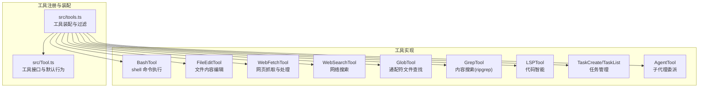
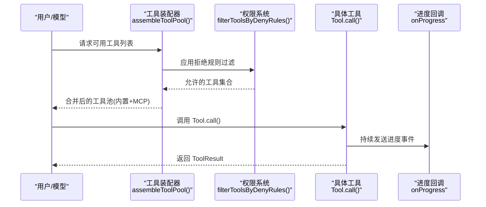
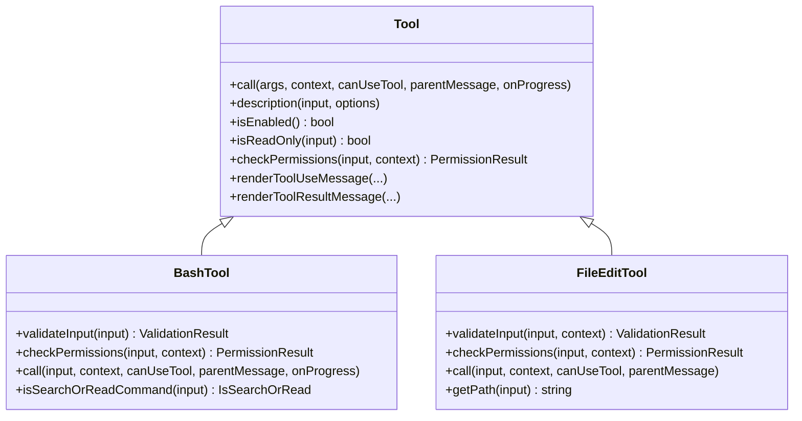
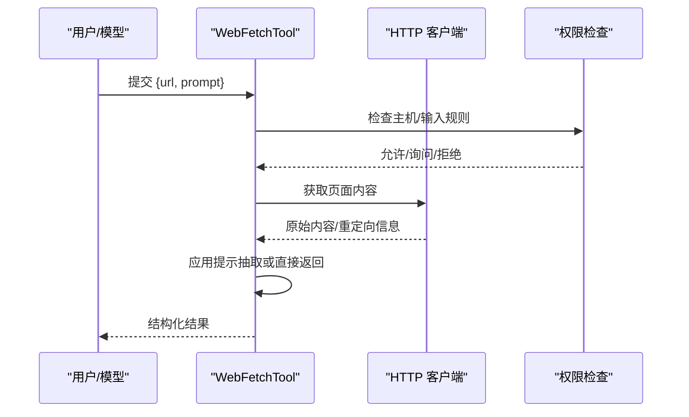
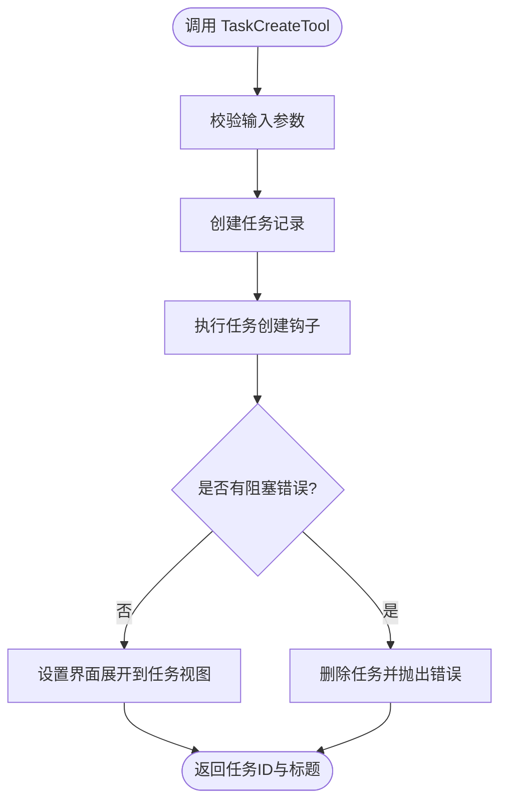
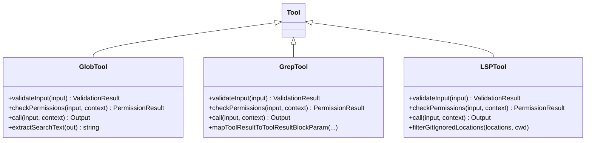
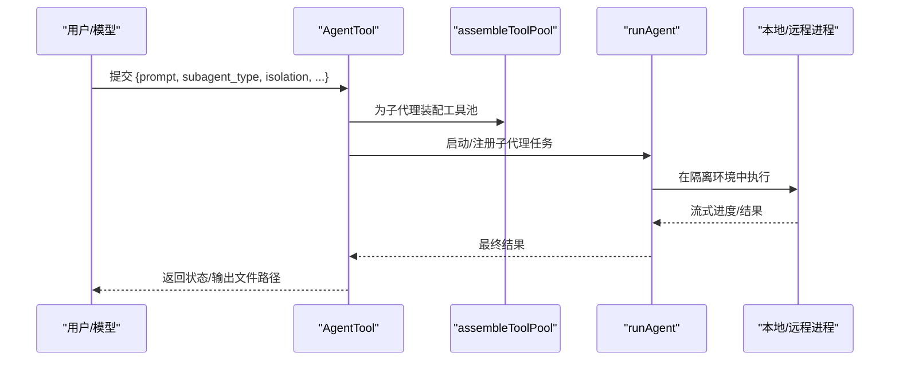
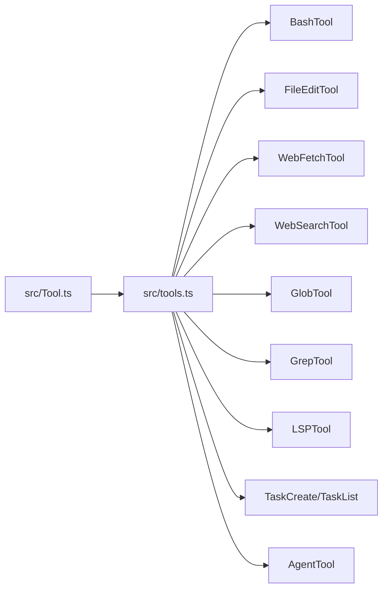

# 内置工具详解

<cite>
**本文档引用的文件**
- [src/tools.ts](file://src/tools.ts)
- [src/Tool.ts](file://src/Tool.ts)
- [src/tools/BashTool/BashTool.tsx](file://src/tools/BashTool/BashTool.tsx)
- [src/tools/FileEditTool/FileEditTool.ts](file://src/tools/FileEditTool/FileEditTool.ts)
- [src/tools/WebFetchTool/WebFetchTool.ts](file://src/tools/WebFetchTool/WebFetchTool.ts)
- [src/tools/WebSearchTool/WebSearchTool.ts](file://src/tools/WebSearchTool/WebSearchTool.ts)
- [src/tools/GlobTool/GlobTool.ts](file://src/tools/GlobTool/GlobTool.ts)
- [src/tools/GrepTool/GrepTool.ts](file://src/tools/GrepTool/GrepTool.ts)
- [src/tools/LSPTool/LSPTool.ts](file://src/tools/LSPTool/LSPTool.ts)
- [src/tools/TaskCreateTool/TaskCreateTool.ts](file://src/tools/TaskCreateTool/TaskCreateTool.ts)
- [src/tools/TaskListTool/TaskListTool.ts](file://src/tools/TaskListTool/TaskListTool.ts)
- [src/tools/AgentTool/AgentTool.tsx](file://src/tools/AgentTool/AgentTool.tsx)
</cite>

## 目录
1. [简介](#简介)
2. [项目结构](#项目结构)
3. [核心组件](#核心组件)
4. [架构总览](#架构总览)
5. [详细组件分析](#详细组件分析)
6. [依赖分析](#依赖分析)
7. [性能考虑](#性能考虑)
8. [故障排除指南](#故障排除指南)
9. [结论](#结论)

## 简介
本文件为 Claude Code 的内置工具系统提供全面技术文档，覆盖 40 多种内置工具的功能分类、架构设计、实现原理、依赖关系与协作机制，并给出最佳实践、性能优化建议与安全注意事项。工具体系以统一的 Tool 接口为核心，通过集中装配器按权限上下文动态组合内置工具与 MCP 工具，形成可扩展、可缓存、可安全控制的工具池。

## 项目结构
内置工具主要位于 `src/tools/` 目录下，每个工具以独立子目录组织，包含工具实现、UI 渲染、权限校验、提示词与类型定义。工具注册与装配逻辑集中在 `src/tools.ts`，通用接口定义在 `src/Tool.ts`。

**图表来源**
- [src/tools.ts:193-251](file://src/tools.ts#L193-L251)
- [src/Tool.ts:362-695](file://src/Tool.ts#L362-L695)

**章节来源**
- [src/tools.ts:1-390](file://src/tools.ts#L1-L390)
- [src/Tool.ts:1-793](file://src/Tool.ts#L1-L793)

## 核心组件
- 工具接口与默认行为：所有工具遵循统一的 Tool 接口，支持输入/输出模式、并发安全、只读/破坏性标记、权限检查、进度回调、结果渲染等能力。未显式实现的方法采用安全默认值（如只读、非并发安全）。
- 工具装配器：根据权限上下文、特性开关、环境变量与运行模式，动态组装内置工具集合；支持 MCP 工具注入与去重合并；保证提示词缓存稳定性。
- 权限系统：基于规则的工具/路径/主机名级权限控制，支持允许/拒绝/询问三种策略，以及输入级匹配器与拒绝规则过滤。

**章节来源**
- [src/Tool.ts:362-695](file://src/Tool.ts#L362-L695)
- [src/tools.ts:262-367](file://src/tools.ts#L262-L367)

## 架构总览
工具系统采用“接口统一 + 装配器 + 权限过滤 + MCP 扩展”的分层架构：

**图表来源**
- [src/tools.ts:345-367](file://src/tools.ts#L345-L367)
- [src/tools.ts:262-269](file://src/tools.ts#L262-L269)

**章节来源**
- [src/tools.ts:345-367](file://src/tools.ts#L345-L367)

## 详细组件分析

### 文件操作工具
- BashTool：执行 shell 命令，支持自动后台化、只读约束、沙箱检测、大输出持久化、进度流与错误语义化解读。具备丰富的命令分类（搜索/读取/列出）用于 UI 折叠显示。
- FileEditTool：在读取一致性检查基础上进行原子写入，支持引用样式保留、变更通知、LSP 诊断清理与 VS Code 差异展示。
- FileReadTool：文件读取限制、编码检测、行尾识别与历史记录更新。
- FileWriteTool：文件写入工具（与编辑工具互补）。

**图表来源**
- [src/Tool.ts:362-695](file://src/Tool.ts#L362-L695)
- [src/tools/BashTool/BashTool.tsx:420-800](file://src/tools/BashTool/BashTool.tsx#L420-L800)
- [src/tools/FileEditTool/FileEditTool.ts:86-595](file://src/tools/FileEditTool/FileEditTool.ts#L86-L595)

**章节来源**
- [src/tools/BashTool/BashTool.tsx:420-800](file://src/tools/BashTool/BashTool.tsx#L420-L800)
- [src/tools/FileEditTool/FileEditTool.ts:86-595](file://src/tools/FileEditTool/FileEditTool.ts#L86-L595)

### 网络工具
- WebFetchTool：从 URL 抓取内容并应用提示进行抽取，支持预批准主机、重定向检测与二进制内容落盘提示。
- WebSearchTool：通过模型工具调用执行网络搜索，支持域白名单/黑名单、最大使用次数限制与流式进度反馈。

**图表来源**
- [src/tools/WebFetchTool/WebFetchTool.ts:66-307](file://src/tools/WebFetchTool/WebFetchTool.ts#L66-L307)
- [src/tools/WebSearchTool/WebSearchTool.ts:152-435](file://src/tools/WebSearchTool/WebSearchTool.ts#L152-L435)

**章节来源**
- [src/tools/WebFetchTool/WebFetchTool.ts:66-307](file://src/tools/WebFetchTool/WebFetchTool.ts#L66-L307)
- [src/tools/WebSearchTool/WebSearchTool.ts:152-435](file://src/tools/WebSearchTool/WebSearchTool.ts#L152-L435)

### 任务管理工具
- TaskCreateTool：创建任务并触发创建钩子，失败时回滚删除任务，自动展开任务面板。
- TaskListTool：列出任务并过滤内部元数据，计算阻塞关系（仅显示未完成的阻塞项）。

**图表来源**
- [src/tools/TaskCreateTool/TaskCreateTool.ts:80-129](file://src/tools/TaskCreateTool/TaskCreateTool.ts#L80-L129)
- [src/tools/TaskListTool/TaskListTool.ts:65-90](file://src/tools/TaskListTool/TaskListTool.ts#L65-L90)

**章节来源**
- [src/tools/TaskCreateTool/TaskCreateTool.ts:48-139](file://src/tools/TaskCreateTool/TaskCreateTool.ts#L48-L139)
- [src/tools/TaskListTool/TaskListTool.ts:33-117](file://src/tools/TaskListTool/TaskListTool.ts#L33-L117)

### 系统工具
- GlobTool：基于 glob 模式查找文件，支持路径合法性校验、权限匹配与结果截断提示。
- GrepTool：基于 ripgrep 的内容搜索，支持正则、上下文、大小写忽略、类型过滤、计数模式与分页截断。
- LSPTool：基于语言服务器协议的代码智能查询，支持定义跳转、引用查找、悬停信息、符号浏览、调用层次等，并对 gitignore 过滤与大文件限制。

**图表来源**
- [src/tools/GlobTool/GlobTool.ts:57-199](file://src/tools/GlobTool/GlobTool.ts#L57-L199)
- [src/tools/GrepTool/GrepTool.ts:160-578](file://src/tools/GrepTool/GrepTool.ts#L160-L578)
- [src/tools/LSPTool/LSPTool.ts:127-422](file://src/tools/LSPTool/LSPTool.ts#L127-L422)

**章节来源**
- [src/tools/GlobTool/GlobTool.ts:57-199](file://src/tools/GlobTool/GlobTool.ts#L57-L199)
- [src/tools/GrepTool/GrepTool.ts:160-578](file://src/tools/GrepTool/GrepTool.ts#L160-L578)
- [src/tools/LSPTool/LSPTool.ts:127-422](file://src/tools/LSPTool/LSPTool.ts#L127-L422)

### 子代理工具
- AgentTool：委派工作给子代理，支持多代理（团队）、隔离模式（worktree/remote）、权限模式、异步/同步执行、工作树切换与远程会话。通过工具装配器为子代理构建独立工具池，避免父级工具限制影响。

**图表来源**
- [src/tools/AgentTool/AgentTool.tsx:196-800](file://src/tools/AgentTool/AgentTool.tsx#L196-L800)
- [src/tools.ts:345-367](file://src/tools.ts#L345-L367)

**章节来源**
- [src/tools/AgentTool/AgentTool.tsx:196-800](file://src/tools/AgentTool/AgentTool.tsx#L196-L800)

## 依赖分析
- 组件耦合：工具实现依赖统一接口与权限系统；装配器负责跨模块解耦，避免循环依赖。
- 外部依赖：网络工具依赖 HTTP 客户端与模型 API；搜索工具依赖 ripgrep；LSP 工具依赖语言服务器管理器。
- 去重与排序：工具池按名称去重，内置工具优先，保持提示缓存稳定。

**图表来源**
- [src/tools.ts:193-251](file://src/tools.ts#L193-L251)
- [src/Tool.ts:362-695](file://src/Tool.ts#L362-L695)

**章节来源**
- [src/tools.ts:345-367](file://src/tools.ts#L345-L367)

## 性能考虑
- 输出阈值与持久化：当工具输出超过阈值（如 BashTool 30K 字符、GrepTool 20K 字符、WebFetchTool 100K 字符）时，自动落盘并返回预览，避免内存与上下文膨胀。
- 搜索限制：GlobTool 与 GrepTool 默认限制结果数量，支持 offset/head_limit 分页，避免超大数据集传输。
- 并发安全：工具接口提供 isConcurrencySafe 标记，便于调度器合理安排执行。
- 缓存友好：工具装配器对工具池进行稳定排序，确保提示缓存命中率。

[本节为通用指导，无需特定文件引用]

## 故障排除指南
- 权限被拒：检查拒绝规则与输入匹配器，确认工具/路径/主机是否被明确拒绝；必要时添加允许规则或调整输入。
- 输出过大：查看工具的 maxResultSizeChars 阈值与持久化提示，使用 FileReadTool 或 BashTool 查看完整输出。
- 搜索无结果：确认路径/模式正确，尝试更精确的 glob/正则；注意 VCS 目录与忽略模式。
- LSP 不可用：确认语言服务器已连接且文件大小在限制内；检查 gitignore 过滤与文件类型支持。
- Agent 启动失败：检查所需 MCP 服务器是否连接并提供工具；确认隔离模式（worktree/remote）条件满足。

**章节来源**
- [src/tools/WebFetchTool/WebFetchTool.ts:104-180](file://src/tools/WebFetchTool/WebFetchTool.ts#L104-L180)
- [src/tools/GrepTool/GrepTool.ts:201-232](file://src/tools/GrepTool/GrepTool.ts#L201-L232)
- [src/tools/LSPTool/LSPTool.ts:224-252](file://src/tools/LSPTool/LSPTool.ts#L224-L252)
- [src/tools/AgentTool/AgentTool.tsx:369-410](file://src/tools/AgentTool/AgentTool.tsx#L369-L410)

## 结论
Claude Code 的内置工具系统以统一接口与灵活装配为核心，结合严格的权限控制与性能优化策略，为复杂开发任务提供了强大而安全的自动化能力。通过合理的工具分类、清晰的依赖关系与完善的错误处理机制，系统既适合新手快速上手，也能满足高级用户的深度定制需求。