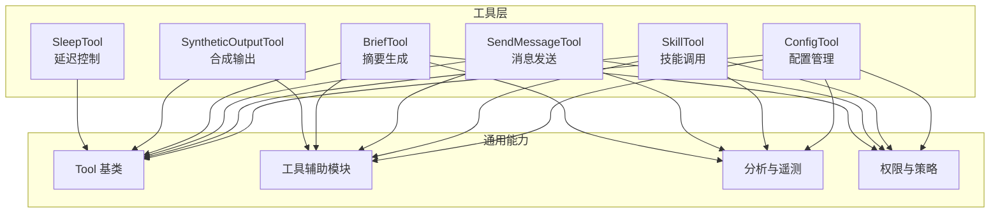
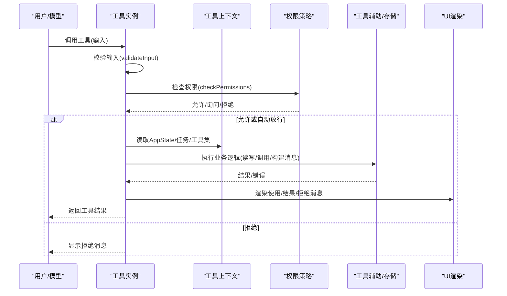
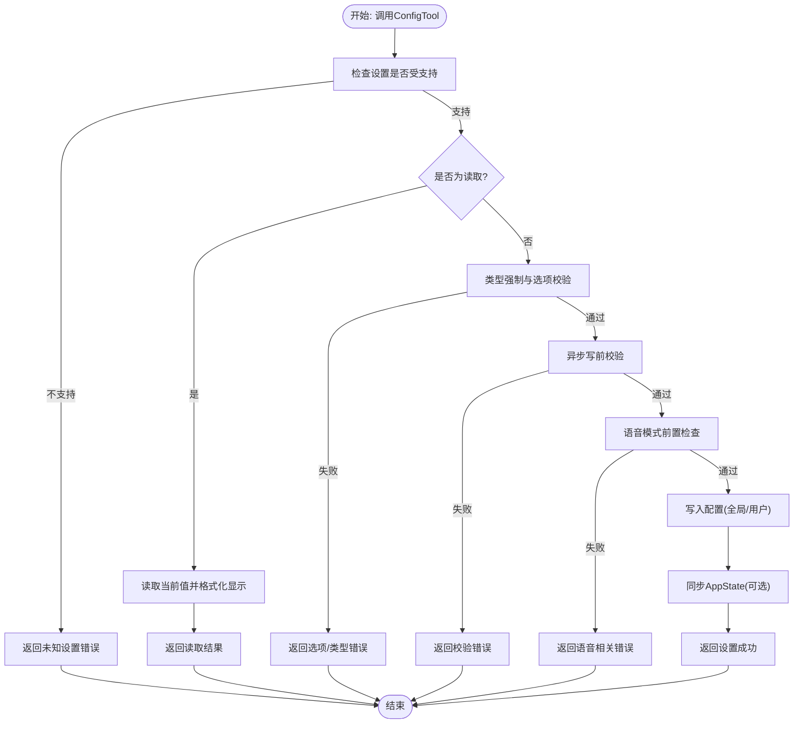
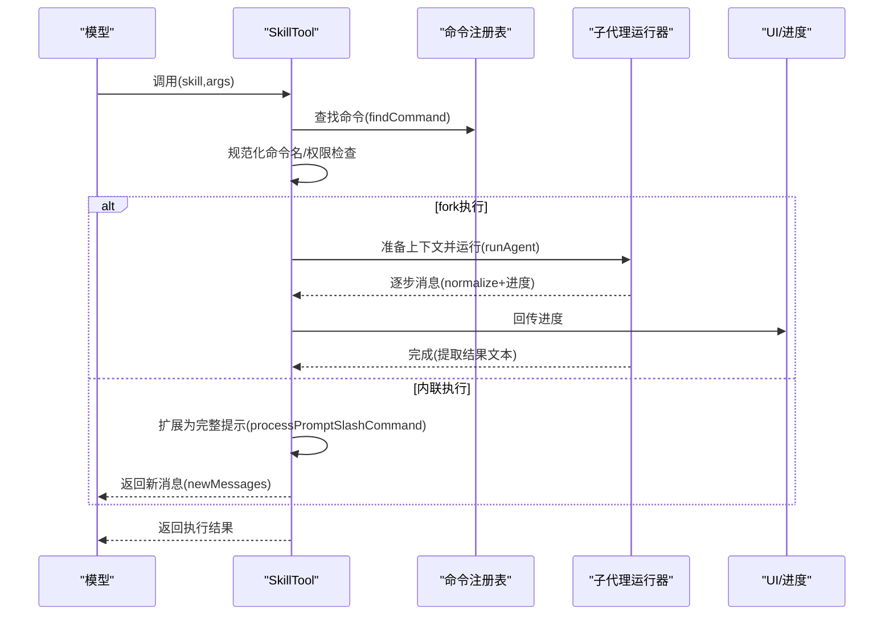
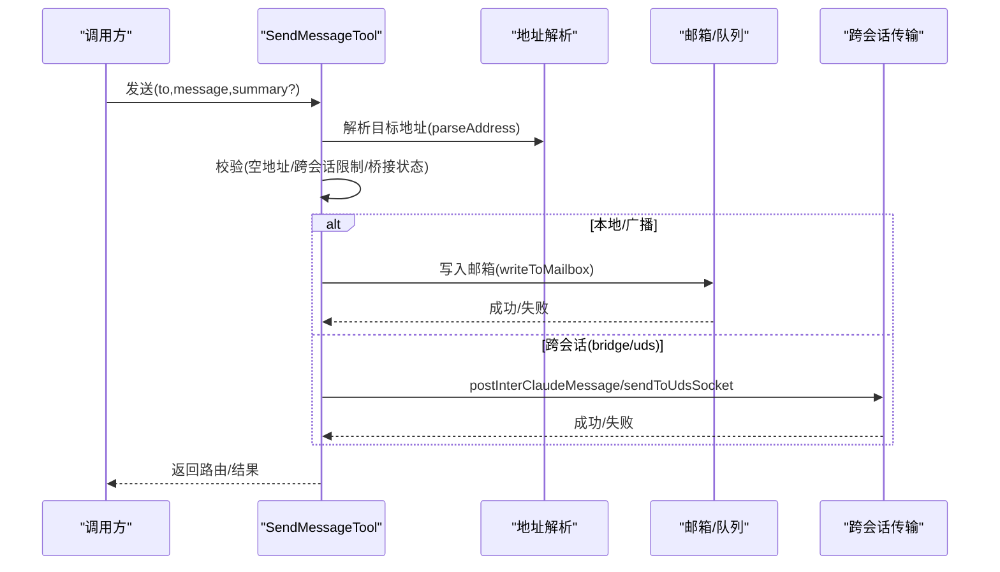
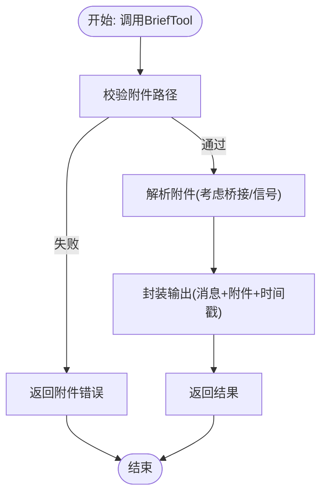
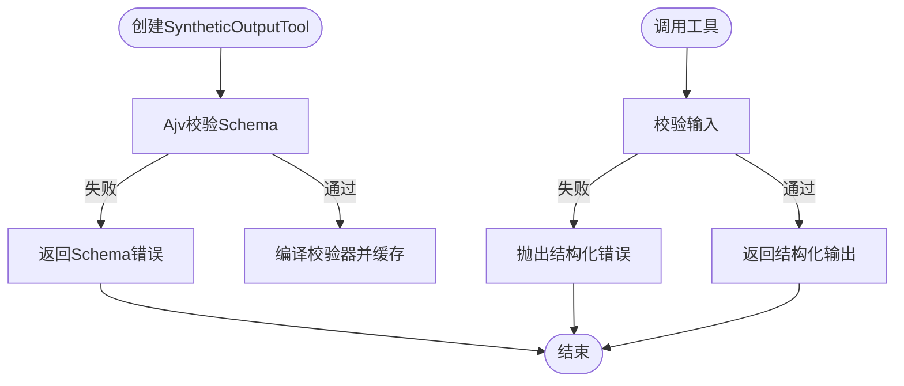
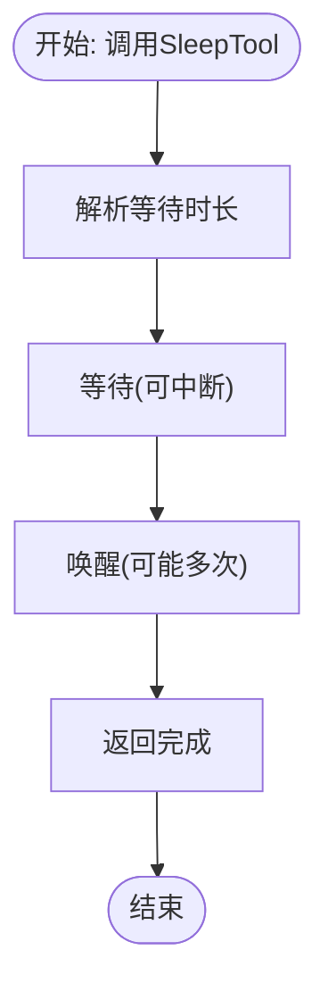
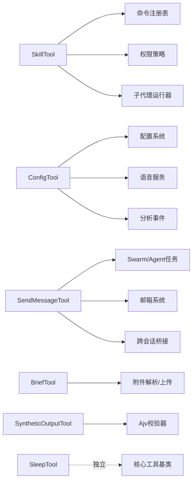

# 实用工具与专用工具

<cite>
**本文引用的文件**
- [ConfigTool.ts](file://src/tools/ConfigTool/ConfigTool.ts)
- [UI.tsx](file://src/tools/ConfigTool/UI.tsx)
- [constants.ts](file://src/tools/ConfigTool/constants.ts)
- [prompt.ts](file://src/tools/ConfigTool/prompt.ts)
- [supportedSettings.ts](file://src/tools/ConfigTool/supportedSettings.ts)
- [SkillTool.ts](file://src/tools/SkillTool/SkillTool.ts)
- [UI.tsx](file://src/tools/SkillTool/UI.tsx)
- [constants.ts](file://src/tools/SkillTool/constants.ts)
- [prompt.ts](file://src/tools/SkillTool/prompt.ts)
- [SendMessageTool.ts](file://src/tools/SendMessageTool/SendMessageTool.ts)
- [UI.tsx](file://src/tools/SendMessageTool/UI.tsx)
- [constants.ts](file://src/tools/SendMessageTool/constants.ts)
- [prompt.ts](file://src/tools/SendMessageTool/prompt.ts)
- [BriefTool.ts](file://src/tools/BriefTool/BriefTool.ts)
- [UI.tsx](file://src/tools/BriefTool/UI.tsx)
- [attachments.ts](file://src/tools/BriefTool/attachments.ts)
- [prompt.ts](file://src/tools/BriefTool/prompt.ts)
- [upload.ts](file://src/tools/BriefTool/upload.ts)
- [SyntheticOutputTool.ts](file://src/tools/SyntheticOutputTool/SyntheticOutputTool.ts)
- [SleepTool/prompt.ts](file://src/tools/SleepTool/prompt.ts)
</cite>

## 目录
1. [简介](#简介)
2. [项目结构](#项目结构)
3. [核心组件](#核心组件)
4. [架构总览](#架构总览)
5. [详细组件分析](#详细组件分析)
6. [依赖关系分析](#依赖关系分析)
7. [性能考量](#性能考量)
8. [故障排查指南](#故障排查指南)
9. [结论](#结论)
10. [附录](#附录)

## 简介
本文件面向Claude Code的实用工具与专用工具，系统化梳理以下工具的设计与实现：ConfigTool（配置管理与设置更新）、SkillTool（技能调用与扩展机制）、SendMessageTool（消息发送与通知）、BriefTool（摘要生成与内容压缩）、SyntheticOutputTool（合成输出与测试数据生成）、SleepTool（延迟控制与等待机制）。文档从架构、数据流、处理逻辑、权限与安全、错误处理、性能优化等维度进行深入解析，并提供最佳实践与常见问题解决方案。

## 项目结构
这些工具均位于src/tools目录下，采用“按工具分层”的组织方式，每个工具包含：
- 工具定义与实现：主入口文件（如ConfigTool.ts）
- UI渲染：UI.tsx（用于工具使用/结果/拒绝/进度消息的渲染）
- 常量与提示：constants.ts、prompt.ts
- 辅助模块：如ConfigTool的supportedSettings.ts、BriefTool的attachments.ts等

**图表来源**
- [ConfigTool.ts:67-434](file://src/tools/ConfigTool/ConfigTool.ts#L67-L434)
- [SkillTool.ts:331-800](file://src/tools/SkillTool/SkillTool.ts#L331-L800)
- [SendMessageTool.ts:520-800](file://src/tools/SendMessageTool/SendMessageTool.ts#L520-L800)
- [BriefTool.ts:136-205](file://src/tools/BriefTool/BriefTool.ts#L136-L205)
- [SyntheticOutputTool.ts:28-101](file://src/tools/SyntheticOutputTool/SyntheticOutputTool.ts#L28-L101)
- [SleepTool/prompt.ts:1-18](file://src/tools/SleepTool/prompt.ts#L1-L18)

**章节来源**
- [ConfigTool.ts:1-468](file://src/tools/ConfigTool/ConfigTool.ts#L1-L468)
- [SkillTool.ts:1-800](file://src/tools/SkillTool/SkillTool.ts#L1-L800)
- [SendMessageTool.ts:1-918](file://src/tools/SendMessageTool/SendMessageTool.ts#L1-L918)
- [BriefTool.ts:1-205](file://src/tools/BriefTool/BriefTool.ts#L1-L205)
- [SyntheticOutputTool.ts:1-164](file://src/tools/SyntheticOutputTool/SyntheticOutputTool.ts#L1-L164)
- [SleepTool/prompt.ts:1-18](file://src/tools/SleepTool/prompt.ts#L1-L18)

## 核心组件
- ConfigTool：统一的配置读取/写入入口，支持全局与用户设置源、类型校验、选项约束、异步验证、语音模式前置检查、即时UI同步与分析事件上报。
- SkillTool：将“斜杠命令式技能”扩展为完整提示，支持本地/远程MCP技能、子代理执行（fork）、权限规则匹配、遥测与插件信息记录、进度回传。
- SendMessageTool：团队内消息传递与协议交互（广播、关机请求/响应、计划审批），支持跨会话桥接（UDS/Remote Control）与安全校验。
- BriefTool：面向用户的可见输出通道，支持附件解析与上传、主动/常规状态标记、启用门控与遥测。
- SyntheticOutputTool：在非交互会话中返回结构化JSON，动态校验输入以保证输出格式正确性。
- SleepTool：提供轻量级睡眠等待，避免占用shell进程，支持周期性唤醒与中断。

**章节来源**
- [ConfigTool.ts:67-434](file://src/tools/ConfigTool/ConfigTool.ts#L67-L434)
- [SkillTool.ts:331-800](file://src/tools/SkillTool/SkillTool.ts#L331-L800)
- [SendMessageTool.ts:520-800](file://src/tools/SendMessageTool/SendMessageTool.ts#L520-L800)
- [BriefTool.ts:136-205](file://src/tools/BriefTool/BriefTool.ts#L136-L205)
- [SyntheticOutputTool.ts:28-101](file://src/tools/SyntheticOutputTool/SyntheticOutputTool.ts#L28-L101)
- [SleepTool/prompt.ts:1-18](file://src/tools/SleepTool/prompt.ts#L1-L18)

## 架构总览
工具整体遵循“工具基类 + 输入/输出Schema + 权限/校验 + 调用流程 + UI渲染 + 遥测/分析”的统一范式。工具通过上下文注入（ToolUseContext）访问AppState、任务、权限策略、分析服务等。

**图表来源**
- [SkillTool.ts:580-800](file://src/tools/SkillTool/SkillTool.ts#L580-L800)
- [ConfigTool.ts:111-411](file://src/tools/ConfigTool/ConfigTool.ts#L111-L411)
- [SendMessageTool.ts:741-800](file://src/tools/SendMessageTool/SendMessageTool.ts#L741-L800)
- [BriefTool.ts:186-203](file://src/tools/BriefTool/BriefTool.ts#L186-L203)

## 详细组件分析

### ConfigTool（配置管理与设置更新）
- 功能要点
  - 支持读取与设置两类操作，自动区分只读与写入。
  - 统一的设置注册表与路径解析，支持全局与用户设置源。
  - 类型强制与选项限制、异步写前校验（如模型可用性）、语音模式前置检查（麦克风权限、依赖可用性、登录态）。
  - 写入后即时同步到AppState（如replBridgeEnabled），并记录分析事件。
  - 对“默认值”语义的特殊处理（remoteControlAtStartup）。
- 关键流程
  - 输入校验与权限决策（读取自动放行，写入需确认）。
  - 设置有效性检查（类型、选项、异步校验）。
  - 写入持久化与副作用（语音变更触发设置变更检测、App状态同步）。
  - 结果映射为工具结果块参数，便于上层展示。

**图表来源**
- [ConfigTool.ts:111-411](file://src/tools/ConfigTool/ConfigTool.ts#L111-L411)

**章节来源**
- [ConfigTool.ts:67-434](file://src/tools/ConfigTool/ConfigTool.ts#L67-L434)
- [supportedSettings.ts](file://src/tools/ConfigTool/supportedSettings.ts)
- [UI.tsx](file://src/tools/ConfigTool/UI.tsx)
- [prompt.ts](file://src/tools/ConfigTool/prompt.ts)
- [constants.ts](file://src/tools/ConfigTool/constants.ts)

- 使用场景与集成
  - 通过/命令或直接调用，读取主题、模型、权限模式等关键设置。
  - 在需要立即生效UI状态时，配合AppState同步字段使用。
  - 语音模式切换需满足多重重试与前置条件，确保用户体验与合规。

- 最佳实践
  - 优先使用受支持设置键，避免未知键导致失败。
  - 写入前尽量提供明确的布尔/枚举值，减少类型转换歧义。
  - 对于影响UI即时性的设置，留意AppState同步时机。

- 常见问题
  - “未知设置”：确认设置键是否在受支持列表中。
  - 选项无效：核对允许的枚举值集合。
  - 语音模式不可用：检查登录态、麦克风权限、系统依赖与录音可用性。

---

### SkillTool（技能调用与扩展机制）
- 功能要点
  - 将“斜杠命令式技能”扩展为完整提示，支持本地与MCP远程技能。
  - fork子代理执行（隔离上下文、独立token预算），并回传进度消息。
  - 权限规则匹配（精确/前缀规则）、自动放行“仅安全属性”的技能。
  - 遥测记录技能名称、来源、插件信息、发现来源等。
  - 处理远程规范技能（canonical前缀）与实验特性开关。
- 关键流程
  - 输入校验：去除前导斜杠、规范化命令名、查找命令对象、禁止禁用模型调用的技能。
  - 权限决策：deny/allow规则匹配，远程规范技能自动放行，安全属性技能自动放行。
  - 执行：fork子代理或内联扩展，注入allowedTools、model覆盖、effort等。
  - 进度回传：标准化消息片段，携带技能内容与代理ID。

**图表来源**
- [SkillTool.ts:580-800](file://src/tools/SkillTool/SkillTool.ts#L580-L800)
- [SkillTool.ts:122-289](file://src/tools/SkillTool/SkillTool.ts#L122-L289)

**章节来源**
- [SkillTool.ts:331-800](file://src/tools/SkillTool/SkillTool.ts#L331-L800)
- [UI.tsx](file://src/tools/SkillTool/UI.tsx)
- [prompt.ts](file://src/tools/SkillTool/prompt.ts)
- [constants.ts](file://src/tools/SkillTool/constants.ts)

- 使用场景与集成
  - 作为模型的“技能执行器”，将自然语言指令转化为可执行的完整提示。
  - fork执行适合复杂/长耗时任务，内联执行适合轻量/快速反馈。
  - 与权限策略结合，实现细粒度的“允许/拒绝/询问”。

- 最佳实践
  - 优先使用prompt型命令，避免禁用模型调用的命令。
  - 对高风险技能配置显式权限规则，使用前缀规则放宽参数范围。
  - 利用遥测与发现来源，持续优化技能推荐与使用体验。

- 常见问题
  - “未知技能”：确认命令是否存在于本地或MCP注册表。
  - “无法使用”：检查disable-model-invocation或权限规则。
  - “远程技能未发现”：先执行技能发现，再调用canonical技能。

---

### SendMessageTool（消息发送与通知）
- 功能要点
  - 支持向特定队友、广播、跨会话桥接（UDS/Remote Control）发送消息。
  - 提供结构化消息类型：关机请求/响应、计划审批响应。
  - 严格的输入校验与安全检查（跨机器消息需显式同意）。
  - 广播与关机审批/拒绝的专用处理分支。
- 关键流程
  - 地址解析与类型推断（to: 名称/* 或 bridge:/uds:...）。
  - 校验：空地址、跨会话结构化消息限制、桥接连接状态。
  - 分发：本地邮箱写入、跨会话通过peerSessions或UDS客户端发送。
  - 特殊协议：关机审批/拒绝根据后端类型选择中止或优雅退出。

**图表来源**
- [SendMessageTool.ts:741-800](file://src/tools/SendMessageTool/SendMessageTool.ts#L741-L800)
- [SendMessageTool.ts:149-266](file://src/tools/SendMessageTool/SendMessageTool.ts#L149-L266)

**章节来源**
- [SendMessageTool.ts:520-800](file://src/tools/SendMessageTool/SendMessageTool.ts#L520-L800)
- [UI.tsx](file://src/tools/SendMessageTool/UI.tsx)
- [prompt.ts](file://src/tools/SendMessageTool/prompt.ts)
- [constants.ts](file://src/tools/SendMessageTool/constants.ts)

- 使用场景与集成
  - 团队内消息传递、计划审批、关机协调。
  - 跨机器协作：通过Remote Control桥接或UDS本地套接字。
  - 与Swarm/Agent任务系统联动，实现任务生命周期通知。

- 最佳实践
  - 跨会话消息必须使用纯文本，结构化消息仅限本地。
  - 桥接消息需显式授权，避免意外跨机器提示注入。
  - 广播仅限字符串消息，结构化消息禁止广播。

- 常见问题
  - “地址为空”：检查to字段与目标类型。
  - “跨会话结构化消息被拒”：改用纯文本或本地消息。
  - “Remote Control未连接”：先建立连接再发送。

---

### BriefTool（摘要生成与内容压缩）
- 功能要点
  - 用户可见输出通道，支持消息正文与附件。
  - 主动/常规两种状态，用于区分“未请求但需立即呈现”与“对用户请求的回复”。
  - 启用门控：结合功能标志、增长书门控与用户显式启用。
  - 附件解析与上传，支持图片/二进制文件元数据。
- 关键流程
  - 输入校验：附件路径合法性。
  - 附件解析：根据replBridgeEnabled与信号控制解析过程。
  - 输出封装：附加sentAt时间戳与附件元数据。

**图表来源**
- [BriefTool.ts:186-203](file://src/tools/BriefTool/BriefTool.ts#L186-L203)
- [attachments.ts](file://src/tools/BriefTool/attachments.ts)

**章节来源**
- [BriefTool.ts:136-205](file://src/tools/BriefTool/BriefTool.ts#L136-L205)
- [UI.tsx](file://src/tools/BriefTool/UI.tsx)
- [prompt.ts](file://src/tools/BriefTool/prompt.ts)
- [attachments.ts](file://src/tools/BriefTool/attachments.ts)
- [upload.ts](file://src/tools/BriefTool/upload.ts)

- 使用场景与集成
  - 作为模型的主要对外输出渠道，替代直接打印。
  - 与系统提示段落、延迟工具协同，形成完整的用户反馈闭环。

- 最佳实践
  - 附件可选，避免在恢复会话时因必填字段导致渲染崩溃。
  - 主动状态用于重要阻塞/完成通知，常规状态用于对应回复。

- 常见问题
  - “附件路径无效”：检查绝对/相对路径与文件存在性。
  - “未启用”：确认功能标志、增长书门控与用户显式启用。

---

### SyntheticOutputTool（合成输出与测试数据生成）
- 功能要点
  - 在非交互会话中返回结构化JSON，要求严格的数据格式校验。
  - 动态构建工具：基于JSON Schema编译校验器，缓存以提升重复调用性能。
  - 仅允许一次最终输出，确保下游消费稳定。
- 关键流程
  - 创建工具：校验Schema合法性，编译校验器并缓存。
  - 调用工具：校验输入，通过则返回结构化输出，否则抛出带遥测安全标识的错误。

**图表来源**
- [SyntheticOutputTool.ts:116-163](file://src/tools/SyntheticOutputTool/SyntheticOutputTool.ts#L116-L163)
- [SyntheticOutputTool.ts:59-65](file://src/tools/SyntheticOutputTool/SyntheticOutputTool.ts#L59-L65)

**章节来源**
- [SyntheticOutputTool.ts:28-101](file://src/tools/SyntheticOutputTool/SyntheticOutputTool.ts#L28-L101)
- [SyntheticOutputTool.ts:116-163](file://src/tools/SyntheticOutputTool/SyntheticOutputTool.ts#L116-L163)

- 使用场景与集成
  - SDK/CLI非交互场景下的最终输出封装。
  - 测试工作流中生成固定格式的结构化数据。

- 最佳实践
  - 使用稳定的JSON Schema，避免频繁变更导致缓存失效。
  - 仅在会话末尾调用一次，确保输出一致性。

- 常见问题
  - “Schema非法”：修正Ajv错误信息中的路径与描述。
  - “输入不匹配”：对照Schema逐项修正字段类型与约束。

---

### SleepTool（延迟控制与等待机制）
- 功能要点
  - 提供轻量级睡眠等待，避免占用shell进程。
  - 支持周期性唤醒与中断，平衡API调用成本与等待需求。
  - 与其他工具并发执行不冲突。
- 关键流程
  - 输入校验：时长参数。
  - 等待：内部调度等待，支持外部中断。
  - 结果：每次唤醒视为一次API调用成本。

**图表来源**
- [SleepTool/prompt.ts:1-18](file://src/tools/SleepTool/prompt.ts#L1-L18)

**章节来源**
- [SleepTool/prompt.ts:1-18](file://src/tools/SleepTool/prompt.ts#L1-L18)

- 使用场景与集成
  - 等待外部事件、轮询状态变化、让出CPU给其他任务。
  - 与BriefTool/SkillTool组合，形成“等待-检查-行动”的工作流。

- 最佳实践
  - 优先使用内置SleepTool而非Bash(sleep ...)，减少资源占用。
  - 合理设置等待间隔，避免频繁唤醒带来的API开销。

- 常见问题
  - “等待无响应”：确认是否被中断或会话结束。
  - “成本过高”：调整等待策略，合并多次唤醒为一次性等待。

---

## 依赖关系分析
- 工具间耦合
  - SkillTool与命令注册表、fork运行器、权限策略耦合较深，体现其扩展性与安全性。
  - ConfigTool与设置系统、语音服务、分析事件紧密耦合，强调一致性与可观测性。
  - SendMessageTool与Swarm/Agent任务、邮箱系统、跨会话传输模块耦合，强调协议与安全。
  - BriefTool与附件解析、上传模块耦合，强调可选附件与稳定性。
  - SyntheticOutputTool与Ajv校验器耦合，强调Schema驱动与缓存优化。
  - SleepTool为独立工具，耦合度最低。
- 外部依赖
  - 权限策略、分析事件、语音服务、跨会话桥接、附件解析等均为关键外部模块。

**图表来源**
- [SkillTool.ts:331-800](file://src/tools/SkillTool/SkillTool.ts#L331-L800)
- [ConfigTool.ts:67-434](file://src/tools/ConfigTool/ConfigTool.ts#L67-L434)
- [SendMessageTool.ts:520-800](file://src/tools/SendMessageTool/SendMessageTool.ts#L520-L800)
- [BriefTool.ts:136-205](file://src/tools/BriefTool/BriefTool.ts#L136-L205)
- [SyntheticOutputTool.ts:28-101](file://src/tools/SyntheticOutputTool/SyntheticOutputTool.ts#L28-L101)

**章节来源**
- [SkillTool.ts:331-800](file://src/tools/SkillTool/SkillTool.ts#L331-L800)
- [ConfigTool.ts:67-434](file://src/tools/ConfigTool/ConfigTool.ts#L67-L434)
- [SendMessageTool.ts:520-800](file://src/tools/SendMessageTool/SendMessageTool.ts#L520-L800)
- [BriefTool.ts:136-205](file://src/tools/BriefTool/BriefTool.ts#L136-L205)
- [SyntheticOutputTool.ts:28-101](file://src/tools/SyntheticOutputTool/SyntheticOutputTool.ts#L28-L101)

## 性能考量
- 缓存与编译
  - SyntheticOutputTool对同一Schema进行WeakMap缓存，避免重复Ajv编译开销。
- 异步与并发
  - ConfigTool的异步写前校验与语音前置检查避免阻塞主线程。
  - SkillTool的fork执行与进度回传支持并发与渐进式反馈。
- I/O与网络
  - BriefTool的附件解析考虑信号中断与桥接状态，减少无效I/O。
  - SendMessageTool的跨会话发送在授权后才进行，降低失败重试成本。
- 资源占用
  - SleepTool避免shell进程占用，降低系统负载。

[本节为通用性能讨论，无需具体文件分析]

## 故障排查指南
- ConfigTool
  - 症状：设置无效或未知。
  - 排查：确认设置键是否受支持、类型与选项是否匹配、语音模式前置条件是否满足。
- SkillTool
  - 症状：技能无法执行或权限被拒。
  - 排查：检查命令是否存在、是否禁用模型调用、权限规则是否匹配；远程技能需先发现。
- SendMessageTool
  - 症状：跨会话消息失败或被拒。
  - 排查：确认桥接连接状态、消息类型是否为纯文本、目标地址是否有效。
- BriefTool
  - 症状：附件解析失败或工具未启用。
  - 排查：检查附件路径、功能标志与用户启用状态。
- SyntheticOutputTool
  - 症状：Schema非法或输入不匹配。
  - 排查：修正Schema或输入字段，确保符合约束。
- SleepTool
  - 症状：等待无响应或成本过高。
  - 排查：确认等待策略与中断情况，合理设置等待间隔。

**章节来源**
- [ConfigTool.ts:111-411](file://src/tools/ConfigTool/ConfigTool.ts#L111-L411)
- [SkillTool.ts:580-800](file://src/tools/SkillTool/SkillTool.ts#L580-L800)
- [SendMessageTool.ts:741-800](file://src/tools/SendMessageTool/SendMessageTool.ts#L741-L800)
- [BriefTool.ts:186-203](file://src/tools/BriefTool/BriefTool.ts#L186-L203)
- [SyntheticOutputTool.ts:116-163](file://src/tools/SyntheticOutputTool/SyntheticOutputTool.ts#L116-L163)

## 结论
上述工具围绕“统一基类 + 可扩展输入/输出 + 权限与安全 + 遥测可观测 + UI渲染”的设计范式，实现了从配置管理、技能扩展、消息通信、用户输出、结构化返回到等待控制的全链路能力。通过严格的输入校验、权限策略与安全检查，以及针对不同场景的性能优化（如Schema缓存、fork并发、桥接授权），这些工具在保证安全性的同时，提供了灵活、高效且可维护的工程化能力。

[本节为总结性内容，无需具体文件分析]

## 附录
- 配置选项与受支持设置
  - 通过受支持设置注册表与路径解析，统一管理全局与用户设置源。
- 技能分类与来源
  - 本地命令、MCP技能、远程规范技能（canonical），并记录插件与来源信息。
- 消息类型与路由
  - 本地/广播、跨会话桥接、UDS本地套接字，以及结构化消息协议。
- 输出格式与校验
  - BriefTool的附件元数据、SyntheticOutputTool的JSON Schema校验与缓存。

[本节为概览性内容，无需具体文件分析]