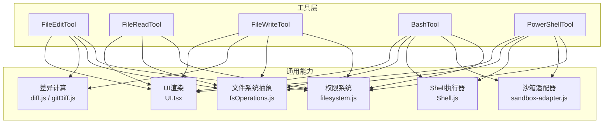
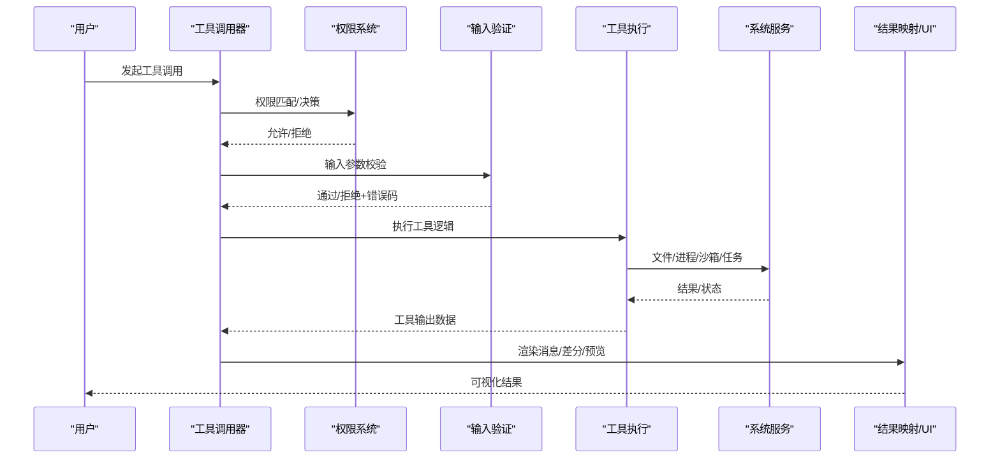
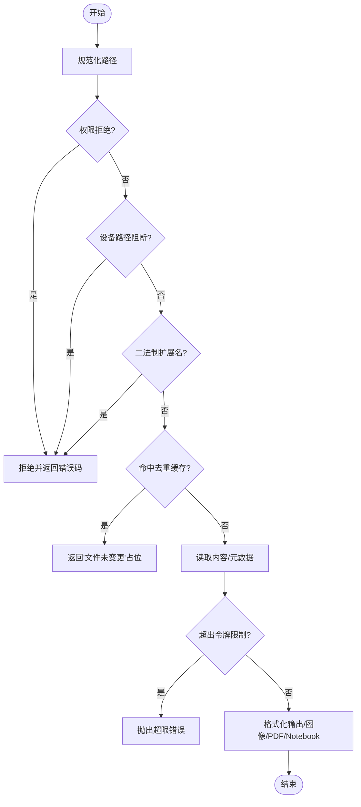
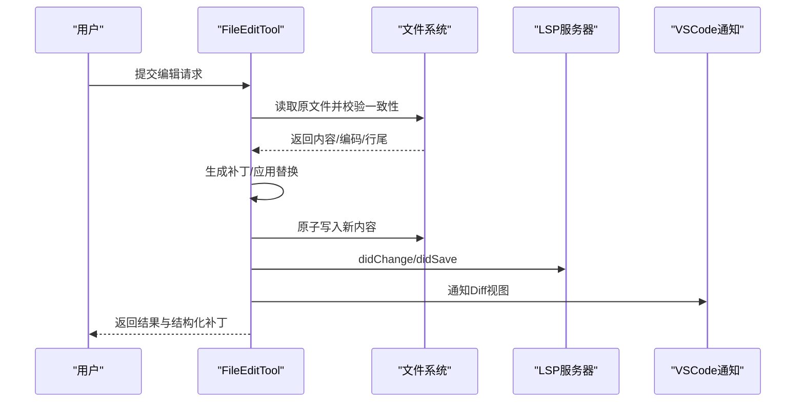
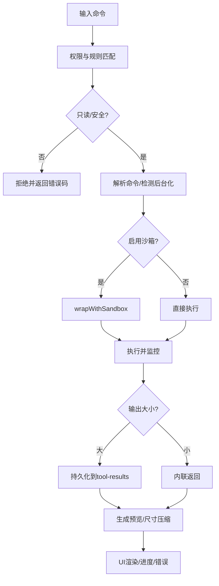
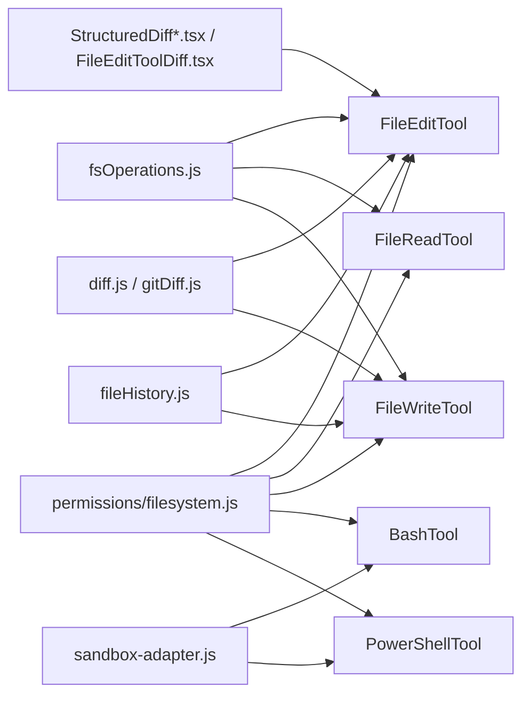

# 文件操作工具

<cite>
**本文引用的文件**
- [FileEditTool.ts](file://src/tools/FileEditTool/FileEditTool.ts)
- [FileReadTool.ts](file://src/tools/FileReadTool/FileReadTool.ts)
- [FileWriteTool.ts](file://src/tools/FileWriteTool/FileWriteTool.ts)
- [BashTool.tsx](file://src/tools/BashTool/BashTool.tsx)
- [PowerShellTool.tsx](file://src/tools/PowerShellTool/PowerShellTool.tsx)
- [prompt.ts（Bash）](file://src/tools/BashTool/prompt.ts)
- [prompt.ts（PowerShell）](file://src/tools/PowerShellTool/prompt.ts)
- [prompt.ts（FileRead）](file://src/tools/FileReadTool/prompt.ts)
- [prompt.ts（FileEdit）](file://src/tools/FileEditTool/prompt.ts)
- [prompt.ts（FileWrite）](file://src/tools/FileWriteTool/prompt.ts)
- [UI.tsx（FileEdit）](file://src/tools/FileEditTool/UI.tsx)
- [UI.tsx（FileRead）](file://src/tools/FileReadTool/UI.tsx)
- [UI.tsx（FileWrite）](file://src/tools/FileWriteTool/UI.tsx)
- [UI.tsx（Bash）](file://src/tools/BashTool/UI.tsx)
- [UI.tsx（PowerShell）](file://src/tools/PowerShellTool/UI.tsx)
- [bashPermissions.ts](file://src/tools/BashTool/bashPermissions.ts)
- [powershellPermissions.ts](file://src/tools/PowerShellTool/powershellPermissions.ts)
- [bashSecurity.ts](file://src/tools/BashTool/bashSecurity.ts)
- [powershellSecurity.ts](file://src/tools/PowerShellTool/powershellSecurity.ts)
- [bashCommandHelpers.ts](file://src/tools/BashTool/bashCommandHelpers.ts)
- [sedEditParser.ts](file://src/tools/BashTool/sedEditParser.ts)
- [sedValidation.ts](file://src/tools/BashTool/sedValidation.ts)
- [modeValidation.ts](file://src/tools/BashTool/modeValidation.ts)
- [pathValidation.ts](file://src/tools/BashTool/pathValidation.ts)
- [readOnlyValidation.ts（Bash）](file://src/tools/BashTool/readOnlyValidation.ts)
- [readOnlyValidation.ts（PowerShell）](file://src/tools/PowerShellTool/readOnlyValidation.ts)
- [gitSafety.ts](file://src/tools/PowerShellTool/gitSafety.ts)
- [commandSemantics.ts（Bash）](file://src/tools/BashTool/commandSemantics.ts)
- [commandSemantics.ts（PowerShell）](file://src/tools/PowerShellTool/commandSemantics.ts)
- [shouldUseSandbox.ts](file://src/tools/BashTool/shouldUseSandbox.ts)
- [toolName.ts（Bash）](file://src/tools/BashTool/toolName.ts)
- [toolName.ts（PowerShell）](file://src/tools/PowerShellTool/toolName.ts)
- [toolName.ts（FileEdit）](file://src/tools/FileEditTool/toolName.ts)
- [toolName.ts（FileRead）](file://src/tools/FileReadTool/toolName.ts)
- [toolName.ts（FileWrite）](file://src/tools/FileWriteTool/toolName.ts)
- [prompts.ts](file://src/constants/prompts.ts)
- [limits.ts（FileRead）](file://src/tools/FileReadTool/limits.ts)
- [fileRead.ts](file://src/utils/fileRead.ts)
- [file.js](file://src/utils/file.js)
- [fsOperations.js](file://src/utils/fsOperations.js)
- [permissions/filesystem.js](file://src/utils/permissions/filesystem.js)
- [shell/powershellDetection.js](file://src/utils/shell/powershellDetection.js)
- [timeouts.js](file://src/utils/timeouts.js)
- [diff.js](file://src/utils/diff.js)
- [gitDiff.js](file://src/utils/gitDiff.js)
- [fileHistory.js](file://src/utils/fileHistory.js)
- [fileOperationAnalytics.js](file://src/utils/fileOperationAnalytics.js)
- [envUtils.js](file://src/utils/envUtils.js)
- [log.js](file://src/utils/log.js)
- [sandbox-adapter.js](file://src/utils/sandbox/sandbox-adapter.js)
- [Shell.js](file://src/utils/Shell.js)
- [task/diskOutput.js](file://src/utils/task/diskOutput.js)
- [toolResultStorage.js](file://src/utils/toolResultStorage.js)
- [terminal.js](file://src/utils/terminal.js)
- [format.js](file://src/utils/format.js)
- [path.js](file://src/utils/path.js)
- [errors.js](file://src/utils/errors.js)
- [diff.tsx](file://src/components/diff/StructuredDiff.tsx)
- [diffList.tsx](file://src/components/diff/StructuredDiffList.tsx)
- [FileEditToolDiff.tsx](file://src/components/FileEditToolDiff.tsx)
- [FileEditToolUpdatedMessage.tsx](file://src/components/FileEditToolUpdatedMessage.tsx)
- [FileEditToolUseRejectedMessage.tsx](file://src/components/FileEditToolUseRejectedMessage.tsx)
- [FileEditTool/constants.ts](file://src/tools/FileEditTool/constants.ts)
- [FileEditTool/types.ts](file://src/tools/FileEditTool/types.ts)
- [FileEditTool/utils.ts](file://src/tools/FileEditTool/utils.ts)
- [FileReadTool/limits.ts](file://src/tools/FileReadTool/limits.ts)
- [FileReadTool/imageProcessor.ts](file://src/tools/FileReadTool/imageProcessor.ts)
- [FileReadTool/prompt.ts](file://src/tools/FileReadTool/prompt.ts)
- [FileReadTool/limits.ts](file://src/tools/FileReadTool/limits.ts)
- [FileWriteTool/prompt.ts](file://src/tools/FileWriteTool/prompt.ts)
- [FileWriteTool/UI.tsx](file://src/tools/FileWriteTool/UI.tsx)
- [LocalShellTask.js](file://src/tasks/LocalShellTask/LocalShellTask.js)
- [types/tools.js](file://src/types/tools.js)
</cite>

## 目录
1. [简介](#简介)
2. [项目结构](#项目结构)
3. [核心组件](#核心组件)
4. [架构总览](#架构总览)
5. [详细组件分析](#详细组件分析)
6. [依赖关系分析](#依赖关系分析)
7. [性能考量](#性能考量)
8. [故障排查指南](#故障排查指南)
9. [结论](#结论)
10. [附录](#附录)

## 简介
本文件面向Claude Code的文件操作工具，系统性梳理并解析以下工具的能力边界与实现原理：
- 文件读取：FileReadTool
- 文件编辑：FileEditTool
- 文件写入：FileWriteTool
- 命令执行：BashTool、PowerShellTool

重点覆盖：
- 文件编辑的语法高亮、差异显示、批量操作与安全校验
- BashTool与PowerShellTool的安全机制、权限控制与沙箱隔离策略
- 最佳实践、性能优化建议与常见问题处理

## 项目结构
文件操作工具位于src/tools目录下，每个工具均遵循统一的ToolDef构建器模式，具备输入/输出Schema、权限校验、UI渲染、结果映射与错误处理等能力。

图表来源
- [FileEditTool.ts:86-595](file://src/tools/FileEditTool/FileEditTool.ts#L86-L595)
- [FileReadTool.ts:337-718](file://src/tools/FileReadTool/FileReadTool.ts#L337-L718)
- [FileWriteTool.ts:94-434](file://src/tools/FileWriteTool/FileWriteTool.ts#L94-L434)
- [BashTool.tsx:420-623](file://src/tools/BashTool/BashTool.tsx#L420-L623)
- [PowerShellTool.tsx:272-662](file://src/tools/PowerShellTool/PowerShellTool.tsx#L272-L662)
- [permissions/filesystem.js](file://src/utils/permissions/filesystem.js)
- [sandbox-adapter.js](file://src/utils/sandbox/sandbox-adapter.js)
- [Shell.js](file://src/utils/Shell.js)
- [fsOperations.js](file://src/utils/fsOperations.js)
- [diff.js](file://src/utils/diff.js)
- [gitDiff.js](file://src/utils/gitDiff.js)
- [UI.tsx（各工具）](file://src/tools/FileEditTool/UI.tsx)

章节来源
- [FileEditTool.ts:86-595](file://src/tools/FileEditTool/FileEditTool.ts#L86-L595)
- [FileReadTool.ts:337-718](file://src/tools/FileReadTool/FileReadTool.ts#L337-L718)
- [FileWriteTool.ts:94-434](file://src/tools/FileWriteTool/FileWriteTool.ts#L94-L434)
- [BashTool.tsx:420-623](file://src/tools/BashTool/BashTool.tsx#L420-L623)
- [PowerShellTool.tsx:272-662](file://src/tools/PowerShellTool/PowerShellTool.tsx#L272-L662)

## 核心组件
- FileReadTool：支持文本、图片、PDF、Jupyter Notebook等多类型读取；内置去重缓存、令牌限制与设备路径阻断；提供“未变更”快速返回。
- FileEditTool：基于内容一致性检查与原子写入，确保并发安全；支持批量替换、差异生成、VSCode Diff通知、LSP诊断刷新。
- FileWriteTool：全量覆盖写入，保持行尾风格；与编辑工具一致的并发安全与历史备份。
- BashTool：命令解析、只读判定、自动后台化、大输出持久化、沙箱注解与提示词引导。
- PowerShellTool：Windows PowerShell专用，同步安全检测与只读判定，平台沙箱策略拒绝与后台化管理。

章节来源
- [FileReadTool.ts:337-718](file://src/tools/FileReadTool/FileReadTool.ts#L337-L718)
- [FileEditTool.ts:86-595](file://src/tools/FileEditTool/FileEditTool.ts#L86-L595)
- [FileWriteTool.ts:94-434](file://src/tools/FileWriteTool/FileWriteTool.ts#L94-L434)
- [BashTool.tsx:420-623](file://src/tools/BashTool/BashTool.tsx#L420-L623)
- [PowerShellTool.tsx:272-662](file://src/tools/PowerShellTool/PowerShellTool.tsx#L272-L662)

## 架构总览
文件操作工具通过统一的ToolDef接口接入，围绕“权限校验—输入验证—调用执行—结果映射—UI渲染”的流程运行，并在关键环节集成安全与性能保障。

图表来源
- [FileEditTool.ts:125-362](file://src/tools/FileEditTool/FileEditTool.ts#L125-L362)
- [FileReadTool.ts:398-495](file://src/tools/FileReadTool/FileReadTool.ts#L398-L495)
- [FileWriteTool.ts:135-222](file://src/tools/FileWriteTool/FileWriteTool.ts#L135-L222)
- [BashTool.tsx:524-538](file://src/tools/BashTool/BashTool.tsx#L524-L538)
- [PowerShellTool.tsx:352-374](file://src/tools/PowerShellTool/PowerShellTool.tsx#L352-L374)

## 详细组件分析

### FileReadTool（文件读取）
- 多格式支持：文本、图片、PDF、Jupyter Notebook；对二进制扩展名进行白名单过滤。
- 性能与安全：
  - 设备路径阻断：禁止/dev/zero、/dev/random等无限输出或阻塞输入的设备文件。
  - 去重缓存：同一范围且未变更的文件直接返回“文件未变更”占位，避免重复传输。
  - 令牌限制：按文件类型估算token数，超过阈值抛出异常，强制分段读取。
- UI与提示：提供“未变更”占位消息；文本读取附加风险提醒（部分模型豁免）。

图表来源
- [FileReadTool.ts:418-495](file://src/tools/FileReadTool/FileReadTool.ts#L418-L495)
- [FileReadTool.ts:594-651](file://src/tools/FileReadTool/FileReadTool.ts#L594-L651)
- [limits.ts（FileRead）](file://src/tools/FileReadTool/limits.ts)

章节来源
- [FileReadTool.ts:337-718](file://src/tools/FileReadTool/FileReadTool.ts#L337-L718)
- [prompt.ts（FileRead）](file://src/tools/FileReadTool/prompt.ts)
- [limits.ts（FileRead）](file://src/tools/FileReadTool/limits.ts)

### FileEditTool（文件编辑）
- 并发安全与一致性：
  - 读取-校验-写入三阶段原子化，严格比对上次读取时间戳与内容一致性，防止并发修改导致的数据不一致。
  - 支持“仅一次替换”与“全部替换”，当存在多个匹配时要求显式设置replace_all。
  - 对UNC路径与笔记本文件进行特殊处理与提示。
- 差异与可视化：
  - 生成结构化补丁（structuredPatch），并与VSCode Diff、LSP诊断联动。
  - 可选计算单文件Git Diff，用于工具使用后的差异统计。
- 语法与编码：
  - 自动识别UTF-16/UTF-8并归一化换行符；保留文件原有行尾风格。
  - 替换前进行引号风格保留，提升编辑体验。

图表来源
- [FileEditTool.ts:387-574](file://src/tools/FileEditTool/FileEditTool.ts#L387-L574)
- [FileEditTool.ts:599-625](file://src/tools/FileEditTool/FileEditTool.ts#L599-L625)
- [fileRead.ts](file://src/utils/fileRead.ts)
- [diff.js](file://src/utils/diff.js)
- [gitDiff.js](file://src/utils/gitDiff.js)

章节来源
- [FileEditTool.ts:86-595](file://src/tools/FileEditTool/FileEditTool.ts#L86-L595)
- [prompt.ts（FileEdit）](file://src/tools/FileEditTool/prompt.ts)
- [UI.tsx（FileEdit）](file://src/tools/FileEditTool/UI.tsx)
- [FileEditTool/constants.ts](file://src/tools/FileEditTool/constants.ts)
- [FileEditTool/types.ts](file://src/tools/FileEditTool/types.ts)
- [FileEditTool/utils.ts](file://src/tools/FileEditTool/utils.ts)

### FileWriteTool（文件写入）
- 写入策略：全量覆盖写入，尊重用户提供的行尾风格；与编辑工具一致的并发安全与历史备份。
- 差异生成：对更新场景生成结构化补丁，便于展示与审计。
- 场景提示：当目标文件不存在时，先创建父目录，确保原子性。

章节来源
- [FileWriteTool.ts:94-434](file://src/tools/FileWriteTool/FileWriteTool.ts#L94-L434)
- [prompt.ts（FileWrite）](file://src/tools/FileWriteTool/prompt.ts)
- [UI.tsx（FileWrite）](file://src/tools/FileWriteTool/UI.tsx)

### BashTool（Linux/macOS/WSL）
- 只读判定与安全：
  - 基于命令解析与AST分析，结合权限规则与路径白名单，动态判定是否允许执行。
  - 对破坏性命令（如删除、重命名）进行警告与拦截。
- 后台化与超时：
  - 长耗时命令可自动后台化；支持用户手动后台化；超时与中断处理完善。
- 沙箱与隔离：
  - 在支持平台启用bwrap/sandbox-exec沙箱；可配置禁用沙箱（危险模式）。
- 输出处理：
  - 大输出自动落盘并提供预览；图像输出自动压缩与尺寸调整；支持结构化内容块。

图表来源
- [BashTool.tsx:524-538](file://src/tools/BashTool/BashTool.tsx#L524-L538)
- [BashTool.tsx:624-800](file://src/tools/BashTool/BashTool.tsx#L624-L800)
- [bashPermissions.ts](file://src/tools/BashTool/bashPermissions.ts)
- [bashSecurity.ts](file://src/tools/BashTool/bashSecurity.ts)
- [shouldUseSandbox.ts](file://src/tools/BashTool/shouldUseSandbox.ts)
- [sandbox-adapter.js](file://src/utils/sandbox/sandbox-adapter.js)
- [Shell.js](file://src/utils/Shell.js)
- [task/diskOutput.js](file://src/utils/task/diskOutput.js)
- [toolResultStorage.js](file://src/utils/toolResultStorage.js)
- [terminal.js](file://src/utils/terminal.js)

章节来源
- [BashTool.tsx:420-623](file://src/tools/BashTool/BashTool.tsx#L420-L623)
- [prompt.ts（Bash）](file://src/tools/BashTool/prompt.ts)
- [UI.tsx（Bash）](file://src/tools/BashTool/UI.tsx)
- [bashCommandHelpers.ts](file://src/tools/BashTool/bashCommandHelpers.ts)
- [sedEditParser.ts](file://src/tools/BashTool/sedEditParser.ts)
- [sedValidation.ts](file://src/tools/BashTool/sedValidation.ts)
- [modeValidation.ts](file://src/tools/BashTool/modeValidation.ts)
- [pathValidation.ts](file://src/tools/BashTool/pathValidation.ts)
- [readOnlyValidation.ts（Bash）](file://src/tools/BashTool/readOnlyValidation.ts)
- [commandSemantics.ts（Bash）](file://src/tools/BashTool/commandSemantics.ts)
- [toolName.ts（Bash）](file://src/tools/BashTool/toolName.ts)

### PowerShellTool（Windows）
- 平台策略与沙箱：
  - 在Windows原生环境下，若企业策略要求沙箱而系统不支持，则直接拒绝执行。
  - 其他平台（WSL2、macOS、Linux）与BashTool一致地启用沙箱。
- 只读判定与安全：
  - 同步安全检测（正则/关键字）与只读命令判定；复杂语义通过异步AST解析进一步确认。
- 后台化与输出：
  - 与BashTool类似的后台化策略；大输出持久化与图像压缩；返回语义化解释与错误信息。

章节来源
- [PowerShellTool.tsx:272-662](file://src/tools/PowerShellTool/PowerShellTool.tsx#L272-L662)
- [prompt.ts（PowerShell）](file://src/tools/PowerShellTool/prompt.ts)
- [UI.tsx（PowerShell）](file://src/tools/PowerShellTool/UI.tsx)
- [powershellPermissions.ts](file://src/tools/PowerShellTool/powershellPermissions.ts)
- [powershellSecurity.ts](file://src/tools/PowerShellTool/powershellSecurity.ts)
- [readOnlyValidation.ts（PowerShell）](file://src/tools/PowerShellTool/readOnlyValidation.ts)
- [commandSemantics.ts（PowerShell）](file://src/tools/PowerShellTool/commandSemantics.ts)
- [gitSafety.ts](file://src/tools/PowerShellTool/gitSafety.ts)
- [toolName.ts（PowerShell）](file://src/tools/PowerShellTool/toolName.ts)
- [shell/powershellDetection.js](file://src/utils/shell/powershellDetection.js)

## 依赖关系分析
- 权限系统：所有工具均依赖统一的文件系统权限匹配与规则引擎，支持通配符与路径前缀匹配。
- 沙箱适配器：BashTool与PowerShellTool在支持平台上共享同一沙箱适配器，实现跨平台一致性。
- 文件系统抽象：通过fsOperations.js屏蔽底层差异，保证工具在不同环境下的行为一致。
- 差异与历史：diff.js与gitDiff.js提供结构化补丁生成；fileHistory.js负责编辑前备份与回滚。
- UI与可视化：StructuredDiff.tsx、StructuredDiffList.tsx、FileEditToolDiff.tsx等组件负责差异展示与交互。

图表来源
- [permissions/filesystem.js](file://src/utils/permissions/filesystem.js)
- [sandbox-adapter.js](file://src/utils/sandbox/sandbox-adapter.js)
- [fsOperations.js](file://src/utils/fsOperations.js)
- [diff.js](file://src/utils/diff.js)
- [gitDiff.js](file://src/utils/gitDiff.js)
- [fileHistory.js](file://src/utils/fileHistory.js)
- [diff.tsx](file://src/components/diff/StructuredDiff.tsx)
- [diffList.tsx](file://src/components/diff/StructuredDiffList.tsx)
- [FileEditToolDiff.tsx](file://src/components/FileEditToolDiff.tsx)

章节来源
- [prompts.ts:274-302](file://src/constants/prompts.ts#L274-L302)

## 性能考量
- 读取性能
  - 使用去重缓存减少重复传输，显著降低token与带宽消耗。
  - 令牌限制估算与API计数相结合，避免超大文件一次性读取。
- 编辑性能
  - 原子写入与一致性检查避免并发写入带来的额外IO与回滚成本。
  - 差异生成与行数统计在结果返回前完成，减少前端二次计算。
- 命令执行性能
  - 大输出自动持久化并截断，避免内存溢出与UI卡顿。
  - 沙箱包装与后台化策略平衡安全性与响应性。

[本节为通用指导，无需特定文件引用]

## 故障排查指南
- 文件不存在/路径错误
  - FileReadTool会在ENOENT时尝试相似文件与当前工作目录建议；编辑/写入工具会提示需要先读取。
- 超出最大文件大小/令牌限制
  - 读取工具会抛出超限错误；建议使用offset/limit分段读取或选择专用工具。
- 并发修改冲突
  - 编辑/写入工具在检测到文件被其他进程修改时会拒绝写入，提示重新读取。
- 权限拒绝
  - 统一由权限系统匹配规则，拒绝后返回明确错误码与提示。
- PowerShell在Windows原生不可用
  - 若企业策略要求沙箱而系统不支持，将直接拒绝执行；请使用WSL2或受支持的平台。
- 命令长时间阻塞
  - Bash/PowerShell工具会阻止长时间sleep等阻塞命令，建议后台化或使用Monitor工具。

章节来源
- [FileReadTool.ts:609-650](file://src/tools/FileReadTool/FileReadTool.ts#L609-L650)
- [FileEditTool.ts:176-311](file://src/tools/FileEditTool/FileEditTool.ts#L176-L311)
- [FileWriteTool.ts:179-221](file://src/tools/FileWriteTool/FileWriteTool.ts#L179-L221)
- [PowerShellTool.tsx:219-222](file://src/tools/PowerShellTool/PowerShellTool.tsx#L219-L222)
- [BashTool.tsx:524-538](file://src/tools/BashTool/BashTool.tsx#L524-L538)

## 结论
Claude Code的文件操作工具以“安全优先、并发可控、性能友好”为核心设计原则，围绕统一的ToolDef框架实现了高度一致的用户体验。FileEditTool与FileWriteTool在编辑与写入场景下提供了严谨的一致性与可观测性；FileReadTool在多格式支持与性能优化上表现突出；BashTool与PowerShellTool在跨平台安全与后台化方面提供了强大的工程能力。通过权限系统、沙箱适配器与差异可视化，整体方案既满足日常开发需求，又兼顾了企业级安全与合规要求。

[本节为总结性内容，无需特定文件引用]

## 附录

### 使用场景与最佳实践
- 文件读取
  - 大文件优先使用offset/limit分段读取；图片/PDF可直接读取并由UI渲染。
  - 需要重复读取同一范围时，利用“文件未变更”占位减少传输。
- 文件编辑
  - 修改前务必先Read，避免并发修改冲突；批量替换需显式设置replace_all。
  - 对笔记本文件使用NotebookEditTool而非FileEditTool。
- 文件写入
  - 新建文件时确保父目录存在；覆盖写入会保留用户提供的行尾风格。
- 命令执行
  - 首选专用工具（Read/Edit/Write/Glob/Grep）替代Bash；必要时使用Bash/PowerShell。
  - 长耗时命令后台化；涉及外部资源时注意超时与中断处理。
  - Windows原生环境优先使用WSL2或受支持平台以启用沙箱。

章节来源
- [prompts.ts:274-302](file://src/constants/prompts.ts#L274-L302)
- [prompt.ts（Bash）](file://src/tools/BashTool/prompt.ts)
- [prompt.ts（PowerShell）](file://src/tools/PowerShellTool/prompt.ts)
- [prompt.ts（FileRead）](file://src/tools/FileReadTool/prompt.ts)
- [prompt.ts（FileEdit）](file://src/tools/FileEditTool/prompt.ts)
- [prompt.ts（FileWrite）](file://src/tools/FileWriteTool/prompt.ts)