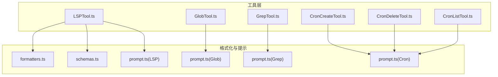
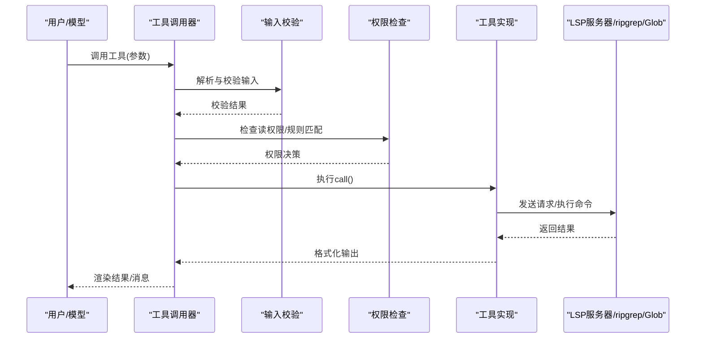
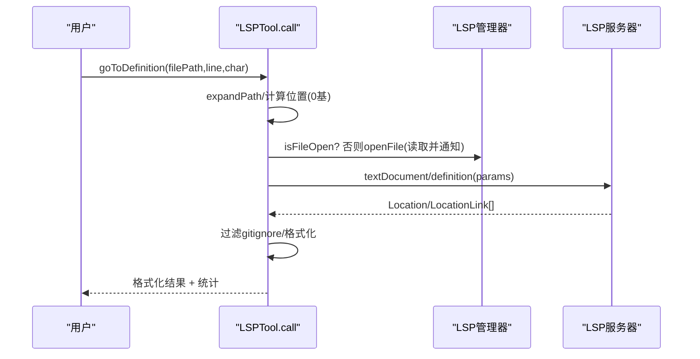
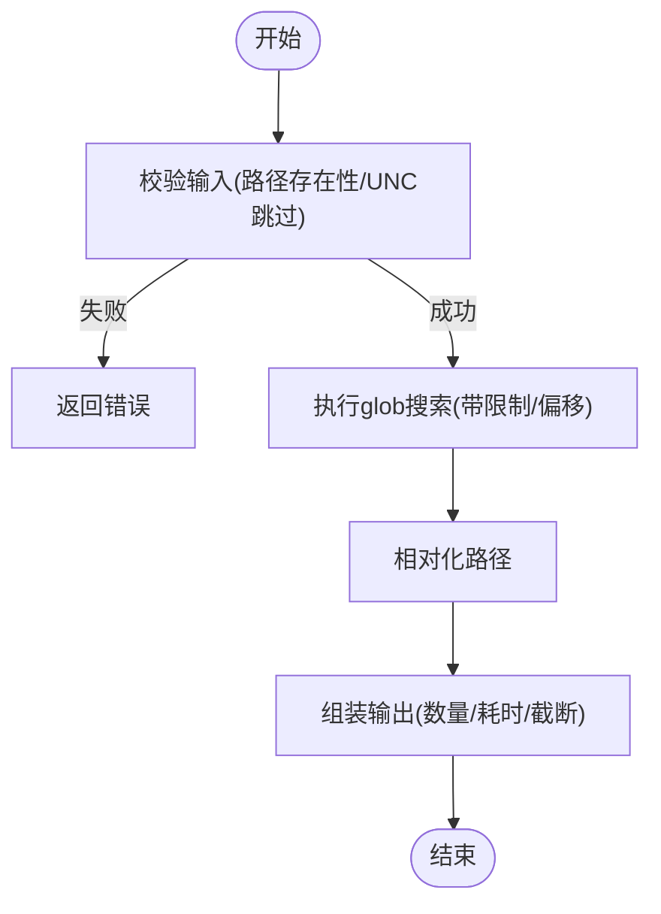
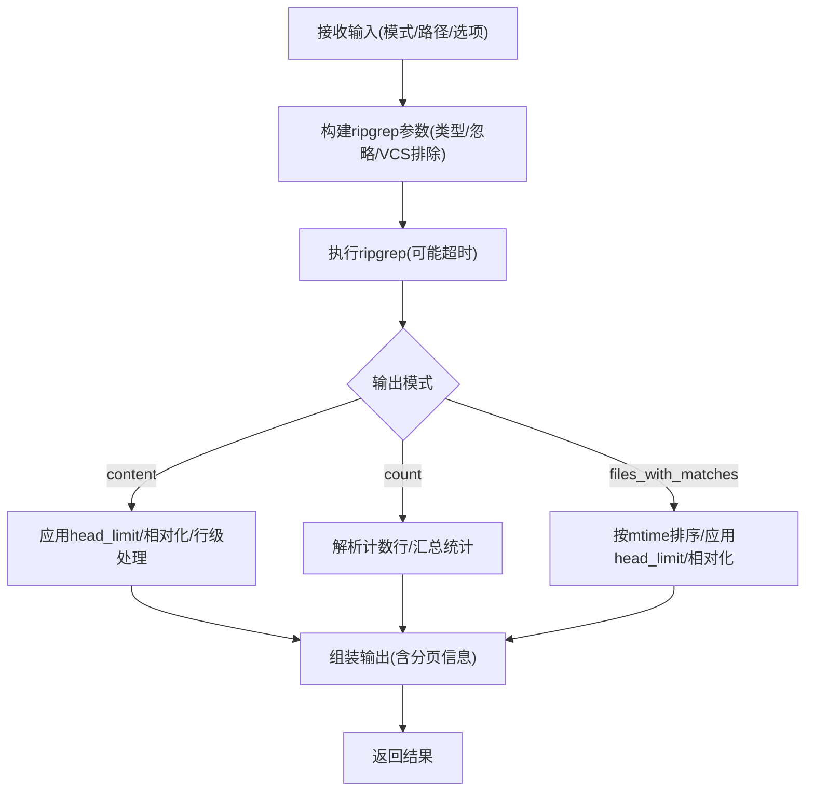
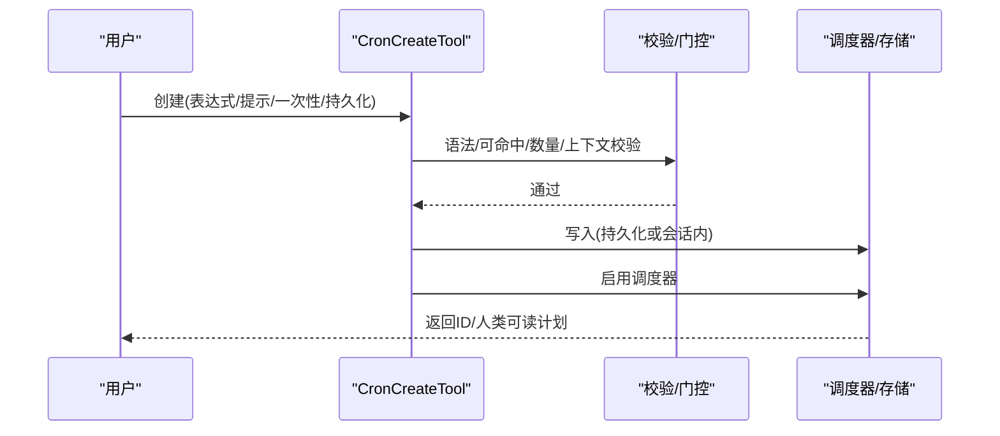
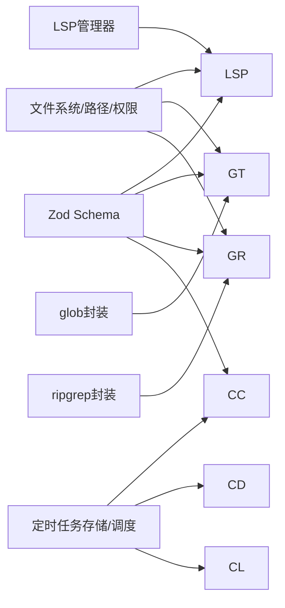

# 系统工具

<cite>
**本文引用的文件**
- [LSPTool.ts](file://src/tools/LSPTool/LSPTool.ts)
- [formatters.ts](file://src/tools/LSPTool/formatters.ts)
- [schemas.ts](file://src/tools/LSPTool/schemas.ts)
- [prompt.ts](file://src/tools/LSPTool/prompt.ts)
- [GlobTool.ts](file://src/tools/GlobTool/GlobTool.ts)
- [prompt.ts](file://src/tools/GlobTool/prompt.ts)
- [GrepTool.ts](file://src/tools/GrepTool/GrepTool.ts)
- [prompt.ts](file://src/tools/GrepTool/prompt.ts)
- [CronCreateTool.ts](file://src/tools/ScheduleCronTool/CronCreateTool.ts)
- [CronDeleteTool.ts](file://src/tools/ScheduleCronTool/CronDeleteTool.ts)
- [CronListTool.ts](file://src/tools/ScheduleCronTool/CronListTool.ts)
- [prompt.ts](file://src/tools/ScheduleCronTool/prompt.ts)
</cite>

## 目录
1. [简介](#简介)
2. [项目结构](#项目结构)
3. [核心组件](#核心组件)
4. [架构总览](#架构总览)
5. [详细组件分析](#详细组件分析)
6. [依赖分析](#依赖分析)
7. [性能考量](#性能考量)
8. [故障排除指南](#故障排除指南)
9. [结论](#结论)
10. [附录](#附录)

## 简介
本文件面向Claude Code的系统工具，围绕以下四类工具进行技术文档化：
- LSPTool：提供代码补全、符号导航与语言服务（LSP）能力，覆盖定义跳转、引用查找、悬停信息、文档/工作区符号、实现跳转、调用层次等。
- GlobTool：基于glob模式进行文件匹配与搜索，支持按修改时间排序与结果截断。
- GrepTool：基于ripgrep的文本搜索与计数，支持正则、上下文、大小写不敏感、类型过滤、多行匹配等，并对输出进行分页与相对路径优化。
- ScheduleCronTool：提供定时任务管理，包括创建（一次性/周期性）、删除、列出，支持会话内与持久化两种存储方式。

文档重点解释各工具与IDE集成的工作原理、权限与安全校验、性能优化策略、错误处理机制、配置选项、使用场景与最佳实践，并提供实际使用案例与故障排除建议。

## 项目结构
系统工具位于src/tools目录下，每个工具以独立子目录组织，包含：
- 工具主入口（如LSPTool.ts、GlobTool.ts、GrepTool.ts、CronCreateTool.ts等）
- UI渲染与提示词（UI.tsx与prompt.ts）
- 数据格式化（如LSPTool的formatters.ts）
- 输入/输出Schema（如LSPTool的schemas.ts）

**图表来源**
- [LSPTool.ts:1-861](file://src/tools/LSPTool/LSPTool.ts#L1-L861)
- [formatters.ts:1-593](file://src/tools/LSPTool/formatters.ts#L1-L593)
- [schemas.ts:1-216](file://src/tools/LSPTool/schemas.ts#L1-L216)
- [prompt.ts:1-22](file://src/tools/LSPTool/prompt.ts#L1-L22)
- [GlobTool.ts:1-199](file://src/tools/GlobTool/GlobTool.ts#L1-L199)
- [prompt.ts:1-8](file://src/tools/GlobTool/prompt.ts#L1-L8)
- [GrepTool.ts:1-578](file://src/tools/GrepTool/GrepTool.ts#L1-L578)
- [prompt.ts:1-19](file://src/tools/GrepTool/prompt.ts#L1-L19)
- [CronCreateTool.ts:1-158](file://src/tools/ScheduleCronTool/CronCreateTool.ts#L1-L158)
- [CronDeleteTool.ts:1-96](file://src/tools/ScheduleCronTool/CronDeleteTool.ts#L1-L96)
- [CronListTool.ts:1-98](file://src/tools/ScheduleCronTool/CronListTool.ts#L1-L98)
- [prompt.ts:1-136](file://src/tools/ScheduleCronTool/prompt.ts#L1-L136)

**章节来源**
- [LSPTool.ts:1-861](file://src/tools/LSPTool/LSPTool.ts#L1-L861)
- [GlobTool.ts:1-199](file://src/tools/GlobTool/GlobTool.ts#L1-L199)
- [GrepTool.ts:1-578](file://src/tools/GrepTool/GrepTool.ts#L1-L578)
- [CronCreateTool.ts:1-158](file://src/tools/ScheduleCronTool/CronCreateTool.ts#L1-L158)
- [CronDeleteTool.ts:1-96](file://src/tools/ScheduleCronTool/CronDeleteTool.ts#L1-L96)
- [CronListTool.ts:1-98](file://src/tools/ScheduleCronTool/CronListTool.ts#L1-L98)

## 核心组件
- LSPTool：封装LSP协议请求，负责输入校验、权限检查、文件打开与内容读取、请求发送、结果过滤与格式化、错误日志与回退。
- GlobTool：基于glob库进行文件匹配，支持路径合法性校验、权限匹配、结果截断与相对路径展示。
- GrepTool：基于ripgrep执行内容搜索，支持多种输出模式、上下文、分页、忽略模式、VCS目录排除、WSL性能考虑与超时处理。
- ScheduleCronTool：提供三类工具（创建/删除/列出），统一的启用门控、作业数量限制、持久化开关、会话内/持久化存储区分、人类可读计划描述。

**章节来源**
- [LSPTool.ts:127-422](file://src/tools/LSPTool/LSPTool.ts#L127-L422)
- [GlobTool.ts:57-199](file://src/tools/GlobTool/GlobTool.ts#L57-L199)
- [GrepTool.ts:160-578](file://src/tools/GrepTool/GrepTool.ts#L160-L578)
- [CronCreateTool.ts:56-158](file://src/tools/ScheduleCronTool/CronCreateTool.ts#L56-L158)
- [CronDeleteTool.ts:35-96](file://src/tools/ScheduleCronTool/CronDeleteTool.ts#L35-L96)
- [CronListTool.ts:37-98](file://src/tools/ScheduleCronTool/CronListTool.ts#L37-L98)

## 架构总览
系统工具遵循统一的ToolDef接口规范，具备：
- 输入/输出Schema（Zod）用于严格校验与自动分类
- 权限检查与文件系统访问控制
- 统一的渲染消息与工具结果映射
- 并发安全与只读标记
- 可选的延迟执行与IDE连接状态感知

**图表来源**
- [LSPTool.ts:155-414](file://src/tools/LSPTool/LSPTool.ts#L155-L414)
- [GlobTool.ts:94-176](file://src/tools/GlobTool/GlobTool.ts#L94-L176)
- [GrepTool.ts:310-576](file://src/tools/GrepTool/GrepTool.ts#L310-L576)
- [CronCreateTool.ts:117-142](file://src/tools/ScheduleCronTool/CronCreateTool.ts#L117-L142)

## 详细组件分析

### LSPTool：语言服务与代码智能
- 功能范围
  - 定义跳转、引用查找、悬停信息、文档/工作区符号、实现跳转、调用层次准备、入边/出边调用。
- 关键流程
  - 初始化等待：若LSP初始化中，先等待完成再发起请求。
  - 文件打开：若目标文件未在LSP中打开，按大小阈值读取并open/notify服务器。
  - 请求映射：将操作映射到标准LSP方法，位置转换为0基坐标。
  - 结果处理：对位置型结果过滤gitignore；调用formatter生成人类可读文本。
  - 错误处理：捕获异常、记录日志、返回友好错误信息。
- 性能与安全
  - 文件大小限制（默认10MB），避免大文件影响LSP性能。
  - UNC路径跳过FS操作，防止NTLM泄漏。
  - git check-ignore批处理过滤忽略文件，提升位置结果质量。
- 输出统计
  - 记录结果数量与文件数量，便于后续分页与摘要。

**图表来源**
- [LSPTool.ts:224-394](file://src/tools/LSPTool/LSPTool.ts#L224-L394)
- [formatters.ts:127-169](file://src/tools/LSPTool/formatters.ts#L127-L169)
- [schemas.ts:8-191](file://src/tools/LSPTool/schemas.ts#L8-L191)

**章节来源**
- [LSPTool.ts:127-422](file://src/tools/LSPTool/LSPTool.ts#L127-L422)
- [formatters.ts:1-593](file://src/tools/LSPTool/formatters.ts#L1-L593)
- [schemas.ts:1-216](file://src/tools/LSPTool/schemas.ts#L1-L216)
- [prompt.ts:1-22](file://src/tools/LSPTool/prompt.ts#L1-L22)

### GlobTool：文件模式匹配与搜索
- 功能范围
  - 基于glob模式匹配文件，支持指定根目录或当前工作目录，默认按修改时间排序，限制最大返回数量并截断。
- 关键流程
  - 输入校验：若提供路径，验证存在且为目录；UNC路径跳过FS检查。
  - 权限匹配：通过通配符规则匹配模式，便于策略控制。
  - 执行搜索：调用glob函数，应用限制与偏移，相对化路径节省token。
  - 结果映射：空结果提示“未找到”，截断时附加提示。
- 性能与安全
  - 截断与相对路径减少输出体积，降低上下文占用。
  - UNC路径绕过FS检查，避免网络凭据泄露风险。

**图表来源**
- [GlobTool.ts:94-176](file://src/tools/GlobTool/GlobTool.ts#L94-L176)

**章节来源**
- [GlobTool.ts:57-199](file://src/tools/GlobTool/GlobTool.ts#L57-L199)
- [prompt.ts:1-8](file://src/tools/GlobTool/prompt.ts#L1-L8)

### GrepTool：文本搜索与替换（基于ripgrep）
- 功能范围
  - 正则搜索、文件列表、计数三种输出模式；支持上下文（前后/对称）、行号、大小写不敏感、类型过滤、多行匹配、忽略模式、VCS目录排除。
- 关键流程
  - 参数构建：根据模式与选项拼装ripgrep参数，处理特殊模式开头、glob拆分、忽略模式、插件缓存排除。
  - 执行搜索：调用ripgrep，处理超时与中断；不同模式分别处理。
  - 内容模式：先应用head_limit再相对化路径，避免无谓的路径转换。
  - 计数模式：解析“文件:计数”行，汇总总数与文件数。
  - 文件列表模式：按修改时间降序排序，应用head_limit与相对化路径。
- 性能与安全
  - 默认head_limit上限与相对化路径减少输出体积。
  - WSL性能惩罚由ripgrep自身超时处理，避免打断代理循环。
  - 忽略模式与VCS排除减少噪声与无效I/O。

**图表来源**
- [GrepTool.ts:310-576](file://src/tools/GrepTool/GrepTool.ts#L310-L576)

**章节来源**
- [GrepTool.ts:160-578](file://src/tools/GrepTool/GrepTool.ts#L160-L578)
- [prompt.ts:1-19](file://src/tools/GrepTool/prompt.ts#L1-L19)

### ScheduleCronTool：定时任务管理
- 功能范围
  - 创建：支持周期性与一次性任务，本地时区cron表达式，可选持久化（durable）与会话内存储。
  - 删除：按ID取消任务，支持同一会话内跨代理隔离。
  - 列表：查看所有任务，支持按代理过滤。
- 关键流程
  - 启用门控：综合构建期特性与运行期GrowthBook门控，支持本地禁用环境变量。
  - 创建校验：校验cron语法、未来一年内是否可命中、任务数量上限、持久化与代理上下文兼容性。
  - 存储策略：持久化写入固定文件，会话内存储驻内存；统一调度器在启用后轮询触发。
  - 删除校验：确认任务存在、代理上下文一致。
  - 列表过滤：团队成员仅可见自身任务，负责人可见全部。
- 配置与行为
  - 默认最大存活天数、抖动策略、人类可读计划描述、分页与截断提示。

**图表来源**
- [CronCreateTool.ts:117-142](file://src/tools/ScheduleCronTool/CronCreateTool.ts#L117-L142)
- [CronDeleteTool.ts:82-84](file://src/tools/ScheduleCronTool/CronDeleteTool.ts#L82-L84)
- [CronListTool.ts:63-78](file://src/tools/ScheduleCronTool/CronListTool.ts#L63-L78)
- [prompt.ts:36-62](file://src/tools/ScheduleCronTool/prompt.ts#L36-L62)

**章节来源**
- [CronCreateTool.ts:56-158](file://src/tools/ScheduleCronTool/CronCreateTool.ts#L56-L158)
- [CronDeleteTool.ts:35-96](file://src/tools/ScheduleCronTool/CronDeleteTool.ts#L35-L96)
- [CronListTool.ts:37-98](file://src/tools/ScheduleCronTool/CronListTool.ts#L37-L98)
- [prompt.ts:1-136](file://src/tools/ScheduleCronTool/prompt.ts#L1-L136)

## 依赖分析
- 统一依赖
  - Zod Schema：严格的输入/输出校验与自动分类。
  - 工具基类：buildTool、ToolDef、权限工具、路径/工作目录工具、日志与调试工具。
  - LSP集成：LSP管理器、URI/位置转换、gitignore过滤、文件大小限制。
  - 搜索引擎：ripgrep封装、glob封装、忽略模式与VCS排除。
  - 定时任务：cron解析/转换、任务存储与调度、持久化开关。
- 耦合与内聚
  - 工具内部高内聚，跨工具低耦合；LSPTool依赖语言服务器生态；Glob/Grep共享文件系统与权限框架；CronTool依赖调度与存储模块。
- 循环依赖
  - 未见直接循环依赖；工具间通过服务层与工具基类解耦。

**图表来源**
- [LSPTool.ts:1-861](file://src/tools/LSPTool/LSPTool.ts#L1-L861)
- [GlobTool.ts:1-199](file://src/tools/GlobTool/GlobTool.ts#L1-L199)
- [GrepTool.ts:1-578](file://src/tools/GrepTool/GrepTool.ts#L1-L578)
- [CronCreateTool.ts:1-158](file://src/tools/ScheduleCronTool/CronCreateTool.ts#L1-L158)
- [CronDeleteTool.ts:1-96](file://src/tools/ScheduleCronTool/CronDeleteTool.ts#L1-L96)
- [CronListTool.ts:1-98](file://src/tools/ScheduleCronTool/CronListTool.ts#L1-L98)

**章节来源**
- [LSPTool.ts:1-861](file://src/tools/LSPTool/LSPTool.ts#L1-L861)
- [GlobTool.ts:1-199](file://src/tools/GlobTool/GlobTool.ts#L1-L199)
- [GrepTool.ts:1-578](file://src/tools/GrepTool/GrepTool.ts#L1-L578)
- [CronCreateTool.ts:1-158](file://src/tools/ScheduleCronTool/CronCreateTool.ts#L1-L158)
- [CronDeleteTool.ts:1-96](file://src/tools/ScheduleCronTool/CronDeleteTool.ts#L1-L96)
- [CronListTool.ts:1-98](file://src/tools/ScheduleCronTool/CronListTool.ts#L1-L98)

## 性能考量
- LSPTool
  - 文件大小阈值限制，避免大文件导致LSP服务器压力。
  - 仅在未打开时读取文件内容，减少重复I/O。
  - git check-ignore批处理过滤忽略文件，降低无效结果。
- GlobTool
  - 截断与相对化路径，减少输出长度与token消耗。
- GrepTool
  - 默认head_limit上限，配合offset实现分页；WSL超时由ripgrep处理，避免打断代理循环；相对化路径减少输出体积。
- ScheduleCronTool
  - 门控与持久化开关，避免不必要的磁盘写入；抖动与最大存活天数控制资源占用。

[本节为通用性能讨论，无需特定文件分析]

## 故障排除指南
- LSPTool常见问题
  - “无可用LSP服务器”：确认文件类型有对应LSP服务器配置；等待初始化完成后再试。
  - “文件过大”：超过10MB的文件会被拒绝分析。
  - “未找到定义/引用”：光标位置不在符号上或外部库未索引。
  - “URI为空/格式异常”：LSP服务器返回数据异常，工具已做防御性处理。
- GlobTool常见问题
  - “目录不存在”：检查路径是否存在，必要时参考当前工作目录建议。
  - “结果被截断”：使用更具体的路径或模式，或调整head_limit。
- GrepTool常见问题
  - “搜索未完成（超时）”：ripgrep超时，通常表示匹配集过大或I/O受限；尝试缩小范围、使用类型过滤或glob过滤。
  - “未找到匹配”：检查正则语法、大小写敏感、是否被忽略模式或VCS目录排除。
- ScheduleCronTool常见问题
  - “cron表达式无效”：确保为标准5字段表达式，且在未来一年内可命中。
  - “任务过多”：超过上限需先删除部分任务。
  - “持久化不可用”：受运行期门控限制，或代理上下文不支持持久化。

**章节来源**
- [LSPTool.ts:283-297](file://src/tools/LSPTool/LSPTool.ts#L283-L297)
- [GlobTool.ts:108-131](file://src/tools/GlobTool/GlobTool.ts#L108-L131)
- [GrepTool.ts:439-441](file://src/tools/GrepTool/GrepTool.ts#L439-L441)
- [CronCreateTool.ts:82-115](file://src/tools/ScheduleCronTool/CronCreateTool.ts#L82-L115)

## 结论
上述四类系统工具在Claude Code中承担了代码智能、文件检索、内容搜索与任务调度的关键职责。它们通过严格的Schema校验、统一的权限与安全策略、合理的性能优化与错误处理，实现了在复杂工程中的稳定与高效。结合IDE集成与会话上下文，这些工具能够支撑从探索性搜索到自动化提醒的多样化场景。

[本节为总结性内容，无需特定文件分析]

## 附录
- 使用场景与最佳实践
  - LSPTool：在需要快速定位符号、查看文档或分析调用关系时优先使用；对大文件谨慎使用。
  - GlobTool：在需要按名称/通配符快速发现文件时使用；配合Grep进行二次筛选。
  - GrepTool：在需要正则搜索、上下文查看、统计计数时使用；注意默认head_limit与分页策略。
  - ScheduleCronTool：在需要定时提醒或周期性任务时使用；对持久化需求明确区分会话内与持久化存储。
- 配置选项速览
  - LSPTool：operation、filePath、line、character（位置为1基）。
  - GlobTool：pattern、path（可选）。
  - GrepTool：pattern、path、glob、output_mode、上下文与行号、大小写、类型、head_limit、offset、multiline。
  - ScheduleCronTool：cron、prompt、recurring、durable。

[本节为概览性内容，无需特定文件分析]