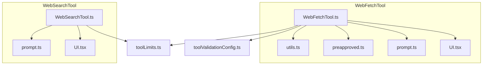
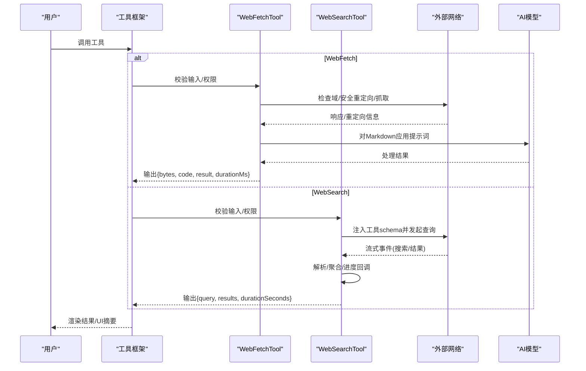
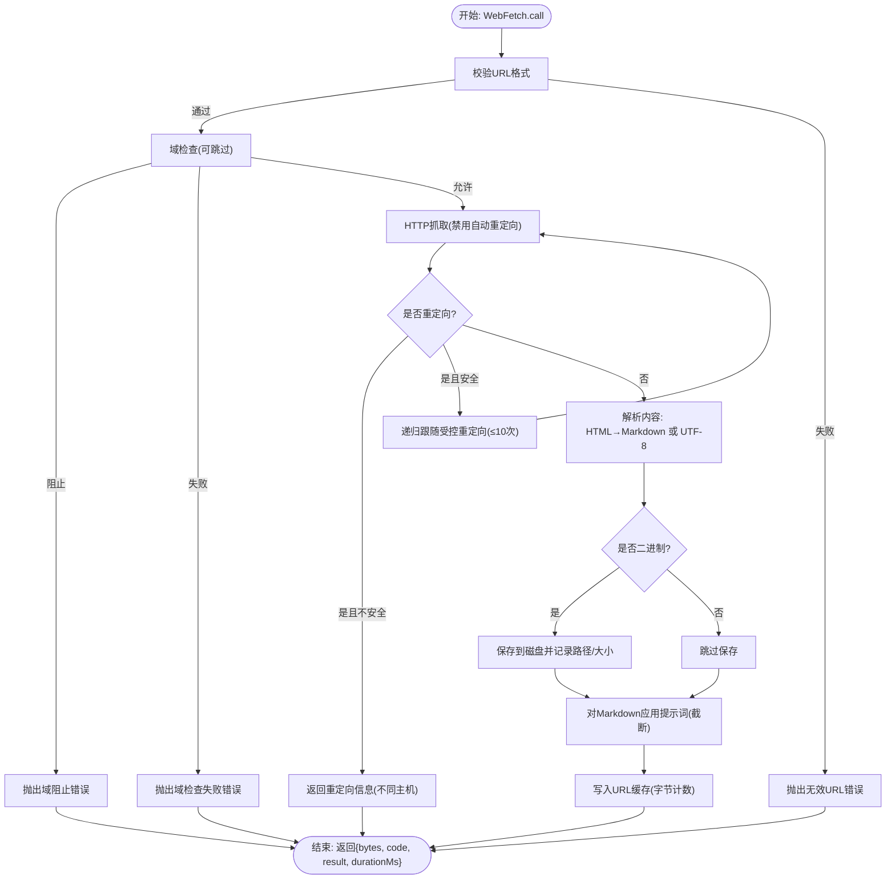
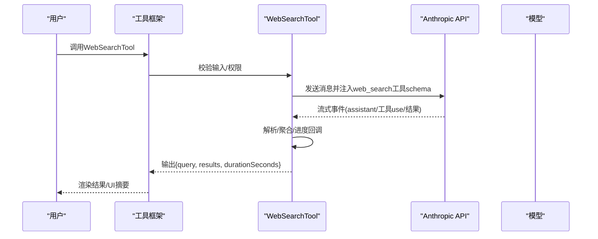
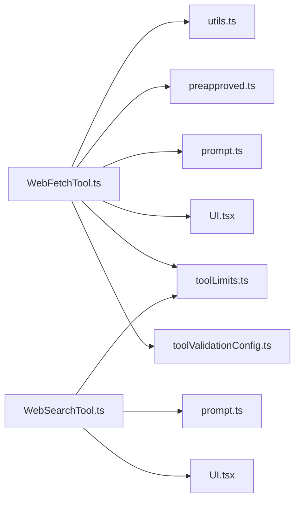

# 网络工具

<cite>
**本文引用的文件**
- [WebFetchTool.ts](file://src/tools/WebFetchTool/WebFetchTool.ts)
- [utils.ts](file://src/tools/WebFetchTool/utils.ts)
- [preapproved.ts](file://src/tools/WebFetchTool/preapproved.ts)
- [prompt.ts](file://src/tools/WebFetchTool/prompt.ts)
- [UI.tsx](file://src/tools/WebFetchTool/UI.tsx)
- [WebSearchTool.ts](file://src/tools/WebSearchTool/WebSearchTool.ts)
- [prompt.ts](file://src/tools/WebSearchTool/prompt.ts)
- [UI.tsx](file://src/tools/WebSearchTool/UI.tsx)
- [toolLimits.ts](file://src/constants/toolLimits.ts)
- [toolValidationConfig.ts](file://src/utils/settings/toolValidationConfig.ts)
</cite>

## 目录
1. [简介](#简介)
2. [项目结构](#项目结构)
3. [核心组件](#核心组件)
4. [架构总览](#架构总览)
5. [详细组件分析](#详细组件分析)
6. [依赖关系分析](#依赖关系分析)
7. [性能考量](#性能考量)
8. [故障排查指南](#故障排查指南)
9. [结论](#结论)
10. [附录](#附录)

## 简介
本文件面向Claude Code的网络工具，系统性梳理并解释两大工具：WebFetchTool（网页内容抓取与处理）与WebSearchTool（搜索引擎集成与信息检索）。文档覆盖以下方面：
- 功能与工作流程：抓取、解析、提示词处理、结果输出
- 安全机制：域名白名单预批准、前序域检查、重定向安全校验、凭据过滤、出口代理阻断检测
- 速率限制与缓存策略：URL级LRU缓存、域检查缓存、内容长度上限、超时与最大重定向次数
- 错误处理、重试机制与超时控制：自定义错误类型、中断信号处理、重定向信息回传
- 配置选项、使用场景与性能优化建议：输入校验、权限规则、UI摘要与展示
- 典型API调用示例与常见问题解决方案：参数组合、跨主机重定向、企业代理限制

## 项目结构
网络工具位于src/tools目录下，分别由工具定义、工具逻辑、提示词与UI渲染组成，并辅以常量与配置文件。

图表来源
- [WebFetchTool.ts:1-319](file://src/tools/WebFetchTool/WebFetchTool.ts#L1-L319)
- [utils.ts:1-531](file://src/tools/WebFetchTool/utils.ts#L1-L531)
- [preapproved.ts:1-167](file://src/tools/WebFetchTool/preapproved.ts#L1-L167)
- [prompt.ts:1-47](file://src/tools/WebFetchTool/prompt.ts#L1-L47)
- [UI.tsx:1-72](file://src/tools/WebFetchTool/UI.tsx#L1-L72)
- [WebSearchTool.ts:1-436](file://src/tools/WebSearchTool/WebSearchTool.ts#L1-L436)
- [prompt.ts:1-35](file://src/tools/WebSearchTool/prompt.ts#L1-L35)
- [UI.tsx:1-101](file://src/tools/WebSearchTool/UI.tsx#L1-L101)
- [toolLimits.ts:1-57](file://src/constants/toolLimits.ts#L1-L57)
- [toolValidationConfig.ts:37-68](file://src/utils/settings/toolValidationConfig.ts#L37-L68)

章节来源
- [WebFetchTool.ts:1-319](file://src/tools/WebFetchTool/WebFetchTool.ts#L1-L319)
- [WebSearchTool.ts:1-436](file://src/tools/WebSearchTool/WebSearchTool.ts#L1-L436)

## 核心组件
- WebFetchTool
  - 职责：从指定URL抓取内容，HTML转Markdown，按提示词对内容进行二次处理，返回摘要或提取结果；支持跨主机重定向提示与二进制内容落盘。
  - 关键点：输入校验、权限判定（含预批准域名）、域检查、安全重定向、LRU缓存、超时与最大内容长度、二进制落盘、提示词驱动的二次模型处理。
- WebSearchTool
  - 职责：通过Anthropic Beta Web Search工具在单次API调用内完成搜索，流式聚合结果，生成带链接的摘要与结果列表。
  - 关键点：工具schema注入、流事件解析、进度回调、结果块拼装、权限提示、可用性条件（供应商与模型）。

章节来源
- [WebFetchTool.ts:66-307](file://src/tools/WebFetchTool/WebFetchTool.ts#L66-L307)
- [WebSearchTool.ts:152-435](file://src/tools/WebSearchTool/WebSearchTool.ts#L152-L435)

## 架构总览
WebFetchTool与WebSearchTool均基于统一的工具框架构建，共享输入/输出模式、权限与UI渲染接口，但底层实现差异显著：前者侧重HTTP抓取与本地处理，后者侧重服务端搜索流式聚合。

图表来源
- [WebFetchTool.ts:208-299](file://src/tools/WebFetchTool/WebFetchTool.ts#L208-L299)
- [utils.ts:347-482](file://src/tools/WebFetchTool/utils.ts#L347-L482)
- [WebSearchTool.ts:254-400](file://src/tools/WebSearchTool/WebSearchTool.ts#L254-L400)

## 详细组件分析

### WebFetchTool 组件分析
- 输入/输出模式
  - 输入：url（必填，URL格式）、prompt（必填，用于对内容进行抽取/总结）
  - 输出：bytes、code、codeText、result、durationMs、url
- 权限与安全
  - 预批准域名：对代码相关文档站点直接放行，仅限GET请求
  - 域名黑名单预检：调用api.anthropic.com进行域可达性检查，命中“阻止”或“检查失败”会抛出对应错误
  - 安全重定向：仅允许协议/端口一致且主机名变化为www.增删或路径变更的情况
  - 凭据过滤：拒绝包含用户名/密码的URL
  - 企业代理阻断检测：识别特定响应头，抛出EgressBlockedError
- 抓取与解析
  - 升级http到https
  - 使用axios抓取，禁用自动跟随重定向，手动递归跟随受控重定向
  - HTML内容转Markdown；非HTML按UTF-8解码
  - 二进制内容保存至磁盘并记录路径与大小
- 缓存与限流
  - URL级LRU缓存：15分钟TTL，50MB容量上限
  - 域检查缓存：5分钟TTL，128条容量
  - 内容长度上限：MAX_HTTP_CONTENT_LENGTH=10MB；二次处理截断MAX_MARKDOWN_LENGTH=100K字符
  - 超时：FETCH_TIMEOUT_MS=60秒；域检查超时DOMAIN_CHECK_TIMEOUT_MS=10秒
  - 最大重定向次数：MAX_REDIRECTS=10
- 提示词与二次处理
  - 对非预批准域名采用更严格的引用规范与长度限制
  - 通过小型快速模型对截断后的Markdown执行二次处理
- 错误与中断
  - 自定义错误类型：DomainBlockedError、DomainCheckFailedError、EgressBlockedError
  - 中断信号：AbortError；当信号被中止时抛出AbortError
- UI与摘要
  - 支持简洁/详细两种渲染模式
  - 工具摘要长度受常量限制

图表来源
- [utils.ts:347-482](file://src/tools/WebFetchTool/utils.ts#L347-L482)
- [WebFetchTool.ts:208-299](file://src/tools/WebFetchTool/WebFetchTool.ts#L208-L299)

章节来源
- [WebFetchTool.ts:24-319](file://src/tools/WebFetchTool/WebFetchTool.ts#L24-L319)
- [utils.ts:1-531](file://src/tools/WebFetchTool/utils.ts#L1-L531)
- [preapproved.ts:1-167](file://src/tools/WebFetchTool/preapproved.ts#L1-L167)
- [prompt.ts:1-47](file://src/tools/WebFetchTool/prompt.ts#L1-L47)
- [UI.tsx:1-72](file://src/tools/WebFetchTool/UI.tsx#L1-L72)

### WebSearchTool 组件分析
- 输入/输出模式
  - 输入：query（必填）、allowed_domains（可选）、blocked_domains（可选，二者不可同时出现）
  - 输出：query、results（混合文本摘要与搜索结果对象）、durationSeconds
- 可用性与权限
  - 受API提供商与模型版本限制：firstParty、Vertex AI特定模型、Foundry默认支持
  - 权限提示：需要显式授权规则
- 工具Schema与流式处理
  - 注入Beta Web Search工具schema，限制最多8次使用
  - 流式事件解析：累计assistant消息、追踪server_tool_use起始、累积input_json_delta提取实际查询、收到web_search_tool_result时触发进度回调
- 结果聚合
  - 将流式块组装为最终输出：文本摘要与搜索结果对象交替出现
- UI与摘要
  - 进度显示：查询更新、结果数量
  - 结果摘要：统计搜索次数与总结果数

图表来源
- [WebSearchTool.ts:254-400](file://src/tools/WebSearchTool/WebSearchTool.ts#L254-L400)

章节来源
- [WebSearchTool.ts:25-436](file://src/tools/WebSearchTool/WebSearchTool.ts#L25-L436)
- [prompt.ts:1-35](file://src/tools/WebSearchTool/prompt.ts#L1-L35)
- [UI.tsx:1-101](file://src/tools/WebSearchTool/UI.tsx#L1-L101)

## 依赖关系分析
- 工具间耦合
  - 两者均遵循统一工具框架，共享输入/输出模式与UI渲染接口
  - WebFetchTool依赖utils.ts中的HTTP抓取、缓存、域检查、提示词构造等
  - WebSearchTool依赖流式API与工具schema注入
- 外部依赖
  - HTTP客户端：axios
  - 缓存：lru-cache
  - Markdown转换：turndown（懒加载）
  - 分析与日志：analytics、log
- 内部依赖
  - 权限与UI：工具框架提供的权限判定与UI渲染函数
  - 常量：工具结果大小限制、令牌估算等

图表来源
- [WebFetchTool.ts:1-319](file://src/tools/WebFetchTool/WebFetchTool.ts#L1-L319)
- [utils.ts:1-531](file://src/tools/WebFetchTool/utils.ts#L1-L531)
- [preapproved.ts:1-167](file://src/tools/WebFetchTool/preapproved.ts#L1-L167)
- [prompt.ts:1-47](file://src/tools/WebFetchTool/prompt.ts#L1-L47)
- [UI.tsx:1-72](file://src/tools/WebFetchTool/UI.tsx#L1-L72)
- [WebSearchTool.ts:1-436](file://src/tools/WebSearchTool/WebSearchTool.ts#L1-L436)
- [prompt.ts:1-35](file://src/tools/WebSearchTool/prompt.ts#L1-L35)
- [UI.tsx:1-101](file://src/tools/WebSearchTool/UI.tsx#L1-L101)
- [toolLimits.ts:1-57](file://src/constants/toolLimits.ts#L1-L57)
- [toolValidationConfig.ts:37-68](file://src/utils/settings/toolValidationConfig.ts#L37-L68)

章节来源
- [WebFetchTool.ts:1-319](file://src/tools/WebFetchTool/WebFetchTool.ts#L1-L319)
- [WebSearchTool.ts:1-436](file://src/tools/WebSearchTool/WebSearchTool.ts#L1-L436)

## 性能考量
- 缓存策略
  - URL级LRU缓存：15分钟TTL，50MB容量，按内容字节计费，避免重复抓取
  - 域检查缓存：5分钟TTL，128条容量，减少重复域可达性检查
- 资源限制
  - 单次HTTP内容长度上限：10MB；防止内存与上下文膨胀
  - 二次处理内容截断：100K字符，避免“提示过长”错误
  - 工具结果整体大小限制：系统默认上限与令牌估算，避免消息过大
- 超时与重定向
  - 抓取超时：60秒；域检查超时：10秒
  - 最大重定向次数：10次，防止重定向环路导致长时间占用
- 并发与只读
  - 两个工具均为并发安全且只读，适合多任务并行使用

章节来源
- [utils.ts:61-129](file://src/tools/WebFetchTool/utils.ts#L61-L129)
- [toolLimits.ts:1-57](file://src/constants/toolLimits.ts#L1-L57)

## 故障排查指南
- 常见错误与处理
  - 域阻止：域检查返回“阻止”，抛出DomainBlockedError；请确认目标域是否在允许列表或调整访问方式
  - 域检查失败：网络受限或企业策略阻断，抛出DomainCheckFailedError；可考虑跳过预检（企业设置项）或联系管理员
  - 企业代理阻断：响应状态403且特定头部，抛出EgressBlockedError；需调整出口策略或使用合规代理
  - 无效URL：URL格式不合法或超长；修正URL格式与长度
  - 跨主机重定向：返回重定向信息并给出新URL；请使用新URL重新发起WebFetch
  - 中断/取消：AbortError；检查调用方的AbortController信号
- 重试与超时
  - 工具未内置自动重试；建议在上层调用侧根据业务需求实现指数退避重试
  - 超时已内置：抓取60秒、域检查10秒；如遇不稳定网络，可适当放宽上层等待时间
- 权限与规则
  - WebFetch：可通过“domain:hostname”格式添加本地规则；预批准域名无需额外规则
  - WebSearch：需要显式授权规则；确保当前环境满足提供商与模型要求

章节来源
- [utils.ts:20-48](file://src/tools/WebFetchTool/utils.ts#L20-L48)
- [WebFetchTool.ts:104-180](file://src/tools/WebFetchTool/WebFetchTool.ts#L104-L180)
- [WebSearchTool.ts:209-222](file://src/tools/WebSearchTool/WebSearchTool.ts#L209-L222)

## 结论
WebFetchTool与WebSearchTool在Claude Code中分别承担“网页内容抓取与二次处理”和“实时网络搜索”的职责。前者强调安全与可控（域检查、重定向校验、缓存与限流），后者强调效率与体验（流式聚合、进度反馈）。两者共同提供了安全、高效、可扩展的网络信息获取能力，并通过统一的工具框架与UI体系提升一致性与可观测性。

## 附录

### 配置选项与使用场景
- WebFetchTool
  - 输入：url（完整URL）、prompt（提取/总结指令）
  - 使用场景：拉取技术文档、开源仓库README、博客文章摘要、报告片段分析
  - 安全建议：优先使用预批准域名；对私有/认证页面使用专用MCP工具
- WebSearchTool
  - 输入：query（查询词）、allowed_domains（可选）、blocked_domains（可选，二者互斥）
  - 使用场景：热点事件、最新技术动态、产品文档、FAQ解答
  - 可用性：需满足提供商与模型版本要求

章节来源
- [WebFetchTool.ts:191-204](file://src/tools/WebFetchTool/WebFetchTool.ts#L191-L204)
- [WebSearchTool.ts:235-253](file://src/tools/WebSearchTool/WebSearchTool.ts#L235-L253)
- [prompt.ts:26-33](file://src/tools/WebSearchTool/prompt.ts#L26-L33)

### API调用示例与最佳实践
- WebFetchTool
  - 示例参数：url=https://example.com/doc，prompt=“提取关键要点与代码示例”
  - 跨主机重定向：收到重定向信息后，使用新URL再次调用WebFetch
  - 二进制内容：PDF等会被保存到磁盘，工具结果中会包含路径提示
- WebSearchTool
  - 示例参数：query=“最新React文档”，allowed_domains=[“react.dev”]
  - 结果格式：results数组包含文本摘要与链接对象；务必在回复中包含Sources与链接
  - 进度回调：可监听查询更新与结果到达事件，提升交互体验

章节来源
- [WebFetchTool.ts:216-249](file://src/tools/WebFetchTool/WebFetchTool.ts#L216-L249)
- [WebSearchTool.ts:363-387](file://src/tools/WebSearchTool/WebSearchTool.ts#L363-L387)