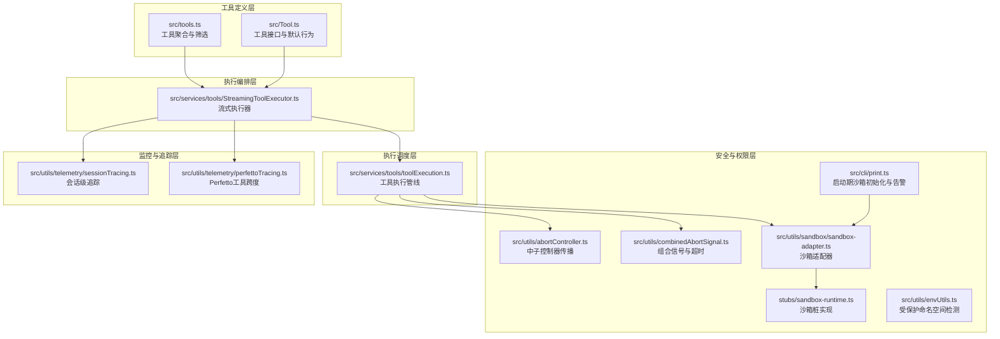
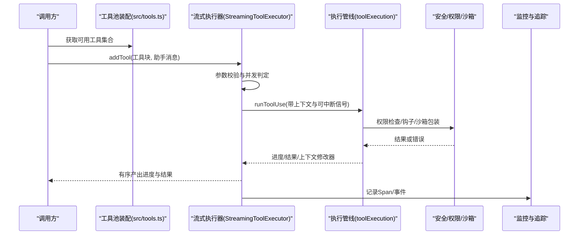
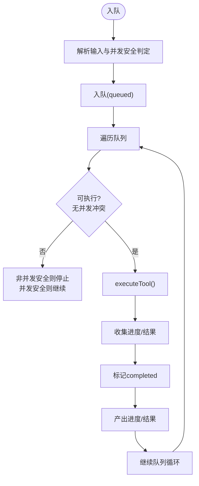
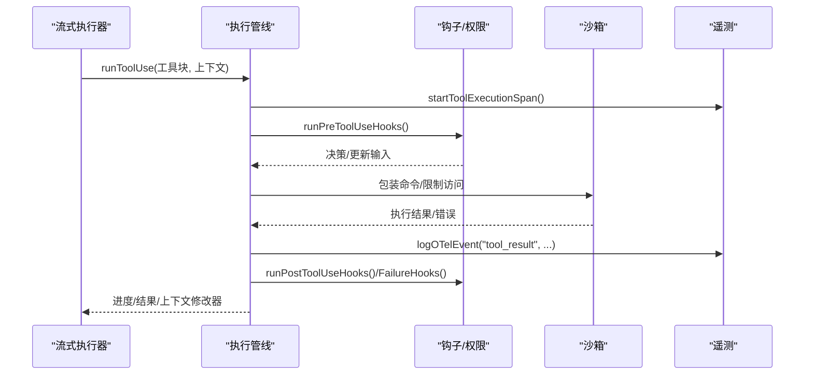
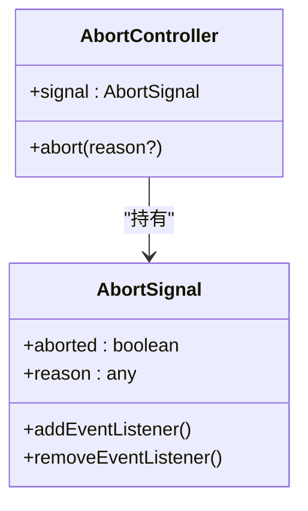
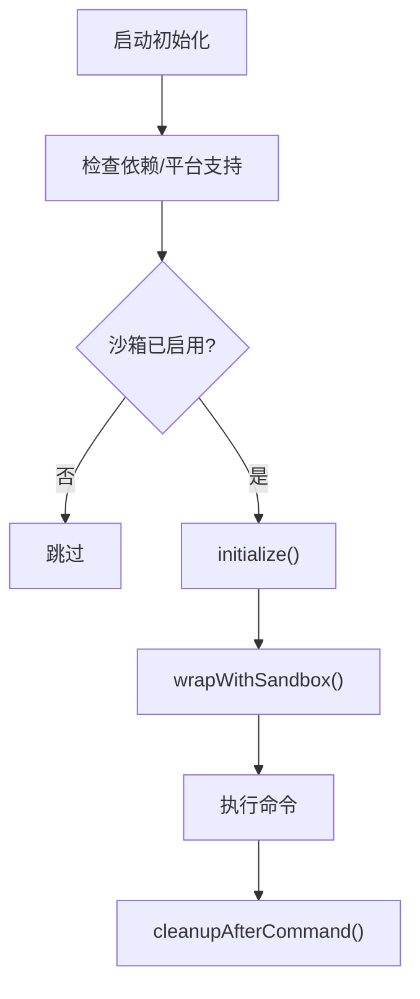
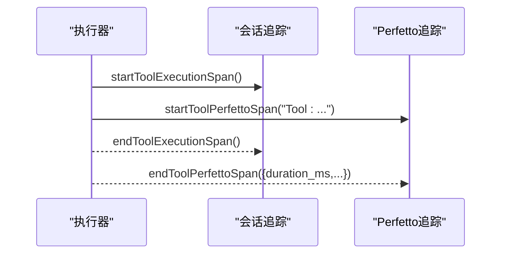
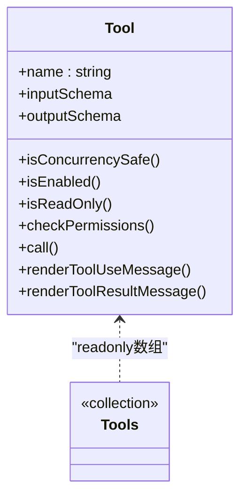
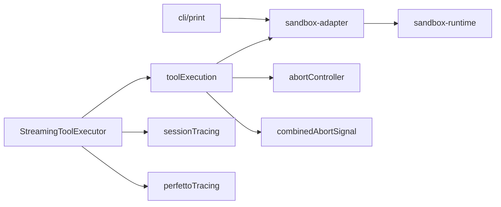

# 工具执行引擎

<cite>
**本文引用的文件**
- [StreamingToolExecutor.ts](file://src/services/tools/StreamingToolExecutor.ts)
- [toolExecution.ts](file://src/services/tools/toolExecution.ts)
- [Tool.ts](file://src/Tool.ts)
- [tools.ts](file://src/tools.ts)
- [abortController.ts](file://src/utils/abortController.ts)
- [combinedAbortSignal.ts](file://src/utils/combinedAbortSignal.ts)
- [sandbox-adapter.ts](file://src/utils/sandbox/sandbox-adapter.ts)
- [sandbox-runtime.ts](file://stubs/sandbox-runtime.ts)
- [envUtils.ts](file://src/utils/envUtils.ts)
- [print.ts](file://src/cli/print.ts)
- [sessionTracing.ts](file://src/utils/telemetry/sessionTracing.ts)
- [perfettoTracing.ts](file://src/utils/telemetry/perfettoTracing.ts)
- [FileEditTool.ts](file://src/tools/FileEditTool/FileEditTool.ts)
</cite>

## 目录
1. [简介](#简介)
2. [项目结构](#项目结构)
3. [核心组件](#核心组件)
4. [架构总览](#架构总览)
5. [详细组件分析](#详细组件分析)
6. [依赖关系分析](#依赖关系分析)
7. [性能考量](#性能考量)
8. [故障排除指南](#故障排除指南)
9. [结论](#结论)
10. [附录](#附录)

## 简介
本技术文档面向Claude Code的工具执行引擎，系统性阐述工具调用解析、参数处理、并发调度与异步执行、监控与追踪、安全保障（资源限制、执行隔离、恶意代码防护）、性能优化策略以及扩展与定制方法。目标是帮助开发者在不深入源码的前提下，也能高效理解并正确使用与扩展该引擎。

## 项目结构
工具执行引擎由“工具定义层”“执行编排层”“执行调度层”“安全与权限层”“监控与追踪层”构成，围绕统一的工具接口与上下文进行协作。

**图表来源**
- [tools.ts:190-390](file://src/tools.ts#L190-L390)
- [Tool.ts:362-793](file://src/Tool.ts#L362-L793)
- [StreamingToolExecutor.ts:40-124](file://src/services/tools/StreamingToolExecutor.ts#L40-L124)
- [toolExecution.ts:1-200](file://src/services/tools/toolExecution.ts#L1-L200)
- [abortController.ts:68-78](file://src/utils/abortController.ts#L68-L78)
- [combinedAbortSignal.ts:15-47](file://src/utils/combinedAbortSignal.ts#L15-L47)
- [sandbox-adapter.ts:704-725](file://src/utils/sandbox/sandbox-adapter.ts#L704-L725)
- [sandbox-runtime.ts:15-38](file://stubs/sandbox-runtime.ts#L15-L38)
- [envUtils.ts:136-147](file://src/utils/envUtils.ts#L136-L147)
- [print.ts:598-626](file://src/cli/print.ts#L598-L626)
- [sessionTracing.ts:788-833](file://src/utils/telemetry/sessionTracing.ts#L788-L833)
- [perfettoTracing.ts:696-763](file://src/utils/telemetry/perfettoTracing.ts#L696-L763)

**章节来源**
- [tools.ts:190-390](file://src/tools.ts#L190-L390)
- [Tool.ts:362-793](file://src/Tool.ts#L362-L793)
- [StreamingToolExecutor.ts:40-124](file://src/services/tools/StreamingToolExecutor.ts#L40-L124)
- [toolExecution.ts:1-200](file://src/services/tools/toolExecution.ts#L1-L200)

## 核心组件
- 工具定义与默认行为：通过统一的工具接口描述工具能力、输入输出、并发安全、只读/破坏性等属性，并提供安全默认值，确保调用方无需判空。
- 流式执行器：负责工具入队、并发控制、进度消息即时产出、结果有序回传、中断与取消传播。
- 执行管线：封装权限校验、钩子、错误分类与上报、结果归档与持久化、性能与遥测埋点。
- 安全与权限：AbortController层级传播、组合信号与超时、沙箱初始化与网络/文件系统限制、受保护命名空间检测。
- 监控与追踪：会话级Span与Perfetto工具跨度，支持OTLP事件与统计指标。

**章节来源**
- [Tool.ts:743-774](file://src/Tool.ts#L743-L774)
- [StreamingToolExecutor.ts:40-124](file://src/services/tools/StreamingToolExecutor.ts#L40-L124)
- [toolExecution.ts:1134-1401](file://src/services/tools/toolExecution.ts#L1134-L1401)
- [abortController.ts:68-78](file://src/utils/abortController.ts#L68-L78)
- [combinedAbortSignal.ts:15-47](file://src/utils/combinedAbortSignal.ts#L15-L47)
- [sandbox-adapter.ts:704-725](file://src/utils/sandbox/sandbox-adapter.ts#L704-L725)
- [sessionTracing.ts:788-833](file://src/utils/telemetry/sessionTracing.ts#L788-L833)
- [perfettoTracing.ts:696-763](file://src/utils/telemetry/perfettoTracing.ts#L696-L763)

## 架构总览
工具执行从“工具池装配”开始，经“流式执行器”进行并发与顺序约束，再进入“执行管线”完成权限、钩子、结果与遥测，最终由“监控与追踪”记录全过程。

**图表来源**
- [tools.ts:271-327](file://src/tools.ts#L271-L327)
- [StreamingToolExecutor.ts:76-124](file://src/services/tools/StreamingToolExecutor.ts#L76-L124)
- [toolExecution.ts:1134-1401](file://src/services/tools/toolExecution.ts#L1134-L1401)
- [sessionTracing.ts:788-833](file://src/utils/telemetry/sessionTracing.ts#L788-L833)

## 详细组件分析

### 组件A：流式执行器（StreamingToolExecutor）
- 职责
  - 工具入队与并发控制：仅允许满足并发安全条件的工具执行；非并发安全工具需独占执行。
  - 进度与结果的即时产出：优先产出待定进度消息，随后按接收顺序产出已完成结果。
  - 中断与取消传播：基于AbortController层级传播，支持用户中断、兄弟工具失败导致的级联取消。
  - 上下文修改：对非并发安全工具支持上下文修改器，保证顺序一致性。
- 关键流程
  - 入队：解析输入、判定并发安全、入队。
  - 队列推进：根据当前执行状态判断是否可执行，执行后触发后续队列处理。
  - 执行：生成子AbortController，运行工具生成器，收集进度与结果，必要时注入合成错误。
  - 结果产出：迭代已完成工具，产出进度与结果，标记工具使用完成。
  - 剩余等待：当仍有执行中的工具但无已完成结果时，等待任一完成或进度可用。

**图表来源**
- [StreamingToolExecutor.ts:140-151](file://src/services/tools/StreamingToolExecutor.ts#L140-L151)
- [StreamingToolExecutor.ts:265-405](file://src/services/tools/StreamingToolExecutor.ts#L265-L405)
- [StreamingToolExecutor.ts:412-440](file://src/services/tools/StreamingToolExecutor.ts#L412-L440)

**章节来源**
- [StreamingToolExecutor.ts:40-124](file://src/services/tools/StreamingToolExecutor.ts#L40-L124)
- [StreamingToolExecutor.ts:140-151](file://src/services/tools/StreamingToolExecutor.ts#L140-L151)
- [StreamingToolExecutor.ts:265-405](file://src/services/tools/StreamingToolExecutor.ts#L265-L405)
- [StreamingToolExecutor.ts:412-440](file://src/services/tools/StreamingToolExecutor.ts#L412-L440)

### 组件B：工具执行管线（toolExecution）
- 职责
  - 权限与钩子：前置钩子、权限决策、后置钩子与失败钩子。
  - 错误分类与上报：对不同错误类型进行分类，构造遥测事件与错误消息。
  - 结果处理：结果归档、持久化阈值控制、渲染消息生成。
  - 性能与遥测：开始/结束Span、记录OTLP事件、统计耗时与结果大小。
- 关键流程
  - 参数预处理与遥测参数提取。
  - 启动Span与阻塞计时。
  - 执行工具调用，捕获异常并分类。
  - 记录tool_result事件，运行后置钩子。
  - 处理上下文修改器与结果消息。

**图表来源**
- [toolExecution.ts:1134-1401](file://src/services/tools/toolExecution.ts#L1134-L1401)
- [sessionTracing.ts:788-833](file://src/utils/telemetry/sessionTracing.ts#L788-L833)

**章节来源**
- [toolExecution.ts:1134-1401](file://src/services/tools/toolExecution.ts#L1134-L1401)
- [sessionTracing.ts:788-833](file://src/utils/telemetry/sessionTracing.ts#L788-L833)

### 组件C：并发控制与中断传播
- 并发控制
  - 仅当无并发冲突时才执行；非并发安全工具需独占执行窗口。
- 中断传播
  - 父AbortController变化通过弱引用传播到子控制器，避免内存泄漏。
  - 子控制器abort时，若非“兄弟错误”且父未abort，则向上冒泡以结束整轮对话。
- 组合信号与超时
  - 自定义组合信号，避免平台特定的AbortSignal.timeout内存泄漏问题。

**图表来源**
- [abortController.ts:16-22](file://src/utils/abortController.ts#L16-L22)
- [abortController.ts:68-78](file://src/utils/abortController.ts#L68-L78)
- [combinedAbortSignal.ts:15-47](file://src/utils/combinedAbortSignal.ts#L15-L47)

**章节来源**
- [abortController.ts:68-78](file://src/utils/abortController.ts#L68-L78)
- [combinedAbortSignal.ts:15-47](file://src/utils/combinedAbortSignal.ts#L15-L47)

### 组件D：安全与权限（沙箱、受保护命名空间）
- 沙箱初始化与配置
  - 启动阶段检查依赖与平台支持，初始化沙箱并转发网络许可请求至宿主。
  - 提供wrapWithSandbox、配置转换、违规存储与清理等能力。
- 受保护命名空间检测
  - 在特定构建类型下检测是否处于受保护命名空间，用于遥测统计。
- 启动期告警
  - 当显式启用沙箱但不可用时，打印原因并按策略终止或警告。

**图表来源**
- [sandbox-adapter.ts:730-740](file://src/utils/sandbox/sandbox-adapter.ts#L730-L740)
- [sandbox-adapter.ts:704-725](file://src/utils/sandbox/sandbox-adapter.ts#L704-L725)
- [print.ts:598-626](file://src/cli/print.ts#L598-L626)
- [envUtils.ts:136-147](file://src/utils/envUtils.ts#L136-L147)

**章节来源**
- [sandbox-adapter.ts:704-725](file://src/utils/sandbox/sandbox-adapter.ts#L704-L725)
- [sandbox-adapter.ts:730-740](file://src/utils/sandbox/sandbox-adapter.ts#L730-L740)
- [print.ts:598-626](file://src/cli/print.ts#L598-L626)
- [envUtils.ts:136-147](file://src/utils/envUtils.ts#L136-L147)

### 组件E：监控与追踪
- 会话级追踪
  - 使用OpenTelemetry风格的Span管理，支持嵌套与上下文传递。
- Perfetto工具跨度
  - 以工具名作为类别，记录开始/结束事件，包含持续时间、结果tokens等元数据。
- OTLP事件
  - 记录tool_result事件，包含工具名、成功/失败、耗时、参数与决策来源等。

**图表来源**
- [sessionTracing.ts:788-833](file://src/utils/telemetry/sessionTracing.ts#L788-L833)
- [perfettoTracing.ts:696-763](file://src/utils/telemetry/perfettoTracing.ts#L696-L763)

**章节来源**
- [sessionTracing.ts:788-833](file://src/utils/telemetry/sessionTracing.ts#L788-L833)
- [perfettoTracing.ts:696-763](file://src/utils/telemetry/perfettoTracing.ts#L696-L763)

### 组件F：工具定义与默认行为
- 工具接口
  - 统一的工具签名、输入/输出Schema、并发安全判定、只读/破坏性标识、权限检查、活动描述、渲染与错误UI等。
- 默认行为
  - 对常用方法提供安全默认值，确保工具导出的一致性与健壮性。

**图表来源**
- [Tool.ts:362-793](file://src/Tool.ts#L362-L793)

**章节来源**
- [Tool.ts:743-774](file://src/Tool.ts#L743-L774)
- [Tool.ts:362-793](file://src/Tool.ts#L362-L793)

### 组件G：工具池装配与筛选
- 工具池装配
  - 根据环境特性与模式（如简单模式、REPL模式、协调者模式）组装内置工具集合。
  - 过滤掉被拒绝规则覆盖的工具，合并MCP工具并去重。
- 工具筛选
  - 基于权限上下文过滤，支持REPL模式隐藏原始工具。

**章节来源**
- [tools.ts:271-327](file://src/tools.ts#L271-L327)
- [tools.ts:345-367](file://src/tools.ts#L345-L367)

### 组件H：具体工具示例（文件编辑）
- FileEditTool
  - 输入校验、路径展开、权限检查、大文件保护、UNC路径安全处理、结果摘要与渲染。
  - 支持自动分类输入（用于安全分类器），并提供活动描述与UI渲染。

**章节来源**
- [FileEditTool.ts:137-200](file://src/tools/FileEditTool/FileEditTool.ts#L137-L200)

## 依赖关系分析
- 组件耦合
  - 流式执行器依赖工具定义与上下文，同时向执行管线传递可中断信号与上下文修改器。
  - 执行管线依赖权限钩子、沙箱适配器与遥测模块。
  - 安全层通过AbortController与组合信号解耦上层逻辑。
- 外部依赖
  - 沙箱运行时在受支持平台启用，否则使用桩实现。
  - 受保护命名空间检测在特定构建类型下生效。

**图表来源**
- [StreamingToolExecutor.ts:40-124](file://src/services/tools/StreamingToolExecutor.ts#L40-L124)
- [toolExecution.ts:1-200](file://src/services/tools/toolExecution.ts#L1-L200)
- [sandbox-adapter.ts:704-725](file://src/utils/sandbox/sandbox-adapter.ts#L704-L725)
- [sandbox-runtime.ts:15-38](file://stubs/sandbox-runtime.ts#L15-L38)
- [abortController.ts:68-78](file://src/utils/abortController.ts#L68-L78)
- [combinedAbortSignal.ts:15-47](file://src/utils/combinedAbortSignal.ts#L15-L47)
- [print.ts:598-626](file://src/cli/print.ts#L598-L626)
- [sessionTracing.ts:788-833](file://src/utils/telemetry/sessionTracing.ts#L788-L833)
- [perfettoTracing.ts:696-763](file://src/utils/telemetry/perfettoTracing.ts#L696-L763)

**章节来源**
- [StreamingToolExecutor.ts:40-124](file://src/services/tools/StreamingToolExecutor.ts#L40-L124)
- [toolExecution.ts:1-200](file://src/services/tools/toolExecution.ts#L1-L200)

## 性能考量
- 并发策略
  - 优先并发安全工具并行执行，减少串行等待；非并发安全工具独占执行窗口，保证顺序一致性。
- 进度与结果产出
  - 待定进度消息优先产出，降低用户感知延迟；已完成结果按序产出，避免乱序。
- 超时与取消
  - 使用自定义组合信号替代平台特定的AbortSignal.timeout，避免内存泄漏；合理设置超时阈值。
- 沙箱开销
  - 沙箱初始化仅在启用时进行，且在受支持平台生效；在不受支持平台使用桩实现，避免额外开销。
- 遥测与统计
  - 仅在开启工具详情日志时记录敏感参数，避免不必要的开销；OTLP事件按需记录。

[本节为通用指导，无需列出具体文件来源]

## 故障排除指南
- 沙箱不可用
  - 现象：显式启用沙箱但不可用，启动时报错或警告。
  - 排查：检查平台支持、依赖完整性与策略设置；参考启动期告警信息。
  - 处理：根据提示修复依赖或调整设置；必要时降级为非沙箱模式。
- 工具执行中断
  - 现象：用户输入新消息或兄弟工具失败导致中断。
  - 排查：确认中断行为配置与AbortController传播链路。
  - 处理：根据工具的interruptBehavior选择“取消”或“阻塞”，确保交互体验一致。
- 权限拒绝
  - 现象：工具调用被权限系统拒绝。
  - 排查：查看权限规则与匹配器，确认输入是否符合白名单/通配符规则。
  - 处理：调整规则或输入，必要时走人工授权流程。
- 性能瓶颈
  - 现象：工具执行耗时长或频繁阻塞。
  - 排查：检查并发安全配置、钩子耗时、沙箱初始化与网络/文件系统限制。
  - 处理：优化工具实现、减少钩子耗时、合理配置沙箱与权限规则。

**章节来源**
- [print.ts:598-626](file://src/cli/print.ts#L598-L626)
- [toolExecution.ts:1134-1401](file://src/services/tools/toolExecution.ts#L1134-L1401)
- [StreamingToolExecutor.ts:210-241](file://src/services/tools/StreamingToolExecutor.ts#L210-L241)

## 结论
该工具执行引擎通过清晰的职责分层与强一致的并发控制，实现了高可靠、可观测、可扩展的工具执行能力。结合沙箱与权限体系，有效提升了安全性；借助完善的监控与追踪，便于性能优化与问题定位。遵循本文的扩展与定制建议，可在不破坏整体架构的前提下灵活增强工具生态。

[本节为总结，无需列出具体文件来源]

## 附录
- 扩展与定制方法
  - 新增工具：遵循工具接口规范，提供输入/输出Schema、并发安全判定、权限检查与UI渲染。
  - 自定义并发策略：通过isConcurrencySafe与interruptBehavior控制工具的并发与中断行为。
  - 钩子与权限：利用前后置钩子与权限系统实现细粒度控制与审计。
  - 沙箱集成：在需要时启用沙箱，合理配置网络与文件系统限制，确保安全与性能平衡。
  - 监控与追踪：在关键路径添加Span与事件，关注耗时与错误分布，持续优化。

[本节为通用指导，无需列出具体文件来源]