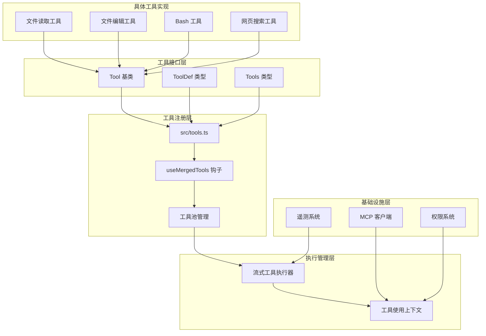
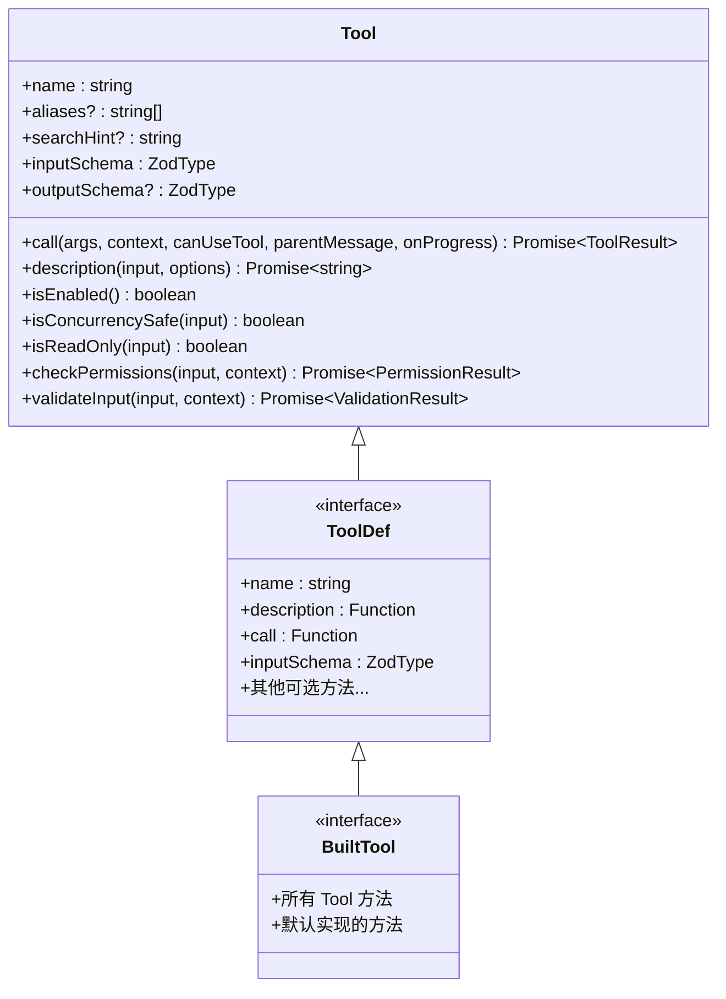
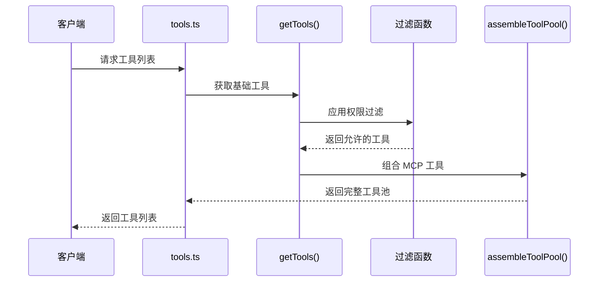
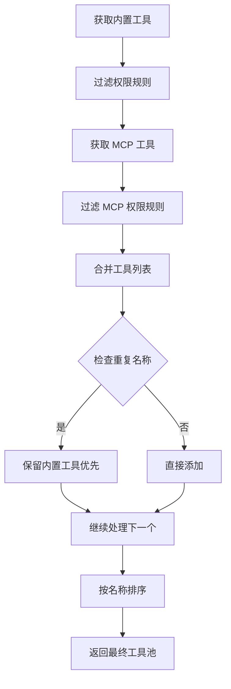
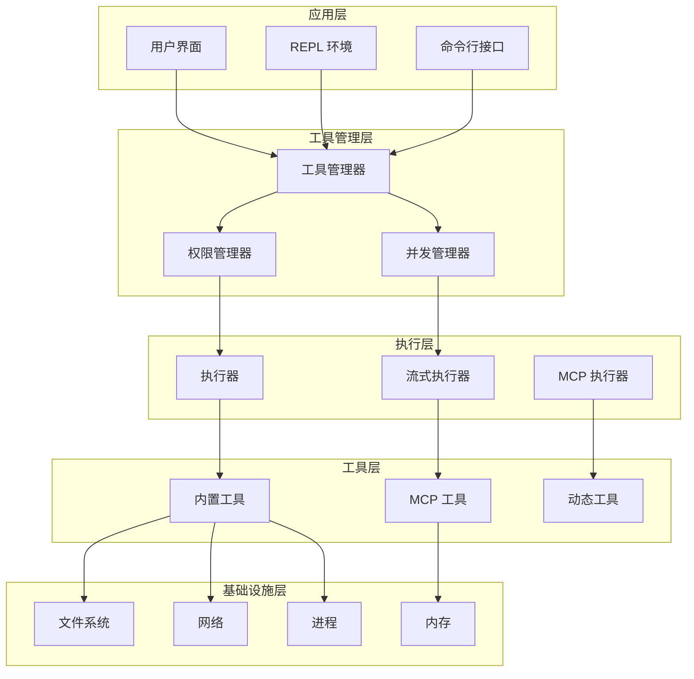
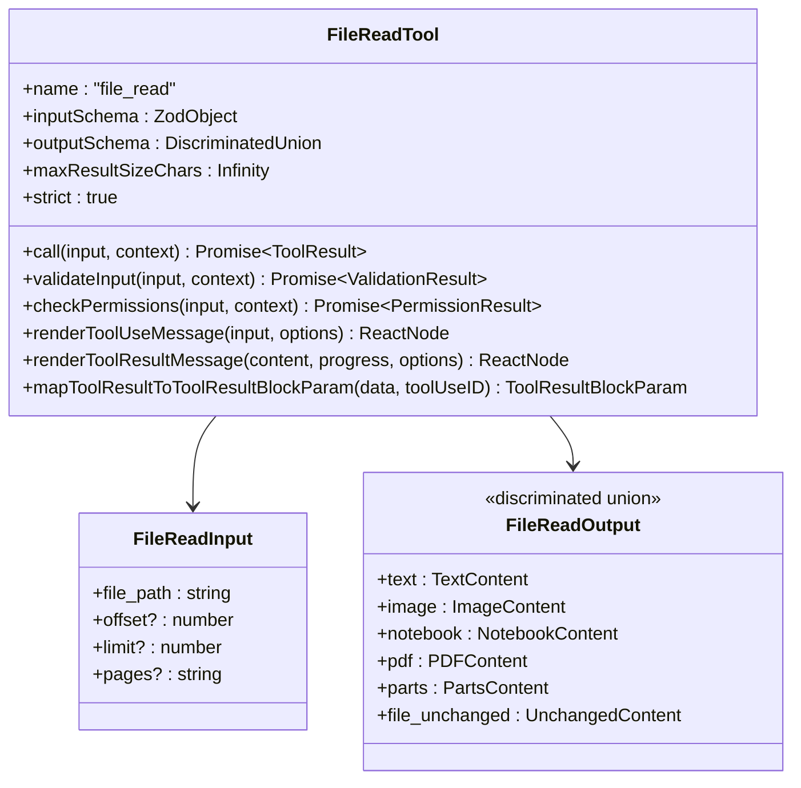
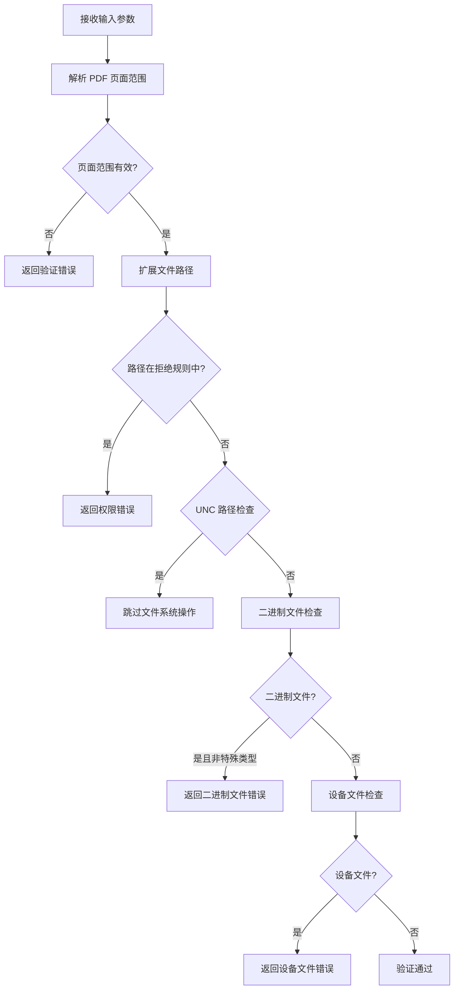
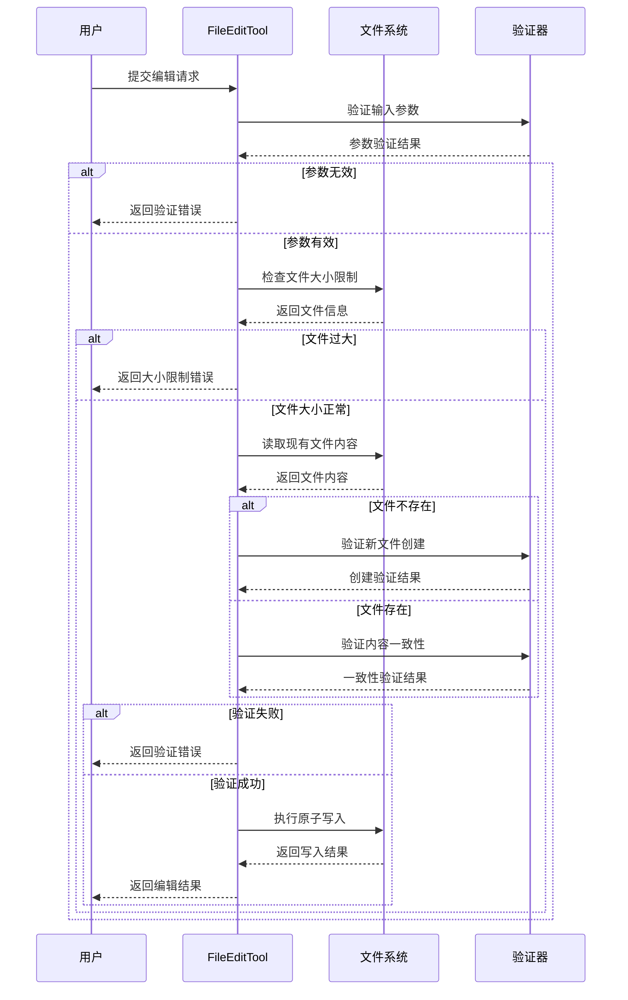
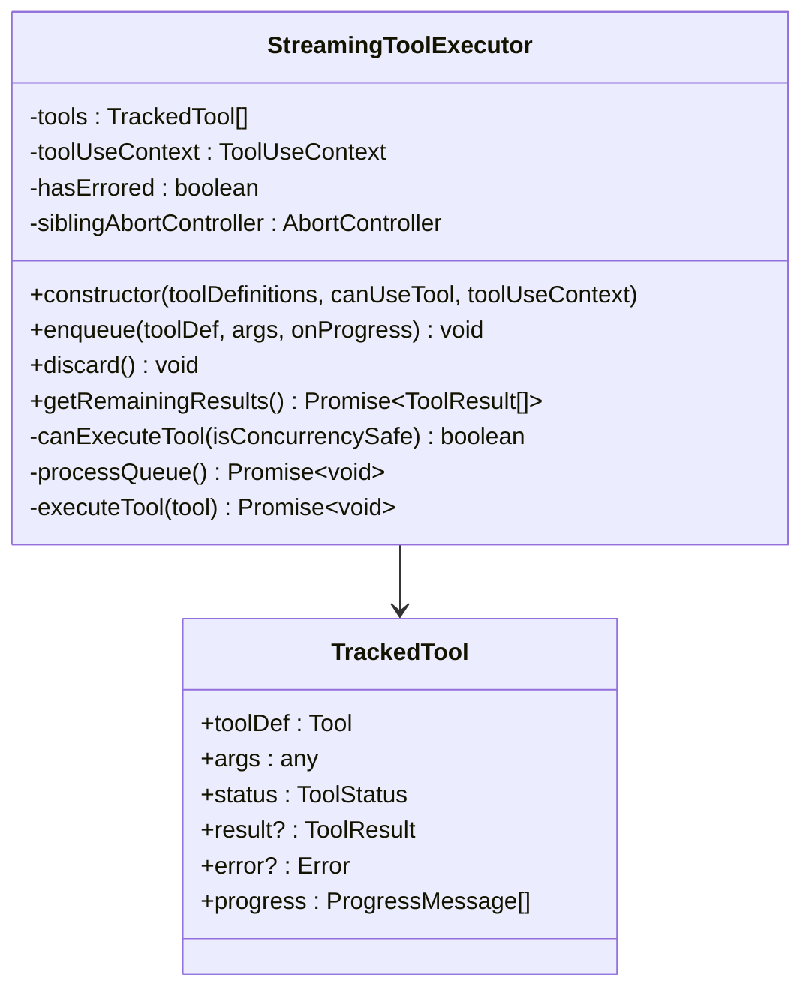
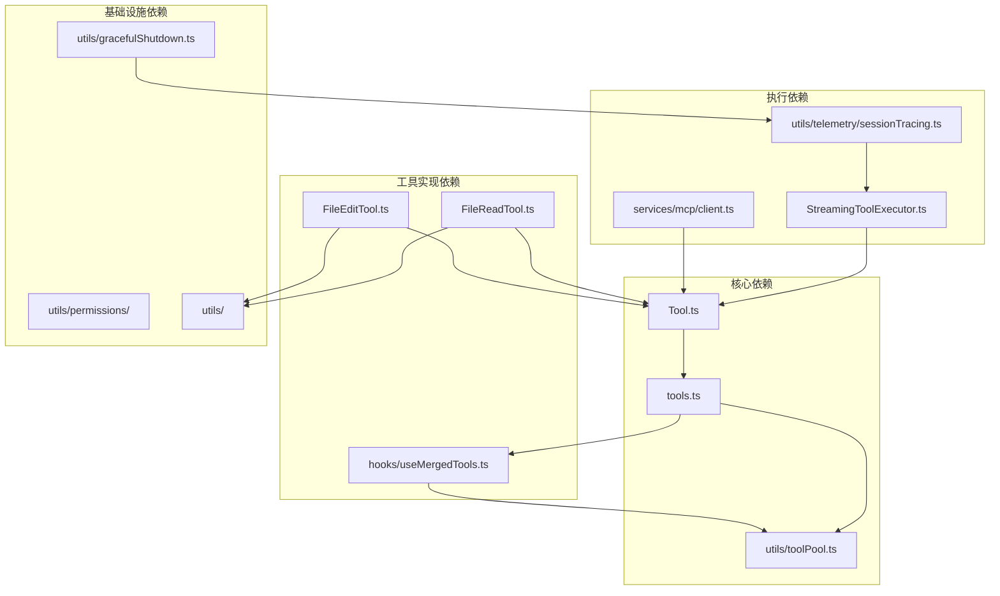

# 工具接口设计

<cite>
**本文档引用的文件**
- [Tool.ts](file://src/Tool.ts)
- [tools.ts](file://src/tools.ts)
- [useMergedTools.ts](file://src/hooks/useMergedTools.ts)
- [toolPool.ts](file://src/utils/toolPool.ts)
- [StreamingToolExecutor.ts](file://src/services/tools/StreamingToolExecutor.ts)
- [FileReadTool.ts](file://src/tools/FileReadTool/FileReadTool.ts)
- [FileEditTool.ts](file://src/tools/FileEditTool/FileEditTool.ts)
- [client.ts](file://src/services/mcp/client.ts)
- [sessionTracing.ts](file://src/utils/telemetry/sessionTracing.ts)
- [gracefulShutdown.ts](file://src/utils/gracefulShutdown.ts)
</cite>

## 目录
1. [简介](#简介)
2. [项目结构](#项目结构)
3. [核心组件](#核心组件)
4. [架构概览](#架构概览)
5. [详细组件分析](#详细组件分析)
6. [依赖关系分析](#依赖关系分析)
7. [性能考虑](#性能考虑)
8. [故障排除指南](#故障排除指南)
9. [结论](#结论)

## 简介

Claude Code 的工具接口设计是一个高度模块化和类型安全的系统，为 AI 模型提供了丰富的工具调用能力。该系统的核心是 Tool 基类，它定义了统一的工具接口规范，支持多种工具类型（文件操作、命令执行、网络请求等），并提供了完整的权限控制、并发管理和生命周期管理机制。

该工具系统的主要特点包括：
- 统一的工具接口规范和类型定义
- 灵活的工具注册和管理机制
- 完整的生命周期管理（初始化、启用检查、销毁）
- 详细的元数据系统（描述、参数、返回值）
- 强大的权限控制系统
- 并发安全的执行模型
- 丰富的 UI 渲染支持

## 项目结构

工具系统的整体架构采用分层设计，从底层的工具基类到上层的应用集成，形成了一个完整的工具生态系统。

**图表来源**
- [Tool.ts:1-793](file://src/Tool.ts#L1-L793)
- [tools.ts:1-390](file://src/tools.ts#L1-L390)
- [useMergedTools.ts:1-44](file://src/hooks/useMergedTools.ts#L1-L44)

**章节来源**
- [Tool.ts:1-793](file://src/Tool.ts#L1-L793)
- [tools.ts:1-390](file://src/tools.ts#L1-L390)

## 核心组件

### Tool 基类设计

Tool 基类是整个工具系统的核心，定义了所有工具必须实现的标准接口。它采用了泛型设计，支持不同类型输入输出的工具。

#### 核心接口规范

Tool 接口定义了以下关键方法：

**图表来源**
- [Tool.ts:362-695](file://src/Tool.ts#L362-L695)
- [Tool.ts:721-792](file://src/Tool.ts#L721-L792)

#### 默认实现策略

系统提供了安全的默认实现，确保新工具无需实现所有方法：

| 方法 | 默认实现 | 设计目的 |
|------|----------|----------|
| isEnabled | 返回 true | 工具默认启用状态 |
| isConcurrencySafe | 返回 false | 假设工具不安全，需要显式声明 |
| isReadOnly | 返回 false | 假设工具会修改状态，需要显式声明只读 |
| isDestructive | 返回 false | 需要显式标记破坏性操作 |
| checkPermissions | 允许通过 | 将权限决策委托给通用系统 |
| toAutoClassifierInput | 返回空字符串 | 安全相关工具必须显式实现 |

**章节来源**
- [Tool.ts:743-792](file://src/Tool.ts#L743-L792)

### 工具注册机制

工具注册系统提供了灵活的工具发现、过滤和组合机制。

#### 工具获取流程

**图表来源**
- [tools.ts:271-327](file://src/tools.ts#L271-L327)
- [tools.ts:345-367](file://src/tools.ts#L345-L367)

#### 条件工具加载

系统支持基于环境变量和特性标志的条件工具加载：

| 环境变量 | 功能描述 | 工具示例 |
|----------|----------|----------|
| USER_TYPE=ant | Ant 用户专用工具 | REPLTool, TungstenTool |
| ENABLE_LSP_TOOL | 启用 LSP 工具 | LSPTool |
| WORKFLOW_SCRIPTS | 启用工作流工具 | WorkflowTool |
| WEB_BROWSER_TOOL | 启用网页浏览器工具 | WebBrowserTool |
| OVERFLOW_TEST_TOOL | 启用溢出测试工具 | OverflowTestTool |

**章节来源**
- [tools.ts:14-135](file://src/tools.ts#L14-L135)
- [tools.ts:193-251](file://src/tools.ts#L193-L251)

### 工具池管理

工具池管理系统负责维护工具的完整集合，包括内置工具和 MCP 工具的合并。

#### 工具去重策略

**图表来源**
- [tools.ts:345-367](file://src/tools.ts#L345-L367)
- [toolPool.ts:55-79](file://src/utils/toolPool.ts#L55-L79)

**章节来源**
- [tools.ts:345-367](file://src/tools.ts#L345-L367)
- [toolPool.ts:55-79](file://src/utils/toolPool.ts#L55-L79)

## 架构概览

工具系统的整体架构体现了清晰的关注点分离和模块化设计。

**图表来源**
- [Tool.ts:158-300](file://src/Tool.ts#L158-L300)
- [StreamingToolExecutor.ts:40-151](file://src/services/tools/StreamingToolExecutor.ts#L40-L151)

## 详细组件分析

### 文件读取工具实现

文件读取工具是工具系统中最复杂的实现之一，展示了完整的工具开发最佳实践。

#### 工具实现架构

**图表来源**
- [FileReadTool.ts:337-718](file://src/tools/FileReadTool/FileReadTool.ts#L337-L718)

#### 输入验证流程

文件读取工具实现了多层次的输入验证：

**图表来源**
- [FileReadTool.ts:418-495](file://src/tools/FileReadTool/FileReadTool.ts#L418-L495)

**章节来源**
- [FileReadTool.ts:337-718](file://src/tools/FileReadTool/FileReadTool.ts#L337-L718)

### 文件编辑工具实现

文件编辑工具展示了如何安全地处理文件写入操作。

#### 编辑验证策略

**图表来源**
- [FileEditTool.ts:137-362](file://src/tools/FileEditTool/FileEditTool.ts#L137-L362)

**章节来源**
- [FileEditTool.ts:137-362](file://src/tools/FileEditTool/FileEditTool.ts#L137-L362)

### 流式工具执行器

流式工具执行器是工具系统的核心执行组件，负责管理工具的并发执行和结果收集。

#### 并发控制机制

**图表来源**
- [StreamingToolExecutor.ts:40-151](file://src/services/tools/StreamingToolExecutor.ts#L40-L151)

#### 执行队列管理

执行器实现了智能的队列管理算法：

| 工具类型 | 执行策略 | 并发行为 |
|----------|----------|----------|
| 并发安全工具 | 可与其他并发安全工具并行执行 | 并行执行 |
| 非并发工具 | 必须独占执行环境 | 排队等待 |
| Bash 工具 | 并发安全但有特殊中断处理 | 并行但可中断 |
| MCP 工具 | 根据工具定义决定 | 动态调整 |

**章节来源**
- [StreamingToolExecutor.ts:129-151](file://src/services/tools/StreamingToolExecutor.ts#L129-L151)

## 依赖关系分析

工具系统的依赖关系体现了清晰的层次结构和模块边界。

**图表来源**
- [Tool.ts:1-793](file://src/Tool.ts#L1-L793)
- [tools.ts:1-390](file://src/tools.ts#L1-L390)
- [StreamingToolExecutor.ts:1-151](file://src/services/tools/StreamingToolExecutor.ts#L1-L151)

**章节来源**
- [Tool.ts:1-793](file://src/Tool.ts#L1-L793)
- [tools.ts:1-390](file://src/tools.ts#L1-L390)

## 性能考虑

工具系统在设计时充分考虑了性能优化和资源管理。

### 内存管理优化

1. **文件读取缓存**：使用 LRU 缓存机制避免重复读取相同文件
2. **结果大小限制**：通过 `maxResultSizeChars` 控制输出大小
3. **增量处理**：支持文件部分读取和增量更新

### 并发执行优化

1. **智能队列调度**：根据工具类型自动优化执行顺序
2. **资源隔离**：每个工具有独立的执行上下文
3. **超时控制**：MCP 工具调用支持超时机制

### 性能监控

系统集成了全面的性能监控机制：

| 监控指标 | 实现方式 | 用途 |
|----------|----------|------|
| 工具执行时间 | 分段计时 | 性能分析 |
| 内存使用情况 | 进程监控 | 资源管理 |
| 错误率统计 | 指标收集 | 质量监控 |
| 并发度分析 | 执行器日志 | 优化依据 |

## 故障排除指南

### 常见问题诊断

#### 工具无法加载

**症状**：工具在工具列表中缺失
**排查步骤**：
1. 检查环境变量设置
2. 验证特性标志配置
3. 确认权限规则未阻止工具

#### 工具执行失败

**症状**：工具调用抛出异常
**排查步骤**：
1. 查看工具输入验证错误
2. 检查权限系统日志
3. 验证资源可用性

#### 并发冲突

**症状**：多个工具同时执行导致冲突
**排查步骤**：
1. 检查工具的并发安全性标记
2. 验证执行器的并发控制
3. 确认资源锁定机制

**章节来源**
- [gracefulShutdown.ts:312-347](file://src/utils/gracefulShutdown.ts#L312-L347)

### 调试技巧

1. **启用详细日志**：设置调试模式获取完整执行日志
2. **使用断点调试**：在关键执行点设置断点
3. **监控资源使用**：跟踪内存和 CPU 使用情况
4. **验证输入输出**：检查工具的输入输出格式

## 结论

Claude Code 的工具接口设计展现了现代 AI 工具系统的最佳实践。通过统一的接口规范、灵活的注册机制、完善的生命周期管理和强大的权限控制，该系统为各种工具类型提供了统一的抽象层。

### 设计优势

1. **类型安全**：完整的 TypeScript 类型定义确保编译时安全
2. **扩展性强**：模块化设计支持轻松添加新工具类型
3. **性能优化**：智能缓存和并发控制提升执行效率
4. **安全性**：多层次的权限控制和输入验证保障系统安全
5. **可观测性**：全面的日志和监控支持问题诊断和性能优化

### 未来发展方向

1. **工具标准化**：进一步统一工具接口规范
2. **性能优化**：持续改进并发执行和资源管理
3. **安全增强**：加强工具沙箱和访问控制
4. **生态建设**：完善第三方工具集成机制

该工具系统为 Claude Code 提供了强大的基础能力，支持从简单的文件操作到复杂的 AI 代理协作等各种应用场景。