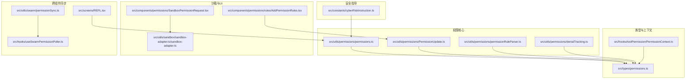
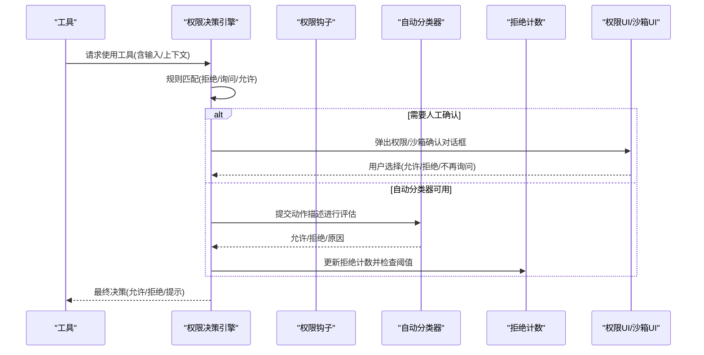
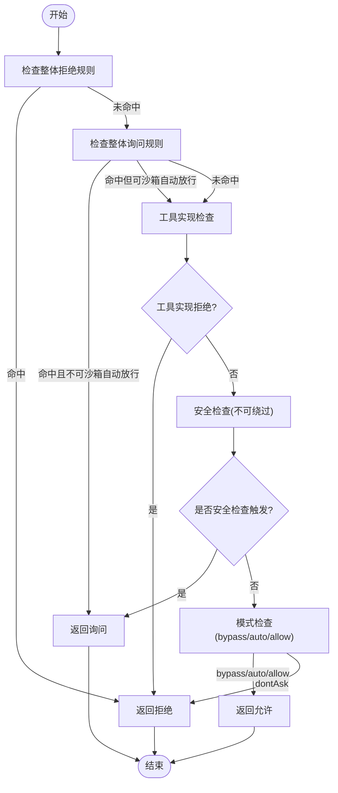
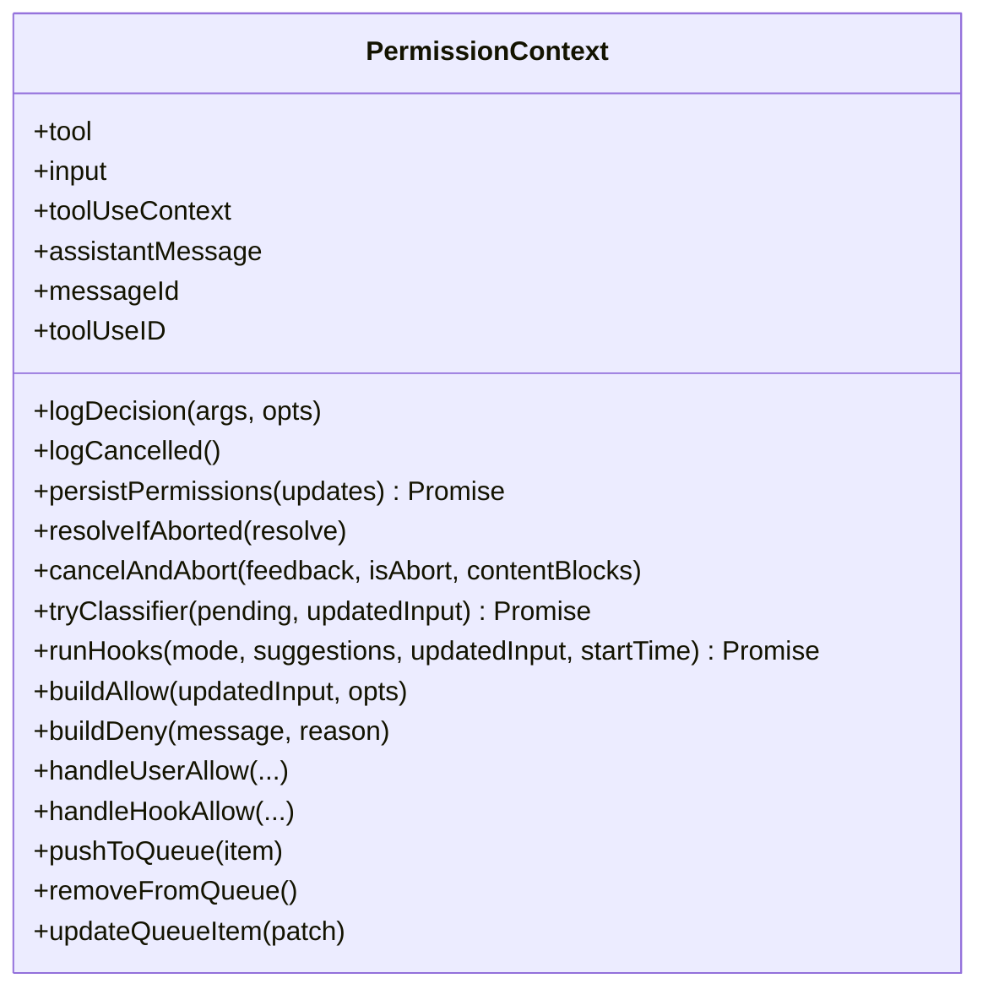
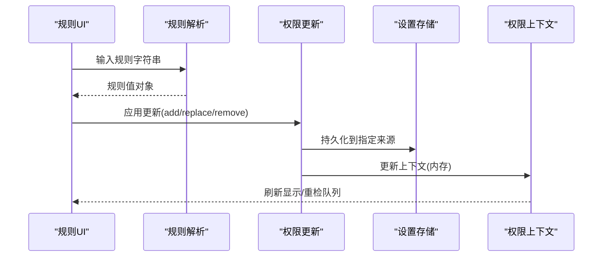
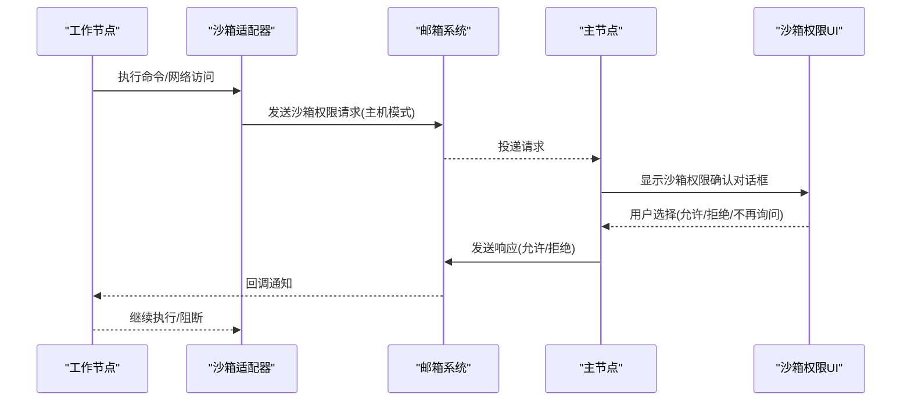
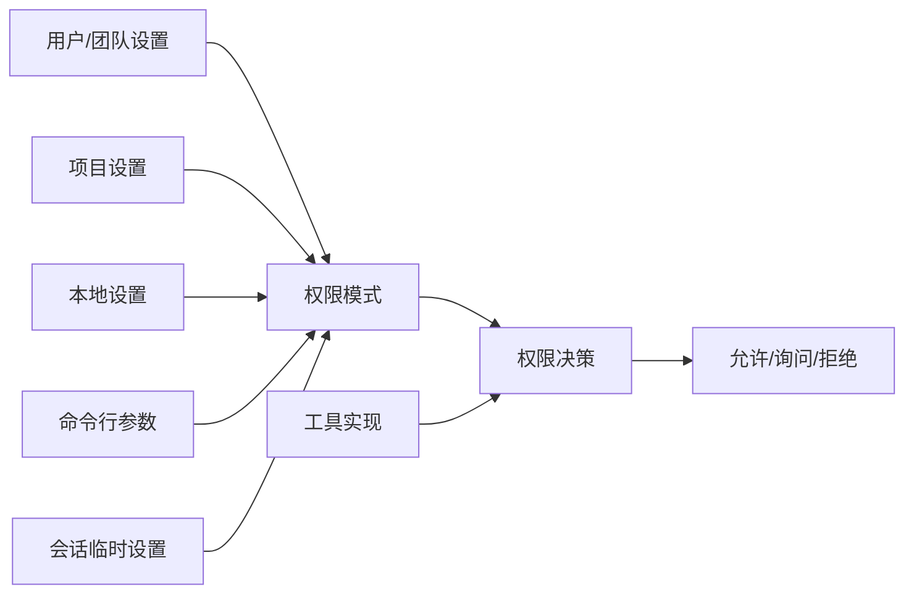
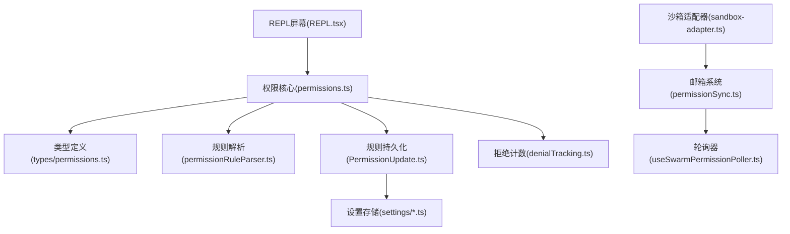

# 工具权限控制

<cite>
**本文档引用的文件**
- [src/utils/permissions/permissions.ts](file://src/utils/permissions/permissions.ts)
- [src/types/permissions.ts](file://src/types/permissions.ts)
- [src/utils/permissions/PermissionUpdate.ts](file://src/utils/permissions/PermissionUpdate.ts)
- [src/utils/permissions/permissionRuleParser.ts](file://src/utils/permissions/permissionRuleParser.ts)
- [src/utils/permissions/denialTracking.ts](file://src/utils/permissions/denialTracking.ts)
- [src/hooks/toolPermission/PermissionContext.ts](file://src/hooks/toolPermission/PermissionContext.ts)
- [src/components/permissions/SandboxPermissionRequest.tsx](file://src/components/permissions/SandboxPermissionRequest.tsx)
- [src/components/permissions/rules/AddPermissionRules.tsx](file://src/components/permissions/rules/AddPermissionRules.tsx)
- [src/utils/sandbox/sandbox-adapter.ts/sandbox-adapter.ts](file://src/utils/sandbox/sandbox-adapter.ts/sandbox-adapter.ts)
- [src/utils/inProcessTeammateHelpers.ts](file://src/utils/inProcessTeammateHelpers.ts)
- [src/utils/swarm/permissionSync.ts](file://src/utils/swarm/permissionSync.ts)
- [src/hooks/useSwarmPermissionPoller.ts](file://src/hooks/useSwarmPermissionPoller.ts)
- [src/screens/REPL.tsx](file://src/screens/REPL.tsx)
- [src/constants/cyberRiskInstruction.ts](file://src/constants/cyberRiskInstruction.ts)
</cite>

## 目录
1. [简介](#简介)
2. [项目结构](#项目结构)
3. [核心组件](#核心组件)
4. [架构总览](#架构总览)
5. [详细组件分析](#详细组件分析)
6. [依赖关系分析](#依赖关系分析)
7. [性能考虑](#性能考虑)
8. [故障排查指南](#故障排查指南)
9. [结论](#结论)
10. [附录](#附录)

## 简介
本技术文档围绕 Claude Code 的工具权限控制系统，系统性阐述权限验证机制、沙箱隔离与安全策略、多层次权限架构（用户权限/工具权限/环境权限）、权限规则系统（定义、匹配与动态调整）、配置与调试方法，以及权限绕过与安全审计的技术实现。文档以代码为依据，结合可视化图示帮助读者从高层到细节全面理解该系统的运行原理与扩展点。

## 项目结构
权限控制相关代码主要分布在以下模块：
- 权限核心逻辑：src/utils/permissions/*
- 类型定义：src/types/permissions.ts
- 权限上下文与钩子：src/hooks/toolPermission/*
- 沙箱权限请求与UI：src/components/permissions/*
- 规则解析与持久化：src/utils/permissions/*
- 跨组件权限同步：src/utils/swarm/*
- REPL 中的权限上下文更新：src/screens/REPL.tsx
- 安全指导与风险指令：src/constants/cyberRiskInstruction.ts

**图表来源**
- [src/utils/permissions/permissions.ts:1158-1319](file://src/utils/permissions/permissions.ts#L1158-L1319)
- [src/types/permissions.ts:413-442](file://src/types/permissions.ts#L413-L442)
- [src/utils/permissions/PermissionUpdate.ts:55-206](file://src/utils/permissions/PermissionUpdate.ts#L55-L206)
- [src/utils/permissions/permissionRuleParser.ts:93-152](file://src/utils/permissions/permissionRuleParser.ts#L93-L152)
- [src/utils/permissions/denialTracking.ts:1-46](file://src/utils/permissions/denialTracking.ts#L1-L46)
- [src/hooks/toolPermission/PermissionContext.ts:96-348](file://src/hooks/toolPermission/PermissionContext.ts#L96-L348)
- [src/utils/sandbox/sandbox-adapter.ts/sandbox-adapter.ts](file://src/utils/sandbox/sandbox-adapter.ts/sandbox-adapter.ts)
- [src/components/permissions/SandboxPermissionRequest.tsx:1-163](file://src/components/permissions/SandboxPermissionRequest.tsx#L1-L163)
- [src/components/permissions/rules/AddPermissionRules.tsx:48-101](file://src/components/permissions/rules/AddPermissionRules.tsx#L48-L101)
- [src/utils/swarm/permissionSync.ts:758-794](file://src/utils/swarm/permissionSync.ts#L758-L794)
- [src/hooks/useSwarmPermissionPoller.ts:208-257](file://src/hooks/useSwarmPermissionPoller.ts#L208-L257)
- [src/screens/REPL.tsx:2340-2375](file://src/screens/REPL.tsx#L2340-L2375)
- [src/constants/cyberRiskInstruction.ts:1-24](file://src/constants/cyberRiskInstruction.ts#L1-L24)

**章节来源**
- [src/utils/permissions/permissions.ts:1-1487](file://src/utils/permissions/permissions.ts#L1-L1487)
- [src/types/permissions.ts:1-442](file://src/types/permissions.ts#L1-L442)

## 核心组件
- 权限决策引擎：负责规则匹配、模式转换、自动分类器评估、拒绝次数跟踪与回退提示等。
- 权限上下文与钩子：封装权限请求生命周期、持久化、日志与队列管理。
- 规则系统：规则解析/序列化、按源持久化、替换/追加/删除、工作目录扩展。
- 沙箱权限请求：网络主机访问请求的交互式确认与持久化。
- 跨组件同步：团队模式下权限响应通过邮箱系统在主从节点间传递。
- 配置与UI：规则添加对话框、沙箱权限确认UI、REPL中的上下文刷新。

**章节来源**
- [src/utils/permissions/permissions.ts:473-956](file://src/utils/permissions/permissions.ts#L473-L956)
- [src/hooks/toolPermission/PermissionContext.ts:96-348](file://src/hooks/toolPermission/PermissionContext.ts#L96-L348)
- [src/utils/permissions/PermissionUpdate.ts:55-206](file://src/utils/permissions/PermissionUpdate.ts#L55-L206)
- [src/components/permissions/SandboxPermissionRequest.tsx:1-163](file://src/components/permissions/SandboxPermissionRequest.tsx#L1-L163)
- [src/utils/swarm/permissionSync.ts:758-794](file://src/utils/swarm/permissionSync.ts#L758-L794)

## 架构总览
权限控制采用“规则驱动 + 模式转换 + 自动分类器 + 沙箱隔离”的分层架构。工具在执行前先进行规则匹配与模式检查；若需要人工确认，则进入交互或异步分类器评估；对于网络访问等高危操作，通过沙箱进行隔离与策略校验。

**图表来源**
- [src/utils/permissions/permissions.ts:1158-1319](file://src/utils/permissions/permissions.ts#L1158-L1319)
- [src/utils/permissions/denialTracking.ts:17-45](file://src/utils/permissions/denialTracking.ts#L17-L45)
- [src/hooks/toolPermission/PermissionContext.ts:216-263](file://src/hooks/toolPermission/PermissionContext.ts#L216-L263)

## 详细组件分析

### 权限决策流程与规则匹配
- 规则匹配顺序：整体工具拒绝规则 → 整体工具询问规则 → 工具实现检查 → 内容特定规则 → 安全检查豁免 → 模式转换 → 总允许。
- 关键函数：
  - hasPermissionsToUseToolInner：完整决策流程入口。
  - checkRuleBasedPermissions：仅规则阶段（bypassPermissions 模式尊重的部分）。
  - 工具级检查：工具实现返回 passthrough/ask/deny，随后统一转为 ask 并生成消息。
- 模式转换：dontAsk 将 ask 转为 deny；auto 模式下尝试自动分类器评估。
- 安全检查豁免：对敏感路径（如 .git/.claude/ 等）的安全检查不可被 bypass 模式绕过。

**图表来源**
- [src/utils/permissions/permissions.ts:1158-1319](file://src/utils/permissions/permissions.ts#L1158-L1319)
- [src/utils/permissions/permissions.ts:1071-1156](file://src/utils/permissions/permissions.ts#L1071-L1156)

**章节来源**
- [src/utils/permissions/permissions.ts:1158-1319](file://src/utils/permissions/permissions.ts#L1158-L1319)
- [src/utils/permissions/permissions.ts:1071-1156](file://src/utils/permissions/permissions.ts#L1071-L1156)

### 权限上下文与钩子
- PermissionContext：封装权限请求生命周期，支持持久化、日志、取消/中止、自动分类器集成、钩子执行与结果处理。
- 钩子：在无 UI 或后台场景下，优先通过钩子决定允许/拒绝；若无钩子决策则自动拒绝。
- 队列：支持将待确认项加入队列，并在规则变更时重新检查队列项。

**图表来源**
- [src/hooks/toolPermission/PermissionContext.ts:96-348](file://src/hooks/toolPermission/PermissionContext.ts#L96-L348)

**章节来源**
- [src/hooks/toolPermission/PermissionContext.ts:96-348](file://src/hooks/toolPermission/PermissionContext.ts#L96-L348)

### 规则系统与动态调整
- 规则格式：工具名或 工具名(内容)；内容支持转义括号。
- 解析与序列化：permissionRuleValueFromString/permissionRuleValueToString，支持转义/反转义。
- 按源持久化：支持 userSettings/projectSettings/localSettings/cliArg/session 等来源。
- 动态调整：addRules/replaceRules/removeRules/addDirectories/removeDirectories/setMode；REPL 中变更会触发队列项重检。

**图表来源**
- [src/utils/permissions/permissionRuleParser.ts:93-152](file://src/utils/permissions/permissionRuleParser.ts#L93-L152)
- [src/utils/permissions/PermissionUpdate.ts:55-206](file://src/utils/permissions/PermissionUpdate.ts#L55-L206)
- [src/components/permissions/rules/AddPermissionRules.tsx:48-101](file://src/components/permissions/rules/AddPermissionRules.tsx#L48-L101)
- [src/screens/REPL.tsx:2340-2375](file://src/screens/REPL.tsx#L2340-L2375)

**章节来源**
- [src/utils/permissions/permissionRuleParser.ts:1-199](file://src/utils/permissions/permissionRuleParser.ts#L1-L199)
- [src/utils/permissions/PermissionUpdate.ts:1-390](file://src/utils/permissions/PermissionUpdate.ts#L1-L390)
- [src/components/permissions/rules/AddPermissionRules.tsx:1-180](file://src/components/permissions/rules/AddPermissionRules.tsx#L1-L180)
- [src/screens/REPL.tsx:2340-2375](file://src/screens/REPL.tsx#L2340-L2375)

### 沙箱隔离与网络权限
- 沙箱适配器：提供沙箱启用状态、自动放行 Bash 的条件、主机白名单等能力。
- 网络权限请求：当沙箱检测到非允许主机访问时，通过邮箱系统向主节点发起权限请求；主节点弹出 UI 让用户选择允许/拒绝，并可选择“不再询问”持久化规则。
- 响应同步：主节点将响应写入邮箱，工作节点轮询回调并继续执行。

**图表来源**
- [src/utils/sandbox/sandbox-adapter.ts/sandbox-adapter.ts](file://src/utils/sandbox/sandbox-adapter.ts/sandbox-adapter.ts)
- [src/components/permissions/SandboxPermissionRequest.tsx:1-163](file://src/components/permissions/SandboxPermissionRequest.tsx#L1-L163)
- [src/utils/swarm/permissionSync.ts:758-794](file://src/utils/swarm/permissionSync.ts#L758-L794)
- [src/hooks/useSwarmPermissionPoller.ts:208-257](file://src/hooks/useSwarmPermissionPoller.ts#L208-L257)

**章节来源**
- [src/utils/sandbox/sandbox-adapter.ts/sandbox-adapter.ts](file://src/utils/sandbox/sandbox-adapter.ts/sandbox-adapter.ts)
- [src/components/permissions/SandboxPermissionRequest.tsx:1-163](file://src/components/permissions/SandboxPermissionRequest.tsx#L1-L163)
- [src/utils/swarm/permissionSync.ts:758-794](file://src/utils/swarm/permissionSync.ts#L758-L794)
- [src/hooks/useSwarmPermissionPoller.ts:208-257](file://src/hooks/useSwarmPermissionPoller.ts#L208-L257)

### 多层次权限架构
- 用户权限：通过权限模式（默认/不询问/旁路/计划/自动）与规则源（用户/项目/本地/命令行/会话）共同决定。
- 工具权限：每个工具实现 checkPermissions 返回 passthrough/ask/deny，规则可覆盖工具级与内容级。
- 环境权限：工作目录扩展、额外目录白名单、受保护命名空间判断等。

**图表来源**
- [src/types/permissions.ts:16-38](file://src/types/permissions.ts#L16-L38)
- [src/types/permissions.ts:413-442](file://src/types/permissions.ts#L413-L442)
- [src/utils/permissions/permissions.ts:1158-1319](file://src/utils/permissions/permissions.ts#L1158-L1319)

**章节来源**
- [src/types/permissions.ts:1-442](file://src/types/permissions.ts#L1-L442)
- [src/utils/permissions/permissions.ts:1158-1319](file://src/utils/permissions/permissions.ts#L1158-L1319)

### 自动分类器与拒绝阈值
- 自动模式：对动作进行分类评估，根据结果允许或拒绝；失败时可 fail-closed/fail-open 取决于门控。
- 拒绝阈值：记录连续与累计拒绝次数，超过阈值后回退到手动确认；在无 UI 场景下直接中止。

**章节来源**
- [src/utils/permissions/permissions.ts:688-927](file://src/utils/permissions/permissions.ts#L688-L927)
- [src/utils/permissions/denialTracking.ts:1-46](file://src/utils/permissions/denialTracking.ts#L1-L46)

### 安全审计与日志
- 决策日志：记录允许/拒绝来源（用户/钩子/分类器/规则/模式），用于审计与分析。
- 分类器使用统计：记录 token 使用、阶段耗时、请求 ID、消息 ID 等，便于成本与性能分析。
- 安全指导：内置网络安全风险指令，约束安全测试与研究边界。

**章节来源**
- [src/hooks/toolPermission/PermissionContext.ts:113-131](file://src/hooks/toolPermission/PermissionContext.ts#L113-L131)
- [src/utils/permissions/permissions.ts:718-812](file://src/utils/permissions/permissions.ts#L718-L812)
- [src/constants/cyberRiskInstruction.ts:1-24](file://src/constants/cyberRiskInstruction.ts#L1-L24)

## 依赖关系分析
- 权限核心依赖类型定义与工具实现；规则解析与持久化解耦于 UI 与设置存储。
- 沙箱适配器与邮箱系统耦合团队模式下的主从通信。
- REPL 屏幕负责在规则变更时刷新上下文并重检队列项。

**图表来源**
- [src/utils/permissions/permissions.ts:1-1487](file://src/utils/permissions/permissions.ts#L1-L1487)
- [src/types/permissions.ts:1-442](file://src/types/permissions.ts#L1-L442)
- [src/utils/permissions/PermissionUpdate.ts:1-390](file://src/utils/permissions/PermissionUpdate.ts#L1-L390)
- [src/utils/permissions/permissionRuleParser.ts:1-199](file://src/utils/permissions/permissionRuleParser.ts#L1-L199)
- [src/utils/permissions/denialTracking.ts:1-46](file://src/utils/permissions/denialTracking.ts#L1-L46)
- [src/utils/sandbox/sandbox-adapter.ts/sandbox-adapter.ts](file://src/utils/sandbox/sandbox-adapter.ts/sandbox-adapter.ts)
- [src/utils/swarm/permissionSync.ts:758-794](file://src/utils/swarm/permissionSync.ts#L758-L794)
- [src/hooks/useSwarmPermissionPoller.ts:208-257](file://src/hooks/useSwarmPermissionPoller.ts#L208-L257)
- [src/screens/REPL.tsx:2340-2375](file://src/screens/REPL.tsx#L2340-L2375)

**章节来源**
- [src/utils/permissions/permissions.ts:1-1487](file://src/utils/permissions/permissions.ts#L1-L1487)
- [src/utils/permissions/PermissionUpdate.ts:1-390](file://src/utils/permissions/PermissionUpdate.ts#L1-L390)
- [src/utils/swarm/permissionSync.ts:758-794](file://src/utils/swarm/permissionSync.ts#L758-L794)

## 性能考虑
- 自动分类器：避免对安全工具清单与低风险工具重复调用；在 acceptEdits 快路径下跳过分类器。
- 拒绝阈值：超过阈值回退到手动确认，减少无效 API 调用与令牌消耗。
- 规则持久化批处理：批量应用多个更新，减少多次写入开销。
- UI 重检队列：在规则变更时批量重检，避免逐条重复计算。

[本节为通用建议，无需特定文件引用]

## 故障排查指南
- 无法弹出权限对话框：检查 shouldAvoidPermissionPrompts 标志；后台/无 UI 场景将走钩子或自动拒绝。
- 自动分类器不可用：检查门控与上下文窗口长度；超长时回退到手动确认。
- 沙箱网络请求未获响应：确认邮箱系统是否正常投递/接收；检查工作节点回调注册与清理。
- 规则未生效：确认规则来源与持久化目标；REPL 中需等待上下文刷新与队列重检。
- 安全检查绕过失败：敏感路径的安全检查不可被 bypass 模式绕过，需通过规则或模式调整。

**章节来源**
- [src/utils/permissions/permissions.ts:929-952](file://src/utils/permissions/permissions.ts#L929-L952)
- [src/utils/permissions/permissions.ts:818-876](file://src/utils/permissions/permissions.ts#L818-L876)
- [src/utils/swarm/permissionSync.ts:758-794](file://src/utils/swarm/permissionSync.ts#L758-L794)
- [src/hooks/useSwarmPermissionPoller.ts:208-257](file://src/hooks/useSwarmPermissionPoller.ts#L208-L257)
- [src/screens/REPL.tsx:2340-2375](file://src/screens/REPL.tsx#L2340-L2375)

## 结论
该权限控制系统通过“规则 + 模式 + 自动分类器 + 沙箱隔离”的组合，在保证安全性的同时兼顾自动化效率与用户体验。其模块化设计使得规则定义、持久化、UI 与团队协作均易于扩展与维护。建议在生产环境中配合安全审计与阈值监控，确保权限策略的有效性与可追溯性。

[本节为总结性内容，无需特定文件引用]

## 附录

### 配置指南
- 设置权限模式：通过设置源（用户/项目/本地/命令行/会话）设置 defaultMode。
- 添加规则：在规则 UI 中选择保存位置（本地/项目/用户），输入工具名或 工具名(内容)。
- 工作目录扩展：通过 addDirectories 将额外目录加入权限范围。
- 沙箱网络白名单：在沙箱 UI 中选择“不再询问”以持久化允许规则。

**章节来源**
- [src/utils/permissions/PermissionUpdate.ts:222-342](file://src/utils/permissions/PermissionUpdate.ts#L222-L342)
- [src/components/permissions/rules/AddPermissionRules.tsx:48-101](file://src/components/permissions/rules/AddPermissionRules.tsx#L48-L101)
- [src/components/permissions/SandboxPermissionRequest.tsx:1-163](file://src/components/permissions/SandboxPermissionRequest.tsx#L1-L163)

### 调试方法
- 启用调试日志：关注权限决策日志、分类器使用统计与拒绝计数变化。
- REPL 中刷新上下文：修改规则后触发上下文更新与队列重检。
- 钩子与自动拒绝：在无 UI 场景下优先通过钩子快速决策，必要时自动拒绝并记录原因。

**章节来源**
- [src/hooks/toolPermission/PermissionContext.ts:113-131](file://src/hooks/toolPermission/PermissionContext.ts#L113-L131)
- [src/utils/permissions/permissions.ts:929-952](file://src/utils/permissions/permissions.ts#L929-L952)
- [src/screens/REPL.tsx:2340-2375](file://src/screens/REPL.tsx#L2340-L2375)