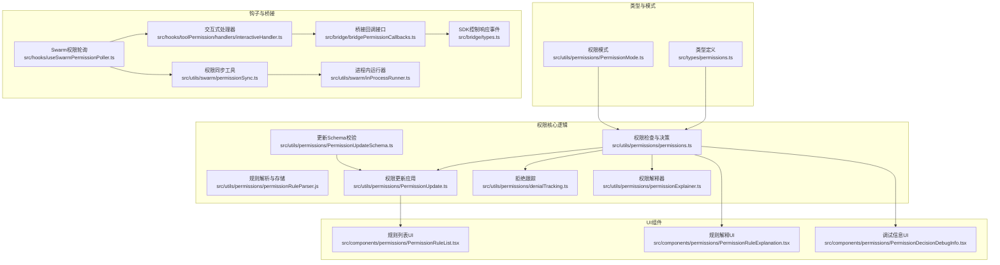
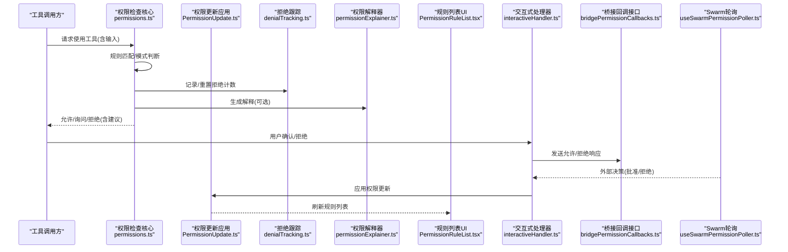
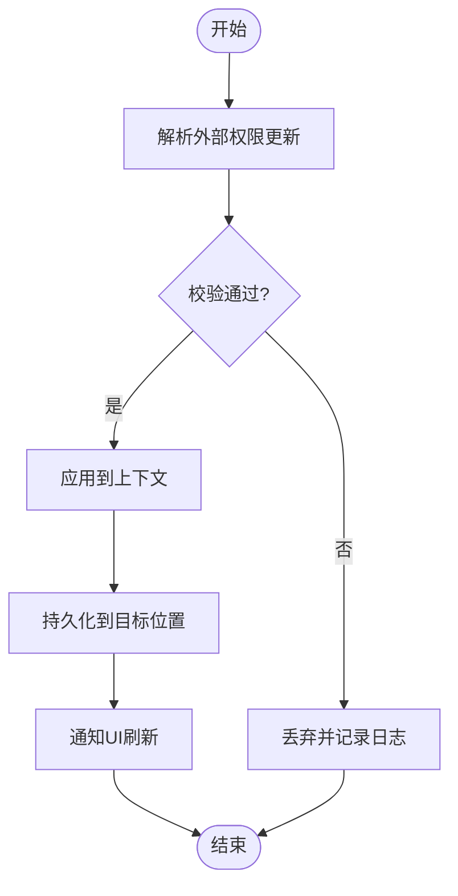
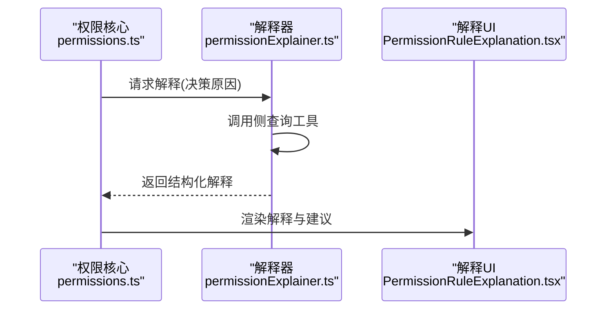
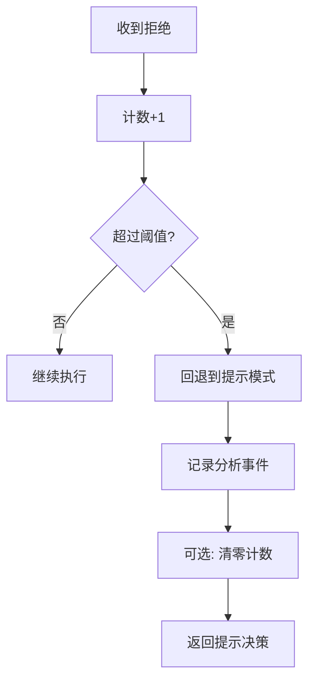
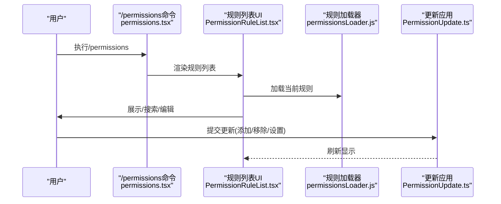
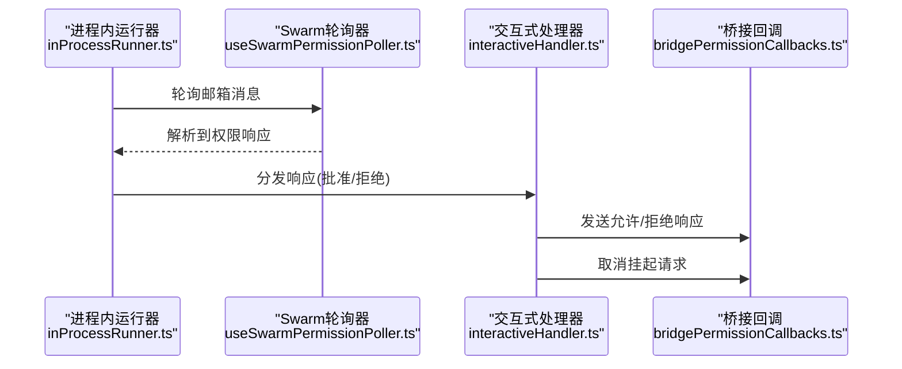
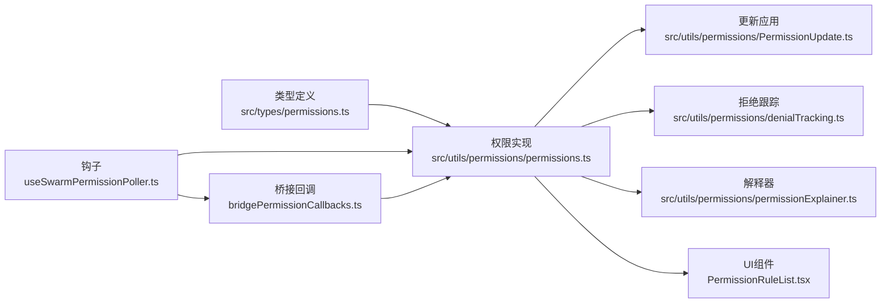

# 权限管理接口

<cite>
**本文档引用的文件**
- [src/utils/permissions/permissions.ts](file://src/utils/permissions/permissions.ts)
- [src/utils/permissions/PermissionUpdateSchema.ts](file://src/utils/permissions/PermissionUpdateSchema.ts)
- [src/utils/permissions/PermissionUpdate.ts](file://src/utils/permissions/PermissionUpdate.ts)
- [src/utils/permissions/PermissionMode.ts](file://src/utils/permissions/PermissionMode.ts)
- [src/utils/permissions/PermissionRule.js](file://src/utils/permissions/PermissionRule.js)
- [src/utils/permissions/permissionRuleParser.js](file://src/utils/permissions/permissionRuleParser.js)
- [src/utils/permissions/permissionsLoader.js](file://src/utils/permissions/permissionsLoader.js)
- [src/utils/permissions/denialTracking.ts](file://src/utils/permissions/denialTracking.ts)
- [src/utils/permissions/permissionExplainer.ts](file://src/utils/permissions/permissionExplainer.ts)
- [src/utils/permissions/permissions.ts](file://src/utils/permissions/permissions.ts)
- [src/components/permissions/PermissionRuleList.tsx](file://src/components/permissions/PermissionRuleList.tsx)
- [src/components/permissions/PermissionRuleExplanation.tsx](file://src/components/permissions/PermissionRuleExplanation.tsx)
- [src/components/permissions/PermissionDecisionDebugInfo.tsx](file://src/components/permissions/PermissionDecisionDebugInfo.tsx)
- [src/hooks/useSwarmPermissionPoller.ts](file://src/hooks/useSwarmPermissionPoller.ts)
- [src/hooks/toolPermission/handlers/interactiveHandler.ts](file://src/hooks/toolPermission/handlers/interactiveHandler.ts)
- [src/bridge/bridgePermissionCallbacks.ts](file://src/bridge/bridgePermissionCallbacks.ts)
- [src/bridge/types.ts](file://src/bridge/types.ts)
- [src/utils/swarm/permissionSync.ts](file://src/utils/swarm/permissionSync.ts)
- [src/utils/swarm/inProcessRunner.ts](file://src/utils/swarm/inProcessRunner.ts)
- [src/hooks/useInboxPoller.ts](file://src/hooks/useInboxPoller.ts)
- [src/commands/permissions/permissions.tsx](file://src/commands/permissions/permissions.tsx)
- [src/types/permissions.ts](file://src/types/permissions.ts)
- [src/utils/settings/permissionValidation.ts](file://src/utils/settings/permissionValidation.ts)
</cite>

## 目录
1. [简介](#简介)
2. [项目结构](#项目结构)
3. [核心组件](#核心组件)
4. [架构总览](#架构总览)
5. [详细组件分析](#详细组件分析)
6. [依赖关系分析](#依赖关系分析)
7. [性能考量](#性能考量)
8. [故障排查指南](#故障排查指南)
9. [结论](#结论)
10. [附录](#附录)

## 简介
本技术文档面向Claude Code的权限管理接口，系统性阐述权限更新机制（变更通知、状态同步、冲突处理）、权限解释器（决策解释、用户提示生成、可视化展示）、权限拒绝跟踪系统（拒绝原因记录、统计分析、趋势预测），以及权限管理的API接口（查询、更新、撤销）与配置选项、调试工具使用方法。文档以代码级分析为基础，辅以多种Mermaid图表帮助理解。

## 项目结构
权限管理相关代码主要分布在以下模块：
- 类型定义：权限模式、行为、规则、更新、结果等类型集中于类型文件，避免循环依赖并统一约束。
- 工具函数：权限检查、规则解析、更新应用、模式转换、拒绝跟踪、解释器等。
- 组件：规则列表UI、规则解释UI、调试信息UI等。
- 钩子与桥接：跨进程/跨会话的权限响应轮询、桥接回调、SDK协议事件等。
- 命令入口：/permissions命令用于进入规则管理界面。

**图表来源**
- [src/types/permissions.ts:1-442](file://src/types/permissions.ts#L1-L442)
- [src/utils/permissions/permissions.ts:1-200](file://src/utils/permissions/permissions.ts#L1-L200)
- [src/utils/permissions/PermissionUpdate.ts:45-83](file://src/utils/permissions/PermissionUpdate.ts#L45-L83)
- [src/utils/permissions/PermissionUpdateSchema.ts:1-79](file://src/utils/permissions/PermissionUpdateSchema.ts#L1-L79)
- [src/utils/permissions/denialTracking.ts:1-45](file://src/utils/permissions/denialTracking.ts#L1-L45)
- [src/utils/permissions/permissionExplainer.ts:173-207](file://src/utils/permissions/permissionExplainer.ts#L173-L207)
- [src/components/permissions/PermissionRuleList.tsx:1-800](file://src/components/permissions/PermissionRuleList.tsx#L1-L800)
- [src/components/permissions/PermissionRuleExplanation.tsx:61-120](file://src/components/permissions/PermissionRuleExplanation.tsx#L61-L120)
- [src/components/permissions/PermissionDecisionDebugInfo.tsx:328-365](file://src/components/permissions/PermissionDecisionDebugInfo.tsx#L328-L365)
- [src/hooks/useSwarmPermissionPoller.ts:28-160](file://src/hooks/useSwarmPermissionPoller.ts#L28-L160)
- [src/hooks/toolPermission/handlers/interactiveHandler.ts:162-193](file://src/hooks/toolPermission/handlers/interactiveHandler.ts#L162-L193)
- [src/bridge/bridgePermissionCallbacks.ts:1-44](file://src/bridge/bridgePermissionCallbacks.ts#L1-L44)
- [src/bridge/types.ts:117-131](file://src/bridge/types.ts#L117-L131)
- [src/utils/swarm/permissionSync.ts:516-564](file://src/utils/swarm/permissionSync.ts#L516-L564)
- [src/utils/swarm/inProcessRunner.ts:394-433](file://src/utils/swarm/inProcessRunner.ts#L394-L433)

**章节来源**
- [src/types/permissions.ts:1-442](file://src/types/permissions.ts#L1-L442)
- [src/utils/permissions/permissions.ts:1-200](file://src/utils/permissions/permissions.ts#L1-L200)

## 核心组件
- 权限上下文与决策：包含模式、工作目录、规则集合、是否跳过提示等字段，驱动权限检查流程。
- 规则系统：支持allow/deny/ask三种行为，规则值由工具名+可选内容组成，来源包括用户设置、项目设置、本地设置、策略设置、命令行参数、会话等。
- 更新机制：支持添加/替换/移除规则、设置模式、增删工作目录等更新类型，并可持久化到指定目标。
- 拒绝跟踪：记录连续拒绝次数与总拒绝次数，达到阈值后触发回退提示。
- 解释器：基于侧查询工具生成风险评估解释，辅助用户理解决策依据。
- 轮询与桥接：通过Swarm轮询、邮箱消息、桥接回调等方式接收外部决策，确保状态一致性与冲突处理。

**章节来源**
- [src/types/permissions.ts:414-442](file://src/types/permissions.ts#L414-L442)
- [src/utils/permissions/permissions.ts:1000-1199](file://src/utils/permissions/permissions.ts#L1000-L1199)
- [src/utils/permissions/PermissionUpdateSchema.ts:24-79](file://src/utils/permissions/PermissionUpdateSchema.ts#L24-L79)
- [src/utils/permissions/PermissionUpdate.ts:45-83](file://src/utils/permissions/PermissionUpdate.ts#L45-L83)
- [src/utils/permissions/denialTracking.ts:1-45](file://src/utils/permissions/denialTracking.ts#L1-L45)
- [src/utils/permissions/permissionExplainer.ts:173-207](file://src/utils/permissions/permissionExplainer.ts#L173-L207)
- [src/hooks/useSwarmPermissionPoller.ts:28-160](file://src/hooks/useSwarmPermissionPoller.ts#L28-L160)
- [src/bridge/bridgePermissionCallbacks.ts:1-44](file://src/bridge/bridgePermissionCallbacks.ts#L1-L44)

## 架构总览
下图展示了从工具调用到权限决策、再到UI呈现与桥接反馈的完整链路。

**图表来源**
- [src/utils/permissions/permissions.ts:1000-1199](file://src/utils/permissions/permissions.ts#L1000-L1199)
- [src/utils/permissions/denialTracking.ts:1-45](file://src/utils/permissions/denialTracking.ts#L1-L45)
- [src/utils/permissions/permissionExplainer.ts:173-207](file://src/utils/permissions/permissionExplainer.ts#L173-L207)
- [src/components/permissions/PermissionRuleList.tsx:1-800](file://src/components/permissions/PermissionRuleList.tsx#L1-L800)
- [src/hooks/toolPermission/handlers/interactiveHandler.ts:162-193](file://src/hooks/toolPermission/handlers/interactiveHandler.ts#L162-L193)
- [src/bridge/bridgePermissionCallbacks.ts:1-44](file://src/bridge/bridgePermissionCallbacks.ts#L1-L44)
- [src/hooks/useSwarmPermissionPoller.ts:28-160](file://src/hooks/useSwarmPermissionPoller.ts#L28-L160)

## 详细组件分析

### 权限更新机制与状态同步
- 更新类型与目标：支持添加/替换/移除规则、设置模式、增删工作目录；目标包括用户设置、项目设置、本地设置、会话、命令行参数。
- 应用与持久化：单条更新应用后返回新上下文；批量更新可提取规则并进行去重、冲突检测与排序。
- 冲突处理：当存在“屏蔽/不可达”规则时，UI会高亮警告并提供修复建议；同时在解释器中过滤不适用的建议。
- 外部同步：Swarm轮询从邮箱消息读取响应，解析为权限更新并调用回调；进程内运行器也负责标记已读与回调分发。

**图表来源**
- [src/hooks/useSwarmPermissionPoller.ts:35-53](file://src/hooks/useSwarmPermissionPoller.ts#L35-L53)
- [src/utils/permissions/PermissionUpdate.ts:45-83](file://src/utils/permissions/PermissionUpdate.ts#L45-L83)
- [src/utils/swarm/inProcessRunner.ts:394-433](file://src/utils/swarm/inProcessRunner.ts#L394-L433)

**章节来源**
- [src/utils/permissions/PermissionUpdateSchema.ts:24-79](file://src/utils/permissions/PermissionUpdateSchema.ts#L24-L79)
- [src/utils/permissions/PermissionUpdate.ts:45-83](file://src/utils/permissions/PermissionUpdate.ts#L45-L83)
- [src/hooks/useSwarmPermissionPoller.ts:28-160](file://src/hooks/useSwarmPermissionPoller.ts#L28-L160)
- [src/utils/swarm/inProcessRunner.ts:394-433](file://src/utils/swarm/inProcessRunner.ts#L394-L433)

### 权限解释器与用户提示
- 决策解释：根据决策原因类型（规则、模式、分类器、Hook等）生成解释文本与风险等级，结合侧查询工具输出结构化解释。
- 用户提示：针对不同原因类型生成可读性强的提示语句，帮助用户快速理解为何需要审批或被拒绝。
- 可视化展示：UI组件将解释与建议组合展示，支持主题色与配置指引提示。

**图表来源**
- [src/utils/permissions/permissions.ts:134-200](file://src/utils/permissions/permissions.ts#L134-L200)
- [src/utils/permissions/permissionExplainer.ts:173-207](file://src/utils/permissions/permissionExplainer.ts#L173-L207)
- [src/components/permissions/PermissionRuleExplanation.tsx:61-120](file://src/components/permissions/PermissionRuleExplanation.tsx#L61-L120)

**章节来源**
- [src/utils/permissions/permissions.ts:134-200](file://src/utils/permissions/permissions.ts#L134-L200)
- [src/utils/permissions/permissionExplainer.ts:173-207](file://src/utils/permissions/permissionExplainer.ts#L173-L207)
- [src/components/permissions/PermissionRuleExplanation.tsx:61-120](file://src/components/permissions/PermissionRuleExplanation.tsx#L61-L120)

### 权限拒绝跟踪系统
- 计数维度：连续拒绝次数与总拒绝次数，分别用于判定短期高频阻断与长期累计阻断。
- 回退策略：超过阈值后自动回退到提示模式，记录分析事件并给出警示信息，必要时清零计数。
- 状态持久化：支持本地子代理与全局状态两种写入路径，避免不必要的状态更新。

**图表来源**
- [src/utils/permissions/denialTracking.ts:1-45](file://src/utils/permissions/denialTracking.ts#L1-L45)
- [src/utils/permissions/permissions.ts:1000-1199](file://src/utils/permissions/permissions.ts#L1000-L1199)

**章节来源**
- [src/utils/permissions/denialTracking.ts:1-45](file://src/utils/permissions/denialTracking.ts#L1-L45)
- [src/utils/permissions/permissions.ts:1000-1199](file://src/utils/permissions/permissions.ts#L1000-L1199)

### 权限管理API与命令入口
- 查询：通过工具权限上下文获取允许/询问/拒绝规则集合，支持按来源过滤与字符串化展示。
- 更新：通过权限更新应用函数对上下文进行增量修改，支持批量规则与模式切换。
- 撤销：通过移除规则或恢复默认模式实现撤销。
- 命令入口：/permissions命令打开规则列表UI，支持搜索、新增、删除规则与工作目录管理。

**图表来源**
- [src/commands/permissions/permissions.tsx:1-9](file://src/commands/permissions/permissions.tsx#L1-L9)
- [src/components/permissions/PermissionRuleList.tsx:1-800](file://src/components/permissions/PermissionRuleList.tsx#L1-L800)
- [src/utils/permissions/permissionsLoader.js](file://src/utils/permissions/permissionsLoader.js)
- [src/utils/permissions/PermissionUpdate.ts:45-83](file://src/utils/permissions/PermissionUpdate.ts#L45-L83)

**章节来源**
- [src/commands/permissions/permissions.tsx:1-9](file://src/commands/permissions/permissions.tsx#L1-L9)
- [src/components/permissions/PermissionRuleList.tsx:1-800](file://src/components/permissions/PermissionRuleList.tsx#L1-L800)
- [src/utils/permissions/PermissionUpdate.ts:45-83](file://src/utils/permissions/PermissionUpdate.ts#L45-L83)

### 权限模式与外部模式
- 模式类型：包含接受编辑、绕过权限、默认、不询问、计划、自动、气泡等模式。
- 外部模式映射：将内部模式转换为对外可见模式，排除自动模式（仅内部使用）。
- 标题与符号：提供模式标题、短标题、符号与颜色映射，便于UI展示。

**章节来源**
- [src/types/permissions.ts:16-38](file://src/types/permissions.ts#L16-L38)
- [src/utils/permissions/PermissionMode.ts:93-141](file://src/utils/permissions/PermissionMode.ts#L93-L141)

### 规则解析与验证
- 规则值：工具名+可选内容，支持字符串化与反序列化。
- 验证Schema：自定义Zod Schema对规则数组进行校验，提供错误信息与示例。

**章节来源**
- [src/utils/permissions/permissionRuleParser.js](file://src/utils/permissions/permissionRuleParser.js)
- [src/utils/settings/permissionValidation.ts:238-262](file://src/utils/settings/permissionValidation.ts#L238-L262)

### 轮询与桥接回调
- Swarm轮询：定期轮询邮箱消息，解析权限响应，调用回调处理批准/拒绝。
- 交互式处理器：在用户确认/拒绝后，向桥接回调发送允许/拒绝响应并取消请求。
- 桥接回调接口：定义请求发送、响应发送、请求取消与响应订阅接口，保障跨会话一致性。

**图表来源**
- [src/utils/swarm/inProcessRunner.ts:394-433](file://src/utils/swarm/inProcessRunner.ts#L394-L433)
- [src/hooks/useSwarmPermissionPoller.ts:124-156](file://src/hooks/useSwarmPermissionPoller.ts#L124-L156)
- [src/hooks/toolPermission/handlers/interactiveHandler.ts:162-193](file://src/hooks/toolPermission/handlers/interactiveHandler.ts#L162-L193)
- [src/bridge/bridgePermissionCallbacks.ts:1-44](file://src/bridge/bridgePermissionCallbacks.ts#L1-L44)

**章节来源**
- [src/utils/swarm/inProcessRunner.ts:394-433](file://src/utils/swarm/inProcessRunner.ts#L394-L433)
- [src/hooks/useSwarmPermissionPoller.ts:124-156](file://src/hooks/useSwarmPermissionPoller.ts#L124-L156)
- [src/hooks/toolPermission/handlers/interactiveHandler.ts:162-193](file://src/hooks/toolPermission/handlers/interactiveHandler.ts#L162-L193)
- [src/bridge/bridgePermissionCallbacks.ts:1-44](file://src/bridge/bridgePermissionCallbacks.ts#L1-L44)

## 依赖关系分析
- 类型层：类型文件独立于实现，避免循环依赖，提供强约束。
- 实现层：权限检查依赖规则解析、更新应用、模式转换、拒绝跟踪与解释器；UI依赖类型与工具函数；钩子与桥接依赖SDK协议事件。
- 外部集成：Swarm轮询与邮箱消息、桥接回调与SDK事件，形成跨进程/跨会话的一致性保证。

**图表来源**
- [src/types/permissions.ts:1-442](file://src/types/permissions.ts#L1-L442)
- [src/utils/permissions/permissions.ts:1-200](file://src/utils/permissions/permissions.ts#L1-L200)
- [src/utils/permissions/PermissionUpdate.ts:45-83](file://src/utils/permissions/PermissionUpdate.ts#L45-L83)
- [src/utils/permissions/denialTracking.ts:1-45](file://src/utils/permissions/denialTracking.ts#L1-L45)
- [src/utils/permissions/permissionExplainer.ts:173-207](file://src/utils/permissions/permissionExplainer.ts#L173-L207)
- [src/components/permissions/PermissionRuleList.tsx:1-800](file://src/components/permissions/PermissionRuleList.tsx#L1-L800)
- [src/hooks/useSwarmPermissionPoller.ts:28-160](file://src/hooks/useSwarmPermissionPoller.ts#L28-L160)
- [src/bridge/bridgePermissionCallbacks.ts:1-44](file://src/bridge/bridgePermissionCallbacks.ts#L1-L44)

**章节来源**
- [src/types/permissions.ts:1-442](file://src/types/permissions.ts#L1-L442)
- [src/utils/permissions/permissions.ts:1-200](file://src/utils/permissions/permissions.ts#L1-L200)

## 性能考量
- 规则解析与校验：采用惰性Schema与字符串化/反序列化，减少运行时开销。
- 批量更新：在应用前进行规则提取与去重，降低后续处理成本。
- 拒绝跟踪：仅维护简单计数状态，避免复杂数据结构带来的内存压力。
- 解释器：侧查询工具调用需考虑API延迟，建议在UI中提供异步加载指示。

[本节为通用指导，无需特定文件来源]

## 故障排查指南
- 外部响应未到达：检查Swarm轮询是否正常、邮箱消息是否可读、请求ID是否匹配。
- 权限更新未生效：确认更新目标与来源是否正确、是否存在“屏蔽/不可达”规则导致建议无效。
- 拒绝过多触发回退：查看拒绝跟踪状态与阈值，必要时调整策略或清理规则。
- 解释器异常：检查侧查询工具可用性与输入格式，关注超长提示与缓存命中情况。

**章节来源**
- [src/hooks/useSwarmPermissionPoller.ts:124-156](file://src/hooks/useSwarmPermissionPoller.ts#L124-L156)
- [src/utils/permissions/PermissionUpdate.ts:45-83](file://src/utils/permissions/PermissionUpdate.ts#L45-L83)
- [src/utils/permissions/denialTracking.ts:1-45](file://src/utils/permissions/denialTracking.ts#L1-L45)
- [src/utils/permissions/permissionExplainer.ts:173-207](file://src/utils/permissions/permissionExplainer.ts#L173-L207)

## 结论
Claude Code的权限管理接口通过清晰的类型约束、可扩展的规则系统、稳健的更新与同步机制、完善的解释与可视化能力，以及严格的拒绝跟踪策略，实现了从工具调用到用户决策的全链路可控与可观测。配合命令入口与UI组件，用户可以高效地维护与优化权限策略，同时开发者能够便捷地集成与调试。

[本节为总结性内容，无需特定文件来源]

## 附录
- 配置选项：权限模式、规则来源、工作目录范围、是否跳过提示等，均在类型与实现文件中有明确定义与使用场景。
- 调试工具：可通过日志与分析事件追踪权限决策路径、拒绝计数变化与解释器调用耗时，辅助定位问题。

**章节来源**
- [src/types/permissions.ts:414-442](file://src/types/permissions.ts#L414-L442)
- [src/utils/permissions/permissions.ts:1000-1199](file://src/utils/permissions/permissions.ts#L1000-L1199)