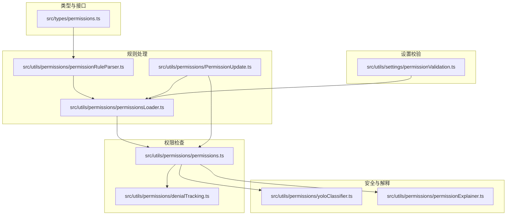
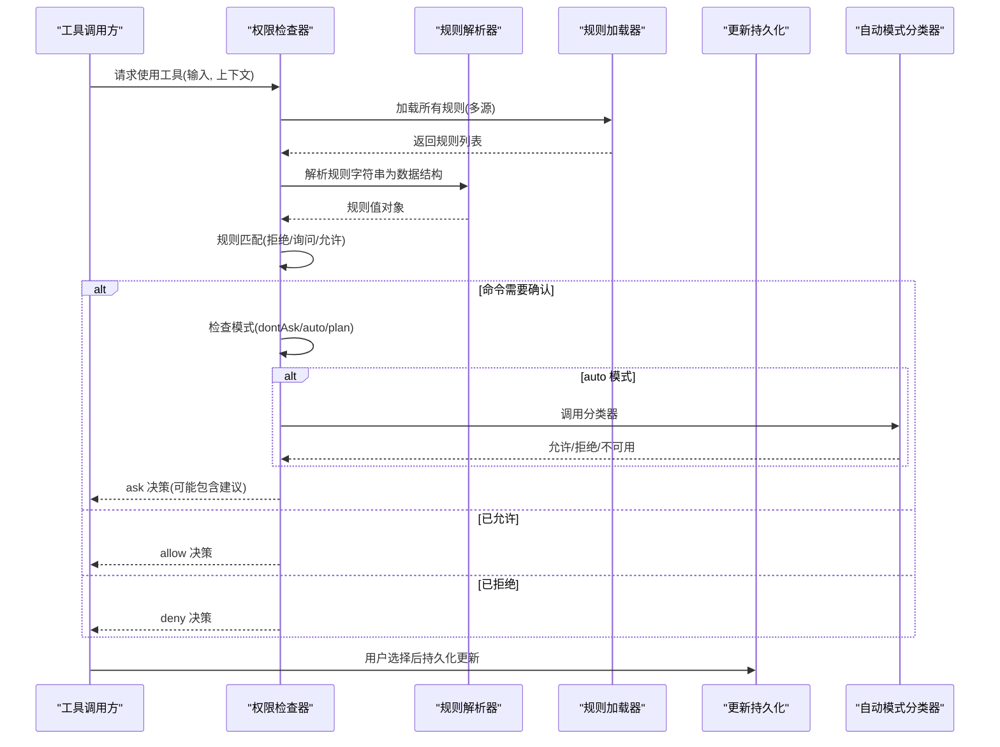
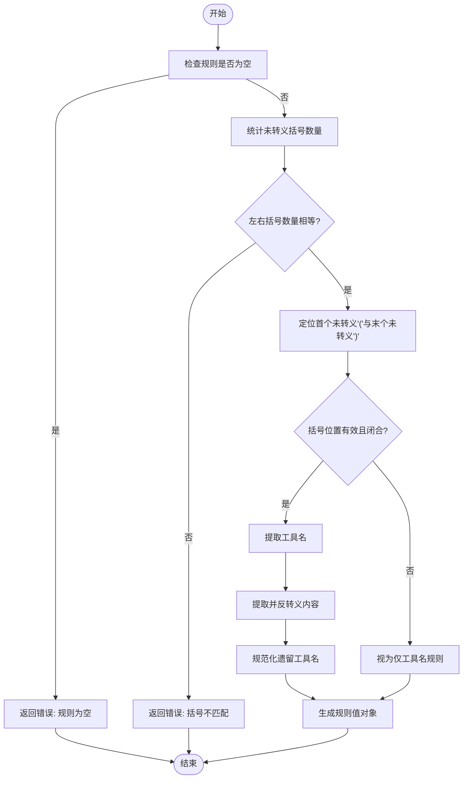
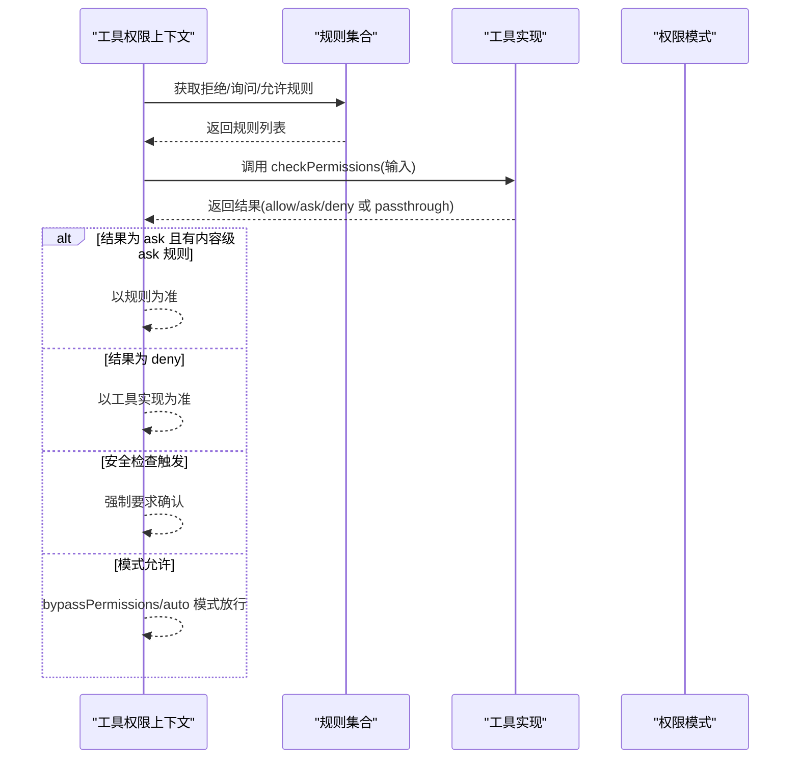
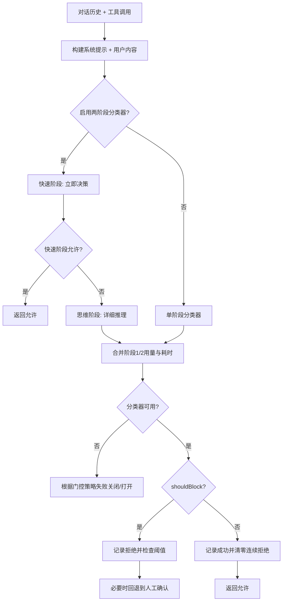
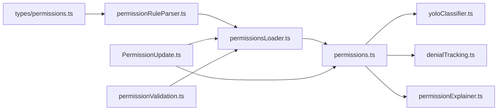

# 权限规则系统

<cite>
**本文档引用的文件**
- [src/types/permissions.ts](file://src/types/permissions.ts)
- [src/utils/permissions/permissionRuleParser.ts](file://src/utils/permissions/permissionRuleParser.ts)
- [src/utils/permissions/permissions.ts](file://src/utils/permissions/permissions.ts)
- [src/utils/settings/permissionValidation.ts](file://src/utils/settings/permissionValidation.ts)
- [src/utils/permissions/permissionsLoader.ts](file://src/utils/permissions/permissionsLoader.ts)
- [src/utils/permissions/PermissionUpdate.ts](file://src/utils/permissions/PermissionUpdate.ts)
- [src/utils/permissions/yoloClassifier.ts](file://src/utils/permissions/yoloClassifier.ts)
- [src/utils/permissions/permissionExplainer.ts](file://src/utils/permissions/permissionExplainer.ts)
- [src/utils/permissions/denialTracking.ts](file://src/utils/permissions/denialTracking.ts)
</cite>

## 目录
1. [简介](#简介)
2. [项目结构](#项目结构)
3. [核心组件](#核心组件)
4. [架构总览](#架构总览)
5. [详细组件分析](#详细组件分析)
6. [依赖关系分析](#依赖关系分析)
7. [性能考虑](#性能考虑)
8. [故障排除指南](#故障排除指南)
9. [结论](#结论)
10. [附录](#附录)

## 简介
本文件为 Claude Code 的权限规则系统提供完整技术文档。内容涵盖权限规则的定义语法与解析机制、规则匹配算法（正则表达式匹配、路径匹配、命令匹配）、规则优先级与冲突解决（继承、覆盖、影子规则检测）、危险模式识别（恶意命令识别、文件操作监控、网络访问控制），以及自定义权限规则的开发指南与最佳实践。

## 项目结构
权限规则系统主要由以下模块构成：
- 类型定义：统一的权限类型、行为、决策结果等定义，避免循环依赖
- 规则解析器：负责将字符串规则解析为可执行的数据结构，并支持转义/反转义
- 规则加载器：从不同设置源加载规则并进行校验
- 权限检查器：执行规则匹配、模式转换、自动模式分类器、拒绝次数跟踪
- 更新持久化：对规则的增删改查与设置文件同步
- 危险模式识别：基于分类器的自动模式安全决策
- 权限解释器：生成风险评估解释供用户参考

**图表来源**
- [src/types/permissions.ts:1-442](file://src/types/permissions.ts#L1-L442)
- [src/utils/permissions/permissionRuleParser.ts:1-199](file://src/utils/permissions/permissionRuleParser.ts#L1-L199)
- [src/utils/permissions/permissions.ts:1-1487](file://src/utils/permissions/permissions.ts#L1-L1487)
- [src/utils/permissions/permissionsLoader.ts:1-297](file://src/utils/permissions/permissionsLoader.ts#L1-L297)
- [src/utils/permissions/PermissionUpdate.ts:1-390](file://src/utils/permissions/PermissionUpdate.ts#L1-L390)
- [src/utils/permissions/yoloClassifier.ts:1-1496](file://src/utils/permissions/yoloClassifier.ts#L1-L1496)
- [src/utils/permissions/permissionExplainer.ts:1-251](file://src/utils/permissions/permissionExplainer.ts#L1-L251)
- [src/utils/settings/permissionValidation.ts:1-263](file://src/utils/settings/permissionValidation.ts#L1-L263)

**章节来源**
- [src/types/permissions.ts:1-442](file://src/types/permissions.ts#L1-L442)
- [src/utils/permissions/permissionRuleParser.ts:1-199](file://src/utils/permissions/permissionRuleParser.ts#L1-L199)
- [src/utils/permissions/permissions.ts:1-1487](file://src/utils/permissions/permissions.ts#L1-L1487)
- [src/utils/permissions/permissionsLoader.ts:1-297](file://src/utils/permissions/permissionsLoader.ts#L1-L297)
- [src/utils/permissions/PermissionUpdate.ts:1-390](file://src/utils/permissions/PermissionUpdate.ts#L1-L390)
- [src/utils/permissions/yoloClassifier.ts:1-1496](file://src/utils/permissions/yoloClassifier.ts#L1-L1496)
- [src/utils/permissions/permissionExplainer.ts:1-251](file://src/utils/permissions/permissionExplainer.ts#L1-L251)
- [src/utils/settings/permissionValidation.ts:1-263](file://src/utils/settings/permissionValidation.ts#L1-L263)

## 核心组件
- 权限类型与决策：定义权限模式、行为、规则值、更新操作、决策结果与原因等
- 规则解析器：支持工具名与内容分离、转义/反转义、遗留工具名映射
- 规则加载器：从多源设置加载规则，支持“仅受管规则”模式
- 权限检查器：按优先级执行规则匹配、模式转换、自动模式分类器、拒绝次数限制
- 更新持久化：对规则增删改查并同步到设置文件
- 自动模式分类器：基于对话历史与系统提示的两阶段安全判断
- 权限解释器：生成风险等级、解释与理由供用户理解

**章节来源**
- [src/types/permissions.ts:1-442](file://src/types/permissions.ts#L1-L442)
- [src/utils/permissions/permissions.ts:1-1487](file://src/utils/permissions/permissions.ts#L1-L1487)
- [src/utils/permissions/permissionRuleParser.ts:1-199](file://src/utils/permissions/permissionRuleParser.ts#L1-L199)
- [src/utils/permissions/permissionsLoader.ts:1-297](file://src/utils/permissions/permissionsLoader.ts#L1-L297)
- [src/utils/permissions/PermissionUpdate.ts:1-390](file://src/utils/permissions/PermissionUpdate.ts#L1-L390)
- [src/utils/permissions/yoloClassifier.ts:1-1496](file://src/utils/permissions/yoloClassifier.ts#L1-L1496)
- [src/utils/permissions/permissionExplainer.ts:1-251](file://src/utils/permissions/permissionExplainer.ts#L1-L251)

## 架构总览
权限系统采用“规则驱动 + 模式控制 + 分类器辅助”的三层架构：
- 规则层：用户在不同设置源中配置允许/拒绝/询问规则
- 模式层：根据当前模式（如 bypassPermissions、auto、dontAsk）决定默认行为
- 安全层：自动模式分类器在规则未覆盖时进行安全判定

**图表来源**
- [src/utils/permissions/permissions.ts:1158-1319](file://src/utils/permissions/permissions.ts#L1158-L1319)
- [src/utils/permissions/permissionRuleParser.ts:93-152](file://src/utils/permissions/permissionRuleParser.ts#L93-L152)
- [src/utils/permissions/permissionsLoader.ts:120-145](file://src/utils/permissions/permissionsLoader.ts#L120-L145)
- [src/utils/permissions/PermissionUpdate.ts:222-342](file://src/utils/permissions/PermissionUpdate.ts#L222-L342)
- [src/utils/permissions/yoloClassifier.ts:1012-1306](file://src/utils/permissions/yoloClassifier.ts#L1012-L1306)

## 详细组件分析

### 规则定义语法与解析机制
- 语法格式
  - 工具名：形如 "ToolName"
  - 工具内容：形如 "ToolName(content)"，其中 content 可包含通配符与路径模式
  - 转义规则：括号需转义，反斜杠需先转义再处理括号
- 解析流程
  - 查找第一个未转义的左括号与最后一个未转义的右括号
  - 若无括号或括号不匹配，则视为仅工具名
  - 若括号内为空或为通配符 "*"，则退化为工具级规则
  - 对内容进行反转义，得到最终规则值
- 遗留工具名映射：将旧工具名映射到新规范名称，确保规则兼容性

**图表来源**
- [src/utils/permissions/permissionRuleParser.ts:55-152](file://src/utils/permissions/permissionRuleParser.ts#L55-L152)

**章节来源**
- [src/utils/permissions/permissionRuleParser.ts:1-199](file://src/utils/permissions/permissionRuleParser.ts#L1-L199)

### 规则匹配算法
- 工具级匹配
  - 仅当规则无内容时匹配整个工具（如 "Bash"）
  - 支持 MCP 服务器级规则与通配符匹配
- 内容级匹配
  - 通过工具实现的 checkPermissions 进行命令/路径/参数级别的细粒度匹配
  - Bash 前缀规则与通配符规则在 Bash 工具内部实现
- 匹配优先级
  - 拒绝规则优先于询问规则，询问规则优先于允许规则
  - 模式转换（如 dontAsk/auto/plan）在规则之后生效
  - 安全检查（敏感路径）免疫于 bypassPermissions

**图表来源**
- [src/utils/permissions/permissions.ts:1158-1319](file://src/utils/permissions/permissions.ts#L1158-L1319)

**章节来源**
- [src/utils/permissions/permissions.ts:233-390](file://src/utils/permissions/permissions.ts#L233-L390)

### 规则优先级与冲突解决
- 优先级顺序
  - 1a. 整体工具拒绝规则
  - 1b. 整体工具询问规则
  - 1c. 工具实现的权限检查
  - 1d. 工具实现明确拒绝
  - 1e. 工具仍需用户交互
  - 1f. 内容级询问规则（来自工具实现）
  - 1g. 安全检查（敏感路径等）
  - 2a. 模式允许（bypassPermissions/plan）
  - 2b. 整体工具允许规则
  - 3. 将 passthrough 转换为 ask
- 冲突解决
  - 模式转换仅影响未被规则覆盖的情况
  - 安全检查对 bypassPermissions 免疫
  - 同一来源的重复规则会被去重
  - “仅受管规则”模式下，仅保留策略来源的规则

**章节来源**
- [src/utils/permissions/permissions.ts:1061-1156](file://src/utils/permissions/permissions.ts#L1061-L1156)
- [src/utils/permissions/permissionsLoader.ts:31-44](file://src/utils/permissions/permissionsLoader.ts#L31-L44)

### 危险模式识别系统
- 自动模式分类器
  - 输入：对话历史、工具调用、系统提示、CLAUDE.md 用户配置
  - 输出：允许/拒绝、原因、推理、令牌用量与耗时
  - 两阶段 XML 分类器：快速阶段 + 思维阶段，提升准确性
  - 错误处理：API 不可用时可“失败关闭”或“失败打开”，超长提示时回退到手动审批
- 拒绝次数跟踪
  - 连续拒绝与累计拒绝阈值，超过阈值自动回退到人工确认
- 权限解释器
  - 基于模型生成风险等级、解释与理由，帮助用户理解

**图表来源**
- [src/utils/permissions/yoloClassifier.ts:1110-1306](file://src/utils/permissions/yoloClassifier.ts#L1110-L1306)
- [src/utils/permissions/denialTracking.ts:12-45](file://src/utils/permissions/denialTracking.ts#L12-L45)

**章节来源**
- [src/utils/permissions/yoloClassifier.ts:1-1496](file://src/utils/permissions/yoloClassifier.ts#L1-L1496)
- [src/utils/permissions/denialTracking.ts:1-46](file://src/utils/permissions/denialTracking.ts#L1-L46)
- [src/utils/permissions/permissionExplainer.ts:1-251](file://src/utils/permissions/permissionExplainer.ts#L1-L251)

### 设置校验与规则验证
- 格式校验
  - 括号匹配、空括号检测、遗留空工具名
- 工具特定校验
  - Bash 前缀规则语法校验（:*/:* 位置）
  - 文件工具通配符放置校验
  - MCP 规则不支持内容段
- Zod Schema 集成
  - 提供自定义校验错误消息与示例

**章节来源**
- [src/utils/settings/permissionValidation.ts:55-239](file://src/utils/settings/permissionValidation.ts#L55-L239)

### 规则加载与持久化
- 多源加载
  - 支持用户、项目、本地、策略、标志、命令、会话等来源
  - “仅受管规则”模式下仅保留策略来源
- 增删改查
  - 去重、规范化、持久化到对应设置文件
  - 支持目录扩展与模式设置

**章节来源**
- [src/utils/permissions/permissionsLoader.ts:1-297](file://src/utils/permissions/permissionsLoader.ts#L1-L297)
- [src/utils/permissions/PermissionUpdate.ts:1-390](file://src/utils/permissions/PermissionUpdate.ts#L1-L390)

## 依赖关系分析
- 类型定义集中于 types 层，避免循环依赖
- 规则解析器与加载器相互协作，解析器负责字符串到对象的转换，加载器负责从设置文件读取并聚合
- 权限检查器串联规则、模式与分类器，形成闭环
- 更新持久化模块连接 UI 与设置文件，保证一致性

**图表来源**
- [src/types/permissions.ts:1-442](file://src/types/permissions.ts#L1-L442)
- [src/utils/permissions/permissionRuleParser.ts:1-199](file://src/utils/permissions/permissionRuleParser.ts#L1-L199)
- [src/utils/permissions/permissionsLoader.ts:1-297](file://src/utils/permissions/permissionsLoader.ts#L1-L297)
- [src/utils/permissions/permissions.ts:1-1487](file://src/utils/permissions/permissions.ts#L1-L1487)
- [src/utils/permissions/PermissionUpdate.ts:1-390](file://src/utils/permissions/PermissionUpdate.ts#L1-L390)
- [src/utils/permissions/yoloClassifier.ts:1-1496](file://src/utils/permissions/yoloClassifier.ts#L1-L1496)
- [src/utils/permissions/denialTracking.ts:1-46](file://src/utils/permissions/denialTracking.ts#L1-L46)
- [src/utils/permissions/permissionExplainer.ts:1-251](file://src/utils/permissions/permissionExplainer.ts#L1-L251)
- [src/utils/settings/permissionValidation.ts:1-263](file://src/utils/settings/permissionValidation.ts#L1-L263)

**章节来源**
- [src/utils/permissions/permissions.ts:1-1487](file://src/utils/permissions/permissions.ts#L1-L1487)
- [src/utils/permissions/permissionsLoader.ts:1-297](file://src/utils/permissions/permissionsLoader.ts#L1-L297)
- [src/utils/permissions/PermissionUpdate.ts:1-390](file://src/utils/permissions/PermissionUpdate.ts#L1-L390)

## 性能考虑
- 规则解析与匹配
  - 使用 Map 缓存规则内容到规则对象的映射，降低重复解析成本
  - Bash 前缀与通配符匹配在工具内部实现，避免跨模块复杂度
- 自动模式分类器
  - 使用缓存控制与提示词优化，减少重复计算
  - 两阶段分类器在允许时快速返回，仅在必要时进入思维阶段
- 拒绝次数跟踪
  - 仅在内存中维护状态，避免频繁磁盘 IO

[本节为通用指导，无需具体文件引用]

## 故障排除指南
- 规则无效或被跳过
  - 检查括号匹配与转义是否正确
  - 确认规则格式符合工具特定校验（如 Bash 前缀规则）
- 自动模式分类器不可用
  - 查看失败关闭/打开策略与错误提示
  - 检查提示长度是否超限，必要时回退到手动审批
- 拒绝次数过多
  - 系统会自动回退到人工确认，查看最近拒绝统计
- 权限解释器未显示
  - 确认全局配置已启用权限解释器功能

**章节来源**
- [src/utils/settings/permissionValidation.ts:55-239](file://src/utils/settings/permissionValidation.ts#L55-L239)
- [src/utils/permissions/yoloClassifier.ts:818-956](file://src/utils/permissions/yoloClassifier.ts#L818-L956)
- [src/utils/permissions/denialTracking.ts:40-45](file://src/utils/permissions/denialTracking.ts#L40-L45)
- [src/utils/permissions/permissionExplainer.ts:139-141](file://src/utils/permissions/permissionExplainer.ts#L139-L141)

## 结论
Claude Code 的权限规则系统通过清晰的语法、严格的解析与校验、灵活的规则匹配与优先级、以及自动模式下的安全分类器，实现了对工具使用行为的精细控制。其设计兼顾安全性与可用性，既支持用户自定义规则，又能在必要时通过分类器与拒绝次数跟踪保障安全边界。

[本节为总结，无需具体文件引用]

## 附录

### 开发指南与最佳实践
- 规则编写
  - 使用转义避免括号歧义；优先使用通配符而非宽泛的星号
  - Bash 前缀规则应置于末尾，避免 :* 语法误用
  - 文件工具规则建议使用路径边界通配符（如 *.ts、src/**）
- 规则管理
  - 利用“仅受管规则”模式集中管控企业策略
  - 通过 UI 或命令行添加/删除规则，注意去重与规范化
- 安全与调试
  - 在自动模式下关注分类器输出与错误提示
  - 合理设置拒绝阈值，平衡安全与效率
  - 使用权限解释器获取风险评估，辅助用户决策

[本节为通用指导，无需具体文件引用]