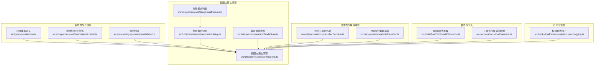
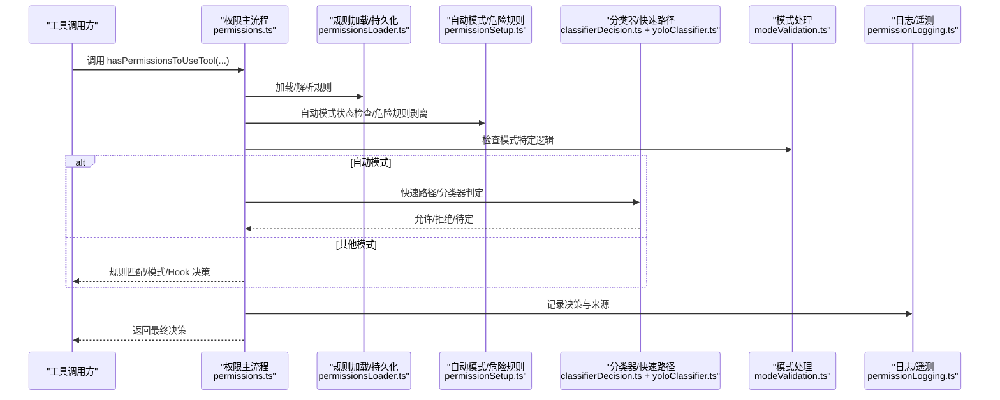
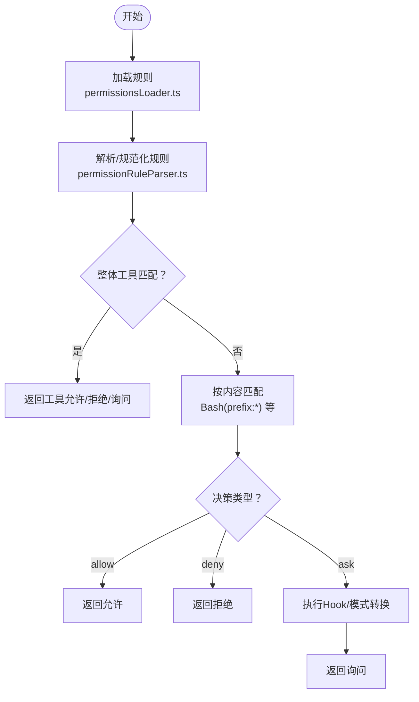
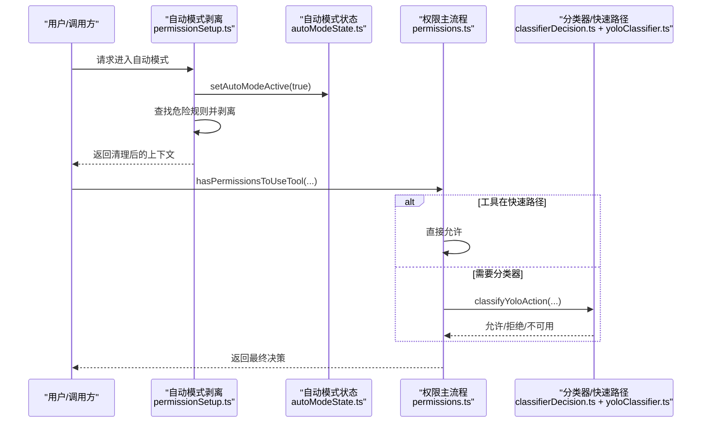
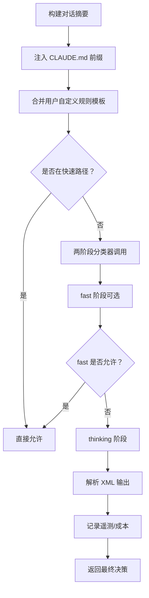
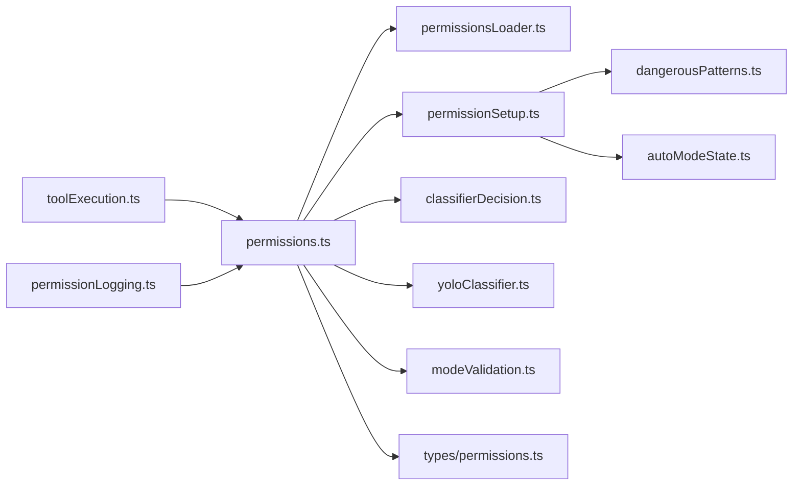

# 权限验证机制

<cite>
**本文档引用的文件**
- [src/utils/permissions/permissions.ts](file://src/utils/permissions/permissions.ts)
- [src/utils/permissions/permissionSetup.ts](file://src/utils/permissions/permissionSetup.ts)
- [src/utils/permissions/dangerousPatterns.ts](file://src/utils/permissions/dangerousPatterns.ts)
- [src/utils/permissions/permissionsLoader.ts](file://src/utils/permissions/permissionsLoader.ts)
- [src/utils/permissions/classifierDecision.ts](file://src/utils/permissions/classifierDecision.ts)
- [src/utils/permissions/yoloClassifier.ts](file://src/utils/permissions/yoloClassifier.ts)
- [src/utils/permissions/autoModeState.ts](file://src/utils/permissions/autoModeState.ts)
- [src/types/permissions.ts](file://src/types/permissions.ts)
- [src/utils/permissions/permissionValidation.ts](file://src/utils/settings/permissionValidation.ts)
- [src/tools/BashTool/modeValidation.ts](file://src/tools/BashTool/modeValidation.ts)
- [src/services/tools/toolExecution.ts](file://src/services/tools/toolExecution.ts)
- [src/hooks/toolPermission/permissionLogging.ts](file://src/hooks/toolPermission/permissionLogging.ts)
</cite>

## 目录
1. [引言](#引言)
2. [项目结构](#项目结构)
3. [核心组件](#核心组件)
4. [架构总览](#架构总览)
5. [详细组件分析](#详细组件分析)
6. [依赖关系分析](#依赖关系分析)
7. [性能考虑](#性能考虑)
8. [故障排除指南](#故障排除指南)
9. [结论](#结论)

## 引言
本文件系统性梳理 Claude Code 的权限验证机制，覆盖从权限请求接收、规则匹配验证到最终决策生成的完整流程；深入解析权限分类器（自动模式）的工作原理，包括危险模式识别、文件系统访问判断与 Shell 命令安全评估；阐述自动模式下的权限处理机制与绕过条件；并说明实时监控与日志记录机制及常见失败原因与解决方案。

## 项目结构
权限验证相关代码主要分布在以下模块：
- 规则定义与类型：src/types/permissions.ts
- 规则加载与持久化：src/utils/permissions/permissionsLoader.ts
- 规则校验与格式化：src/utils/settings/permissionValidation.ts
- 权限决策主流程：src/utils/permissions/permissions.ts
- 自动模式与危险规则处理：src/utils/permissions/permissionSetup.ts、src/utils/permissions/dangerousPatterns.ts、src/utils/permissions/autoModeState.ts
- 分类器与快速路径：src/utils/permissions/classifierDecision.ts、src/utils/permissions/yoloClassifier.ts
- 模式特定处理：src/tools/BashTool/modeValidation.ts
- 工具执行与遥测映射：src/services/tools/toolExecution.ts
- 权限日志钩子：src/hooks/toolPermission/permissionLogging.ts

**图表来源**
- [src/types/permissions.ts:1-442](file://src/types/permissions.ts#L1-L442)
- [src/utils/permissions/permissions.ts:1-800](file://src/utils/permissions/permissions.ts#L1-L800)
- [src/utils/permissions/permissionSetup.ts:1-800](file://src/utils/permissions/permissionSetup.ts#L1-L800)
- [src/utils/permissions/dangerousPatterns.ts:1-81](file://src/utils/permissions/dangerousPatterns.ts#L1-L81)
- [src/utils/permissions/permissionsLoader.ts:1-297](file://src/utils/permissions/permissionsLoader.ts#L1-L297)
- [src/utils/permissions/classifierDecision.ts:1-99](file://src/utils/permissions/classifierDecision.ts#L1-L99)
- [src/utils/permissions/yoloClassifier.ts:1-800](file://src/utils/permissions/yoloClassifier.ts#L1-L800)
- [src/utils/permissions/autoModeState.ts:1-40](file://src/utils/permissions/autoModeState.ts#L1-L40)
- [src/tools/BashTool/modeValidation.ts:52-92](file://src/tools/BashTool/modeValidation.ts#L52-L92)
- [src/services/tools/toolExecution.ts:173-194](file://src/services/tools/toolExecution.ts#L173-L194)
- [src/hooks/toolPermission/permissionLogging.ts:1-200](file://src/hooks/toolPermission/permissionLogging.ts#L1-L200)

**章节来源**
- [src/types/permissions.ts:1-442](file://src/types/permissions.ts#L1-L442)
- [src/utils/permissions/permissions.ts:1-800](file://src/utils/permissions/permissions.ts#L1-L800)
- [src/utils/permissions/permissionSetup.ts:1-800](file://src/utils/permissions/permissionSetup.ts#L1-L800)

## 核心组件
- 权限类型与上下文：定义权限模式、行为、规则值、决策结果等核心类型，并承载工具权限上下文（含额外工作目录、规则集合、模式等）。
- 规则加载与持久化：从设置源加载规则，支持策略管理（policySettings）仅允许受控规则，以及对用户/项目/本地设置的增删改写。
- 权限决策主流程：统一入口 hasPermissionsToUseTool，按规则匹配、模式转换、Hook 钩子、自动模式分类器、快速路径等顺序进行决策。
- 自动模式与危险规则：识别 Bash/PowerShell/Agent 等危险规则，进入自动模式时剥离危险规则并恢复，同时维护自动模式开关与门禁状态。
- 分类器与快速路径：安全工具白名单跳过分类器调用，接受编辑模式快速路径在受保护命名空间外放行，YOLO 分类器负责自动模式的安全判定。
- 模式特定处理：Bash 模式根据当前模式（如 Accept Edits）对文件系统命令进行差异化处理。
- 日志与遥测：将规则来源映射为遥测词汇，记录分类器决策与成本、延迟等指标。

**章节来源**
- [src/types/permissions.ts:1-442](file://src/types/permissions.ts#L1-L442)
- [src/utils/permissions/permissionsLoader.ts:1-297](file://src/utils/permissions/permissionsLoader.ts#L1-L297)
- [src/utils/permissions/permissions.ts:473-800](file://src/utils/permissions/permissions.ts#L473-L800)
- [src/utils/permissions/permissionSetup.ts:505-646](file://src/utils/permissions/permissionSetup.ts#L505-L646)
- [src/utils/permissions/classifierDecision.ts:50-99](file://src/utils/permissions/classifierDecision.ts#L50-L99)
- [src/utils/permissions/yoloClassifier.ts:1-800](file://src/utils/permissions/yoloClassifier.ts#L1-L800)
- [src/tools/BashTool/modeValidation.ts:52-92](file://src/tools/BashTool/modeValidation.ts#L52-L92)
- [src/services/tools/toolExecution.ts:173-194](file://src/services/tools/toolExecution.ts#L173-L194)

## 架构总览
下图展示权限验证从请求到决策的关键交互：

**图表来源**
- [src/utils/permissions/permissions.ts:473-800](file://src/utils/permissions/permissions.ts#L473-L800)
- [src/utils/permissions/permissionsLoader.ts:120-133](file://src/utils/permissions/permissionsLoader.ts#L120-L133)
- [src/utils/permissions/permissionSetup.ts:505-646](file://src/utils/permissions/permissionSetup.ts#L505-L646)
- [src/utils/permissions/classifierDecision.ts:50-99](file://src/utils/permissions/classifierDecision.ts#L50-L99)
- [src/utils/permissions/yoloClassifier.ts:1-800](file://src/utils/permissions/yoloClassifier.ts#L1-L800)
- [src/tools/BashTool/modeValidation.ts:52-92](file://src/tools/BashTool/modeValidation.ts#L52-L92)
- [src/hooks/toolPermission/permissionLogging.ts:1-200](file://src/hooks/toolPermission/permissionLogging.ts#L1-L200)

## 详细组件分析

### 权限请求接收与规则匹配
- 规则来源与加载：从策略设置（policySettings）或启用的设置源加载规则数组，支持仅受控规则模式；对用户/项目/本地设置进行增删改写，保留未识别字段。
- 规则解析与去重：通过解析器将字符串规则转为规则值对象，规范化名称以消除历史别名差异；添加规则时过滤重复项。
- 规则匹配策略：
  - 整体工具匹配：仅当规则无内容时匹配“整个工具”（如 Bash），不匹配带前缀的规则。
  - 内容规则匹配：按工具名与规则内容（如 Bash(prefix:*)）进行匹配，支持通配符与前缀变体。
  - MCP 工具匹配：支持服务器级规则（如 mcp__server1）与通配匹配。
- 模式与 Hook：在不同模式（如 dontAsk、bypassPermissions、plan、auto）下对决策进行转换或短路；异步代理场景通过 PermissionRequest Hook 提供决策。

**图表来源**
- [src/utils/permissions/permissionsLoader.ts:120-133](file://src/utils/permissions/permissionsLoader.ts#L120-L133)
- [src/utils/permissions/permissions.ts:233-390](file://src/utils/permissions/permissions.ts#L233-L390)
- [src/utils/permissions/permissions.ts:400-471](file://src/utils/permissions/permissions.ts#L400-L471)

**章节来源**
- [src/utils/permissions/permissionsLoader.ts:1-297](file://src/utils/permissions/permissionsLoader.ts#L1-L297)
- [src/utils/permissions/permissions.ts:233-390](file://src/utils/permissions/permissions.ts#L233-L390)
- [src/utils/permissions/permissions.ts:400-471](file://src/utils/permissions/permissions.ts#L400-L471)

### 自动模式下的权限处理机制
- 自动模式开关与门禁：通过状态模块维护 autoModeActive、autoModeFlagCli、autoModeCircuitBroken；进入/退出自动模式时更新状态并剥离/恢复危险规则。
- 危险规则识别：
  - Bash：工具级允许（Bash 或 Bash(*)）、前缀规则（如 python:*）、通配规则（python*、python *）、参数前缀（python -...*）等。
  - PowerShell：工具级允许、iex/Invoke-Expression、Start-Process 等 cmdlet、跨平台代码入口等。
  - Agent：任何 Agent 允许规则都会被视作危险，因会绕过子代理评估。
- 进入自动模式时，剥离危险规则并记录到上下文中；退出自动模式时恢复。
- 快速路径与分类器：
  - 安全工具白名单：直接允许，避免分类器调用。
  - 接受编辑模式快速路径：在受保护命名空间内对文件编辑等操作快速放行。
  - YOLO 分类器：构建紧凑对话摘要，使用 XML 输出格式，支持两阶段（fast/thinking）判定，记录 token 使用与延迟等指标。

**图表来源**
- [src/utils/permissions/permissionSetup.ts:505-646](file://src/utils/permissions/permissionSetup.ts#L505-L646)
- [src/utils/permissions/autoModeState.ts:11-33](file://src/utils/permissions/autoModeState.ts#L11-L33)
- [src/utils/permissions/classifierDecision.ts:50-99](file://src/utils/permissions/classifierDecision.ts#L50-L99)
- [src/utils/permissions/yoloClassifier.ts:1-800](file://src/utils/permissions/yoloClassifier.ts#L1-L800)

**章节来源**
- [src/utils/permissions/permissionSetup.ts:84-285](file://src/utils/permissions/permissionSetup.ts#L84-L285)
- [src/utils/permissions/permissionSetup.ts:505-646](file://src/utils/permissions/permissionSetup.ts#L505-L646)
- [src/utils/permissions/autoModeState.ts:1-40](file://src/utils/permissions/autoModeState.ts#L1-L40)
- [src/utils/permissions/classifierDecision.ts:50-99](file://src/utils/permissions/classifierDecision.ts#L50-L99)
- [src/utils/permissions/yoloClassifier.ts:1-800](file://src/utils/permissions/yoloClassifier.ts#L1-L800)

### 权限分类器的工作原理
- 快速路径：
  - 安全工具白名单：无需分类器，直接允许。
  - 接受编辑模式：在受保护命名空间内对文件编辑等快速放行。
- 分类器输入：
  - 对话摘要：仅包含用户文本与助手工具调用块，去除模型文本以避免提示注入。
  - CLAUDE.md 前缀：作为用户意图配置注入，标记缓存控制。
  - 用户自定义规则：允许/拒绝/环境三段模板由设置覆盖。
- 输出格式：XML 格式，要求先输出 <block> 标签，再输出 <reason>（仅在阻止时）。
- 两阶段判定：fast 阶段快速得到 yes/no；若 fast 允许则结束；若阻止则进入 thinking 阶段进行链式思考以降低误判。
- 成本与遥测：记录 token 使用、缓存命中、延迟、请求 ID、消息 ID 等，用于分析与计费。

**图表来源**
- [src/utils/permissions/yoloClassifier.ts:484-540](file://src/utils/permissions/yoloClassifier.ts#L484-L540)
- [src/utils/permissions/yoloClassifier.ts:711-800](file://src/utils/permissions/yoloClassifier.ts#L711-L800)
- [src/utils/permissions/classifierDecision.ts:50-99](file://src/utils/permissions/classifierDecision.ts#L50-L99)

**章节来源**
- [src/utils/permissions/yoloClassifier.ts:1-800](file://src/utils/permissions/yoloClassifier.ts#L1-L800)
- [src/utils/permissions/classifierDecision.ts:50-99](file://src/utils/permissions/classifierDecision.ts#L50-L99)

### 权限验证的实时监控与日志记录
- 规则来源到遥测映射：将规则来源映射为遥测词汇（如 user_permanent、user_temporary、user_reject、config），便于统计与审计。
- 权限日志钩子：在权限决策关键节点记录决策原因、工具名、模式、分类器结果等信息，支持通知与调试。
- 分类器错误诊断：在 API 错误时导出请求/响应与上下文比较信息，便于复现与共享。

**章节来源**
- [src/services/tools/toolExecution.ts:173-194](file://src/services/tools/toolExecution.ts#L173-L194)
- [src/hooks/toolPermission/permissionLogging.ts:1-200](file://src/hooks/toolPermission/permissionLogging.ts#L1-L200)
- [src/utils/permissions/yoloClassifier.ts:213-250](file://src/utils/permissions/yoloClassifier.ts#L213-L250)

### 权限验证失败的常见原因与解决方案
- 规则格式错误：空规则、括号不匹配、非法字符等。应使用规则校验函数进行预检，修正后重新应用。
- 危险规则导致自动模式拒绝：Bash/PowerShell 的工具级允许或危险前缀规则会被剥离或阻止。建议改为更精确的内容规则或移除危险前缀。
- PowerShell 在自动模式受限：在未启用 PowerShell 自动模式特性时，PowerShell 工具不会进入分类器，需交互确认。可通过特性开关或调整规则规避。
- 分类器不可用或超长：当分类器提示“提示过长”时，应避免一次性发送过多历史内容，或采用更短的摘要。
- 模式冲突：dontAsk 模式会将 ask 转为 deny；bypassPermissions 模式可能被组织策略禁用。应根据需要切换模式或联系管理员。

**章节来源**
- [src/utils/settings/permissionValidation.ts:58-262](file://src/utils/settings/permissionValidation.ts#L58-L262)
- [src/utils/permissions/permissionSetup.ts:84-285](file://src/utils/permissions/permissionSetup.ts#L84-L285)
- [src/utils/permissions/permissions.ts:518-591](file://src/utils/permissions/permissions.ts#L518-L591)
- [src/utils/permissions/yoloClassifier.ts:346-397](file://src/utils/permissions/yoloClassifier.ts#L346-L397)

## 依赖关系分析

**图表来源**
- [src/utils/permissions/permissions.ts:1-800](file://src/utils/permissions/permissions.ts#L1-L800)
- [src/utils/permissions/permissionsLoader.ts:1-297](file://src/utils/permissions/permissionsLoader.ts#L1-L297)
- [src/utils/permissions/permissionSetup.ts:1-800](file://src/utils/permissions/permissionSetup.ts#L1-L800)
- [src/utils/permissions/classifierDecision.ts:1-99](file://src/utils/permissions/classifierDecision.ts#L1-L99)
- [src/utils/permissions/yoloClassifier.ts:1-800](file://src/utils/permissions/yoloClassifier.ts#L1-L800)
- [src/tools/BashTool/modeValidation.ts:52-92](file://src/tools/BashTool/modeValidation.ts#L52-L92)
- [src/types/permissions.ts:1-442](file://src/types/permissions.ts#L1-L442)
- [src/utils/permissions/dangerousPatterns.ts:1-81](file://src/utils/permissions/dangerousPatterns.ts#L1-L81)
- [src/utils/permissions/autoModeState.ts:1-40](file://src/utils/permissions/autoModeState.ts#L1-L40)
- [src/services/tools/toolExecution.ts:173-194](file://src/services/tools/toolExecution.ts#L173-L194)
- [src/hooks/toolPermission/permissionLogging.ts:1-200](file://src/hooks/toolPermission/permissionLogging.ts#L1-L200)

**章节来源**
- [src/utils/permissions/permissions.ts:1-800](file://src/utils/permissions/permissions.ts#L1-L800)
- [src/utils/permissions/permissionSetup.ts:1-800](file://src/utils/permissions/permissionSetup.ts#L1-L800)

## 性能考虑
- 快速路径优化：安全工具白名单与接受编辑模式快速路径显著减少分类器调用，降低 token 与延迟开销。
- 分类器缓存：系统提示与 CLAUDE.md 前缀使用缓存控制，提升 prompt caching 效果。
- 两阶段判定：fast 阶段快速拒绝对高风险动作，仅在必要时进入 thinking 阶段，平衡准确率与性能。
- 成本与延迟遥测：记录 token 使用、缓存命中、阶段耗时等指标，便于持续优化。

[本节为通用指导，无需具体文件分析]

## 故障排除指南
- 规则无法保存：检查策略设置仅允许受控规则模式；若启用，用户/项目/本地设置的规则修改将被忽略。
- 自动模式无法进入：检查门禁状态与特性开关；若电路断开（circuit broken），需等待刷新或联系管理员。
- 分类器报错：查看错误提示与导出的诊断文件，关注提示长度、token 预算与阶段耗时；必要时缩短历史摘要。
- 模式冲突：dontAsk 将 ask 转为 deny；bypassPermissions 可能被策略禁用。根据需求切换模式或调整设置。

**章节来源**
- [src/utils/permissions/permissionsLoader.ts:27-44](file://src/utils/permissions/permissionsLoader.ts#L27-L44)
- [src/utils/permissions/permissionSetup.ts:628-637](file://src/utils/permissions/permissionSetup.ts#L628-L637)
- [src/utils/permissions/yoloClassifier.ts:213-250](file://src/utils/permissions/yoloClassifier.ts#L213-L250)
- [src/utils/permissions/permissions.ts:503-517](file://src/utils/permissions/permissions.ts#L503-L517)

## 结论
Claude Code 的权限验证机制通过“规则匹配 + 模式转换 + Hook + 自动模式分类器”的多层防护，实现了对工具使用的精细化控制。自动模式下的危险规则剥离与快速路径设计，在保证安全的同时提升了用户体验。完善的日志与遥测体系为问题定位与性能优化提供了有力支撑。建议在生产环境中结合组织策略与实际使用场景，合理配置规则与模式，确保安全与效率的平衡。