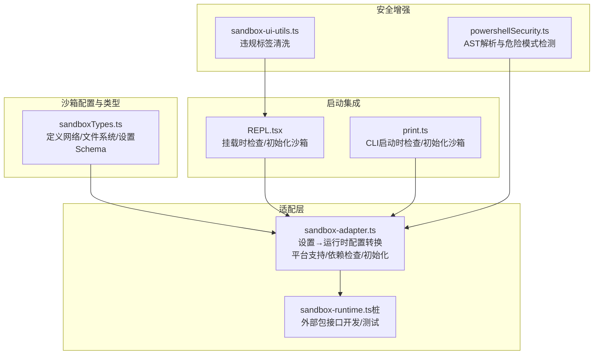
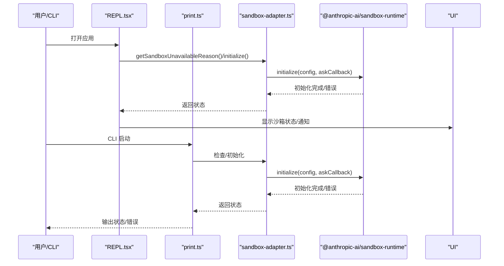
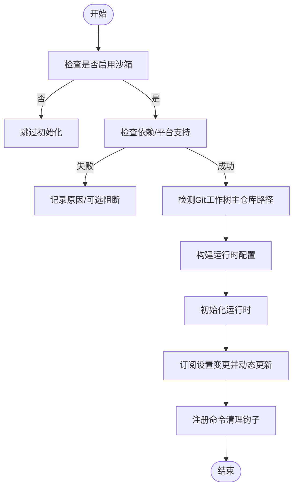
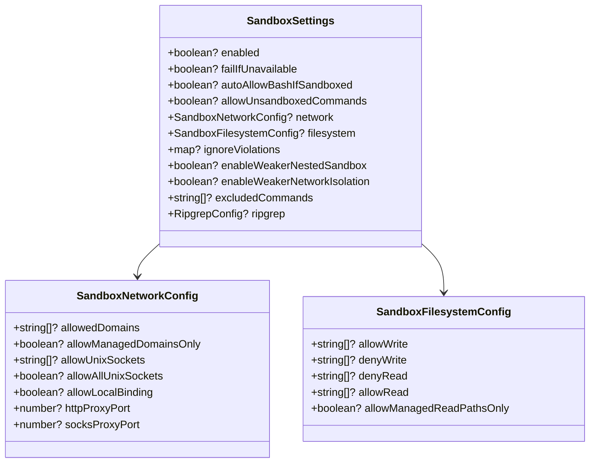
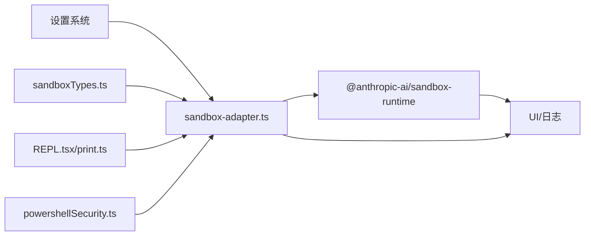

# 沙箱隔离机制

<cite>
**本文引用的文件**
- [sandbox-adapter.ts](file://src/utils/sandbox/sandbox-adapter.ts)
- [sandbox-ui-utils.ts](file://src/utils/sandbox/sandbox-ui-utils.ts)
- [sandboxTypes.ts](file://src/entrypoints/sandboxTypes.ts)
- [sandbox-runtime.ts（桩）](file://stubs/sandbox-runtime.ts)
- [REPL.tsx](file://src/screens/REPL.tsx)
- [print.ts](file://src/cli/print.ts)
- [powershellSecurity.ts](file://src/tools/PowerShellTool/powershellSecurity.ts)
- [toolName.ts](file://src/tools/BashTool/toolName.ts)
</cite>

## 目录
1. [简介](#简介)
2. [项目结构](#项目结构)
3. [核心组件](#核心组件)
4. [架构总览](#架构总览)
5. [详细组件分析](#详细组件分析)
6. [依赖关系分析](#依赖关系分析)
7. [性能考量](#性能考量)
8. [故障排查指南](#故障排查指南)
9. [结论](#结论)
10. [附录](#附录)

## 简介
本文件系统性阐述 Claude Code 的沙箱隔离机制，覆盖架构设计、进程与网络/文件系统隔离、沙箱适配器在多平台的策略、文件系统访问控制、shell 命令安全执行环境，以及配置最佳实践与性能优化建议。目标是帮助开发者与运维人员理解并正确使用沙箱能力，在保证安全的前提下获得良好体验。

## 项目结构
围绕沙箱的关键代码主要分布在以下模块：
- 配置与类型：定义沙箱网络/文件系统配置与设置项
- 适配层：将设置转换为运行时配置，并桥接外部 sandbox-runtime 包
- UI 工具：对违规信息进行 UI 清洗展示
- 启动集成：在 REPL 与 CLI 中初始化与启用沙箱
- 安全增强：针对 PowerShell 的命令解析与危险模式检测

图表来源
- [sandboxTypes.ts:1-157](file://src/entrypoints/sandboxTypes.ts#L1-L157)
- [sandbox-adapter.ts:1-986](file://src/utils/sandbox/sandbox-adapter.ts#L1-L986)
- [sandbox-runtime.ts（桩）:1-39](file://stubs/sandbox-runtime.ts#L1-L39)
- [REPL.tsx:2312-2341](file://src/screens/REPL.tsx#L2312-L2341)
- [print.ts:598-626](file://src/cli/print.ts#L598-L626)
- [powershellSecurity.ts:1-800](file://src/tools/PowerShellTool/powershellSecurity.ts#L1-L800)
- [sandbox-ui-utils.ts:1-13](file://src/utils/sandbox/sandbox-ui-utils.ts#L1-L13)

章节来源
- [sandboxTypes.ts:1-157](file://src/entrypoints/sandboxTypes.ts#L1-L157)
- [sandbox-adapter.ts:1-986](file://src/utils/sandbox/sandbox-adapter.ts#L1-L986)
- [sandbox-runtime.ts（桩）:1-39](file://stubs/sandbox-runtime.ts#L1-L39)
- [REPL.tsx:2312-2341](file://src/screens/REPL.tsx#L2312-L2341)
- [print.ts:598-626](file://src/cli/print.ts#L598-L626)
- [powershellSecurity.ts:1-800](file://src/tools/PowerShellTool/powershellSecurity.ts#L1-L800)
- [sandbox-ui-utils.ts:1-13](file://src/utils/sandbox/sandbox-ui-utils.ts#L1-L13)

## 核心组件
- 沙箱设置与类型
  - 定义网络域白名单/黑名单、Unix Socket 控制、本地绑定、代理端口等
  - 文件系统读写/拒绝读写的路径集合，以及“仅受托管设置允许读取”策略
  - 其他高级选项：弱化嵌套沙箱、弱化网络隔离、忽略违规映射、排除命令列表、ripgrep 配置等
- 适配器（SandboxManager）
  - 将用户设置转换为运行时配置
  - 平台支持检测与依赖检查
  - 初始化/更新/重置沙箱状态
  - 提供清理钩子（如裸仓库文件清理）
- UI 工具
  - 对包含沙箱违规标记的文本进行清洗，便于 UI 展示
- 启动集成
  - 在 REPL 与 CLI 启动阶段检查沙箱可用性与必要性，必要时阻断或警告
- 安全增强（PowerShell）
  - 基于 AST 的危险模式检测，覆盖动态命令名、编码参数、下载脚手架、COM 对象、成员调用等

章节来源
- [sandboxTypes.ts:11-144](file://src/entrypoints/sandboxTypes.ts#L11-L144)
- [sandbox-adapter.ts:168-381](file://src/utils/sandbox/sandbox-adapter.ts#L168-L381)
- [sandbox-ui-utils.ts:6-12](file://src/utils/sandbox/sandbox-ui-utils.ts#L6-L12)
- [REPL.tsx:2312-2341](file://src/screens/REPL.tsx#L2312-L2341)
- [print.ts:598-626](file://src/cli/print.ts#L598-L626)
- [powershellSecurity.ts:1-800](file://src/tools/PowerShellTool/powershellSecurity.ts#L1-L800)

## 架构总览
沙箱架构由“配置层（设置/Schema）—适配层（转换/初始化）—运行时（外部 sandbox-runtime）—UI/安全增强”构成。适配层负责：
- 将权限规则与设置转换为运行时可消费的配置
- 跨平台支持与依赖检查
- 动态更新配置与清理钩子
- 与 UI 和 CLI 的集成点

图表来源
- [REPL.tsx:2312-2341](file://src/screens/REPL.tsx#L2312-L2341)
- [print.ts:598-626](file://src/cli/print.ts#L598-L626)
- [sandbox-adapter.ts:730-792](file://src/utils/sandbox/sandbox-adapter.ts#L730-L792)
- [sandbox-runtime.ts（桩）:15-38](file://stubs/sandbox-runtime.ts#L15-L38)

## 详细组件分析

### 组件A：沙箱适配器（SandboxManager）
职责与流程
- 设置到运行时配置转换：从权限规则与设置中提取网络域、文件系统路径、ripgrep 等，生成运行时配置
- 平台与依赖检查：支持 macOS/Linux/WSL2；检查依赖（如 ripgrep）是否满足
- 初始化与动态更新：首次初始化后订阅设置变更，实时刷新配置
- 清理钩子：命令结束后清理裸仓库文件，防止逃逸
- 排除命令管理：支持将特定命令加入“不沙箱”列表

关键实现要点
- 路径解析策略：区分“权限规则约定”与“标准路径语义”，确保绝对路径与相对路径按预期解析
- Git 安全：对裸仓库文件进行存在性检测与事后清理，避免逃逸风险
- 网络回调策略：在托管设置开启“仅允许受管域”时，统一拦截非受管域请求
- 平台限制：WSL1 不支持；可通过 enabledPlatforms 限制启用平台

图表来源
- [sandbox-adapter.ts:528-592](file://src/utils/sandbox/sandbox-adapter.ts#L528-L592)
- [sandbox-adapter.ts:730-792](file://src/utils/sandbox/sandbox-adapter.ts#L730-L792)
- [sandbox-adapter.ts:798-822](file://src/utils/sandbox/sandbox-adapter.ts#L798-L822)

章节来源
- [sandbox-adapter.ts:168-381](file://src/utils/sandbox/sandbox-adapter.ts#L168-L381)
- [sandbox-adapter.ts:447-592](file://src/utils/sandbox/sandbox-adapter.ts#L447-L592)
- [sandbox-adapter.ts:730-822](file://src/utils/sandbox/sandbox-adapter.ts#L730-L822)

### 组件B：配置与类型（SandboxTypes）
- 网络配置：允许域、仅受管域、Unix Socket、本地绑定、代理端口
- 文件系统配置：读/写允许/拒绝路径集合，以及“仅受管读取路径”
- 设置项：启用/阻断不可用、自动允许 Bash（若沙箱启用）、允许不受限命令、弱化隔离、排除命令、ripgrep
- 类型推导：通过 Schema 推导出强类型，确保 SDK 与设置校验一致

图表来源
- [sandboxTypes.ts:11-144](file://src/entrypoints/sandboxTypes.ts#L11-L144)

章节来源
- [sandboxTypes.ts:11-144](file://src/entrypoints/sandboxTypes.ts#L11-L144)

### 组件C：UI 工具（违规信息清洗）
- 移除包含沙箱违规标记的文本片段，用于 UI 展示
- 保持消息可读性，同时保留关键上下文

章节来源
- [sandbox-ui-utils.ts:6-12](file://src/utils/sandbox/sandbox-ui-utils.ts#L6-L12)

### 组件D：启动集成（REPL 与 CLI）
- REPL：挂载时检查沙箱不可用原因；若强制要求且不可用则直接退出；否则记录调试日志并提示
- CLI：启动时检查并初始化沙箱；若不可用且被要求，则拒绝启动

章节来源
- [REPL.tsx:2312-2341](file://src/screens/REPL.tsx#L2312-L2341)
- [print.ts:598-626](file://src/cli/print.ts#L598-L626)

### 组件E：PowerShell 安全增强
- 基于 AST 的静态分析，识别危险模式：
  - 动态命令名、编码参数、下载脚手架、COM 对象、成员调用、脚本块注入、子表达式、可展开字符串、旁切（splatting）、停止解析令牌等
- 对 Start-Process、New-Object、Invoke-Expression 等高危命令进行严格约束
- 与沙箱配合，进一步降低命令执行风险

章节来源
- [powershellSecurity.ts:1-800](file://src/tools/PowerShellTool/powershellSecurity.ts#L1-L800)

## 依赖关系分析
- 适配器依赖外部 sandbox-runtime 包（开发/测试环境下以桩实现替代）
- 适配器依赖设置系统（合并后的设置对象），并订阅设置变更
- 适配器依赖平台与路径工具，用于路径解析与平台检测
- UI 工具依赖适配器提供的违规存储与标注能力
- 启动集成依赖适配器的初始化与状态查询

图表来源
- [sandbox-adapter.ts:1-986](file://src/utils/sandbox/sandbox-adapter.ts#L1-L986)
- [sandboxTypes.ts:1-157](file://src/entrypoints/sandboxTypes.ts#L1-L157)
- [sandbox-runtime.ts（桩）:1-39](file://stubs/sandbox-runtime.ts#L1-L39)
- [REPL.tsx:2312-2341](file://src/screens/REPL.tsx#L2312-L2341)
- [print.ts:598-626](file://src/cli/print.ts#L598-L626)
- [powershellSecurity.ts:1-800](file://src/tools/PowerShellTool/powershellSecurity.ts#L1-L800)

章节来源
- [sandbox-adapter.ts:1-986](file://src/utils/sandbox/sandbox-adapter.ts#L1-L986)
- [sandbox-types.ts:1-157](file://src/entrypoints/sandboxTypes.ts#L1-L157)
- [sandbox-runtime.ts（桩）:1-39](file://stubs/sandbox-runtime.ts#L1-L39)
- [REPL.tsx:2312-2341](file://src/screens/REPL.tsx#L2312-L2341)
- [print.ts:598-626](file://src/cli/print.ts#L598-L626)
- [powershellSecurity.ts:1-800](file://src/tools/PowerShellTool/powershellSecurity.ts#L1-L800)

## 性能考量
- 初始化与缓存
  - 依赖检查与平台支持采用记忆化缓存，避免重复计算
  - 设置变更订阅后异步更新配置，减少主线程阻塞
- 运行时开销
  - 沙箱包装命令会引入额外开销；建议合理配置允许域与路径，减少越权尝试导致的失败重试
  - 在 Linux/WSL 上谨慎使用通配符，避免因不支持而引发的降级与额外处理
- I/O 与工具链
  - ripgrep 配置优先使用用户设置，否则回退内置配置；确保工具链可用可减少失败路径
- Git 场景
  - 工作树主仓库路径一次性解析并缓存，避免每次命令都做昂贵检测

章节来源
- [sandbox-adapter.ts:447-592](file://src/utils/sandbox/sandbox-adapter.ts#L447-L592)
- [sandbox-adapter.ts:730-792](file://src/utils/sandbox/sandbox-adapter.ts#L730-L792)

## 故障排查指南
常见问题与定位方法
- 沙箱未启用但用户期望启用
  - 使用“不可用原因”接口获取明确提示（平台不支持、依赖缺失、平台不在启用列表等）
  - 若设置为“必须启用”，则在启动阶段直接阻断
- 依赖缺失
  - 依赖检查返回错误列表；根据平台提示安装所需工具（如 bubblewrap、socat 等）
- 权限不足或路径不匹配
  - 检查文件系统配置与权限规则；确认路径解析是否符合预期（绝对/相对/设置根目录）
- PowerShell 命令被拦截
  - 查看 AST 危险模式检测结果；必要时调整命令或提升权限
- 裸仓库逃逸风险
  - 命令结束后会清理裸仓库文件；若仍出现异常行为，检查清理逻辑是否生效

章节来源
- [REPL.tsx:2312-2341](file://src/screens/REPL.tsx#L2312-L2341)
- [print.ts:598-626](file://src/cli/print.ts#L598-L626)
- [sandbox-adapter.ts:562-592](file://src/utils/sandbox/sandbox-adapter.ts#L562-L592)
- [powershellSecurity.ts:1-800](file://src/tools/PowerShellTool/powershellSecurity.ts#L1-L800)

## 结论
Claude Code 的沙箱机制通过“强类型配置 + 适配层转换 + 外部运行时 + UI/安全增强”的组合，实现了跨平台的进程、网络与文件系统隔离。适配器在路径解析、平台支持、依赖检查、动态配置更新与清理钩子等方面提供了稳健的工程化实现；结合 PowerShell 的 AST 危险模式检测，进一步提升了命令执行的安全性。建议在生产环境中启用沙箱，并通过受管设置锁定关键策略，以达到更强的安全保障。

## 附录

### 最佳实践清单
- 启用策略
  - 默认启用沙箱；若企业需要强制落地，可开启“不可用即阻断”
  - 通过 enabledPlatforms 限定启用范围，逐步扩大平台覆盖
- 网络域管理
  - 明确 allowedDomains；在受管设置中开启“仅允许受管域”，避免误放行
  - 仅在必要时开放 Unix Socket 或本地绑定
- 文件系统访问
  - 明确 allowWrite/allowRead；避免将敏感路径暴露给沙箱内命令
  - 使用“仅受管读取路径”策略，集中管控读取范围
- 命令与工具
  - 对高风险命令（如 Start-Process、New-Object、Invoke-Expression）进行严格限制
  - 在 Linux/WSL 上谨慎使用通配符，必要时改用更精确的路径
- 运维与可观测性
  - 记录沙箱违规事件与清理动作，定期审计
  - 在受管设置中固化关键策略，避免本地覆盖

### 性能优化建议
- 减少路径与域数量：尽量收敛 allow 列表，降低运行时匹配成本
- 合理使用 ripgrep：优先使用已安装工具，避免频繁切换默认配置
- 避免频繁设置变更：批量更新后再触发一次 refreshConfig，减少多次重建
- 选择合适平台：在 macOS 上可利用更严格的隔离策略；Linux/WSL 上关注兼容性与降级路径