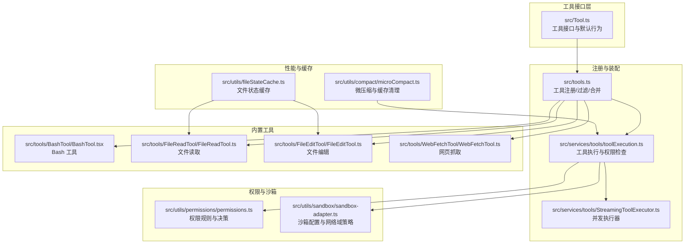
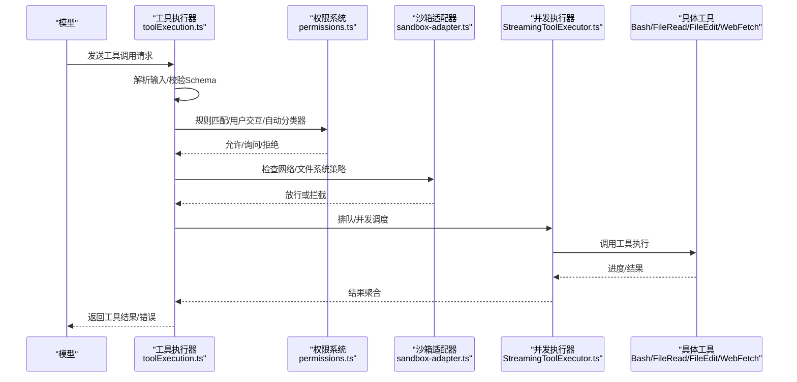
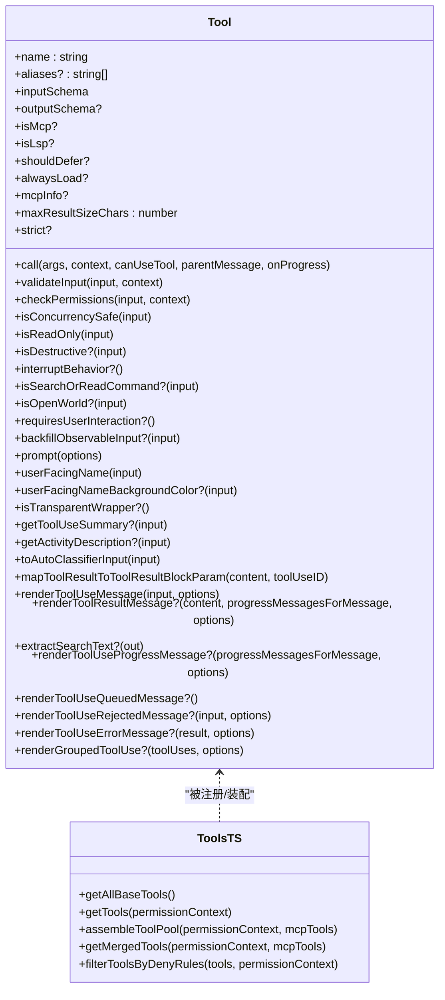
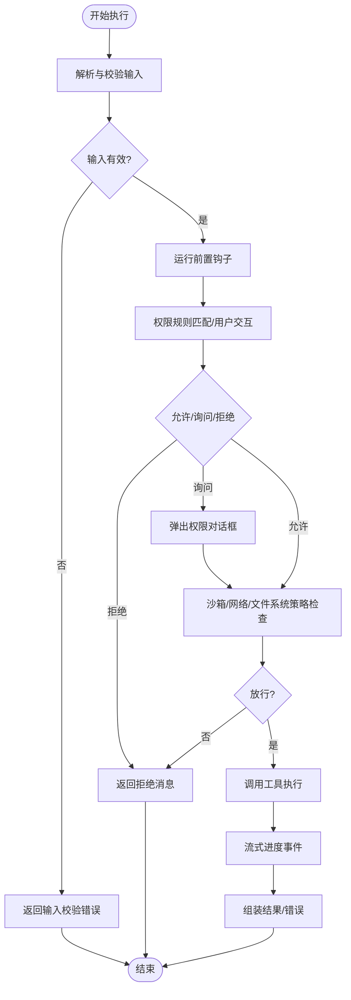
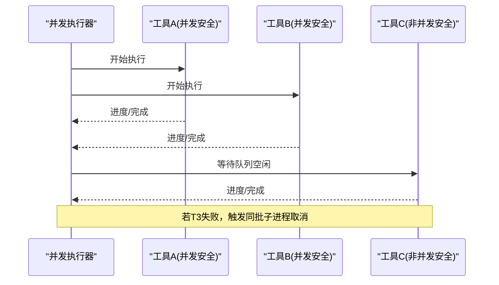
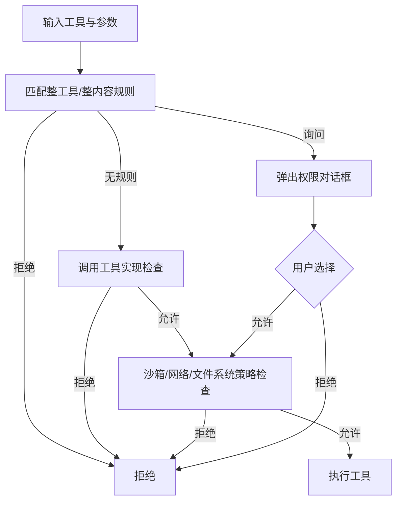
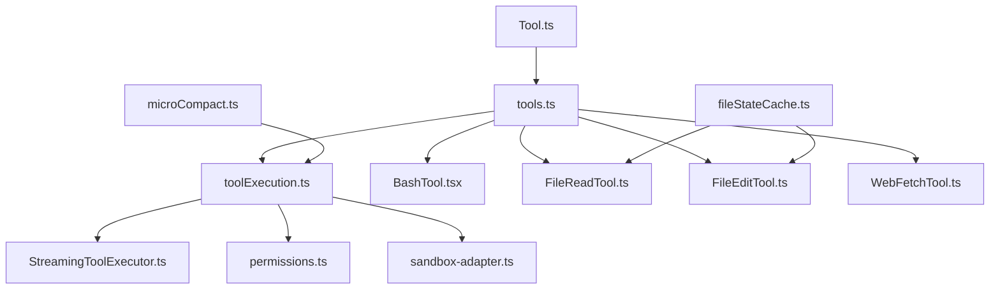

# 工具系统

<cite>
**本文档引用的文件**
- [src/Tool.ts](file://src/Tool.ts)
- [src/tools.ts](file://src/tools.ts)
- [src/services/tools/toolExecution.ts](file://src/services/tools/toolExecution.ts)
- [src/services/tools/StreamingToolExecutor.ts](file://src/services/tools/StreamingToolExecutor.ts)
- [src/utils/fileStateCache.ts](file://src/utils/fileStateCache.ts)
- [src/utils/sandbox/sandbox-adapter.ts](file://src/utils/sandbox/sandbox-adapter.ts)
- [src/utils/permissions/permissions.ts](file://src/utils/permissions/permissions.ts)
- [src/tools/BashTool/BashTool.tsx](file://src/tools/BashTool/BashTool.tsx)
- [src/tools/FileReadTool/FileReadTool.ts](file://src/tools/FileReadTool/FileReadTool.ts)
- [src/tools/FileEditTool/FileEditTool.ts](file://src/tools/FileEditTool/FileEditTool.ts)
- [src/tools/WebFetchTool/WebFetchTool.ts](file://src/tools/WebFetchTool/WebFetchTool.ts)
- [src/utils/compact/microCompact.ts](file://src/utils/compact/microCompact.ts)
- [src/cli/structuredIO.ts](file://src/cli/structuredIO.ts)
- [src/screens/REPL.tsx](file://src/screens/REPL.tsx)
</cite>

## 目录
1. [简介](#简介)
2. [项目结构](#项目结构)
3. [核心组件](#核心组件)
4. [架构总览](#架构总览)
5. [详细组件分析](#详细组件分析)
6. [依赖关系分析](#依赖关系分析)
7. [性能考虑](#性能考虑)
8. [故障排除指南](#故障排除指南)
9. [结论](#结论)

## 简介
本文件为 Claude Code 的工具系统技术文档，全面阐述工具系统的架构设计、接口规范、注册机制、执行流程、权限控制、内置工具分类与实现原理、扩展性设计（MCP 插件）、以及性能优化与并发控制策略。文档面向不同技术背景的读者，既提供高层概览也包含代码级细节与可视化图表。

## 项目结构
工具系统围绕统一的工具接口抽象构建，通过集中注册与过滤机制生成可用工具池，并在运行时按权限规则与并发约束执行。核心目录与文件如下：
- 工具接口与默认行为：src/Tool.ts
- 工具注册与装配：src/tools.ts
- 工具执行与权限检查：src/services/tools/toolExecution.ts
- 并发执行器：src/services/tools/StreamingToolExecutor.ts
- 文件状态缓存：src/utils/fileStateCache.ts
- 沙箱适配器与网络域策略：src/utils/sandbox/sandbox-adapter.ts
- 权限规则与决策：src/utils/permissions/permissions.ts
- 内置工具示例：src/tools/BashTool/BashTool.tsx、src/tools/FileReadTool/FileReadTool.ts、src/tools/FileEditTool/FileEditTool.ts、src/tools/WebFetchTool/WebFetchTool.ts
- 微压缩与缓存清理：src/utils/compact/microCompact.ts
- SDK/CLI 交互：src/cli/structuredIO.ts
- REPL 权限上下文更新：src/screens/REPL.tsx

**图表来源**
- [src/Tool.ts:362-695](file://src/Tool.ts#L362-L695)
- [src/tools.ts:193-367](file://src/tools.ts#L193-L367)
- [src/services/tools/toolExecution.ts:337-490](file://src/services/tools/toolExecution.ts#L337-L490)
- [src/services/tools/StreamingToolExecutor.ts:40-151](file://src/services/tools/StreamingToolExecutor.ts#L40-L151)
- [src/utils/permissions/permissions.ts:1060-1297](file://src/utils/permissions/permissions.ts#L1060-L1297)
- [src/utils/sandbox/sandbox-adapter.ts:148-849](file://src/utils/sandbox/sandbox-adapter.ts#L148-L849)
- [src/tools/BashTool/BashTool.tsx:420-800](file://src/tools/BashTool/BashTool.tsx#L420-L800)
- [src/tools/FileReadTool/FileReadTool.ts:337-718](file://src/tools/FileReadTool/FileReadTool.ts#L337-L718)
- [src/tools/FileEditTool/FileEditTool.ts:86-595](file://src/tools/FileEditTool/FileEditTool.ts#L86-L595)
- [src/tools/WebFetchTool/WebFetchTool.ts:66-307](file://src/tools/WebFetchTool/WebFetchTool.ts#L66-L307)
- [src/utils/fileStateCache.ts:30-143](file://src/utils/fileStateCache.ts#L30-L143)
- [src/utils/compact/microCompact.ts:32-367](file://src/utils/compact/microCompact.ts#L32-L367)

**章节来源**
- [src/Tool.ts:1-793](file://src/Tool.ts#L1-L793)
- [src/tools.ts:1-390](file://src/tools.ts#L1-L390)

## 核心组件
- 工具接口与默认行为：定义工具的标准生命周期、能力标记、渲染接口、AI 面向描述与映射方法，并提供 buildTool 构造器以填充默认实现，确保工具实现的一致性与最小化样板代码。
- 工具注册与装配：集中管理内置工具集合，按权限规则过滤、按特性开关启用/禁用、按 REPL 模式隐藏/暴露工具、并合并 MCP 工具，保证提示词缓存稳定性与去重。
- 工具执行与权限检查：对工具调用进行输入校验、权限决策（含规则匹配、用户交互、自动分类器）、钩子前置/后置处理、进度事件流式输出、错误分类与日志记录。
- 并发执行器：基于工具并发安全属性（isConcurrencySafe）与队列顺序，协调并发与串行执行，支持兄弟进程取消联动与结果有序回传。
- 权限与沙箱：规则驱动的权限决策（允许/询问/拒绝），结合 Bash/网络等敏感操作的沙箱策略与托管域名白名单，支持本地设置持久化与动态刷新。
- 内置工具：涵盖文件操作（读/写/编辑）、系统命令（Bash/PowerShell）、网络请求（WebFetch）、搜索与列表（Glob/Grep）、技能与任务管理等，均遵循统一接口与安全约束。
- 性能与缓存：LRU 文件状态缓存、微压缩与缓存清理、大结果落盘与预览、并发控制与进度流式化，降低内存占用与提升响应速度。

**章节来源**
- [src/Tool.ts:362-793](file://src/Tool.ts#L362-L793)
- [src/tools.ts:193-367](file://src/tools.ts#L193-L367)
- [src/services/tools/toolExecution.ts:599-800](file://src/services/tools/toolExecution.ts#L599-L800)
- [src/services/tools/StreamingToolExecutor.ts:40-151](file://src/services/tools/StreamingToolExecutor.ts#L40-L151)
- [src/utils/permissions/permissions.ts:1060-1297](file://src/utils/permissions/permissions.ts#L1060-L1297)
- [src/utils/sandbox/sandbox-adapter.ts:148-849](file://src/utils/sandbox/sandbox-adapter.ts#L148-L849)
- [src/utils/fileStateCache.ts:30-143](file://src/utils/fileStateCache.ts#L30-L143)
- [src/utils/compact/microCompact.ts:32-367](file://src/utils/compact/microCompact.ts#L32-L367)

## 架构总览
工具系统采用“接口抽象 + 注册装配 + 执行编排 + 权限与沙箱 + 性能优化”的分层设计。下图展示从模型请求到工具执行与结果返回的关键路径：

**图表来源**
- [src/services/tools/toolExecution.ts:337-490](file://src/services/tools/toolExecution.ts#L337-L490)
- [src/utils/permissions/permissions.ts:1060-1297](file://src/utils/permissions/permissions.ts#L1060-L1297)
- [src/utils/sandbox/sandbox-adapter.ts:148-849](file://src/utils/sandbox/sandbox-adapter.ts#L148-L849)
- [src/services/tools/StreamingToolExecutor.ts:40-151](file://src/services/tools/StreamingToolExecutor.ts#L40-L151)
- [src/tools/BashTool/BashTool.tsx:624-800](file://src/tools/BashTool/BashTool.tsx#L624-L800)
- [src/tools/FileReadTool/FileReadTool.ts:496-718](file://src/tools/FileReadTool/FileReadTool.ts#L496-L718)
- [src/tools/FileEditTool/FileEditTool.ts:387-595](file://src/tools/FileEditTool/FileEditTool.ts#L387-L595)
- [src/tools/WebFetchTool/WebFetchTool.ts:208-307](file://src/tools/WebFetchTool/WebFetchTool.ts#L208-L307)

## 详细组件分析

### 工具接口与注册机制
- 工具接口定义：统一的 Tool 类型，包含生命周期方法（validateInput/checkPermissions/call）、能力标记（isConcurrencySafe/isReadOnly/isDestructive/interruptBehavior）、渲染接口（renderToolUseMessage/renderToolResultMessage 等）、AI 面向描述（prompt/description/userFacingName）与结果映射（mapToolResultToToolResultBlockParam）。
- 默认行为与构造器：buildTool 填充默认实现（如 isEnabled/isConcurrencySafe/isReadOnly/isDestructive/checkPermissions/toAutoClassifierInput/userFacingName），确保工具实现最小化。
- 工具注册与装配：getAllBaseTools 组装基础工具集；getTools 过滤环境/特性/REPL/权限规则；assembleToolPool 合并内置与 MCP 工具并去重；getMergedTools 提供完整工具集用于统计与 MCP 计数。

**图表来源**
- [src/Tool.ts:362-695](file://src/Tool.ts#L362-L695)
- [src/tools.ts:193-367](file://src/tools.ts#L193-L367)

**章节来源**
- [src/Tool.ts:362-793](file://src/Tool.ts#L362-L793)
- [src/tools.ts:193-367](file://src/tools.ts#L193-L367)

### 工具执行流程与权限控制
- 输入校验与错误提示：使用 zod 对工具输入进行严格解析，若失败生成可诊断的错误信息，并在特定场景下附加“延迟加载工具未发送模式”提示。
- 权限决策：按规则（deny/ask/allow）与用户交互（PermissionPromptTool）进行决策，支持自动分类器与沙箱覆盖策略；REPL 模式与计划模式下的特殊处理。
- 钩子与上下文：运行前置/后置钩子，支持权限请求、重试、观察者输入回填、上下文修改回调等。
- 流式进度与结果：通过进度消息与最终结果消息，支持 UI 实时反馈与错误恢复。

**图表来源**
- [src/services/tools/toolExecution.ts:599-800](file://src/services/tools/toolExecution.ts#L599-L800)
- [src/utils/permissions/permissions.ts:1060-1297](file://src/utils/permissions/permissions.ts#L1060-L1297)
- [src/utils/sandbox/sandbox-adapter.ts:148-849](file://src/utils/sandbox/sandbox-adapter.ts#L148-L849)

**章节来源**
- [src/services/tools/toolExecution.ts:599-800](file://src/services/tools/toolExecution.ts#L599-L800)
- [src/utils/permissions/permissions.ts:1060-1297](file://src/utils/permissions/permissions.ts#L1060-L1297)

### 并发控制与流式执行
- 并发安全：工具声明 isConcurrencySafe，仅并发安全工具可与其他并发安全工具并行执行；非并发安全工具需独占执行窗口，保持顺序一致性。
- 兄弟进程取消：当任一 Bash 工具出错时，通过子级 AbortController 向同批执行的子进程广播取消信号，避免资源浪费。
- 结果有序：并发执行器维护执行队列，按到达顺序缓冲并回传结果，保证消息序列稳定。

**图表来源**
- [src/services/tools/StreamingToolExecutor.ts:40-151](file://src/services/tools/StreamingToolExecutor.ts#L40-L151)

**章节来源**
- [src/services/tools/StreamingToolExecutor.ts:40-151](file://src/services/tools/StreamingToolExecutor.ts#L40-L151)

### 内置工具分类与实现要点

#### 文件操作工具
- 文件读取（FileReadTool）
  - 读取文本/图片/PDF/Jupyter Notebook 等内容，支持偏移/限制与页范围参数。
  - 令牌计数与大小限制，超限时抛出异常；设备文件与阻塞路径检测。
  - 文件状态缓存去重，避免重复传输；支持会话内自动记忆文件新鲜度提示。
- 文件编辑（FileEditTool）
  - 基于已读内容进行替换，支持多处替换与引用样式保留。
  - 严格的时间戳与内容一致性检查，防止并发写入冲突；变更通知 LSP 与 VS Code。
  - 设置文件与敏感内容校验，笔记本文件走专用工具。
- 文件写入（FileWriteTool）
  - 作为文件写入入口，配合读取/编辑形成闭环；与编辑工具共享一致性保障。

**章节来源**
- [src/tools/FileReadTool/FileReadTool.ts:337-718](file://src/tools/FileReadTool/FileReadTool.ts#L337-L718)
- [src/tools/FileEditTool/FileEditTool.ts:86-595](file://src/tools/FileEditTool/FileEditTool.ts#L86-L595)

#### 系统命令工具
- Bash 工具（BashTool）
  - 支持前台/后台执行、自动背景化策略、长睡眠命令拦截建议。
  - 严格的只读/破坏性判定、沙箱策略、命令语义解释与错误归类。
  - 进度流式输出、图像/结构化内容处理、大输出落盘与预览。
- PowerShell 工具（PowerShellTool）
  - 与 Bash 类似的权限与安全策略，针对 Windows 环境的特殊处理。

**章节来源**
- [src/tools/BashTool/BashTool.tsx:420-800](file://src/tools/BashTool/BashTool.tsx#L420-L800)

#### 网络请求工具
- 网页抓取（WebFetchTool）
  - 优先域名白名单与预批准主机；根据内容类型决定直接返回或应用提示提取。
  - 重定向检测与二次确认；二进制内容落盘并提供路径提示。
  - 权限规则按域名粒度匹配，支持快速添加允许规则。

**章节来源**
- [src/tools/WebFetchTool/WebFetchTool.ts:66-307](file://src/tools/WebFetchTool/WebFetchTool.ts#L66-L307)

#### 搜索与列表工具
- Glob/Grep 工具：在嵌入式搜索工具不可用时提供文件系统搜索与内容检索能力。
- 列表工具：目录/树形结构展示，支持 UI 折叠显示。

#### 其他工具
- 技能/任务/代理/计划模式/工作树/远程触发/定时任务/笔记编辑等，均遵循统一接口与权限模型。

**章节来源**
- [src/tools.ts:193-251](file://src/tools.ts#L193-L251)

### 权限控制机制
- 规则来源：本地设置/用户设置/策略设置/项目设置/命令行参数等；支持会话临时授权与永久授权。
- 决策阶段：
  - 1a/1b：整工具/整内容规则匹配（拒绝/询问）。
  - 1c/1d：工具实现的细粒度权限检查与拒绝。
  - 1f：内容特定的询问规则。
  - 2a/2b：模式豁免（绕过权限/计划模式）与始终允许规则。
- 沙箱与网络域：基于 WebFetch 规则与策略设置生成沙箱运行时配置，限制网络访问与文件系统路径。
- REPL 与 SDK：REPL 中权限上下文可更新并重新检查队列；SDK 通过 can_use_tool 控制请求转发至宿主进行用户确认。

**图表来源**
- [src/utils/permissions/permissions.ts:1060-1297](file://src/utils/permissions/permissions.ts#L1060-L1297)
- [src/utils/sandbox/sandbox-adapter.ts:148-849](file://src/utils/sandbox/sandbox-adapter.ts#L148-L849)
- [src/screens/REPL.tsx:2340-2375](file://src/screens/REPL.tsx#L2340-L2375)
- [src/cli/structuredIO.ts:723-753](file://src/cli/structuredIO.ts#L723-L753)

**章节来源**
- [src/utils/permissions/permissions.ts:1060-1297](file://src/utils/permissions/permissions.ts#L1060-L1297)
- [src/utils/sandbox/sandbox-adapter.ts:148-849](file://src/utils/sandbox/sandbox-adapter.ts#L148-L849)
- [src/screens/REPL.tsx:2340-2375](file://src/screens/REPL.tsx#L2340-L2375)
- [src/cli/structuredIO.ts:723-753](file://src/cli/structuredIO.ts#L723-L753)

### 自定义工具开发指南
- 接口规范：使用 buildTool 定义工具，至少实现 name、inputSchema、call、checkPermissions、isConcurrencySafe、isReadOnly、prompt/description、render* 渲染方法与 mapToolResultToToolResultBlockParam。
- 参数验证：validateInput 中进行业务规则校验（路径存在性、大小/令牌限制、格式合法性），返回 { result: false, message, errorCode }。
- 权限实现：checkPermissions 中结合工具输入与上下文判断是否允许、是否需要询问、是否需要更新输入；必要时提供 suggestions。
- 并发与安全：合理设置 isConcurrencySafe/isReadOnly/isDestructive/interruptBehavior，避免竞态与破坏性副作用。
- 错误处理：捕获并格式化错误，区分用户可感知的错误与内部错误；在 UI 层提供友好的拒绝/错误消息渲染。
- 最佳实践：使用 backfillObservableInput 注入派生字段；在 renderToolUseMessage 中提供简洁摘要；在 mapToolResultToToolResultBlockParam 中正确封装结果块。

**章节来源**
- [src/Tool.ts:362-695](file://src/Tool.ts#L362-L695)
- [src/tools/BashTool/BashTool.tsx:524-541](file://src/tools/BashTool/BashTool.tsx#L524-L541)
- [src/tools/FileReadTool/FileReadTool.ts:418-495](file://src/tools/FileReadTool/FileReadTool.ts#L418-L495)
- [src/tools/FileEditTool/FileEditTool.ts:137-362](file://src/tools/FileEditTool/FileEditTool.ts#L137-L362)
- [src/tools/WebFetchTool/WebFetchTool.ts:104-180](file://src/tools/WebFetchTool/WebFetchTool.ts#L104-L180)

### 扩展性设计与第三方工具接入
- MCP 工具集成：通过 assembleToolPool 将 MCP 工具与内置工具合并，保持内置工具前缀连续以维持提示词缓存断点；支持按服务器/工具名规范化与去重。
- 工具发现与延迟加载：支持 ToolSearch 工具按需加载，避免一次性发送全部工具模式导致的缓存失效。
- 插件与技能：动态发现技能目录并异步加载，支持条件技能激活与路径模式匹配。

**章节来源**
- [src/tools.ts:345-367](file://src/tools.ts#L345-L367)
- [src/tools.ts:383-389](file://src/tools.ts#L383-L389)

## 依赖关系分析

**图表来源**
- [src/Tool.ts:362-695](file://src/Tool.ts#L362-L695)
- [src/tools.ts:193-367](file://src/tools.ts#L193-L367)
- [src/services/tools/toolExecution.ts:337-490](file://src/services/tools/toolExecution.ts#L337-L490)
- [src/services/tools/StreamingToolExecutor.ts:40-151](file://src/services/tools/StreamingToolExecutor.ts#L40-L151)
- [src/utils/permissions/permissions.ts:1060-1297](file://src/utils/permissions/permissions.ts#L1060-L1297)
- [src/utils/sandbox/sandbox-adapter.ts:148-849](file://src/utils/sandbox/sandbox-adapter.ts#L148-L849)
- [src/utils/fileStateCache.ts:30-143](file://src/utils/fileStateCache.ts#L30-L143)
- [src/utils/compact/microCompact.ts:32-367](file://src/utils/compact/microCompact.ts#L32-L367)

**章节来源**
- [src/tools.ts:193-367](file://src/tools.ts#L193-L367)
- [src/services/tools/toolExecution.ts:337-490](file://src/services/tools/toolExecution.ts#L337-L490)

## 性能考虑
- 缓存策略
  - 文件状态缓存：LRU 策略，按字节计算大小，避免大文本文件内存膨胀；支持去重与合并。
  - 微压缩与缓存清理：按时间阈值清理旧工具结果，减少上下文长度与 API 成本。
- 大结果处理
  - 输出落盘与预览：超过阈值时将结果保存到工具结果目录并通过预览包装返回，避免模型端内存压力。
  - 图像/结构化内容：按需压缩与尺寸调整，保持 UI 准确标签。
- 并发与流式
  - 并发执行器按工具并发安全属性调度，避免不必要的串行等待；流式进度事件降低 UI 卡顿。
- 令牌与大小限制
  - 文件读取令牌与大小限制估算，必要时通过 API 估算精确令牌数，超限提前报错。

**章节来源**
- [src/utils/fileStateCache.ts:30-143](file://src/utils/fileStateCache.ts#L30-L143)
- [src/utils/compact/microCompact.ts:32-367](file://src/utils/compact/microCompact.ts#L32-L367)
- [src/tools/BashTool/BashTool.tsx:728-753](file://src/tools/BashTool/BashTool.tsx#L728-L753)
- [src/tools/FileReadTool/FileReadTool.ts:755-772](file://src/tools/FileReadTool/FileReadTool.ts#L755-L772)

## 故障排除指南
- 输入校验失败：检查工具输入 Schema 是否与模型输出一致，必要时使用 ToolSearch 加载工具后再调用。
- 权限被拒：查看 deny/ask 规则来源，确认是否需要添加允许规则或在权限对话框中授权；REPL 模式下注意会话临时授权。
- 沙箱拦截：检查网络域名是否在托管域名白名单中，或通过本地设置排除特定命令；必要时手动授权。
- 并发冲突：对于非并发安全工具，避免同时发起多个破坏性操作；关注兄弟进程取消导致的中断。
- 大输出问题：工具结果过大时自动落盘，检查工具结果目录与预览内容；适当使用 offset/limit 或分段读取。

**章节来源**
- [src/services/tools/toolExecution.ts:578-597](file://src/services/tools/toolExecution.ts#L578-L597)
- [src/utils/permissions/permissions.ts:1060-1297](file://src/utils/permissions/permissions.ts#L1060-L1297)
- [src/utils/sandbox/sandbox-adapter.ts:148-849](file://src/utils/sandbox/sandbox-adapter.ts#L148-L849)

## 结论
Claude Code 的工具系统以统一接口为核心，通过严格的权限与沙箱控制、完善的并发与流式执行、以及缓存与压缩优化，实现了高安全性、高性能与良好扩展性的工具生态。内置工具覆盖文件操作、系统命令、网络请求等常见场景，同时通过 MCP 与 ToolSearch 支持第三方工具与延迟加载。开发者可基于 buildTool 快速实现自定义工具，并遵循参数验证、权限实现与错误处理的最佳实践，确保工具在复杂环境中稳定运行。