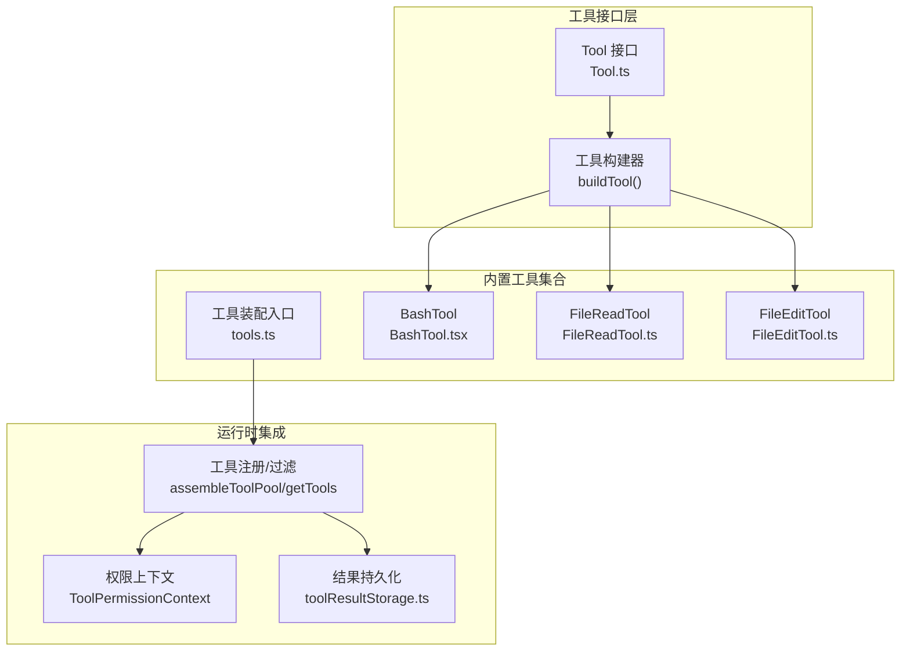
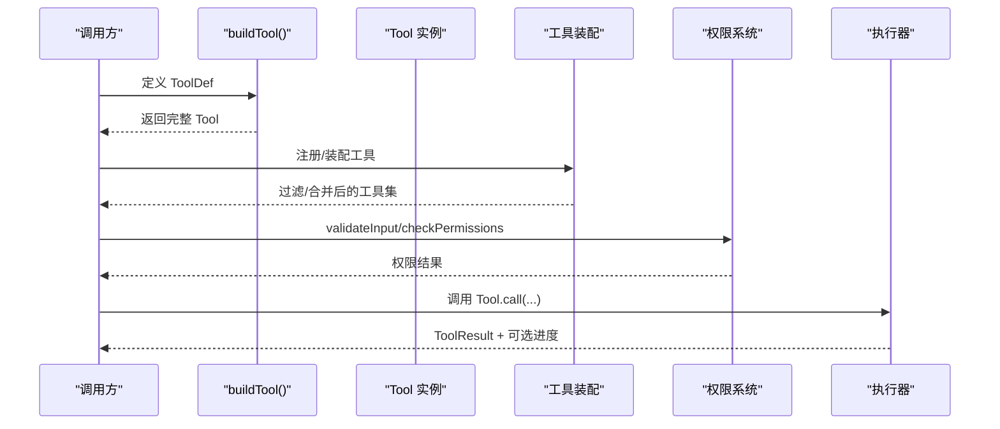
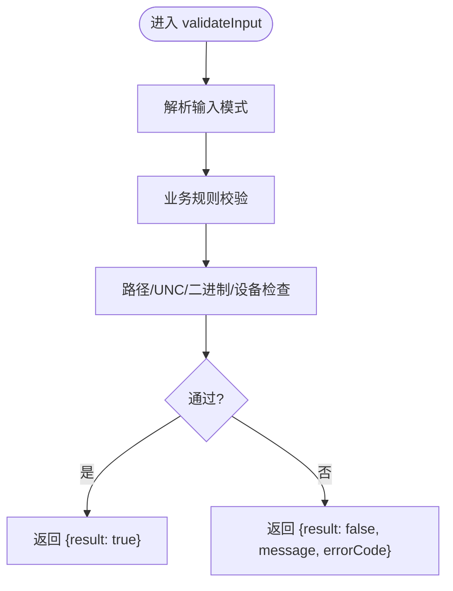
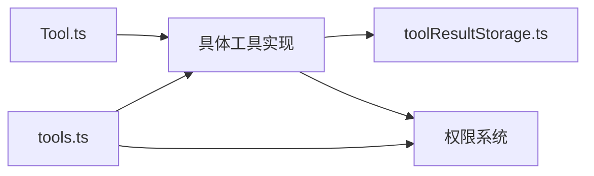

# 自定义工具开发

<cite>
**本文档引用的文件**
- [Tool.ts](file://src/Tool.ts)
- [tools.ts](file://src/tools.ts)
- [BashTool.tsx](file://src/tools/BashTool/BashTool.tsx)
- [FileReadTool.ts](file://src/tools/FileReadTool/FileReadTool.ts)
- [FileEditTool.ts](file://src/tools/FileEditTool/FileEditTool.ts)
- [utils.ts](file://src/tools/utils.ts)
- [tools.ts（常量）](file://src/constants/tools.ts)
- [toolResultStorage.ts](file://src/utils/toolResultStorage.ts)
- [testing/TestingPermissionTool.tsx](file://src/tools/testing/TestingPermissionTool.tsx)
- [perfettoTracing.ts](file://src/utils/telemetry/perfettoTracing.ts)
- [queryProfiler.ts](file://src/utils/queryProfiler.ts)
- [toolExecution.ts](file://src/services/tools/toolExecution.ts)
</cite>

## 目录
1. [简介](#简介)
2. [项目结构](#项目结构)
3. [核心组件](#核心组件)
4. [架构总览](#架构总览)
5. [详细组件分析](#详细组件分析)
6. [依赖关系分析](#依赖关系分析)
7. [性能考虑](#性能考虑)
8. [故障排查指南](#故障排查指南)
9. [结论](#结论)
10. [附录](#附录)

## 简介
本指南面向在 Claude Code 中开发自定义工具的工程师，系统讲解工具类继承、方法实现与接口规范，参数验证机制（类型检查、必填项、转换处理），错误处理最佳实践（异常捕获、错误信息格式化、回退策略），以及工具与系统的集成方式（注册、权限配置、生命周期管理）。文档同时提供完整开发示例与测试方法，并总结性能优化与调试技巧。

## 项目结构
Claude Code 的工具体系由统一的工具接口与构建器组成，内置大量工具作为参考实现，覆盖文件读写、命令执行、网络搜索、任务管理等场景。工具注册通过集中装配函数完成，支持按权限上下文过滤与 MCP 工具合并。

**图表来源**
- [Tool.ts:362-793](file://src/Tool.ts#L362-L793)
- [tools.ts:193-367](file://src/tools.ts#L193-L367)
- [BashTool.tsx:420-800](file://src/tools/BashTool/BashTool.tsx#L420-L800)
- [FileReadTool.ts:337-718](file://src/tools/FileReadTool/FileReadTool.ts#L337-L718)
- [FileEditTool.ts:86-595](file://src/tools/FileEditTool/FileEditTool.ts#L86-L595)
- [toolResultStorage.ts:1-200](file://src/utils/toolResultStorage.ts#L1-L200)

**章节来源**
- [Tool.ts:1-793](file://src/Tool.ts#L1-L793)
- [tools.ts:193-367](file://src/tools.ts#L193-L367)

## 核心组件
- 工具接口与构建器
  - 工具接口定义了调用签名、输入输出模式、权限校验、UI 渲染、进度消息、摘要与活动描述等能力边界。
  - 构建器负责填充默认行为（如只读、并发安全、权限策略等），确保工具实现最小化样板代码。
- 工具装配与注册
  - 提供获取全部工具、按权限过滤、合并 MCP 工具、生成预设等能力，是工具池装配的唯一入口。
- 结果持久化与预算控制
  - 对超大结果进行磁盘持久化并返回预览，避免截断；支持会话级内容替换状态，保证提示缓存前缀稳定。

**章节来源**
- [Tool.ts:362-793](file://src/Tool.ts#L362-L793)
- [tools.ts:193-367](file://src/tools.ts#L193-L367)
- [toolResultStorage.ts:1-200](file://src/utils/toolResultStorage.ts#L1-L200)

## 架构总览
工具从“声明式定义”到“运行时执行”的关键路径如下：

**图表来源**
- [Tool.ts:783-793](file://src/Tool.ts#L783-L793)
- [tools.ts:345-367](file://src/tools.ts#L345-L367)

## 详细组件分析

### 工具接口与构建器
- 关键要点
  - 输入/输出模式：使用 Zod 模式或 JSON Schema 描述输入；输出需映射为 SDK 的结果块参数。
  - 默认行为：并发安全、只读、破坏性、权限策略、分类器输入、用户可见名等均有默认实现。
  - 可选扩展：参数校验、路径提取、权限匹配器、UI 渲染、摘要/活动描述、分组渲染等。
- 开发建议
  - 优先复用默认值，仅覆盖必要方法；保持输入/输出模式稳定，避免破坏提示缓存。
  - 使用严格模式（strict: true）提升参数校验强度；合理设置最大结果长度阈值。

**章节来源**
- [Tool.ts:362-793](file://src/Tool.ts#L362-L793)

### 工具装配与注册
- 关键要点
  - 获取全部工具：根据环境特性与特性开关动态拼装。
  - 过滤与合并：按权限规则过滤内置工具；合并 MCP 工具并去重，内置工具优先。
  - 预设与模式：支持简单模式、协调者模式、进程内同伴等不同工具集。
- 集成注意
  - REPL 模式下会隐藏部分原语工具，避免直接调用。
  - 工具名称必须全局唯一，冲突时内置工具优先。

**章节来源**
- [tools.ts:193-367](file://src/tools.ts#L193-L367)
- [tools.ts（常量）:36-113](file://src/constants/tools.ts#L36-L113)

### 参数验证机制
- 类型与必填项
  - 使用 Zod 模式定义输入字段类型与可选性；在 validateInput 中进行业务规则校验。
- 转换与规范化
  - 在 backfillObservableInput 中对输入进行标准化（如路径展开），避免规则绕过。
- 典型流程
  - 解析输入 → 规则校验 → 路径/UNC/二进制/设备文件等安全检查 → 返回验证结果。

**图表来源**
- [FileReadTool.ts:418-495](file://src/tools/FileReadTool/FileReadTool.ts#L418-L495)
- [FileEditTool.ts:137-362](file://src/tools/FileEditTool/FileEditTool.ts#L137-L362)

**章节来源**
- [FileReadTool.ts:418-495](file://src/tools/FileReadTool/FileReadTool.ts#L418-L495)
- [FileEditTool.ts:137-362](file://src/tools/FileEditTool/FileEditTool.ts#L137-L362)

### 错误处理最佳实践
- 异常捕获
  - 在工具 call 中捕获底层异常，构造可读错误信息；必要时抛出语义化错误类型。
- 错误信息格式化
  - 统一返回结构化错误（含错误码），便于 UI 与权限系统区分处理。
- 回退策略
  - 对不可恢复错误提供替代方案（如建议相似文件、范围读取、降级显示）。
- 示例参考
  - 文件读取：ENOENT 时尝试替代路径或建议相似文件。
  - 文件编辑：检测未读先写、内容变更冲突等，引导用户重新读取。

**章节来源**
- [FileReadTool.ts:608-651](file://src/tools/FileReadTool/FileReadTool.ts#L608-L651)
- [FileEditTool.ts:274-311](file://src/tools/FileEditTool/FileEditTool.ts#L274-L311)

### 工具与系统集成
- 注册与装配
  - 通过 assembleToolPool 合并内置与 MCP 工具；getTools 过滤权限规则；getMergedTools 获取完整列表。
- 权限配置
  - 基于 ToolPermissionContext 与规则匹配器（preparePermissionMatcher）实现细粒度控制。
- 生命周期管理
  - 工具在调用前后可触发 UI/通知/日志等副作用；支持中断行为（取消/阻塞）。
- 与 UI 的交互
  - 提供渲染钩子（工具使用消息、进度消息、结果消息、拒绝/错误 UI）。

**章节来源**
- [tools.ts:345-389](file://src/tools.ts#L345-L389)
- [BashTool.tsx:524-548](file://src/tools/BashTool/BashTool.tsx#L524-L548)

### 性能优化与结果持久化
- 大结果处理
  - 当结果超过阈值时自动持久化至磁盘并返回预览；支持按工具覆盖阈值。
- 会话级预算控制
  - 基于内容替换状态（seenIds、replacements）在多工具并行场景中保持一致决策，避免提示缓存失效。
- 调试与追踪
  - 工具执行可记录性能事件（Perfetto）、查询阶段耗时（queryProfiler）与后置钩子耗时。

**章节来源**
- [toolResultStorage.ts:1-200](file://src/utils/toolResultStorage.ts#L1-L200)
- [toolResultStorage.ts:272-334](file://src/utils/toolResultStorage.ts#L272-L334)
- [toolResultStorage.ts:769-800](file://src/utils/toolResultStorage.ts#L769-L800)
- [perfettoTracing.ts:696-763](file://src/utils/telemetry/perfettoTracing.ts#L696-L763)
- [queryProfiler.ts:205-262](file://src/utils/queryProfiler.ts#L205-L262)
- [toolExecution.ts:1521-1538](file://src/services/tools/toolExecution.ts#L1521-L1538)

### 开发示例与测试方法
- 示例一：只读文本读取工具
  - 定义输入模式（文件路径、偏移、限制、页范围）
  - 实现 validateInput（路径/UNC/二进制/设备检查、页范围解析）
  - 实现 call（读取文件、内容格式化、技能发现、缓存去重）
  - 映射为 SDK 结果块
- 示例二：文件内容修改工具
  - 输入校验（大小限制、存在性、内容一致性、替换次数）
  - 执行原子写入（备份、编码/行尾处理、LSP/VsCode 通知）
  - 结果映射与统计
- 测试工具
  - TestingPermissionTool：用于端到端测试权限弹窗路径，仅在测试环境下启用。

**章节来源**
- [FileReadTool.ts:227-495](file://src/tools/FileReadTool/FileReadTool.ts#L227-L495)
- [FileReadTool.ts:496-718](file://src/tools/FileReadTool/FileReadTool.ts#L496-L718)
- [FileEditTool.ts:137-362](file://src/tools/FileEditTool/FileEditTool.ts#L137-L362)
- [FileEditTool.ts:387-595](file://src/tools/FileEditTool/FileEditTool.ts#L387-L595)
- [testing/TestingPermissionTool.tsx:1-74](file://src/tools/testing/TestingPermissionTool.tsx#L1-L74)

## 依赖关系分析
- 工具接口与实现
  - Tool.ts 定义统一契约；各工具通过 buildTool 填充默认行为。
- 工具装配
  - tools.ts 统一导出与装配，集中处理特性开关、权限过滤、MCP 合并。
- 结果持久化
  - toolResultStorage.ts 为所有工具提供统一的大结果处理能力。
- 权限系统
  - 工具通过 checkPermissions 与 preparePermissionMatcher 与权限上下文协作。

**图表来源**
- [Tool.ts:362-793](file://src/Tool.ts#L362-L793)
- [tools.ts:193-367](file://src/tools.ts#L193-L367)
- [toolResultStorage.ts:1-200](file://src/utils/toolResultStorage.ts#L1-L200)

**章节来源**
- [Tool.ts:362-793](file://src/Tool.ts#L362-L793)
- [tools.ts:193-367](file://src/tools.ts#L193-L367)

## 性能考虑
- 输入/输出模式稳定性
  - 保持输入/输出模式不变，避免提示缓存失效。
- 大结果处理
  - 合理设置 maxResultSizeChars 并利用持久化预览，减少内存占用。
- 并行工具与预算控制
  - 使用内容替换状态在多工具并行时保持一致决策，降低重复计算。
- 调试与观测
  - 利用 Perfetto 事件、查询阶段计时与后置钩子耗时监控工具性能瓶颈。

[本节为通用指导，无需特定文件引用]

## 故障排查指南
- 常见问题定位
  - 参数校验失败：检查 validateInput 的错误码与消息，确认是否命中路径/UNC/二进制/设备等安全检查。
  - 权限拒绝：确认 ToolPermissionContext 与规则匹配器逻辑，必要时在 preparePermissionMatcher 中细化匹配。
  - 大结果未持久化：检查 getPersistenceThreshold 与工具阈值覆盖标志位。
- 调试技巧
  - 使用 Perfetto 工具跨度事件记录工具执行开始/结束与元数据。
  - 查看查询阶段耗时，识别工具执行阶段瓶颈。
  - 检查后置钩子耗时，定位慢钩子影响。

**章节来源**
- [perfettoTracing.ts:696-763](file://src/utils/telemetry/perfettoTracing.ts#L696-L763)
- [queryProfiler.ts:205-262](file://src/utils/queryProfiler.ts#L205-L262)
- [toolExecution.ts:1521-1538](file://src/services/tools/toolExecution.ts#L1521-L1538)

## 结论
通过统一的工具接口与构建器，Claude Code 为自定义工具开发提供了清晰的范式：最小化实现、强约束校验、完善的权限与 UI 集成、稳健的结果持久化与性能观测。遵循本文档的开发流程与最佳实践，可在保证安全性与可维护性的前提下快速迭代工具能力。

## 附录
- 工具开发清单
  - 定义输入/输出模式（Zod 或 JSON Schema）
  - 实现 validateInput 与 checkPermissions
  - 实现 call 并在必要时提供进度回调
  - 实现 UI 渲染钩子（工具使用/进度/结果/拒绝/错误）
  - 设置 maxResultSizeChars 与可选持久化阈值覆盖
  - 在 tools.ts 中注册并参与装配
- 测试建议
  - 单元测试：覆盖参数校验、权限匹配、边界条件
  - 集成测试：结合 TestingPermissionTool 验证权限弹窗路径
  - 性能测试：评估大结果持久化与并行工具预算控制效果

[本节为通用指导，无需特定文件引用]