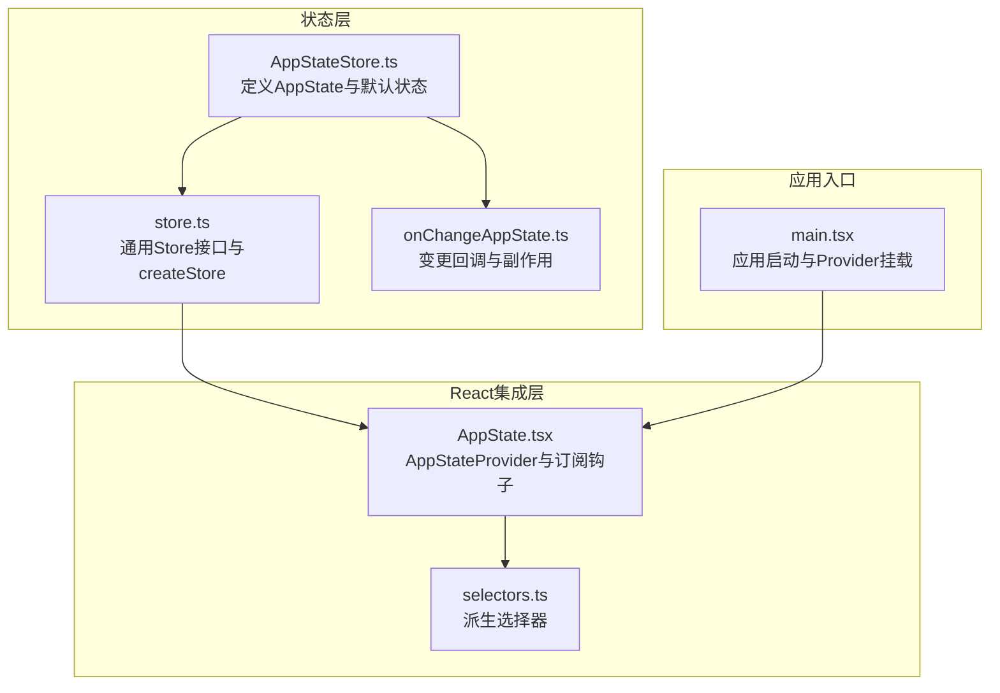
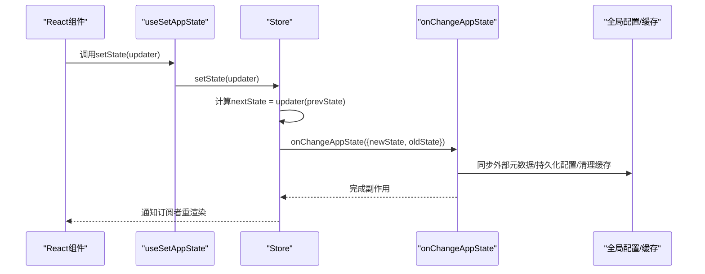
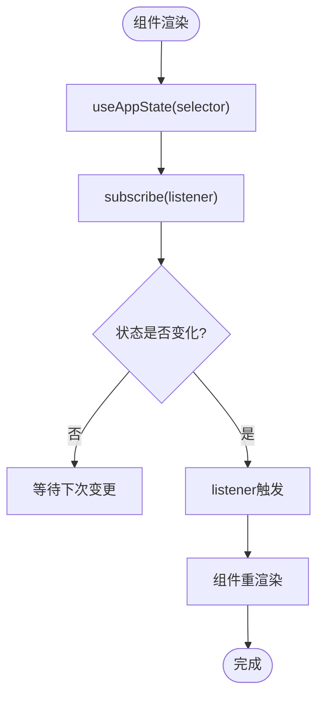
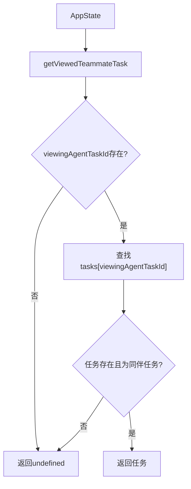
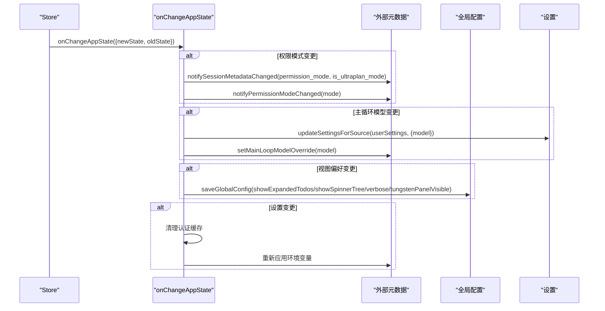
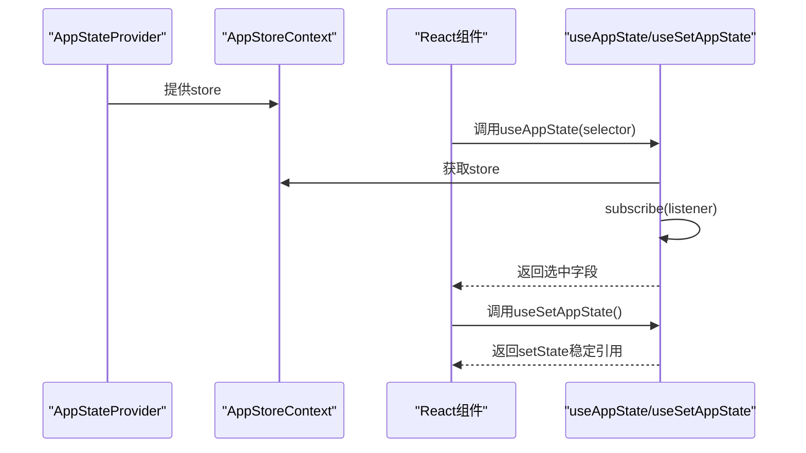
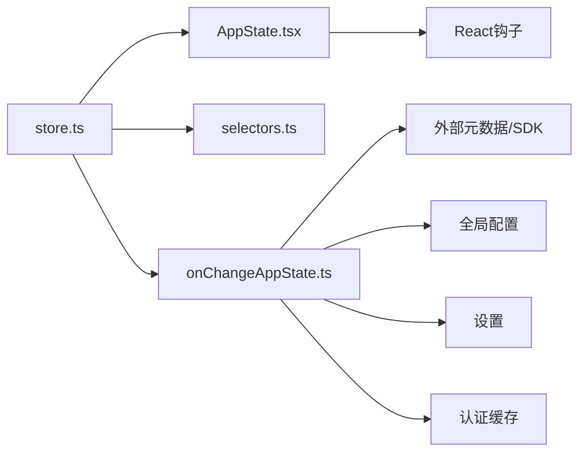

# 应用程序状态存储(AppStateStore)

<cite>
**本文档引用的文件**
- [AppStateStore.ts](file://src/state/AppStateStore.ts)
- [AppState.tsx](file://src/state/AppState.tsx)
- [store.ts](file://src/state/store.ts)
- [selectors.ts](file://src/state/selectors.ts)
- [onChangeAppState.ts](file://src/state/onChangeAppState.ts)
- [state.ts](file://src/bootstrap/state.ts)
- [main.tsx](file://src/main.tsx)
- [CompanionSprite.tsx](file://build-src/src/buddy/CompanionSprite.tsx)
- [bridge.tsx](file://build-src/src/commands/bridge/bridge.tsx)
</cite>

## 目录
1. [简介](#简介)
2. [项目结构](#项目结构)
3. [核心组件](#核心组件)
4. [架构总览](#架构总览)
5. [详细组件分析](#详细组件分析)
6. [依赖关系分析](#依赖关系分析)
7. [性能考量](#性能考量)
8. [故障排查指南](#故障排查指南)
9. [结论](#结论)
10. [附录](#附录)

## 简介
本文件面向Claude Code应用的状态管理子系统，系统性阐述AppStateStore的设计架构、状态管理模式、初始化流程、更新机制与持久化策略，并深入解析AppState数据结构（用户配置、工具权限、会话状态、系统设置等）在React组件中的集成方式与高效派生状态计算（selectors）。文档同时提供状态订阅机制、调试与性能优化的最佳实践，帮助开发者快速理解并正确使用该状态系统。

## 项目结构
AppStateStore位于src/state目录下，采用“类型定义 + 存储实现 + 订阅钩子 + 派生选择器 + 变更回调”的分层设计：
- 类型与默认状态：定义完整的AppState结构与getDefaultAppState
- 存储实现：通用Store接口与createStore工厂函数
- React集成：AppStateProvider、useAppState、useSetAppState等钩子
- 派生选择器：从AppState中提取派生状态，避免重复渲染
- 变更回调：onChangeAppState统一处理跨模块副作用（如外部元数据同步、全局配置持久化）

**图表来源**
- [AppStateStore.ts](file://src/state/AppStateStore.ts)
- [store.ts](file://src/state/store.ts)
- [onChangeAppState.ts](file://src/state/onChangeAppState.ts)
- [AppState.tsx](file://src/state/AppState.tsx)
- [selectors.ts](file://src/state/selectors.ts)
- [main.tsx](file://src/main.tsx)

**章节来源**
- [AppStateStore.ts](file://src/state/AppStateStore.ts)
- [store.ts](file://src/state/store.ts)
- [AppState.tsx](file://src/state/AppState.tsx)
- [onChangeAppState.ts](file://src/state/onChangeAppState.ts)
- [main.tsx](file://src/main.tsx)

## 核心组件
- AppState：完整应用状态的只读深拷贝类型，包含用户配置、工具权限、任务、插件、通知、提示建议、推测状态、桥接连接、团队上下文、文件历史、归因信息等。
- Store接口：getState、setState、subscribe三件套，支持变更监听与去重。
- AppStateProvider：在React应用根部注入状态存储，提供useAppState/useSetAppState/useAppStateStore等钩子。
- selectors：纯函数派生选择器，用于从AppState中提取稳定引用，避免不必要的重渲染。
- onChangeAppState：集中处理状态变更带来的副作用（如外部元数据同步、全局配置持久化、缓存清理等）。

**章节来源**
- [AppStateStore.ts](file://src/state/AppStateStore.ts)
- [store.ts](file://src/state/store.ts)
- [AppState.tsx](file://src/state/AppState.tsx)
- [selectors.ts](file://src/state/selectors.ts)
- [onChangeAppState.ts](file://src/state/onChangeAppState.ts)

## 架构总览
AppStateStore采用单向数据流与订阅驱动的架构：
- 初始化：main.tsx调用createStore(getDefaultAppState(), onChangeAppState)创建Store实例
- 更新：组件通过useSetAppState获取setState，以函数式更新保证并发安全
- 订阅：useAppState基于useSyncExternalStore订阅Store，仅在被选中的字段变化时触发重渲染
- 派生：selectors从AppState中提取稳定引用，避免对象新建导致的Object.is不相等
- 副作用：onChangeAppState统一处理外部元数据同步、全局配置持久化、认证缓存清理等

**图表来源**
- [AppState.tsx](file://src/state/AppState.tsx)
- [store.ts](file://src/state/store.ts)
- [onChangeAppState.ts](file://src/state/onChangeAppState.ts)

## 详细组件分析

### 组件A：AppState与默认状态
- 设计要点
  - 使用DeepImmutable确保状态不可变，避免意外修改
  - 将可变或函数类型的字段（如TaskState）排除在DeepImmutable之外
  - 默认状态通过getDefaultAppState统一生成，包含用户设置、桥接状态、插件状态、通知队列、提示建议、推测状态等
- 关键字段类别
  - 用户配置与系统设置：settings、verbose、mainLoopModel、mainLoopModelForSession、thinkingEnabled、promptSuggestionEnabled等
  - 工具权限：toolPermissionContext（含mode、bypass权限等）
  - 会话与桥接：remoteSessionUrl、remoteConnectionStatus、replBridge系列状态
  - 插件与MCP：plugins.enabled/disabled/commands/errors/installationStatus、mcp.clients/tools/commands/resources/pluginReconnectKey
  - 任务与团队：tasks、agentNameRegistry、foregroundedTaskId、viewingAgentTaskId、teamContext、standaloneAgentContext
  - 文件与归因：fileHistory、attribution
  - 通知与提示：notifications.queue/current、promptSuggestion、skillImprovement
  - 推测与性能：speculation/speculationSessionTimeSavedMs
  - 其他：inbox、workerSandboxPermissions、pendingWorkerRequest/pendingSandboxRequest、activeOverlays、fastMode、advisorModel、effortValue、ultraplan系列、permission callbacks等

```mermaid
classDiagram
class AppState {
+settings
+verbose
+mainLoopModel
+mainLoopModelForSession
+statusLineText
+expandedView
+isBriefOnly
+selectedIPAgentIndex
+coordinatorTaskIndex
+viewSelectionMode
+footerSelection
+toolPermissionContext
+spinnerTip
+agent
+kairosEnabled
+remoteSessionUrl
+remoteConnectionStatus
+remoteBackgroundTaskCount
+replBridgeEnabled
+replBridgeExplicit
+replBridgeOutboundOnly
+replBridgeConnected
+replBridgeSessionActive
+replBridgeReconnecting
+replBridgeConnectUrl
+replBridgeSessionUrl
+replBridgeEnvironmentId
+replBridgeSessionId
+replBridgeError
+replBridgeInitialName
+showRemoteCallout
+tasks
+agentNameRegistry
+foregroundedTaskId
+viewingAgentTaskId
+companionReaction
+companionPetAt
+mcp
+plugins
+agentDefinitions
+fileHistory
+attribution
+todos
+remoteAgentTaskSuggestions
+notifications
+elicitation
+thinkingEnabled
+promptSuggestionEnabled
+sessionHooks
+tungstenActiveSession
+tungstenLastCapturedTime
+tungstenLastCommand
+tungstenPanelVisible
+tungstenPanelAutoHidden
+bagelActive
+bagelUrl
+bagelPanelVisible
+computerUseMcpState
+replContext
+teamContext
+standaloneAgentContext
+inbox
+workerSandboxPermissions
+pendingWorkerRequest
+pendingSandboxRequest
+promptSuggestion
+speculation
+speculationSessionTimeSavedMs
+skillImprovement
+authVersion
+initialMessage
+pendingPlanVerification
+denialTracking
+activeOverlays
+fastMode
+advisorModel
+effortValue
+ultraplanLaunching
+ultraplanSessionUrl
+ultraplanPendingChoice
+ultraplanLaunchPending
+isUltraplanMode
+replBridgePermissionCallbacks
+channelPermissionCallbacks
}
```

**图表来源**
- [AppStateStore.ts](file://src/state/AppStateStore.ts)

**章节来源**
- [AppStateStore.ts](file://src/state/AppStateStore.ts)

### 组件B：Store与订阅机制
- Store接口
  - getState：返回当前状态快照
  - setState：函数式更新，自动去重（Object.is），触发onChange回调与订阅者
  - subscribe：注册/注销监听器
- 订阅钩子
  - useAppState(selector)：基于useSyncExternalStore订阅指定字段，仅当被选字段变化时重渲染
  - useSetAppState()：稳定引用的setState，避免组件因状态变化而重渲染
  - useAppStateStore()：直接获取Store实例（用于非React场景）
- 最佳实践
  - 不要在selector中返回新对象；应返回现有子引用，避免Object.is恒不相等
  - 多字段选择时多次调用useAppState，避免单次选择器返回复合对象

**图表来源**
- [AppState.tsx](file://src/state/AppState.tsx)
- [store.ts](file://src/state/store.ts)

**章节来源**
- [store.ts](file://src/state/store.ts)
- [AppState.tsx](file://src/state/AppState.tsx)

### 组件C：派生选择器（Selectors）
- 设计原则
  - 纯函数、无副作用，仅做数据提取
  - 返回稳定引用，避免不必要的重渲染
- 示例能力
  - getViewedTeammateTask：从viewingAgentTaskId与tasks中提取当前查看的同伴任务
  - getActiveAgentForInput：根据viewingAgentTaskId与tasks判断输入路由目标（leader/viewed/named_agent）

**图表来源**
- [selectors.ts](file://src/state/selectors.ts)

**章节来源**
- [selectors.ts](file://src/state/selectors.ts)

### 组件D：变更回调与持久化策略
- onChangeAppState职责
  - 权限模式同步：toolPermissionContext.mode变更时，对外部元数据与SDK通道进行同步
  - 主循环模型持久化：mainLoopModel变更时同步到用户设置与主循环覆盖
  - 视图偏好持久化：expandedView变更时同步到全局配置（showExpandedTodos/showSpinnerTree/verbose/tungstenPanelVisible）
  - 设置变更副作用：settings变更时清理认证相关缓存并重新应用环境变量
- 持久化范围
  - 全局配置：saveGlobalConfig写入本地配置
  - 设置：updateSettingsForSource写入用户设置
  - 缓存：clearApiKeyHelperCache/clearAwsCredentialsCache/clearGcpCredentialsCache

**图表来源**
- [onChangeAppState.ts](file://src/state/onChangeAppState.ts)

**章节来源**
- [onChangeAppState.ts](file://src/state/onChangeAppState.ts)

### 组件E：与React组件系统的集成
- AppStateProvider
  - 在应用根部注入Store上下文，提供<AppStoreContext.Provider value={store}>
  - 防止嵌套Provider
  - 在挂载时检查并禁用可能被远程设置覆盖的bypass权限模式
- 组件使用模式
  - 读取状态：const verbose = useAppState(s => s.verbose)
  - 更新状态：const setAppState = useSetAppState(); setAppState(prev => {...prev, verbose: !prev.verbose})
  - 非订阅更新：useSetAppState返回稳定引用，适合仅触发更新而不关心重渲染的场景
- 实际示例
  - CompanionSprite：订阅companionReaction/companionPetAt/footerSelection，配合定时器与useEffect清理
  - bridge.tsx：订阅replBridge系列状态，条件性弹窗与连接逻辑

**图表来源**
- [AppState.tsx](file://src/state/AppState.tsx)
- [CompanionSprite.tsx](file://build-src/src/buddy/CompanionSprite.tsx)
- [bridge.tsx](file://build-src/src/commands/bridge/bridge.tsx)

**章节来源**
- [AppState.tsx](file://src/state/AppState.tsx)
- [CompanionSprite.tsx](file://build-src/src/buddy/CompanionSprite.tsx)
- [bridge.tsx](file://build-src/src/commands/bridge/bridge.tsx)

## 依赖关系分析
- 组件耦合
  - AppStateStore.ts与store.ts低耦合：前者专注类型与默认状态，后者专注通用存储
  - AppState.tsx与store.ts高内聚：提供React集成与订阅钩子
  - selectors.ts与AppStateStore.ts弱耦合：仅依赖类型，不依赖具体实现
  - onChangeAppState.ts与各业务模块强耦合：负责跨模块副作用协调
- 外部依赖
  - React：useSyncExternalStore、useContext、useEffect等
  - 全局配置与设置：saveGlobalConfig、updateSettingsForSource等
  - 认证与环境变量：clear...Cache、applyConfigEnvironmentVariables等

**图表来源**
- [store.ts](file://src/state/store.ts)
- [AppState.tsx](file://src/state/AppState.tsx)
- [selectors.ts](file://src/state/selectors.ts)
- [onChangeAppState.ts](file://src/state/onChangeAppState.ts)

**章节来源**
- [store.ts](file://src/state/store.ts)
- [AppState.tsx](file://src/state/AppState.tsx)
- [selectors.ts](file://src/state/selectors.ts)
- [onChangeAppState.ts](file://src/state/onChangeAppState.ts)

## 性能考量
- 渲染优化
  - 使用useAppState按需订阅字段，避免整块状态重渲染
  - 在selector中返回现有子引用而非新建对象，减少Object.is不相等
  - 对于多字段选择，多次调用useAppState，避免单次选择器返回复合对象
- 并发与一致性
  - setState采用函数式更新，保证并发安全
  - onChangeAppState在变更后统一处理副作用，避免分散更新导致的竞态
- 内存与缓存
  - 认证相关缓存在设置变更时及时清理，避免陈旧数据影响
  - 全局配置持久化仅在必要时写入，减少磁盘IO

[本节为通用指导，无需特定文件来源]

## 故障排查指南
- 常见问题
  - 组件未响应状态变化：检查是否在selector中返回了新对象；确认useAppState的依赖项是否稳定
  - 状态更新无效：确认是否在AppStateProvider内部使用useSetAppState；避免在Provider外部调用
  - 外部元数据不同步：检查onChangeAppState中权限模式同步逻辑是否触发
  - 全局配置未持久化：确认onChangeAppState中对应字段的持久化分支是否执行
- 调试技巧
  - 在onChangeAppState中添加日志，观察变更前后字段差异
  - 使用useAppStateMaybeOutsideOfProvider在不确定上下文时安全访问状态
  - 利用selectors验证派生状态的正确性

**章节来源**
- [AppState.tsx](file://src/state/AppState.tsx)
- [onChangeAppState.ts](file://src/state/onChangeAppState.ts)

## 结论
AppStateStore通过清晰的分层设计与严格的订阅/派生模式，实现了可预测、可维护、高性能的应用状态管理。其与React的深度集成使得组件能够以最小代价订阅所需状态，同时通过onChangeAppState统一处理跨模块副作用，确保状态一致性与持久化策略的正确执行。遵循本文档的模式与最佳实践，可有效提升开发效率与系统稳定性。

[本节为总结，无需特定文件来源]

## 附录

### A. 状态初始化与入口集成
- main.tsx在应用启动时创建并注入AppStateProvider，确保全局状态可用
- getDefaultAppState集中定义初始状态，便于测试与复用

**章节来源**
- [main.tsx](file://src/main.tsx)
- [AppStateStore.ts](file://src/state/AppStateStore.ts)

### B. 状态订阅与更新示例路径
- 读取状态：[CompanionSprite.tsx](file://build-src/src/buddy/CompanionSprite.tsx)
- 更新状态：[bridge.tsx](file://build-src/src/commands/bridge/bridge.tsx)
- 订阅钩子：[AppState.tsx](file://src/state/AppState.tsx)

**章节来源**
- [CompanionSprite.tsx](file://build-src/src/buddy/CompanionSprite.tsx)
- [bridge.tsx](file://build-src/src/commands/bridge/bridge.tsx)
- [AppState.tsx](file://src/state/AppState.tsx)