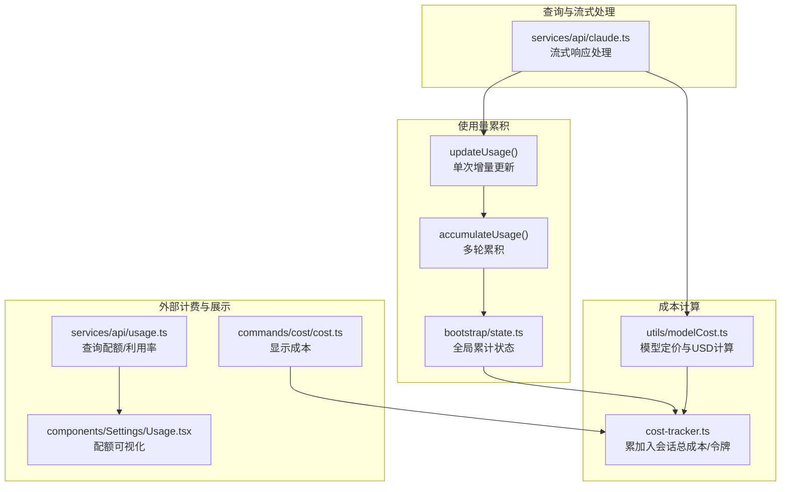
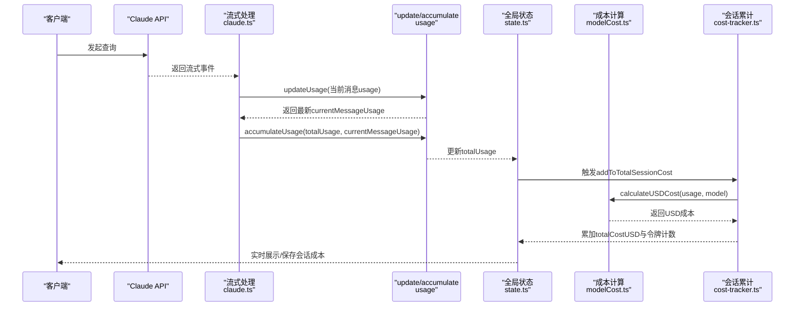
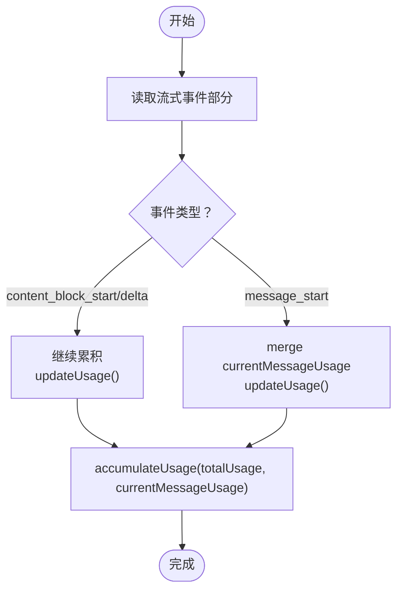
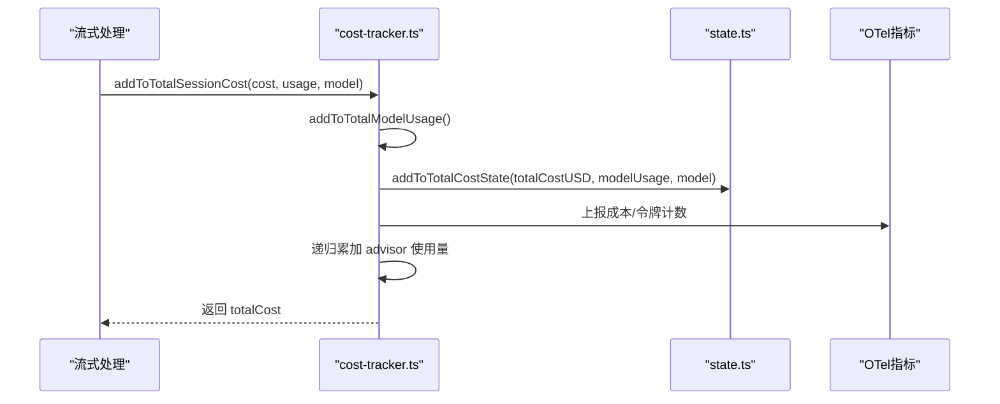
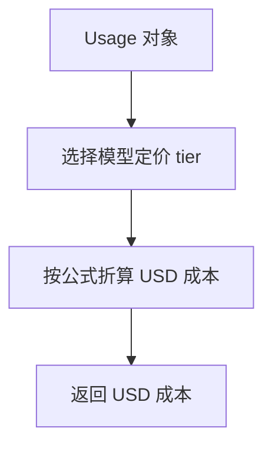
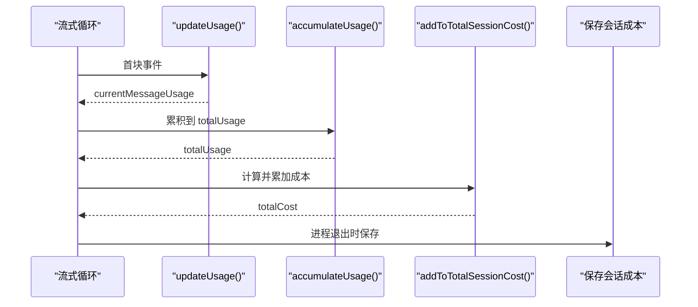
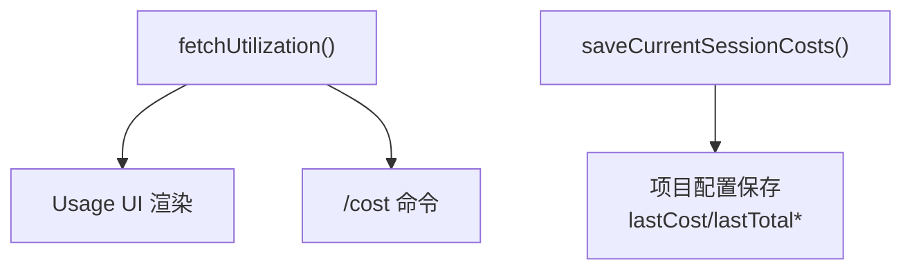
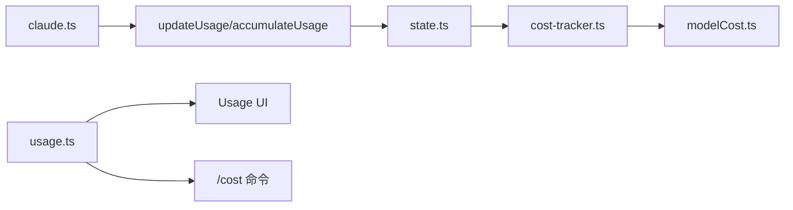

# 使用量统计

<cite>
**本文引用的文件**
- [src/cost-tracker.ts](file://src/cost-tracker.ts)
- [src/costHook.ts](file://src/costHook.ts)
- [src/bootstrap/state.ts](file://src/bootstrap/state.ts)
- [src/utils/modelCost.ts](file://src/utils/modelCost.ts)
- [src/services/api/usage.ts](file://src/services/api/usage.ts)
- [src/services/api/claude.ts](file://src/services/api/claude.ts)
- [src/commands/cost/cost.ts](file://src/commands/cost/cost.ts)
- [src/commands/extra-usage/extra-usage-core.ts](file://src/commands/extra-usage/extra-usage-core.ts)
- [src/utils/tokens.ts](file://src/utils/tokens.ts)
- [src/utils/contextAnalysis.ts](file://src/utils/contextAnalysis.ts)
- [src/utils/attachments.ts](file://src/utils/attachments.ts)
- [src/components/Settings/Usage.tsx](file://src/components/Settings/Usage.tsx)
- [src/services/rateLimitMessages.ts](file://src/services/rateLimitMessages.ts)
- [src/components/messages/RateLimitMessage.tsx](file://src/components/messages/RateLimitMessage.tsx)
</cite>

## 目录
1. [简介](#简介)
2. [项目结构](#项目结构)
3. [核心组件](#核心组件)
4. [架构总览](#架构总览)
5. [详细组件分析](#详细组件分析)
6. [依赖关系分析](#依赖关系分析)
7. [性能考量](#性能考量)
8. [故障排查指南](#故障排查指南)
9. [结论](#结论)
10. [附录](#附录)

## 简介
本文件系统性阐述 Claude Code 查询引擎的使用量统计机制，重点覆盖以下方面：
- currentMessageUsage 与 totalUsage 的管理方式：如何在消息流中增量累积令牌消耗、缓存读写、工具请求等指标，并进行成本计算。
- updateUsage 与 accumulateUsage 的工作原理：增量更新策略、字段合并规则、错误处理与数据一致性保障。
- 实时更新机制：流式响应的使用量追踪、批量更新策略与会话持久化。
- 成本估算与计费集成：基于模型定价的 USD 成本计算、与外部计费系统的对接与数据导出能力。

## 项目结构
围绕使用量统计的关键模块分布如下：
- 状态与度量：bootstrap/state.ts 提供全局累计状态（总成本、输入/输出令牌、缓存读写、工具请求次数等）。
- 成本计算：utils/modelCost.ts 定义模型定价与 USD 成本计算；cost-tracker.ts 负责将单次用量累加到会话总用量并上报指标。
- 流式处理：services/api/claude.ts 在流式响应中实时更新 usage 并累积到 totalUsage。
- 命令与界面：commands/cost/cost.ts 展示当前会话成本；components/Settings/Usage.tsx 与 services/api/usage.ts 提供外部计费/配额可视化与查询。
- 工具调用与附件：utils/contextAnalysis.ts、utils/attachments.ts 将工具调用与令牌预算/预算余额以附件形式呈现。

**图表来源**
- [src/services/api/claude.ts:1900-2100](file://src/services/api/claude.ts#L1900-L2100)
- [src/services/api/claude.ts:2993-3038](file://src/services/api/claude.ts#L2993-L3038)
- [src/bootstrap/state.ts:543-751](file://src/bootstrap/state.ts#L543-L751)
- [src/utils/modelCost.ts:128-180](file://src/utils/modelCost.ts#L128-L180)
- [src/cost-tracker.ts:278-323](file://src/cost-tracker.ts#L278-L323)
- [src/services/api/usage.ts:33-63](file://src/services/api/usage.ts#L33-L63)
- [src/commands/cost/cost.ts:6-24](file://src/commands/cost/cost.ts#L6-L24)
- [src/components/Settings/Usage.tsx:174-265](file://src/components/Settings/Usage.tsx#L174-L265)

**章节来源**
- [src/services/api/claude.ts:1900-2100](file://src/services/api/claude.ts#L1900-L2100)
- [src/bootstrap/state.ts:543-751](file://src/bootstrap/state.ts#L543-L751)
- [src/utils/modelCost.ts:128-180](file://src/utils/modelCost.ts#L128-L180)
- [src/cost-tracker.ts:278-323](file://src/cost-tracker.ts#L278-L323)
- [src/services/api/usage.ts:33-63](file://src/services/api/usage.ts#L33-L63)
- [src/commands/cost/cost.ts:6-24](file://src/commands/cost/cost.ts#L6-L24)
- [src/components/Settings/Usage.tsx:174-265](file://src/components/Settings/Usage.tsx#L174-L265)

## 核心组件
- 全局累计状态（bootstrap/state.ts）
  - 维护 totalCostUSD、totalAPIDuration、turn/分类器/工具耗时、总输入/输出/缓存读写令牌、工具请求次数、未知模型标记等。
  - 提供 addToTotalCostState、getTotalCostUSD、getTotalInputTokens、getTotalOutputTokens 等读写接口。
- 成本跟踪（cost-tracker.ts）
  - 将单次 Usage 累加到会话总用量 addToTotalSessionCost，并上报 OpenTelemetry 指标（成本、令牌类型计数）。
  - 计算模型级使用量 addToTotalModelUsage，支持按快/慢模式与模型维度汇总。
- 模型定价（utils/modelCost.ts）
  - 定义各模型的输入/输出/缓存读写/搜索请求单价，提供 calculateUSDCost 与 calculateCostFromTokens。
- 流式处理（services/api/claude.ts）
  - 在 content_block_start/delta 等阶段调用 updateUsage 累积当前消息用量；通过 accumulateUsage 将多轮用量合并到 totalUsage。
- 外部计费（services/api/usage.ts 与 commands/extra-usage/extra-usage-core.ts）
  - 查询订阅配额/利用率；团队/企业场景下提供“额外用量”申请流程与 UI 展示。

**章节来源**
- [src/bootstrap/state.ts:543-751](file://src/bootstrap/state.ts#L543-L751)
- [src/cost-tracker.ts:278-323](file://src/cost-tracker.ts#L278-L323)
- [src/utils/modelCost.ts:128-180](file://src/utils/modelCost.ts#L128-L180)
- [src/services/api/claude.ts:2993-3038](file://src/services/api/claude.ts#L2993-L3038)
- [src/services/api/usage.ts:33-63](file://src/services/api/usage.ts#L33-L63)
- [src/commands/extra-usage/extra-usage-core.ts:18-119](file://src/commands/extra-usage/extra-usage-core.ts#L18-L119)

## 架构总览
使用量统计贯穿“流式接收—增量更新—累计—成本计算—指标上报—外部计费”的完整链路。

**图表来源**
- [src/services/api/claude.ts:1979-2100](file://src/services/api/claude.ts#L1979-L2100)
- [src/services/api/claude.ts:2993-3038](file://src/services/api/claude.ts#L2993-L3038)
- [src/bootstrap/state.ts:557-564](file://src/bootstrap/state.ts#L557-L564)
- [src/utils/modelCost.ts:177-180](file://src/utils/modelCost.ts#L177-L180)
- [src/cost-tracker.ts:278-323](file://src/cost-tracker.ts#L278-L323)

## 详细组件分析

### 使用量增量更新：updateUsage 与 accumulateUsage
- updateUsage
  - 作用：将单个消息块的 usage 合并到当前消息的 currentMessageUsage，保留最近的服务层字段（如 service_tier、inference_geo、iterations、speed）。
  - 关键点：对嵌套对象（如 server_tool_use、cache_creation）进行逐字段累加；根据特性开关决定是否包含 cache_deleted_input_tokens。
- accumulateUsage
  - 作用：将当前消息的 usage 累积到 totalUsage，用于跨轮对话的累计统计。
  - 关键点：对数值字段执行加法；对嵌套对象（web_search_requests/web_fetch_requests/ephemeral_*）分别累加；保留最新值的非累加字段（service_tier、inference_geo、iterations、speed）。

**图表来源**
- [src/services/api/claude.ts:1979-2100](file://src/services/api/claude.ts#L1979-L2100)
- [src/services/api/claude.ts:2993-3038](file://src/services/api/claude.ts#L2993-L3038)

**章节来源**
- [src/services/api/claude.ts:2993-3038](file://src/services/api/claude.ts#L2993-L3038)

### 会话级累计与成本计算：addToTotalSessionCost
- 累计模型级用量 addToTotalModelUsage：按模型聚合 input/output/cache 读写/创建、web_search_requests，并记录上下文窗口与最大输出令牌。
- 累计会话总成本 addToTotalSessionCost：
  - 将单次成本累加到 totalCostUSD；
  - 上报 OpenTelemetry 指标：成本、输入/输出/缓存读写令牌计数；
  - 支持 advisor 工具的递归累加，生成 tengu_advisor_tool_token_usage 事件；
  - 返回本次累加后的总成本（含 advisor 成本）。

**图表来源**
- [src/cost-tracker.ts:278-323](file://src/cost-tracker.ts#L278-L323)
- [src/bootstrap/state.ts:557-564](file://src/bootstrap/state.ts#L557-L564)

**章节来源**
- [src/cost-tracker.ts:278-323](file://src/cost-tracker.ts#L278-L323)
- [src/bootstrap/state.ts:557-564](file://src/bootstrap/state.ts#L557-L564)

### 成本计算：模型定价与 USD 估算
- 模型定价：定义各模型的输入/输出/缓存读写/搜索请求单价；Opus 4.6 在快模式下采用更高单价。
- USD 成本计算：基于 usage 的 input_tokens/output_tokens/cache_* 与 web_search_requests，按每百万令牌折算。
- 辅助函数：calculateCostFromTokens 可直接从原始令牌计数估算成本，便于独立任务或侧向查询。

**图表来源**
- [src/utils/modelCost.ts:128-180](file://src/utils/modelCost.ts#L128-L180)

**章节来源**
- [src/utils/modelCost.ts:128-180](file://src/utils/modelCost.ts#L128-L180)

### 流式响应中的实时更新机制
- 流式事件处理：在 content_block_start 初始化内容块，在 content_block_delta 累积文本/思考/工具输入等增量；期间持续调用 updateUsage 与 accumulateUsage。
- 空闲检测与超时：设置空闲计时器与警告阈值，避免长时间无事件导致阻塞；异常路径清理资源。
- 会话持久化：退出时通过 useCostSummary 保存当前会话成本至项目配置，以便恢复。

**图表来源**
- [src/services/api/claude.ts:1940-2100](file://src/services/api/claude.ts#L1940-L2100)
- [src/services/api/claude.ts:2993-3038](file://src/services/api/claude.ts#L2993-L3038)
- [src/cost-tracker.ts:278-323](file://src/cost-tracker.ts#L278-L323)
- [src/costHook.ts:6-22](file://src/costHook.ts#L6-L22)

**章节来源**
- [src/services/api/claude.ts:1940-2100](file://src/services/api/claude.ts#L1940-L2100)
- [src/costHook.ts:6-22](file://src/costHook.ts#L6-L22)

### 工具调用的使用量计算与成本估算
- 工具调用统计：工具请求计数（如 web_search_requests）在 usage.server_tool_use 中体现；工具输入长度可用于分析附件统计。
- 附件与预算：当启用 TOKEN_BUDGET 特性时，输出令牌使用与剩余预算以附件形式呈现；同时可显示会话总输出令牌与上下文窗口使用情况。
- 成本估算：结合模型定价与工具请求次数，估算本次工具调用的成本贡献。

**章节来源**
- [src/utils/contextAnalysis.ts:169-216](file://src/utils/contextAnalysis.ts#L169-L216)
- [src/utils/attachments.ts:3807-3862](file://src/utils/attachments.ts#L3807-L3862)
- [src/utils/modelCost.ts:128-180](file://src/utils/modelCost.ts#L128-L180)

### 计费系统集成与数据导出
- 外部计费查询：通过 fetchUtilization 获取订阅计划的配额/利用率信息，支持五小时/七日/特定模型限额与“额外用量”状态。
- UI 展示：Usage 页面渲染配额条形图与额外用量信息；命令 /cost 显示当前使用来源（订阅/超支）。
- 数据导出：会话结束时保存 lastCost/lastAPIDuration/lastTotal* 等字段到项目配置，便于后续审计与导出。

**图表来源**
- [src/services/api/usage.ts:33-63](file://src/services/api/usage.ts#L33-L63)
- [src/components/Settings/Usage.tsx:174-265](file://src/components/Settings/Usage.tsx#L174-L265)
- [src/commands/cost/cost.ts:6-24](file://src/commands/cost/cost.ts#L6-L24)
- [src/cost-tracker.ts:143-175](file://src/cost-tracker.ts#L143-L175)

**章节来源**
- [src/services/api/usage.ts:33-63](file://src/services/api/usage.ts#L33-L63)
- [src/components/Settings/Usage.tsx:174-265](file://src/components/Settings/Usage.tsx#L174-L265)
- [src/commands/cost/cost.ts:6-24](file://src/commands/cost/cost.ts#L6-L24)
- [src/cost-tracker.ts:143-175](file://src/cost-tracker.ts#L143-L175)

## 依赖关系分析
- 组件耦合
  - 流式处理依赖 updateUsage/accumulateUsage 与全局状态；成本计算依赖模型定价；会话累计依赖 OpenTelemetry 指标与状态写入。
- 关键依赖链
  - 流式事件 → updateUsage → accumulateUsage → addToTotalSessionCost → addToTotalCostState → 指标上报。
- 外部依赖
  - 计费系统：通过 OAuth 与 Claude AI API 获取配额/利用率；UI 与命令行展示与交互。

**图表来源**
- [src/services/api/claude.ts:2993-3038](file://src/services/api/claude.ts#L2993-L3038)
- [src/bootstrap/state.ts:557-564](file://src/bootstrap/state.ts#L557-L564)
- [src/cost-tracker.ts:278-323](file://src/cost-tracker.ts#L278-L323)
- [src/utils/modelCost.ts:128-180](file://src/utils/modelCost.ts#L128-L180)
- [src/services/api/usage.ts:33-63](file://src/services/api/usage.ts#L33-L63)
- [src/components/Settings/Usage.tsx:174-265](file://src/components/Settings/Usage.tsx#L174-L265)
- [src/commands/cost/cost.ts:6-24](file://src/commands/cost/cost.ts#L6-L24)

**章节来源**
- [src/services/api/claude.ts:2993-3038](file://src/services/api/claude.ts#L2993-L3038)
- [src/bootstrap/state.ts:557-564](file://src/bootstrap/state.ts#L557-L564)
- [src/cost-tracker.ts:278-323](file://src/cost-tracker.ts#L278-L323)
- [src/utils/modelCost.ts:128-180](file://src/utils/modelCost.ts#L128-L180)
- [src/services/api/usage.ts:33-63](file://src/services/api/usage.ts#L33-L63)
- [src/components/Settings/Usage.tsx:174-265](file://src/components/Settings/Usage.tsx#L174-L265)
- [src/commands/cost/cost.ts:6-24](file://src/commands/cost/cost.ts#L6-L24)

## 性能考量
- 流式空闲检测：通过定时器与阈值避免长时间无事件导致的阻塞，降低内存与 CPU 占用。
- 指标上报：OTel 指标按属性分组（模型/速度），减少重复计算与冗余上报。
- 令牌预算：通过输出令牌预算与剩余提示，帮助用户在会话内进行成本控制，避免不必要的超支。

[本节为通用指导，不直接分析具体文件]

## 故障排查指南
- 流式空闲/卡顿
  - 现象：长时间无事件或偶发 stall。
  - 排查：检查流式空闲计时器与警告阈值；查看 tengu_streaming_idle_timeout 与 tengu_streaming_stall 事件日志。
- 未知模型成本
  - 现象：显示成本可能不准确。
  - 排查：检查 hasUnknownModelCost 标记与 tengu_unknown_model_cost 事件；确认模型定价表是否包含该模型。
- 外部计费不可用
  - 现象：/usage 无法显示配额或 /extra-usage 无法提交申请。
  - 排查：确认 isOAuthTokenExpired 与 hasProfileScope；检查 fetchUtilization 返回值与网络权限。

**章节来源**
- [src/services/api/claude.ts:1900-2100](file://src/services/api/claude.ts#L1900-L2100)
- [src/utils/modelCost.ts:166-173](file://src/utils/modelCost.ts#L166-L173)
- [src/services/api/usage.ts:33-63](file://src/services/api/usage.ts#L33-L63)

## 结论
Claude Code 的使用量统计以“流式增量—会话累计—成本计算—指标上报—外部计费”为主线，实现了对令牌消耗、缓存读写、工具请求与成本的精细化追踪。通过 updateUsage 与 accumulateUsage 的清晰职责划分，配合 OpenTelemetry 指标与项目配置持久化，既满足实时展示需求，也为后续审计与导出提供了可靠基础。

## 附录
- 令牌预算解析：parseTokenBudget 支持多种格式的预算表达，便于在提示中自动识别预算上限。
- 令牌统计：tokenCountFromLastAPIResponse 与 getTokenCountFromUsage 提供从消息与 usage 中提取上下文窗口的能力。
- 会话成本展示：/cost 命令与 Usage UI 提供订阅/超支状态与配额可视化。

**章节来源**
- [src/utils/tokenBudget.ts:21-29](file://src/utils/tokenBudget.ts#L21-L29)
- [src/utils/tokens.ts:39-66](file://src/utils/tokens.ts#L39-L66)
- [src/commands/cost/cost.ts:6-24](file://src/commands/cost/cost.ts#L6-L24)
- [src/components/Settings/Usage.tsx:174-265](file://src/components/Settings/Usage.tsx#L174-L265)