# 权限验证机制

<cite>
**本文档引用的文件**
- [permissions.ts](file://src/utils/permissions/permissions.ts)
- [useCanUseTool.tsx](file://src/hooks/useCanUseTool.tsx)
- [permissionLogging.ts](file://src/hooks/toolPermission/permissionLogging.ts)
- [interactiveHandler.ts](file://src/hooks/toolPermission/handlers/interactiveHandler.ts)
- [PermissionContext.ts](file://src/hooks/toolPermission/PermissionContext.ts)
- [denialTracking.ts](file://src/utils/permissions/denialTracking.ts)
- [permissionsLoader.ts](file://src/utils/permissions/permissionsLoader.ts)
- [PermissionUpdate.ts](file://src/utils/permissions/PermissionUpdate.ts)
- [PermissionRule.ts](file://src/utils/permissions/PermissionRule.ts)
- [yoloClassifier.ts](file://src/utils/permissions/yoloClassifier.ts)
- [bridgePermissionCallbacks.ts](file://src/bridge/bridgePermissionCallbacks.ts)
- [structuredIO.ts](file://src/cli/structuredIO.ts)
- [print.ts](file://src/cli/print.ts)
</cite>

## 目录
1. [简介](#简介)
2. [项目结构](#项目结构)
3. [核心组件](#核心组件)
4. [架构概览](#架构概览)
5. [详细组件分析](#详细组件分析)
6. [依赖关系分析](#依赖关系分析)
7. [性能考虑](#性能考虑)
8. [故障排除指南](#故障排除指南)
9. [结论](#结论)

## 简介

Claude Code 查询引擎的权限验证机制是一个复杂的多层安全控制系统，旨在保护用户免受潜在危险操作的影响。该机制通过规则驱动的权限检查、智能分类器决策、交互式确认流程和持久化更新等特性，为工具调用、文件系统访问和网络请求提供了全面的安全保障。

该系统支持三种主要权限模式：自动模式（auto）、交互模式（interactive）和强制决策模式（force decision），每种模式都有其特定的使用场景和安全级别。权限验证不仅保护用户免受恶意操作的影响，还确保了工具使用的合规性和安全性。

## 项目结构

权限验证机制在项目中分布于多个关键目录中：

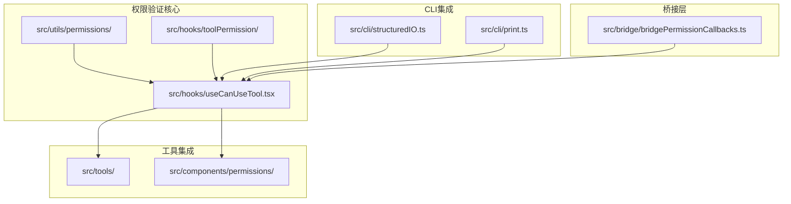

**图表来源**
- [permissions.ts:1-1487](file://src/utils/permissions/permissions.ts#L1-1487)
- [useCanUseTool.tsx:1-204](file://src/hooks/useCanUseTool.tsx#L1-204)

**章节来源**
- [permissions.ts:1-1487](file://src/utils/permissions/permissions.ts#L1-1487)
- [useCanUseTool.tsx:1-204](file://src/hooks/useCanUseTool.tsx#L1-204)

## 核心组件

### 权限检查管道

权限验证系统的核心是 `hasPermissionsToUseTool` 函数，它实现了完整的权限检查流程：

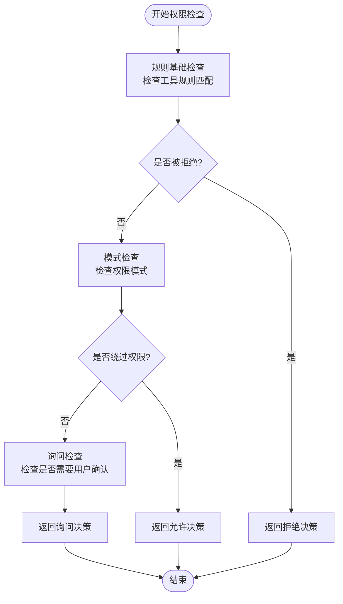

**图表来源**
- [permissions.ts:473-800](file://src/utils/permissions/permissions.ts#L473-800)

### 决策记录系统

系统实现了完整的决策记录和追踪机制：

| 决策类型 | 描述 | 记录内容 |
|---------|------|----------|
| 允许 (Allow) | 工具调用被授权 | 包含决策原因、输入更新、权限更新 |
| 拒绝 (Deny) | 工具调用被阻止 | 包含拒绝原因、消息内容 |
| 询问 (Ask) | 需要用户确认 | 包含描述、建议的权限更新 |

**章节来源**
- [permissionLogging.ts:1-239](file://src/hooks/toolPermission/permissionLogging.ts#L1-239)
- [permissions.ts:137-211](file://src/utils/permissions/permissions.ts#L137-211)

## 架构概览

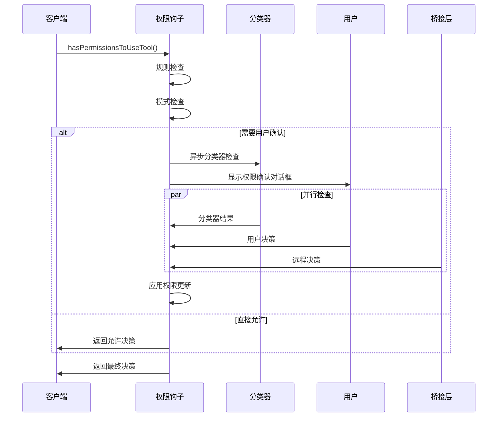

**图表来源**
- [useCanUseTool.tsx:32-183](file://src/hooks/useCanUseTool.tsx#L32-183)
- [interactiveHandler.ts:57-537](file://src/hooks/toolPermission/handlers/interactiveHandler.ts#L57-537)

## 详细组件分析

### wrappedCanUseTool 函数实现

虽然代码库中没有直接名为 `wrappedCanUseTool` 的函数，但 `hasPermissionsToUseTool` 函数承担了相同的核心职责：

#### 权限检查流程

1. **规则基础检查**：检查工具是否符合预定义的权限规则
2. **模式转换检查**：根据当前权限模式进行相应的转换
3. **自动模式分类器**：在自动模式下使用AI分类器进行决策
4. **交互式确认**：当需要时显示用户确认界面
5. **权限更新应用**：应用用户做出的权限决策

#### 决策记录和追踪

系统实现了多层次的决策记录机制：

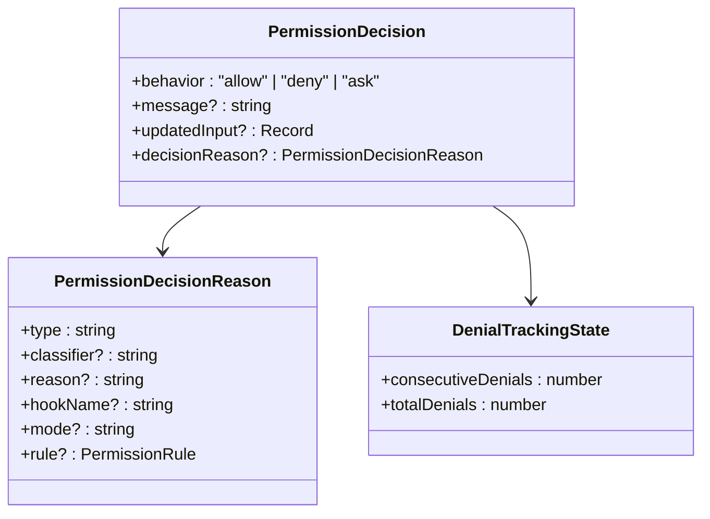

**图表来源**
- [PermissionResult.ts:1-36](file://src/utils/permissions/PermissionResult.ts#L1-36)
- [denialTracking.ts:7-46](file://src/utils/permissions/denialTracking.ts#L7-46)

**章节来源**
- [permissions.ts:473-800](file://src/utils/permissions/permissions.ts#L473-800)

### 权限验证在消息处理过程中的关键节点

#### 工具调用权限验证

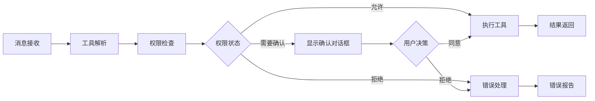

**图表来源**
- [useCanUseTool.tsx:32-183](file://src/hooks/useCanUseTool.tsx#L32-183)

#### 文件系统访问权限验证

文件系统权限验证通过以下机制实现：

1. **路径规范化**：将所有文件路径转换为POSIX格式
2. **工作目录限制**：基于配置的工作目录白名单
3. **权限规则匹配**：检查文件操作是否符合权限规则
4. **沙箱隔离**：在沙箱环境中执行潜在危险操作

#### 网络请求权限验证

网络请求权限验证包括：

1. **URL模式匹配**：检查目标URL是否符合允许的模式
2. **代理服务器验证**：验证代理服务器配置的有效性
3. **请求头过滤**：过滤可能包含敏感信息的请求头
4. **速率限制检查**：防止滥用和过度请求

**章节来源**
- [PermissionUpdate.ts:361-390](file://src/utils/permissions/PermissionUpdate.ts#L361-390)

### 权限决策的缓存策略和性能优化

#### 缓存策略

系统采用了多层次的缓存策略来提高性能：

1. **分类器结果缓存**：缓存分类器的决策结果以避免重复计算
2. **规则匹配缓存**：缓存规则匹配结果以减少重复检查
3. **权限上下文缓存**：缓存权限上下文以避免重复加载
4. **会话级缓存**：在单个会话期间缓存权限决策

#### 性能优化措施

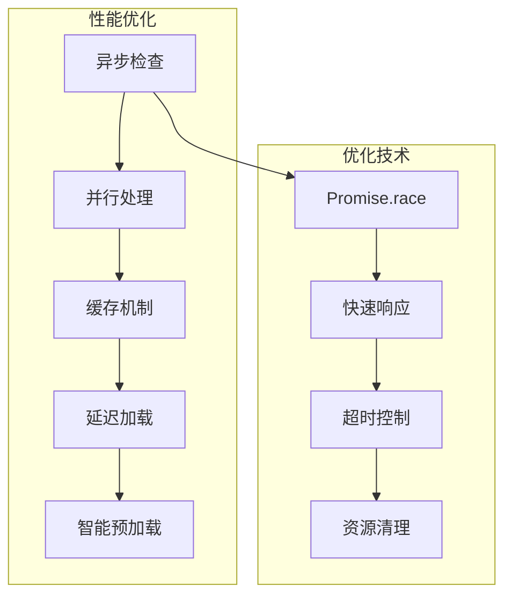

**图表来源**
- [structuredIO.ts:533-859](file://src/cli/structuredIO.ts#L533-859)
- [interactiveHandler.ts:410-431](file://src/hooks/toolPermission/handlers/interactiveHandler.ts#L410-431)

**章节来源**
- [yoloClassifier.ts:711-800](file://src/utils/permissions/yoloClassifier.ts#L711-800)

### 不同类型权限请求的处理方式

#### 自动模式 (Auto Mode)

自动模式通过AI分类器进行决策：

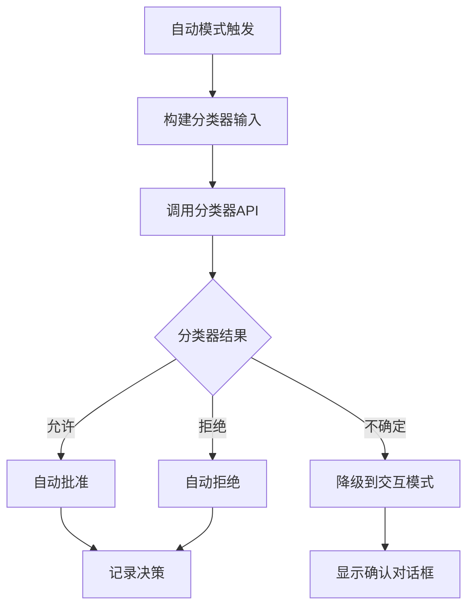

#### 交互模式 (Interactive Mode)

交互模式要求用户明确确认：

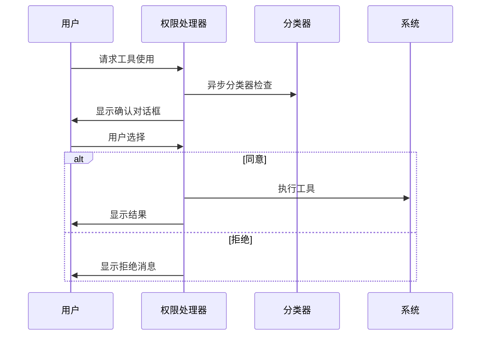

#### 强制决策模式 (Force Decision Mode)

强制决策模式绕过用户交互：

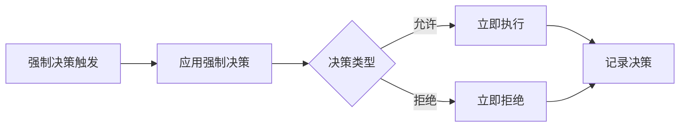

**章节来源**
- [structuredIO.ts:533-859](file://src/cli/structuredIO.ts#L533-859)
- [print.ts:4142-4263](file://src/cli/print.ts#L4142-4263)

### 权限验证失败时的错误处理和用户反馈

#### 错误处理机制

系统实现了多层次的错误处理：

1. **分类器错误处理**：捕获和处理分类器API调用错误
2. **权限规则错误处理**：处理权限规则解析和应用错误
3. **用户交互错误处理**：处理用户取消和中断操作
4. **系统级错误处理**：处理底层系统调用失败

#### 用户反馈机制

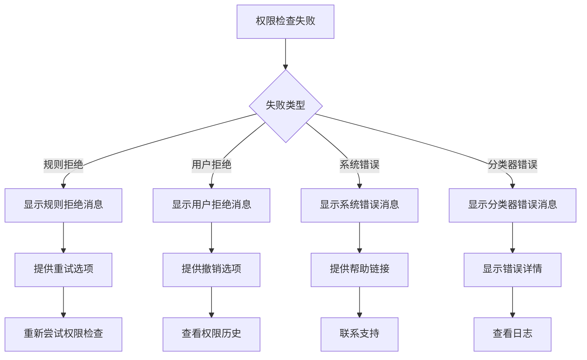

**图表来源**
- [permissionLogging.ts:107-176](file://src/hooks/toolPermission/permissionLogging.ts#L107-176)

**章节来源**
- [PermissionContext.ts:148-173](file://src/hooks/toolPermission/PermissionContext.ts#L148-173)

## 依赖关系分析

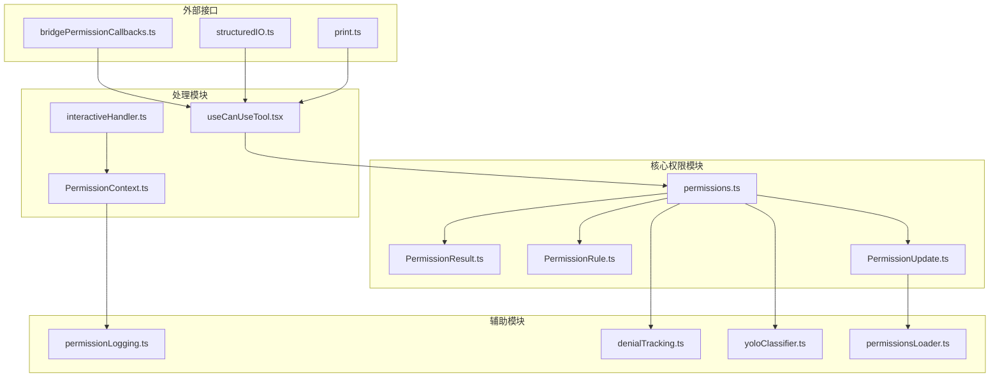

**图表来源**
- [permissions.ts:1-1487](file://src/utils/permissions/permissions.ts#L1-1487)
- [useCanUseTool.tsx:1-204](file://src/hooks/useCanUseTool.tsx#L1-204)

**章节来源**
- [permissions.ts:1-1487](file://src/utils/permissions/permissions.ts#L1-1487)
- [useCanUseTool.tsx:1-204](file://src/hooks/useCanUseTool.tsx#L1-204)

## 性能考虑

### 决策缓存策略

系统实现了智能的决策缓存机制：

1. **会话级缓存**：在单个会话期间缓存权限决策
2. **规则匹配缓存**：缓存规则匹配结果以避免重复计算
3. **分类器结果缓存**：缓存分类器的决策结果
4. **权限上下文缓存**：缓存权限上下文状态

### 异步处理优化

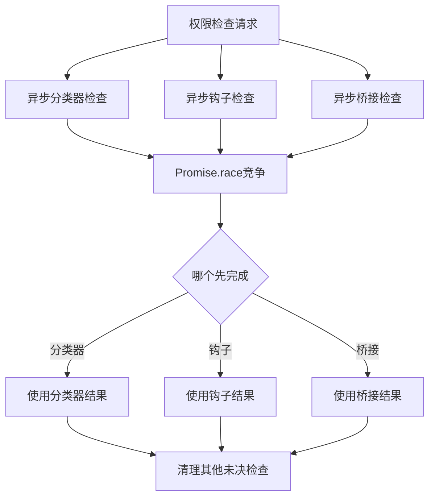

**图表来源**
- [structuredIO.ts:561-566](file://src/cli/structuredIO.ts#L561-566)

### 资源管理优化

系统采用了多种资源管理优化策略：

1. **内存管理**：及时清理未使用的权限检查结果
2. **网络资源**：优化API调用频率和批量处理
3. **CPU资源**：使用异步处理避免阻塞主线程
4. **存储资源**：智能清理过期的权限决策记录

## 故障排除指南

### 常见问题诊断

#### 权限检查失败

**症状**：工具调用被意外拒绝

**诊断步骤**：
1. 检查权限规则配置
2. 验证用户权限设置
3. 查看权限决策日志
4. 确认分类器可用性

#### 分类器响应异常

**症状**：自动模式决策不准确或超时

**诊断步骤**：
1. 检查网络连接状态
2. 验证API密钥有效性
3. 查看分类器错误日志
4. 测试本地分类器服务

#### 用户交互问题

**症状**：权限确认对话框无法正常显示

**诊断步骤**：
1. 检查UI渲染状态
2. 验证事件监听器
3. 查看桥接连接状态
4. 确认用户权限

### 错误恢复策略

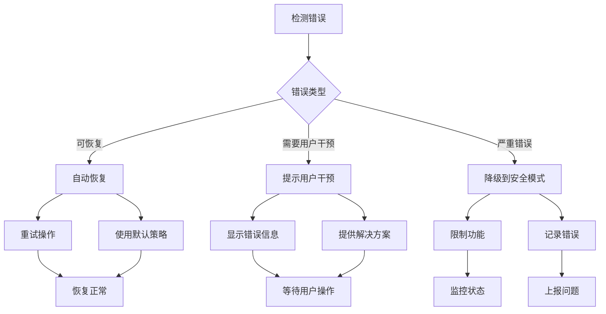

**章节来源**
- [PermissionContext.ts:148-173](file://src/hooks/toolPermission/PermissionContext.ts#L148-173)
- [interactiveHandler.ts:524-530](file://src/hooks/toolPermission/handlers/interactiveHandler.ts#L524-530)

## 结论

Claude Code 查询引擎的权限验证机制是一个设计精良、功能全面的安全系统。它通过多层次的权限检查、智能的决策机制和完善的错误处理，为工具使用提供了强大的安全保障。

该系统的成功之处在于：

1. **灵活性**：支持多种权限模式以适应不同的使用场景
2. **安全性**：通过规则检查、分类器决策和用户确认确保操作安全
3. **性能**：采用缓存、异步处理和资源优化技术保证系统响应速度
4. **可观测性**：完整的决策记录和日志系统便于问题诊断和审计
5. **可扩展性**：模块化的架构设计便于功能扩展和维护

通过持续的优化和改进，这个权限验证系统能够为用户提供既安全又高效的工具使用体验。