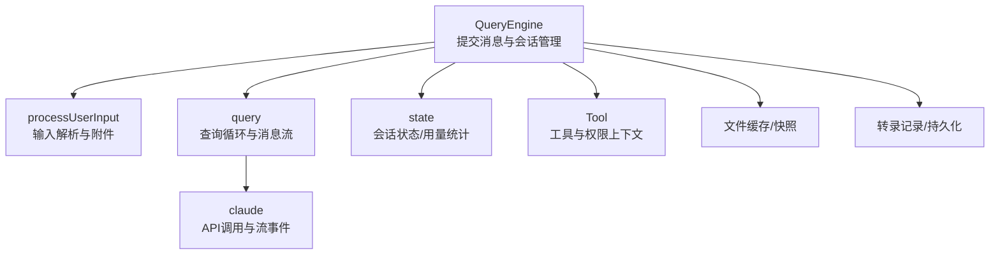
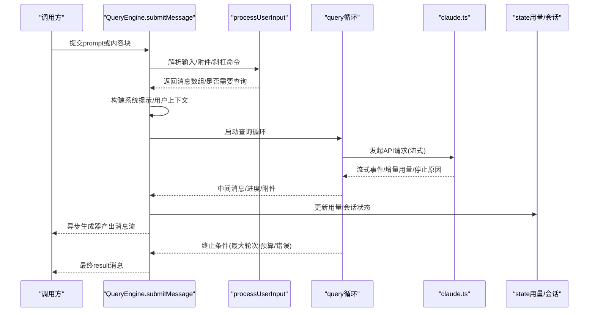
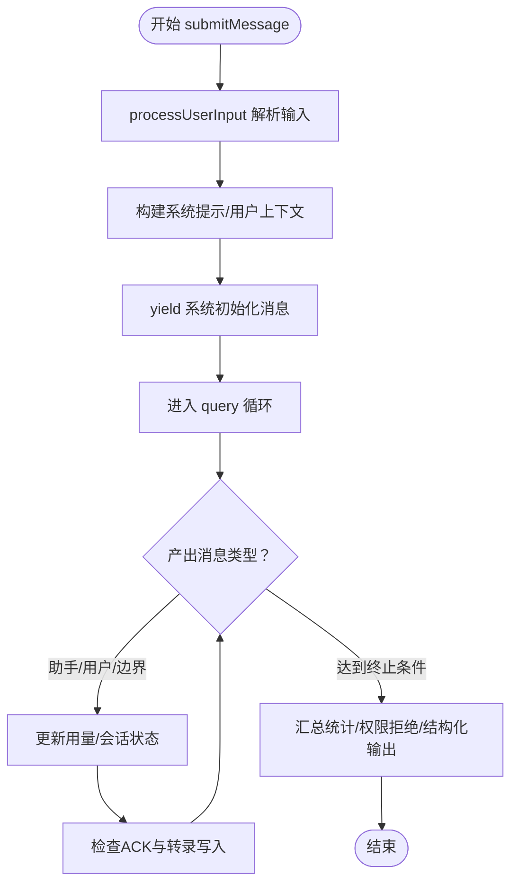
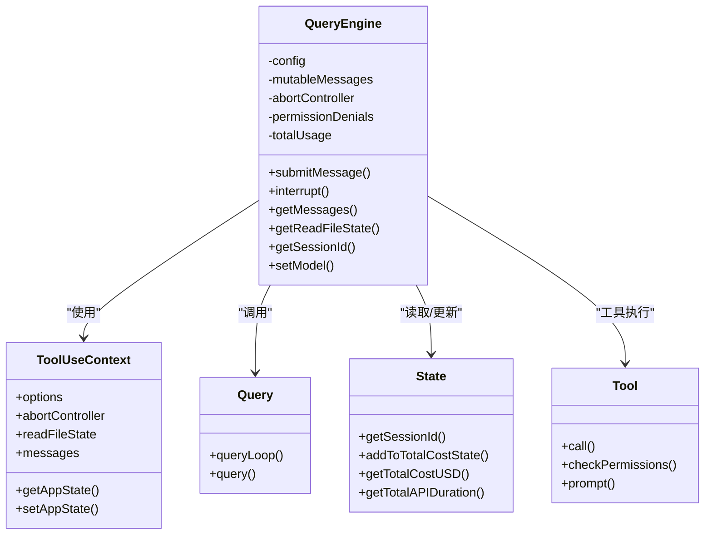

# 查询引擎(QueryEngine)

<cite>
**本文档引用的文件**
- [QueryEngine.ts](file://src/QueryEngine.ts)
- [query.ts](file://src/query.ts)
- [Tool.ts](file://src/Tool.ts)
- [state.ts](file://src/bootstrap/state.ts)
- [processUserInput.ts](file://src/utils/processUserInput/processUserInput.ts)
- [claude.ts](file://src/services/api/claude.ts)
</cite>

## 目录
1. [简介](#简介)
2. [项目结构](#项目结构)
3. [核心组件](#核心组件)
4. [架构总览](#架构总览)
5. [详细组件分析](#详细组件分析)
6. [依赖关系分析](#依赖关系分析)
7. [性能考虑](#性能考虑)
8. [故障排查指南](#故障排查指南)
9. [结论](#结论)

## 简介
本文件面向Claude Code的查询引擎(QueryEngine)，系统性阐述其作为消息循环核心的实现原理与运行机制。QueryEngine负责一次对话中从用户输入到最终结果输出的完整生命周期管理，包括：用户输入预处理、系统提示构建、工具调用编排、权限验证与追踪、使用量统计、会话状态持久化、错误处理与重试策略等。同时，文档给出与工具系统、权限控制系统、状态管理等关键模块的集成关系，并通过序列图与流程图直观展示submitMessage方法的工作流程。

## 项目结构
QueryEngine位于src目录下，围绕其展开的关键文件包括：
- QueryEngine.ts：查询引擎主体，提供submitMessage异步生成器接口
- query.ts：底层查询循环与消息流处理逻辑
- Tool.ts：工具抽象与权限上下文定义
- state.ts：全局会话状态与用量统计
- processUserInput.ts：用户输入解析与附件提取
- claude.ts：与Claude API交互的封装（含流式事件）

图表来源
- [QueryEngine.ts:184-1177](file://src/QueryEngine.ts#L184-L1177)
- [query.ts:219-239](file://src/query.ts#L219-L239)
- [Tool.ts:158-300](file://src/Tool.ts#L158-L300)
- [state.ts:431-781](file://src/bootstrap/state.ts#L431-L781)
- [processUserInput.ts:85-270](file://src/utils/processUserInput/processUserInput.ts#L85-L270)
- [claude.ts:752-780](file://src/services/api/claude.ts#L752-L780)

章节来源
- [QueryEngine.ts:184-1177](file://src/QueryEngine.ts#L184-L1177)
- [query.ts:219-239](file://src/query.ts#L219-L239)
- [Tool.ts:158-300](file://src/Tool.ts#L158-L300)
- [state.ts:431-781](file://src/bootstrap/state.ts#L431-L781)
- [processUserInput.ts:85-270](file://src/utils/processUserInput/processUserInput.ts#L85-L270)
- [claude.ts:752-780](file://src/services/api/claude.ts#L752-L780)

## 核心组件
- QueryEngine类
  - 职责：承载单次对话的会话状态、权限追踪、用量统计；协调用户输入处理、系统提示构建、工具调用与API交互；通过异步生成器向SDK/CLI输出消息流。
  - 关键字段：config、mutableMessages、abortController、permissionDenials、totalUsage、readFileState、技能发现集合等。
  - 关键方法：submitMessage（异步生成器）、interrupt、getMessages、getReadFileState、getSessionId、setModel。
- 工具系统与权限上下文
  - Tool.ts定义了工具抽象、权限上下文、进度回调等接口；ToolUseContext贯穿QueryEngine与query.ts，承载工具执行所需的上下文信息。
- 查询循环(query.ts)
  - 实现消息流的主循环，包含自动压缩、微压缩、上下文折叠、工具执行、流式事件分发、停止钩子等。
- 状态与用量(state.ts)
  - 提供会话ID、成本统计、API耗时、令牌用量、转录持久化等能力。
- 输入处理(processUserInput.ts)
  - 解析用户输入、识别斜杠命令、提取附件、处理图片、执行钩子等。
- API交互(claude.ts)
  - 封装与Claude API的交互，支持流式事件、重试、缓存控制、任务预算等。

章节来源
- [QueryEngine.ts:184-1177](file://src/QueryEngine.ts#L184-L1177)
- [Tool.ts:158-300](file://src/Tool.ts#L158-L300)
- [query.ts:219-239](file://src/query.ts#L219-L239)
- [state.ts:431-781](file://src/bootstrap/state.ts#L431-L781)
- [processUserInput.ts:85-270](file://src/utils/processUserInput/processUserInput.ts#L85-L270)
- [claude.ts:752-780](file://src/services/api/claude.ts#L752-L780)

## 架构总览
QueryEngine在一次消息提交中扮演“编排者”角色：它先对用户输入进行解析与附件提取，再构建系统提示与用户上下文，然后进入query循环与API交互，期间持续更新会话状态、权限拒绝记录、用量统计，并通过异步生成器将中间消息与最终结果逐段产出。

图表来源
- [QueryEngine.ts:209-1156](file://src/QueryEngine.ts#L209-L1156)
- [processUserInput.ts:85-270](file://src/utils/processUserInput/processUserInput.ts#L85-L270)
- [query.ts:219-239](file://src/query.ts#L219-L239)
- [claude.ts:752-780](file://src/services/api/claude.ts#L752-L780)
- [state.ts:543-589](file://src/bootstrap/state.ts#L543-L589)

## 详细组件分析

### QueryEngine类设计与职责
- 会话状态管理
  - mutableMessages：累积用户与助手消息、进度、附件等，贯穿多轮对话。
  - readFileState：文件读取缓存，用于工具读取文件时的上下文一致性。
  - discoveredSkillNames/loadedNestedMemoryPaths：技能发现与嵌套记忆加载的去重与追踪。
- 权限与拒绝追踪
  - 包装canUseTool以收集权限拒绝详情，用于SDK返回的permission_denials字段。
- 使用量统计
  - totalUsage：累计当前会话的用量；currentMessageUsage：按消息粒度增量统计。
- 消息流控制
  - 通过异步生成器yield中间消息（用户、助手、进度、附件、系统边界、工具使用摘要等），并在必要时注入紧凑边界消息以回收内存。
- 终止条件与错误处理
  - 支持最大轮次(maxTurns)、美元预算(maxBudgetUsd)、结构化输出重试限制等终止条件；对API错误、超时、配额等进行分类与上报。

章节来源
- [QueryEngine.ts:184-207](file://src/QueryEngine.ts#L184-L207)
- [QueryEngine.ts:244-271](file://src/QueryEngine.ts#L244-L271)
- [QueryEngine.ts:812-816](file://src/QueryEngine.ts#L812-L816)
- [QueryEngine.ts:971-1048](file://src/QueryEngine.ts#L971-L1048)

### submitMessage工作流程详解
- 输入预处理
  - processUserInput解析字符串或内容块，识别斜杠命令、提取附件、处理图片元数据、执行钩子；返回messages、shouldQuery、allowedTools、model等。
- 系统提示与上下文构建
  - fetchSystemPromptParts动态获取默认系统提示、用户上下文与系统上下文；支持自定义系统提示与附加文本；根据环境变量注入内存机制提示。
- 初始化与系统消息
  - 加载技能与插件缓存；yield系统初始化消息（工具列表、MCP服务器、模型、权限模式、代理、插件、快速模式等）。
- 查询循环与消息流
  - 调用query循环，逐条产出消息：助手、用户、进度、附件、系统边界、工具使用摘要等；在必要时写入转录并触发ACK。
- 结束与结果
  - 根据最终消息类型与停止原因判断成功与否；汇总耗时、用量、权限拒绝、结构化输出等，产出最终result消息。

图表来源
- [QueryEngine.ts:416-428](file://src/QueryEngine.ts#L416-L428)
- [QueryEngine.ts:540-551](file://src/QueryEngine.ts#L540-L551)
- [QueryEngine.ts:675-1049](file://src/QueryEngine.ts#L675-L1049)

章节来源
- [QueryEngine.ts:209-1156](file://src/QueryEngine.ts#L209-L1156)
- [processUserInput.ts:85-270](file://src/utils/processUserInput/processUserInput.ts#L85-L270)
- [query.ts:219-239](file://src/query.ts#L219-L239)

### 与工具系统的集成
- 工具选择与权限
  - QueryEngine包装canUseTool以追踪权限拒绝；在用户输入处理后更新ToolPermissionContext的alwaysAllowRules。
- 工具执行
  - query循环内通过runTools与StreamingToolExecutor协调工具执行，支持并发安全、进度回调、结果配对与内容替换预算。
- 工具描述与搜索
  - Tool.ts提供工具描述、搜索提示、只读/破坏性标记、并发安全等元信息，支撑模型决策与权限判定。

章节来源
- [QueryEngine.ts:244-271](file://src/QueryEngine.ts#L244-L271)
- [Tool.ts:362-473](file://src/Tool.ts#L362-L473)
- [query.ts:561-568](file://src/query.ts#L561-L568)

### 与权限控制系统的集成
- 权限模式与规则
  - ToolUseContext携带ToolPermissionContext，包含模式、额外工作目录、允许/拒绝/询问规则等；QueryEngine在每次submitMessage开始时基于AppState初始化。
- 拒绝追踪
  - 通过wrappedCanUseTool收集拒绝详情，用于SDK返回的permission_denials字段。
- 会话级权限变更
  - 用户输入处理后更新alwaysAllowRules，影响后续工具调用的权限判定。

章节来源
- [Tool.ts:123-148](file://src/Tool.ts#L123-L148)
- [QueryEngine.ts:244-271](file://src/QueryEngine.ts#L244-L271)
- [QueryEngine.ts:477-486](file://src/QueryEngine.ts#L477-L486)

### 与状态管理的集成
- 会话标识与持久化
  - getSessionId提供稳定会话ID；recordTranscript/flushSessionStorage用于转录写入与刷新。
- 用量统计
  - accumulateUsage/updateUsage更新totalUsage；getTotalCost/getTotalAPIDuration/getModelUsage提供查询阶段用量。
- 令牌预算与任务预算
  - query.ts中tokenBudget与taskBudget参数传递至API调用，支持输出配置的任务预算。

章节来源
- [state.ts:431-433](file://src/bootstrap/state.ts#L431-L433)
- [QueryEngine.ts:792-816](file://src/QueryEngine.ts#L792-L816)
- [state.ts:557-572](file://src/bootstrap/state.ts#L557-L572)
- [query.ts:699-706](file://src/query.ts#L699-L706)

### 与API交互的集成
- 流式事件与增量用量
  - claude.ts提供queryModelWithStreaming，产出message_start/delta/stop事件；QueryEngine在message_delta处捕获stop_reason并累加当前消息用量。
- 错误分类与重试
  - QueryEngine对API错误进行分类与上报（system/api_retry），并结合重试策略与终止条件控制流程。
- 缓存与提示缓存
  - 支持prompt caching与1小时TTL策略，依据用户类型与查询源进行门控。

章节来源
- [claude.ts:752-780](file://src/services/api/claude.ts#L752-L780)
- [QueryEngine.ts:802-808](file://src/QueryEngine.ts#L802-L808)
- [QueryEngine.ts:943-955](file://src/QueryEngine.ts#L943-L955)

## 依赖关系分析
- QueryEngine依赖
  - processUserInput：输入解析与附件提取
  - query：查询循环与消息流
  - Tool：工具抽象与权限上下文
  - state：会话状态与用量统计
  - claude：API交互与流事件
- 内部耦合
  - QueryEngine与query之间通过消息数组与ToolUseContext强耦合；与state通过用量与会话ID弱耦合。
- 外部依赖
  - 文件历史快照、转录记录、权限拒绝追踪、结构化输出强制等均通过回调与状态更新集成。

图表来源
- [QueryEngine.ts:184-1177](file://src/QueryEngine.ts#L184-L1177)
- [Tool.ts:158-300](file://src/Tool.ts#L158-L300)
- [query.ts:219-239](file://src/query.ts#L219-L239)
- [state.ts:431-781](file://src/bootstrap/state.ts#L431-L781)

章节来源
- [QueryEngine.ts:184-1177](file://src/QueryEngine.ts#L184-L1177)
- [Tool.ts:158-300](file://src/Tool.ts#L158-L300)
- [query.ts:219-239](file://src/query.ts#L219-L239)
- [state.ts:431-781](file://src/bootstrap/state.ts#L431-L781)

## 性能考虑
- 内存与压缩
  - QueryEngine在系统消息yield后对紧凑边界进行消息裁剪，释放历史消息以降低内存占用。
- 转录写入策略
  - 对于助手消息采用fire-and-forget写入，避免阻塞；其他消息按需同步写入，保证可恢复性。
- 用量统计与预算
  - 按消息粒度累加用量，支持美元预算与最大轮次终止，防止资源滥用。
- 图像与附件处理
  - 在输入阶段完成图像缩放与元数据提取，减少后续API负担。

章节来源
- [QueryEngine.ts:916-942](file://src/QueryEngine.ts#L916-L942)
- [QueryEngine.ts:727-732](file://src/QueryEngine.ts#L727-L732)
- [QueryEngine.ts:971-1002](file://src/QueryEngine.ts#L971-L1002)
- [processUserInput.ts:317-420](file://src/utils/processUserInput/processUserInput.ts#L317-L420)

## 故障排查指南
- 常见终止场景
  - 达到最大轮次：返回error_max_turns结果，包含turnCount与错误信息。
  - 超出美元预算：返回error_max_budget_usd结果，包含总成本与用量。
  - 结构化输出重试上限：返回error_max_structured_output_retries结果，包含尝试次数。
  - 执行期间错误：返回error_during_execution结果，附带诊断前缀与内存错误日志水印。
- 错误诊断要点
  - 检查最后消息类型与停止原因；核对权限拒绝列表；确认API错误分类与重试状态。
- 会话恢复
  - 确保转录写入完成后再退出，避免中途被杀导致无法恢复。

章节来源
- [QueryEngine.ts:842-874](file://src/QueryEngine.ts#L842-L874)
- [QueryEngine.ts:981-1002](file://src/QueryEngine.ts#L981-L1002)
- [QueryEngine.ts:1015-1048](file://src/QueryEngine.ts#L1015-L1048)
- [QueryEngine.ts:1082-1118](file://src/QueryEngine.ts#L1082-L1118)

## 结论
QueryEngine以异步生成器为核心，将用户输入处理、系统提示构建、工具调用编排、权限与用量管理、错误与终止控制等环节有机整合，形成高扩展、可观测、可恢复的查询流水线。通过与工具系统、权限控制、状态管理及API交互的深度集成，QueryEngine在SDK/CLI场景下提供了稳定可靠的对话体验，并为后续的REPL与更多交互形态奠定了坚实基础。