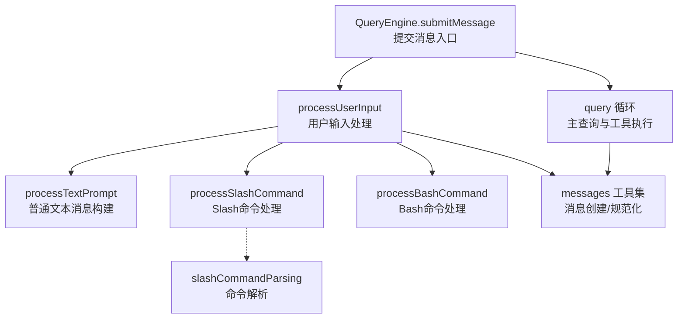
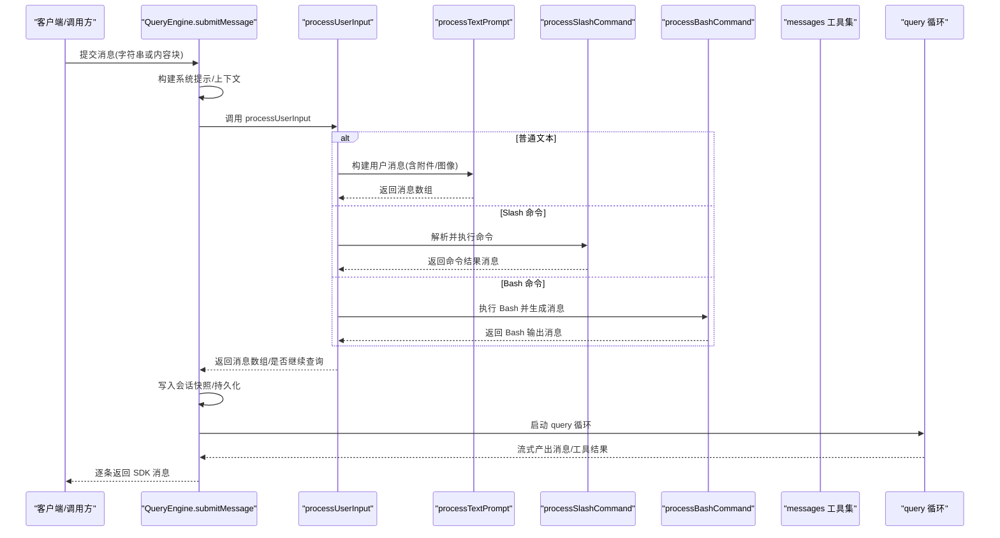
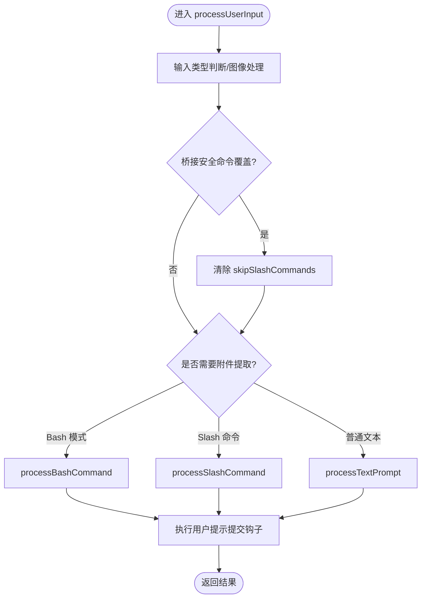
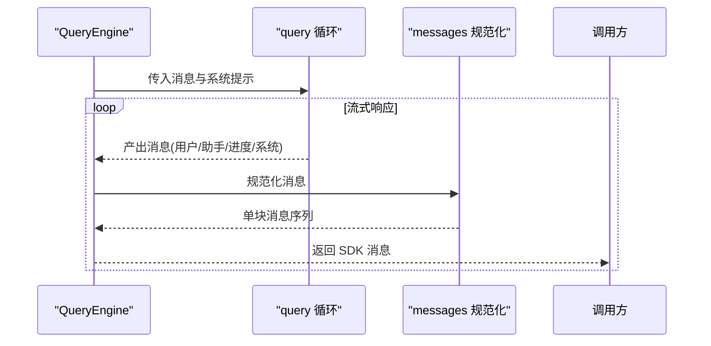
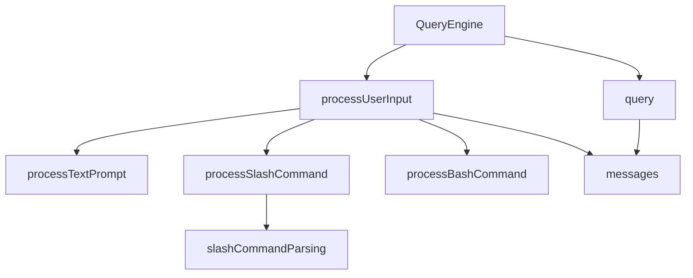

# 消息处理流程

<cite>
**本文档引用的文件**
- [src/QueryEngine.ts](file://src/QueryEngine.ts)
- [src/utils/processUserInput/processUserInput.ts](file://src/utils/processUserInput/processUserInput.ts)
- [src/utils/processUserInput/processTextPrompt.ts](file://src/utils/processUserInput/processTextPrompt.ts)
- [src/utils/processUserInput/processSlashCommand.tsx](file://src/utils/processUserInput/processSlashCommand.tsx)
- [src/utils/processUserInput/processBashCommand.tsx](file://src/utils/processUserInput/processBashCommand.tsx)
- [src/utils/slashCommandParsing.ts](file://src/utils/slashCommandParsing.ts)
- [src/utils/messages.ts](file://src/utils/messages.ts)
- [src/query.ts](file://src/query.ts)
</cite>

## 目录
1. [简介](#简介)
2. [项目结构](#项目结构)
3. [核心组件](#核心组件)
4. [架构总览](#架构总览)
5. [详细组件分析](#详细组件分析)
6. [依赖关系分析](#依赖关系分析)
7. [性能考虑](#性能考虑)
8. [故障排除指南](#故障排除指南)
9. [结论](#结论)

## 简介
本技术文档围绕 Claude Code 查询引擎的消息处理流程展开，重点阐释 submitMessage 方法中从用户输入到最终响应的完整生命周期，涵盖输入解析、Slash 命令处理、消息构建与验证、以及消息在查询引擎中的流转过程。同时提供不同类型消息（普通文本、工具调用、系统消息）的处理示例路径，并总结错误处理与异常恢复策略。

## 项目结构
与消息处理直接相关的核心模块分布如下：
- 查询引擎入口：QueryEngine.submitMessage
- 用户输入处理管线：processUserInput 及其子流程（文本、Slash 命令、Bash）
- 消息构建与规范化：messages 工具集
- 查询循环与工具执行：query 主循环
- Slash 命令解析：slashCommandParsing

图表来源
- [src/QueryEngine.ts:209-639](file://src/QueryEngine.ts#L209-L639)
- [src/utils/processUserInput/processUserInput.ts:85-270](file://src/utils/processUserInput/processUserInput.ts#L85-L270)
- [src/utils/processUserInput/processTextPrompt.ts:19-101](file://src/utils/processUserInput/processTextPrompt.ts#L19-L101)
- [src/utils/processUserInput/processSlashCommand.tsx:1-200](file://src/utils/processUserInput/processSlashCommand.tsx#L1-L200)
- [src/utils/processUserInput/processBashCommand.tsx:1-140](file://src/utils/processUserInput/processBashCommand.tsx#L1-L140)
- [src/utils/slashCommandParsing.ts:25-60](file://src/utils/slashCommandParsing.ts#L25-L60)
- [src/utils/messages.ts:460-523](file://src/utils/messages.ts#L460-L523)
- [src/query.ts:219-800](file://src/query.ts#L219-L800)

章节来源
- [src/QueryEngine.ts:209-639](file://src/QueryEngine.ts#L209-L639)
- [src/utils/processUserInput/processUserInput.ts:85-270](file://src/utils/processUserInput/processUserInput.ts#L85-L270)

## 核心组件
- QueryEngine.submitMessage：负责会话状态管理、系统提示构建、用户输入处理、消息持久化与查询循环启动。
- processUserInput：统一的用户输入处理入口，负责预处理、命令识别、附件提取、图像处理、钩子拦截与消息构建。
- processTextPrompt：将普通文本与附件/图像内容组合为用户消息。
- processSlashCommand：解析并执行 Slash 命令，支持插件/技能、后台异步执行与结果回流。
- processBashCommand：在安全沙箱外执行 Bash 命令，返回结构化输出消息。
- messages 工具集：提供 createUserMessage、createSystemMessage、normalizeMessages 等消息构造与规范化能力。
- query：主查询循环，负责上下文压缩、工具执行、流式响应与错误恢复。

章节来源
- [src/QueryEngine.ts:209-639](file://src/QueryEngine.ts#L209-L639)
- [src/utils/processUserInput/processUserInput.ts:85-270](file://src/utils/processUserInput/processUserInput.ts#L85-L270)
- [src/utils/processUserInput/processTextPrompt.ts:19-101](file://src/utils/processUserInput/processTextPrompt.ts#L19-L101)
- [src/utils/processUserInput/processSlashCommand.tsx:1-200](file://src/utils/processUserInput/processSlashCommand.tsx#L1-L200)
- [src/utils/processUserInput/processBashCommand.tsx:1-140](file://src/utils/processUserInput/processBashCommand.tsx#L1-L140)
- [src/utils/messages.ts:460-523](file://src/utils/messages.ts#L460-L523)
- [src/query.ts:219-800](file://src/query.ts#L219-L800)

## 架构总览
下图展示了从 submitMessage 到 query 的端到端消息处理链路，包括用户输入预处理、命令识别、消息构建、持久化与查询循环。

图表来源
- [src/QueryEngine.ts:209-639](file://src/QueryEngine.ts#L209-L639)
- [src/utils/processUserInput/processUserInput.ts:281-589](file://src/utils/processUserInput/processUserInput.ts#L281-L589)
- [src/utils/processUserInput/processTextPrompt.ts:19-101](file://src/utils/processUserInput/processTextPrompt.ts#L19-L101)
- [src/utils/processUserInput/processSlashCommand.tsx:1-200](file://src/utils/processUserInput/processSlashCommand.tsx#L1-L200)
- [src/utils/processUserInput/processBashCommand.tsx:1-140](file://src/utils/processUserInput/processBashCommand.tsx#L1-L140)
- [src/utils/messages.ts:460-523](file://src/utils/messages.ts#L460-L523)
- [src/query.ts:219-800](file://src/query.ts#L219-L800)

## 详细组件分析

### submitMessage 方法：消息处理完整流程
- 系统提示与上下文构建：根据工具、模型、MCP 客户端与自定义/附加系统提示生成最终系统提示。
- 用户输入处理：调用 processUserInput，得到消息数组、是否继续查询、允许工具列表、模型等。
- 消息持久化：将用户消息写入会话快照；必要时刷新存储以保证可恢复性。
- 权限规则更新：基于命令执行结果更新工具权限上下文。
- 查询循环启动：构建系统初始化消息后，进入 query 循环，按需产出用户/助手/进度/边界消息，并进行上下文压缩与工具执行。

章节来源
- [src/QueryEngine.ts:209-639](file://src/QueryEngine.ts#L209-L639)

### processUserInput 函数：输入解析与消息构建
- 输入预处理：支持字符串与多内容块输入；对图像块进行尺寸调整与元数据收集；提取前置内容块与最后文本块。
- 命令识别：桥接安全命令覆盖逻辑（bridgeOrigin），在 skipSlashCommands 场景下仍允许安全命令执行。
- 附件提取：根据模式与跳过策略决定是否提取 IDE/队列附件。
- Bash 命令：当 mode 为 bash 时，直接进入 Bash 处理流程。
- Slash 命令：解析命令名与参数，路由至对应命令处理器。
- 普通文本：调用 processTextPrompt 构建用户消息与附件消息。
- 钩子拦截：执行用户提示提交钩子，支持阻断、附加上下文与进度消息。
- 结果封装：将消息、是否查询、工具/模型/努力值等打包返回。

图表来源
- [src/utils/processUserInput/processUserInput.ts:281-589](file://src/utils/processUserInput/processUserInput.ts#L281-L589)
- [src/utils/processUserInput/processTextPrompt.ts:19-101](file://src/utils/processUserInput/processTextPrompt.ts#L19-L101)
- [src/utils/processUserInput/processSlashCommand.tsx:1-200](file://src/utils/processUserInput/processSlashCommand.tsx#L1-L200)
- [src/utils/processUserInput/processBashCommand.tsx:1-140](file://src/utils/processUserInput/processBashCommand.tsx#L1-L140)

章节来源
- [src/utils/processUserInput/processUserInput.ts:85-270](file://src/utils/processUserInput/processUserInput.ts#L85-L270)
- [src/utils/processUserInput/processUserInput.ts:281-589](file://src/utils/processUserInput/processUserInput.ts#L281-L589)

### Slash 命令处理：解析与执行
- 命令解析：使用 slashCommandParsing 将输入拆分为命令名与参数，支持 MCP 命令标记。
- 执行策略：支持同步执行与后台异步派生代理两种模式；后台模式通过队列重新注入结果。
- 上下文与权限：合并技能努力值、刷新工具列表、记录遥测信息。
- 结果回流：将命令执行结果作为用户消息或系统消息回流至消息管线。

章节来源
- [src/utils/slashCommandParsing.ts:25-60](file://src/utils/slashCommandParsing.ts#L25-L60)
- [src/utils/processUserInput/processSlashCommand.tsx:1-200](file://src/utils/processUserInput/processSlashCommand.tsx#L1-L200)

### Bash 命令处理：本地执行与消息格式化
- Shell 选择：根据默认 Shell 与平台选择 Bash 或 PowerShell 工具。
- 进度 UI：实时渲染 Bash 执行进度，支持详细模式。
- 输出格式化：将 stdout/stderr 包装为结构化 XML 标签消息，避免转义破坏解析。
- 异常处理：区分中断与失败，分别生成中断或错误消息。

章节来源
- [src/utils/processUserInput/processBashCommand.tsx:1-140](file://src/utils/processUserInput/processBashCommand.tsx#L1-L140)

### 普通文本消息构建：内容与附件组合
- 文本提取：从多内容块中提取最后文本块作为用户提示。
- 附件与图像：将附件消息与图像内容块拼接在用户消息之前或之后。
- 权限与元信息：支持权限模式、图像粘贴标识、可见性与来源标注。

章节来源
- [src/utils/processUserInput/processTextPrompt.ts:19-101](file://src/utils/processUserInput/processTextPrompt.ts#L19-L101)
- [src/utils/messages.ts:460-523](file://src/utils/messages.ts#L460-L523)

### 消息在查询引擎中的流转
- 初始化：构建系统初始化消息，包含工具、MCP 客户端、模型、权限模式等。
- 查询循环：query 循环负责上下文压缩、工具执行、流式响应与错误恢复。
- 消息类型：用户消息、助手消息、进度消息、系统消息（含本地命令、紧凑边界等）、墓碑消息（用于移除中间态）。
- 规范化：normalizeMessages 将多内容块消息拆分为单块消息，确保下游一致性。

图表来源
- [src/QueryEngine.ts:540-639](file://src/QueryEngine.ts#L540-L639)
- [src/query.ts:219-800](file://src/query.ts#L219-L800)
- [src/utils/messages.ts:730-800](file://src/utils/messages.ts#L730-L800)

章节来源
- [src/QueryEngine.ts:540-639](file://src/QueryEngine.ts#L540-L639)
- [src/query.ts:219-800](file://src/query.ts#L219-L800)
- [src/utils/messages.ts:730-800](file://src/utils/messages.ts#L730-L800)

### 不同类型消息的处理示例路径
- 普通文本消息
  - 入口：processTextPrompt
  - 关键点：从多内容块提取文本、拼接附件与图像、设置 isMeta/permissionMode
  - 示例路径：[processTextPrompt:19-101](file://src/utils/processUserInput/processTextPrompt.ts#L19-L101)
- 工具调用消息
  - 入口：query 循环内部工具执行与回传
  - 关键点：工具结果作为用户消息回流，携带 tool_use_id 与 is_error 标记
  - 示例路径：[query 循环:219-800](file://src/query.ts#L219-L800)
- 系统消息
  - 入口：messages 工具集与 query 初始化
  - 关键点：本地命令输出、紧凑边界、模型切换面包屑等
  - 示例路径：[messages 工具集:460-523](file://src/utils/messages.ts#L460-L523), [QueryEngine 初始化:540-551](file://src/QueryEngine.ts#L540-L551)

章节来源
- [src/utils/processUserInput/processTextPrompt.ts:19-101](file://src/utils/processUserInput/processTextPrompt.ts#L19-L101)
- [src/query.ts:219-800](file://src/query.ts#L219-L800)
- [src/utils/messages.ts:460-523](file://src/utils/messages.ts#L460-L523)
- [src/QueryEngine.ts:540-551](file://src/QueryEngine.ts#L540-L551)

## 依赖关系分析
- QueryEngine 依赖 processUserInput 与 query；processUserInput 依赖 messages、slashCommandParsing、processTextPrompt/processSlashCommand/processBashCommand。
- query 依赖工具执行器、上下文压缩服务、令牌预算与停止钩子。
- messages 提供消息创建与规范化，贯穿整个处理链路。

图表来源
- [src/QueryEngine.ts:209-639](file://src/QueryEngine.ts#L209-L639)
- [src/utils/processUserInput/processUserInput.ts:85-270](file://src/utils/processUserInput/processUserInput.ts#L85-L270)
- [src/utils/processUserInput/processTextPrompt.ts:19-101](file://src/utils/processUserInput/processTextPrompt.ts#L19-L101)
- [src/utils/processUserInput/processSlashCommand.tsx:1-200](file://src/utils/processUserInput/processSlashCommand.tsx#L1-L200)
- [src/utils/processUserInput/processBashCommand.tsx:1-140](file://src/utils/processUserInput/processBashCommand.tsx#L1-L140)
- [src/utils/slashCommandParsing.ts:25-60](file://src/utils/slashCommandParsing.ts#L25-L60)
- [src/utils/messages.ts:460-523](file://src/utils/messages.ts#L460-L523)
- [src/query.ts:219-800](file://src/query.ts#L219-L800)

章节来源
- [src/QueryEngine.ts:209-639](file://src/QueryEngine.ts#L209-L639)
- [src/utils/processUserInput/processUserInput.ts:85-270](file://src/utils/processUserInput/processUserInput.ts#L85-L270)

## 性能考虑
- 图像处理并行化：paste 图像与内容块图像的尺寸调整与元数据收集采用并行处理，减少整体延迟。
- 附件加载分段：附件提取与图像处理分阶段进行，避免一次性阻塞。
- 上下文压缩：在 query 循环中按需进行微压缩、自动压缩与历史截断，控制令牌占用。
- 流式工具执行：支持流式工具执行器，降低首包延迟并提升交互体验。
- 存储刷新策略：在非裸模式下等待会话快照写入，在裸模式下异步刷新，平衡可用性与性能。

## 故障排除指南
- 钩子阻断与拦截
  - 用户提示提交钩子可能阻止继续查询或返回警告消息；检查钩子返回的 preventContinuation/blockingError 字段。
  - 示例路径：[processUserInput 钩子处理:178-270](file://src/utils/processUserInput/processUserInput.ts#L178-L270)
- 命令解析失败
  - Slash 命令解析失败时返回 null；确认输入以 "/" 开头且包含有效命令名。
  - 示例路径：[slashCommandParsing:25-60](file://src/utils/slashCommandParsing.ts#L25-L60)
- Bash 执行异常
  - 中断与失败分别生成中断消息与错误消息；检查 stderr/stdout 标签包裹内容。
  - 示例路径：[processBashCommand:113-139](file://src/utils/processUserInput/processBashCommand.tsx#L113-L139)
- 查询循环错误
  - query 循环中可能产生最大输出令牌、提示过长等可恢复错误；系统会进行回收或压缩后再试。
  - 示例路径：[query 循环错误处理:652-800](file://src/query.ts#L652-L800)
- 消息规范化问题
  - 多内容块消息会被规范化为单块消息；若出现重复 UUID 或顺序错乱，检查 normalizeMessages 的派生逻辑。
  - 示例路径：[messages 规范化:730-800](file://src/utils/messages.ts#L730-L800)

章节来源
- [src/utils/processUserInput/processUserInput.ts:178-270](file://src/utils/processUserInput/processUserInput.ts#L178-L270)
- [src/utils/slashCommandParsing.ts:25-60](file://src/utils/slashCommandParsing.ts#L25-L60)
- [src/utils/processUserInput/processBashCommand.tsx:113-139](file://src/utils/processUserInput/processBashCommand.tsx#L113-L139)
- [src/query.ts:652-800](file://src/query.ts#L652-L800)
- [src/utils/messages.ts:730-800](file://src/utils/messages.ts#L730-L800)

## 结论
Claude Code 查询引擎通过 QueryEngine.submitMessage 统一调度用户输入处理与查询循环，借助 processUserInput 将复杂输入（文本、图像、附件、Slash 命令、Bash 命令）标准化为消息序列，并由 query 循环完成上下文压缩、工具执行与流式响应。messages 工具集确保消息的一致性与可追踪性。整体设计在保证安全性与可观测性的前提下，兼顾了性能与用户体验。