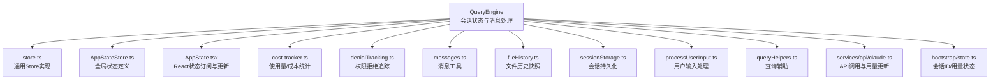
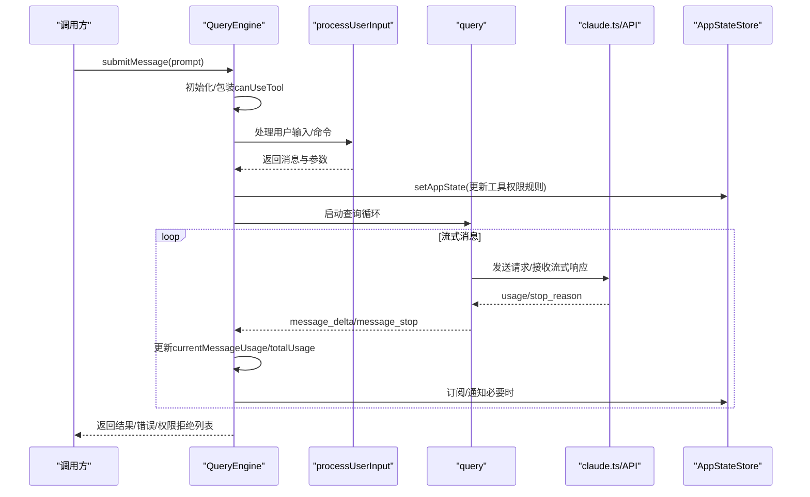
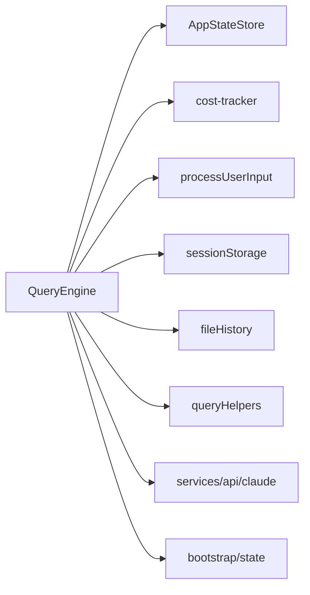

# 状态管理

<cite>
**本文引用的文件**
- [src/QueryEngine.ts](file://src/QueryEngine.ts)
- [src/state/AppStateStore.ts](file://src/state/AppStateStore.ts)
- [src/state/AppState.tsx](file://src/state/AppState.tsx)
- [src/state/store.ts](file://src/state/store.ts)
- [src/cost-tracker.ts](file://src/cost-tracker.ts)
- [src/utils/permissions/denialTracking.ts](file://src/utils/permissions/denialTracking.ts)
- [src/utils/messages.ts](file://src/utils/messages.ts)
- [src/utils/fileHistory.ts](file://src/utils/fileHistory.ts)
- [src/utils/sessionStorage.ts](file://src/utils/sessionStorage.ts)
- [src/utils/processUserInput/processUserInput.ts](file://src/utils/processUserInput/processUserInput.ts)
- [src/utils/queryHelpers.ts](file://src/utils/queryHelpers.ts)
- [src/services/api/claude.ts](file://src/services/api/claude.ts)
- [src/bootstrap/state.ts](file://src/bootstrap/state.ts)
</cite>

## 目录
1. [简介](#简介)
2. [项目结构](#项目结构)
3. [核心组件](#核心组件)
4. [架构总览](#架构总览)
5. [详细组件分析](#详细组件分析)
6. [依赖关系分析](#依赖关系分析)
7. [性能考量](#性能考量)
8. [故障排查指南](#故障排查指南)
9. [结论](#结论)

## 简介
本文件聚焦于 Claude Code 查询引擎的状态管理机制，系统性解析 QueryEngine 类中的状态变量与其生命周期，阐述消息处理过程中状态的更新与同步（包括消息持久化、使用量统计、权限追踪），并说明其与 AppStateStore 的集成方式（状态订阅、更新通知与持久化）。同时提供状态变更的触发时机与处理流程示例路径，并总结内存优化策略与性能注意事项。

## 项目结构
围绕状态管理的关键模块与文件如下：
- QueryEngine：负责一次对话会话的查询生命周期与状态维护
- AppStateStore/AppState：应用全局状态定义与存储容器
- store：通用 Store 实现（getState/setState/subscribe）
- cost-tracker：使用量与成本统计工具
- denialTracking：权限拒绝追踪
- 消息与历史相关工具：messages、fileHistory、sessionStorage、processUserInput、queryHelpers

图表来源
- [src/QueryEngine.ts:184-207](file://src/QueryEngine.ts#L184-L207)
- [src/state/store.ts:1-35](file://src/state/store.ts#L1-L35)
- [src/state/AppStateStore.ts:89-570](file://src/state/AppStateStore.ts#L89-L570)
- [src/state/AppState.tsx:117-200](file://src/state/AppState.tsx#L117-L200)
- [src/cost-tracker.ts:1-324](file://src/cost-tracker.ts#L1-L324)
- [src/utils/permissions/denialTracking.ts:1-45](file://src/utils/permissions/denialTracking.ts#L1-L45)
- [src/utils/messages.ts](file://src/utils/messages.ts)
- [src/utils/fileHistory.ts](file://src/utils/fileHistory.ts)
- [src/utils/sessionStorage.ts](file://src/utils/sessionStorage.ts)
- [src/utils/processUserInput/processUserInput.ts](file://src/utils/processUserInput/processUserInput.ts)
- [src/utils/queryHelpers.ts](file://src/utils/queryHelpers.ts)
- [src/services/api/claude.ts](file://src/services/api/claude.ts)
- [src/bootstrap/state.ts](file://src/bootstrap/state.ts)

章节来源
- [src/QueryEngine.ts:184-207](file://src/QueryEngine.ts#L184-L207)
- [src/state/store.ts:1-35](file://src/state/store.ts#L1-L35)
- [src/state/AppStateStore.ts:89-570](file://src/state/AppStateStore.ts#L89-L570)
- [src/state/AppState.tsx:117-200](file://src/state/AppState.tsx#L117-L200)

## 核心组件
本节聚焦 QueryEngine 中的关键状态字段及其职责与生命周期：

- mutableMessages
  - 类型：Message[]
  - 职责：保存当前会话的可变消息序列，贯穿整个提交周期；在每次提交后追加新消息，并在压缩边界时进行裁剪以控制内存
  - 生命周期：随 QueryEngine 实例存在；在提交开始前清空技能发现集合，提交结束后保留用于后续回合
  - 更新点：消息推送、压缩边界裁剪、进度/附件内联记录
  - 参考路径：[src/QueryEngine.ts:186](file://src/QueryEngine.ts#L186)，[src/QueryEngine.ts:431](file://src/QueryEngine.ts#L431)，[src/QueryEngine.ts:916](file://src/QueryEngine.ts#L916)

- permissionDenials
  - 类型：SDKPermissionDenial[]
  - 职责：记录被拒绝的工具调用，供 SDK 返回结果包含
  - 生命周期：单次提交周期累积，提交结束清空
  - 更新点：canUseTool 包装器在拒绝时追加
  - 参考路径：[src/QueryEngine.ts:188](file://src/QueryEngine.ts#L188)，[src/QueryEngine.ts:263](file://src/QueryEngine.ts#L263)

- totalUsage
  - 类型：NonNullableUsage
  - 职责：累计整次查询会话的用量（按消息粒度累加）
  - 生命周期：跨多轮增量累加，提交结束时作为最终结果返回
  - 更新点：message_stop 事件时将当前消息用量累加到 totalUsage
  - 参考路径：[src/QueryEngine.ts:189](file://src/QueryEngine.ts#L189)，[src/QueryEngine.ts:812](file://src/QueryEngine.ts#L812)

- discoveredSkillNames
  - 类型：Set<string>
  - 职责：跟踪本次提交中动态发现的技能名称，避免重复上报
  - 生命周期：每轮提交开始清空，提交结束清空；跨轮不持久
  - 更新点：在构建 ProcessUserInputContext 时注入，由工具调用与动态技能发现使用
  - 参考路径：[src/QueryEngine.ts:197](file://src/QueryEngine.ts#L197)，[src/QueryEngine.ts:238](file://src/QueryEngine.ts#L238)

- readFileState
  - 类型：FileStateCache
  - 职责：只读文件缓存，用于工具读取文件内容
  - 生命周期：QueryEngine 构造时注入，提交结束回写
  - 参考路径：[src/QueryEngine.ts:191](file://src/QueryEngine.ts#L191)，[src/QueryEngine.ts:1293](file://src/QueryEngine.ts#L1293)

- hasHandledOrphanedPermission
  - 类型：boolean
  - 职责：确保孤儿权限处理仅执行一次
  - 参考路径：[src/QueryEngine.ts:190](file://src/QueryEngine.ts#L190)，[src/QueryEngine.ts:398](file://src/QueryEngine.ts#L398)

章节来源
- [src/QueryEngine.ts:184-207](file://src/QueryEngine.ts#L184-L207)
- [src/QueryEngine.ts:238](file://src/QueryEngine.ts#L238)
- [src/QueryEngine.ts:812](file://src/QueryEngine.ts#L812)
- [src/QueryEngine.ts:1293](file://src/QueryEngine.ts#L1293)

## 架构总览
QueryEngine 通过 AppStateStore 提供的全局状态与订阅机制，实现状态的集中管理与跨组件同步。其状态更新遵循“局部状态（QueryEngine）+ 全局状态（AppStateStore）”双轨并行的模式：局部状态用于会话内消息与用量的实时计算，全局状态用于 UI 与外部系统（如持久化、权限上下文）的统一视图。

图表来源
- [src/QueryEngine.ts:209-639](file://src/QueryEngine.ts#L209-L639)
- [src/utils/processUserInput/processUserInput.ts](file://src/utils/processUserInput/processUserInput.ts)
- [src/services/api/claude.ts](file://src/services/api/claude.ts)
- [src/state/AppStateStore.ts:454-455](file://src/state/AppStateStore.ts#L454-L455)

## 详细组件分析

### QueryEngine 状态变量与生命周期
- mutableMessages
  - 触发时机：每次提交开始清空技能集合；用户输入处理后追加；进度/附件/系统消息内联记录；压缩边界时裁剪
  - 更新逻辑要点：在记录转录前对用户消息进行筛选与确认；在压缩边界时清空历史以释放内存
  - 参考路径：[src/QueryEngine.ts:238](file://src/QueryEngine.ts#L238)，[src/QueryEngine.ts:431](file://src/QueryEngine.ts#L431)，[src/QueryEngine.ts:716](file://src/QueryEngine.ts#L716)，[src/QueryEngine.ts:916](file://src/QueryEngine.ts#L916)

- permissionDenials
  - 触发时机：canUseTool 包装器检测到拒绝行为时追加
  - 结果输出：在最终结果中一并返回
  - 参考路径：[src/QueryEngine.ts:244-271](file://src/QueryEngine.ts#L244-L271)，[src/QueryEngine.ts:631](file://src/QueryEngine.ts#L631)

- totalUsage
  - 触发时机：message_stop 事件时将当前消息用量累加到 totalUsage
  - 结果输出：在最终结果中返回
  - 参考路径：[src/QueryEngine.ts:812](file://src/QueryEngine.ts#L812)，[src/QueryEngine.ts:1146](file://src/QueryEngine.ts#L1146)

- discoveredSkillNames
  - 触发时机：每轮提交开始清空；在工具调用与动态技能发现中使用
  - 参考路径：[src/QueryEngine.ts:238](file://src/QueryEngine.ts#L238)，[src/QueryEngine.ts:373](file://src/QueryEngine.ts#L373)

- readFileState
  - 触发时机：构造时注入；提交结束回写
  - 参考路径：[src/QueryEngine.ts:206](file://src/QueryEngine.ts#L206)，[src/QueryEngine.ts:1293](file://src/QueryEngine.ts#L1293)

- hasHandledOrphanedPermission
  - 触发时机：首次遇到孤儿权限时处理一次
  - 参考路径：[src/QueryEngine.ts:398](file://src/QueryEngine.ts#L398)

章节来源
- [src/QueryEngine.ts:209-639](file://src/QueryEngine.ts#L209-L639)
- [src/QueryEngine.ts:812](file://src/QueryEngine.ts#L812)
- [src/QueryEngine.ts:1293](file://src/QueryEngine.ts#L1293)

### 状态在消息处理过程中的更新机制
- 消息持久化
  - 用户消息入会话后立即记录转录；在压缩边界前记录到尾部；在非交互模式下采用异步刷新策略
  - 参考路径：[src/QueryEngine.ts:450-463](file://src/QueryEngine.ts#L450-L463)，[src/QueryEngine.ts:717-732](file://src/QueryEngine.ts#L717-L732)，[src/utils/sessionStorage.ts](file://src/utils/sessionStorage.ts)

- 使用量统计
  - 在 message_delta 事件中增量更新当前消息用量；在 message_stop 事件中累加到 totalUsage；通过 cost-tracker 提供的接口获取会话级指标
  - 参考路径：[src/QueryEngine.ts:797-816](file://src/QueryEngine.ts#L797-L816)，[src/cost-tracker.ts:50-69](file://src/cost-tracker.ts#L50-L69)

- 权限追踪
  - 包装 canUseTool，在拒绝时记录 permissionDenials；最终结果中返回
  - 参考路径：[src/QueryEngine.ts:244-271](file://src/QueryEngine.ts#L244-L271)，[src/QueryEngine.ts:631](file://src/QueryEngine.ts#L631)

- 文件历史快照
  - 在启用文件历史时，对可选的用户消息生成快照并更新 AppState
  - 参考路径：[src/QueryEngine.ts:641-655](file://src/QueryEngine.ts#L641-L655)，[src/utils/fileHistory.ts](file://src/utils/fileHistory.ts)

- 剩余限制检查
  - 预算超限、最大轮次、结构化输出重试次数达到阈值时，触发提前终止并返回错误结果
  - 参考路径：[src/QueryEngine.ts:971-1002](file://src/QueryEngine.ts#L971-L1002)，[src/QueryEngine.ts:1004-1048](file://src/QueryEngine.ts#L1004-L1048)

章节来源
- [src/QueryEngine.ts:450-463](file://src/QueryEngine.ts#L450-L463)
- [src/QueryEngine.ts:797-816](file://src/QueryEngine.ts#L797-L816)
- [src/QueryEngine.ts:641-655](file://src/QueryEngine.ts#L641-L655)
- [src/QueryEngine.ts:971-1002](file://src/QueryEngine.ts#L971-L1002)
- [src/QueryEngine.ts:1004-1048](file://src/QueryEngine.ts#L1004-L1048)

### 状态管理与 AppStateStore 的集成
- 订阅与更新
  - AppState.tsx 提供 useAppState/useSetAppState/useAppStateStore 等钩子，基于 useSyncExternalStore 订阅 Store 变更
  - AppStateStore 定义了完整的 AppState 结构，包含工具权限上下文、插件状态、文件历史、归因信息等
  - 参考路径：[src/state/AppState.tsx:142-179](file://src/state/AppState.tsx#L142-L179)，[src/state/AppStateStore.ts:89-570](file://src/state/AppStateStore.ts#L89-L570)

- Store 实现
  - store.ts 提供通用 Store 接口：getState、setState、subscribe；setState 内部比较新旧状态并通过 onChange 回调与订阅者广播
  - 参考路径：[src/state/store.ts:1-35](file://src/state/store.ts#L1-L35)

- 与 QueryEngine 的协作
  - QueryEngine 在处理用户输入与权限规则时，通过 setAppState 更新工具权限上下文
  - 进度/附件消息内联记录时，通过 setAppState 更新文件历史与归因状态
  - 参考路径：[src/QueryEngine.ts:477-486](file://src/QueryEngine.ts#L477-L486)，[src/QueryEngine.ts:379-393](file://src/QueryEngine.ts#L379-L393)

章节来源
- [src/state/AppState.tsx:142-179](file://src/state/AppState.tsx#L142-L179)
- [src/state/AppStateStore.ts:89-570](file://src/state/AppStateStore.ts#L89-L570)
- [src/state/store.ts:1-35](file://src/state/store.ts#L1-L35)
- [src/QueryEngine.ts:477-486](file://src/QueryEngine.ts#L477-L486)
- [src/QueryEngine.ts:379-393](file://src/QueryEngine.ts#L379-L393)

### 具体代码示例路径（触发时机与处理流程）
- canUseTool 包装器与 permissionDenials 追加
  - [src/QueryEngine.ts:244-271](file://src/QueryEngine.ts#L244-L271)
- 用户消息入会话与转录记录
  - [src/QueryEngine.ts:431](file://src/QueryEngine.ts#L431)，[src/QueryEngine.ts:450-463](file://src/QueryEngine.ts#L450-L463)
- 压缩边界消息处理与内存裁剪
  - [src/QueryEngine.ts:916](file://src/QueryEngine.ts#L916)，[src/QueryEngine.ts:926-933](file://src/QueryEngine.ts#L926-L933)
- message_delta 与 message_stop 对用量的影响
  - [src/QueryEngine.ts:797-816](file://src/QueryEngine.ts#L797-L816)，[src/QueryEngine.ts:812](file://src/QueryEngine.ts#L812)
- 文件历史快照更新
  - [src/QueryEngine.ts:641-655](file://src/QueryEngine.ts#L641-L655)，[src/QueryEngine.ts:646-651](file://src/QueryEngine.ts#L646-L651)
- 最终结果返回（含 totalUsage、permissionDenials 等）
  - [src/QueryEngine.ts:1146](file://src/QueryEngine.ts#L1146)，[src/QueryEngine.ts:1148](file://src/QueryEngine.ts#L1148)

章节来源
- [src/QueryEngine.ts:244-271](file://src/QueryEngine.ts#L244-L271)
- [src/QueryEngine.ts:431](file://src/QueryEngine.ts#L431)
- [src/QueryEngine.ts:450-463](file://src/QueryEngine.ts#L450-L463)
- [src/QueryEngine.ts:916](file://src/QueryEngine.ts#L916)
- [src/QueryEngine.ts:926-933](file://src/QueryEngine.ts#L926-L933)
- [src/QueryEngine.ts:797-816](file://src/QueryEngine.ts#L797-L816)
- [src/QueryEngine.ts:812](file://src/QueryEngine.ts#L812)
- [src/QueryEngine.ts:641-655](file://src/QueryEngine.ts#L641-L655)
- [src/QueryEngine.ts:646-651](file://src/QueryEngine.ts#L646-L651)
- [src/QueryEngine.ts:1146](file://src/QueryEngine.ts#L1146)
- [src/QueryEngine.ts:1148](file://src/QueryEngine.ts#L1148)

### 状态管理中的内存优化策略与性能考虑
- 消息压缩与边界清理
  - 在压缩边界处清空 mutableMessages 前缀，仅保留边界后的消息，减少内存占用
  - 参考路径：[src/QueryEngine.ts:926-933](file://src/QueryEngine.ts#L926-L933)

- 进度/附件内联记录
  - 为避免重复转录与链路冻结，进度与附件消息在入队时即内联记录，确保后续去重逻辑正确
  - 参考路径：[src/QueryEngine.ts:778-782](file://src/QueryEngine.ts#L778-L782)，[src/QueryEngine.ts:832-836](file://src/QueryEngine.ts#L832-L836)

- 异步转录与刷新策略
  - 在非交互模式下采用 fire-and-forget 或延迟刷新策略，降低阻塞风险
  - 参考路径：[src/QueryEngine.ts:727-732](file://src/QueryEngine.ts#L727-L732)，[src/QueryEngine.ts:1073-1080](file://src/QueryEngine.ts#L1073-L1080)

- 用量统计的增量更新
  - 仅在 message_delta 时增量更新当前消息用量，message_stop 时一次性累加，避免重复计算
  - 参考路径：[src/QueryEngine.ts:797-816](file://src/QueryEngine.ts#L797-L816)

- 技能发现集合的轮次隔离
  - 每轮提交开始清空 discoveredSkillNames，防止无界增长
  - 参考路径：[src/QueryEngine.ts:238](file://src/QueryEngine.ts#L238)

章节来源
- [src/QueryEngine.ts:926-933](file://src/QueryEngine.ts#L926-L933)
- [src/QueryEngine.ts:778-782](file://src/QueryEngine.ts#L778-L782)
- [src/QueryEngine.ts:832-836](file://src/QueryEngine.ts#L832-L836)
- [src/QueryEngine.ts:727-732](file://src/QueryEngine.ts#L727-L732)
- [src/QueryEngine.ts:1073-1080](file://src/QueryEngine.ts#L1073-L1080)
- [src/QueryEngine.ts:797-816](file://src/QueryEngine.ts#L797-L816)
- [src/QueryEngine.ts:238](file://src/QueryEngine.ts#L238)

## 依赖关系分析
- QueryEngine 依赖
  - AppStateStore：通过 setAppState/getAppState 获取/更新全局状态
  - cost-tracker：获取/累计使用量与成本
  - processUserInput：解析用户输入与命令
  - sessionStorage：持久化会话转录
  - fileHistory：生成文件历史快照
  - queryHelpers：处理孤儿权限等辅助逻辑
  - services/api/claude：API 调用与用量更新
  - bootstrap/state：会话 ID 与用量状态读取/设置

图表来源
- [src/QueryEngine.ts:209-639](file://src/QueryEngine.ts#L209-L639)
- [src/cost-tracker.ts:1-324](file://src/cost-tracker.ts#L1-L324)
- [src/utils/processUserInput/processUserInput.ts](file://src/utils/processUserInput/processUserInput.ts)
- [src/utils/sessionStorage.ts](file://src/utils/sessionStorage.ts)
- [src/utils/fileHistory.ts](file://src/utils/fileHistory.ts)
- [src/utils/queryHelpers.ts](file://src/utils/queryHelpers.ts)
- [src/services/api/claude.ts](file://src/services/api/claude.ts)
- [src/bootstrap/state.ts](file://src/bootstrap/state.ts)

章节来源
- [src/QueryEngine.ts:209-639](file://src/QueryEngine.ts#L209-L639)

## 性能考量
- 减少不必要的对象创建：AppState 选择器应返回现有子对象引用而非新建对象，避免触发不必要的重渲染
- 控制消息数组规模：通过压缩边界与前缀裁剪控制 mutableMessages 长度
- 异步转录与刷新：在非交互场景下采用 fire-and-forget 与延迟刷新，降低阻塞
- 增量用量统计：仅在必要事件节点更新用量，避免重复计算

## 故障排查指南
- 权限拒绝过多导致回退
  - 使用 denialTracking 判断连续拒绝与总数是否超过阈值，必要时回退到提示模式
  - 参考路径：[src/utils/permissions/denialTracking.ts:1-45](file://src/utils/permissions/denialTracking.ts#L1-L45)

- 会话转录丢失或恢复失败
  - 检查转录记录时机与刷新策略；确认持久化开关与环境变量配置
  - 参考路径：[src/QueryEngine.ts:450-463](file://src/QueryEngine.ts#L450-L463)，[src/QueryEngine.ts:1073-1080](file://src/QueryEngine.ts#L1073-L1080)

- 用量统计异常
  - 核对 message_delta 与 message_stop 的处理顺序；确认 cost-tracker 的状态读取
  - 参考路径：[src/QueryEngine.ts:797-816](file://src/QueryEngine.ts#L797-L816)，[src/cost-tracker.ts:50-69](file://src/cost-tracker.ts#L50-L69)

章节来源
- [src/utils/permissions/denialTracking.ts:1-45](file://src/utils/permissions/denialTracking.ts#L1-L45)
- [src/QueryEngine.ts:450-463](file://src/QueryEngine.ts#L450-L463)
- [src/QueryEngine.ts:1073-1080](file://src/QueryEngine.ts#L1073-L1080)
- [src/QueryEngine.ts:797-816](file://src/QueryEngine.ts#L797-L816)
- [src/cost-tracker.ts:50-69](file://src/cost-tracker.ts#L50-L69)

## 结论
QueryEngine 将会话内的消息、用量与权限状态以局部状态管理为核心，同时通过 AppStateStore 与全局状态保持一致与可观测。其状态更新机制在消息持久化、用量统计与权限追踪方面实现了细粒度控制，并结合内存优化策略与异步刷新保障了长会话下的稳定性与性能。理解各状态变量的生命周期与更新路径，有助于在扩展与调试时快速定位问题并优化体验。