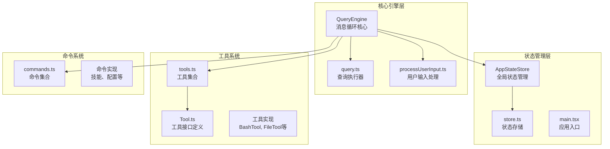
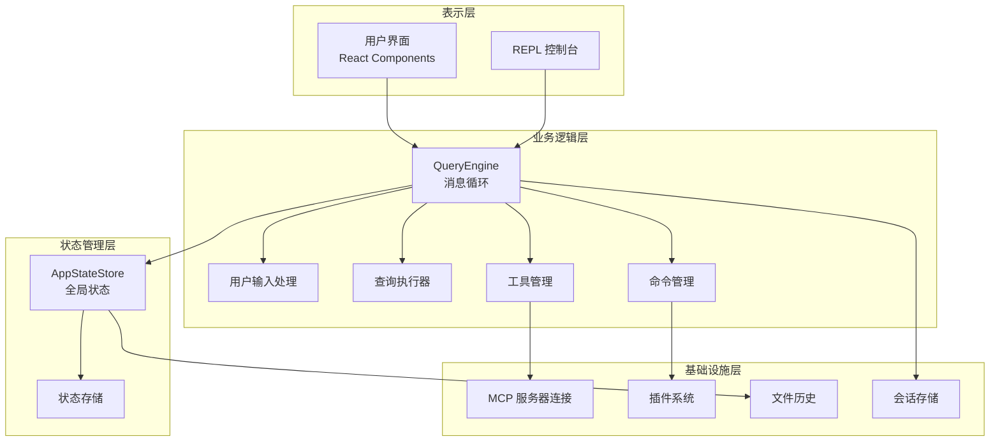
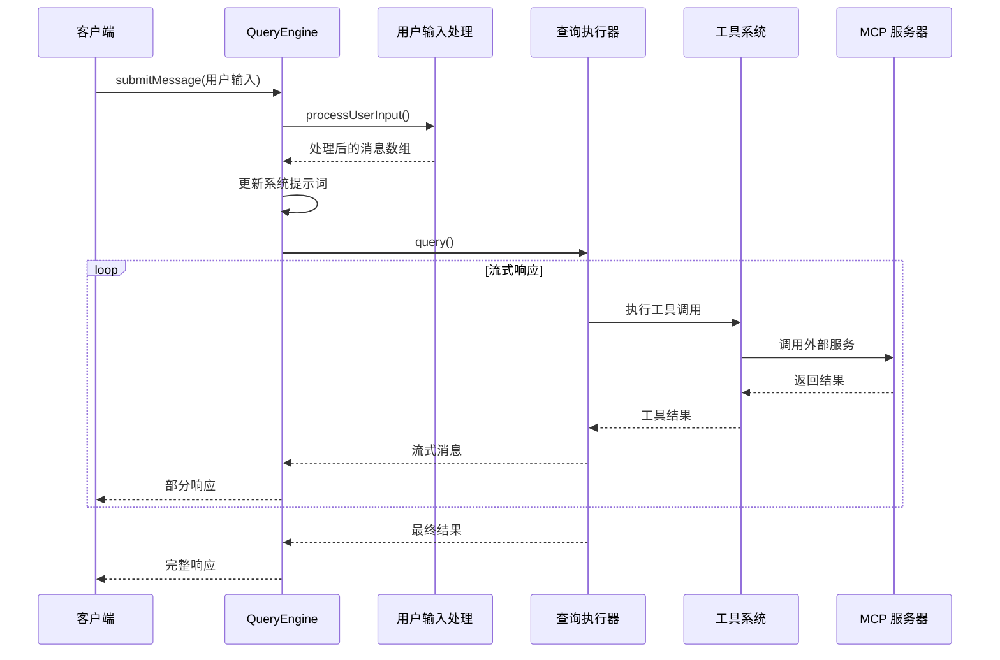
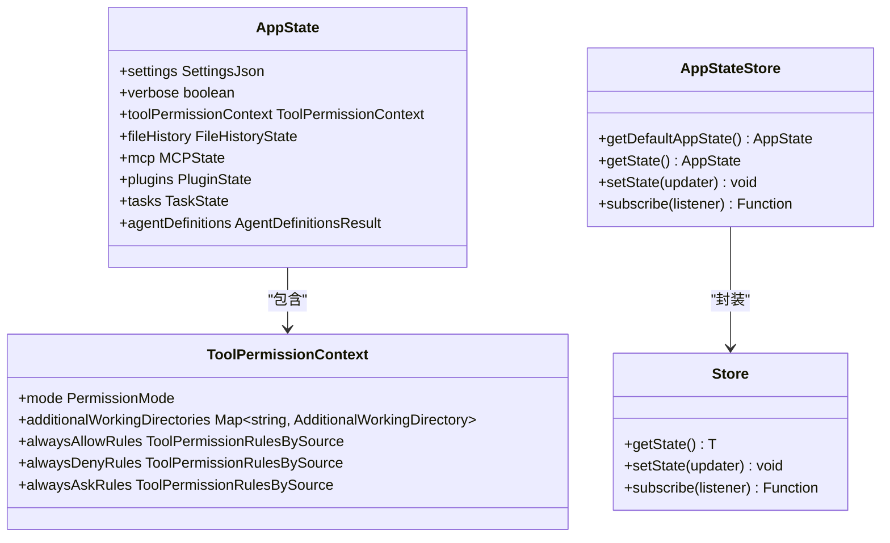
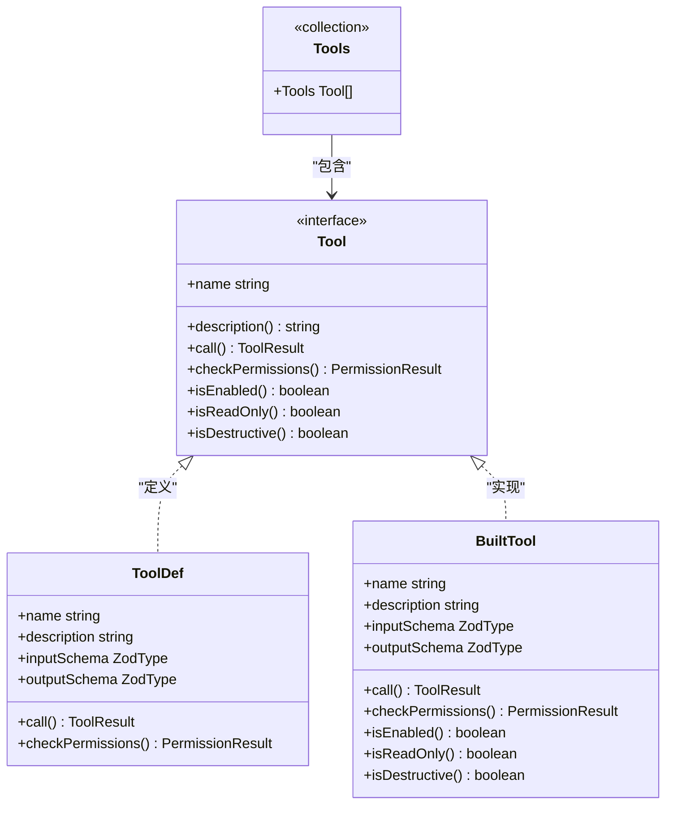
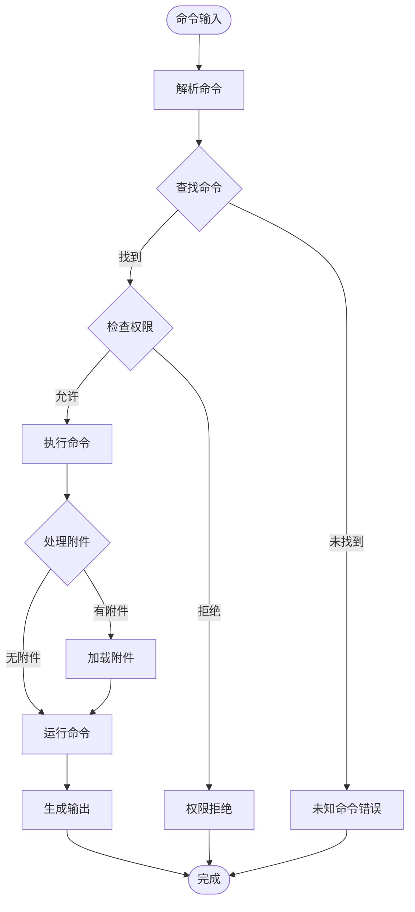
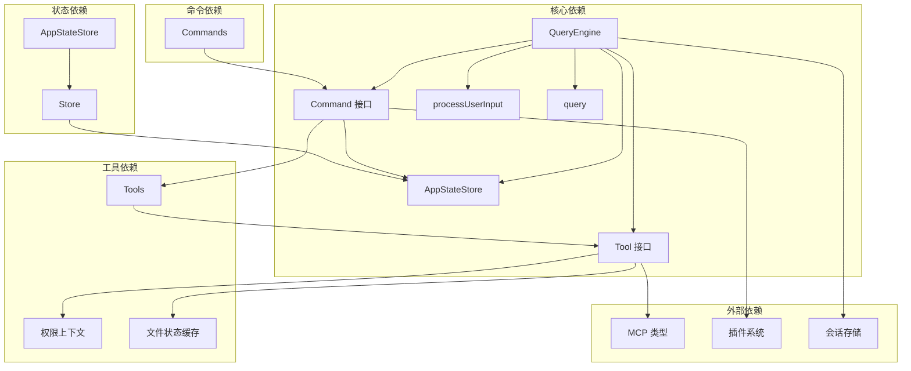

# 核心组件设计

<cite>
**本文档引用的文件**
- [src/QueryEngine.ts](file://src/QueryEngine.ts)
- [src/state/AppStateStore.ts](file://src/state/AppStateStore.ts)
- [src/state/store.ts](file://src/state/store.ts)
- [src/tools.ts](file://src/tools.ts)
- [src/Tool.ts](file://src/Tool.ts)
- [src/commands.ts](file://src/commands.ts)
- [src/utils/processUserInput/processUserInput.ts](file://src/utils/processUserInput/processUserInput.ts)
- [src/query.ts](file://src/query.ts)
- [src/main.tsx](file://src/main.tsx)
</cite>

## 目录
1. [简介](#简介)
2. [项目结构](#项目结构)
3. [核心组件](#核心组件)
4. [架构概览](#架构概览)
5. [详细组件分析](#详细组件分析)
6. [依赖关系分析](#依赖关系分析)
7. [性能考虑](#性能考虑)
8. [故障排除指南](#故障排除指南)
9. [结论](#结论)

## 简介

Claude Code 的核心组件设计围绕着一个强大的查询引擎（QueryEngine）构建，该引擎作为消息循环的核心，负责处理用户输入、工具调用和响应生成。本文档深入分析了四个关键组件的设计原理和实现细节：

- **QueryEngine**：作为消息循环的核心，负责整个查询生命周期的管理
- **AppStateStore**：提供全局状态管理机制，包括状态初始化、更新和持久化
- **工具系统**：支持丰富的工具注册、发现和执行机制
- **命令系统**：实现命令的解析、路由和执行

这些组件通过精心设计的架构实现了高度模块化和可扩展性，为开发者提供了清晰的扩展点和使用模式。

## 项目结构

项目采用模块化的架构设计，主要组件分布在以下目录中：

**图表来源**
- [src/QueryEngine.ts:1-1296](file://src/QueryEngine.ts#L1-L1296)
- [src/state/AppStateStore.ts:1-570](file://src/state/AppStateStore.ts#L1-L570)
- [src/tools.ts:1-390](file://src/tools.ts#L1-L390)
- [src/commands.ts:1-755](file://src/commands.ts#L1-L755)

**章节来源**
- [src/QueryEngine.ts:1-1296](file://src/QueryEngine.ts#L1-L1296)
- [src/state/AppStateStore.ts:1-570](file://src/state/AppStateStore.ts#L1-L570)
- [src/tools.ts:1-390](file://src/tools.ts#L1-L390)
- [src/commands.ts:1-755](file://src/commands.ts#L1-L755)

## 核心组件

### QueryEngine - 消息循环核心

QueryEngine 是整个系统的核心，负责管理查询生命周期和会话状态。它是一个独立的类，可以被 SDK 和 REPL 使用。

**关键特性：**
- 异步生成器模式，支持流式响应
- 完整的消息历史管理和持久化
- 工具权限控制和安全检查
- 多种压缩和优化策略

**主要方法：**
- `submitMessage()`: 处理用户消息并生成响应
- `interrupt()`: 中断当前查询
- `getMessages()`: 获取当前消息历史
- `getSessionId()`: 获取会话标识符

### AppStateStore - 全局状态管理

AppStateStore 提供了一个完整的状态管理系统，包括默认状态初始化、状态更新和持久化机制。

**状态结构：**
- 设置管理（Settings）
- 工具权限上下文（ToolPermissionContext）
- 文件历史记录（FileHistoryState）
- 插件状态（Plugins）
- MCP 连接状态（MCP Servers）

**核心功能：**
- 默认状态工厂函数（getDefaultAppState）
- 深度不可变状态结构
- 计算属性和派生状态
- 状态变更通知机制

### 工具系统架构

工具系统提供了统一的工具抽象，支持内置工具和 MCP 工具的组合。

**工具接口：**
- `Tool` 接口定义了工具的基本能力
- 支持并发安全检查
- 输入验证和权限控制
- 结果渲染和进度报告

**工具装配：**
- `assembleToolPool()`: 组合内置工具和 MCP 工具
- `filterToolsByDenyRules()`: 基于权限规则过滤工具
- 动态工具加载和缓存

### 命令系统实现

命令系统支持多种类型的命令，包括内置命令、插件命令和动态技能。

**命令类型：**
- `prompt` 类型：提示命令，可被模型调用
- `local` 类型：本地命令，仅在客户端执行
- `local-jsx` 类型：本地 JSX 命令，渲染用户界面

**命令发现：**
- 动态技能加载
- 插件命令注册
- 命令缓存和去重

**章节来源**
- [src/QueryEngine.ts:184-1177](file://src/QueryEngine.ts#L184-L1177)
- [src/state/AppStateStore.ts:89-570](file://src/state/AppStateStore.ts#L89-L570)
- [src/tools.ts:193-390](file://src/tools.ts#L193-L390)
- [src/commands.ts:258-517](file://src/commands.ts#L258-L517)

## 架构概览

系统采用分层架构设计，各层职责明确，耦合度低：

**图表来源**
- [src/QueryEngine.ts:1-1296](file://src/QueryEngine.ts#L1-L1296)
- [src/state/AppStateStore.ts:1-570](file://src/state/AppStateStore.ts#L1-L570)
- [src/main.tsx:585-800](file://src/main.tsx#L585-L800)

**章节来源**
- [src/QueryEngine.ts:1-1296](file://src/QueryEngine.ts#L1-L1296)
- [src/state/AppStateStore.ts:1-570](file://src/state/AppStateStore.ts#L1-L570)
- [src/main.tsx:585-800](file://src/main.tsx#L585-L800)

## 详细组件分析

### QueryEngine 实现原理

QueryEngine 作为消息循环的核心，实现了复杂的查询生命周期管理：

**图表来源**
- [src/QueryEngine.ts:209-1156](file://src/QueryEngine.ts#L209-L1156)
- [src/utils/processUserInput/processUserInput.ts:85-270](file://src/utils/processUserInput/processUserInput.ts#L85-L270)
- [src/query.ts:219-1050](file://src/query.ts#L219-L1050)

**核心流程分析：**

1. **用户输入处理阶段**：
   - 解析斜杠命令（/commands）
   - 处理附件和图像内容
   - 应用钩子和权限检查

2. **查询执行阶段**：
   - 构建系统提示词
   - 执行模型推理
   - 管理工具调用序列

3. **响应生成阶段**：
   - 流式消息传输
   - 工具结果处理
   - 最终结果聚合

**章节来源**
- [src/QueryEngine.ts:209-1156](file://src/QueryEngine.ts#L209-L1156)
- [src/utils/processUserInput/processUserInput.ts:85-606](file://src/utils/processUserInput/processUserInput.ts#L85-L606)
- [src/query.ts:219-1730](file://src/query.ts#L219-L1730)

### AppStateStore 状态管理机制

AppStateStore 提供了完整的状态管理解决方案：

**图表来源**
- [src/state/AppStateStore.ts:89-452](file://src/state/AppStateStore.ts#L89-L452)
- [src/state/store.ts:4-34](file://src/state/store.ts#L4-L34)

**状态管理特点：**

1. **深度不可变性**：使用 DeepImmutable 类型确保状态的不可变性
2. **计算属性**：通过 getter 函数提供派生状态
3. **订阅机制**：支持状态变更通知
4. **默认值工厂**：提供完整的默认状态初始化

**章节来源**
- [src/state/AppStateStore.ts:1-570](file://src/state/AppStateStore.ts#L1-L570)
- [src/state/store.ts:1-35](file://src/state/store.ts#L1-L35)

### 工具系统架构设计

工具系统提供了统一的抽象层，支持多种工具类型：

**图表来源**
- [src/Tool.ts:362-793](file://src/Tool.ts#L362-L793)
- [src/tools.ts:193-390](file://src/tools.ts#L193-L390)

**工具系统特性：**

1. **统一接口**：所有工具实现相同的接口
2. **类型安全**：使用 Zod 模式进行输入输出验证
3. **权限控制**：集成到权限系统中
4. **并发安全**：支持并发安全检查
5. **动态装配**：支持运行时工具组合

**章节来源**
- [src/Tool.ts:1-793](file://src/Tool.ts#L1-L793)
- [src/tools.ts:1-390](file://src/tools.ts#L1-L390)

### 命令系统实现

命令系统支持多种命令类型和动态加载：

**图表来源**
- [src/commands.ts:258-517](file://src/commands.ts#L258-L517)
- [src/utils/processUserInput/processUserInput.ts:422-551](file://src/utils/processUserInput/processUserInput.ts#L422-L551)

**命令系统特性：**

1. **多类型支持**：支持提示命令、本地命令和 JSX 命令
2. **动态加载**：支持技能目录和插件命令的动态加载
3. **权限控制**：集成到权限系统中
4. **缓存机制**：使用 memoize 进行性能优化
5. **可用性检查**：根据认证状态和提供商要求过滤命令

**章节来源**
- [src/commands.ts:1-755](file://src/commands.ts#L1-L755)
- [src/utils/processUserInput/processUserInput.ts:1-606](file://src/utils/processUserInput/processUserInput.ts#L1-L606)

## 依赖关系分析

系统采用模块化设计，各组件之间的依赖关系清晰：

**图表来源**
- [src/QueryEngine.ts:1-1296](file://src/QueryEngine.ts#L1-L1296)
- [src/tools.ts:1-390](file://src/tools.ts#L1-L390)
- [src/commands.ts:1-755](file://src/commands.ts#L1-L755)
- [src/state/AppStateStore.ts:1-570](file://src/state/AppStateStore.ts#L1-L570)

**依赖特点：**

1. **单向依赖**：避免循环依赖
2. **接口隔离**：通过接口定义依赖关系
3. **模块化**：每个模块职责单一
4. **可测试性**：支持依赖注入和模拟

**章节来源**
- [src/QueryEngine.ts:1-1296](file://src/QueryEngine.ts#L1-L1296)
- [src/tools.ts:1-390](file://src/tools.ts#L1-L390)
- [src/commands.ts:1-755](file://src/commands.ts#L1-L755)

## 性能考虑

系统在设计时充分考虑了性能优化：

### 缓存策略
- **命令缓存**：使用 memoize 缓存命令列表
- **工具缓存**：缓存工具装配结果
- **技能缓存**：缓存动态技能发现结果

### 内存管理
- **消息历史压缩**：支持历史消息压缩和清理
- **文件状态缓存**：LRU 缓存文件状态
- **工具结果预算**：限制工具结果大小

### 并发优化
- **异步生成器**：支持流式响应
- **并行处理**：图片处理和附件加载并行执行
- **取消支持**：支持查询中断

## 故障排除指南

### 常见问题诊断

1. **工具调用失败**
   - 检查工具权限设置
   - 验证工具输入参数
   - 查看工具执行日志

2. **命令执行异常**
   - 确认命令可用性检查
   - 检查命令参数格式
   - 验证命令权限

3. **状态同步问题**
   - 检查状态变更监听器
   - 验证状态更新函数
   - 确认状态持久化

**章节来源**
- [src/QueryEngine.ts:1050-1156](file://src/QueryEngine.ts#L1050-L1156)
- [src/state/AppStateStore.ts:1-570](file://src/state/AppStateStore.ts#L1-L570)

## 结论

Claude Code 的核心组件设计展现了现代应用程序架构的最佳实践：

1. **模块化设计**：清晰的职责分离和接口定义
2. **状态管理**：完整的状态生命周期管理
3. **扩展性**：灵活的工具和命令系统
4. **性能优化**：多层缓存和异步处理
5. **安全性**：完善的权限控制和错误处理

这些设计原则为开发者提供了清晰的扩展路径和使用模式，使得系统既易于理解和维护，又具备强大的功能和良好的性能表现。