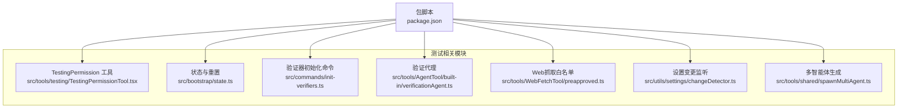
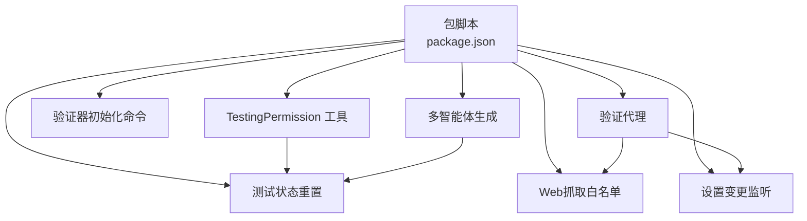
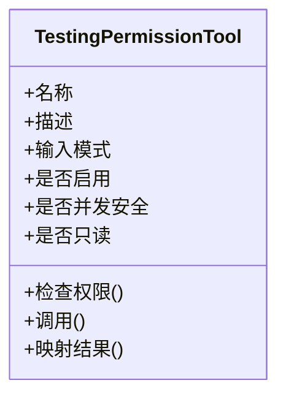
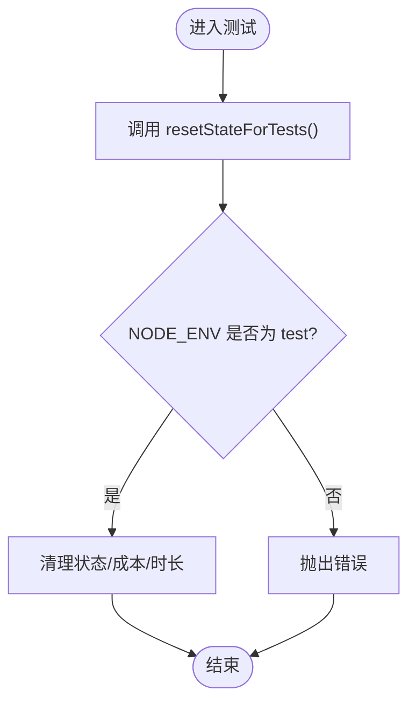
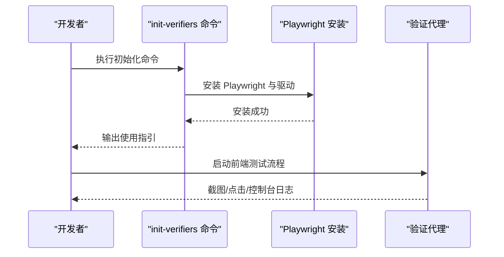
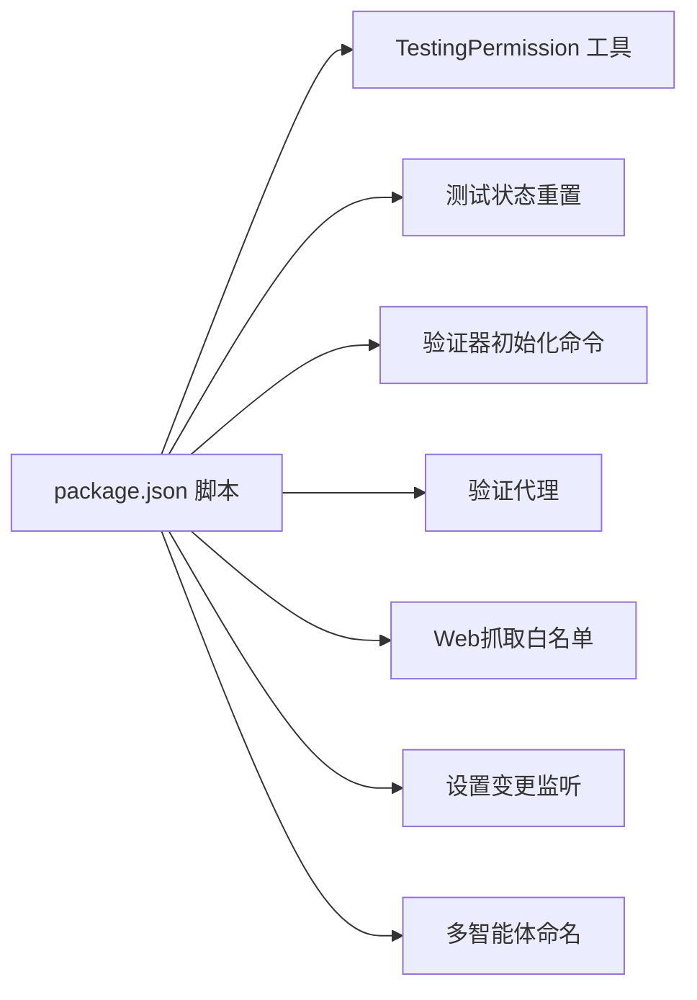

# 测试策略

<cite>
**本文引用的文件**
- [package.json](file://package.json)
- [src/tools/testing/TestingPermissionTool.tsx](file://src/tools/testing/TestingPermissionTool.tsx)
- [src/bootstrap/state.ts](file://src/bootstrap/state.ts)
- [src/commands/init-verifiers.ts](file://src/commands/init-verifiers.ts)
- [src/tools/AgentTool/built-in/verificationAgent.ts](file://src/tools/AgentTool/built-in/verificationAgent.ts)
- [src/tools/WebFetchTool/preapproved.ts](file://src/tools/WebFetchTool/preapproved.ts)
- [src/utils/settings/changeDetector.ts](file://src/utils/settings/changeDetector.ts)
- [src/tools/shared/spawnMultiAgent.ts](file://src/tools/shared/spawnMultiAgent.ts)
- [README.md](file://README.md)
- [README_CN.md](file://README_CN.md)
</cite>

## 目录
1. [引言](#引言)
2. [项目结构](#项目结构)
3. [核心组件](#核心组件)
4. [架构总览](#架构总览)
5. [详细组件分析](#详细组件分析)
6. [依赖分析](#依赖分析)
7. [性能考虑](#性能考虑)
8. [故障排查指南](#故障排查指南)
9. [结论](#结论)
10. [附录](#附录)

## 引言
本文件面向Claude Code的测试策略，系统化阐述测试架构设计、组织结构与实施路径，覆盖单元测试、集成测试、性能与压力测试、测试数据管理、测试自动化与持续集成、测试覆盖率评估与改进、以及测试环境的搭建与维护。文档以仓库中实际存在的源码为依据，结合现有脚本与工具，给出可落地的建议与流程。

## 项目结构
从测试视角看，项目包含以下关键区域：
- 工具与权限：用于端到端测试的专用工具（如TestingPermission）与权限检查机制
- 状态与重置：测试专用的状态重置与成本/时长状态清理
- 命令与验证器：初始化前端/Playwright验证器的命令与提示
- 验证代理：内置的验证Agent，指导如何进行浏览器自动化与前端测试
- 网络抓取白名单：预批准站点列表，便于Web抓取与测试
- 设置监听：文件变更检测在测试场景下的行为与阈值
- 多智能体生成：团队成员命名与唯一性生成，支持多Agent测试场景
- 文档与说明：README中对溢出测试工具等的说明

图表来源
- [package.json:1-21](file://package.json#L1-L21)
- [src/tools/testing/TestingPermissionTool.tsx:1-74](file://src/tools/testing/TestingPermissionTool.tsx#L1-L74)
- [src/bootstrap/state.ts:917-943](file://src/bootstrap/state.ts#L917-L943)
- [src/commands/init-verifiers.ts:78-81](file://src/commands/init-verifiers.ts#L78-L81)
- [src/tools/AgentTool/built-in/verificationAgent.ts:21-58](file://src/tools/AgentTool/built-in/verificationAgent.ts#L21-L58)
- [src/tools/WebFetchTool/preapproved.ts:51](file://src/tools/WebFetchTool/preapproved.ts#L51)
- [src/utils/settings/changeDetector.ts:103-130](file://src/utils/settings/changeDetector.ts#L103-L130)
- [src/tools/shared/spawnMultiAgent.ts:267-294](file://src/tools/shared/spawnMultiAgent.ts#L267-L294)

章节来源
- [package.json:1-21](file://package.json#L1-L21)
- [src/tools/testing/TestingPermissionTool.tsx:1-74](file://src/tools/testing/TestingPermissionTool.tsx#L1-L74)
- [src/bootstrap/state.ts:917-943](file://src/bootstrap/state.ts#L917-L943)
- [src/commands/init-verifiers.ts:78-81](file://src/commands/init-verifiers.ts#L78-L81)
- [src/tools/AgentTool/built-in/verificationAgent.ts:21-58](file://src/tools/AgentTool/built-in/verificationAgent.ts#L21-L58)
- [src/tools/WebFetchTool/preapproved.ts:51](file://src/tools/WebFetchTool/preapproved.ts#L51)
- [src/utils/settings/changeDetector.ts:103-130](file://src/utils/settings/changeDetector.ts#L103-L130)
- [src/tools/shared/spawnMultiAgent.ts:267-294](file://src/tools/shared/spawnMultiAgent.ts#L267-L294)

## 核心组件
- 测试专用工具：TestingPermission工具在“生产=测试”条件下启用，用于触发权限弹窗，便于端到端测试
- 测试状态重置：提供resetStateForTests与resetTotalDurationStateAndCost_FOR_TESTS_ONLY等函数，确保测试间隔离
- 验证器初始化：init-verifiers命令提供Playwright安装与使用指引，支持web UI与前端验证
- 验证代理：verificationAgent指导如何启动真实浏览器、截图、点击、读取控制台并运行前端测试
- Web抓取白名单：preapproved.ts列出受信任域名，便于抓取与测试
- 设置监听：changeDetector在测试场景下可调整稳定性阈值与轮询间隔
- 多智能体命名：generateUniqueTeammateName确保团队成员名称唯一，支持多Agent并发测试

章节来源
- [src/tools/testing/TestingPermissionTool.tsx:27-42](file://src/tools/testing/TestingPermissionTool.tsx#L27-L42)
- [src/bootstrap/state.ts:917-943](file://src/bootstrap/state.ts#L917-L943)
- [src/commands/init-verifiers.ts:78-81](file://src/commands/init-verifiers.ts#L78-L81)
- [src/tools/AgentTool/built-in/verificationAgent.ts:21-58](file://src/tools/AgentTool/built-in/verificationAgent.ts#L21-L58)
- [src/tools/WebFetchTool/preapproved.ts:51](file://src/tools/WebFetchTool/preapproved.ts#L51)
- [src/utils/settings/changeDetector.ts:103-130](file://src/utils/settings/changeDetector.ts#L103-L130)
- [src/tools/shared/spawnMultiAgent.ts:267-294](file://src/tools/shared/spawnMultiAgent.ts#L267-L294)

## 架构总览
测试体系围绕“工具-状态-验证-网络-设置-多智能体”的协同展开，通过包脚本统一入口，结合内置工具与验证Agent完成端到端验证，并利用白名单与设置监听提升测试稳定性与可控性。

图表来源
- [package.json:1-21](file://package.json#L1-L21)
- [src/tools/testing/TestingPermissionTool.tsx:27-42](file://src/tools/testing/TestingPermissionTool.tsx#L27-L42)
- [src/bootstrap/state.ts:917-943](file://src/bootstrap/state.ts#L917-L943)
- [src/commands/init-verifiers.ts:78-81](file://src/commands/init-verifiers.ts#L78-L81)
- [src/tools/AgentTool/built-in/verificationAgent.ts:21-58](file://src/tools/AgentTool/built-in/verificationAgent.ts#L21-L58)
- [src/tools/WebFetchTool/preapproved.ts:51](file://src/tools/WebFetchTool/preapproved.ts#L51)
- [src/utils/settings/changeDetector.ts:103-130](file://src/utils/settings/changeDetector.ts#L103-L130)
- [src/tools/shared/spawnMultiAgent.ts:267-294](file://src/tools/shared/spawnMultiAgent.ts#L267-L294)

## 详细组件分析

### TestingPermission 工具
- 设计目的：在测试环境中强制触发权限弹窗，验证权限流程与端到端链路
- 启用条件：仅当“生产=测试”时启用
- 行为特征：始终要求权限，返回固定结果消息，适合断言与回归测试
- 适用场景：需要验证权限拦截、用户交互与后续流程的端到端测试

图表来源
- [src/tools/testing/TestingPermissionTool.tsx:9-74](file://src/tools/testing/TestingPermissionTool.tsx#L9-L74)

章节来源
- [src/tools/testing/TestingPermissionTool.tsx:27-42](file://src/tools/testing/TestingPermissionTool.tsx#L27-L42)
- [src/tools/testing/TestingPermissionTool.tsx:61-65](file://src/tools/testing/TestingPermissionTool.tsx#L61-L65)

### 测试状态重置
- 提供resetStateForTests与resetTotalDurationStateAndCost_FOR_TESTS_ONLY等函数，确保测试间状态隔离
- 在测试环境下抛出错误以防止误用，保证测试一致性
- 适用于长时间运行或高并发测试，避免状态漂移影响结果

图表来源
- [src/bootstrap/state.ts:917-943](file://src/bootstrap/state.ts#L917-L943)

章节来源
- [src/bootstrap/state.ts:917-943](file://src/bootstrap/state.ts#L917-L943)

### 验证器初始化命令（Playwright）
- 提供跨包管理器的Playwright安装与安装指引
- 支持web UI测试与前端验证，便于在真实浏览器中执行端到端验证
- 与验证代理配合，形成“安装-启动-验证-截图-断言”的闭环

图表来源
- [src/commands/init-verifiers.ts:78-81](file://src/commands/init-verifiers.ts#L78-L81)
- [src/tools/AgentTool/built-in/verificationAgent.ts:21-58](file://src/tools/AgentTool/built-in/verificationAgent.ts#L21-L58)

章节来源
- [src/commands/init-verifiers.ts:78-81](file://src/commands/init-verifiers.ts#L78-L81)
- [src/tools/AgentTool/built-in/verificationAgent.ts:21-58](file://src/tools/AgentTool/built-in/verificationAgent.ts#L21-L58)

### Web 抓取白名单
- 列表包含受信任域名，便于在测试中抓取页面资源
- 与验证代理配合，先抓取页面子资源，再运行前端测试，提高测试鲁棒性

章节来源
- [src/tools/WebFetchTool/preapproved.ts:51](file://src/tools/WebFetchTool/preapproved.ts#L51)

### 设置变更监听（测试场景）
- changeDetector在测试场景下可调整稳定性阈值与轮询间隔，提升文件监控的可靠性
- 忽略特殊文件类型与.git目录，仅关注受控设置文件，减少噪声

章节来源
- [src/utils/settings/changeDetector.ts:103-130](file://src/utils/settings/changeDetector.ts#L103-L130)

### 多智能体命名（并发测试）
- generateUniqueTeammateName根据团队文件中的现有成员名生成唯一名称
- 支持并发测试场景下的多Agent隔离与并行执行

章节来源
- [src/tools/shared/spawnMultiAgent.ts:267-294](file://src/tools/shared/spawnMultiAgent.ts#L267-L294)

## 依赖分析
- 包脚本作为统一入口，协调各测试组件
- TestingPermission依赖工具框架与权限回调
- 验证代理依赖Playwright与受信任站点白名单
- 设置监听依赖文件系统与平台路径处理
- 多智能体命名依赖团队文件读取与集合去重

图表来源
- [package.json:1-21](file://package.json#L1-L21)
- [src/tools/testing/TestingPermissionTool.tsx:27-42](file://src/tools/testing/TestingPermissionTool.tsx#L27-L42)
- [src/bootstrap/state.ts:917-943](file://src/bootstrap/state.ts#L917-L943)
- [src/commands/init-verifiers.ts:78-81](file://src/commands/init-verifiers.ts#L78-L81)
- [src/tools/AgentTool/built-in/verificationAgent.ts:21-58](file://src/tools/AgentTool/built-in/verificationAgent.ts#L21-L58)
- [src/tools/WebFetchTool/preapproved.ts:51](file://src/tools/WebFetchTool/preapproved.ts#L51)
- [src/utils/settings/changeDetector.ts:103-130](file://src/utils/settings/changeDetector.ts#L103-L130)
- [src/tools/shared/spawnMultiAgent.ts:267-294](file://src/tools/shared/spawnMultiAgent.ts#L267-L294)

章节来源
- [package.json:1-21](file://package.json#L1-L21)

## 性能考虑
- 单元测试：优先使用内存态与最小依赖，避免外部I/O；对状态重置函数进行基准测试，确保快速复位
- 集成测试：合理设置设置监听的稳定性阈值与轮询间隔，减少无效扫描；对Web抓取白名单进行缓存与去重
- 端到端测试：使用Playwright时，尽量并行执行不相互干扰的测试套件；对截图与控制台日志进行异步聚合
- 多智能体测试：通过唯一命名与并行调度降低冲突；对共享资源加锁或分片

## 故障排查指南
- 权限相关问题：确认TestingPermission在测试环境启用；检查权限回调行为与消息内容
- 状态污染：确保每次测试后调用测试状态重置函数；避免在非测试环境调用
- Playwright安装失败：参考init-verifiers命令输出，按包管理器选择对应安装指令
- 文件监控异常：检查设置监听忽略规则与平台路径格式；调整稳定性阈值与轮询间隔
- 多智能体冲突：核对团队文件与成员名集合，确保唯一性生成逻辑正确

章节来源
- [src/tools/testing/TestingPermissionTool.tsx:27-42](file://src/tools/testing/TestingPermissionTool.tsx#L27-L42)
- [src/bootstrap/state.ts:917-943](file://src/bootstrap/state.ts#L917-L943)
- [src/commands/init-verifiers.ts:78-81](file://src/commands/init-verifiers.ts#L78-L81)
- [src/utils/settings/changeDetector.ts:103-130](file://src/utils/settings/changeDetector.ts#L103-L130)
- [src/tools/shared/spawnMultiAgent.ts:267-294](file://src/tools/shared/spawnMultiAgent.ts#L267-L294)

## 结论
本测试策略以TestingPermission工具、测试状态重置、验证器初始化、验证代理、Web抓取白名单、设置监听与多智能体命名为核心，结合包脚本统一入口，构建了从单元到端到端的完整测试体系。建议在持续集成中引入Playwright与受控设置监听，配合状态重置与白名单策略，保障测试稳定性与可重复性。

## 附录
- README中关于溢出测试工具的说明可用于扩展压力测试场景
- README多语言版本可作为国际化测试的参考

章节来源
- [README.md:143](file://README.md#L143)
- [README_CN.md:126](file://README_CN.md#L126)