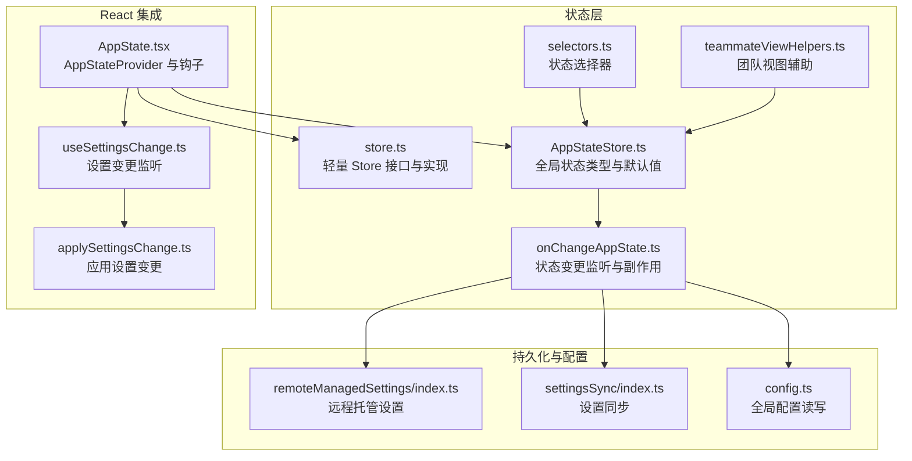
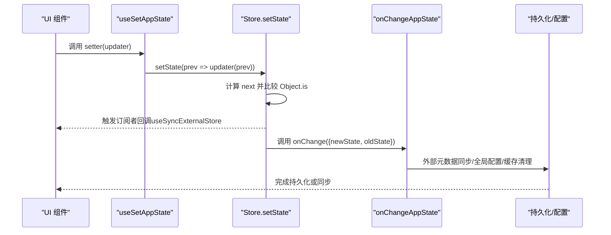
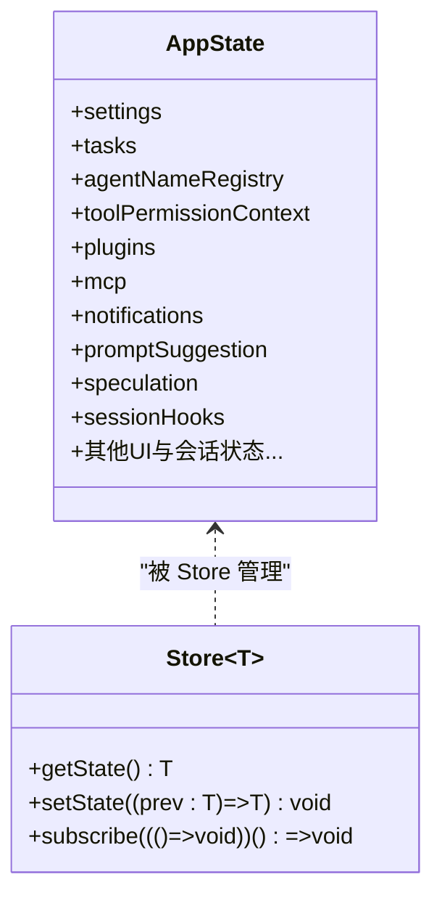
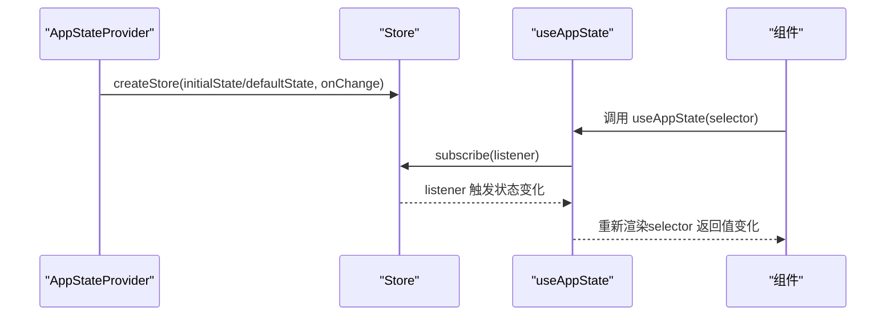
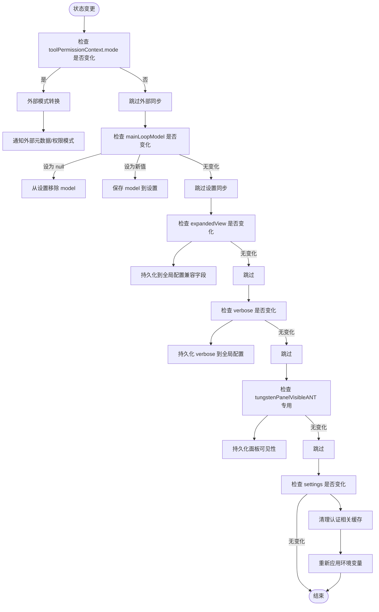
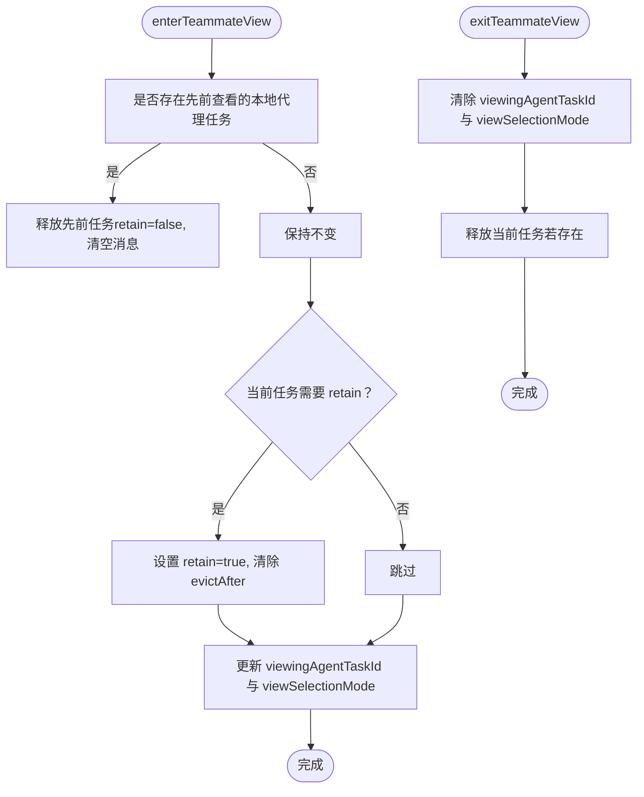
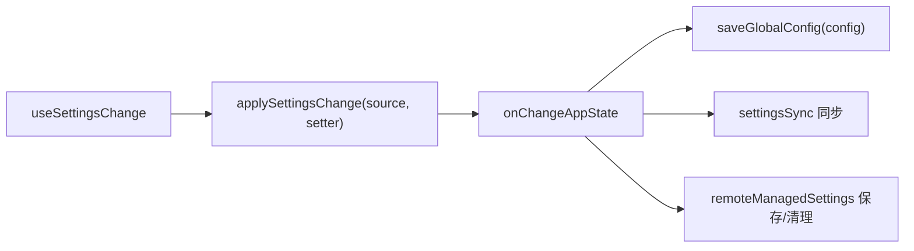
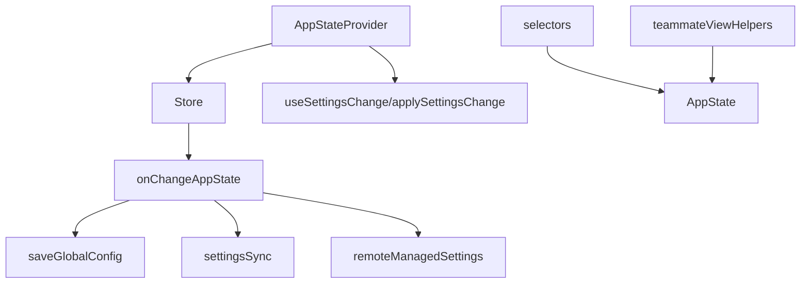

# 状态管理系统

<cite>
**本文引用的文件**
- [AppStateStore.ts](file://src/state/AppStateStore.ts)
- [AppState.tsx](file://src/state/AppState.tsx)
- [store.ts](file://src/state/store.ts)
- [selectors.ts](file://src/state/selectors.ts)
- [onChangeAppState.ts](file://src/state/onChangeAppState.ts)
- [teammateViewHelpers.ts](file://src/state/teammateViewHelpers.ts)
- [config.ts](file://src/utils/config.ts)
- [settingsSync/index.ts](file://src/services/settingsSync/index.ts)
- [remoteManagedSettings/index.ts](file://src/services/remoteManagedSettings/index.ts)
- [useSettingsChange.ts](file://src/hooks/useSettingsChange.ts)
- [applySettingsChange.ts](file://src/utils/settings/applySettingsChange.ts)
- [sessionHooks.ts](file://src/utils/hooks/sessionHooks.ts)
</cite>

## 目录
1. [简介](#简介)
2. [项目结构](#项目结构)
3. [核心组件](#核心组件)
4. [架构总览](#架构总览)
5. [详细组件分析](#详细组件分析)
6. [依赖关系分析](#依赖关系分析)
7. [性能考量](#性能考量)
8. [故障排查指南](#故障排查指南)
9. [结论](#结论)
10. [附录](#附录)

## 简介
本文件系统性阐述 Claude Code 的状态管理系统，重点围绕全局状态架构、AppStateStore 的结构与行为、React 钩子的使用与状态派发模式、状态持久化策略、状态选择器设计与性能优化、最佳实践与常见问题、调试与监控方法，以及状态与 UI 组件的集成方式。目标是帮助开发者在不深入源码的前提下，也能高效理解并正确使用该状态体系。

## 项目结构
状态管理相关代码主要集中在 src/state 目录，并与工具函数、设置同步服务、会话钩子等模块协同工作：
- 全局状态定义与默认值：AppStateStore.ts
- React Provider 与钩子：AppState.tsx
- 轻量级 Store 实现：store.ts
- 状态变更监听与副作用：onChangeAppState.ts
- 状态选择器（派生计算）：selectors.ts
- 团队视图辅助逻辑：teammateViewHelpers.ts
- 持久化与配置：config.ts、settingsSync/index.ts、remoteManagedSettings/index.ts
- 设置变更监听与应用：useSettingsChange.ts、applySettingsChange.ts
- 会话钩子清理：sessionHooks.ts

**图表来源**
- [AppStateStore.ts:89-452](file://src/state/AppStateStore.ts#L89-L452)
- [store.ts:4-8](file://src/state/store.ts#L4-L8)
- [onChangeAppState.ts:43-171](file://src/state/onChangeAppState.ts#L43-L171)
- [selectors.ts:1-77](file://src/state/selectors.ts#L1-L77)
- [teammateViewHelpers.ts:46-141](file://src/state/teammateViewHelpers.ts#L46-L141)
- [AppState.tsx:27-110](file://src/state/AppState.tsx#L27-L110)
- [useSettingsChange.ts](file://src/hooks/useSettingsChange.ts)
- [applySettingsChange.ts](file://src/utils/settings/applySettingsChange.ts)
- [config.ts:797-808](file://src/utils/config.ts#L797-L808)
- [settingsSync/index.ts:423-536](file://src/services/settingsSync/index.ts#L423-L536)
- [remoteManagedSettings/index.ts:367-408](file://src/services/remoteManagedSettings/index.ts#L367-L408)

**章节来源**
- [AppStateStore.ts:89-452](file://src/state/AppStateStore.ts#L89-L452)
- [AppState.tsx:27-110](file://src/state/AppState.tsx#L27-L110)
- [store.ts:10-34](file://src/state/store.ts#L10-L34)
- [onChangeAppState.ts:43-171](file://src/state/onChangeAppState.ts#L43-L171)
- [selectors.ts:1-77](file://src/state/selectors.ts#L1-L77)
- [teammateViewHelpers.ts:46-141](file://src/state/teammateViewHelpers.ts#L46-L141)
- [config.ts:797-808](file://src/utils/config.ts#L797-L808)
- [settingsSync/index.ts:423-536](file://src/services/settingsSync/index.ts#L423-L536)
- [remoteManagedSettings/index.ts:367-408](file://src/services/remoteManagedSettings/index.ts#L367-L408)

## 核心组件
- AppStateStore：定义全局状态 AppState 的完整结构，包含设置、任务、插件、MCP、通知、权限上下文、提示建议、推测状态、遥测与 UI 状态等字段；提供 getDefaultAppState 初始化默认值。
- Store 接口与实现：提供 getState、setState、subscribe 三件套，支持变更监听与批量订阅。
- AppStateProvider 与钩子：通过 React Context 提供状态访问；useAppState 以 selector 形式订阅状态切片；useSetAppState 获取稳定不变的 setter；useAppStateStore 直接暴露 Store。
- onChangeAppState：集中处理状态变更副作用，如外部元数据同步、全局配置持久化、权限模式广播、缓存清理等。
- 选择器：纯函数从 AppState 派生计算结果，避免在组件中重复编写派生逻辑。
- 辅助逻辑：团队视图切换、任务保留与回收、会话钩子清理等。

**章节来源**
- [AppStateStore.ts:89-452](file://src/state/AppStateStore.ts#L89-L452)
- [store.ts:4-34](file://src/state/store.ts#L4-L34)
- [AppState.tsx:142-179](file://src/state/AppState.tsx#L142-L179)
- [onChangeAppState.ts:43-171](file://src/state/onChangeAppState.ts#L43-L171)
- [selectors.ts:1-77](file://src/state/selectors.ts#L1-L77)
- [teammateViewHelpers.ts:46-141](file://src/state/teammateViewHelpers.ts#L46-L141)

## 架构总览
该状态系统采用“轻 Store + React 集成 + 副作用集中处理”的分层设计：
- 数据层：Store 封装状态与订阅，确保不可变更新与最小化重渲染。
- 视图层：AppStateProvider 为整个应用注入状态上下文；useAppState 以 selector 订阅切片，useSyncExternalStore 与 React 协作实现细粒度重渲染。
- 副作用层：onChangeAppState 在状态变更时统一执行外部同步、持久化、缓存清理等操作，避免分散更新导致的不一致。
- 工具层：选择器、团队视图辅助、设置监听与应用等模块解耦业务逻辑。

**图表来源**
- [AppState.tsx:170-172](file://src/state/AppState.tsx#L170-L172)
- [store.ts:20-27](file://src/state/store.ts#L20-L27)
- [onChangeAppState.ts:43-171](file://src/state/onChangeAppState.ts#L43-L171)

## 详细组件分析

### AppStateStore：全局状态定义与默认值
- 结构要点
  - settings：用户设置与环境变量
  - tasks：任务状态映射
  - agentNameRegistry：按名称路由的代理注册表
  - 权限与桥接：toolPermissionContext、replBridge* 系列
  - 插件与 MCP：enabled/disabled 列表、资源、命令、错误
  - 通知与提示：notifications、promptSuggestion
  - 推测与效率：speculation、speculationSessionTimeSavedMs
  - 会话钩子：sessionHooks
  - 其他：inbox、workerSandboxPermissions、pending* 请求、teammate 视图、fastMode、advisorModel、effortValue、ultraplan* 等
- 默认值：getDefaultAppState 基于运行时条件（如是否处于团队模式）初始化权限模式、思考模式、提示建议开关等

**图表来源**
- [AppStateStore.ts:89-452](file://src/state/AppStateStore.ts#L89-L452)
- [store.ts:4-8](file://src/state/store.ts#L4-L8)

**章节来源**
- [AppStateStore.ts:89-452](file://src/state/AppStateStore.ts#L89-L452)
- [AppStateStore.ts:456-569](file://src/state/AppStateStore.ts#L456-L569)

### Store 接口与实现：不可变更新与订阅
- 不可变更新：setState 接受 updater(prev)，返回 next；若 Object.is(next, prev) 则短路，避免无效重渲染
- 订阅机制：subscribe 返回取消函数；每次状态变更触发所有监听器
- 适用场景：AppStateStore 的 setState 与 onChange 配合，实现集中副作用

**章节来源**
- [store.ts:10-34](file://src/state/store.ts#L10-L34)

### AppStateProvider 与 React 钩子：订阅与派发
- AppStateProvider
  - 创建 Store（初始状态或默认值），注入上下文
  - 在挂载后检查并禁用可能被远程设置覆盖的旁路权限模式
  - 将设置变更应用到 AppState（通过 useSettingsChange 与 applySettingsChange）
- useAppState(selector)
  - 通过 useSyncExternalStore 订阅切片，仅当 selector 返回值变化时重渲染
  - 严禁返回原状态对象，应返回现有子引用以保证 Object.is 比较有效
- useSetAppState()
  - 返回稳定 setter 引用，避免因闭包导致的额外重渲染
- useAppStateStore()
  - 直接获取 Store，用于非 React 场景或需要直接调用 getState/setState 的地方
- useAppStateMaybeOutsideOfProvider(selector)
  - 安全版本：在 Provider 外部返回 undefined，避免抛错

**图表来源**
- [AppState.tsx:37-110](file://src/state/AppState.tsx#L37-L110)
- [AppState.tsx:142-179](file://src/state/AppState.tsx#L142-L179)

**章节来源**
- [AppState.tsx:37-110](file://src/state/AppState.tsx#L37-L110)
- [AppState.tsx:142-179](file://src/state/AppState.tsx#L142-L179)
- [useSettingsChange.ts](file://src/hooks/useSettingsChange.ts)
- [applySettingsChange.ts](file://src/utils/settings/applySettingsChange.ts)

### onChangeAppState：状态变更监听与副作用
- 权限模式同步：将内部模式转换为对外模式，必要时向外部（CCR/SDK）广播
- 主循环模型持久化：当 mainLoopModel 变更时，同步到设置并覆盖主循环模型
- UI 展开视图持久化：expandedView 变更时同步到全局配置（兼容旧字段）
- verbose 与面板可见性：根据变更保存到全局配置
- 设置变更副作用：清除认证相关缓存、重新应用环境变量
- 其他：ultraplan 模式标记、外部元数据恢复等

**图表来源**
- [onChangeAppState.ts:43-171](file://src/state/onChangeAppState.ts#L43-L171)

**章节来源**
- [onChangeAppState.ts:43-171](file://src/state/onChangeAppState.ts#L43-L171)

### 状态选择器：派生计算与性能优化
- 设计原则：纯函数、无副作用、只做数据提取
- 示例
  - getViewedTeammateTask：从 viewingAgentTaskId 与 tasks 中安全提取当前查看的团队成员任务
  - getActiveAgentForInput：根据当前视图与任务类型，决定输入路由到 leader、已查看代理或命名代理
- 性能优化建议
  - 使用 useAppState 的 selector 返回现有对象引用，避免每次返回新对象导致 Object.is 总是不同
  - 对复杂派生逻辑可结合 memoization（见工具层）进行缓存

**章节来源**
- [selectors.ts:1-77](file://src/state/selectors.ts#L1-L77)

### 团队视图辅助：任务保留与回收
- enterTeammateView：进入团队视图时，对本地代理任务进行 retain 标记、清空消息、取消驱逐时间；必要时释放先前查看的任务
- exitTeammateView：退出团队视图时，清除查看状态并释放任务回桩状态
- stopOrDismissAgent：根据任务状态执行中或终止，分别中断或立即驱逐；若正在查看该代理，同时退出视图

**图表来源**
- [teammateViewHelpers.ts:46-141](file://src/state/teammateViewHelpers.ts#L46-L141)

**章节来源**
- [teammateViewHelpers.ts:46-141](file://src/state/teammateViewHelpers.ts#L46-L141)

### 状态持久化：策略与实现
- 全局配置持久化
  - saveGlobalConfig：原子式更新全局配置，避免写入丢失认证/引导状态
  - detectCorruption：检测文件损坏或截断导致的回退，防止永久丢失状态
- 设置同步
  - settingsSync：跨设备同步用户设置与记忆，支持项目级与全局级
  - remoteManagedSettings：远程托管设置的保存与清理，带错误忽略与后台轮询停止
- 设置变更应用
  - useSettingsChange + applySettingsChange：监听设置变更并应用到 AppState，确保外部一致性

**图表来源**
- [onChangeAppState.ts:154-170](file://src/state/onChangeAppState.ts#L154-L170)
- [config.ts:797-808](file://src/utils/config.ts#L797-L808)
- [settingsSync/index.ts:423-536](file://src/services/settingsSync/index.ts#L423-L536)
- [remoteManagedSettings/index.ts:367-408](file://src/services/remoteManagedSettings/index.ts#L367-L408)
- [useSettingsChange.ts](file://src/hooks/useSettingsChange.ts)
- [applySettingsChange.ts](file://src/utils/settings/applySettingsChange.ts)

**章节来源**
- [config.ts:797-808](file://src/utils/config.ts#L797-L808)
- [settingsSync/index.ts:423-536](file://src/services/settingsSync/index.ts#L423-L536)
- [remoteManagedSettings/index.ts:367-408](file://src/services/remoteManagedSettings/index.ts#L367-L408)
- [useSettingsChange.ts](file://src/hooks/useSettingsChange.ts)
- [applySettingsChange.ts](file://src/utils/settings/applySettingsChange.ts)

### 与 UI 组件的集成
- Provider 注入：在应用根节点包裹 AppStateProvider，确保全局可用
- 钩子使用
  - useAppState(selector)：订阅状态切片，避免不必要的重渲染
  - useSetAppState()：获取 setter，用于派发状态更新
  - useAppStateStore()：传递给非 React 代码或测试环境
- 最佳实践
  - selector 返回现有对象引用，不要每次都新建对象
  - 多个独立字段使用多次 useAppState(selector) 订阅
  - 在 Provider 外部使用 useAppStateMaybeOutsideOfProvider，避免异常

**章节来源**
- [AppState.tsx:142-179](file://src/state/AppState.tsx#L142-L179)

## 依赖关系分析
- 组件耦合
  - AppStateProvider 依赖 Store、getDefaultAppState、useSettingsChange、applySettingsChange
  - onChangeAppState 依赖外部元数据通知、全局配置、设置更新、缓存清理
  - selectors 依赖任务类型判断与 AppState 字段
  - teammateViewHelpers 依赖任务状态判断与日志事件
- 外部依赖
  - 全局配置持久化依赖文件系统写入与锁文件
  - 设置同步依赖网络与文件系统
  - 远程托管设置依赖远程服务轮询与清理

**图表来源**
- [AppState.tsx:37-110](file://src/state/AppState.tsx#L37-L110)
- [store.ts:10-34](file://src/state/store.ts#L10-L34)
- [onChangeAppState.ts:43-171](file://src/state/onChangeAppState.ts#L43-L171)
- [config.ts:797-808](file://src/utils/config.ts#L797-L808)
- [settingsSync/index.ts:423-536](file://src/services/settingsSync/index.ts#L423-L536)
- [remoteManagedSettings/index.ts:367-408](file://src/services/remoteManagedSettings/index.ts#L367-L408)
- [selectors.ts:1-77](file://src/state/selectors.ts#L1-L77)
- [teammateViewHelpers.ts:46-141](file://src/state/teammateViewHelpers.ts#L46-L141)

**章节来源**
- [AppState.tsx:37-110](file://src/state/AppState.tsx#L37-L110)
- [store.ts:10-34](file://src/state/store.ts#L10-L34)
- [onChangeAppState.ts:43-171](file://src/state/onChangeAppState.ts#L43-L171)
- [selectors.ts:1-77](file://src/state/selectors.ts#L1-L77)
- [teammateViewHelpers.ts:46-141](file://src/state/teammateViewHelpers.ts#L46-L141)
- [config.ts:797-808](file://src/utils/config.ts#L797-L808)
- [settingsSync/index.ts:423-536](file://src/services/settingsSync/index.ts#L423-L536)
- [remoteManagedSettings/index.ts:367-408](file://src/services/remoteManagedSettings/index.ts#L367-L408)

## 性能考量
- 最小化重渲染
  - 使用 useAppState(selector) 并返回现有对象引用，避免 Object.is 总是不同
  - 对复杂派生逻辑使用 memoization 缓存，降低重复计算成本
- 不可变更新
  - Store 内部通过 Object.is 快速判断是否发生变化，避免无效通知
- 批量订阅
  - 多个组件各自订阅不同 selector，减少全局重渲染范围
- 外部同步节流
  - onChangeAppState 中仅在必要时进行外部广播与持久化，避免频繁 IO

[本节为通用指导，无需列出具体文件来源]

## 故障排查指南
- Provider 嵌套或缺失
  - 现象：调用 useAppState/useSetAppState 抛出未包裹错误
  - 处理：确保仅有一个 AppStateProvider 包裹应用根节点
- selector 返回原状态
  - 现象：抛出 selector 返回原状态的错误
  - 处理：确保 selector 返回 AppState 的某个子引用，而非新建对象
- 设置变更未生效
  - 现象：修改设置后未触发缓存清理或环境变量重应用
  - 处理：确认 useSettingsChange 正常工作，onChangeAppState 中 settings 变更分支被执行
- 权限模式不同步
  - 现象：CLI 与外部 UI/SDK 权限模式不一致
  - 处理：检查 onChangeAppState 中外部模式转换与通知逻辑
- 全局配置写入丢失
  - 现象：配置文件被损坏或截断后回退默认值
  - 处理：利用 config.ts 中的保护逻辑，避免写回丢失认证/引导状态

**章节来源**
- [AppState.tsx:117-124](file://src/state/AppState.tsx#L117-L124)
- [AppState.tsx:142-153](file://src/state/AppState.tsx#L142-L153)
- [useSettingsChange.ts](file://src/hooks/useSettingsChange.ts)
- [onChangeAppState.ts:67-92](file://src/state/onChangeAppState.ts#L67-L92)
- [config.ts:783-795](file://src/utils/config.ts#L783-L795)

## 结论
该状态管理系统以轻量 Store 为核心，结合 React 钩子与集中式副作用处理，实现了高内聚、低耦合的状态架构。通过选择器与团队视图辅助逻辑，进一步提升了派生计算与 UI 行为的一致性。配合完善的持久化与设置同步机制，系统在复杂交互场景下仍能保持稳定与可维护性。遵循本文的最佳实践与排障指南，可显著提升开发效率与系统可靠性。

[本节为总结性内容，无需列出具体文件来源]

## 附录
- 常用路径参考
  - 全局状态定义与默认值：[AppStateStore.ts:89-452](file://src/state/AppStateStore.ts#L89-L452)
  - Store 接口与实现：[store.ts:4-34](file://src/state/store.ts#L4-L34)
  - Provider 与钩子：[AppState.tsx:27-110](file://src/state/AppState.tsx#L27-L110)
  - 状态变更监听：[onChangeAppState.ts:43-171](file://src/state/onChangeAppState.ts#L43-L171)
  - 选择器示例：[selectors.ts:1-77](file://src/state/selectors.ts#L1-L77)
  - 团队视图辅助：[teammateViewHelpers.ts:46-141](file://src/state/teammateViewHelpers.ts#L46-L141)
  - 全局配置持久化：[config.ts:797-808](file://src/utils/config.ts#L797-L808)
  - 设置同步：[settingsSync/index.ts:423-536](file://src/services/settingsSync/index.ts#L423-L536)
  - 远程托管设置：[remoteManagedSettings/index.ts:367-408](file://src/services/remoteManagedSettings/index.ts#L367-L408)
  - 设置变更监听与应用：[useSettingsChange.ts](file://src/hooks/useSettingsChange.ts)、[applySettingsChange.ts](file://src/utils/settings/applySettingsChange.ts)

[本节为补充信息，无需列出具体文件来源]